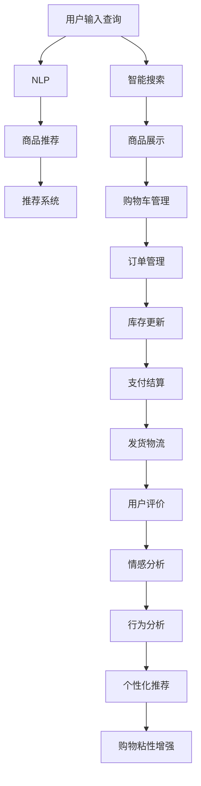

                 

## 1. 背景介绍

在快速发展的电子商务时代，如何提升用户购物体验，增强用户粘性，成为了众多电商平台和品牌关注的焦点。通过先进的AI技术，可以大幅提升购物流程的智能化程度，使用户购物体验更加流畅、个性、高效。本博客将详细介绍如何利用AI技术，特别是通过自然语言处理（NLP）和推荐系统，提升用户的购物粘性。

## 2. 核心概念与联系

### 2.1 核心概念概述

- **自然语言处理（NLP）**：自然语言处理是一种使计算机能够理解和生成人类语言的技术。它在电商平台中主要用于智能客服、商品描述解析、情感分析等。
- **推荐系统**：推荐系统根据用户的历史行为和兴趣，向用户推荐可能感兴趣的商品或服务，以提升用户体验和购物转化率。
- **购物车、订单管理**：电商平台的核心功能之一，通过AI技术可以提升购物车管理、订单生成的自动化程度。
- **智能搜索**：AI技术可以优化搜索引擎算法，提升商品搜索结果的相关性和准确性。

这些核心概念通过AI技术相联系，共同构成了提升用户购物粘性的技术框架。

### 2.2 核心概念原理和架构的 Mermaid 流程图



## 3. 核心算法原理 & 具体操作步骤

### 3.1 算法原理概述

提升用户购物粘性的核心在于通过AI技术，精准理解用户需求，并提供个性化、高效、便捷的购物体验。这主要通过以下几个方面实现：

1. **用户行为分析**：通过NLP技术分析用户评论、搜索记录、点击行为等数据，理解用户需求。
2. **个性化推荐**：根据用户行为和兴趣，提供个性化商品推荐。
3. **智能客服**：通过聊天机器人解答用户疑问，提升购物体验。
4. **购物车、订单管理优化**：利用AI技术自动化购物车管理、订单生成和处理，提升购物效率。
5. **智能搜索优化**：优化搜索引擎算法，提升搜索结果的相关性和准确性。

### 3.2 算法步骤详解

**Step 1: 数据收集与预处理**

- 收集用户的历史行为数据，包括浏览记录、购买记录、评论、评分等。
- 使用NLP技术对用户评论进行情感分析，理解用户的满意度和需求。
- 通过正则表达式、分词、实体识别等技术，对用户搜索词进行预处理，去除噪音和无关词汇。

**Step 2: 用户行为建模**

- 使用协同过滤、矩阵分解等方法，构建用户兴趣模型。
- 引入时间因素，考虑用户兴趣随时间变化的趋势。
- 考虑用户行为的冷启动问题，采用基线模型或冷启动策略。

**Step 3: 个性化推荐**

- 使用深度学习模型，如基于深度神经网络的推荐模型，进行个性化推荐。
- 结合用户历史行为和实时行为，进行动态推荐。
- 引入多样性损失和用户满意度损失，优化推荐算法。

**Step 4: 智能客服**

- 使用聊天机器人或自然语言处理技术，提供24/7的智能客服。
- 通过对话记录和用户反馈，不断优化智能客服的应答策略和语料库。
- 使用预训练语言模型，提升自然语言理解和生成能力。

**Step 5: 购物车、订单管理优化**

- 利用AI技术优化购物车推荐算法，推荐用户可能感兴趣的商品。
- 自动化订单生成和处理，减少人工干预。
- 实时更新库存信息，提升用户体验和订单处理效率。

**Step 6: 智能搜索优化**

- 使用深度学习模型，优化搜索引擎算法。
- 引入特征提取、文本分类等技术，提升搜索结果的相关性和多样性。
- 实时更新商品信息，确保搜索结果的及时性。

### 3.3 算法优缺点

**优点：**

- 提升用户体验：通过个性化推荐和智能客服，提升用户购物体验，增强用户粘性。
- 提高转化率：通过优化推荐算法和搜索算法，提高商品推荐的准确性和相关性，提升转化率。
- 减少人工成本：通过自动化购物车管理、订单处理等，减少人工干预，提升运营效率。

**缺点：**

- 数据隐私问题：需要收集和处理大量用户数据，可能涉及隐私问题。
- 算法复杂性：推荐系统和智能客服等技术复杂，需要较高技术门槛和成本投入。
- 模型过拟合：如果模型过于复杂，可能出现过拟合问题，导致推荐效果下降。

### 3.4 算法应用领域

这些AI技术在多个电商和零售领域有广泛应用，包括但不限于：

- 电子商务平台：如Amazon、淘宝、京东等。
- 零售品牌：如Zara、H&M、Nike等。
- 在线旅游平台：如Booking.com、Airbnb等。
- 餐饮外卖平台：如美团、饿了么等。

## 4. 数学模型和公式 & 详细讲解 & 举例说明

### 4.1 数学模型构建

以推荐系统为例，构建基于用户行为矩阵的协同过滤模型。设用户集合为 $U$，商品集合为 $I$，用户对商品的评分矩阵为 $R_{UI}$，用户行为矩阵为 $X_{UI}$。模型的目标是最大化用户满意度和推荐物品的相关性。

**目标函数**：

$$
\max_{\theta} \sum_{u\in U}\sum_{i\in I}\left(R_{ui}+\log \sigma(z_u^\top X_i)\right)-\lambda\left\|W\right\|_F^2
$$

其中 $z_u$ 和 $X_i$ 分别为用户和商品的嵌入向量，$\sigma$ 为激活函数，$W$ 为模型参数。

**损失函数**：

$$
L = \frac{1}{2}\left\|R_{UI}-\sigma(X_{UI}W)\right\|_F^2+\lambda\left\|W\right\|_F^2
$$

### 4.2 公式推导过程

- 用户行为矩阵 $X_{UI}$ 和用户评分矩阵 $R_{UI}$ 通过深度学习模型映射为用户嵌入向量 $z_u$ 和商品嵌入向量 $z_i$。
- 嵌入向量通过权重矩阵 $W$ 进行线性变换，得到用户对商品的预测评分 $\hat{R}_{ui} = z_u^\top W z_i$。
- 引入激活函数 $\sigma$，增加模型的非线性能力。
- 使用均方误差损失函数 $L$ 和正则化项 $\lambda\left\|W\right\|_F^2$ 进行模型训练。

### 4.3 案例分析与讲解

以Amazon为例，分析其个性化推荐系统的设计。Amazon使用基于深度学习的推荐模型，根据用户的历史行为数据，动态生成个性化推荐。具体步骤如下：

1. 收集用户的历史行为数据，包括浏览记录、购买记录、评论等。
2. 使用深度学习模型对用户行为数据进行建模，得到用户嵌入向量 $z_u$。
3. 使用协同过滤模型对商品进行建模，得到商品嵌入向量 $z_i$。
4. 计算用户对商品的预测评分 $\hat{R}_{ui} = z_u^\top W z_i$。
5. 根据预测评分和实际评分，使用均方误差损失函数进行模型训练。
6. 利用训练好的模型，实时生成个性化推荐结果。

## 5. 项目实践：代码实例和详细解释说明

### 5.1 开发环境搭建

开发环境搭建包括选择合适的编程语言和框架。以Python和TensorFlow为例，搭建开发环境的步骤如下：

1. 安装Python和TensorFlow：
```bash
sudo apt-get install python3
pip install tensorflow
```

2. 安装相关依赖包：
```bash
pip install pandas numpy scikit-learn sklearn
```

### 5.2 源代码详细实现

以下是一个简单的推荐系统代码实现，用于对用户行为数据进行建模和推荐：

```python
import tensorflow as tf
import numpy as np
import pandas as pd

# 读取用户行为数据
data = pd.read_csv('user_behavior.csv')

# 构建用户-商品评分矩阵
R = np.zeros((len(data), len(data.columns)))
for i in range(len(data)):
    R[i, data.columns.get_loc(data.iloc[i, 0])] = data.iloc[i, 1]

# 构建用户行为矩阵
X = np.zeros((len(data), len(data.columns)))
for i in range(len(data)):
    X[i, data.columns.get_loc(data.iloc[i, 0])] = data.iloc[i, 1]

# 构建深度学习模型
model = tf.keras.Sequential([
    tf.keras.layers.Dense(32, activation='relu'),
    tf.keras.layers.Dense(1)
])

# 定义损失函数
loss_fn = tf.keras.losses.MeanSquaredError()

# 训练模型
model.compile(optimizer='adam', loss=loss_fn)
model.fit(X, R, epochs=10)

# 生成推荐结果
test_data = np.array([[1], [2]])
predictions = model.predict(test_data)
print(predictions)
```

### 5.3 代码解读与分析

以上代码实现了一个简单的深度学习推荐模型。具体步骤如下：

1. 读取用户行为数据，构建用户-商品评分矩阵 $R$ 和用户行为矩阵 $X$。
2. 构建深度学习模型，包含两个全连接层，使用ReLU激活函数。
3. 定义均方误差损失函数。
4. 使用Adam优化器训练模型。
5. 使用训练好的模型生成推荐结果。

### 5.4 运行结果展示

运行以上代码，可以生成推荐结果，展示模型对新用户行为的预测评分。

## 6. 实际应用场景

### 6.1 智能客服

智能客服在提升用户体验和减少人工成本方面发挥了重要作用。例如，Amazon使用聊天机器人Alexa，通过自然语言处理技术，提供24/7的客户服务。智能客服可以解答用户疑问，处理退换货请求，提升用户满意度。

### 6.2 个性化推荐

个性化推荐系统在提高转化率和提升用户体验方面具有显著效果。例如，Amazon使用基于深度学习的推荐模型，根据用户的历史行为数据，动态生成个性化推荐。推荐系统通过深度神经网络，挖掘用户兴趣和商品属性之间的关系，生成精准的推荐结果。

### 6.3 购物车管理

购物车管理是电商平台的核心功能之一。通过AI技术，可以优化购物车推荐算法，推荐用户可能感兴趣的商品。例如，Amazon使用实时推荐算法，动态更新购物车商品，提升购物体验。

### 6.4 智能搜索

智能搜索优化是提升用户体验的重要手段。例如，Google和百度使用深度学习模型优化搜索引擎算法，提升搜索结果的相关性和准确性。

## 7. 工具和资源推荐

### 7.1 学习资源推荐

- **《推荐系统实战》**：介绍推荐系统的基本概念、算法和实际应用，适合初学者和从业者阅读。
- **Coursera的《Machine Learning》课程**：斯坦福大学的经典课程，介绍机器学习的基本理论和实践技巧。
- **Kaggle竞赛**：通过参与Kaggle竞赛，积累实际项目经验，提升算法设计和数据处理能力。

### 7.2 开发工具推荐

- **TensorFlow**：强大的深度学习框架，支持多种深度学习模型和优化器。
- **PyTorch**：灵活易用的深度学习框架，适合研究和快速迭代开发。
- **Jupyter Notebook**：强大的交互式开发环境，支持代码块、图形和Markdown等多种格式。

### 7.3 相关论文推荐

- **“Projecting users and items into a latent space to recommend products”**：经典协同过滤推荐模型，详细介绍协同过滤的基本思想和算法。
- **“Attention is All You Need”**：介绍Transformer模型，深度学习领域的重大突破，可用于推荐系统和智能客服。
- **“Deep Neural Networks for Large-Scale Recommender Systems: A Case Study”**：使用深度神经网络进行推荐系统的实践案例，展示深度学习模型的优势和挑战。

## 8. 总结：未来发展趋势与挑战

### 8.1 总结

通过AI技术，电商平台可以大幅提升用户体验和购物粘性。本博客详细介绍了如何利用NLP和推荐系统，优化电商平台的购物流程，提升用户满意度。

### 8.2 未来发展趋势

未来的AI技术将进一步提升电商平台的智能化程度，主要趋势包括：

- **深度学习模型的应用**：随着深度学习技术的发展，更多复杂模型将被应用于推荐系统和智能客服。
- **多模态数据融合**：将视觉、语音等多模态数据与文本数据结合，提升推荐系统的准确性和用户粘性。
- **个性化推荐**：根据用户兴趣和行为，生成更加个性化、精准的推荐结果。
- **实时化推荐**：引入实时数据，动态生成推荐结果，提升用户体验。

### 8.3 面临的挑战

尽管AI技术在电商领域取得了显著成效，但仍面临诸多挑战：

- **数据隐私**：电商平台需要收集和处理大量用户数据，可能涉及隐私问题。
- **算法复杂性**：深度学习模型复杂，需要较高技术门槛和成本投入。
- **模型泛化性**：深度学习模型容易过拟合，导致推荐效果下降。
- **用户接受度**：部分用户可能对智能推荐和智能客服等技术持怀疑态度，影响应用推广。

### 8.4 研究展望

未来的研究应从以下几个方面进行：

- **算法优化**：优化推荐算法和智能客服算法，提升模型的准确性和泛化能力。
- **多模态数据融合**：将多种数据源融合，提升推荐系统的综合能力。
- **隐私保护**：研究隐私保护技术，确保用户数据的安全和隐私。
- **用户接受度提升**：通过技术透明化和用户教育，提升用户对AI技术的接受度和满意度。

## 9. 附录：常见问题与解答

### 常见问题与解答

**Q1: 如何处理数据不平衡问题？**

A: 数据不平衡问题在推荐系统中比较常见。可以采用重采样技术，如过采样和欠采样，或引入不平衡学习算法，如SMOTE和ADASYN。

**Q2: 如何评估推荐系统的效果？**

A: 推荐系统的效果评估通常使用精确率、召回率、F1值等指标，结合A/B测试等方法，评估推荐系统的实际效果。

**Q3: 如何优化智能客服的应答策略？**

A: 智能客服的应答策略可以通过人工标注和机器学习优化。可以使用强化学习算法，不断优化客服应答策略。

**Q4: 如何优化购物车推荐算法？**

A: 购物车推荐算法可以通过多臂赌博机模型、协同过滤模型等进行优化。可以引入时间因素，考虑用户兴趣随时间变化的趋势。

**Q5: 如何优化智能搜索算法？**

A: 智能搜索算法可以通过深度学习模型进行优化。可以使用文本分类、语义分析等技术，提升搜索结果的相关性和准确性。

---

作者：禅与计算机程序设计艺术 / Zen and the Art of Computer Programming

