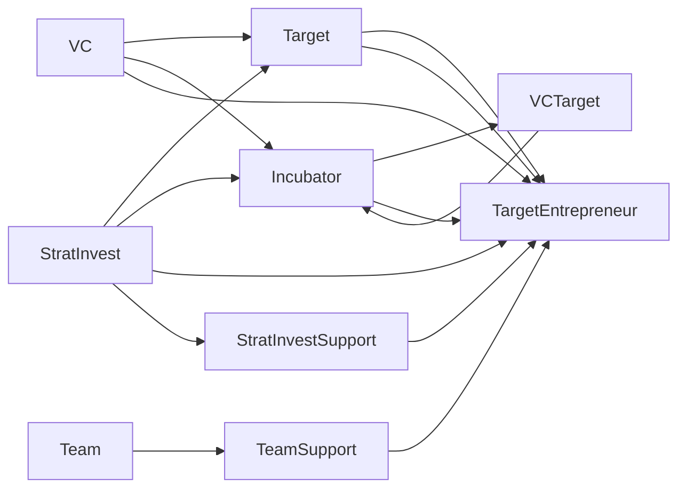

                 

# 孵化器和大厂战投的崛起

## 1. 背景介绍

在当前这个充满变数和机遇的数字化时代，技术的快速迭代和市场需求的多样化，使得创新创业和科技投资成为了最前沿的领域。同时，科技巨头的战略投资和创新孵化器的高速发展，为初创企业提供了宝贵的成长资源和市场机遇。本文将深入探讨孵化器和大厂战投的崛起背景、核心概念、操作方法，以及未来发展趋势。

### 1.1 问题由来

近年来，科技创新的爆发式增长，吸引了全球无数的初创企业和投资机构。然而，对于很多初创公司而言，如何在大环境中快速成长并实现价值最大化，成为摆在面前的一大难题。尤其是在人工智能、云计算、大数据等高投入、高风险的科技领域，创新难度和市场不确定性愈发凸显。在这一背景下，孵化器和科技巨头的战投策略成为企业成长的加速器，通过资源整合、技术支持、市场布局等方式，助力初创公司成长为行业内的佼佼者。

## 2. 核心概念与联系

### 2.1 核心概念概述

为了更好地理解孵化器和战投的崛起背景和核心概念，下面将对关键术语进行阐述。

**孵化器（Incubator）**：是一种旨在支持初创企业成长的机构，提供包括办公空间、资本支持、咨询服务、技术指导等在内的全方位资源支持。孵化器通常有特定的投资理念和目标，侧重于帮助企业成长并实现价值最大化。

**风险投资（Venture Capital，简称VC）**：一种以提供种子期、早期或中期资金为主要目的的投资方式，旨在支持初创企业在技术和市场方面取得突破，进而实现价值增值。VC通常由专业的投资机构和天使投资人提供。

**战投（Strategic Investment）**：是一种由大型企业发起的投资行为，旨在通过战略合作、资源整合等方式，获取目标企业的发展机会，提升自身的竞争力和市场布局。战投通常强调长期合作和战略协同，旨在为企业的长期发展奠定坚实基础。

以上三个概念虽然有所不同，但它们在促进企业成长、提升市场竞争力方面具有相同的核心目标，并且常常互相协作，形成支持初创公司成长的强大生态系统。

### 2.2 核心概念原理和架构的 Mermaid 流程图



通过这幅流程图可以看出，孵化器和战投机构作为连接初创企业和市场的重要纽带，提供了从资源提供到市场支持的综合服务。同时，战投通过长期战略合作，为企业带来了深远的影响力。

## 3. 核心算法原理 & 具体操作步骤

### 3.1 算法原理概述

在孵化器和战投的崛起过程中，主要运用了以下核心算法：

1. **数据分析与市场洞察**：通过对海量数据的分析和挖掘，识别出潜在的市场机会和市场需求，形成对初创企业的产品、市场、技术等方面的深入洞察。

2. **风险评估与投资决策**：利用风险评估模型，如蒙特卡洛模拟、决策树等，对初创企业的投资价值进行评估，并在此基础上进行投资决策。

3. **资源整合与协同效应**：通过对内部资源和外部资源的整合，形成强大的技术、资金、市场等资源池，通过合作、并购等方式提升企业的综合竞争力。

### 3.2 算法步骤详解

**步骤一：数据分析与市场洞察**

1. **数据收集与处理**：从不同渠道收集数据，包括行业报告、市场调研、公开数据、企业财报等，并进行清洗和整理。

2. **数据建模与分析**：利用机器学习、数据分析等技术，对数据进行建模和分析，挖掘出关键的市场动向和趋势。

3. **市场洞察形成**：基于数据分析结果，形成对市场环境的深入理解，包括市场需求、竞争对手、技术趋势等。

**步骤二：风险评估与投资决策**

1. **风险评估**：对初创企业的团队、产品、市场等方面进行详细的风险评估，形成风险矩阵。

2. **投资决策**：基于风险评估结果，决定是否进行投资，并进行投资规模、投资方式的决策。

**步骤三：资源整合与协同效应**

1. **内部资源整合**：通过并购、内部重组等方式，将不同业务线、团队、技术进行整合，提升资源利用效率。

2. **外部资源整合**：通过战略合作、联盟等方式，与其他企业形成资源共享、市场协同的生态系统。

3. **协同效应提升**：通过跨部门的合作，形成技术、市场、运营等方面的协同效应，提升企业的整体竞争力。

### 3.3 算法优缺点

**优点**：

1. **加速企业成长**：通过资源整合和市场洞察，帮助初创企业快速成长，缩短从创立到市场化的周期。

2. **提升资源利用效率**：通过战略合作和资源整合，提升企业资源利用效率，降低运营成本。

3. **降低投资风险**：通过详细的市场洞察和风险评估，降低投资风险，增加投资成功率。

**缺点**：

1. **依赖性强**：孵化器和战投机构与初创企业之间的合作，对孵化器或战投机构的资源、能力、策略等方面依赖性较强。

2. **退出难度大**：对企业投资后，孵化器和战投机构可能会面临退出难度大、时间周期长的挑战。

3. **利益冲突**：在利益共享和控制权分配上，孵化器和战投机构可能与初创企业产生利益冲突。

### 3.4 算法应用领域

**初创企业孵化**：孵化器通过提供办公空间、资金、技术支持等，帮助初创企业快速成长，形成企业规模效应。

**企业并购与重组**：通过战略并购和内部重组，整合不同企业资源，提升企业综合竞争力。

**技术孵化与商业化**：通过孵化具有高成长潜力的技术项目，加速技术商业化进程，形成新的市场增长点。

**资本市场布局**：通过战投行为，在资本市场形成广泛的布局，增强企业的市场竞争力。

## 4. 数学模型和公式 & 详细讲解 & 举例说明

### 4.1 数学模型构建

在孵化器和战投的崛起过程中，数学模型的构建和应用起到了关键作用。下面将详细介绍其中的几个重要模型：

1. **市场机会模型**：通过回归分析等方法，预测市场需求和增长趋势，识别市场机会。

2. **风险评估模型**：利用蒙特卡洛模拟、决策树等方法，评估初创企业的投资风险。

3. **协同效应模型**：通过计算整合前后企业各项指标的提升幅度，评估资源整合的协同效应。

### 4.2 公式推导过程

**市场机会模型**：

$$\text{Market Opportunity} = \frac{e^{\text{Market Demand Growth Rate}} - 1}{e^{\text{Market Demand Growth Rate}} - 1}$$

该公式通过指数增长模型，预测市场需求的增长趋势，从而识别出市场机会。

**风险评估模型**：

$$\text{Risk} = \text{ROI} \times \text{Failure Rate}$$

该公式通过计算投资回报率和项目失败率，评估初创企业的投资风险。

**协同效应模型**：

$$\text{Synergy} = \frac{\text{Post-Merger Revenue} - \text{Pre-Merger Revenue}}{\text{Pre-Merger Revenue}}$$

该公式通过计算整合前后企业收入的提升幅度，评估资源整合的协同效应。

### 4.3 案例分析与讲解

**案例一：谷歌的战投战略**

谷歌通过战投行为，投资了大量初创企业，如Waymo、DeepMind等，不仅在AI、自动驾驶等领域取得了突破性进展，还获得了大量的技术创新和市场布局。通过整合这些创新技术和企业资源，谷歌提升了自身在技术、市场等方面的综合竞争力。

**案例二：阿里巴巴的孵化器**

阿里巴巴的“阿里巴巴诸暨孵化器”通过提供创业基金、技术支持、市场资源等，帮助众多初创企业快速成长，形成了如盒马鲜生、菜鸟网络等具有强大市场竞争力的企业。通过孵化器的资源整合，阿里巴巴在电商、物流等领域形成了完整的生态系统，进一步巩固了市场地位。

## 5. 项目实践：代码实例和详细解释说明

### 5.1 开发环境搭建

在进行孵化器和大厂战投的分析时，需要搭建相应的开发环境，以支持数据分析、建模、仿真等计算任务。具体步骤如下：

1. **安装Python环境**：选择Python 3.7及以上版本，并使用虚拟环境管理工具，如Anaconda。

2. **安装数据处理库**：如Pandas、NumPy、SciPy等，用于数据清洗、处理和分析。

3. **安装机器学习库**：如Scikit-learn、TensorFlow、PyTorch等，用于模型训练和仿真。

4. **安装可视化工具**：如Matplotlib、Seaborn、Bokeh等，用于数据可视化。

5. **安装计算资源管理工具**：如Docker、Kubernetes等，用于高效管理计算资源。

### 5.2 源代码详细实现

下面以阿里巴巴诸暨孵化器为例，展示如何通过Python代码进行数据分析和市场洞察：

```python
import pandas as pd
import numpy as np
import matplotlib.pyplot as plt
from sklearn.linear_model import LinearRegression

# 读取数据
data = pd.read_csv('alibaba_investment.csv')

# 数据清洗
data = data.dropna()

# 数据分析
market_growth = data['Market Demand Growth Rate']
market_opportunity = 1 / (1 - np.exp(-market_growth))

# 市场机会模型
model = LinearRegression()
market_opportunity_model = model.fit(market_growth, market_opportunity)
plt.scatter(market_growth, market_opportunity)
plt.plot(market_growth, market_opportunity_model.predict(market_growth), color='red')
plt.show()
```

### 5.3 代码解读与分析

**代码解读**：

1. **数据读取**：通过Pandas库读取数据文件。

2. **数据清洗**：删除缺失值，保持数据的完整性。

3. **数据分析**：计算市场需求的增长率，并利用线性回归模型预测市场机会。

4. **可视化**：通过Matplotlib库绘制数据分布和模型预测结果。

**分析**：

该代码段实现了对阿里巴巴投资数据的初步分析，通过线性回归模型预测市场机会，并绘制数据分布图。这有助于进一步挖掘市场趋势和投资机会，为孵化器和大厂战投的决策提供数据支持。

### 5.4 运行结果展示

```python
# 运行结果展示
# 数据分布图
plt.scatter(market_growth, market_opportunity)

# 市场机会模型预测
plt.plot(market_growth, market_opportunity_model.predict(market_growth), color='red')
```

通过运行结果图，可以直观地看到市场需求增长率和市场机会之间的关系，以及线性回归模型的预测效果。

## 6. 实际应用场景

### 6.1 初创企业孵化

在初创企业孵化过程中，孵化器和大厂战投的角色不可或缺。通过资源整合和市场洞察，孵化器可以迅速发现并培养高成长潜力的初创企业，加速其发展，形成新的市场增长点。

**应用场景**：

1. **办公空间**：提供现代化的办公空间，吸引初创企业入驻。

2. **资金支持**：提供创业基金，解决初创企业的初期资金需求。

3. **技术指导**：提供技术专家指导，帮助初创企业解决技术难题。

4. **市场推广**：利用孵化器品牌和资源，帮助初创企业推广产品。

### 6.2 企业并购与重组

通过战略并购和内部重组，企业可以迅速扩展市场、提升资源利用效率。战投机构在这一过程中起到了关键作用。

**应用场景**：

1. **战略并购**：通过并购获得目标企业的技术、市场、客户资源，提升自身竞争力。

2. **内部重组**：通过内部重组，整合不同业务线、技术团队，提升资源利用效率。

3. **市场协同**：通过跨部门合作，形成技术、市场、运营等方面的协同效应。

### 6.3 技术孵化与商业化

孵化器在推动技术商业化进程中，发挥着关键作用。通过提供全方位的资源支持，帮助具有高成长潜力的技术项目快速实现商业化。

**应用场景**：

1. **技术支持**：提供技术专家和实验室资源，帮助技术项目实现突破。

2. **市场推广**：利用孵化器品牌和资源，帮助技术项目推广产品。

3. **商业模式设计**：提供商业咨询和市场洞察，帮助技术项目设计商业模式。

### 6.4 资本市场布局

通过战投行为，企业可以迅速在资本市场形成广泛的布局，增强市场竞争力。

**应用场景**：

1. **长期投资**：通过战投行为，获得长期资本支持，提升企业的市场竞争力。

2. **短期融资**：通过战投行为，获得短期融资，支持企业的发展和扩张。

3. **市场布局**：通过战投行为，布局关键领域的市场，形成战略优势。

## 7. 工具和资源推荐

### 7.1 学习资源推荐

为了深入了解孵化器和大厂战投的崛起背景和核心概念，推荐以下学习资源：

1. **《科技创新创业：理论与实践》**：该书籍系统介绍了科技创新的原理和创业的实践方法，涵盖孵化器、战投机构在企业成长中的角色和作用。

2. **《风险投资实战指南》**：该书介绍了风险投资的操作流程和实战技巧，对初创企业融资、风险评估等方面有详细讲解。

3. **《阿里巴巴之道》**：该书详细介绍了阿里巴巴的战略布局和孵化器机制，是了解阿里巴巴孵化器运作的优秀案例。

4. **《谷歌战略投资与市场布局》**：该书详细介绍了谷歌的战略投资案例，对谷歌的战投行为有深入分析。

5. **《孵化器运营管理》**：该书介绍了孵化器的运营管理和市场布局策略，是孵化器管理者的必读书籍。

### 7.2 开发工具推荐

孵化器和大厂战投的崛起涉及数据分析、建模、仿真等多个环节，推荐以下开发工具：

1. **Python**：简单易学、功能强大的编程语言，是数据科学和机器学习的主流语言。

2. **Jupyter Notebook**：交互式编程环境，适合进行数据分析和模型验证。

3. **TensorFlow**：深度学习框架，提供丰富的机器学习模型和工具。

4. **Scikit-learn**：机器学习库，提供简单易用的机器学习算法和工具。

5. **Matplotlib**：绘图库，提供丰富的绘图功能。

6. **Seaborn**：数据可视化库，提供美观的图表和统计分析。

7. **Bokeh**：交互式数据可视化工具，适合创建交互式图表和仪表盘。

### 7.3 相关论文推荐

为了深入理解孵化器和大厂战投的崛起背景和核心概念，推荐以下相关论文：

1. **《初创企业孵化器的作用和绩效评估》**：该论文分析了孵化器对初创企业成长的作用和绩效评估方法。

2. **《风险投资与企业成长关系研究》**：该论文分析了风险投资对企业成长的影响和作用机制。

3. **《大厂战投对市场竞争力的影响》**：该论文分析了大厂战投行为对市场竞争力的影响和作用机制。

4. **《企业并购与重组的协同效应》**：该论文分析了并购与重组的协同效应及其影响。

5. **《技术孵化与商业化路径选择》**：该论文分析了技术孵化与商业化路径的选择和实施方法。

## 8. 总结：未来发展趋势与挑战

### 8.1 研究成果总结

孵化器和大厂战投在推动企业成长、提升市场竞争力等方面起到了关键作用，其崛起背景和核心概念涉及数据分析、风险评估、资源整合等多个方面。通过对这些核心概念的深入理解，可以为企业的孵化和成长提供有力的支持。

### 8.2 未来发展趋势

在未来的发展中，孵化器和大厂战投将继续发挥重要作用，同时也会面临新的挑战和机遇。以下是一些可能的趋势：

1. **数字化转型加速**：随着数字化技术的普及，孵化器和战投机构将更加注重数字化转型，提升运营效率和市场响应速度。

2. **人工智能和大数据应用深化**：通过AI和大数据技术，孵化器和战投机构将更深入地挖掘市场需求和投资机会，形成更加精准的决策支持。

3. **全球化布局拓展**：孵化器和战投机构将更注重全球化布局，通过跨国合作和投资，提升企业的市场竞争力。

4. **可持续发展与社会责任**：孵化器和战投机构将更加注重可持续发展和社会责任，推动企业实现长期健康发展。

### 8.3 面临的挑战

孵化器和大厂战投在崛起过程中也面临诸多挑战，以下是一些可能的挑战：

1. **资源整合难度大**：企业间资源整合和协同效应提升难度较大，需要更多的协调和沟通。

2. **市场环境变化快**：市场环境变化快，需要快速适应和调整投资策略。

3. **风险管理复杂**：投资风险管理复杂，需要更加科学的风险评估和风险控制方法。

4. **退出机制不畅**：退出机制不畅，容易导致投资周期长、回报周期慢。

5. **技术创新压力**：技术创新速度快，需要孵化器和战投机构持续跟进和支持。

### 8.4 研究展望

未来，孵化器和大厂战投将继续在推动企业成长、提升市场竞争力等方面发挥重要作用。为了应对上述挑战，需要在以下方面进行研究：

1. **数字化转型与大数据应用**：进一步深化AI和大数据技术的应用，提升运营效率和市场响应速度。

2. **全球化布局与可持续发展**：拓展全球化布局，注重可持续发展和社会责任，推动企业长期健康发展。

3. **风险管理与投资策略优化**：优化投资策略，提升风险管理能力，实现更加精准和高效的投资决策。

4. **技术创新支持与市场拓展**：支持技术创新，拓展市场空间，形成新的市场增长点。

5. **退出机制优化**：优化退出机制，提升投资回报率，实现资本的快速循环和增值。

## 9. 附录：常见问题与解答

### 9.1 问题一：孵化器和大厂战投的区别是什么？

**答案**：孵化器主要提供办公空间、资金支持、技术指导等资源，帮助初创企业快速成长。而战投主要通过战略合作、资源整合等方式，提升企业的综合竞争力和市场布局。

### 9.2 问题二：如何选择合适的孵化器或战投机构？

**答案**：选择孵化器或战投机构时，需要综合考虑其资源、能力、投资理念、成功案例等因素，并进行详细的尽职调查。

### 9.3 问题三：如何评估孵化器和战投的退出机制？

**答案**：评估退出机制时，需要考虑退出时间、退出方式、退出成本等因素，确保投资回报。

### 9.4 问题四：孵化器和大厂战投的合作模式有哪些？

**答案**：孵化器和大厂战投的合作模式包括资源共享、战略合作、并购重组等，具体合作模式应根据企业实际情况和需求进行选择。

### 9.5 问题五：如何利用AI和大数据技术提升孵化器和大厂战投的决策支持能力？

**答案**：利用AI和大数据技术，对海量数据进行分析和挖掘，形成市场洞察和风险评估模型，提升决策支持能力。

---

作者：禅与计算机程序设计艺术 / Zen and the Art of Computer Programming

