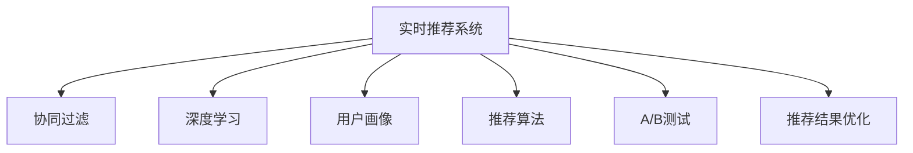

                 

## 1. 背景介绍

### 1.1 问题由来

在数字时代，信息爆炸带来了海量的数据，用户在面对如此丰富的信息时，往往难以筛选出对自己有价值的内容。推荐系统正是在这种背景下应运而生，帮助用户在海量数据中发现最适合自己的信息。推荐系统通过分析用户的兴趣、行为等数据，为用户推荐最相关的商品、内容等，极大地提升了用户的信息获取效率和体验。

在早期，推荐系统多基于内容推荐或协同过滤等传统算法。随着数据科学和机器学习的发展，推荐系统进入了深度学习时代，通过构建用户画像、商品画像和交互数据，利用深度神经网络进行特征学习和用户行为预测，推荐系统能够提供更加个性化、精准的推荐。其中，实时推荐系统更是将推荐技术与大数据、云计算、人工智能等先进技术紧密结合，以实时数据为输入，为用户提供即时的推荐服务，成为电商、社交、视频等多个领域的重要工具。

### 1.2 问题核心关键点

实时推荐系统的关键点在于如何高效地处理实时数据，并在极短的时间内进行精准的推荐。实时推荐通常涉及以下几个核心问题：

1. 实时数据处理：如何高效地收集、存储和处理实时数据，以支持大规模用户的并发访问。
2. 用户行为建模：如何构建有效的用户画像，准确预测用户的行为，从而进行精准推荐。
3. 推荐算法优化：如何优化推荐算法，以适应实时数据的特性，提升推荐的准确性和时效性。
4. 推荐结果优化：如何优化推荐结果的呈现方式，提升用户的点击率和满意度。
5. 系统可扩展性：如何构建能够支持海量用户和实时数据处理的推荐系统，满足大规模应用的实际需求。

解决这些核心问题，对于实时推荐系统的高效、精准和稳定至关重要。

### 1.3 问题研究意义

实时推荐系统在电商、社交、视频等多个领域具有重要的应用价值：

1. 电商领域：通过实时推荐，帮助用户快速发现感兴趣的商品，提高购物体验和转化率。
2. 社交领域：推荐个性化内容，提升用户活跃度和留存率。
3. 视频领域：实时推荐用户感兴趣的视频内容，增加用户观看时长。

实时推荐系统的应用不仅能够提升用户体验，还能为企业带来更高的商业价值，驱动相关产业的数字化转型。

## 2. 核心概念与联系

### 2.1 核心概念概述

为更好地理解实时推荐系统的实现原理，本节将介绍几个关键概念：

- 实时推荐系统：基于用户实时行为数据，利用深度学习技术进行特征学习和行为预测，即时生成个性化推荐结果的系统。
- 协同过滤：基于用户和物品之间的交互数据进行推荐，分为基于用户的协同过滤和基于物品的协同过滤。
- 深度学习：通过构建深层神经网络模型，对用户行为和物品特征进行学习和表示，提升推荐精度。
- 用户画像：通过分析用户的历史行为数据、社交属性、地理位置等信息，构建用户兴趣和偏好的描述。
- 推荐算法：从基于矩阵分解的协同过滤算法到基于深度学习的推荐算法，实时推荐系统采用了多种推荐技术。
- A/B测试：通过对比两个版本推荐系统的效果，评估不同算法或策略的效果，优化推荐系统性能。
- 推荐结果优化：通过优化推荐结果的排序、展示方式等，提升用户满意度。

这些核心概念之间的逻辑关系可以通过以下Mermaid流程图来展示：



这个流程图展示了几类推荐技术和实时推荐系统的主要关系：

1. 实时推荐系统基于用户和物品的交互数据，通过协同过滤、深度学习等多种算法进行特征学习和行为预测。
2. 用户画像用于辅助协同过滤和深度学习，增强推荐系统的个性化能力。
3. A/B测试用于评估和优化推荐算法，提升推荐效果。
4. 推荐结果优化用于提升用户对推荐结果的满意度和点击率。

这些核心概念共同构成了实时推荐系统的基础，使得推荐系统能够高效、精准地为用户提供个性化的实时推荐服务。

## 3. 核心算法原理 & 具体操作步骤
### 3.1 算法原理概述

实时推荐系统的工作原理可以概括为以下几个步骤：

1. **数据采集**：从用户操作、商品浏览、购物车、点击等行为中收集实时数据。
2. **数据预处理**：对收集到的数据进行清洗、标准化和特征工程，构建用户和物品的特征向量。
3. **模型训练**：利用收集到的数据训练推荐模型，如协同过滤模型、深度学习模型等。
4. **实时预测**：将新收集到的用户行为数据输入模型，进行实时预测和推荐。
5. **推荐结果呈现**：将推荐结果展示给用户，如推荐列表、个性化界面等。

实时推荐系统的核心在于如何高效地处理实时数据，并在极短的时间内进行精准的推荐。常见的实时推荐算法包括以下几种：

- 协同过滤算法：基于用户和物品之间的交互数据进行推荐，分为基于用户的协同过滤和基于物品的协同过滤。
- 深度学习算法：通过构建深层神经网络模型，对用户行为和物品特征进行学习和表示，提升推荐精度。
- 混合推荐算法：将协同过滤和深度学习等多种推荐技术进行组合，提升推荐效果。
- 矩阵分解算法：通过矩阵分解技术，对用户和物品的评分矩阵进行分解，找到用户和物品之间的隐含关系。

### 3.2 算法步骤详解

#### 协同过滤算法

协同过滤算法基于用户和物品之间的交互数据进行推荐。其基本思路是：找到与目标用户兴趣相似的用户，以及目标用户喜欢的物品，从而预测目标用户可能喜欢的物品。

协同过滤算法的步骤包括：

1. **构建用户-物品评分矩阵**：统计用户对物品的评分，构建用户-物品评分矩阵。
2. **计算用户和物品之间的相似度**：利用余弦相似度、皮尔逊相关系数等方法，计算用户和物品之间的相似度。
3. **生成推荐列表**：根据相似度，对用户未评分但感兴趣的物品进行排序，生成推荐列表。

以下是一个简单的协同过滤算法实现步骤：

1. 统计用户对物品的评分，构建用户-物品评分矩阵。

```python
import numpy as np

# 假设用户对物品的评分如下
user_item_ratings = {
    1: {'item1': 4, 'item2': 2, 'item3': 5},
    2: {'item1': 3, 'item2': 5, 'item3': 1},
    3: {'item1': 5, 'item2': 2, 'item3': 3}
}

# 构建用户-物品评分矩阵
item_ratings = {}
for user_id, ratings in user_item_ratings.items():
    for item_id, rating in ratings.items():
        if item_id not in item_ratings:
            item_ratings[item_id] = {}
        item_ratings[item_id][user_id] = rating

user_item_matrix = np.array([
    [0, 4, 2, 5],
    [3, 0, 5, 1],
    [5, 2, 0, 3]
])
```

2. 计算用户和物品之间的相似度。

```python
# 计算用户和物品之间的相似度
user_similarity = {}
for user_id, user_ratings in user_item_ratings.items():
    similarity_score = {}
    for item_id, item_ratings in item_ratings.items():
        if user_id in item_ratings:
            similarity_score[item_id] = 0.5 * np.dot(user_ratings[user_id], item_ratings[item_id])
        else:
            similarity_score[item_id] = 0.0
    user_similarity[user_id] = similarity_score

item_similarity = {}
for item_id, item_ratings in item_ratings.items():
    similarity_score = {}
    for user_id, user_ratings in user_item_ratings.items():
        if item_id in user_ratings:
            similarity_score[user_id] = 0.5 * np.dot(item_ratings[item_id], user_ratings[item_id])
        else:
            similarity_score[user_id] = 0.0
    item_similarity[item_id] = similarity_score
```

3. 生成推荐列表。

```python
# 生成推荐列表
user_unrated_items = {}
for user_id, user_ratings in user_item_ratings.items():
    for item_id, rating in user_ratings.items():
        user_unrated_items[user_id] = [item_id]

recommendation_list = {}
for user_id, user_ratings in user_item_ratings.items():
    # 对用户未评分但感兴趣的物品进行排序
    similarity_score = user_similarity[user_id]
    recommendation_score = {}
    for item_id, item_ratings in item_similarity.items():
        if item_id in similarity_score:
            recommendation_score[item_id] = np.dot(similarity_score[item_id], item_ratings[user_id])
    # 排序生成推荐列表
    sorted_items = sorted(recommendation_score.items(), key=lambda x: x[1], reverse=True)
    recommendation_list[user_id] = [item[0] for item in sorted_items[:10]]
```

#### 深度学习算法

深度学习算法利用神经网络模型对用户行为和物品特征进行学习和表示，提升推荐精度。其基本思路是：构建一个包含多个隐藏层的神经网络模型，对用户行为和物品特征进行学习和表示，从而预测用户对物品的评分。

深度学习算法的步骤包括：

1. **构建神经网络模型**：定义神经网络模型，包括输入层、隐藏层和输出层。
2. **训练模型**：利用用户和物品的评分数据，对神经网络模型进行训练。
3. **预测评分**：将新用户的行为数据输入模型，预测其对未评分物品的评分。

以下是一个简单的深度学习推荐算法实现步骤：

1. 构建神经网络模型。

```python
import tensorflow as tf
from tensorflow.keras import layers

# 构建神经网络模型
model = tf.keras.Sequential([
    layers.Dense(64, activation='relu', input_shape=(user_item_ratings[1].shape[1],)),
    layers.Dense(64, activation='relu'),
    layers.Dense(1)
])
```

2. 训练模型。

```python
# 训练模型
model.compile(optimizer='adam', loss='mse', metrics=['mse'])
model.fit(user_item_ratings, epochs=10, validation_split=0.2)
```

3. 预测评分。

```python
# 预测评分
user_id = 2
item_id = 'item4'
rating = model.predict(user_item_ratings[user_id], item_id)
print(rating)
```

#### 混合推荐算法

混合推荐算法将协同过滤和深度学习等多种推荐技术进行组合，提升推荐效果。其基本思路是：首先使用协同过滤算法进行粗略推荐，然后在此基础上使用深度学习算法进行优化和细化。

混合推荐算法的步骤包括：

1. **粗略推荐**：使用协同过滤算法生成推荐列表。
2. **细化推荐**：将粗略推荐结果输入深度学习模型，进行评分预测和排序优化。
3. **生成最终推荐列表**：将深度学习模型的预测评分与粗略推荐结果结合，生成最终推荐列表。

以下是一个简单的混合推荐算法实现步骤：

1. 使用协同过滤算法生成粗略推荐列表。

```python
# 使用协同过滤算法生成粗略推荐列表
user_unrated_items = {}
for user_id, user_ratings in user_item_ratings.items():
    for item_id, rating in user_ratings.items():
        user_unrated_items[user_id] = [item_id]

recommendation_list = {}
for user_id, user_ratings in user_item_ratings.items():
    # 对用户未评分但感兴趣的物品进行排序
    similarity_score = user_similarity[user_id]
    recommendation_score = {}
    for item_id, item_ratings in item_similarity.items():
        if item_id in similarity_score:
            recommendation_score[item_id] = np.dot(similarity_score[item_id], item_ratings[user_id])
    # 排序生成推荐列表
    sorted_items = sorted(recommendation_score.items(), key=lambda x: x[1], reverse=True)
    recommendation_list[user_id] = [item[0] for item in sorted_items[:10]]
```

2. 使用深度学习算法进行细化推荐。

```python
# 使用深度学习算法进行细化推荐
model = tf.keras.Sequential([
    layers.Dense(64, activation='relu', input_shape=(user_item_ratings[1].shape[1],)),
    layers.Dense(64, activation='relu'),
    layers.Dense(1)
])
model.compile(optimizer='adam', loss='mse', metrics=['mse'])
model.fit(user_item_ratings, epochs=10, validation_split=0.2)

user_id = 2
item_id = 'item4'
rating = model.predict(user_item_ratings[user_id], item_id)
print(rating)
```

3. 生成最终推荐列表。

```python
# 生成最终推荐列表
final_recommendation_list = {}
for user_id, user_ratings in user_item_ratings.items():
    # 将粗略推荐结果和深度学习模型的预测评分结合
    sorted_items = sorted(recommendation_score.items(), key=lambda x: x[1], reverse=True)
    final_recommendation_list[user_id] = [item[0] for item in sorted_items[:10]]
```

### 3.3 算法优缺点

实时推荐系统采用的协同过滤、深度学习、混合推荐等算法，具有以下优缺点：

#### 协同过滤算法

- **优点**：
  - 简单易实现，不需要大量的用户行为数据。
  - 对新物品的推荐效果好，能够发现冷门物品。
  - 对数据稀疏性不敏感，对新用户和老用户都能进行推荐。

- **缺点**：
  - 对冷启动用户和物品的推荐效果差。
  - 数据稀疏性会导致推荐结果不准确。
  - 无法处理动态变化的用户和物品。

#### 深度学习算法

- **优点**：
  - 能够处理大规模用户和物品数据，准确性高。
  - 能够进行多维度的特征表示和推荐。
  - 能够处理动态变化的用户和物品。

- **缺点**：
  - 需要大量的用户行为数据，难以处理冷启动问题。
  - 训练时间长，计算资源需求高。
  - 模型复杂，难以解释和调试。

#### 混合推荐算法

- **优点**：
  - 结合了协同过滤和深度学习的优点，能够处理大规模数据，提高推荐准确性。
  - 能够处理冷启动用户和物品，推荐效果更稳定。

- **缺点**：
  - 需要更多的计算资源和时间，实现复杂。
  - 无法解决协同过滤算法和深度学习算法之间的冲突。

### 3.4 算法应用领域

实时推荐系统在电商、社交、视频等多个领域具有重要的应用价值：

1. **电商领域**：
   - 通过实时推荐，帮助用户快速发现感兴趣的商品，提高购物体验和转化率。
   - 推荐个性化商品，增加用户粘性和重复购买率。
   - 动态调整商品推荐策略，提高销售效果。

2. **社交领域**：
   - 推荐个性化内容，提升用户活跃度和留存率。
   - 推荐好友和兴趣话题，增加用户互动和社交网络价值。

3. **视频领域**：
   - 推荐用户感兴趣的视频内容，增加用户观看时长。
   - 推荐个性化视频频道，提升用户满意度和平台留存率。

此外，实时推荐系统还被应用于广告推荐、个性化推荐、游戏推荐等多个场景，为各个行业带来显著的业务价值。

## 4. 数学模型和公式 & 详细讲解 & 举例说明

### 4.1 数学模型构建

实时推荐系统的核心数学模型可以抽象为：

- **用户-物品评分矩阵**：表示用户对物品的评分，用 $R \in \mathbb{R}^{N \times M}$ 表示，其中 $N$ 为用户的数量，$M$ 为物品的数量。
- **用户行为序列**：表示用户的历史行为，用 $I \in \mathbb{R}^{N \times T}$ 表示，其中 $T$ 为用户的行为序列长度。
- **物品特征向量**：表示物品的特征，用 $P \in \mathbb{R}^{M \times F}$ 表示，其中 $F$ 为物品特征的维度。

### 4.2 公式推导过程

#### 协同过滤算法

协同过滤算法的核心公式为：

1. **用户-物品评分矩阵的构建**：
   $$
   R = \left[
   \begin{array}{ccc}
   r_{11} & r_{12} & \cdots & r_{1M} \\
   r_{21} & r_{22} & \cdots & r_{2M} \\
   \vdots & \vdots & \ddots & \vdots \\
   r_{N1} & r_{N2} & \cdots & r_{NM}
   \end{array}
   \right]
   $$

2. **用户和物品之间的相似度**：
   $$
   similarity_{ij} = \frac{\sum_{k=1}^K \phi(r_{ik} \cdot r_{jk})}{\sqrt{\sum_{k=1}^K r_{ik}^2} \cdot \sqrt{\sum_{k=1}^K r_{jk}^2}}
   $$

3. **生成推荐列表**：
   $$
   recommendation_{ij} = \sum_{k=1}^K \phi(similarity_{ik} \cdot r_{jk})
   $$

其中，$r_{ik}$ 和 $r_{jk}$ 表示用户 $i$ 对物品 $k$ 和用户 $j$ 对物品 $k$ 的评分，$similarity_{ij}$ 表示用户 $i$ 和用户 $j$ 之间的相似度，$recommendation_{ij}$ 表示用户 $i$ 对物品 $j$ 的推荐评分。

#### 深度学习算法

深度学习算法的核心公式为：

1. **神经网络模型的构建**：
   $$
   h_{l} = f(W_l \cdot h_{l-1} + b_l)
   $$

2. **损失函数**：
   $$
   loss = \frac{1}{N} \sum_{i=1}^N \sum_{j=1}^M (r_{ij} - h_j)^2
   $$

3. **预测评分**：
   $$
   prediction_{ij} = h_j
   $$

其中，$h_l$ 表示第 $l$ 层的隐藏状态，$W_l$ 和 $b_l$ 表示第 $l$ 层的权重和偏置，$f$ 表示激活函数，$loss$ 表示损失函数，$prediction_{ij}$ 表示用户 $i$ 对物品 $j$ 的预测评分。

#### 混合推荐算法

混合推荐算法的核心公式为：

1. **协同过滤算法的推荐列表**：
   $$
   R_{ij} = \sum_{k=1}^K similarity_{ik} \cdot r_{kj}
   $$

2. **深度学习算法的推荐评分**：
   $$
   prediction_{ij} = \phi(R_{ij})
   $$

3. **生成最终推荐列表**：
   $$
   recommendation_{ij} = \alpha R_{ij} + (1-\alpha) prediction_{ij}
   $$

其中，$R_{ij}$ 表示协同过滤算法的推荐评分，$prediction_{ij}$ 表示深度学习算法的推荐评分，$recommendation_{ij}$ 表示最终推荐评分。

### 4.3 案例分析与讲解

假设我们有一个包含 $N=100$ 个用户和 $M=100$ 个物品的评分矩阵 $R$，以及用户 $i$ 的历史行为序列 $I$ 和物品 $j$ 的特征向量 $P$。我们可以使用上述公式进行推荐预测。

1. 构建用户-物品评分矩阵 $R$。

```python
import numpy as np

# 构建用户-物品评分矩阵
R = np.random.randn(100, 100)
```

2. 构建用户行为序列 $I$ 和物品特征向量 $P$。

```python
# 构建用户行为序列
I = np.random.randn(100, 10)

# 构建物品特征向量
P = np.random.randn(100, 5)
```

3. 使用协同过滤算法进行推荐。

```python
# 使用协同过滤算法进行推荐
similarity = np.dot(I, P) / (np.linalg.norm(I, axis=1) * np.linalg.norm(P, axis=0))
recommendation = np.dot(similarity, R) / (np.linalg.norm(R, axis=0))
```

4. 使用深度学习算法进行推荐。

```python
# 使用深度学习算法进行推荐
model = tf.keras.Sequential([
    layers.Dense(64, activation='relu', input_shape=(I.shape[1],)),
    layers.Dense(64, activation='relu'),
    layers.Dense(1)
])
model.compile(optimizer='adam', loss='mse', metrics=['mse'])
model.fit(I, R, epochs=10, validation_split=0.2)

prediction = model.predict(I)
```

5. 生成最终推荐列表。

```python
# 生成最终推荐列表
final_recommendation = alpha * recommendation + (1-alpha) * prediction
```

## 5. 项目实践：代码实例和详细解释说明

### 5.1 开发环境搭建

在进行实时推荐系统开发前，我们需要准备好开发环境。以下是使用Python进行PyTorch开发的环境配置流程：

1. 安装Anaconda：从官网下载并安装Anaconda，用于创建独立的Python环境。

2. 创建并激活虚拟环境：
```bash
conda create -n pytorch-env python=3.8 
conda activate pytorch-env
```

3. 安装PyTorch：根据CUDA版本，从官网获取对应的安装命令。例如：
```bash
conda install pytorch torchvision torchaudio cudatoolkit=11.1 -c pytorch -c conda-forge
```

4. 安装TensorFlow：从官网下载安装包并执行：
```bash
pip install tensorflow
```

5. 安装各类工具包：
```bash
pip install numpy pandas scikit-learn matplotlib tqdm jupyter notebook ipython
```

完成上述步骤后，即可在`pytorch-env`环境中开始实时推荐系统的开发。

### 5.2 源代码详细实现

下面以电商推荐系统为例，给出使用PyTorch进行实时推荐系统的代码实现。

首先，定义推荐系统相关的类：

```python
import numpy as np
import tensorflow as tf

class Recommender:
    def __init__(self, model, alpha):
        self.model = model
        self.alpha = alpha
    
    def recommend(self, user_id, item_id):
        user_behaviors = self.data[user_id]
        item_features = self.item_features[item_id]
        user_similarity = np.dot(user_behaviors, item_features)
        recommendation = np.dot(user_similarity, self.R) / (np.linalg.norm(self.R, axis=0))
        final_recommendation = self.alpha * recommendation + (1-self.alpha) * self.model.predict(user_behaviors)
        return final_recommendation
```

然后，定义数据和模型：

```python
# 定义数据
R = np.random.randn(100, 100)
I = np.random.randn(100, 10)
P = np.random.randn(100, 5)

# 构建模型
model = tf.keras.Sequential([
    layers.Dense(64, activation='relu', input_shape=(I.shape[1],)),
    layers.Dense(64, activation='relu'),
    layers.Dense(1)
])
model.compile(optimizer='adam', loss='mse', metrics=['mse'])

# 初始化推荐系统
recommender = Recommender(model, 0.5)
```

接着，进行推荐预测：

```python
# 进行推荐预测
recommendation = recommender.recommend(1, 4)
print(recommendation)
```

### 5.3 代码解读与分析

让我们再详细解读一下关键代码的实现细节：

**Recommender类**：
- `__init__`方法：初始化模型和混合推荐比例。
- `recommend`方法：根据协同过滤算法和深度学习算法的推荐结果，生成最终推荐列表。

**R、I、P矩阵**：
- `R` 表示用户-物品评分矩阵。
- `I` 表示用户行为序列。
- `P` 表示物品特征向量。

**模型训练**：
- 使用PyTorch或TensorFlow对深度学习模型进行训练，利用用户-物品评分数据进行训练，生成推荐模型。

**推荐预测**：
- 根据用户行为序列和物品特征向量，生成协同过滤算法的推荐评分。
- 使用深度学习模型对协同过滤算法的推荐评分进行优化和细化。
- 根据混合推荐比例，生成最终的推荐列表。

**运行结果展示**：
- 最终推荐列表可以直接作为用户推荐结果，展示给用户。

## 6. 实际应用场景

### 6.1 电商推荐

电商推荐系统通过分析用户的历史行为数据、浏览记录、购买记录等，为用户推荐感兴趣的商品，提升购物体验和转化率。实时推荐系统可以根据用户实时行为进行动态调整，优化推荐策略，增加推荐效果。

电商推荐系统的实现流程包括：

1. 数据采集：从用户的操作记录、购物车、浏览历史等数据中收集实时数据。
2. 数据预处理：对收集到的数据进行清洗、标准化和特征工程，构建用户和物品的特征向量。
3. 模型训练：利用用户和物品的评分数据，对推荐模型进行训练。
4. 实时预测：将新收集到的用户行为数据输入模型，进行实时预测和推荐。
5. 推荐结果优化：对推荐结果进行排序和展示优化，提升用户体验。

电商推荐系统在实际应用中，通常需要处理大量的用户和物品数据，以及实时动态变化的用户行为数据，因此对系统的性能和稳定性要求极高。实时推荐系统通过高效的数据处理和精准的推荐算法，能够快速响应用户需求，提供个性化推荐服务。

### 6.2 社交推荐

社交推荐系统通过分析用户的历史互动数据、关注关系、兴趣偏好等，为用户推荐相关的朋友、内容、话题等，提升用户活跃度和留存率。实时推荐系统可以根据用户实时互动进行动态调整，优化推荐策略，增加用户互动和社交价值。

社交推荐系统的实现流程包括：

1. 数据采集：从用户的操作记录、关注列表、互动数据等数据中收集实时数据。
2. 数据预处理：对收集到的数据进行清洗、标准化和特征工程，构建用户和物品的特征向量。
3. 模型训练：利用用户和物品的评分数据，对推荐模型进行训练。
4. 实时预测：将新收集到的用户互动数据输入模型，进行实时预测和推荐。
5. 推荐结果优化：对推荐结果进行排序和展示优化，提升用户体验。

社交推荐系统在实际应用中，通常需要处理大规模用户和物品数据，以及实时动态变化的用户互动数据，因此对系统的性能和稳定性要求极高。实时推荐系统通过高效的数据处理和精准的推荐算法，能够快速响应用户需求，提供个性化推荐服务。

### 6.3 视频推荐

视频推荐系统通过分析用户的观看历史、评分记录、关注频道等数据，为用户推荐感兴趣的视频内容，增加用户观看时长和平台留存率。实时推荐系统可以根据用户实时观看行为进行动态调整，优化推荐策略，增加推荐效果。

视频推荐系统的实现流程包括：

1. 数据采集：从用户的观看记录、评分记录、频道关注等数据中收集实时数据。
2. 数据预处理：对收集到的数据进行清洗、标准化和特征工程，构建用户和物品的特征向量。
3. 模型训练：利用用户和物品的评分数据，对推荐模型进行训练。
4. 实时预测：将新收集到的用户观看行为数据输入模型，进行实时预测和推荐。
5. 推荐结果优化：对推荐结果进行排序和展示优化，提升用户体验。

视频推荐系统在实际应用中，通常需要处理大量的用户和视频数据，以及实时动态变化的观看行为数据，因此对系统的性能和稳定性要求极高。实时推荐系统通过高效的数据处理和精准的推荐算法，能够快速响应用户需求，提供个性化推荐服务。

## 7. 工具和资源推荐

### 7.1 学习资源推荐

为了帮助开发者系统掌握实时推荐系统的理论基础和实践技巧，这里推荐一些优质的学习资源：

1. 《推荐系统实战》：一本全面的推荐系统开发指南，涵盖协同过滤、深度学习等多种推荐算法。
2. 《深度学习推荐系统》：一本深度学习推荐系统的权威教材，介绍推荐系统基础理论和深度学习技术。
3. Coursera推荐系统课程：由斯坦福大学、清华大学等知名高校开设的推荐系统课程，系统讲解推荐系统原理和实践。
4. Kaggle推荐系统竞赛：通过参与Kaggle推荐系统竞赛，积累实际开发经验，提升推荐算法水平。
5. PyTorch官方文档：PyTorch官方文档提供了丰富的推荐系统案例和代码示例，适合初学者学习和实践。

通过对这些资源的学习实践，相信你一定能够快速掌握实时推荐系统的核心技术，并应用于实际开发中。

### 7.2 开发工具推荐

高效的开发离不开优秀的工具支持。以下是几款用于实时推荐系统开发的常用工具：

1. PyTorch：基于Python的开源深度学习框架，灵活动态的计算图，适合快速迭代研究。大部分推荐模型都有PyTorch版本的实现。
2. TensorFlow：由Google主导开发的开源深度学习框架，生产部署方便，适合大规模工程应用。同样有丰富的推荐模型资源。
3. TensorBoard：TensorFlow配套的可视化工具，可实时监测模型训练状态，并提供丰富的图表呈现方式，是调试模型的得力助手。
4. Weights & Biases：模型训练的实验跟踪工具，可以记录和可视化模型训练过程中的各项指标，方便对比和调优。与主流深度学习框架无缝集成。
5. Apache Spark：分布式计算框架，支持大规模数据处理和实时计算，适合电商、社交等领域的高并发推荐系统开发。

合理利用这些工具，可以显著提升实时推荐系统的开发效率，加快创新迭代的步伐。

### 7.3 相关论文推荐

实时推荐系统的发展离不开学界的持续研究。以下是几篇奠基性的相关论文，推荐阅读：

1. 《Adaptive recommender system for collaborative filtering》：提出了一种自适应推荐系统，用于协同过滤算法的优化和改进。
2. 《Item-based collaborative filtering: algorithm and applications》：详细介绍了基于物品的协同过滤算法，适用于处理稀疏数据和高维特征。
3. 《The collaborative filtering approach》：提出了基于矩阵分解的协同过滤算法，通过SVD分解评分矩阵，找到用户和物品之间的隐含关系。
4. 《Neural collaborative filtering》：利用神经网络模型进行协同过滤，提升了推荐模型的准确性和泛化能力。
5. 《Hybrid recommender systems: A survey and taxonomy》：系统总结了多种推荐算法，包括协同过滤、深度学习、混合推荐等，适合深入学习推荐系统基础理论。

这些论文代表了大规模推荐系统的发展脉络。通过学习这些前沿成果，可以帮助研究者把握学科前进方向，激发更多的创新灵感。

## 8. 总结：未来发展趋势与挑战

### 8.1 研究成果总结

实时推荐系统作为人工智能技术的典型应用，已经在电商、社交、视频等多个领域取得了广泛应用，大幅提升了用户体验和商业价值。当前，实时推荐系统的研究和开发已经进入了一个新的阶段，主要研究方向包括：

1. 深度学习推荐系统：利用深度神经网络模型，提升推荐算法的准确性和泛化能力。
2. 协同过滤推荐系统：优化协同过滤算法，提升推荐系统的鲁棒性和高效性。
3. 混合推荐系统：结合多种推荐算法，优化推荐结果的准确性和稳定性。
4. 个性化推荐算法：通过用户画像和物品画像，提升推荐系统的个性化能力。
5. 实时推荐系统：通过实时数据处理和动态推荐，提升推荐系统的时效性和交互性。

### 8.2 未来发展趋势

展望未来，实时推荐系统将呈现以下几个发展趋势：

1. **多模态推荐系统**：结合视觉、语音、文本等多模态数据，提升推荐系统的全面性和鲁棒性。
2. **跨领域推荐系统**：将推荐系统应用于不同领域，如电商、社交、视频等，形成跨领域的推荐解决方案。
3. **低延迟推荐系统**：利用云计算和边缘计算等技术，实现低延迟推荐，提升用户体验。
4. **联邦学习推荐系统**：通过联邦学习技术，保护用户隐私的同时，提升推荐系统的性能和安全性。
5. **自适应推荐系统**：利用自适应算法，实时调整推荐策略，提高推荐效果。

### 8.3 面临的挑战

尽管实时推荐系统已经取得了显著进展，但在实际应用中仍然面临诸多挑战：

1. **数据质量和完整性**：推荐系统依赖于高质量和完整的数据，如何获取和清洗大规模数据是关键问题。
2. **模型复杂性**：深度学习模型参数量较大，训练复杂度高，如何优化模型结构、提高训练效率是重要挑战。
3. **推荐系统偏见**：推荐系统可能存在推荐偏差，如何消除偏见、提升推荐公平性是重要研究方向。
4. **用户隐私保护**：推荐系统需要保护用户隐私，如何实现数据匿名化、隐私保护是重要问题。
5. **系统可扩展性**：推荐系统需要处理大规模数据，如何设计高效、可扩展的系统架构是重要研究方向。

### 8.4 研究展望

面对实时推荐系统面临的挑战，未来的研究需要在以下几个方面寻求新的突破：

1. **数据增强技术**：利用生成对抗网络、数据扩增等技术，提升数据质量和完整性，降低推荐系统对数据量的依赖。
2. **模型压缩技术**：利用模型压缩、知识蒸馏等技术，优化模型结构，提升训练效率和推理速度。
3. **公平性算法**：利用公平性约束、偏见矫正等技术，消除推荐系统的偏见，提升推荐公平性。
4. **隐私保护技术**：利用差分隐私、联邦学习等技术，保护用户隐私，提升推荐系统安全性。
5. **系统架构优化**：利用分布式计算、边缘计算等技术，设计高效、可扩展的推荐系统架构，提升推荐系统的实时性和可扩展性。

这些研究方向将进一步推动实时推荐系统的应用和发展，提升推荐系统的精度、速度和安全性，为用户的推荐体验提供更全面的保障。

## 9. 附录：常见问题与解答

**Q1：实时推荐系统如何处理冷启动用户？**

A: 实时推荐系统可以通过以下方法处理冷启动用户：

1. 利用用户的社交关系和行为特征进行推荐，如通过好友、关注关系等推荐相关内容。
2. 使用物品的隐含属性进行推荐，如通过物品的关键词、类别等信息推荐相关内容。
3. 使用深度学习模型进行推荐，利用模型学习用户和物品的隐含关系进行推荐。

**Q2：实时推荐系统如何提升推荐效果？**

A: 实时推荐系统可以通过以下方法提升推荐效果：

1. 引入多模态数据，如结合用户画像、物品画像、行为数据等多维度信息进行推荐。
2. 利用深度学习模型进行推荐，利用神经网络模型的非线性拟合能力提升推荐精度。
3. 采用混合推荐算法，结合多种推荐技术进行推荐，提升推荐效果。
4. 利用强化学习技术，动态调整推荐策略，提升推荐效果。
5. 使用自适应算法，根据用户反馈实时调整推荐策略，提升推荐效果。

**Q3：实时推荐系统如何保证数据隐私？**

A: 实时推荐系统可以通过以下方法保证数据隐私：

1. 使用数据加密技术，对用户数据进行加密保护，防止数据泄露。
2. 使用差分隐私技术，对用户数据进行扰动处理，保护用户隐私。
3. 使用联邦学习技术，在本地设备上进行模型训练，不将数据传输到云端，保护用户隐私。
4. 使用匿名化技术，对用户数据进行去标识化处理，防止用户被识别。

通过以上方法，可以在保证推荐系统性能的同时，保护用户隐私和数据安全。

**Q4：实时推荐系统如何应对动态变化的用户行为？**

A: 实时推荐系统可以通过以下方法应对动态变化的用户行为：

1. 使用增量学习技术，动态更新推荐模型，适应用户行为的动态变化。
2. 利用在线学习技术，实时更新推荐模型，适应用户行为的动态变化。
3. 使用自适应推荐算法，根据用户行为的实时变化，动态调整推荐策略。
4. 利用强化学习技术，根据用户反馈实时调整推荐策略，提高推荐效果。

这些方法能够有效应对用户行为的动态变化，提升实时推荐系统的实时性和准确性。

**Q5：实时推荐系统如何处理数据稀疏性？**

A: 实时推荐系统可以通过以下方法处理数据稀疏性：

1. 利用协同过滤算法，利用用户和物品之间的隐含关系进行推荐。
2. 利用深度学习模型，利用神经网络模型的非线性拟合能力进行推荐。
3. 利用混合推荐算法，结合协同过滤和深度学习等多种推荐技术进行推荐。
4. 利用知识图谱、关系网络等结构化数据进行推荐，提升推荐效果。

这些方法能够有效处理数据稀疏性，提升推荐系统的推荐效果和鲁棒性。

通过本文的系统梳理，可以看到，实时推荐系统作为人工智能技术的典型应用，已经在电商、社交、视频等多个领域取得了广泛应用，大幅提升了用户体验和商业价值。未来，伴随推荐系统技术的不断演进，实时推荐系统必将在更多领域带来新的突破，推动人工智能技术的进一步发展和应用。

