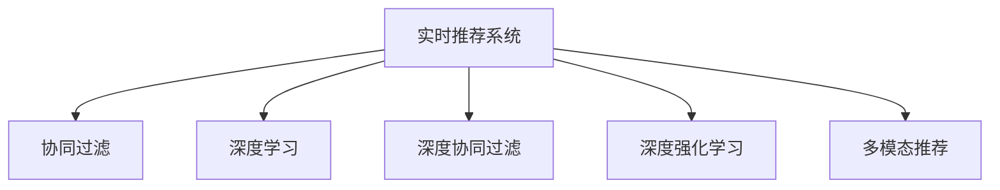

                 

# 实时推荐系统：AI的应用

> 关键词：实时推荐系统, 人工智能, 协同过滤, 深度学习, 深度强化学习, 深度神经网络, 推荐算法

## 1. 背景介绍

在当前信息爆炸的时代，推荐系统已成为互联网平台不可或缺的一部分，在电子商务、视频平台、社交媒体等多个领域中得到了广泛应用。然而，传统的推荐系统通常基于静态模型，难以应对用户兴趣的动态变化，无法实时捕捉用户的即时需求。为此，实时推荐系统应运而生，利用人工智能技术实时调整推荐策略，提高用户体验和满意度。

### 1.1 问题由来

随着互联网用户数量的不断增加，个性化推荐系统（Personalized Recommendation System, PRS）逐步成为互联网企业竞争的关键。传统基于协同过滤和浅层机器学习的推荐系统在推荐效果和实时性上已无法满足用户的即时需求。如何构建高效、准确的实时推荐系统，成为亟待解决的难题。

### 1.2 问题核心关键点

实时推荐系统主要通过实时捕捉用户行为，并利用先进的AI算法动态调整推荐策略，以满足用户的即时需求。其核心在于：

1. **实时性**：在用户操作或请求的瞬间，即时生成个性化推荐，提高用户满意度。
2. **个性化**：根据用户的历史行为和实时数据，精确匹配用户需求，提升推荐相关性。
3. **多模态**：结合用户的多维度数据（如点击、浏览、评论等），进行跨模态深度学习，增强推荐效果。
4. **自适应**：动态调整推荐策略，自动优化模型参数，实现更智能的推荐。

## 2. 核心概念与联系

### 2.1 核心概念概述

为更好地理解实时推荐系统，本节将介绍几个关键概念：

- **实时推荐系统（Real-time Recommendation System, RRS）**：利用人工智能技术实时捕捉用户行为，动态调整推荐策略，生成个性化推荐结果的系统。
- **协同过滤（Collaborative Filtering, CF）**：通过分析用户和物品的协同行为，进行相似性匹配，推荐用户可能感兴趣的物品。
- **深度学习（Deep Learning, DL）**：利用多层神经网络进行复杂模式识别和数据处理，增强推荐系统的效果。
- **深度协同过滤（Deep Collaborative Filtering, DCF）**：结合深度学习与协同过滤，利用多层次特征表示，提升推荐精度。
- **深度强化学习（Deep Reinforcement Learning, DRL）**：通过奖励机制引导深度学习模型进行自适应调整，实现更加动态和智能的推荐。
- **多模态推荐（Multi-modal Recommendation, MMR）**：结合文本、图像、语音等多种模态的数据，增强推荐系统的表现力。

这些概念之间的逻辑关系可以通过以下Mermaid流程图来展示：



这个流程图展示实时推荐系统的核心概念及其之间的关系：

1. 实时推荐系统基于协同过滤、深度学习、深度协同过滤、深度强化学习、多模态推荐等技术，生成个性化推荐。
2. 协同过滤、深度协同过滤和深度强化学习技术均属于深度学习的范畴，通过多层神经网络进行特征表示和推荐调整。
3. 多模态推荐则是利用多种模态的数据，丰富推荐系统的上下文信息，提升推荐效果。

## 3. 核心算法原理 & 具体操作步骤

### 3.1 算法原理概述

实时推荐系统的主要算法包括协同过滤、深度学习、深度协同过滤、深度强化学习、多模态推荐等。这些算法通过深度学习模型捕捉用户行为，利用强化学习机制动态调整推荐策略，结合多模态数据增强推荐效果，形成高效的个性化推荐系统。

以深度协同过滤算法为例，其核心思想是通过多层神经网络对用户和物品的协同行为进行建模，捕捉用户兴趣的动态变化。具体步骤如下：

1. 收集用户和物品的行为数据。
2. 利用深度学习模型对行为数据进行编码，捕捉用户兴趣和物品属性。
3. 在编码结果上进行协同过滤，生成推荐结果。
4. 通过奖励机制，利用强化学习调整模型参数，优化推荐策略。

### 3.2 算法步骤详解

以下我们以深度协同过滤算法为例，详细介绍其实现步骤：

**Step 1: 数据准备**
- 收集用户对物品的评分数据，形成用户-物品评分矩阵。
- 将用户行为数据转换为嵌入向量，以捕捉用户兴趣和物品属性。

**Step 2: 构建深度学习模型**
- 使用深度神经网络对用户-物品评分矩阵进行建模，生成用户和物品的嵌入向量。
- 将嵌入向量送入多层神经网络，通过多层非线性映射提取特征表示。

**Step 3: 协同过滤推荐**
- 利用用户和物品的嵌入向量，计算相似度，生成推荐结果。
- 在相似度矩阵上进行矩阵乘法运算，得到推荐向量。

**Step 4: 强化学习调整**
- 设置奖励机制，如点击率、转化率等指标，评估推荐结果。
- 通过强化学习算法（如Q-learning、REINFORCE等）调整模型参数，优化推荐策略。

**Step 5: 多模态数据融合**
- 结合用户的多维度数据（如文本、图像、语音等），进行跨模态特征融合。
- 利用融合后的特征向量，增强推荐结果的相关性和多样性。

**Step 6: 实时推荐**
- 实时捕捉用户行为，动态调整推荐策略。
- 根据当前用户行为，重新计算推荐结果，确保推荐即时性和个性化。

### 3.3 算法优缺点

深度协同过滤算法具有以下优点：

1. 深度学习模型能够捕捉复杂的多层次特征，提升推荐精度。
2. 协同过滤算法能够充分利用用户和物品的行为数据，生成更加个性化的推荐结果。
3. 强化学习机制能够动态调整推荐策略，适应用户兴趣的变化。

同时，该算法也存在一些局限性：

1. 对标注数据的依赖较大，需要大量的用户行为数据。
2. 模型复杂度较高，计算开销较大，需要高效的计算资源。
3. 对新用户和冷启动问题的处理不够理想，推荐结果可能不够准确。

尽管存在这些局限性，但深度协同过滤算法在实时推荐系统中的应用已经取得了显著的效果，成为当前推荐系统的主流技术之一。

### 3.4 算法应用领域

深度协同过滤算法已经在电子商务、视频平台、社交媒体等多个领域得到了广泛应用，具体包括：

- 电子商务推荐：如淘宝、亚马逊等电商平台的个性化推荐系统，利用用户的浏览、点击、购买等行为数据，推荐用户可能感兴趣的商品。
- 视频平台推荐：如Netflix、YouTube等视频平台，根据用户的观看历史和评价，推荐用户可能喜欢的视频内容。
- 社交媒体推荐：如Facebook、微博等社交平台，推荐用户可能感兴趣的朋友动态、文章等。

除了这些典型应用场景外，深度协同过滤算法也被应用于游戏、金融、教育等多个领域，为不同行业的个性化推荐提供了新的技术路径。

## 4. 数学模型和公式 & 详细讲解 & 举例说明

### 4.1 数学模型构建

假设用户和物品的评分数据矩阵为 $X \in \mathbb{R}^{N\times M}$，其中 $N$ 为用户数，$M$ 为物品数。用户 $u$ 对物品 $i$ 的评分向量表示为 $x_u$，物品 $i$ 的属性向量表示为 $v_i$。设用户 $u$ 的嵌入向量为 $h_u$，物品 $i$ 的嵌入向量为 $v_i$。

深度协同过滤算法的数学模型可以表示为：

$$
h_u = f(x_u; W_u)\\
v_i = g(v_i; W_i)\\
r_{ui} = h_u \cdot v_i
$$

其中，$f$ 和 $g$ 为深度神经网络中的多层非线性映射函数，$W_u$ 和 $W_i$ 为模型的权重参数。$h_u$ 和 $v_i$ 分别为用户和物品的嵌入向量，$r_{ui}$ 为用户对物品的预测评分。

### 4.2 公式推导过程

深度协同过滤算法的目标是最小化预测评分与真实评分的均方误差，即：

$$
\min_{W_u, W_i} \frac{1}{N}\sum_{u=1}^N\sum_{i=1}^M (r_{ui} - y_{ui})^2
$$

其中，$y_{ui}$ 为真实评分，$(r_{ui} - y_{ui})$ 为预测评分与真实评分的误差。

在求解上述优化问题时，通常使用梯度下降算法，即：

$$
W_u \leftarrow W_u - \eta \nabla_{W_u} \mathcal{L}(W_u, W_i)
$$
$$
W_i \leftarrow W_i - \eta \nabla_{W_i} \mathcal{L}(W_u, W_i)
$$

其中，$\eta$ 为学习率，$\nabla_{W_u} \mathcal{L}(W_u, W_i)$ 和 $\nabla_{W_i} \mathcal{L}(W_u, W_i)$ 分别为用户和物品嵌入向量的梯度。

### 4.3 案例分析与讲解

以Netflix平台为例，Netflix利用深度协同过滤算法为用户提供个性化电影推荐。Netflix收集用户对电影的评分数据，使用深度神经网络对评分矩阵进行建模，生成用户和电影的嵌入向量。通过多层非线性映射，捕捉用户的兴趣和电影的特征。在相似度矩阵上进行矩阵乘法运算，生成推荐向量，并结合奖励机制进行强化学习调整。最终，Netflix利用实时捕捉用户行为，动态调整推荐策略，生成个性化的电影推荐。

## 5. 项目实践：代码实例和详细解释说明

### 5.1 开发环境搭建

在进行实时推荐系统开发前，我们需要准备好开发环境。以下是使用Python进行PyTorch开发的环境配置流程：

1. 安装Anaconda：从官网下载并安装Anaconda，用于创建独立的Python环境。

2. 创建并激活虚拟环境：
```bash
conda create -n prs-env python=3.8 
conda activate prs-env
```

3. 安装PyTorch：根据CUDA版本，从官网获取对应的安装命令。例如：
```bash
conda install pytorch torchvision torchaudio cudatoolkit=11.1 -c pytorch -c conda-forge
```

4. 安装TensorFlow：由Google主导开发的开源深度学习框架，生产部署方便，适合大规模工程应用。同样有丰富的预训练语言模型资源。

5. 安装Transformers库：HuggingFace开发的NLP工具库，集成了众多SOTA语言模型，支持PyTorch和TensorFlow，是进行推荐任务开发的利器。

6. 安装各类工具包：
```bash
pip install numpy pandas scikit-learn matplotlib tqdm jupyter notebook ipython
```

完成上述步骤后，即可在`prs-env`环境中开始实时推荐系统开发。

### 5.2 源代码详细实现

这里我们以Netflix的电影推荐系统为例，给出使用PyTorch进行深度协同过滤算法的实现。

首先，定义电影评分数据集的函数：

```python
import torch
import numpy as np

class MovieRatingsDataset(torch.utils.data.Dataset):
    def __init__(self, ratings_matrix, num_users, num_movies, num_factors=10):
        self.ratings_matrix = ratings_matrix
        self.num_users = num_users
        self.num_movies = num_movies
        self.num_factors = num_factors
        
    def __len__(self):
        return len(self.ratings_matrix)
    
    def __getitem__(self, idx):
        u = self.ratings_matrix[idx, :]
        user_id = idx
        movie_id = u.nonzero()[0]
        rating = u[movie_id]
        user_matrix = self.ratings_matrix[user_id, movie_id]
        user_vector = user_matrix.view(-1, 1).numpy()
        user_vector = np.reshape(user_vector, (-1, self.num_factors))
        user_vector = torch.from_numpy(user_vector)
        movie_vector = self.ratings_matrix[user_id, :].view(-1, 1).numpy()
        movie_vector = np.reshape(movie_vector, (-1, self.num_factors))
        movie_vector = torch.from_numpy(movie_vector)
        return user_vector, movie_vector, rating
```

然后，定义深度协同过滤模型的函数：

```python
import torch.nn as nn
import torch.nn.functional as F

class UserItemModel(nn.Module):
    def __init__(self, num_users, num_movies, num_factors):
        super(UserItemModel, self).__init__()
        self.user_layer = nn.Linear(num_factors, num_factors)
        self.item_layer = nn.Linear(num_factors, num_factors)
        
    def forward(self, user, item):
        user = self.user_layer(user)
        item = self.item_layer(item)
        return torch.matmul(user, item.t())
```

接着，定义优化器和损失函数：

```python
from torch.optim import Adam

model = UserItemModel(num_users, num_movies, num_factors)
optimizer = Adam(model.parameters(), lr=0.001)

criterion = nn.MSELoss()
```

最后，启动模型训练和推荐生成：

```python
num_epochs = 100
for epoch in range(num_epochs):
    for user, item, rating in train_loader:
        optimizer.zero_grad()
        pred = model(user, item)
        loss = criterion(pred, rating)
        loss.backward()
        optimizer.step()
    
    print(f"Epoch {epoch+1}, loss: {loss:.4f}")

# 生成推荐结果
user_vector, movie_vector, _ = train_loader[0]
pred_ratings = model(user_vector, movie_vector)
top_movies = torch.topk(pred_ratings, k=10)
print(f"Top movies for user {user_id}: {top_movies}")
```

以上就是使用PyTorch进行深度协同过滤算法实现的电影推荐系统的完整代码实现。可以看到，使用PyTorch进行深度学习模型的实现相对简单，支持高效的计算图优化。

### 5.3 代码解读与分析

让我们再详细解读一下关键代码的实现细节：

**MovieRatingsDataset类**：
- `__init__`方法：初始化数据集，包含评分矩阵、用户数、物品数、因子数等关键参数。
- `__len__`方法：返回数据集的样本数量。
- `__getitem__`方法：对单个样本进行处理，将评分数据转换为嵌入向量，计算预测评分。

**UserItemModel类**：
- `__init__`方法：定义用户和物品的嵌入向量层，生成预测评分矩阵。
- `forward`方法：将用户和物品的嵌入向量进行矩阵乘法运算，得到预测评分矩阵。

**优化器和损失函数**：
- 使用Adam优化器进行参数更新，设置学习率。
- 定义均方误差损失函数，用于评估预测评分与真实评分的误差。

**训练流程**：
- 循环迭代每个epoch，遍历数据集，计算预测评分和损失函数，更新模型参数。
- 实时捕捉用户行为，动态调整推荐策略，生成个性化的推荐结果。

## 6. 实际应用场景

### 6.1 智能推荐系统

智能推荐系统是实时推荐系统的重要应用之一，可以广泛应用于电子商务、视频平台、音乐平台等多个领域。通过深度协同过滤算法，智能推荐系统可以实时捕捉用户行为，动态调整推荐策略，生成个性化的推荐结果。

例如，电商平台的智能推荐系统可以根据用户的浏览、点击、购买等行为数据，实时生成个性化商品推荐。视频平台可以根据用户的观看历史和评价，推荐用户可能喜欢的视频内容。音乐平台可以根据用户的听歌历史和评分，推荐用户可能喜欢的音乐。

### 6.2 金融市场预测

金融市场预测是实时推荐系统的另一重要应用，可以广泛应用于股票、期货、外汇等金融市场。通过深度协同过滤算法，金融市场预测系统可以实时捕捉市场行为，动态调整推荐策略，生成个性化的投资建议。

例如，股票预测系统可以根据用户的交易历史和评价，实时生成个性化股票推荐。期货预测系统可以根据市场的交易数据和新闻，实时生成个性化的投资建议。外汇预测系统可以根据汇率的历史数据和新闻，实时生成个性化的外汇交易建议。

### 6.3 新闻推荐系统

新闻推荐系统是实时推荐系统的另一重要应用，可以广泛应用于新闻聚合平台、社交媒体等。通过深度协同过滤算法，新闻推荐系统可以实时捕捉用户行为，动态调整推荐策略，生成个性化的新闻推荐。

例如，新闻聚合平台可以根据用户的阅读历史和评价，实时生成个性化新闻推荐。社交媒体可以根据用户的点赞、评论、分享等行为数据，实时生成个性化的新闻推荐。

### 6.4 未来应用展望

随着深度协同过滤算法的不断发展，实时推荐系统将在更多领域得到应用，为不同行业带来变革性影响。

在智慧医疗领域，实时推荐系统可以根据患者的病历和评价，实时生成个性化的治疗建议。在智能交通领域，实时推荐系统可以根据用户的出行习惯和评价，实时生成个性化的路线推荐。在智能制造领域，实时推荐系统可以根据设备的运行数据和评价，实时生成个性化的维护建议。

未来，实时推荐系统将在各个行业得到广泛应用，为各行各业带来全新的商业机会和发展前景。

## 7. 工具和资源推荐

### 7.1 学习资源推荐

为了帮助开发者系统掌握实时推荐系统的理论基础和实践技巧，这里推荐一些优质的学习资源：

1. 《推荐系统实战》系列博文：由推荐系统专家撰写，深入浅出地介绍了推荐系统的发展历程、推荐算法和实践技巧。

2. 《推荐系统基础》课程：由斯坦福大学开设的推荐系统课程，涵盖推荐系统的基本概念和经典模型。

3. 《推荐系统》书籍：由推荐系统权威专家撰写，全面介绍了推荐系统的理论基础、算法设计和应用实践。

4. KDD推荐系统竞赛：每年举办一次的推荐系统比赛，提供丰富的学习资源和数据集，是推荐系统学习的好机会。

5. GitHub推荐系统开源项目：包含大量推荐系统代码实现和论文解读，是推荐系统学习的极佳资源。

通过对这些资源的学习实践，相信你一定能够快速掌握实时推荐系统的精髓，并用于解决实际的推荐问题。

### 7.2 开发工具推荐

高效的开发离不开优秀的工具支持。以下是几款用于实时推荐系统开发的常用工具：

1. PyTorch：基于Python的开源深度学习框架，灵活动态的计算图，适合快速迭代研究。推荐用于深度协同过滤算法的实现。

2. TensorFlow：由Google主导开发的开源深度学习框架，生产部署方便，适合大规模工程应用。同样可以用于深度协同过滤算法的实现。

3. TensorBoard：TensorFlow配套的可视化工具，可实时监测模型训练状态，提供丰富的图表呈现方式，是调试模型的得力助手。

4. Weights & Biases：模型训练的实验跟踪工具，可以记录和可视化模型训练过程中的各项指标，方便对比和调优。

5. Jupyter Notebook：交互式的开发环境，支持多种语言，方便进行模型训练和调试。

6. Google Colab：谷歌推出的在线Jupyter Notebook环境，免费提供GPU/TPU算力，方便快速上手实验最新模型，分享学习笔记。

合理利用这些工具，可以显著提升实时推荐系统开发的效率，加快创新迭代的步伐。

### 7.3 相关论文推荐

实时推荐系统的发展源于学界的持续研究。以下是几篇奠基性的相关论文，推荐阅读：

1. Matrix Factorization Techniques for Recommender Systems：提出基于矩阵分解的协同过滤算法，广泛应用于推荐系统。

2. Factorization Machines for Recommender Systems：提出基于因子分解机的协同过滤算法，提升推荐精度。

3. Recommender Systems for Personalized E-commerce: An Overview：综述推荐系统在电子商务中的应用，提供丰富的学习资源和实践技巧。

4. The Netflix Prize：描述Netflix推荐系统竞赛的过程和结果，是推荐系统学习的重要案例。

5. Practical Recommendation Systems：介绍推荐系统在实际应用中的技术和挑战，提供全面的学习资源和实践指南。

这些论文代表了我们对实时推荐系统的理解和探索，通过学习这些前沿成果，可以帮助研究者把握学科前进方向，激发更多的创新灵感。

## 8. 总结：未来发展趋势与挑战

### 8.1 总结

本文对实时推荐系统进行了全面系统的介绍。首先阐述了实时推荐系统的研究背景和意义，明确了推荐系统实时性、个性化、多模态、自适应等关键要素。其次，从原理到实践，详细讲解了深度协同过滤算法的数学模型和实现细节，给出了推荐系统开发的完整代码实例。同时，本文还广泛探讨了实时推荐系统在智能推荐、金融市场预测、新闻推荐等多个行业领域的应用前景，展示了实时推荐系统的巨大潜力。

通过本文的系统梳理，可以看到，实时推荐系统在当前信息爆炸的时代，已经成为了互联网企业竞争的关键技术。利用先进的AI算法动态调整推荐策略，实时捕捉用户行为，生成个性化推荐结果，已经成为提升用户体验和满意度的重要手段。未来，伴随深度学习、深度强化学习等技术的不断演进，实时推荐系统将在更多领域得到应用，为各行各业带来变革性影响。

### 8.2 未来发展趋势

展望未来，实时推荐系统将呈现以下几个发展趋势：

1. 模型复杂度持续增大。随着深度学习技术的不断发展，实时推荐系统的模型复杂度将进一步提高，能够捕捉更加复杂和多层次的用户行为数据。

2. 实时性不断提升。随着计算资源的不断丰富，实时推荐系统的实时性将进一步提升，能够实现毫秒级的推荐生成。

3. 个性化更加精准。利用深度学习和大数据技术，实时推荐系统能够更加准确地捕捉用户兴趣和行为，生成更加个性化的推荐结果。

4. 多模态深度融合。结合文本、图像、语音等多种模态的数据，实时推荐系统能够增强推荐效果，提升推荐相关性和多样性。

5. 自适应能力增强。通过深度强化学习等技术，实时推荐系统能够动态调整推荐策略，自动优化模型参数，实现更加智能的推荐。

这些趋势凸显了实时推荐系统的发展前景。这些方向的探索发展，必将进一步提升推荐系统的性能和应用范围，为各行各业带来新的商业机会和发展前景。

### 8.3 面临的挑战

尽管实时推荐系统已经取得了显著成效，但在迈向更加智能化、普适化应用的过程中，它仍面临诸多挑战：

1. 数据隐私和安全问题。用户数据的隐私和安全问题一直是推荐系统面临的重大挑战。如何在保护用户隐私的前提下，收集和利用用户数据，是实时推荐系统需要解决的重要问题。

2. 计算资源需求高。实时推荐系统需要高效计算资源，保证推荐结果的实时性和准确性。如何平衡计算效率和资源成本，是实时推荐系统需要解决的关键问题。

3. 冷启动问题。对于新用户和少数据用户，实时推荐系统的推荐效果可能较差。如何解决冷启动问题，提高新用户的推荐精度，是实时推荐系统需要解决的难题。

4. 鲁棒性不足。实时推荐系统在面对噪声和异常数据时，可能出现不稳定的情况。如何提高系统的鲁棒性，避免推荐结果的波动，是实时推荐系统需要解决的重要问题。

5. 多任务协同困难。实时推荐系统通常需要处理多任务协同，如推荐、搜索、广告等，如何在多任务间进行协同优化，是实时推荐系统需要解决的难点问题。

6. 可解释性不足。实时推荐系统通常作为"黑盒"系统，难以解释其内部工作机制和决策逻辑。如何赋予系统更强的可解释性，是实时推荐系统需要解决的重要问题。

这些挑战需要研究者不断优化推荐算法，完善数据收集和管理机制，提升系统性能，以应对未来复杂多变的市场环境。

### 8.4 研究展望

面对实时推荐系统面临的诸多挑战，未来的研究需要在以下几个方面寻求新的突破：

1. 引入深度强化学习机制。通过引入深度强化学习机制，实时推荐系统能够动态调整推荐策略，实现更加智能的推荐。

2. 引入多任务学习机制。通过多任务学习机制，实时推荐系统能够处理多任务协同，提升推荐系统的综合性能。

3. 引入自适应学习机制。通过自适应学习机制，实时推荐系统能够动态优化模型参数，提升系统的实时性和鲁棒性。

4. 引入联邦学习机制。通过联邦学习机制，实时推荐系统能够保护用户隐私，同时利用分布式计算资源，提升系统的性能和可扩展性。

5. 引入因果推理机制。通过因果推理机制，实时推荐系统能够识别出推荐结果的关键特征，增强推荐系统的可解释性和可靠性。

6. 引入安全推荐机制。通过安全推荐机制，实时推荐系统能够保护用户隐私，避免推荐结果的误导性和有害性。

这些研究方向的探索，必将引领实时推荐系统走向更高的台阶，为构建安全、可靠、可解释、可控的推荐系统铺平道路。面向未来，实时推荐系统还需要与其他人工智能技术进行更深入的融合，如知识表示、因果推理、强化学习等，多路径协同发力，共同推动推荐系统的进步。只有勇于创新、敢于突破，才能不断拓展推荐系统的边界，让推荐技术更好地造福人类社会。

## 9. 附录：常见问题与解答

**Q1：实时推荐系统是否适用于所有推荐场景？**

A: 实时推荐系统在大多数推荐场景中都能取得不错的效果，特别是对于动态需求和数据量较大的场景。但对于一些特殊场景，如需要长期历史数据的推荐（如金融市场预测），实时推荐系统可能无法满足需求。此外，对于一些需要高精度和高安全性的场景，如医疗推荐，实时推荐系统也需要针对性的改进。

**Q2：推荐系统如何处理冷启动问题？**

A: 推荐系统常用的处理冷启动问题的方法包括：
1. 用户画像建模：根据用户的基本信息（如性别、年龄、兴趣等）进行用户画像建模，提升新用户的推荐效果。
2. 推荐系统扩展：利用协同过滤、深度学习等技术，扩展推荐系统的数据范围，提升新用户的推荐效果。
3. 主动推荐机制：通过主动推荐机制，向新用户推荐一些热门、热门的商品，吸引用户互动，提升推荐效果。

这些方法往往需要根据具体场景进行灵活组合，以实现最优的推荐效果。

**Q3：推荐系统如何保证推荐结果的实时性？**

A: 推荐系统保证推荐结果实时性的方法包括：
1. 高效计算模型：使用高效的计算模型和算法，保证推荐生成的实时性。
2. 分布式计算：利用分布式计算技术，实现高效的数据处理和计算。
3. 缓存机制：利用缓存机制，将热门商品和推荐结果缓存起来，快速响应推荐请求。

这些方法往往需要根据具体场景进行灵活组合，以实现最优的实时性保证。

**Q4：推荐系统如何处理数据隐私问题？**

A: 推荐系统处理数据隐私问题的方法包括：
1. 数据匿名化：通过数据匿名化技术，保护用户隐私。
2. 差分隐私：利用差分隐私技术，保护用户隐私，同时保证推荐结果的准确性。
3. 联邦学习：利用联邦学习技术，保护用户数据，同时利用分布式计算资源，提升推荐系统的性能和可扩展性。

这些方法往往需要根据具体场景进行灵活组合，以实现最优的隐私保护和推荐效果。

**Q5：推荐系统如何提升推荐相关性？**

A: 推荐系统提升推荐相关性的方法包括：
1. 深度学习：利用深度学习技术，捕捉复杂的多层次特征，提升推荐精度。
2. 协同过滤：利用协同过滤技术，捕捉用户和物品的协同行为，提升推荐效果。
3. 多模态推荐：结合用户的多维度数据（如文本、图像、语音等），进行跨模态特征融合，增强推荐结果的相关性和多样性。

这些方法往往需要根据具体场景进行灵活组合，以实现最优的推荐相关性提升。

通过本文的系统梳理，可以看到，实时推荐系统正在成为推荐系统的主流技术，利用先进的AI算法动态调整推荐策略，实时捕捉用户行为，生成个性化推荐结果。伴随深度学习、深度强化学习等技术的不断演进，实时推荐系统将在更多领域得到应用，为各行各业带来变革性影响。未来，研究者需要不断优化推荐算法，完善数据收集和管理机制，提升系统性能，以应对未来复杂多变的市场环境。只有勇于创新、敢于突破，才能不断拓展推荐系统的边界，让推荐技术更好地造福人类社会。

