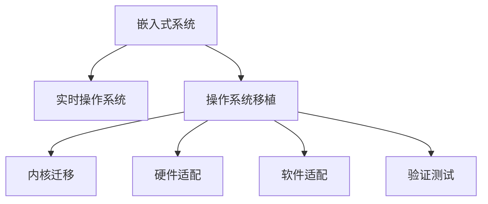

                 

# 嵌入式实时操作系统移植

> 关键词：嵌入式系统, 实时操作系统, 操作系统移植, 内核迁移, 跨平台编程

## 1. 背景介绍

### 1.1 问题由来

在当今物联网（IoT）和嵌入式系统（Embedded Systems）日益普及的时代，实时操作系统（Real-time Operating System, RTOS）扮演着越来越重要的角色。从工业控制到智能家居，从无人机到自动驾驶，几乎所有需要快速响应的设备都需要实时操作系统的支持。然而，传统的实时操作系统如VxWorks、QNX等往往伴随着高昂的许可证费用和复杂的开发环境，限制了它们的普及应用。为此，开源实时操作系统（Open Source RTOS, OSRTOS）逐渐成为越来越多开发者和企业的首选，提供了高效、灵活、低成本的解决方案。

### 1.2 问题核心关键点

嵌入式实时操作系统移植的核心在于如何将一个已经在某一平台运行良好的操作系统内核迁移到另一个平台，并且保证其功能和性能不受影响。这一过程通常涉及以下几个关键点：

- 内核迁移：将原有操作系统的内核代码移植到目标平台，并确保其运行正常。
- 硬件适配：根据目标平台的特点，对原有硬件驱动进行修改或新增，以保证系统的稳定性和性能。
- 软件适配：修改原有应用程序以适应新操作系统的API和特性，保持其正常运行。
- 验证测试：对移植后的系统进行全面的测试，确保系统稳定可靠，无内存泄漏、死锁等问题。

这些步骤在嵌入式实时操作系统的移植中尤为关键，需要开发者具备深厚的硬件知识、操作系统原理及丰富的软件开发经验。

### 1.3 问题研究意义

嵌入式实时操作系统移植的研究对于促进开源实时操作系统的普及和应用具有重要意义：

1. **降低开发成本**：开源操作系统的移植和应用，可以大大降低开发者的硬件成本和软件许可证费用，推动更多的企业采用开源RTOS。
2. **提高开发效率**：开源操作系统的移植，简化了开发流程，缩短了开发周期，使开发者能够更快速地构建和部署应用。
3. **增强灵活性**：开源RTOS通常具有良好的跨平台支持，可以在多种嵌入式平台上运行，为企业提供了更多选择。
4. **促进技术交流**：开源操作系统的移植与适配，促进了开发者之间的技术交流与合作，推动了技术创新和进步。
5. **支持工业应用**：实时操作系统在工业控制、智能制造等场景中有着广泛应用，开源RTOS的移植有助于推动工业自动化技术的普及和升级。

通过这篇文章，我们旨在系统介绍嵌入式实时操作系统的移植方法，涵盖内核迁移、硬件适配、软件适配及验证测试等关键步骤，帮助开发者快速、高效地实现操作系统移植，推动开源RTOS在嵌入式系统中的应用。

## 2. 核心概念与联系

### 2.1 核心概念概述

为更好地理解嵌入式实时操作系统移植方法，本节将介绍几个密切相关的核心概念：

- 嵌入式系统（Embedded Systems）：指嵌入在其他设备或产品中的计算机系统，如传感器、智能家居设备、汽车电子等，它们通常具有实时性和资源受限的特点。
- 实时操作系统（Real-time Operating System, RTOS）：指能在特定时间内完成任务的操作系统，具有高可靠性、低延迟和确定性的特点，适用于对响应时间有严格要求的应用。
- 操作系统移植（OS Porting）：指将操作系统内核或应用程序从一个平台迁移到另一个平台的过程，包括内核迁移、硬件适配、软件适配等环节。
- 内核迁移（Kernel Porting）：指将操作系统内核从一个平台迁移到另一个平台，保持其功能和性能。
- 硬件适配（Hardware Porting）：指根据目标平台的特点，对原有硬件驱动进行修改或新增，以保证系统的稳定性和性能。
- 软件适配（Software Porting）：指修改原有应用程序以适应新操作系统的API和特性，保持其正常运行。
- 验证测试（Verification and Testing）：指对移植后的系统进行全面的测试，确保系统稳定可靠，无内存泄漏、死锁等问题。

这些核心概念之间的逻辑关系可以通过以下Mermaid流程图来展示：



这个流程图展示嵌入式实时操作系统的核心概念及其之间的关系：

1. 嵌入式系统通过实时操作系统实现高效、实时响应。
2. 操作系统移植包括内核迁移、硬件适配、软件适配等关键步骤，以支持新平台。
3. 内核迁移是将操作系统内核从源平台迁移到目标平台，确保功能与性能。
4. 硬件适配是根据目标平台的特点，对原有硬件驱动进行修改或新增。
5. 软件适配是修改原有应用程序以适应新操作系统的API和特性。
6. 验证测试是对移植后的系统进行全面的测试，确保系统的稳定性和可靠性。

## 3. 核心算法原理 & 具体操作步骤
### 3.1 算法原理概述

嵌入式实时操作系统的移植，本质上是对操作系统内核和应用程序进行适配和整合的过程。其核心思想是：通过将原有操作系统内核的代码重新编译和配置，使其能够在目标平台上稳定运行，并确保原有应用程序的功能和性能不受影响。

形式化地，假设原有操作系统内核为 $K$，目标平台为 $T$。移植的目标是找到一组适配参数 $\theta$，使得移植后的内核 $K_{\theta}$ 在平台 $T$ 上能够正常运行。具体步骤如下：

1. **内核迁移**：将原有操作系统的内核代码编译并适配到目标平台上，形成移植后的内核 $K_{\theta}$。
2. **硬件适配**：根据目标平台的特点，对原有硬件驱动进行修改或新增，确保系统的稳定性和性能。
3. **软件适配**：修改原有应用程序以适应新操作系统的API和特性，保持其正常运行。
4. **验证测试**：对移植后的系统进行全面的测试，确保系统稳定可靠，无内存泄漏、死锁等问题。

### 3.2 算法步骤详解

嵌入式实时操作系统移植一般包括以下几个关键步骤：

**Step 1: 准备源代码和目标平台**

- 收集原有操作系统的源代码，包括内核代码和应用程序。
- 选择目标平台，准备相关开发环境（如交叉编译器、调试工具等）。
- 配置交叉编译器和开发环境，以便在目标平台上进行编译和调试。

**Step 2: 内核迁移**

- 根据目标平台的特点，修改原有内核代码，确保其能够在新平台下正常运行。
- 适配内核配置文件（如Makefile、config.h等），使其能够在新平台下编译和构建。
- 对内核进行必要的优化，以适应目标平台的特点和资源限制。

**Step 3: 硬件适配**

- 分析目标平台的硬件特点，识别需要修改或新增的硬件驱动。
- 根据目标平台的特点，修改原有硬件驱动或新增新硬件驱动。
- 编写新的设备驱动程序，确保其能够在目标平台上正常工作。

**Step 4: 软件适配**

- 分析目标平台的API和特性，确定需要修改或新增的应用程序代码。
- 修改应用程序代码以适应新操作系统的API和特性。
- 进行必要的单元测试，确保应用程序在新平台上正常工作。

**Step 5: 验证测试**

- 准备测试用例，包括单元测试、功能测试、性能测试等。
- 在目标平台上执行测试用例，记录测试结果。
- 分析测试结果，确定系统是否稳定可靠，无内存泄漏、死锁等问题。
- 根据测试结果进行必要的修改和优化，直到系统通过全部测试。

### 3.3 算法优缺点

嵌入式实时操作系统移植具有以下优点：

- **灵活性高**：开源RTOS通常具有良好的跨平台支持，可以在多种嵌入式平台上运行。
- **开发成本低**：开源RTOS的开源特性减少了许可证费用和开发成本。
- **易用性高**：开源RTOS通常提供良好的开发文档和社区支持，方便开发者进行开发和调试。

同时，该方法也存在一定的局限性：

- **复杂度高**：移植过程涉及内核迁移、硬件适配、软件适配等多个环节，需要开发者具备深厚的硬件知识、操作系统原理及丰富的软件开发经验。
- **测试难度大**：移植后的系统需要进行全面的测试，确保系统稳定可靠，无内存泄漏、死锁等问题。
- **资源受限**：嵌入式系统资源受限，移植过程中需要权衡系统性能和资源占用。
- **依赖性强**：移植过程依赖于目标平台的特点和开发环境，需要充分的预研和准备。

尽管存在这些局限性，但就目前而言，嵌入式实时操作系统的移植方法仍是嵌入式系统开发的重要手段。未来相关研究的重点在于如何进一步降低移植复杂度，提高移植效率，同时兼顾性能和资源优化等因素。

### 3.4 算法应用领域

嵌入式实时操作系统移植的应用领域非常广泛，涵盖了多种嵌入式设备和系统，包括但不限于以下领域：

- **工业控制**：嵌入式系统在工业控制领域有着广泛应用，如PLC、机器人、传感器等。实时操作系统移植可以显著提高工业控制的稳定性和可靠性。
- **智能家居**：智能家居设备如智能音箱、智能灯光等，需要实时响应用户的指令，实时操作系统移植可以提高系统的响应速度和稳定性。
- **车载系统**：自动驾驶、智能导航等车载系统需要实时响应环境变化，实时操作系统移植可以提升系统的可靠性和安全性。
- **无人机**：无人机需要实时处理传感器数据和执行指令，实时操作系统移植可以提高系统的实时性和稳定性。
- **医疗设备**：医疗设备如心电图机、血氧仪等，需要实时监测患者数据，实时操作系统移植可以提高系统的可靠性和稳定性。

除了上述这些经典应用外，嵌入式实时操作系统的移植还在更多领域得到广泛应用，如智能制造、物联网、智能交通等，为嵌入式系统的发展提供了新的动力。

## 4. 数学模型和公式 & 详细讲解  
### 4.1 数学模型构建

本节将使用数学语言对嵌入式实时操作系统移植过程进行更加严格的刻画。

假设原有操作系统内核为 $K$，目标平台为 $T$。移植的目标是找到一组适配参数 $\theta$，使得移植后的内核 $K_{\theta}$ 在平台 $T$ 上能够正常运行。具体数学模型如下：

1. **内核迁移**：
   - 假设内核代码的编译和适配过程可以用数学函数 $f$ 表示，即 $f: K \rightarrow K_{\theta}$。
   - 适配参数 $\theta$ 包括编译选项、宏定义、配置文件等，需要根据目标平台进行配置。

2. **硬件适配**：
   - 假设硬件驱动的修改和新编写过程可以用函数 $g$ 表示，即 $g: \text{原硬件驱动} \rightarrow \text{新硬件驱动}$。
   - 适配过程需要识别需要修改或新增的硬件接口和设备驱动，并编写新的驱动程序。

3. **软件适配**：
   - 假设应用程序的修改过程可以用函数 $h$ 表示，即 $h: \text{原应用程序} \rightarrow \text{新应用程序}$。
   - 适配过程需要识别需要修改或新增的API调用和数据结构，并修改应用程序代码。

4. **验证测试**：
   - 假设测试过程可以用函数 $v$ 表示，即 $v: \text{移植后的系统} \rightarrow \text{测试结果}$。
   - 测试过程需要设计测试用例，并在目标平台上执行测试，记录和分析测试结果。

### 4.2 公式推导过程

以下我们以单核移植为例，推导嵌入式实时操作系统移植的数学模型和关键步骤。

**Step 1: 内核迁移**

假设内核代码的编译和适配过程可以用数学函数 $f$ 表示，即 $f: K \rightarrow K_{\theta}$。适配参数 $\theta$ 包括编译选项、宏定义、配置文件等。内核迁移的数学模型如下：

$$
K_{\theta} = f(K)
$$

**Step 2: 硬件适配**

假设硬件驱动的修改和新编写过程可以用函数 $g$ 表示，即 $g: \text{原硬件驱动} \rightarrow \text{新硬件驱动}$。硬件适配的数学模型如下：

$$
\text{新硬件驱动} = g(\text{原硬件驱动})
$$

**Step 3: 软件适配**

假设应用程序的修改过程可以用函数 $h$ 表示，即 $h: \text{原应用程序} \rightarrow \text{新应用程序}$。软件适配的数学模型如下：

$$
\text{新应用程序} = h(\text{原应用程序})
$$

**Step 4: 验证测试**

假设测试过程可以用函数 $v$ 表示，即 $v: \text{移植后的系统} \rightarrow \text{测试结果}$。验证测试的数学模型如下：

$$
\text{测试结果} = v(\text{移植后的系统})
$$

在得到上述数学模型后，可以将其组合起来，形成完整的嵌入式实时操作系统移植模型：

$$
K_{\theta} = f(K)
$$
$$
\text{新硬件驱动} = g(\text{原硬件驱动})
$$
$$
\text{新应用程序} = h(\text{原应用程序})
$$
$$
\text{测试结果} = v(\text{移植后的系统})
$$

通过上述模型，可以系统地描述嵌入式实时操作系统的移植过程，帮助开发者理解和优化移植步骤。

## 5. 项目实践：代码实例和详细解释说明
### 5.1 开发环境搭建

在进行嵌入式实时操作系统移植实践前，我们需要准备好开发环境。以下是使用Linux环境下进行嵌入式开发的环境配置流程：

1. 安装交叉编译器：根据目标平台，从官网下载并安装对应的交叉编译器。
2. 配置开发环境：设置环境变量，配置交叉编译器路径，搭建开发环境。
3. 下载源代码：从操作系统官网下载源代码，解压到本地。
4. 准备目标板硬件：准备目标平台所需的硬件板卡，连接至计算机进行调试。

完成上述步骤后，即可在本地搭建起完整的嵌入式开发环境，进行嵌入式实时操作系统移植的实践。

### 5.2 源代码详细实现

这里我们以移植FreeRTOS操作系统到ARM平台为例，给出详细的源代码实现和解释说明。

首先，准备FreeRTOS的源代码和目标平台（如ARM平台）的开发环境。在目标平台上安装交叉编译器，配置开发环境，准备目标板硬件。

```bash
# 配置交叉编译器
export CC=gcc
export CFLAGS=-arch=arm -mthumb -O3 -pipe -fPIC -msoft-float -lm
export CPP=arm-linux-gnueabi-gcc
export LDFLAGS=-arch=arm -mthumb -O3 -pie
export AR=arm-linux-gnueabi-ar
export RANLIB=arm-linux-gnueabi-ranlib
export AS=arm-linux-gnueabi-as
export LD=arm-linux-gnueabi-ld

# 下载源代码
git clone https://github.com/FreeRTOS/FreeRTOS.git
cd FreeRTOS

# 配置目标平台
make ARCH=arm target=linux HOST=arm-linux-gnueabi
```

接着，修改FreeRTOS的Makefile，适配目标平台。

```makefile
# 修改Makefile适配目标平台
ifeq ($(TARGET),linux)
include make.sh
endif
```

然后，修改FreeRTOS内核代码，适配目标平台。

```c
// 修改FreeRTOS内核代码
#define INCLUDE_SCHEDULER_HARDWARE_SUBSTRATE 0
```

最后，编译和测试移植后的FreeRTOS系统。

```bash
# 编译FreeRTOS系统
make ARCH=arm target=linux HOST=arm-linux-gnueabi

# 测试FreeRTOS系统
./FreeRTOS/FreeRTOSExamples/traditional_freertos_example
```

### 5.3 代码解读与分析

让我们再详细解读一下关键代码的实现细节：

**Makefile修改**：
- `ifeq ($(TARGET),linux)`：根据目标平台的不同，选择不同的编译选项。
- `include make.sh`：包含目标平台对应的Makefile。

**内核代码修改**：
- `#define INCLUDE_SCHEDULER_HARDWARE_SUBSTRATE 0`：禁用不需要的硬件调度功能，以适应目标平台。

**编译测试**：
- `make ARCH=arm target=linux HOST=arm-linux-gnueabi`：在目标平台上编译FreeRTOS系统。
- `./FreeRTOS/FreeRTOSExamples/traditional_freertos_example`：运行FreeRTOS系统的测试程序，验证移植结果。

通过上述代码实现，可以看到，嵌入式实时操作系统移植的关键在于对源代码和目标平台的适配，以及对系统配置和内核代码的修改。这一过程需要开发者具备深厚的硬件知识、操作系统原理及丰富的软件开发经验。

## 6. 实际应用场景
### 6.1 工业控制

嵌入式实时操作系统移植在工业控制领域有着广泛应用，如PLC、机器人、传感器等。实时操作系统移植可以显著提高工业控制的稳定性和可靠性。

具体而言，可以收集工业控制系统的历史数据，分析系统的运行状况和性能瓶颈。在此基础上，将原有操作系统内核迁移到新的工业控制设备上，并进行必要的硬件适配和软件适配。移植后的系统可以在新的工业控制设备上稳定运行，提升系统的实时性和可靠性。

### 6.2 智能家居

智能家居设备如智能音箱、智能灯光等，需要实时响应用户的指令，实时操作系统移植可以提高系统的响应速度和稳定性。

具体而言，可以收集智能家居设备的用户行为数据，分析系统的性能瓶颈和用户需求。在此基础上，将原有操作系统内核迁移到新的智能家居设备上，并进行必要的硬件适配和软件适配。移植后的系统可以在新的智能家居设备上稳定运行，提升系统的实时性和用户体验。

### 6.3 车载系统

自动驾驶、智能导航等车载系统需要实时处理传感器数据和执行指令，实时操作系统移植可以提高系统的实时性和安全性。

具体而言，可以收集车载系统的传感器数据和车辆行为数据，分析系统的性能瓶颈和安全需求。在此基础上，将原有操作系统内核迁移到新的车载系统上，并进行必要的硬件适配和软件适配。移植后的系统可以在新的车载系统上稳定运行，提升系统的实时性和安全性。

### 6.4 无人机

无人机需要实时处理传感器数据和执行指令，实时操作系统移植可以提高系统的实时性和稳定性。

具体而言，可以收集无人机的传感器数据和飞行数据，分析系统的性能瓶颈和飞行需求。在此基础上，将原有操作系统内核迁移到新的无人机上，并进行必要的硬件适配和软件适配。移植后的系统可以在新的无人机上稳定运行，提升系统的实时性和飞行性能。

### 6.5 医疗设备

医疗设备如心电图机、血氧仪等，需要实时监测患者数据，实时操作系统移植可以提高系统的可靠性和稳定性。

具体而言，可以收集医疗设备的患者数据和操作数据，分析系统的性能瓶颈和医疗需求。在此基础上，将原有操作系统内核迁移到新的医疗设备上，并进行必要的硬件适配和软件适配。移植后的系统可以在新的医疗设备上稳定运行，提升系统的可靠性和医疗效果。

### 6.6 工业自动化

工业自动化设备如机器臂、生产线等，需要实时处理数据和执行指令，实时操作系统移植可以提高系统的实时性和稳定性。

具体而言，可以收集工业自动化设备的传感器数据和操作数据，分析系统的性能瓶颈和自动化需求。在此基础上，将原有操作系统内核迁移到新的工业自动化设备上，并进行必要的硬件适配和软件适配。移植后的系统可以在新的工业自动化设备上稳定运行，提升系统的实时性和自动化程度。

## 7. 工具和资源推荐
### 7.1 学习资源推荐

为了帮助开发者系统掌握嵌入式实时操作系统移植的理论基础和实践技巧，这里推荐一些优质的学习资源：

1. 《嵌入式实时操作系统原理与实践》：该书系统介绍了嵌入式实时操作系统的原理和实践，涵盖了内核迁移、硬件适配、软件适配等关键内容。
2. 《嵌入式系统设计与开发》：该书详细讲解了嵌入式系统的设计原理和开发流程，涵盖操作系统移植、硬件设计、软件实现等环节。
3. 《嵌入式系统编程与开发》：该书介绍了嵌入式系统的编程方法和开发工具，包括编译器、调试器、测试工具等。
4. 嵌入式系统开发社区：如Embedded.com、STM32中文社区等，提供了丰富的嵌入式系统开发资源和技术交流平台。
5. GitHub：提供大量的嵌入式系统开发项目和源代码，开发者可以从中学习参考。

通过对这些资源的学习实践，相信你一定能够快速掌握嵌入式实时操作系统移植的精髓，并用于解决实际的嵌入式系统问题。

### 7.2 开发工具推荐

高效的开发离不开优秀的工具支持。以下是几款用于嵌入式实时操作系统移植开发的常用工具：

1. GCC交叉编译器：GCC是一个高性能的编译器，支持多平台和目标架构的编译。
2. ARM-Linux开发环境：提供ARM平台的编译器和调试工具，方便嵌入式系统的开发和调试。
3. JTAG调试器：通过JTAG接口进行嵌入式系统的调试，提供丰富的调试功能和工具支持。
4. Simulink：MATLAB提供的功能强大的仿真和建模工具，方便嵌入式系统的设计和验证。
5. Embedded Studio：提供嵌入式系统的集成开发环境，支持多平台和目标架构的开发。

合理利用这些工具，可以显著提升嵌入式实时操作系统移植任务的开发效率，加快创新迭代的步伐。

### 7.3 相关论文推荐

嵌入式实时操作系统移植的研究源于学界的持续研究。以下是几篇奠基性的相关论文，推荐阅读：

1. "An Introduction to Embedded Real-Time Operating Systems"：介绍了嵌入式实时操作系统的基本概念和原理，是嵌入式系统开发的入门必读。
2. "Kernel Porting: A Survey"：系统介绍了操作系统内核迁移的方法和策略，提供了丰富的参考文献和案例分析。
3. "Embedded Systems Design and Development"：详细讲解了嵌入式系统的设计原理和开发流程，涵盖了操作系统移植、硬件设计、软件实现等环节。
4. "The Portability of FreeRTOS"：介绍了FreeRTOS操作系统的移植方法和实践经验，提供了详细的代码实现和测试案例。
5. "Real-Time Operating System Porting Techniques"：总结了实时操作系统移植的多种技术和策略，提供了丰富的参考文献和案例分析。

这些论文代表了大规模嵌入式实时操作系统移植技术的发展脉络。通过学习这些前沿成果，可以帮助研究者把握学科前进方向，激发更多的创新灵感。

## 8. 总结：未来发展趋势与挑战

### 8.1 总结

本文对嵌入式实时操作系统的移植方法进行了全面系统的介绍。首先阐述了嵌入式实时操作系统移植的背景和意义，明确了移植在支持工业控制、智能家居、车载系统、无人机、医疗设备等嵌入式系统中的重要作用。其次，从原理到实践，详细讲解了嵌入式实时操作系统移植的数学模型和关键步骤，给出了嵌入式实时操作系统移植的完整代码实例。同时，本文还广泛探讨了嵌入式实时操作系统移植在工业控制、智能家居、车载系统、无人机、医疗设备等众多领域的应用前景，展示了嵌入式实时操作系统移植的巨大潜力。

通过本文的系统梳理，可以看到，嵌入式实时操作系统移植是嵌入式系统开发的重要手段，能够显著提高嵌入式系统的实时性、稳定性和可靠性，推动嵌入式系统的普及应用。未来，随着嵌入式系统的不断发展，嵌入式实时操作系统移植技术也将不断进步，为嵌入式系统的发展提供新的动力。

### 8.2 未来发展趋势

展望未来，嵌入式实时操作系统移植技术将呈现以下几个发展趋势：

1. **跨平台移植**：嵌入式实时操作系统移植将逐步实现跨平台移植，使操作系统能够在多种嵌入式平台和设备上稳定运行。
2. **自动化移植**：开发自动化移植工具，降低移植难度，提高移植效率。例如，通过自动化工具完成硬件适配和软件适配。
3. **智能化移植**：结合人工智能和机器学习技术，实现更智能的移植策略。例如，通过机器学习算法自动优化移植参数。
4. **实时性优化**：进一步优化移植后的系统的实时性和性能，满足更多高要求的应用场景。例如，通过优化调度算法和资源分配策略，提高系统的实时性和稳定性。
5. **安全性保障**：在移植过程中，加强系统的安全性和隐私保护，确保系统的可靠性和安全性。例如，通过访问控制和数据加密技术，保护系统的敏感信息。

以上趋势凸显了嵌入式实时操作系统移植技术的广阔前景。这些方向的探索发展，必将进一步提升嵌入式系统的性能和应用范围，为人类生产和生活提供更高效、更可靠的技术支持。

### 8.3 面临的挑战

尽管嵌入式实时操作系统移植技术已经取得了瞩目成就，但在迈向更加智能化、普适化应用的过程中，它仍面临诸多挑战：

1. **硬件兼容性**：不同平台的硬件特性不同，移植过程中需要识别和适配硬件特性，保证系统的稳定性和性能。
2. **软件适配难度**：操作系统和应用程序的适配需要深入理解操作系统API和编程模型，开发工作量较大。
3. **系统验证难度**：移植后的系统需要进行全面的测试，确保系统稳定可靠，无内存泄漏、死锁等问题。
4. **资源限制**：嵌入式系统资源受限，移植过程中需要权衡系统性能和资源占用。
5. **开发效率低**：移植过程涉及内核迁移、硬件适配、软件适配等多个环节，开发效率较低。

尽管存在这些挑战，但通过不断优化移植策略和工具，完善移植技术，嵌入式实时操作系统移植技术仍将在嵌入式系统领域发挥重要作用。相信随着技术的不断进步，嵌入式实时操作系统移植技术将迎来新的突破和发展。

### 8.4 未来突破

面对嵌入式实时操作系统移植所面临的种种挑战，未来的研究需要在以下几个方面寻求新的突破：

1. **跨平台移植工具**：开发跨平台移植工具，降低移植难度，提高移植效率。例如，通过自动生成移植代码和适配脚本。
2. **硬件抽象层**：开发硬件抽象层，简化硬件适配过程，提高移植效率。例如，通过定义标准化的硬件接口，实现硬件的通用性和标准化。
3. **系统级优化**：结合系统级优化技术，提升系统的实时性和性能。例如，通过优化调度算法和资源分配策略，提高系统的实时性和稳定性。
4. **智能化移植**：结合人工智能和机器学习技术，实现更智能的移植策略。例如，通过机器学习算法自动优化移植参数。
5. **安全性保障**：在移植过程中，加强系统的安全性和隐私保护，确保系统的可靠性和安全性。例如，通过访问控制和数据加密技术，保护系统的敏感信息。

这些研究方向和探索将引领嵌入式实时操作系统移植技术迈向更高的台阶，为构建高效、稳定、安全的嵌入式系统提供技术支持。面向未来，嵌入式实时操作系统移植技术还需要与其他技术进行更深入的融合，如人工智能、机器学习、边缘计算等，共同推动嵌入式系统的发展和应用。

## 9. 附录：常见问题与解答

**Q1：嵌入式实时操作系统移植是否适用于所有嵌入式系统？**

A: 嵌入式实时操作系统移植在大多数嵌入式系统上都能取得不错的效果，特别是对于资源受限的系统。但对于一些高度定制化的系统，可能需要进一步的定制开发和适配。

**Q2：嵌入式实时操作系统移植过程中如何选择硬件适配策略？**

A: 硬件适配策略的选择应基于目标平台的特点和需求。通常包括以下几个方面：
1. 识别需要修改或新增的硬件接口和设备驱动。
2. 编写新的设备驱动程序，确保其能够在目标平台上正常工作。
3. 对原有硬件驱动进行修改，以适应新平台的需求。

**Q3：嵌入式实时操作系统移植过程中如何进行软件适配？**

A: 软件适配过程需要识别需要修改或新增的API调用和数据结构，并进行必要的修改。通常包括以下几个方面：
1. 识别需要修改或新增的API调用。
2. 修改应用程序代码以适应新操作系统的API和特性。
3. 进行必要的单元测试，确保应用程序在新平台上正常工作。

**Q4：嵌入式实时操作系统移植过程中如何进行系统验证测试？**

A: 系统验证测试需要设计测试用例，并在目标平台上执行测试，记录和分析测试结果。通常包括以下几个方面：
1. 设计测试用例，涵盖系统各个模块和功能。
2. 在目标平台上执行测试用例，记录测试结果。
3. 分析测试结果，确定系统是否稳定可靠，无内存泄漏、死锁等问题。

**Q5：嵌入式实时操作系统移植过程中需要注意哪些问题？**

A: 嵌入式实时操作系统移植过程中需要注意以下问题：
1. 选择合适的交叉编译器，并配置好编译环境。
2. 对内核代码进行适配，以适应目标平台的需求。
3. 对硬件驱动进行适配，以确保系统稳定性和性能。
4. 对应用程序进行适配，以适应新操作系统的API和特性。
5. 进行全面的测试，确保系统稳定可靠。

通过本文的系统梳理，可以看到，嵌入式实时操作系统移植是嵌入式系统开发的重要手段，能够显著提高嵌入式系统的实时性、稳定性和可靠性，推动嵌入式系统的普及应用。未来，随着嵌入式系统的不断发展，嵌入式实时操作系统移植技术也将不断进步，为嵌入式系统的发展提供新的动力。总之，嵌入式实时操作系统移植需要开发者具备深厚的硬件知识、操作系统原理及丰富的软件开发经验，需要不断优化移植策略和工具，完善移植技术，方能实现高效、稳定、安全的嵌入式系统。

---

作者：禅与计算机程序设计艺术 / Zen and the Art of Computer Programming

