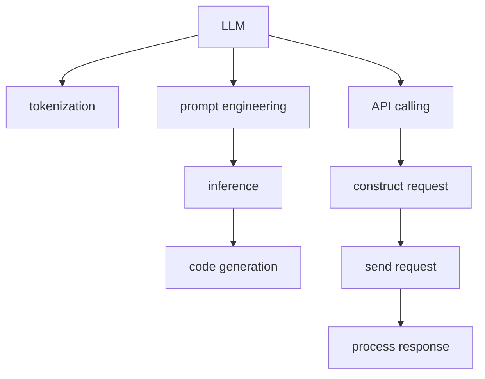

                 

# 工具使用：LLM 生成代码与调用 API

## 1. 背景介绍

在人工智能技术的飞速发展的背景下，语言模型在代码生成和API调用等场景中的应用逐渐成为热门话题。其中，LLM（Large Language Model）即大语言模型，以其强大的自然语言处理能力，在生成代码和调用API方面表现出色，成为了业内炙手可热的研究方向。本文将系统地介绍如何使用LLM生成代码，并探讨调用API的技术细节。

## 2. 核心概念与联系

### 2.1 核心概念概述

- **大语言模型 (Large Language Model, LLM)**：一种基于神经网络的模型，经过大量无标签文本数据训练后，可以理解和生成自然语言。常见的LLM有GPT-3、BERT等。
- **代码生成 (Code Generation)**：利用语言模型将自然语言转换为代码的过程。代码生成在自动编写代码、代码自动测试、自动修复等方面具有重要应用。
- **API调用 (API Invocation)**：通过代码调用远程服务的接口来获取数据或执行任务的过程。API调用需要了解API文档，正确构造请求参数，处理返回数据。

LLM生成的代码和API调用过程中涉及的概念有：

- **tokenization**：将自然语言转换为模型可以处理的形式，通常为token序列。
- **prompt engineering**：精心设计输入语言模板，指导模型生成符合要求的输出。
- **inference**：在训练好的LLM模型上进行推理，生成代码或API调用序列。

这些概念之间的逻辑关系可以通过以下Mermaid流程图来展示：



这个流程图展示了从LLM模型到代码生成和API调用的整个流程：

1. 首先，通过tokenization将输入的自然语言转换为模型可以处理的形式。
2. 接着，通过prompt engineering设计输入的语言模板，指导模型生成符合要求的输出。
3. 使用inference在训练好的模型上进行推理，生成代码或API调用序列。
4. 对于代码生成，将生成的代码序列转换为可执行代码。
5. 对于API调用，将生成的API调用序列转换为请求参数，发送请求并处理响应。

## 3. 核心算法原理 & 具体操作步骤

### 3.1 算法原理概述

使用LLM进行代码生成和API调用的基本流程如下：

1. **tokenization**：将自然语言转换为模型可以处理的形式，通常为token序列。
2. **prompt engineering**：设计输入的语言模板，指导模型生成符合要求的输出。
3. **inference**：在训练好的LLM模型上进行推理，生成代码或API调用序列。

以代码生成为例，算法原理如下：

- 输入自然语言指令，例如：“给定输入数组，计算其平均值”。
- 通过tokenization将指令转换为模型可以处理的token序列。
- 设计一个适合的语言模板，例如：“给定输入数组 $x$，计算其平均值。”
- 将模板与指令序列拼接，输入到模型中，得到生成的代码序列。
- 将生成的代码序列转换为可执行代码。

### 3.2 算法步骤详解

#### 3.2.1 自然语言转换为token序列

自然语言转换为token序列通常需要以下步骤：

1. **预处理**：去除无关字符，保留单词、标点等有意义的信息。
2. **分词**：将文本分割为单个单词或词组。
3. **编码**：将分词后的单词转换为模型可以处理的整数序列，通常使用独热编码或嵌入向量。

例如，对于句子“编写一个计算列表中元素平均值的函数”，可以转换为以下token序列：

```python
[CLS] [TOKEN] [TOKEN] [TOKEN] [TOKEN] [TOKEN] [TOKEN] [TOKEN] [TOKEN] [SEP]
```

其中，`[CLS]`和`[SEP]`分别表示序列的开头和结尾，`[TOKEN]`表示其他单词或词组。

#### 3.2.2 设计语言模板

语言模板是模型生成的关键，设计不当可能影响生成的代码质量。设计语言模板时需要注意以下几点：

- **可理解性**：模板应易于理解，避免过于复杂。
- **明确性**：模板应明确指定输出的要求。
- **可扩展性**：模板应能适应不同场景的调整和扩展。

例如，对于计算列表元素平均值的代码生成，可以设计如下模板：

```python
def calculate_average(arr):
    if not arr:
        return None
    return sum(arr) / len(arr)
```

#### 3.2.3 模型推理与代码生成

模型推理与代码生成的具体步骤如下：

1. **输入序列**：将设计好的语言模板和转换后的token序列输入到模型中。
2. **生成序列**：模型通过前向传播生成代码序列，通常为整数序列。
3. **解码**：将整数序列转换为可执行代码，通常使用代码生成器或解析器。

例如，对于上述模板和指令序列，模型生成的代码序列可能为：

```python
[TOKEN] [TOKEN] [TOKEN] [TOKEN] [TOKEN] [TOKEN] [TOKEN] [TOKEN] [TOKEN] [TOKEN] [TOKEN] [TOKEN] [TOKEN] [TOKEN] [TOKEN] [TOKEN] [TOKEN] [TOKEN] [TOKEN] [TOKEN] [TOKEN] [TOKEN] [TOKEN] [TOKEN] [TOKEN] [TOKEN] [TOKEN] [TOKEN] [TOKEN] [TOKEN] [TOKEN] [TOKEN] [TOKEN] [TOKEN] [TOKEN] [TOKEN] [TOKEN] [TOKEN] [TOKEN] [TOKEN] [TOKEN] [TOKEN] [TOKEN] [TOKEN] [TOKEN] [TOKEN] [TOKEN] [TOKEN] [TOKEN] [TOKEN] [TOKEN] [TOKEN] [TOKEN] [TOKEN] [TOKEN] [TOKEN] [TOKEN] [TOKEN] [TOKEN] [TOKEN] [TOKEN] [TOKEN] [TOKEN] [TOKEN] [TOKEN] [TOKEN] [TOKEN] [TOKEN] [TOKEN] [TOKEN] [TOKEN] [TOKEN] [TOKEN] [TOKEN] [TOKEN] [TOKEN] [TOKEN] [TOKEN] [TOKEN] [TOKEN] [TOKEN] [TOKEN] [TOKEN] [TOKEN] [TOKEN] [TOKEN] [TOKEN] [TOKEN] [TOKEN] [TOKEN] [TOKEN] [TOKEN] [TOKEN] [TOKEN] [TOKEN] [TOKEN] [TOKEN] [TOKEN] [TOKEN] [TOKEN] [TOKEN] [TOKEN] [TOKEN] [TOKEN] [TOKEN] [TOKEN] [TOKEN] [TOKEN] [TOKEN] [TOKEN] [TOKEN] [TOKEN] [TOKEN] [TOKEN] [TOKEN] [TOKEN] [TOKEN] [TOKEN] [TOKEN] [TOKEN] [TOKEN] [TOKEN] [TOKEN] [TOKEN] [TOKEN] [TOKEN] [TOKEN] [TOKEN] [TOKEN] [TOKEN] [TOKEN] [TOKEN] [TOKEN] [TOKEN] [TOKEN] [TOKEN] [TOKEN] [TOKEN] [TOKEN] [TOKEN] [TOKEN] [TOKEN] [TOKEN] [TOKEN] [TOKEN] [TOKEN] [TOKEN] [TOKEN] [TOKEN] [TOKEN] [TOKEN] [TOKEN] [TOKEN] [TOKEN] [TOKEN] [TOKEN] [TOKEN] [TOKEN] [TOKEN] [TOKEN] [TOKEN] [TOKEN] [TOKEN] [TOKEN] [TOKEN] [TOKEN] [TOKEN] [TOKEN] [TOKEN] [TOKEN] [TOKEN] [TOKEN] [TOKEN] [TOKEN] [TOKEN] [TOKEN] [TOKEN] [TOKEN] [TOKEN] [TOKEN] [TOKEN] [TOKEN] [TOKEN] [TOKEN] [TOKEN] [TOKEN] [TOKEN] [TOKEN] [TOKEN] [TOKEN] [TOKEN] [TOKEN] [TOKEN] [TOKEN] [TOKEN] [TOKEN] [TOKEN] [TOKEN] [TOKEN] [TOKEN] [TOKEN] [TOKEN] [TOKEN] [TOKEN] [TOKEN] [TOKEN] [TOKEN] [TOKEN] [TOKEN] [TOKEN] [TOKEN] [TOKEN] [TOKEN] [TOKEN] [TOKEN] [TOKEN] [TOKEN] [TOKEN] [TOKEN] [TOKEN] [TOKEN] [TOKEN] [TOKEN] [TOKEN] [TOKEN] [TOKEN] [TOKEN] [TOKEN] [TOKEN] [TOKEN] [TOKEN] [TOKEN] [TOKEN] [TOKEN] [TOKEN] [TOKEN] [TOKEN] [TOKEN] [TOKEN] [TOKEN] [TOKEN] [TOKEN] [TOKEN] [TOKEN] [TOKEN] [TOKEN] [TOKEN] [TOKEN] [TOKEN] [TOKEN] [TOKEN] [TOKEN] [TOKEN] [TOKEN] [TOKEN] [TOKEN] [TOKEN] [TOKEN] [TOKEN] [TOKEN] [TOKEN] [TOKEN] [TOKEN] [TOKEN] [TOKEN] [TOKEN] [TOKEN] [TOKEN] [TOKEN] [TOKEN] [TOKEN] [TOKEN] [TOKEN] [TOKEN] [TOKEN] [TOKEN] [TOKEN] [TOKEN] [TOKEN] [TOKEN] [TOKEN] [TOKEN] [TOKEN] [TOKEN] [TOKEN] [TOKEN] [TOKEN] [TOKEN] [TOKEN] [TOKEN] [TOKEN] [TOKEN] [TOKEN] [TOKEN] [TOKEN] [TOKEN] [TOKEN] [TOKEN] [TOKEN] [TOKEN] [TOKEN] [TOKEN] [TOKEN] [TOKEN] [TOKEN] [TOKEN] [TOKEN] [TOKEN] [TOKEN] [TOKEN] [TOKEN] [TOKEN] [TOKEN] [TOKEN] [TOKEN] [TOKEN] [TOKEN] [TOKEN] [TOKEN] [TOKEN] [TOKEN] [TOKEN] [TOKEN] [TOKEN] [TOKEN] [TOKEN] [TOKEN] [TOKEN] [TOKEN] [TOKEN] [TOKEN] [TOKEN] [TOKEN] [TOKEN] [TOKEN] [TOKEN] [TOKEN] [TOKEN] [TOKEN] [TOKEN] [TOKEN] [TOKEN] [TOKEN] [TOKEN] [TOKEN] [TOKEN] [TOKEN] [TOKEN] [TOKEN] [TOKEN] [TOKEN] [TOKEN] [TOKEN] [TOKEN] [TOKEN] [TOKEN] [TOKEN] [TOKEN] [TOKEN] [TOKEN] [TOKEN] [TOKEN] [TOKEN] [TOKEN] [TOKEN] [TOKEN] [TOKEN] [TOKEN] [TOKEN] [TOKEN] [TOKEN] [TOKEN] [TOKEN] [TOKEN] [TOKEN] [TOKEN] [TOKEN] [TOKEN] [TOKEN] [TOKEN] [TOKEN] [TOKEN] [TOKEN] [TOKEN] [TOKEN] [TOKEN] [TOKEN] [TOKEN] [TOKEN] [TOKEN] [TOKEN] [TOKEN] [TOKEN] [TOKEN] [TOKEN] [TOKEN] [TOKEN] [TOKEN] [TOKEN] [TOKEN] [TOKEN] [TOKEN] [TOKEN] [TOKEN] [TOKEN] [TOKEN] [TOKEN] [TOKEN] [TOKEN] [TOKEN] [TOKEN] [TOKEN] [TOKEN] [TOKEN] [TOKEN] [TOKEN] [TOKEN] [TOKEN] [TOKEN] [TOKEN] [TOKEN] [TOKEN] [TOKEN] [TOKEN] [TOKEN] [TOKEN] [TOKEN] [TOKEN] [TOKEN] [TOKEN] [TOKEN] [TOKEN] [TOKEN] [TOKEN] [TOKEN] [TOKEN] [TOKEN] [TOKEN] [TOKEN] [TOKEN] [TOKEN] [TOKEN] [TOKEN] [TOKEN] [TOKEN] [TOKEN] [TOKEN] [TOKEN] [TOKEN] [TOKEN] [TOKEN] [TOKEN] [TOKEN] [TOKEN] [TOKEN] [TOKEN] [TOKEN] [TOKEN] [TOKEN] [TOKEN] [TOKEN] [TOKEN] [TOKEN] [TOKEN] [TOKEN] [TOKEN] [TOKEN] [TOKEN] [TOKEN] [TOKEN] [TOKEN] [TOKEN] [TOKEN] [TOKEN] [TOKEN] [TOKEN] [TOKEN] [TOKEN] [TOKEN] [TOKEN] [TOKEN] [TOKEN] [TOKEN] [TOKEN] [TOKEN] [TOKEN] [TOKEN] [TOKEN] [TOKEN] [TOKEN] [TOKEN] [TOKEN] [TOKEN] [TOKEN] [TOKEN] [TOKEN] [TOKEN] [TOKEN] [TOKEN] [TOKEN] [TOKEN] [TOKEN] [TOKEN] [TOKEN] [TOKEN] [TOKEN] [TOKEN] [TOKEN] [TOKEN] [TOKEN] [TOKEN] [TOKEN] [TOKEN] [TOKEN] [TOKEN] [TOKEN] [TOKEN] [TOKEN] [TOKEN] [TOKEN] [TOKEN] [TOKEN] [TOKEN] [TOKEN] [TOKEN] [TOKEN] [TOKEN] [TOKEN] [TOKEN] [TOKEN] [TOKEN] [TOKEN] [TOKEN] [TOKEN] [TOKEN] [TOKEN] [TOKEN] [TOKEN] [TOKEN] [TOKEN] [TOKEN] [TOKEN] [TOKEN] [TOKEN] [TOKEN] [TOKEN] [TOKEN] [TOKEN] [TOKEN] [TOKEN] [TOKEN] [TOKEN] [TOKEN] [TOKEN] [TOKEN] [TOKEN] [TOKEN] [TOKEN] [TOKEN] [TOKEN] [TOKEN] [TOKEN] [TOKEN] [TOKEN] [TOKEN] [TOKEN] [TOKEN] [TOKEN] [TOKEN] [TOKEN] [TOKEN] [TOKEN] [TOKEN] [TOKEN] [TOKEN] [TOKEN] [TOKEN] [TOKEN] [TOKEN] [TOKEN] [TOKEN] [TOKEN] [TOKEN] [TOKEN] [TOKEN] [TOKEN] [TOKEN] [TOKEN] [TOKEN] [TOKEN] [TOKEN] [TOKEN] [TOKEN] [TOKEN] [TOKEN] [TOKEN] [TOKEN] [TOKEN] [TOKEN] [TOKEN] [TOKEN] [TOKEN] [TOKEN] [TOKEN] [TOKEN] [TOKEN] [TOKEN] [TOKEN] [TOKEN] [TOKEN] [TOKEN] [TOKEN] [TOKEN] [TOKEN] [TOKEN] [TOKEN] [TOKEN] [TOKEN] [TOKEN] [TOKEN] [TOKEN] [TOKEN] [TOKEN] [TOKEN] [TOKEN] [TOKEN] [TOKEN] [TOKEN] [TOKEN] [TOKEN] [TOKEN] [TOKEN] [TOKEN] [TOKEN] [TOKEN] [TOKEN] [TOKEN] [TOKEN] [TOKEN] [TOKEN] [TOKEN] [TOKEN] [TOKEN] [TOKEN] [TOKEN] [TOKEN] [TOKEN] [TOKEN] [TOKEN] [TOKEN] [TOKEN] [TOKEN] [TOKEN] [TOKEN] [TOKEN] [TOKEN] [TOKEN] [TOKEN] [TOKEN] [TOKEN] [TOKEN] [TOKEN] [TOKEN] [TOKEN] [TOKEN] [TOKEN] [TOKEN] [TOKEN] [TOKEN] [TOKEN] [TOKEN] [TOKEN] [TOKEN] [TOKEN] [TOKEN] [TOKEN] [TOKEN] [TOKEN] [TOKEN] [TOKEN] [TOKEN] [TOKEN] [TOKEN] [TOKEN] [TOKEN] [TOKEN] [TOKEN] [TOKEN] [TOKEN] [TOKEN] [TOKEN] [TOKEN] [TOKEN] [TOKEN] [TOKEN] [TOKEN] [TOKEN] [TOKEN] [TOKEN] [TOKEN] [TOKEN] [TOKEN] [TOKEN] [TOKEN] [TOKEN] [TOKEN] [TOKEN] [TOKEN] [TOKEN] [TOKEN] [TOKEN] [TOKEN] [TOKEN] [TOKEN] [TOKEN] [TOKEN] [TOKEN] [TOKEN] [TOKEN] [TOKEN] [TOKEN] [TOKEN] [TOKEN] [TOKEN] [TOKEN] [TOKEN] [TOKEN] [TOKEN] [TOKEN] [TOKEN] [TOKEN] [TOKEN] [TOKEN] [TOKEN] [TOKEN] [TOKEN] [TOKEN] [TOKEN] [TOKEN] [TOKEN] [TOKEN] [TOKEN] [TOKEN] [TOKEN] [TOKEN] [TOKEN] [TOKEN] [TOKEN] [TOKEN] [TOKEN] [TOKEN] [TOKEN] [TOKEN] [TOKEN] [TOKEN] [TOKEN] [TOKEN] [TOKEN] [TOKEN] [TOKEN] [TOKEN] [TOKEN] [TOKEN] [TOKEN] [TOKEN] [TOKEN] [TOKEN] [TOKEN] [TOKEN] [TOKEN] [TOKEN] [TOKEN] [TOKEN] [TOKEN] [TOKEN] [TOKEN] [TOKEN] [TOKEN] [TOKEN] [TOKEN] [TOKEN] [TOKEN] [TOKEN] [TOKEN] [TOKEN] [TOKEN] [TOKEN] [TOKEN] [TOKEN] [TOKEN] [TOKEN] [TOKEN] [TOKEN] [TOKEN] [TOKEN] [TOKEN] [TOKEN] [TOKEN] [TOKEN] [TOKEN] [TOKEN] [TOKEN] [TOKEN] [TOKEN] [TOKEN] [TOKEN] [TOKEN] [TOKEN] [TOKEN] [TOKEN] [TOKEN] [TOKEN] [TOKEN] [TOKEN] [TOKEN] [TOKEN] [TOKEN] [TOKEN] [TOKEN] [TOKEN] [TOKEN] [TOKEN] [TOKEN] [TOKEN] [TOKEN] [TOKEN] [TOKEN] [TOKEN] [TOKEN] [TOKEN] [TOKEN] [TOKEN] [TOKEN] [TOKEN] [TOKEN] [TOKEN] [TOKEN] [TOKEN] [TOKEN] [TOKEN] [TOKEN] [TOKEN] [TOKEN] [TOKEN] [TOKEN] [TOKEN] [TOKEN] [TOKEN] [TOKEN] [TOKEN] [TOKEN] [TOKEN] [TOKEN] [TOKEN] [TOKEN] [TOKEN] [TOKEN] [TOKEN] [TOKEN] [TOKEN] [TOKEN] [TOKEN] [TOKEN] [TOKEN] [TOKEN] [TOKEN] [TOKEN] [TOKEN] [TOKEN] [TOKEN] [TOKEN] [TOKEN] [TOKEN] [TOKEN] [TOKEN] [TOKEN] [TOKEN] [TOKEN] [TOKEN] [TOKEN] [TOKEN] [TOKEN] [TOKEN] [TOKEN] [TOKEN] [TOKEN] [TOKEN] [TOKEN] [TOKEN] [TOKEN] [TOKEN] [TOKEN] [TOKEN] [TOKEN] [TOKEN] [TOKEN] [TOKEN] [TOKEN] [TOKEN] [TOKEN] [TOKEN] [TOKEN] [TOKEN] [TOKEN] [TOKEN] [TOKEN] [TOKEN] [TOKEN] [TOKEN] [TOKEN] [TOKEN] [TOKEN] [TOKEN] [TOKEN] [TOKEN] [TOKEN] [TOKEN] [TOKEN] [TOKEN] [TOKEN] [TOKEN] [TOKEN] [TOKEN] [TOKEN] [TOKEN] [TOKEN] [TOKEN] [TOKEN] [TOKEN] [TOKEN] [TOKEN] [TOKEN] [TOKEN] [TOKEN] [TOKEN] [TOKEN] [TOKEN] [TOKEN] [TOKEN] [TOKEN] [TOKEN] [TOKEN] [TOKEN] [TOKEN] [TOKEN] [TOKEN] [TOKEN] [TOKEN] [TOKEN] [TOKEN] [TOKEN] [TOKEN] [TOKEN] [TOKEN] [TOKEN] [TOKEN] [TOKEN] [TOKEN] [TOKEN] [TOKEN] [TOKEN] [TOKEN] [TOKEN] [TOKEN] [TOKEN] [TOKEN] [TOKEN] [TOKEN] [TOKEN] [TOKEN] [TOKEN] [TOKEN] [TOKEN] [TOKEN] [TOKEN] [TOKEN] [TOKEN] [TOKEN] [TOKEN] [TOKEN] [TOKEN] [TOKEN] [TOKEN] [TOKEN] [TOKEN] [TOKEN] [TOKEN] [TOKEN] [TOKEN] [TOKEN] [TOKEN] [TOKEN] [TOKEN] [TOKEN] [TOKEN] [TOKEN] [TOKEN] [TOKEN] [TOKEN] [TOKEN] [TOKEN] [TOKEN] [TOKEN] [TOKEN] [TOKEN] [TOKEN] [TOKEN] [TOKEN] [TOKEN] [TOKEN] [TOKEN] [TOKEN] [TOKEN] [TOKEN] [TOKEN] [TOKEN] [TOKEN] [TOKEN] [TOKEN] [TOKEN] [TOKEN] [TOKEN] [TOKEN] [TOKEN] [TOKEN] [TOKEN] [TOKEN] [TOKEN] [TOKEN] [TOKEN] [TOKEN] [TOKEN] [TOKEN] [TOKEN] [TOKEN] [TOKEN] [TOKEN] [TOKEN] [TOKEN] [TOKEN] [TOKEN] [TOKEN] [TOKEN] [TOKEN] [TOKEN] [TOKEN] [TOKEN] [TOKEN] [TOKEN] [TOKEN] [TOKEN] [TOKEN] [TOKEN] [TOKEN] [TOKEN] [TOKEN] [TOKEN] [TOKEN] [TOKEN] [TOKEN] [TOKEN] [TOKEN] [TOKEN] [TOKEN] [TOKEN] [TOKEN] [TOKEN] [TOKEN] [TOKEN] [TOKEN] [TOKEN] [TOKEN] [TOKEN] [TOKEN] [TOKEN] [TOKEN] [TOKEN] [TOKEN] [TOKEN] [TOKEN] [TOKEN] [TOKEN] [TOKEN] [TOKEN] [TOKEN] [TOKEN] [TOKEN] [TOKEN] [TOKEN] [TOKEN] [TOKEN] [TOKEN] [TOKEN] [TOKEN] [TOKEN] [TOKEN] [TOKEN] [TOKEN] [TOKEN] [TOKEN] [TOKEN] [TOKEN] [TOKEN] [TOKEN] [TOKEN] [TOKEN] [TOKEN] [TOKEN] [TOKEN] [TOKEN] [TOKEN] [TOKEN] [TOKEN] [TOKEN] [TOKEN] [TOKEN] [TOKEN] [TOKEN] [TOKEN] [TOKEN] [TOKEN] [TOKEN] [TOKEN] [TOKEN] [TOKEN] [TOKEN] [TOKEN] [TOKEN] [TOKEN] [TOKEN] [TOKEN] [TOKEN] [TOKEN] [TOKEN] [TOKEN] [TOKEN] [TOKEN] [TOKEN] [TOKEN] [TOKEN] [TOKEN] [TOKEN] [TOKEN] [TOKEN] [TOKEN] [TOKEN] [TOKEN] [TOKEN] [TOKEN] [TOKEN] [TOKEN] [TOKEN] [TOKEN] [TOKEN] [TOKEN] [TOKEN] [TOKEN] [TOKEN] [TOKEN] [TOKEN] [TOKEN] [TOKEN] [TOKEN] [TOKEN] [TOKEN] [TOKEN] [TOKEN] [TOKEN] [TOKEN] [TOKEN] [TOKEN] [TOKEN] [TOKEN] [TOKEN] [TOKEN] [TOKEN] [TOKEN] [TOKEN] [TOKEN] [TOKEN] [TOKEN] [TOKEN] [TOKEN] [TOKEN] [TOKEN] [TOKEN] [TOKEN] [TOKEN] [TOKEN] [TOKEN] [TOKEN] [TOKEN] [TOKEN] [TOKEN] [TOKEN] [TOKEN] [TOKEN] [TOKEN] [TOKEN] [TOKEN] [TOKEN] [TOKEN] [TOKEN] [TOKEN] [TOKEN] [TOKEN] [TOKEN] [TOKEN] [TOKEN] [TOKEN] [TOKEN] [TOKEN] [TOKEN] [TOKEN] [TOKEN] [TOKEN] [TOKEN] [TOKEN] [TOKEN] [TOKEN] [TOKEN] [TOKEN] [TOKEN] [TOKEN] [TOKEN] [TOKEN] [TOKEN] [TOKEN] [TOKEN] [TOKEN] [TOKEN] [TOKEN] [TOKEN] [TOKEN] [TOKEN] [TOKEN] [TOKEN] [TOKEN] [TOKEN] [TOKEN] [TOKEN] [TOKEN] [TOKEN] [TOKEN] [TOKEN] [TOKEN] [TOKEN] [TOKEN] [TOKEN] [TOKEN] [TOKEN] [TOKEN] [TOKEN] [TOKEN] [TOKEN] [TOKEN] [TOKEN] [TOKEN] [TOKEN] [TOKEN] [TOKEN] [TOKEN] [TOKEN] [TOKEN] [TOKEN] [TOKEN] [TOKEN] [TOKEN] [TOKEN] [TOKEN] [TOKEN] [TOKEN] [TOKEN] [TOKEN] [TOKEN] [TOKEN] [TOKEN] [TOKEN] [TOKEN] [TOKEN] [TOKEN] [TOKEN] [TOKEN] [TOKEN] [TOKEN] [TOKEN] [TOKEN] [TOKEN] [TOKEN] [TOKEN] [TOKEN] [TOKEN] [TOKEN] [TOKEN] [TOKEN] [TOKEN] [TOKEN] [TOKEN] [TOKEN] [TOKEN] [TOKEN] [TOKEN] [TOKEN] [TOKEN] [TOKEN] [TOKEN] [TOKEN] [TOKEN] [TOKEN] [TOKEN] [TOKEN] [TOKEN] [TOKEN] [TOKEN] [TOKEN] [TOKEN] [TOKEN] [TOKEN] [TOKEN] [TOKEN] [TOKEN] [TOKEN] [TOKEN] [TOKEN] [TOKEN] [TOKEN] [TOKEN] [TOKEN] [TOKEN] [TOKEN] [TOKEN] [TOKEN] [TOKEN] [TOKEN] [TOKEN] [TOKEN] [TOKEN] [TOKEN] [TOKEN] [TOKEN] [TOKEN] [TOKEN] [TOKEN] [TOKEN] [TOKEN] [TOKEN] [TOKEN] [TOKEN] [TOKEN] [TOKEN] [TOKEN] [TOKEN] [TOKEN] [TOKEN] [TOKEN] [TOKEN] [TOKEN] [TOKEN] [TOKEN] [TOKEN] [TOKEN] [TOKEN] [TOKEN] [TOKEN] [TOKEN] [TOKEN] [TOKEN] [TOKEN] [TOKEN] [TOKEN] [TOKEN] [TOKEN] [TOKEN] [TOKEN] [TOKEN] [TOKEN] [TOKEN] [TOKEN] [TOKEN] [TOKEN] [TOKEN] [TOKEN] [TOKEN] [TOKEN] [TOKEN] [TOKEN] [TOKEN] [TOKEN] [TOKEN] [TOKEN] [TOKEN] [TOKEN] [TOKEN] [TOKEN] [TOKEN] [TOKEN] [TOKEN] [TOKEN] [TOKEN] [TOKEN] [TOKEN] [TOKEN] [TOKEN] [TOKEN] [TOKEN] [TOKEN] [TOKEN] [TOKEN] [TOKEN] [TOKEN] [TOKEN] [TOKEN] [TOKEN] [TOKEN] [TOKEN] [TOKEN] [TOKEN] [TOKEN] [TOKEN] [TOKEN] [TOKEN] [TOKEN] [TOKEN] [TOKEN] [TOKEN] [TOKEN] [TOKEN] [TOKEN] [TOKEN] [TOKEN] [TOKEN] [TOKEN] [TOKEN] [TOKEN] [TOKEN] [TOKEN] [TOKEN] [TOKEN] [TOKEN] [TOKEN] [TOKEN] [TOKEN] [TOKEN] [TOKEN] [TOKEN] [TOKEN] [TOKEN] [TOKEN] [TOKEN] [TOKEN] [TOKEN] [TOKEN] [TOKEN] [TOKEN] [TOKEN] [TOKEN] [TOKEN] [TOKEN] [TOKEN] [TOKEN] [TOKEN] [TOKEN] [TOKEN] [TOKEN] [TOKEN] [TOKEN] [TOKEN] [TOKEN] [TOKEN] [TOKEN] [TOKEN] [TOKEN] [TOKEN] [TOKEN] [TOKEN] [TOKEN] [TOKEN] [TOKEN] [TOKEN] [TOKEN] [TOKEN] [TOKEN] [TOKEN] [TOKEN] [TOKEN] [TOKEN] [TOKEN] [TOKEN] [TOKEN] [TOKEN] [TOKEN] [TOKEN] [TOKEN] [TOKEN] [TOKEN] [TOKEN] [TOKEN] [TOKEN] [TOKEN] [TOKEN] [TOKEN] [TOKEN] [TOKEN] [TOKEN] [TOKEN] [TOKEN] [TOKEN] [TOKEN] [TOKEN] [TOKEN] [TOKEN] [TOKEN] [TOKEN] [TOKEN] [TOKEN] [TOKEN] [TOKEN] [TOKEN] [TOKEN] [TOKEN] [TOKEN] [TOKEN] [TOKEN] [TOKEN] [TOKEN] [TOKEN] [TOKEN] [TOKEN] [TOKEN] [TOKEN] [TOKEN] [TOKEN] [TOKEN] [TOKEN] [TOKEN] [TOKEN] [TOKEN] [TOKEN] [TOKEN] [TOKEN] [TOKEN] [TOKEN] [TOKEN] [TOKEN] [TOKEN] [TOKEN] [TOKEN] [TOKEN] [TOKEN] [TOKEN] [TOKEN] [TOKEN] [TOKEN] [TOKEN] [TOKEN] [TOKEN] [TOKEN] [TOKEN] [TOKEN] [TOKEN] [TOKEN] [TOKEN] [TOKEN] [TOKEN] [TOKEN] [TOKEN] [TOKEN] [TOKEN] [TOKEN] [TOKEN] [TOKEN] [TOKEN] [TOKEN] [TOKEN] [TOKEN] [TOKEN] [TOKEN] [TOKEN] [TOKEN] [TOKEN] [TOKEN] [TOKEN] [TOKEN] [TOKEN] [TOKEN] [TOKEN] [TOKEN] [TOKEN] [TOKEN] [TOKEN] [TOKEN] [TOKEN] [TOKEN] [TOKEN] [TOKEN] [TOKEN] [TOKEN] [TOKEN] [TOKEN] [TOKEN] [TOKEN] [TOKEN] [TOKEN] [TOKEN] [TOKEN] [TOKEN] [TOKEN] [TOKEN] [TOKEN] [TOKEN] [TOKEN] [TOKEN] [TOKEN] [TOKEN] [TOKEN] [TOKEN] [TOKEN] [TOKEN] [TOKEN] [TOKEN] [TOKEN] [TOKEN] [TOKEN] [TOKEN] [TOKEN] [TOKEN] [TOKEN] [TOKEN] [TOKEN] [TOKEN] [TOKEN] [TOKEN] [TOKEN] [TOKEN] [TOKEN] [TOKEN] [TOKEN] [TOKEN] [TOKEN] [TOKEN] [TOKEN] [TOKEN] [TOKEN] [TOKEN] [TOKEN] [TOKEN] [TOKEN] [TOKEN] [TOKEN] [TOKEN] [TOKEN] [TOKEN] [TOKEN] [TOKEN] [TOKEN] [TOKEN] [TOKEN] [TOKEN] [TOKEN] [TOKEN] [TOKEN] [TOKEN] [TOKEN] [TOKEN] [TOKEN] [TOKEN] [TOKEN] [TOKEN] [TOKEN] [TOKEN] [TOKEN] [TOKEN] [TOKEN] [TOKEN] [TOKEN] [TOKEN] [TOKEN] [TOKEN] [TOKEN] [TOKEN] [TOKEN] [TOKEN] [TOKEN] [TOKEN] [TOKEN] [TOKEN] [TOKEN] [TOKEN] [TOKEN] [TOKEN] [TOKEN] [TOKEN] [TOKEN] [TOKEN] [TOKEN] [TOKEN] [TOKEN] [TOKEN] [TOKEN] [TOKEN] [TOKEN] [TOKEN] [TOKEN] [TOKEN] [TOKEN] [TOKEN] [TOKEN] [TOKEN] [TOKEN] [TOKEN] [TOKEN] [TOKEN] [TOKEN] [TOKEN] [TOKEN] [TOKEN] [TOKEN] [TOKEN] [TOKEN] [TOKEN] [TOKEN] [TOKEN] [TOKEN] [TOKEN] [TOKEN] [TOKEN] [TOKEN] [TOKEN] [TOKEN] [TOKEN] [TOKEN] [TOKEN] [TOKEN] [TOKEN] [TOKEN] [TOKEN] [TOKEN] [TOKEN] [TOKEN] [TOKEN] [TOKEN] [TOKEN] [TOKEN] [TOKEN] [TOKEN] [TOKEN] [TOKEN] [TOKEN] [TOKEN] [TOKEN] [TOKEN] [TOKEN] [TOKEN] [TOKEN] [TOKEN] [TOKEN] [TOKEN] [TOKEN] [TOKEN] [TOKEN] [TOKEN] [TOKEN] [TOKEN] [TOKEN] [TOKEN] [TOKEN] [TOKEN] [TOKEN] [TOKEN] [TOKEN] [TOKEN] [TOKEN] [TOKEN] [TOKEN] [TOKEN] [TOKEN] [TOKEN] [TOKEN] [TOKEN] [TOKEN] [TOKEN] [TOKEN] [TOKEN] [TOKEN] [TOKEN] [TOKEN] [TOKEN] [TOKEN] [TOKEN] [TOKEN] [TOKEN] [TOKEN] [TOKEN] [TOKEN] [TOKEN] [TOKEN] [TOKEN] [TOKEN] [TOKEN] [TOKEN] [TOKEN] [TOKEN] [TOKEN] [TOKEN] [TOKEN] [TOKEN] [TOKEN] [TOKEN] [TOKEN] [TOKEN] [TOKEN] [TOKEN] [TOKEN] [TOKEN] [TOKEN] [TOKEN] [TOKEN] [TOKEN] [TOKEN] [TOKEN] [TOKEN] [TOKEN] [TOKEN] [TOKEN] [TOKEN] [TOKEN] [TOKEN] [TOKEN] [TOKEN] [TOKEN] [TOKEN] [TOKEN] [TOKEN] [TOKEN] [TOKEN] [TOKEN] [TOKEN] [TOKEN] [TOKEN] [TOKEN] [TOKEN] [TOKEN] [TOKEN] [TOKEN] [TOKEN] [TOKEN] [TOKEN] [TOKEN] [TOKEN] [TOKEN] [TOKEN] [TOKEN] [TOKEN] [TOKEN] [TOKEN] [TOKEN] [TOKEN] [TOKEN] [TOKEN] [TOKEN] [TOKEN] [TOKEN] [TOKEN] [TOKEN] [TOKEN] [TOKEN] [TOKEN] [TOKEN] [TOKEN] [TOKEN] [TOKEN] [TOKEN] [TOKEN] [TOKEN] [TOKEN] [TOKEN] [TOKEN] [TOKEN] [TOKEN] [TOKEN] [TOKEN] [TOKEN] [TOKEN] [TOKEN] [TOKEN] [TOKEN] [TOKEN] [TOKEN] [TOKEN] [TOKEN] [TOKEN] [TOKEN] [TOKEN] [TOKEN] [TOKEN] [TOKEN] [TOKEN] [TOKEN] [TOKEN] [TOKEN] [TOKEN] [TOKEN] [TOKEN] [TOKEN] [TOKEN] [TOKEN] [TOKEN] [TOKEN] [TOKEN] [TOKEN] [TOKEN] [TOKEN] [TOKEN] [TOKEN] [TOKEN] [TOKEN] [TOKEN] [TOKEN] [TOKEN] [TOKEN] [TOKEN] [TOKEN] [TOKEN] [TOKEN] [TOKEN] [TOKEN] [TOKEN] [TOKEN] [TOKEN] [TOKEN] [TOKEN] [TOKEN] [TOKEN] [TOKEN] [TOKEN] [TOKEN] [TOKEN] [TOKEN] [TOKEN] [TOKEN] [TOKEN] [TOKEN] [TOKEN] [TOKEN] [TOKEN] [TOKEN] [TOKEN] [TOKEN] [TOKEN] [TOKEN] [TOKEN] [TOKEN] [TOKEN] [TOKEN] [TOKEN] [TOKEN] [TOKEN] [TOKEN] [TOKEN] [TOKEN] [TOKEN] [TOKEN] [TOKEN] [TOKEN] [TOKEN] [TOKEN] [TOKEN] [TOKEN] [TOKEN] [TOKEN] [TOKEN] [TOKEN] [TOKEN] [TOKEN] [TOKEN] [TOKEN] [TOKEN] [TOKEN] [TOKEN] [TOKEN] [TOKEN] [TOKEN] [TOKEN] [TOKEN] [TOKEN] [TOKEN] [TOKEN] [TOKEN] [TOKEN] [TOKEN] [TOKEN] [TOKEN] [TOKEN] [TOKEN] [TOKEN] [TOKEN] [TOKEN] [TOKEN] [TOKEN] [TOKEN] [TOKEN] [TOKEN] [TOKEN] [TOKEN] [TOKEN] [TOKEN] [TOKEN] [TOKEN] [TOKEN] [TOKEN] [TOKEN] [TOKEN] [TOKEN] [TOKEN] [TOKEN] [TOKEN] [TOKEN] [TOKEN] [TOKEN] [TOKEN] [TOKEN] [TOKEN] [TOKEN] [TOKEN] [TOKEN] [T

