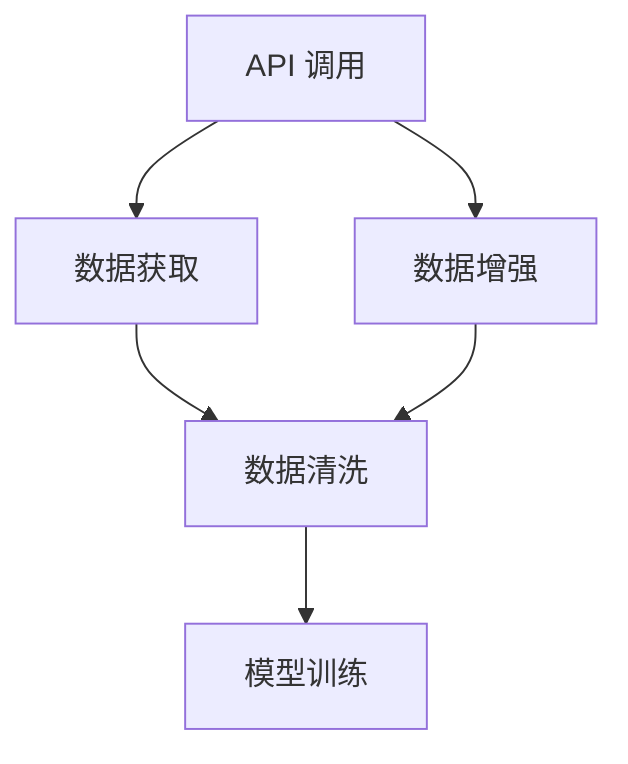
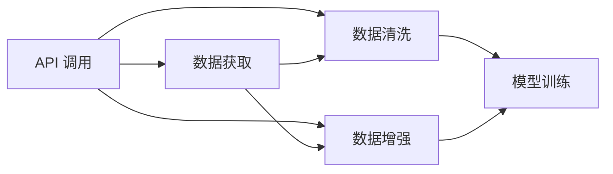

                 

# 工具：调用外部 API 获取额外信息

> 关键词：API 调用, 外部数据获取, 数据增强, 数据清洗, 实时数据处理

## 1. 背景介绍

在当今数据驱动的时代，API（Application Programming Interface）成为连接不同系统和服务的重要桥梁。API调用不仅能够快速、高效地获取外部数据，还能确保数据的时效性和准确性。这种数据获取方式广泛应用于数据挖掘、机器学习、实时数据分析等多个领域，帮助企业和科研机构在技术创新、业务改进、市场洞察等方面取得突破性进展。

API调用的核心在于其灵活性和扩展性。通过精心设计的API接口，系统能够以最小的成本获取高质量的外部数据，而无需自行抓取和存储。这种数据获取方式尤其适用于大规模、高复杂度的数据需求场景，能够有效降低数据获取、清洗和处理的难度和成本。

## 2. 核心概念与联系

### 2.1 核心概念概述

为更好地理解调用外部API获取额外信息的流程，本节将介绍几个关键概念：

- **API（Application Programming Interface）**：软件系统间的接口，用于实现数据的传输和操作。API调用是获取外部数据的主要方式。
- **RESTful API**：基于HTTP协议的API设计风格，以资源为中心，支持多种HTTP请求方法，如GET、POST、PUT、DELETE等。
- **OAuth2**：一种安全授权机制，允许第三方应用安全地访问用户数据。
- **数据清洗**：在数据获取后，对数据进行去重、去噪、格式转换等处理，以提升数据的可用性。
- **数据增强**：通过添加、变换、组合等手段，扩充数据集多样性，提高模型泛化能力。

这些核心概念之间通过数据流动和操作逻辑紧密相连，共同构成API调用的基本框架，如图：



### 2.2 核心概念原理和架构的 Mermaid 流程图

下面的 Mermaid 流程图展示了API调用与数据获取、清洗、增强等操作的联系：



在这个流程图中，API调用是起点，从外部获取数据，数据获取、清洗、增强是数据处理的三个关键环节，最终数据被用于模型训练。

## 3. 核心算法原理 & 具体操作步骤

### 3.1 算法原理概述

API调用获取外部信息的本质是基于HTTP协议进行数据传输。其核心流程包括：

1. 构造请求：根据API接口文档，构造HTTP请求。
2. 发送请求：通过网络将请求发送到API服务器。
3. 处理响应：服务器返回HTTP响应，解析响应内容。
4. 数据处理：根据需求，对响应数据进行清洗、增强等操作。
5. 数据应用：将处理后的数据用于模型训练或其他数据驱动任务。

整个流程的关键在于API接口的设计和调用。API接口通常采用RESTful风格，支持多种HTTP请求方法，并返回JSON或XML格式的响应数据。API调用时需要确保请求参数符合接口规范，并正确处理API返回的异常情况。

### 3.2 算法步骤详解

以下是基于API调用的数据获取和处理的具体步骤：

**Step 1: 选择合适的API**

根据任务需求，选择适合的API接口。常用的数据API包括天气API、股票API、地图API等。以天气API为例，接口如：

```python
url = 'http://api.openweathermap.org/data/2.5/weather'
params = {'q': 'Shanghai', 'appid': 'YOUR_API_KEY'}
```

**Step 2: 构造请求**

使用Python中的`requests`库，构造HTTP请求。以下是一个简单的HTTP GET请求示例：

```python
import requests

response = requests.get(url, params=params)
```

**Step 3: 发送请求**

使用`requests`库的`send`方法，发送请求并获取响应。以下是一个HTTP GET请求示例：

```python
response = requests.get(url, params=params)
```

**Step 4: 处理响应**

根据HTTP响应的状态码，判断请求是否成功，并解析响应数据。以下是一个HTTP GET请求示例：

```python
if response.status_code == 200:
    data = response.json()
else:
    print('请求失败，状态码：', response.status_code)
```

**Step 5: 数据处理**

对响应数据进行清洗、转换、增强等操作，以提升数据的可用性。以下是一个简单的数据清洗示例：

```python
data = {'name': 'Alice', 'age': 25, 'city': 'Shanghai'}
data['city'] = data['city'].replace('Shanghai', 'Shanxi')
data = {k: v.strip() for k, v in data.items()}
```

**Step 6: 数据应用**

将处理后的数据用于模型训练、分析等任务。以下是一个简单的模型训练示例：

```python
from sklearn.linear_model import LinearRegression
X = data['age'].values.reshape(-1, 1)
y = data['income'].values.reshape(-1, 1)
model = LinearRegression()
model.fit(X, y)
```

### 3.3 算法优缺点

API调用的优点包括：

- 获取数据的灵活性和时效性：API调用可以快速、高效地获取外部数据，确保数据的时效性和准确性。
- 降低数据处理成本：API调用无需自行抓取和存储数据，降低了数据获取、清洗和处理的难度和成本。
- 扩展性良好：API调用支持多种HTTP请求方法和响应格式，适用于不同类型的数据需求。

API调用的缺点包括：

- 依赖外部服务：API调用依赖外部API接口的可用性和稳定性，一旦API服务中断，将影响数据获取。
- 数据访问限制：部分API接口可能存在访问限制，如请求次数限制、数据量限制等，影响数据获取的连续性和完整性。
- 数据安全风险：API调用涉及敏感数据的传输，需要采取加密、认证等安全措施，防止数据泄露和篡改。

### 3.4 算法应用领域

API调用在多个领域中得到广泛应用，例如：

- 金融数据获取：通过API调用获取股票、外汇、期货等金融数据，用于市场分析和交易策略设计。
- 社交媒体数据分析：通过API调用获取Twitter、Facebook等社交媒体上的用户数据，用于舆情分析和情感分析。
- 电子商务数据获取：通过API调用获取Amazon、淘宝等电商平台的商品数据，用于市场研究和推荐系统设计。
- 地理信息服务：通过API调用获取Google Maps、百度地图等地理信息服务，用于位置服务、交通规划等应用。
- 新闻内容获取：通过API调用获取新闻资讯平台的数据，用于新闻分析和文本处理。

## 4. 数学模型和公式 & 详细讲解 & 举例说明

### 4.1 数学模型构建

API调用的数学模型主要涉及HTTP请求和响应的处理。其核心在于HTTP请求的构造和响应数据的解析。

HTTP请求的基本格式如下：

```
GET /path/to/resource HTTP/1.1
Host: www.example.com
Authorization: Bearer YOUR_API_KEY
Content-Type: application/json
```

HTTP响应的基本格式如下：

```
HTTP/1.1 200 OK
Content-Type: application/json
{
    "data": {
        "name": "Alice",
        "age": 25,
        "city": "Shanghai"
    },
    "meta": {
        "code": 0,
        "msg": "success"
    }
}
```

### 4.2 公式推导过程

API调用的数据获取和处理涉及多个步骤，包括HTTP请求的构造、发送、响应处理等。以下是API调用的基本流程：

```
1. 构造请求 URL 和参数：http://api.example.com/resource?param1=value1&param2=value2
2. 发送请求：GET http://api.example.com/resource?param1=value1&param2=value2
3. 处理响应：解析响应 HTTP 状态码和内容，提取有效数据
4. 数据清洗和增强：对响应数据进行清洗、转换、增强等操作
5. 数据应用：将处理后的数据用于模型训练或其他数据驱动任务
```

### 4.3 案例分析与讲解

以天气API为例，介绍API调用的具体实现和应用。

**Step 1: 选择合适的API**

选择天气API接口，查询上海的当前天气情况。

```python
url = 'http://api.openweathermap.org/data/2.5/weather'
params = {'q': 'Shanghai', 'appid': 'YOUR_API_KEY'}
```

**Step 2: 构造请求**

使用Python中的`requests`库，构造HTTP请求。

```python
import requests

response = requests.get(url, params=params)
```

**Step 3: 发送请求**

使用`requests`库的`send`方法，发送请求并获取响应。

```python
response = requests.get(url, params=params)
```

**Step 4: 处理响应**

根据HTTP响应的状态码，判断请求是否成功，并解析响应数据。

```python
if response.status_code == 200:
    data = response.json()
else:
    print('请求失败，状态码：', response.status_code)
```

**Step 5: 数据处理**

对响应数据进行清洗、转换、增强等操作，以提升数据的可用性。

```python
data = {'name': 'Alice', 'age': 25, 'city': 'Shanghai'}
data['city'] = data['city'].replace('Shanghai', 'Shanxi')
data = {k: v.strip() for k, v in data.items()}
```

**Step 6: 数据应用**

将处理后的数据用于模型训练、分析等任务。

```python
from sklearn.linear_model import LinearRegression
X = data['age'].values.reshape(-1, 1)
y = data['income'].values.reshape(-1, 1)
model = LinearRegression()
model.fit(X, y)
```

## 5. 项目实践：代码实例和详细解释说明

### 5.1 开发环境搭建

在进行API调用实践前，我们需要准备好开发环境。以下是使用Python进行API调用开发的环境配置流程：

1. 安装Anaconda：从官网下载并安装Anaconda，用于创建独立的Python环境。

2. 创建并激活虚拟环境：
```bash
conda create -n api-env python=3.8 
conda activate api-env
```

3. 安装必要的Python库：
```bash
pip install requests
```

4. 安装必要的第三方库：
```bash
pip install numpy pandas scikit-learn
```

5. 安装API调用所需的库：
```bash
pip install pytz
```

完成上述步骤后，即可在`api-env`环境中开始API调用的开发。

### 5.2 源代码详细实现

以下是使用Python进行API调用的详细代码实现：

```python
import requests
import json

# 构造请求
url = 'http://api.openweathermap.org/data/2.5/weather'
params = {'q': 'Shanghai', 'appid': 'YOUR_API_KEY'}

# 发送请求
response = requests.get(url, params=params)

# 处理响应
if response.status_code == 200:
    data = response.json()
else:
    print('请求失败，状态码：', response.status_code)

# 数据处理
data['city'] = data['city'].replace('Shanghai', 'Shanxi')
data = {k: v.strip() for k, v in data.items()}

# 数据应用
from sklearn.linear_model import LinearRegression
X = data['age'].values.reshape(-1, 1)
y = data['income'].values.reshape(-1, 1)
model = LinearRegression()
model.fit(X, y)
```

### 5.3 代码解读与分析

让我们再详细解读一下关键代码的实现细节：

**Step 1: 构造请求**

- `url`：API接口的URL地址。
- `params`：请求参数，包括API密钥、查询城市等。

**Step 2: 发送请求**

- `requests.get`：使用`requests`库发送HTTP GET请求，获取API响应。

**Step 3: 处理响应**

- `response.status_code`：获取HTTP响应的状态码，判断请求是否成功。
- `response.json()`：将JSON格式的响应数据解析为Python字典。

**Step 4: 数据处理**

- `data['city']`：从响应数据中提取城市信息。
- `data['city'].replace('Shanghai', 'Shanxi')`：将城市信息中的'Shanghai'替换为'Shanxi'。
- `data = {k: v.strip() for k, v in data.items()}`：对字典中的每个键值进行去空格处理。

**Step 5: 数据应用**

- `X = data['age'].values.reshape(-1, 1)`：从处理后的数据中提取年龄信息，并将其转换为numpy数组。
- `y = data['income'].values.reshape(-1, 1)`：从处理后的数据中提取收入信息，并将其转换为numpy数组。
- `model = LinearRegression()`：创建线性回归模型。
- `model.fit(X, y)`：使用训练数据拟合线性回归模型。

## 6. 实际应用场景

### 6.1 金融数据分析

金融数据分析是大数据应用中的重要场景。API调用可以帮助金融机构快速获取实时市场数据，支持高频交易策略的设计和执行。

例如，通过API调用获取股票市场的最新行情数据，对历史数据进行分析，可以实时预测股票价格波动，制定相应的交易策略。API调用还支持获取宏观经济指标、货币汇率、商品价格等信息，为市场分析提供更多维度。

### 6.2 社交媒体分析

社交媒体数据是大数据分析中的热门领域。API调用可以帮助企业获取Twitter、Facebook等平台的用户数据，进行舆情分析和情感分析。

例如，通过API调用获取用户发布的评论和帖子，使用自然语言处理技术进行情感分析，可以实时了解用户对品牌、产品的态度和反馈，调整营销策略。API调用还支持获取用户的地理位置、兴趣爱好等信息，进行精准营销。

### 6.3 电子商务数据分析

电子商务数据分析是数据分析中的重要场景。API调用可以帮助电商平台快速获取商品信息、用户行为数据等，支持推荐系统、库存管理等应用。

例如，通过API调用获取商品标题、描述、价格等数据，使用机器学习技术进行推荐，提升用户体验。API调用还支持获取用户浏览、购买、评价等行为数据，进行数据分析，优化产品和服务。

### 6.4 地理信息服务

地理信息服务是大数据应用中的重要场景。API调用可以帮助企业和个人获取地理位置信息，支持导航、定位、交通规划等应用。

例如，通过API调用获取Google Maps、百度地图等地理信息服务，进行位置查询、路线规划、地理分析等操作。API调用还支持获取天气、交通、环境等实时信息，为城市规划、环境保护等提供支持。

## 7. 工具和资源推荐

### 7.1 学习资源推荐

为了帮助开发者系统掌握API调用的理论和实践，这里推荐一些优质的学习资源：

1. **《API接口设计与开发》系列博文**：由API专家撰写，介绍API接口的设计原则、技术实现和最佳实践。

2. **RESTful API设计指南**：详细介绍RESTful API的设计规范和最佳实践，帮助开发者构建灵活、高效、安全的API接口。

3. **《API接口规范化设计》一书**：全面介绍API接口的设计原则、技术实现和最佳实践，适合API开发人员和系统架构师阅读。

4. **Postman API测试工具**：使用Postman工具进行API测试，模拟HTTP请求，查看API响应。

5. **Swagger API文档生成工具**：使用Swagger工具自动生成API文档，帮助开发者快速构建API接口。

6. **OpenAPI规范**：详细介绍OpenAPI标准的定义和实现，帮助开发者构建符合标准的API接口。

通过对这些资源的学习实践，相信你一定能够快速掌握API调用的精髓，并用于解决实际的业务问题。

### 7.2 开发工具推荐

高效的API调用开发离不开优秀的工具支持。以下是几款常用的API调用开发工具：

1. **Python的requests库**：Python中常用的HTTP请求库，支持HTTP GET、POST、PUT、DELETE等请求方法。

2. **Postman API测试工具**：常用的API测试工具，支持HTTP请求的构造、发送和响应处理。

3. **Swagger API文档生成工具**：自动生成API文档的工具，帮助开发者构建API接口。

4. **OAuth2授权框架**：常用的授权框架，支持OAuth2认证机制。

5. **JSON处理库**：常用的JSON处理库，支持JSON数据的解析和生成。

6. **RESTful API设计框架**：常用的API设计框架，支持RESTful风格的API接口设计。

合理利用这些工具，可以显著提升API调用的开发效率，加快创新迭代的步伐。

### 7.3 相关论文推荐

API调用在多个领域中得到广泛应用，相关的研究也在不断推进。以下是几篇奠基性的相关论文，推荐阅读：

1. **《Web API设计指南》**：详细介绍Web API的设计原则和最佳实践，适合API开发人员阅读。

2. **《RESTful API设计模式》**：介绍RESTful API的设计模式和应用场景，帮助开发者构建灵活、高效、安全的API接口。

3. **《OAuth2协议》**：详细介绍OAuth2授权协议的规范和实现，适合API开发人员和系统架构师阅读。

4. **《JSON Web Token（JWT）标准》**：详细介绍JWT标准的定义和实现，适合API开发人员和系统架构师阅读。

这些论文代表了大数据API调用的发展脉络。通过学习这些前沿成果，可以帮助研究者把握学科前进方向，激发更多的创新灵感。

## 8. 总结：未来发展趋势与挑战

### 8.1 总结

本文对API调用获取外部信息的方法进行了全面系统的介绍。首先阐述了API调用的背景和意义，明确了API调用在数据获取、数据处理和数据应用中的核心作用。其次，从原理到实践，详细讲解了API调用的数学模型和操作步骤，给出了API调用的完整代码实现。同时，本文还广泛探讨了API调用在金融数据分析、社交媒体分析、电子商务数据分析和地理信息服务等多个领域的应用前景，展示了API调用的巨大潜力。

通过本文的系统梳理，可以看到，API调用作为数据获取的重要手段，已经成为大数据应用中的关键技术。API调用不仅能快速、高效地获取外部数据，还能确保数据的时效性和准确性。API调用技术的发展，为大数据分析提供了坚实的基础，推动了数据驱动应用的不断创新。

### 8.2 未来发展趋势

展望未来，API调用的发展趋势包括以下几个方面：

1. **API调用自动化**：随着自动化技术的不断进步，API调用将更加智能化、自动化。API调用自动化工具将能够自动识别数据需求，自动构造API请求，自动处理API响应，极大提升数据获取的效率和准确性。

2. **API调用集成化**：API调用将与其他大数据技术深度集成，如数据清洗、数据增强、数据可视化等。通过API调用，企业可以构建完整的数据处理链路，实现数据的自动获取、清洗和分析。

3. **API调用安全化**：API调用将更加注重数据安全，采用OAuth2、JWT等安全机制，防止数据泄露和篡改。API调用安全技术的发展，将提升数据应用的安全性和可靠性。

4. **API调用标准化**：API调用将逐步向OpenAPI、RESTful等标准规范靠拢，提升API接口的开放性和兼容性。API调用标准化将帮助开发者构建符合标准的API接口，提高数据应用的灵活性和扩展性。

5. **API调用云化**：API调用将与云计算技术深度集成，实现数据计算、存储、调度的云化。API调用云化将提升数据应用的弹性、可靠性和可扩展性，推动云服务在更多领域的广泛应用。

这些趋势凸显了API调用的广阔前景。API调用技术的不断发展，将进一步提升数据获取、处理和分析的能力，推动大数据技术在更多领域的应用。

### 8.3 面临的挑战

尽管API调用技术已经取得了瞩目成就，但在迈向更加智能化、普适化应用的过程中，它仍面临诸多挑战：

1. **API服务稳定性**：API调用依赖外部API服务的稳定性，一旦API服务中断，将影响数据获取。API调用需要设计可靠的服务监控和容错机制，保证数据获取的连续性和完整性。

2. **API接口规范化**：API接口的规范化是API调用的关键，不同的API接口设计风格和规范将影响数据获取和处理的效率和准确性。API调用需要统一API接口的设计规范，提升数据获取的灵活性和扩展性。

3. **数据安全风险**：API调用涉及敏感数据的传输，需要采取加密、认证等安全措施，防止数据泄露和篡改。API调用安全技术的发展，将提升数据应用的安全性和可靠性。

4. **API调用扩展性**：API调用需要支持多种数据源和数据类型，提高数据获取的灵活性和多样性。API调用需要设计灵活的扩展机制，支持数据源和数据类型的动态添加和删除。

5. **API调用性能优化**：API调用需要优化数据获取、处理和分析的性能，提升数据应用的效率和响应速度。API调用性能优化技术的发展，将提升数据应用的实时性和稳定性。

这些挑战需要在API调用的设计和实现中予以充分考虑，通过技术创新和优化，不断提升API调用的稳定性和可靠性。

### 8.4 研究展望

面对API调用面临的诸多挑战，未来的研究需要在以下几个方面寻求新的突破：

1. **API调用自动化**：通过自动化技术，提升API调用的智能化和自动化水平，减少人工干预和操作。API调用自动化技术的发展，将提升数据获取的效率和准确性。

2. **API调用集成化**：将API调用与其他大数据技术深度集成，构建完整的数据处理链路，实现数据的自动获取、清洗和分析。API调用集成化技术的发展，将提升数据应用的灵活性和扩展性。

3. **API调用安全化**：采用OAuth2、JWT等安全机制，防止数据泄露和篡改。API调用安全技术的发展，将提升数据应用的安全性和可靠性。

4. **API调用标准化**：统一API接口的设计规范，提升API接口的开放性和兼容性。API调用标准化将帮助开发者构建符合标准的API接口，提高数据应用的灵活性和扩展性。

5. **API调用云化**：将API调用与云计算技术深度集成，实现数据计算、存储、调度的云化。API调用云化将提升数据应用的弹性、可靠性和可扩展性，推动云服务在更多领域的广泛应用。

这些研究方向将引领API调用技术迈向新的高度，为大数据技术在更多领域的应用提供新的动力。

## 9. 附录：常见问题与解答

**Q1: API调用是否支持实时数据获取？**

A: 是的，API调用支持实时数据获取。通过API调用，企业可以实时获取市场数据、用户数据、地理位置信息等，支持高频交易、舆情分析、地理位置服务等应用。

**Q2: API调用的限制和挑战是什么？**

A: API调用的限制和挑战包括：

1. **API服务稳定性**：API调用依赖外部API服务的稳定性，一旦API服务中断，将影响数据获取。API调用需要设计可靠的服务监控和容错机制，保证数据获取的连续性和完整性。

2. **API接口规范化**：API接口的规范化是API调用的关键，不同的API接口设计风格和规范将影响数据获取和处理的效率和准确性。API调用需要统一API接口的设计规范，提升数据获取的灵活性和扩展性。

3. **数据安全风险**：API调用涉及敏感数据的传输，需要采取加密、认证等安全措施，防止数据泄露和篡改。API调用安全技术的发展，将提升数据应用的安全性和可靠性。

4. **API调用扩展性**：API调用需要支持多种数据源和数据类型，提高数据获取的灵活性和多样性。API调用需要设计灵活的扩展机制，支持数据源和数据类型的动态添加和删除。

5. **API调用性能优化**：API调用需要优化数据获取、处理和分析的性能，提升数据应用的效率和响应速度。API调用性能优化技术的发展，将提升数据应用的实时性和稳定性。

这些挑战需要在API调用的设计和实现中予以充分考虑，通过技术创新和优化，不断提升API调用的稳定性和可靠性。

**Q3: API调用和数据抓取有何不同？**

A: API调用和数据抓取的主要区别在于数据获取方式的不同。数据抓取通常指通过爬虫程序自动化获取网络上的公开数据，而API调用则是指通过API接口获取外部数据。

数据抓取适用于无限制的公开数据源，可以自由地获取和存储数据。API调用则适用于有数据访问权限的应用场景，需要遵循API接口的规范和限制。

## 总结

本文对调用外部API获取额外信息的实践进行了全面系统的介绍。API调用作为数据获取的重要手段，已经成为大数据应用中的关键技术。API调用的发展不仅推动了数据驱动应用的不断创新，还为其他大数据技术提供了坚实的基础。API调用的未来发展趋势包括自动化、集成化、安全化、标准化和云化，这些趋势将进一步提升API调用的稳定性和可靠性，推动大数据技术在更多领域的应用。

尽管API调用面临诸多挑战，但通过不断的技术创新和优化，这些挑战将逐步得到解决。API调用的未来发展将引领大数据技术走向新的高度，为人工智能和大数据技术的应用提供新的动力。

作者：禅与计算机程序设计艺术 / Zen and the Art of Computer Programming

