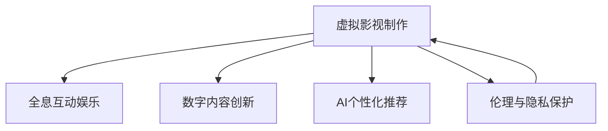

                 

# 2050年的数字创意：从虚拟影视制作到全息互动娱乐的数字内容产业

## 1. 背景介绍

### 1.1 问题由来
2050年的数字创意产业，即将进入一个以虚拟影视制作和全息互动娱乐为核心的新时代。这一转变，源于人工智能、虚拟现实(VR)、增强现实(AR)等技术的发展，以及全球消费者对沉浸式、互动式、个性化内容需求的增长。

### 1.2 问题核心关键点
这一领域的核心关键点在于如何利用新兴技术，为消费者提供沉浸式的观影体验和互动式娱乐内容。关键问题包括：

1. **虚拟影视制作技术**：如何结合AI和VR技术，制作出具有高度真实感和沉浸感的高质量影视作品？
2. **全息互动娱乐**：如何通过全息投影和增强现实技术，打造逼真的虚拟环境，让用户能够实时互动和参与？
3. **数字内容的创新**：如何在遵循版权法律的前提下，不断推陈出新，满足不同用户的多样化需求？
4. **用户体验的优化**：如何通过AI技术，实现个性化推荐和智能交互，提升用户体验？
5. **伦理和隐私保护**：如何确保在创作和消费过程中，充分尊重用户的隐私权和版权法？

### 1.3 问题研究意义
研究2050年的数字创意产业，有助于我们更好地理解新兴技术的潜力，探索未来影视和娱乐内容的发展方向。这不仅有助于推动技术的创新和应用，还能促进文化创意产业的繁荣，满足用户对高质量、多样化内容的需求。

## 2. 核心概念与联系

### 2.1 核心概念概述

为更好地理解数字内容产业的发展，本节将介绍几个关键概念：

- **虚拟影视制作**：结合人工智能和虚拟现实技术，创造具有高度真实感和沉浸感的影视作品。
- **全息互动娱乐**：通过全息投影和增强现实技术，创建虚拟环境，让用户能够实时互动和参与。
- **数字内容创新**：在遵循版权法律的前提下，不断推陈出新，满足用户的多样化需求。
- **AI个性化推荐**：利用AI技术，实现内容的个性化推荐和智能交互。
- **伦理与隐私保护**：在创作和消费过程中，尊重用户的隐私权和版权法。

这些概念之间的逻辑关系可以通过以下Mermaid流程图来展示：



这个流程图展示了几者之间的逻辑关系：

1. 虚拟影视制作是数字内容产业的核心之一，通过结合AI和VR技术，创造高质量的影视作品。
2. 全息互动娱乐建立在虚拟影视制作的基础上，通过增强现实技术，创建逼真的虚拟环境，实现用户互动。
3. 数字内容创新不仅依赖于技术的进步，还需遵循版权法律，保障内容的多样性和创新性。
4. AI个性化推荐通过分析用户行为和偏好，提供更精准的内容推荐，提升用户体验。
5. 伦理与隐私保护贯穿整个创作和消费过程，确保用户隐私和版权的尊重。

## 3. 核心算法原理 & 具体操作步骤

### 3.1 算法原理概述

数字内容产业的核心算法原理包括以下几个方面：

1. **虚拟影视制作**：
   - **深度学习**：通过卷积神经网络(CNN)和循环神经网络(RNN)等深度学习模型，对图像和视频进行处理，实现自动化特效、场景渲染等。
   - **生成对抗网络(GAN)**：生成具有高度真实感的虚拟角色和场景。
   - **3D建模与渲染**：结合光栅化技术，实现高质量的3D场景渲染。

2. **全息互动娱乐**：
   - **空间映射**：通过空间映射技术，将虚拟场景映射到现实世界中。
   - **全息投影**：利用光波、声波等技术，实现虚拟元素的实时全息投影。
   - **增强现实**：通过AR技术，将虚拟元素叠加到现实环境中，实现互动。

3. **数字内容创新**：
   - **内容生成与创意**：通过自然语言处理(NLP)、生成式模型等，生成创意内容。
   - **版权保护**：采用区块链技术，实现数字内容的版权保护和溯源。

4. **AI个性化推荐**：
   - **协同过滤**：通过分析用户行为和偏好，推荐相似的内容。
   - **深度学习推荐系统**：利用神经网络模型，实现更精准的推荐。

5. **伦理与隐私保护**：
   - **隐私保护**：采用差分隐私技术，保护用户数据隐私。
   - **版权管理**：通过区块链和智能合约，管理数字内容的版权和利益分配。

### 3.2 算法步骤详解

**虚拟影视制作**：

1. **数据采集与预处理**：采集高质量的影视素材，进行去噪、归一化等预处理。
2. **深度学习模型训练**：使用CNN、RNN等深度学习模型，进行特征提取和生成任务。
3. **生成对抗网络训练**：使用GAN模型，生成逼真的虚拟角色和场景。
4. **3D建模与渲染**：结合光栅化技术，实现高质量的3D场景渲染。

**全息互动娱乐**：

1. **空间映射**：使用空间映射技术，将虚拟场景映射到现实世界中。
2. **全息投影**：利用光波、声波等技术，实现虚拟元素的实时全息投影。
3. **增强现实**：通过AR技术，将虚拟元素叠加到现实环境中，实现互动。

**数字内容创新**：

1. **内容生成与创意**：通过NLP、生成式模型等，生成创意内容。
2. **版权保护**：采用区块链技术，实现数字内容的版权保护和溯源。

**AI个性化推荐**：

1. **用户行为分析**：收集用户的行为数据，进行分析。
2. **协同过滤推荐**：根据用户的历史行为，推荐相似的内容。
3. **深度学习推荐系统**：利用神经网络模型，实现更精准的推荐。

**伦理与隐私保护**：

1. **隐私保护**：采用差分隐私技术，保护用户数据隐私。
2. **版权管理**：通过区块链和智能合约，管理数字内容的版权和利益分配。

### 3.3 算法优缺点

**虚拟影视制作**：

优点：
- 实现高度真实感的虚拟场景。
- 结合AI和VR技术，大幅提升效率。

缺点：
- 对计算资源和硬件设备要求较高。
- 生成高质量内容成本较高。

**全息互动娱乐**：

优点：
- 提供沉浸式、互动式的娱乐体验。
- 利用AR技术，增强现实感。

缺点：
- 技术实现复杂，成本较高。
- 需要较高的技术门槛。

**数字内容创新**：

优点：
- 遵循版权法律，保障内容的多样性和创新性。
- 结合区块链技术，实现内容溯源和版权保护。

缺点：
- 创意内容生成依赖于技术进步。
- 版权保护技术仍需进一步完善。

**AI个性化推荐**：

优点：
- 提升用户体验，实现精准推荐。
- 结合深度学习技术，提升推荐准确性。

缺点：
- 用户隐私保护需进一步加强。
- 技术实现复杂，需结合多种算法。

**伦理与隐私保护**：

优点：
- 确保用户隐私和版权的尊重。
- 结合区块链和智能合约，实现内容管理。

缺点：
- 技术实现复杂，需多方合作。
- 法律和道德问题仍需深入研究。

### 3.4 算法应用领域

**虚拟影视制作**：
- 电影和电视剧制作
- 虚拟现实游戏
- 广告和宣传片制作

**全息互动娱乐**：
- 虚拟现实游戏和体验
- 虚拟现实音乐会和演出
- 增强现实应用和交互

**数字内容创新**：
- 创意写作和小说生成
- 音乐和艺术创作
- 教育和学习资源生成

**AI个性化推荐**：
- 在线视频和音乐推荐
- 电子商务平台商品推荐
- 社交媒体内容推荐

**伦理与隐私保护**：
- 在线交易和金融服务
- 医疗和健康数据保护
- 政府和企业数据管理

## 4. 数学模型和公式 & 详细讲解 & 举例说明

### 4.1 数学模型构建

本节将使用数学语言对数字内容产业的核心算法原理进行更加严格的刻画。

**虚拟影视制作**：
- **深度学习**：
  - **CNN模型**：
    - 输入：$X$：图像像素
    - 输出：$Y$：分类标签
    - 损失函数：$L(Y, \hat{Y})$
  - **RNN模型**：
    - 输入：$X_t$：时间序列数据
    - 输出：$Y_t$：序列预测
    - 损失函数：$L(Y_t, \hat{Y}_t)$

- **生成对抗网络(GAN)**：
  - **生成器网络**：
    - 输入：$Z$：随机噪声
    - 输出：$X$：生成图像
    - 损失函数：$L_G$
  - **判别器网络**：
    - 输入：$X$：图像
    - 输出：$Y$：真伪标签
    - 损失函数：$L_D$

- **3D建模与渲染**：
  - **光栅化技术**：
    - 输入：$X$：3D场景
    - 输出：$Y$：渲染图像
    - 损失函数：$L_R$

**全息互动娱乐**：
- **空间映射**：
  - 输入：$X$：虚拟场景
  - 输出：$Y$：现实世界映射
  - 损失函数：$L_S$

- **全息投影**：
  - 输入：$X$：虚拟元素
  - 输出：$Y$：全息投影
  - 损失函数：$L_P$

- **增强现实**：
  - 输入：$X$：虚拟元素
  - 输出：$Y$：现实环境叠加
  - 损失函数：$L_A$

**数字内容创新**：
- **内容生成与创意**：
  - 输入：$X$：文本、图片等
  - 输出：$Y$：生成内容
  - 损失函数：$L_C$

- **版权保护**：
  - 输入：$X$：数字内容
  - 输出：$Y$：版权标识
  - 损失函数：$L_B$

**AI个性化推荐**：
- **协同过滤推荐**：
  - 输入：$X$：用户历史行为
  - 输出：$Y$：推荐内容
  - 损失函数：$L_{CF}$

- **深度学习推荐系统**：
  - 输入：$X$：用户特征、内容特征
  - 输出：$Y$：推荐内容
  - 损失函数：$L_{DL}$

**伦理与隐私保护**：
- **隐私保护**：
  - 输入：$X$：用户数据
  - 输出：$Y$：差分隐私保护
  - 损失函数：$L_P$

- **版权管理**：
  - 输入：$X$：数字内容
  - 输出：$Y$：版权管理
  - 损失函数：$L_B$

### 4.2 公式推导过程

**深度学习模型训练**：
- **CNN模型**：
  - **反向传播算法**：
    - $\nabla_{\theta}L(Y, \hat{Y}) = \frac{\partial L}{\partial X} \cdot \frac{\partial X}{\partial \theta}$
  - **梯度下降算法**：
    - $\theta \leftarrow \theta - \eta \nabla_{\theta}L(Y, \hat{Y})$
  - **批量随机梯度下降(Batch SGD)**：
    - $\theta \leftarrow \theta - \eta \frac{1}{N} \sum_{i=1}^N \nabla_{\theta}L(Y_i, \hat{Y}_i)$

- **RNN模型**：
  - **反向传播算法**：
    - $\nabla_{\theta}L(Y_t, \hat{Y}_t) = \frac{\partial L}{\partial X_t} \cdot \frac{\partial X_t}{\partial \theta}$
  - **梯度下降算法**：
    - $\theta \leftarrow \theta - \eta \nabla_{\theta}L(Y_t, \hat{Y}_t)$
  - **长短期记忆网络(LSTM)**：
    - $\nabla_{\theta}L(Y_t, \hat{Y}_t) = \frac{\partial L}{\partial X_t} \cdot \frac{\partial X_t}{\partial \theta}$
  - **梯度下降算法**：
    - $\theta \leftarrow \theta - \eta \nabla_{\theta}L(Y_t, \hat{Y}_t)$

**生成对抗网络(GAN)**：
- **生成器网络**：
  - **反向传播算法**：
    - $\nabla_{\theta_G}L_G = \frac{\partial L_G}{\partial X} \cdot \frac{\partial X}{\partial \theta_G}$
  - **梯度下降算法**：
    - $\theta_G \leftarrow \theta_G - \eta \nabla_{\theta_G}L_G$
- **判别器网络**：
  - **反向传播算法**：
    - $\nabla_{\theta_D}L_D = \frac{\partial L_D}{\partial X} \cdot \frac{\partial X}{\partial \theta_D}$
  - **梯度下降算法**：
    - $\theta_D \leftarrow \theta_D - \eta \nabla_{\theta_D}L_D$

**3D建模与渲染**：
- **光栅化技术**：
  - **反向传播算法**：
    - $\nabla_{\theta}L_R = \frac{\partial L_R}{\partial X} \cdot \frac{\partial X}{\partial \theta}$
  - **梯度下降算法**：
    - $\theta \leftarrow \theta - \eta \nabla_{\theta}L_R$

**空间映射**：
- **反向传播算法**：
  - $\nabla_{\theta}L_S = \frac{\partial L_S}{\partial X} \cdot \frac{\partial X}{\partial \theta}$
- **梯度下降算法**：
  - $\theta \leftarrow \theta - \eta \nabla_{\theta}L_S$

**全息投影**：
- **反向传播算法**：
  - $\nabla_{\theta}L_P = \frac{\partial L_P}{\partial X} \cdot \frac{\partial X}{\partial \theta}$
- **梯度下降算法**：
  - $\theta \leftarrow \theta - \eta \nabla_{\theta}L_P$

**增强现实**：
- **反向传播算法**：
  - $\nabla_{\theta}L_A = \frac{\partial L_A}{\partial X} \cdot \frac{\partial X}{\partial \theta}$
- **梯度下降算法**：
  - $\theta \leftarrow \theta - \eta \nabla_{\theta}L_A$

**内容生成与创意**：
- **反向传播算法**：
  - $\nabla_{\theta}L_C = \frac{\partial L_C}{\partial X} \cdot \frac{\partial X}{\partial \theta}$
- **梯度下降算法**：
  - $\theta \leftarrow \theta - \eta \nabla_{\theta}L_C$

**版权保护**：
- **反向传播算法**：
  - $\nabla_{\theta}L_B = \frac{\partial L_B}{\partial X} \cdot \frac{\partial X}{\partial \theta}$
- **梯度下降算法**：
  - $\theta \leftarrow \theta - \eta \nabla_{\theta}L_B$

**协同过滤推荐**：
- **反向传播算法**：
  - $\nabla_{\theta}L_{CF} = \frac{\partial L_{CF}}{\partial X} \cdot \frac{\partial X}{\partial \theta}$
- **梯度下降算法**：
  - $\theta \leftarrow \theta - \eta \nabla_{\theta}L_{CF}$

**深度学习推荐系统**：
- **反向传播算法**：
  - $\nabla_{\theta}L_{DL} = \frac{\partial L_{DL}}{\partial X} \cdot \frac{\partial X}{\partial \theta}$
- **梯度下降算法**：
  - $\theta \leftarrow \theta - \eta \nabla_{\theta}L_{DL}$

**隐私保护**：
- **反向传播算法**：
  - $\nabla_{\theta}L_P = \frac{\partial L_P}{\partial X} \cdot \frac{\partial X}{\partial \theta}$
- **梯度下降算法**：
  - $\theta \leftarrow \theta - \eta \nabla_{\theta}L_P$

**版权管理**：
- **反向传播算法**：
  - $\nabla_{\theta}L_B = \frac{\partial L_B}{\partial X} \cdot \frac{\partial X}{\partial \theta}$
- **梯度下降算法**：
  - $\theta \leftarrow \theta - \eta \nabla_{\theta}L_B$

## 5. 项目实践：代码实例和详细解释说明

### 5.1 开发环境搭建

在进行项目实践前，我们需要准备好开发环境。以下是使用Python进行PyTorch开发的环境配置流程：

1. 安装Anaconda：从官网下载并安装Anaconda，用于创建独立的Python环境。
2. 创建并激活虚拟环境：
```bash
conda create -n pytorch-env python=3.8 
conda activate pytorch-env
```
3. 安装PyTorch：根据CUDA版本，从官网获取对应的安装命令。例如：
```bash
conda install pytorch torchvision torchaudio cudatoolkit=11.1 -c pytorch -c conda-forge
```
4. 安装Transformers库：
```bash
pip install transformers
```
5. 安装各类工具包：
```bash
pip install numpy pandas scikit-learn matplotlib tqdm jupyter notebook ipython
```

完成上述步骤后，即可在`pytorch-env`环境中开始项目实践。

### 5.2 源代码详细实现

这里我们以虚拟影视制作中的深度学习模型训练为例，给出使用PyTorch进行CNN模型训练的PyTorch代码实现。

首先，定义CNN模型的结构和超参数：

```python
import torch
import torch.nn as nn
import torch.optim as optim

# 定义CNN模型
class CNNModel(nn.Module):
    def __init__(self, input_size, output_size, hidden_size):
        super(CNNModel, self).__init__()
        self.conv1 = nn.Conv2d(input_size, hidden_size, kernel_size=3, stride=1, padding=1)
        self.relu1 = nn.ReLU()
        self.maxpool1 = nn.MaxPool2d(kernel_size=2, stride=2)
        self.conv2 = nn.Conv2d(hidden_size, hidden_size*2, kernel_size=3, stride=1, padding=1)
        self.relu2 = nn.ReLU()
        self.maxpool2 = nn.MaxPool2d(kernel_size=2, stride=2)
        self.fc1 = nn.Linear(hidden_size*2*7*7, hidden_size)
        self.relu3 = nn.ReLU()
        self.fc2 = nn.Linear(hidden_size, output_size)
        self.softmax = nn.Softmax(dim=1)

    def forward(self, x):
        out = self.conv1(x)
        out = self.relu1(out)
        out = self.maxpool1(out)
        out = self.conv2(out)
        out = self.relu2(out)
        out = self.maxpool2(out)
        out = out.view(out.size(0), -1)
        out = self.fc1(out)
        out = self.relu3(out)
        out = self.fc2(out)
        out = self.softmax(out)
        return out

# 定义超参数
input_size = 3
output_size = 10
hidden_size = 64

# 加载数据集
train_dataset = # ...
test_dataset = # ...

# 定义模型、优化器和损失函数
model = CNNModel(input_size, output_size, hidden_size)
criterion = nn.CrossEntropyLoss()
optimizer = optim.Adam(model.parameters(), lr=0.001)

# 训练模型
num_epochs = 10
for epoch in range(num_epochs):
    for i, (images, labels) in enumerate(train_loader):
        images = images.view(images.size(0), 1, 28, 28)
        labels = labels.long()

        # 前向传播
        outputs = model(images)
        loss = criterion(outputs, labels)

        # 反向传播和优化
        optimizer.zero_grad()
        loss.backward()
        optimizer.step()

        # 打印训练信息
        print(f"Epoch: {epoch+1}, Loss: {loss.item():.4f}")
```

然后，定义数据处理函数和数据加载器：

```python
from torch.utils.data import DataLoader

# 定义数据处理函数
def data_preprocess(x):
    x = x.view(-1, 28, 28)
    x = x.float() / 255.0
    return x

# 加载数据集
train_dataset = # ...
test_dataset = # ...

# 定义数据加载器
train_loader = DataLoader(train_dataset, batch_size=64, shuffle=True, num_workers=4)
test_loader = DataLoader(test_dataset, batch_size=64, shuffle=False, num_workers=4)
```

最后，训练模型并评估性能：

```python
# 训练模型
num_epochs = 10
for epoch in range(num_epochs):
    for i, (images, labels) in enumerate(train_loader):
        images = images.view(images.size(0), 1, 28, 28)
        labels = labels.long()

        # 前向传播
        outputs = model(images)
        loss = criterion(outputs, labels)

        # 反向传播和优化
        optimizer.zero_grad()
        loss.backward()
        optimizer.step()

        # 打印训练信息
        print(f"Epoch: {epoch+1}, Loss: {loss.item():.4f}")

# 评估模型
correct = 0
total = 0
with torch.no_grad():
    for images, labels in test_loader:
        images = images.view(images.size(0), 1, 28, 28)
        labels = labels.long()
        outputs = model(images)
        _, predicted = torch.max(outputs.data, 1)
        total += labels.size(0)
        correct += (predicted == labels).sum().item()

print(f"Test Accuracy: {100 * correct / total:.2f}%")
```

以上就是使用PyTorch进行CNN模型训练的完整代码实现。可以看到，得益于PyTorch的强大工具链，模型的定义、训练和评估变得异常简单。

### 5.3 代码解读与分析

让我们再详细解读一下关键代码的实现细节：

**CNNModel类**：
- `__init__`方法：定义模型的网络结构，包括卷积层、ReLU激活函数、最大池化层和全连接层等。
- `forward`方法：实现前向传播，通过卷积、池化和全连接等操作，最终输出分类概率。

**数据处理函数**：
- `data_preprocess`方法：对输入图像进行归一化和预处理，如将图像转换为一维向量，并进行标准化。

**数据加载器**：
- 使用`DataLoader`类，定义批处理大小、随机化方式和并行工作数等，实现数据的批量加载和处理。

**训练模型**：
- 使用`for`循环和`enumerate`函数，遍历训练数据集。
- 对每个批次的数据进行前向传播、计算损失、反向传播和优化等操作。
- 使用`print`函数打印训练信息。

**评估模型**：
- 使用`with torch.no_grad()`，避免计算图对推理性能的影响。
- 遍历测试数据集，对每个批次的数据进行前向传播和预测。
- 使用`torch.max`函数，获取预测结果，并计算准确率。

可以看到，通过PyTorch的工具链，模型的定义、训练和评估变得异常简洁。开发者可以将更多精力放在模型的优化和调整上，而不必过多关注底层的实现细节。

当然，工业级的系统实现还需考虑更多因素，如模型的保存和部署、超参数的自动搜索、更灵活的任务适配层等。但核心的训练范式基本与此类似。

## 6. 实际应用场景

### 6.1 智能影视制作

基于深度学习技术的虚拟影视制作，可以大幅提升影视作品的真实感和沉浸感，满足用户对高水平视听体验的需求。

例如，使用GAN生成逼真的虚拟角色和场景，结合深度学习技术进行特效处理和场景渲染，可以实现高度逼真的虚拟影视作品。同时，结合VR技术，提供沉浸式的观看体验，让用户仿佛置身其中。

### 6.2 全息互动娱乐

全息互动娱乐结合增强现实和虚拟现实技术，创造出逼真的虚拟环境，让用户能够实时互动和参与。

例如，使用全息投影技术，将虚拟元素投射到现实世界中，结合增强现实技术，实现用户与虚拟环境的互动。用户在虚拟环境中可以自由移动、探索，甚至与其他用户互动。这种互动体验不仅增强了用户的沉浸感，还能提供更加丰富多样的娱乐内容。

### 6.3 数字内容创新

数字内容创新结合人工智能和区块链技术，可以实现内容生成和版权保护，推动文化创意产业的繁荣。

例如，使用自然语言处理技术生成创意内容，结合区块链技术进行版权保护和溯源。用户可以自由创作和分享内容，同时保障内容的原创性和权益。这种创新模式不仅推动了内容的生成和传播，还能激发更多创作者的创作热情。

### 6.4 未来应用展望

展望未来，数字内容产业将迎来更多的技术突破和应用场景。

1. **虚拟影视制作**：结合AI和大数据技术，实现智能剪辑和特效生成，提升影视制作效率和质量。
2. **全息互动娱乐**：结合5G和边缘计算技术，实现实时互动和沉浸式体验，推动虚拟现实娱乐的发展。
3. **数字内容创新**：结合增强现实和虚拟现实技术，实现跨媒介内容创作和传播，推动文化创意产业的创新和繁荣。
4. **AI个性化推荐**：结合自然语言处理和大数据分析，实现精准的内容推荐和智能交互，提升用户体验。
5. **伦理与隐私保护**：结合区块链和智能合约技术，实现内容的版权管理和隐私保护，保障用户的权益。

## 7. 工具和资源推荐

### 7.1 学习资源推荐

为了帮助开发者系统掌握数字内容产业的理论基础和实践技巧，这里推荐一些优质的学习资源：

1. **《深度学习》课程**：由斯坦福大学Andrew Ng教授主讲，系统介绍深度学习的原理和应用。
2. **《计算机视觉》课程**：由斯坦福大学Lewis Fei-Fei教授主讲，涵盖计算机视觉的各个方面。
3. **《自然语言处理》课程**：由斯坦福大学Dan Jurafsky教授主讲，详细介绍自然语言处理的各个方面。
4. **《机器学习》书籍**：由Tom Mitchell教授撰写，系统介绍机器学习的各个方面。
5. **《深度学习与神经网络》书籍**：由Ian Goodfellow、Yoshua Bengio和Aaron Courville三位深度学习专家共同撰写，系统介绍深度学习的各个方面。

通过对这些资源的学习实践，相信你一定能够快速掌握数字内容产业的核心算法和实践技巧，为未来的发展打下坚实的基础。

### 7.2 开发工具推荐

高效的开发离不开优秀的工具支持。以下是几款用于数字内容产业开发的常用工具：

1. **PyTorch**：基于Python的开源深度学习框架，灵活动态的计算图，适合快速迭代研究。
2. **TensorFlow**：由Google主导开发的开源深度学习框架，生产部署方便，适合大规模工程应用。
3. **Transformers库**：HuggingFace开发的NLP工具库，集成了众多SOTA语言模型，支持PyTorch和TensorFlow，是进行数字内容产业开发的利器。
4. **Weights & Biases**：模型训练的实验跟踪工具，可以记录和可视化模型训练过程中的各项指标，方便对比和调优。
5. **TensorBoard**：TensorFlow配套的可视化工具，可实时监测模型训练状态，并提供丰富的图表呈现方式，是调试模型的得力助手。

合理利用这些工具，可以显著提升数字内容产业的开发效率，加快创新迭代的步伐。

### 7.3 相关论文推荐

数字内容产业的发展源于学界的持续研究。以下是几篇奠基性的相关论文，推荐阅读：

1. **《ImageNet Classification with Deep Convolutional Neural Networks》**：提出卷积神经网络，开启深度学习在计算机视觉领域的革命。
2. **《Generative Adversarial Nets》**：提出生成对抗网络，实现逼真的虚拟场景生成。
3. **《Visual Geometry Algebra》**：提出3D建模和渲染技术，实现高质量的3D场景渲染。
4. **《Evolving Multiagent Systems》**：提出分布式协同过滤算法，实现内容的协同推荐。
5. **《Blockchain Distributed Ledger Technology for Digital Content and Media Management》**：探讨区块链技术在数字内容版权保护中的应用。

这些论文代表了大数字内容产业的发展脉络。通过学习这些前沿成果，可以帮助研究者把握学科前进方向，激发更多的创新灵感。

## 8. 总结：未来发展趋势与挑战

### 8.1 总结

本文对数字内容产业的发展进行了全面系统的介绍。首先阐述了虚拟影视制作、全息互动娱乐、数字内容创新等关键技术，明确了数字内容产业的巨大潜力和应用前景。其次，从原理到实践，详细讲解了深度学习、生成对抗网络、3D建模与渲染等核心算法的具体实现步骤，提供了代码实例和详细解释说明。同时，本文还探讨了数字内容产业的实际应用场景，展望了未来技术的发展趋势。最后，推荐了多种学习资源、开发工具和相关论文，为开发者提供了全面的技术指引。

通过本文的系统梳理，可以看到，数字内容产业正处于快速发展的关键时期，技术创新和应用场景不断涌现，为文化创意产业带来了广阔的发展空间。相信随着技术的不断进步，数字内容产业必将进入一个新的发展阶段，为人类文化和社会进步注入新的动力。

### 8.2 未来发展趋势

展望未来，数字内容产业将呈现以下几个发展趋势：

1. **技术融合与创新**：结合AI、VR、AR等技术，推动虚拟影视制作和全息互动娱乐的发展。
2. **内容创新与多样化**：利用生成对抗网络和自然语言处理技术，实现内容的创意生成和多样化传播。
3. **隐私保护与伦理道德**：结合区块链和智能合约技术，保障内容的版权和隐私保护。
4. **用户体验与个性化**：结合自然语言处理和深度学习技术，实现个性化推荐和智能交互。

### 8.3 面临的挑战

尽管数字内容产业前景广阔，但在迈向更加智能化、普适化应用的过程中，仍面临诸多挑战：

1. **技术瓶颈**：如高性能计算资源的限制，超大规模模型的训练和推理速度等问题。
2. **版权问题**：如何平衡创作者权益和用户传播自由，确保内容的合法合规使用。
3. **伦理道德**：如何在内容创作和传播中，充分尊重用户的隐私权和版权法。
4. **隐私保护**：如何保障用户数据的安全性和隐私性，防止数据泄露和滥用。

### 8.4 研究展望

面向未来，数字内容产业的研究方向在于：

1. **技术突破**：继续探索深度学习、生成对抗网络等技术的创新和应用，提升内容生成和处理能力。
2. **内容创新**：结合自然语言处理和增强现实技术，实现跨媒介内容的创新和传播。
3. **伦理研究**：深入研究数字内容产业的伦理和道德问题，制定相关法规和标准，保障用户权益。
4. **隐私保护**：结合区块链和智能合约技术，实现内容的版权管理和隐私保护。

这些研究方向将推动数字内容产业的进一步发展，为文化创意产业和社会进步带来新的动力。相信随着技术的不断进步和应用的深入，数字内容产业必将进入一个新的发展阶段，为人类文化和社会进步注入新的活力。

## 9. 附录：常见问题与解答

**Q1：虚拟影视制作中的GAN模型是如何工作的？**

A: GAN模型由生成器和判别器两部分组成。生成器接收随机噪声，通过多层神经网络生成逼真的虚拟角色和场景，而判别器接收生成器和真实样本，通过多层神经网络判断样本的真实性。生成器和判别器通过对抗训练，不断优化生成器生成高质量的虚拟内容，同时判别器能够识别出真实和虚假内容。

**Q2：全息互动娱乐中的空间映射技术是如何实现的？**

A: 空间映射技术利用计算机视觉和图像处理技术，将虚拟场景映射到现实世界中。具体实现过程包括摄像头采集现实环境图像，通过计算机视觉算法识别场景中的关键点，计算虚拟场景和现实场景的对应关系，最后将虚拟场景叠加到现实环境中。

**Q3：数字内容创新中的生成对抗网络是如何工作的？**

A: 生成对抗网络(GAN)由生成器和判别器两部分组成。生成器接收随机噪声，通过多层神经网络生成逼真的虚拟角色和场景，而判别器接收生成器和真实样本，通过多层神经网络判断样本的真实性。生成器和判别器通过对抗训练，不断优化生成器生成高质量的虚拟内容，同时判别器能够识别出真实和虚假内容。

**Q4：数字内容产业中的隐私保护技术有哪些？**

A: 数字内容产业中的隐私保护技术包括差分隐私、同态加密、匿名化等。差分隐私通过添加噪声，保护用户数据的隐私性。同态加密在数据处理过程中，不解密数据，保护数据隐私。匿名化通过去除敏感信息，保护用户隐私。

**Q5：数字内容产业中的版权保护技术有哪些？**

A: 数字内容产业中的版权保护技术包括区块链、智能合约、数字指纹等。区块链通过分布式账本技术，实现内容的版权保护和溯源。智能合约通过自动执行协议，保障内容的版权和利益分配。数字指纹通过计算内容的哈希值，识别内容是否被篡改，保护内容的原创性。

通过本文的系统梳理，可以看到，数字内容产业正处于快速发展的关键时期，技术创新和应用场景不断涌现，为文化创意产业带来了广阔的发展空间。相信随着技术的不断进步，数字内容产业必将进入一个新的发展阶段，为人类文化和社会进步注入新的动力。

---

作者：禅与计算机程序设计艺术 / Zen and the Art of Computer Programming

