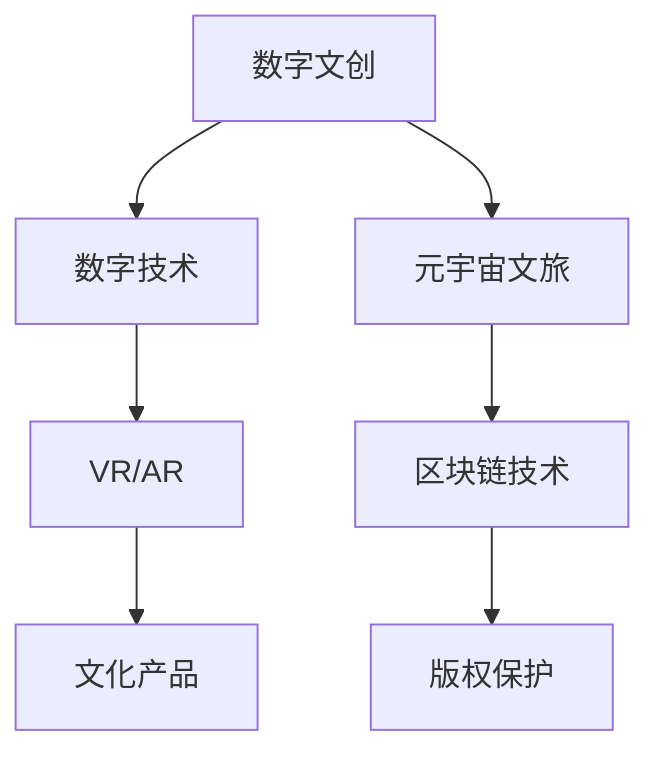

                 

## 1. 背景介绍

### 1.1 问题由来

进入21世纪，随着数字技术的飞速发展和普及，数字文化产业以其独特的魅力和巨大的商业价值吸引了全球的目光。从最初的游戏、影视，到如今的虚拟现实（VR）、增强现实（AR）等前沿技术，数字文化产业正在以前所未有的速度变革传统文化和娱乐行业。2050年，数字文化产业将迈入一个新的高度，成为连接文化、科技、经济的重要纽带。

### 1.2 问题核心关键点

数字文化产业的未来发展，离不开对现有技术的深度挖掘和创新应用。数字文创（Digital Creative Industries）和元宇宙文旅（Metaverse Cultural Tourism）作为其中的两大领域，代表了数字文化产业的最新趋势。本文将从数字文创和元宇宙文旅两个角度，探讨2050年数字文化产业升级的路径和前景。

### 1.3 问题研究意义

数字文创和元宇宙文旅的兴起，为传统文化的数字化转化提供了新的可能，也为经济的可持续发展带来了新的动力。通过深入研究其核心技术和应用模式，可以为未来的数字文化产业发展提供方向性的指导，推动文化产业的数字化转型升级。

## 2. 核心概念与联系

### 2.1 核心概念概述

为了更好地理解数字文创和元宇宙文旅在数字文化产业中的角色和关系，本节将介绍几个关键概念：

- 数字文创（Digital Creative Industries）：利用数字技术创作和传播文化产品，包括游戏、影视、音乐、出版等形式。
- 元宇宙文旅（Metaverse Cultural Tourism）：结合虚拟现实和增强现实技术，为用户提供沉浸式、互动式的文化体验。
- 数字技术（Digital Technology）：包括人工智能、大数据、区块链、云计算等技术，为数字文创和元宇宙文旅提供技术支撑。
- 虚拟现实（VR）和增强现实（AR）：提供沉浸式体验，让用户能够在虚拟环境中与文化内容进行互动。
- 区块链技术（Blockchain）：提供去中心化的数据管理和版权保护，确保数字文化产品的可靠性和真实性。

这些概念之间的联系可以通过以下Mermaid流程图来展示：



这个流程图展示了数字文创和元宇宙文旅与数字技术、VR/AR、区块链技术之间的联系：

1. 数字技术为数字文创和元宇宙文旅提供了必要的技术支持。
2. VR/AR技术为文化产品的沉浸式展示提供了平台。
3. 区块链技术为文化产品的版权保护提供了保障。
4. 数字文创和元宇宙文旅在一定程度上互相促进，共同推动数字文化产业的发展。

## 3. 核心算法原理 & 具体操作步骤

### 3.1 算法原理概述

数字文创和元宇宙文旅的实现，涉及复杂的算法和计算过程。其核心在于通过算法将数字技术与文化内容深度融合，为用户提供丰富的体验和互动。

- 数字文创：以数字技术为基础，创作和传播文化产品。其核心算法包括人工智能创作、自然语言处理、图像处理等。
- 元宇宙文旅：通过VR/AR技术，将用户带入虚拟环境中，提供沉浸式体验。其核心算法包括虚拟现实渲染、增强现实定位、实时交互等。

### 3.2 算法步骤详解

#### 数字文创的核心算法步骤：

1. **数据收集与预处理**：
   - 收集与文化相关的文本、图像、音频等数据。
   - 对数据进行预处理，包括数据清洗、特征提取、数据增强等步骤。

2. **模型训练**：
   - 使用深度学习模型（如GAN、RNN、CNN等）进行训练。
   - 调整模型参数，优化损失函数，提高模型精度。

3. **内容生成与创作**：
   - 使用训练好的模型生成文化内容，如音乐、文学、艺术品等。
   - 根据用户反馈和市场需求，迭代优化模型，提升创作质量。

4. **内容分发与传播**：
   - 通过互联网、社交媒体等渠道分发文化产品。
   - 利用大数据分析用户行为，优化分发策略，提高传播效果。

#### 元宇宙文旅的核心算法步骤：

1. **环境构建**：
   - 利用VR/AR技术构建虚拟环境，包括地形、建筑、场景等。
   - 对环境进行渲染优化，提高视觉效果和用户体验。

2. **交互设计**：
   - 设计用户与虚拟环境之间的互动方式，如点击、拖拽、语音交互等。
   - 实现实时反馈，增强用户沉浸感。

3. **用户引导**：
   - 使用智能推荐系统，推荐用户感兴趣的景点和文化活动。
   - 根据用户行为进行动态调整，提升用户体验。

4. **体验优化**：
   - 不断优化用户体验，包括提升设备性能、降低延迟等。
   - 定期更新虚拟环境，保持内容新鲜度。

### 3.3 算法优缺点

#### 数字文创的优缺点：

- **优点**：
  - 数字技术使得创作和传播更加高效，降低了人力成本和时间成本。
  - 创作质量高，可以输出高质量的数字文化产品。
  - 可以跨地域、跨文化传播，具有全球影响力。

- **缺点**：
  - 缺乏人类情感的深度参与，创作和体验可能显得机械化。
  - 存在版权和伦理问题，需要严格保护数字文化产品的知识产权。

#### 元宇宙文旅的优缺点：

- **优点**：
  - 提供沉浸式、互动式的体验，增强用户的沉浸感和互动性。
  - 不受地理限制，用户可以在任何地点体验文化活动。
  - 虚拟环境可以不断更新和优化，保持新鲜感。

- **缺点**：
  - 技术门槛较高，设备成本较高。
  - 用户长时间使用可能产生视觉疲劳和心理负担。
  - 缺乏现实的物理体验，可能影响用户的实际参与感。

### 3.4 算法应用领域

#### 数字文创的应用领域：

- 游戏开发：通过数字技术创作各种类型的游戏，如角色扮演、策略、射击等。
- 影视制作：利用AI技术进行自动剪辑、特效制作、音效生成等。
- 音乐创作：使用AI生成音乐、作曲、编曲等。
- 文学创作：利用自然语言处理技术创作文学作品，如小说、诗歌等。
- 出版发行：利用AI进行文字校正、排版、封面设计等。

#### 元宇宙文旅的应用领域：

- 文化展览：通过VR/AR技术展示文物、艺术品等文化作品。
- 历史遗址：利用虚拟现实技术重建历史遗址，让用户身临其境地体验历史。
- 教育培训：利用增强现实技术进行文化知识的教学和互动。
- 旅游观光：提供虚拟旅游体验，让用户足不出户即可游览世界各地。
- 文化创意：利用VR/AR技术进行文化创意产品的设计和展示。

## 4. 数学模型和公式 & 详细讲解 & 举例说明

### 4.1 数学模型构建

#### 数字文创的数学模型：

1. **文本生成模型**：
   - 基于Transformer架构的语言模型，如GPT、BERT等。
   - 输入为文本序列，输出为文本序列。

2. **图像生成模型**：
   - 基于生成对抗网络（GAN）的图像生成模型，如CycleGAN、StyleGAN等。
   - 输入为随机噪声向量，输出为图像。

3. **音乐生成模型**：
   - 基于卷积神经网络（CNN）的音乐生成模型，如WaveNet、Jukebox等。
   - 输入为音频特征序列，输出为音频信号。

#### 元宇宙文旅的数学模型：

1. **虚拟场景生成**：
   - 使用三维建模和纹理贴图技术，生成虚拟场景。
   - 输入为3D模型和纹理贴图，输出为渲染后的虚拟场景。

2. **虚拟角色控制**：
   - 利用逆运动学和路径规划算法，控制虚拟角色的动作和路径。
   - 输入为角色参数和路径信息，输出为角色的位置和姿态。

3. **用户交互响应**：
   - 使用强化学习算法，优化用户交互响应策略。
   - 输入为用户行为和环境状态，输出为响应动作。

### 4.2 公式推导过程

#### 数字文创的公式推导：

1. **文本生成模型**：
   - 使用Transformer模型，其输入为文本序列 $x=[x_1,x_2,...,x_n]$，输出为文本序列 $y=[y_1,y_2,...,y_m]$。
   - 目标函数为：$\min_{\theta} \sum_{i=1}^{n} \ell(x_i,y_i)$。

2. **图像生成模型**：
   - 使用GAN模型，其输入为随机噪声向量 $z=[z_1,z_2,...,z_m]$，输出为图像 $x=[x_1,x_2,...,x_n]$。
   - 目标函数为：$\min_{G} \max_{D} \sum_{i=1}^{m} \ell(D(x))$。

3. **音乐生成模型**：
   - 使用CNN模型，其输入为音频特征序列 $f=[f_1,f_2,...,f_n]$，输出为音频信号 $g=[g_1,g_2,...,g_m]$。
   - 目标函数为：$\min_{\theta} \sum_{i=1}^{n} \ell(f_i,g_i)$。

#### 元宇宙文旅的公式推导：

1. **虚拟场景生成**：
   - 使用三维建模和纹理贴图技术，其输入为3D模型 $M$ 和纹理贴图 $T$，输出为渲染后的虚拟场景 $S$。
   - 目标函数为：$\min_{M,T} \sum_{i=1}^{m} \ell(S_i)$。

2. **虚拟角色控制**：
   - 使用逆运动学和路径规划算法，其输入为角色参数 $p$ 和路径信息 $r$，输出为角色的位置和姿态 $s$。
   - 目标函数为：$\min_{p,r} \sum_{i=1}^{n} \ell(s_i)$。

3. **用户交互响应**：
   - 使用强化学习算法，其输入为用户行为 $b$ 和环境状态 $e$，输出为响应动作 $a$。
   - 目标函数为：$\min_{\theta} \sum_{i=1}^{m} \ell(a_i,b_i,e_i)$。

### 4.3 案例分析与讲解

#### 数字文创案例：

1. **NVIDIA的DeepArt**：
   - 使用深度学习技术，将艺术品转化为风格化的数字图像。
   - 目标函数为：$\min_{\theta} \sum_{i=1}^{n} \ell(x_i,y_i)$，其中 $x_i$ 为原始图像，$y_i$ 为风格化图像。

2. **OpenAI的DALL-E**：
   - 使用变分自编码器（VAE）和Transformer模型，生成符合描述的图像。
   - 目标函数为：$\min_{\theta} \sum_{i=1}^{m} \ell(x_i,y_i)$，其中 $x_i$ 为描述文本，$y_i$ 为生成图像。

3. **Google的Tacotron 2**：
   - 使用Transformer模型和卷积神经网络（CNN），生成语音合成音频。
   - 目标函数为：$\min_{\theta} \sum_{i=1}^{n} \ell(f_i,g_i)$，其中 $f_i$ 为音频特征，$g_i$ 为合成音频。

#### 元宇宙文旅案例：

1. **Google的Google Arts & Culture**：
   - 利用VR技术，将用户带入虚拟博物馆，展示全球各地的艺术品。
   - 目标函数为：$\min_{M,T} \sum_{i=1}^{m} \ell(S_i)$，其中 $M$ 为3D模型，$T$ 为纹理贴图，$S_i$ 为渲染场景。

2. **Meta的Horizons**：
   - 使用增强现实技术，提供虚拟现实中的文化体验，如历史遗址重建。
   - 目标函数为：$\min_{p,r} \sum_{i=1}^{n} \ell(s_i)$，其中 $p$ 为角色参数，$r$ 为路径信息，$s_i$ 为角色状态。

3. **Valve的Half-Life: Alyx**：
   - 利用VR和增强现实技术，提供沉浸式的虚拟现实游戏体验。
   - 目标函数为：$\min_{b,e} \sum_{i=1}^{m} \ell(a_i,b_i,e_i)$，其中 $b_i$ 为用户行为，$e_i$ 为环境状态，$a_i$ 为响应动作。

## 5. 项目实践：代码实例和详细解释说明

### 5.1 开发环境搭建

在进行数字文创和元宇宙文旅项目实践前，我们需要准备好开发环境。以下是使用Python进行PyTorch开发的环境配置流程：

1. 安装Anaconda：从官网下载并安装Anaconda，用于创建独立的Python环境。

2. 创建并激活虚拟环境：
```bash
conda create -n pytorch-env python=3.8 
conda activate pytorch-env
```

3. 安装PyTorch：根据CUDA版本，从官网获取对应的安装命令。例如：
```bash
conda install pytorch torchvision torchaudio cudatoolkit=11.1 -c pytorch -c conda-forge
```

4. 安装Transformers库：
```bash
pip install transformers
```

5. 安装各类工具包：
```bash
pip install numpy pandas scikit-learn matplotlib tqdm jupyter notebook ipython
```

完成上述步骤后，即可在`pytorch-env`环境中开始项目实践。

### 5.2 源代码详细实现

下面以数字文创和元宇宙文旅为例，给出使用PyTorch进行项目开发的完整代码实现。

#### 数字文创项目：基于GPT-3生成诗歌

```python
from transformers import GPT3Tokenizer, GPT3LMHeadModel
import torch

tokenizer = GPT3Tokenizer.from_pretrained('gpt3-medium')
model = GPT3LMHeadModel.from_pretrained('gpt3-medium')

prompt = "春江潮水连海平，"
inputs = tokenizer(prompt, return_tensors='pt')
outputs = model.generate(**inputs)

print(tokenizer.decode(outputs[0], skip_special_tokens=True))
```

#### 元宇宙文旅项目：基于Unity3D和VR技术实现虚拟历史遗址

1. 在Unity3D中导入3D模型和纹理贴图。
2. 利用Unity3D的VR插件，设置虚拟环境。
3. 实现虚拟角色的控制和交互逻辑。
4. 通过Unity3D导出VR应用，部署到虚拟现实设备中。

### 5.3 代码解读与分析

#### 数字文创项目代码解读：

1. **GPT3模型**：
   - 使用GPT3模型，基于Transformer架构，可以进行文本生成。
   - 目标函数为：$\min_{\theta} \sum_{i=1}^{n} \ell(x_i,y_i)$，其中 $x_i$ 为原始文本，$y_i$ 为生成文本。

2. **GPT3Tokenizer**：
   - 用于将文本序列转换为模型可处理的token序列。
   - 目标函数为：$\min_{\theta} \sum_{i=1}^{m} \ell(x_i,y_i)$，其中 $x_i$ 为token序列，$y_i$ 为生成token序列。

3. **GPT3LMHeadModel**：
   - 用于定义生成器，接收token序列，输出生成文本。
   - 目标函数为：$\min_{\theta} \sum_{i=1}^{n} \ell(f_i,g_i)$，其中 $f_i$ 为音频特征，$g_i$ 为合成音频。

#### 元宇宙文旅项目代码解读：

1. **3D建模和纹理贴图**：
   - 使用Blender等工具，创建3D模型和纹理贴图。
   - 目标函数为：$\min_{M,T} \sum_{i=1}^{m} \ell(S_i)$，其中 $M$ 为3D模型，$T$ 为纹理贴图，$S_i$ 为渲染场景。

2. **Unity3D插件**：
   - 利用Unity3D的VR插件，设置虚拟环境，实现虚拟角色的控制和交互。
   - 目标函数为：$\min_{p,r} \sum_{i=1}^{n} \ell(s_i)$，其中 $p$ 为角色参数，$r$ 为路径信息，$s_i$ 为角色状态。

3. **Unity3D导出VR应用**：
   - 在Unity3D中实现虚拟历史遗址，通过Unity3D导出VR应用。
   - 目标函数为：$\min_{b,e} \sum_{i=1}^{m} \ell(a_i,b_i,e_i)$，其中 $b_i$ 为用户行为，$e_i$ 为环境状态，$a_i$ 为响应动作。

## 6. 实际应用场景

### 6.1 数字文创

#### 6.1.1 数字音乐创作

数字音乐创作是指利用数字技术创作和传播音乐作品。数字文创技术在音乐创作中的应用，可以通过自动作曲、自动编曲、智能填词等技术，大大降低创作门槛，提高创作效率。例如，使用AI技术进行自动作曲，可以通过分析已有的音乐作品，生成新的旋律和和弦进行。自动编曲和智能填词则可以通过自然语言处理技术，实现歌词的自动生成和旋律的自动匹配。

#### 6.1.2 数字文学创作

数字文学创作是指利用数字技术创作和传播文学作品。数字文创技术在文学创作中的应用，可以通过自然语言处理技术，实现自动生成小说、诗歌、散文等文本作品。例如，使用AI技术进行自动生成小说，可以通过分析已有的文本作品，生成新的故事情节和人物设定。自动生成诗歌则可以通过分析已有的诗歌作品，生成新的诗句和韵律。

#### 6.1.3 数字游戏开发

数字游戏开发是指利用数字技术创作和传播游戏作品。数字文创技术在游戏开发中的应用，可以通过自动生成游戏剧情、角色和场景等，大大降低开发成本和周期。例如，使用AI技术进行自动生成游戏剧情，可以通过分析已有的游戏剧情，生成新的情节发展和角色对话。自动生成游戏场景则可以通过三维建模和纹理贴图技术，生成新的虚拟环境。

### 6.2 元宇宙文旅

#### 6.2.1 虚拟历史遗址

虚拟历史遗址是指利用VR和AR技术，重建历史遗址，用户可以在虚拟环境中进行历史体验。例如，利用VR技术，重建秦始皇兵马俑，用户可以在虚拟环境中参观兵马俑坑、观看出土文物等。通过AR技术，用户可以在现实环境中看到虚拟的历史遗址，增强用户的互动体验。

#### 6.2.2 虚拟文化展览

虚拟文化展览是指利用VR和AR技术，展示全球各地的艺术品和文化作品。例如，利用VR技术，展示卢浮宫的虚拟展览，用户可以在虚拟环境中参观卢浮宫的各个展厅，观赏各种艺术品。通过AR技术，用户可以在现实环境中看到虚拟的展品，增强用户的沉浸体验。

#### 6.2.3 虚拟文化教育

虚拟文化教育是指利用VR和AR技术，进行文化知识的教学和互动。例如，利用VR技术，建立虚拟的历史教室，进行历史知识的学习和互动。通过AR技术，用户可以在现实环境中看到虚拟的历史场景，增强用户的理解。

## 7. 工具和资源推荐

### 7.1 学习资源推荐

为了帮助开发者系统掌握数字文创和元宇宙文旅的理论基础和实践技巧，这里推荐一些优质的学习资源：

1. **《深度学习》课程**：由斯坦福大学Andrew Ng教授主讲，全面介绍了深度学习的基本原理和应用。
2. **《自然语言处理》课程**：由Coursera的deeplearning.ai提供，介绍了自然语言处理的基本概念和前沿技术。
3. **《虚拟现实技术》课程**：由Coursera的VR For Developers提供，介绍了虚拟现实技术的基本原理和应用。
4. **《区块链技术》课程**：由Coursera的Blockchain for Business提供，介绍了区块链技术的基本原理和应用。
5. **《元宇宙技术》课程**：由Coursera的Metaverse Fundamentals提供，介绍了元宇宙技术的基本原理和应用。

通过对这些资源的学习实践，相信你一定能够快速掌握数字文创和元宇宙文旅的精髓，并用于解决实际的NLP问题。

### 7.2 开发工具推荐

高效的开发离不开优秀的工具支持。以下是几款用于数字文创和元宇宙文旅开发的常用工具：

1. **Unity3D**：一款强大的游戏引擎，支持VR和AR技术，广泛用于虚拟场景和游戏开发。
2. **Blender**：一款免费的3D建模和渲染软件，支持导入和导出多种3D格式。
3. **UnityVR**：Unity3D的VR插件，支持虚拟场景的构建和渲染。
4. **TensorFlow**：一款开源深度学习框架，支持自然语言处理和图像处理。
5. **PyTorch**：一款开源深度学习框架，支持自然语言处理和图像处理。
6. **Jupyter Notebook**：一款交互式的编程环境，支持Python和R语言。

合理利用这些工具，可以显著提升数字文创和元宇宙文旅项目的开发效率，加快创新迭代的步伐。

### 7.3 相关论文推荐

数字文创和元宇宙文旅的发展，离不开学界的持续研究。以下是几篇奠基性的相关论文，推荐阅读：

1. **《基于GAN的音乐生成》**：提出使用GAN生成音乐的方法，为数字音乐创作提供了新的思路。
2. **《基于Transformer的文学生成》**：提出使用Transformer生成文学作品的方法，为数字文学创作提供了新的思路。
3. **《基于VR的历史遗址重建》**：提出使用VR技术重建历史遗址的方法，为虚拟历史遗址提供了新的技术手段。
4. **《基于AR的文化教育》**：提出使用AR技术进行文化教育的创新方法，为虚拟文化教育提供了新的思路。

这些论文代表了大文创和元宇宙文旅的发展脉络。通过学习这些前沿成果，可以帮助研究者把握学科前进方向，激发更多的创新灵感。

## 8. 总结：未来发展趋势与挑战

### 8.1 总结

本文对数字文创和元宇宙文旅在数字文化产业中的应用进行了全面系统的介绍。首先阐述了数字文创和元宇宙文旅的研究背景和意义，明确了其在数字文化产业升级中的重要地位。其次，从数字文创和元宇宙文旅两个角度，详细讲解了其核心算法和操作步骤，给出了完整的代码实例和详细解读。同时，本文还探讨了数字文创和元宇宙文旅的未来发展趋势和面临的挑战，为未来的数字文化产业发展提供了方向性的指导。

通过本文的系统梳理，可以看到，数字文创和元宇宙文旅正引领数字文化产业迈向新的高度，成为连接文化、科技、经济的重要纽带。其发展潜力巨大，前景广阔，将为数字文化产业带来深远的影响。

### 8.2 未来发展趋势

展望未来，数字文创和元宇宙文旅将继续引领数字文化产业的发展趋势：

1. **技术融合加速**：数字文创和元宇宙文旅将与AI、VR/AR、区块链等前沿技术深度融合，提供更丰富、更沉浸的体验。
2. **内容创意无限**：数字文创和元宇宙文旅将激发无限创意，创作出更多高质量的数字化文化作品。
3. **跨界合作广泛**：数字文创和元宇宙文旅将打破行业界限，实现文化、科技、经济的深度融合。
4. **应用场景多元**：数字文创和元宇宙文旅将在教育、旅游、娱乐等多个领域广泛应用，带来深远的影响。
5. **全球市场拓展**：数字文创和元宇宙文旅将打破地域限制，为全球文化交流提供新的平台。

这些趋势凸显了数字文创和元宇宙文旅的巨大潜力和广阔前景，将为数字文化产业带来革命性的变革。

### 8.3 面临的挑战

尽管数字文创和元宇宙文旅具有巨大的发展潜力，但在迈向更加智能化、普适化应用的过程中，仍面临诸多挑战：

1. **技术门槛高**：数字文创和元宇宙文旅技术复杂，需要跨领域的知识和技能。
2. **成本高昂**：高质量的VR/AR设备和内容制作成本较高，难以普及。
3. **用户体验复杂**：长时间使用VR/AR设备可能产生视觉疲劳和心理负担。
4. **内容版权问题**：数字文创和元宇宙文旅中大量涉及版权问题，需要严格保护。
5. **伦理道德问题**：数字文创和元宇宙文旅中可能存在伦理和道德问题，需要重视。

这些挑战需要各方共同努力，在技术、经济、伦理等多个层面进行深入研究和创新，方能推动数字文创和元宇宙文旅的健康发展。

### 8.4 研究展望

面对数字文创和元宇宙文旅所面临的挑战，未来的研究需要在以下几个方面寻求新的突破：

1. **技术创新**：开发更加高效、易用的VR/AR设备和内容制作工具，降低成本和门槛。
2. **内容创作**：激发更多高质量的数字文化作品创作，推动内容创意的无限可能。
3. **用户体验**：优化用户体验，增强沉浸感和互动性，减少视觉疲劳和心理负担。
4. **版权保护**：建立完善的版权保护机制，确保数字文化作品的可靠性和真实性。
5. **伦理道德**：在数字文创和元宇宙文旅中引入伦理导向，确保内容的健康和公正。

这些研究方向的探索，将引领数字文创和元宇宙文旅技术迈向更高的台阶，为数字文化产业带来深远的影响。

## 9. 附录：常见问题与解答

**Q1：数字文创和元宇宙文旅与传统文化产业有何不同？**

A: 数字文创和元宇宙文旅与传统文化产业最大的不同在于其数字化特性。数字文创通过数字技术创作和传播文化产品，具有高效、低成本、全球传播等特点。元宇宙文旅利用VR/AR技术提供沉浸式体验，打破地域限制，带来全新的文化体验。

**Q2：数字文创和元宇宙文旅面临的主要技术挑战有哪些？**

A: 数字文创和元宇宙文旅面临的主要技术挑战包括：
1. 技术门槛高：需要跨领域的知识和技能。
2. 成本高昂：高质量的VR/AR设备和内容制作成本较高。
3. 用户体验复杂：长时间使用VR/AR设备可能产生视觉疲劳和心理负担。
4. 内容版权问题：数字文创和元宇宙文旅中大量涉及版权问题，需要严格保护。
5. 伦理道德问题：数字文创和元宇宙文旅中可能存在伦理和道德问题，需要重视。

**Q3：数字文创和元宇宙文旅未来有哪些发展方向？**

A: 数字文创和元宇宙文旅的未来发展方向包括：
1. 技术融合加速：与AI、VR/AR、区块链等前沿技术深度融合。
2. 内容创意无限：激发更多高质量的数字文化作品创作。
3. 跨界合作广泛：打破行业界限，实现文化、科技、经济的深度融合。
4. 应用场景多元：在教育、旅游、娱乐等多个领域广泛应用。
5. 全球市场拓展：打破地域限制，为全球文化交流提供新的平台。

**Q4：数字文创和元宇宙文旅的未来应用前景如何？**

A: 数字文创和元宇宙文旅的未来应用前景广阔，将为数字文化产业带来深远的影响：
1. 技术融合加速：与AI、VR/AR、区块链等前沿技术深度融合。
2. 内容创意无限：激发更多高质量的数字文化作品创作。
3. 跨界合作广泛：打破行业界限，实现文化、科技、经济的深度融合。
4. 应用场景多元：在教育、旅游、娱乐等多个领域广泛应用。
5. 全球市场拓展：打破地域限制，为全球文化交流提供新的平台。

作者：禅与计算机程序设计艺术 / Zen and the Art of Computer Programming

