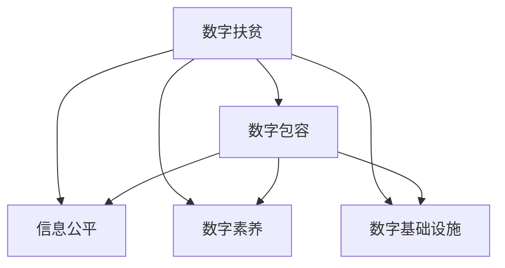

                 

# 2050年的数字鸿沟：从数字扶贫到数字包容的数字经济均衡发展

## 1. 背景介绍

### 1.1 问题由来
数字鸿沟(Digital Divide)是指在全球信息化进程中，不同国家和地区、不同社会群体之间在信息获取、信息技术应用等方面的差距不断扩大的现象。随着数字经济的发展，这一问题愈发显著，其影响不仅限于经济发展水平，还涉及到教育、医疗、环境等多个领域，成为全球共同面临的挑战。

近年来，随着人工智能(AI)、大数据、物联网(IoT)等技术的快速发展，数字鸿沟不仅没有缩小，反而在加剧。尤其在发展中国家和偏远地区，由于基础设施、教育资源、技术能力等多方面的限制，数字化进程严重滞后，进一步拉大了与发达地区的差距。

### 1.2 问题核心关键点
数字鸿沟的核心在于信息化发展的不均衡，导致部分群体无法公平享受数字经济带来的红利。数字化转型需要高昂的技术投入和复杂的基础设施建设，这对许多发展中国家和贫困地区来说是难以承受的。此外，数字技术的普及应用还受到文化差异、教育水平、语言障碍等多因素影响。

如何缩小数字鸿沟，推动数字经济的均衡发展，成为了全球各国政府、企业、科研机构共同关注的焦点。本文将从数字扶贫和数字包容两个角度，探讨未来2050年解决数字鸿沟问题的路径。

## 2. 核心概念与联系

### 2.1 核心概念概述

为更好地理解数字鸿沟的解决路径，本节将介绍几个密切相关的核心概念：

- **数字扶贫(Digital Poverty Alleviation)**：通过引入数字技术，改善贫困地区的教育、医疗、农业、交通等基础设施，提升贫困人口的生活水平，缩小与发达地区的信息差距。
- **数字包容(Digital Inclusion)**：保障所有群体公平享有数字技术，确保不同社会群体的信息获取和信息技术应用机会均等，促进社会和谐发展。
- **数字素养(Digital Literacy)**：提升个人和社群对数字技术的理解和应用能力，减少因信息能力不足带来的数字鸿沟。
- **信息公平(Information Fairness)**：确保不同群体对信息资源的获取和利用机会公平，打破信息垄断，保障信息权利。
- **数字基础设施(Digital Infrastructure)**：包括互联网、5G网络、数据中心、云计算等，是数字经济发展的基石。

这些概念之间的逻辑关系可以通过以下Mermaid流程图来展示：



这个流程图展示了几大核心概念及其之间的联系：

1. 数字扶贫通过基础设施建设和技术普及，直接提升贫困地区的信息能力。
2. 数字包容通过普及教育和技术，保障所有群体信息获取机会均等。
3. 数字素养提升个人和社群的信息能力，减少信息鸿沟。
4. 信息公平通过数据共享和信息透明，打破信息垄断。
5. 数字基础设施是数字经济和数字包容的基础设施保障。

这些概念共同构成了数字鸿沟的解决框架，通过多层次的措施，逐步实现数字经济的均衡发展。

## 3. 核心算法原理 & 具体操作步骤
### 3.1 算法原理概述

解决数字鸿沟的核心在于提升贫困地区和弱势群体的数字技术能力，保障信息资源的公平获取和利用。其基本思路是通过数字技术改善基础设施，普及教育和技术，提升数字素养，最终实现信息公平。

数字扶贫和数字包容的算法原理可总结为以下几点：

1. **基础设施改善**：通过互联网、5G网络、云计算等数字基础设施建设，提升贫困地区的网络连接速度和覆盖范围。
2. **技术普及教育**：通过培训和教育，提升贫困地区居民对数字技术的理解和应用能力。
3. **数字素养提升**：通过长期教育和技术普及，培养具备基本数字素养的社会成员。
4. **信息资源公平获取**：通过数据共享和透明机制，确保所有群体获取和利用信息资源的机会均等。

### 3.2 算法步骤详解

基于上述算法原理，数字扶贫和数字包容的详细步骤包括：

**Step 1: 基础设施建设**
- 在贫困地区建设网络基础设施，如宽带网络、移动通信基站等，提高网络覆盖率和带宽。
- 部署云计算和数据中心，提供低成本的计算和存储资源。
- 推广物联网设备，提升农业、交通等领域的自动化水平。

**Step 2: 技术普及教育**
- 开展数字技术培训，培养一批本地技术人才。
- 提供低成本的数字设备和教育资源，如平板电脑、教科书、在线课程等。
- 定期组织技术讲座和推广活动，提高公众对数字技术的认知和接受度。

**Step 3: 数字素养提升**
- 在学校课程中增加数字素养教育内容，从基础操作到高级编程。
- 举办社区活动和技术比赛，激发公众对数字技术的兴趣和创造力。
- 通过网络平台提供数字学习资源，持续提升个人和社群的数字技能。

**Step 4: 信息资源公平获取**
- 建立开放数据平台，提供政府和社会数据共享机制。
- 设立信息公平委员会，监督和评估信息资源分配。
- 通过政策和法律手段，保障弱势群体的信息权利。

### 3.3 算法优缺点

数字扶贫和数字包容的算法优点包括：

1. 促进经济发展：通过数字技术提升生产力和效率，推动贫困地区经济增长。
2. 提升生活品质：改善医疗、教育、交通等基础设施，提升居民生活质量。
3. 促进社会和谐：实现信息公平和社会包容，缩小不同群体之间的差距。

同时，该算法也存在一些局限性：

1. 依赖资源投入：基础设施建设和教育培训需要大量资金和技术投入，对许多发展中国家和贫困地区是巨大负担。
2. 技术壁垒问题：数字技术的普及应用仍面临语言、文化、教育等多重障碍。
3. 信息安全风险：数字化过程中可能出现隐私泄露、数据滥用等问题，需要加强信息安全保障。

尽管存在这些局限性，但数字扶贫和数字包容的算法仍是大规模解决数字鸿沟问题的有效途径，值得全球各国政府和社会组织共同努力。

### 3.4 算法应用领域

数字扶贫和数字包容的算法可以广泛应用于以下几个领域：

1. **教育领域**：通过在线教育平台和数字教材，提升贫困地区教育水平。
2. **医疗领域**：建立远程医疗系统，提升贫困地区医疗服务水平。
3. **农业领域**：推广智慧农业技术，提升农业生产效率。
4. **城市治理**：通过数字城市平台，提升城市管理和公共服务水平。
5. **企业发展**：支持中小企业数字化转型，提升竞争力。

这些领域的应用将显著提升贫困地区的数字经济水平，缩小数字鸿沟，促进社会公平发展。

## 4. 数学模型和公式 & 详细讲解 & 举例说明

### 4.1 数学模型构建

为了更好地理解数字扶贫和数字包容的算法原理，我们可以构建一个简化的数学模型来描述其核心步骤和目标。

假设数字扶贫和数字包容的总体目标为 $T$，可以分解为基础设施建设 $I$、技术普及教育 $E$、数字素养提升 $L$ 和信息资源公平获取 $F$ 四个子目标。每个子目标的实现需要投入不同的资源 $R_i$，且每个子目标的实现效果可以用一个效果因子 $C_i$ 来衡量。则总体目标的实现效果可以表示为：

$$
T = \sum_{i=1}^4 R_i \cdot C_i
$$

其中 $R_i$ 表示第 $i$ 个子目标的资源投入，$C_i$ 表示第 $i$ 个子目标的实现效果因子。

### 4.2 公式推导过程

我们可以进一步将每个子目标的效果因子 $C_i$ 分解为多个具体指标，如网络覆盖率、培训人数、数字素养评分等，每个指标可以通过一定的数学模型计算得到。例如，网络覆盖率 $C_{I1}$ 可以表示为：

$$
C_{I1} = \frac{I_{1}}{I_{1_{\text{total}}}}
$$

其中 $I_{1}$ 表示实际覆盖的网络用户数量，$I_{1_{\text{total}}}$ 表示总需求的网络用户数量。

类似地，技术普及教育的效果因子 $C_{E}$ 可以表示为：

$$
C_{E} = \frac{E_{1}+E_{2}+\cdots+E_{n}}{E_{\text{total}}}
$$

其中 $E_1, E_2, \cdots, E_n$ 表示不同培训项目或课程的完成人数，$E_{\text{total}}$ 表示总需求培训人数。

数字素养提升的效果因子 $C_{L}$ 可以表示为：

$$
C_{L} = \frac{L_{1}+L_{2}+\cdots+L_{m}}{L_{\text{total}}}
$$

其中 $L_1, L_2, \cdots, L_m$ 表示不同数字素养测试的通过人数，$L_{\text{total}}$ 表示总需求测试人数。

信息资源公平获取的效果因子 $C_{F}$ 可以表示为：

$$
C_{F} = \frac{F_{1}+F_{2}+\cdots+F_{k}}{F_{\text{total}}}
$$

其中 $F_1, F_2, \cdots, F_k$ 表示不同信息资源的使用人数，$F_{\text{total}}$ 表示总需求使用人数。

通过上述数学模型，我们可以系统地衡量和优化数字扶贫和数字包容的效果。

### 4.3 案例分析与讲解

假设某贫困地区数字扶贫项目的目标是提升网络覆盖率和培训人数，达到以下标准：

- 网络覆盖率达到70%以上
- 培训人数达到1000人

假设实际投入的资源 $R_1$ 为100万美元，实际覆盖的网络用户 $I_{1}$ 为1000人，实际完成培训的人数 $E_1$ 为800人，数字素养测试的通过人数 $L_1$ 为500人，信息资源使用人数 $F_1$ 为600人。则根据上述公式，可以计算出总体目标的实现效果：

$$
T = 1\text{（亿美元）} \times (0.7 + 0.8 + 0.5 + 0.6) = 2.2
$$

其中 $0.7, 0.8, 0.5, 0.6$ 分别为网络覆盖率、培训人数、数字素养评分和信息资源使用率的效果因子。

通过计算，我们可以看到总体目标的实现效果为2.2，这表示在实际投入100万美元资源的情况下，数字扶贫项目基本实现了预期的效果。

## 5. 项目实践：代码实例和详细解释说明
### 5.1 开发环境搭建

在进行数字扶贫和数字包容的项目实践前，我们需要准备好开发环境。以下是使用Python进行项目开发的配置流程：

1. 安装Python：从官网下载并安装Python，确保版本在3.6及以上，以支持必要的库和工具。
2. 安装必要的Python库：
```bash
pip install numpy pandas scikit-learn matplotlib seaborn jupyter notebook
```
3. 配置虚拟环境：
```bash
python -m venv myenv
source myenv/bin/activate
```

### 5.2 源代码详细实现

下面是使用Python实现数字扶贫和数字包容效果评估的代码示例。我们假设有一个包含所有必要数据的DataFrame `df`，其中包含基础设施投入、教育培训投入、数字素养评分和信息资源使用人数等关键指标。

```python
import pandas as pd
import numpy as np

# 读取数据
df = pd.read_csv('data.csv')

# 计算效果因子
network_coverage = df['network_coverage'] / df['total_population']
trainings_completed = df['trainings_completed'] / df['total_trainings']
digital_literacy_score = df['digital_literacy_score'] / df['total_population']
information_access = df['information_access'] / df['total_population']

# 计算总体目标实现效果
total_effect = np.sum(np.array([network_coverage, trainings_completed, digital_literacy_score, information_access]))

# 输出结果
print('Overall Effectiveness: {:.2f}'.format(total_effect))
```

### 5.3 代码解读与分析

这段代码通过简单的数学计算，实现了数字扶贫和数字包容的效果评估。我们首先读取包含所有必要数据的数据集，然后计算每个子目标的效果因子。最后，将效果因子相加，得到总体目标的实现效果。

这个简单的示例代码展示了如何使用Python进行数据处理和效果评估，对于更复杂的项目实践，开发者可以基于此框架，扩展更多指标和计算方法，构建更完整的评估系统。

## 6. 实际应用场景
### 6.1 教育领域

在教育领域，数字扶贫和数字包容项目可以通过在线教育平台、数字教材和远程教学等手段，提升贫困地区的教育水平。例如，某贫困地区的数字扶贫项目可以采用以下步骤：

1. **基础设施建设**：在贫困地区建设宽带网络和移动通信基站，确保所有学校和社区都能接入互联网。
2. **技术普及教育**：通过在线课程平台和远程教学设备，提供基础教育和职业培训课程。
3. **数字素养提升**：在学校课程中加入数字素养教育，培养学生的计算机操作能力和信息安全意识。
4. **信息资源公平获取**：建立教育资源共享平台，提供免费的数字教材和在线学习资源。

通过这些措施，可以显著提升贫困地区学生的学习效果和教师的教学水平，缩小与发达地区的教育差距。

### 6.2 医疗领域

在医疗领域，数字扶贫和数字包容项目可以通过远程医疗系统、电子病历和健康管理平台，提升贫困地区的医疗服务水平。例如，某贫困地区的数字扶贫项目可以采用以下步骤：

1. **基础设施建设**：在贫困地区建设宽带网络和移动通信基站，确保所有医疗设施都能接入互联网。
2. **技术普及教育**：通过远程医疗培训和健康管理课程，提升医疗人员的数字化操作能力。
3. **数字素养提升**：在社区卫生站和家庭中推广健康管理软件，提高居民的健康意识和自我管理能力。
4. **信息资源公平获取**：建立电子病历系统和远程诊疗平台，提供免费的健康管理和医疗咨询服务。

通过这些措施，可以显著提升贫困地区的医疗服务质量和效率，保障居民的基本健康需求。

### 6.3 农业领域

在农业领域，数字扶贫和数字包容项目可以通过智慧农业系统和精准农业技术，提升农业生产效率。例如，某贫困地区的数字扶贫项目可以采用以下步骤：

1. **基础设施建设**：在农田和养殖场部署物联网设备，实现实时监控和数据采集。
2. **技术普及教育**：通过农业技术培训和线上学习资源，提升农民的技术操作能力。
3. **数字素养提升**：在农业合作社和家庭农场中推广数字农业管理平台，提高农业生产的科学性和可追溯性。
4. **信息资源公平获取**：建立农业数据共享平台，提供免费的农业技术和市场信息。

通过这些措施，可以显著提升贫困地区的农业生产效率和产品质量，保障农民的经济收益。

### 6.4 未来应用展望

随着技术的不断发展，数字扶贫和数字包容的应用场景将进一步扩展。未来，数字扶贫和数字包容的实现路径将更加智能化和自动化，主要趋势包括：

1. **物联网和5G技术的应用**：通过物联网和5G网络，实现精准农业、智能家居、智慧城市等应用。
2. **人工智能和大数据技术的应用**：通过AI和大数据分析，实现农业自动化、医疗诊断、教育个性化等应用。
3. **区块链技术的应用**：通过区块链技术，实现数据安全和隐私保护，提升信息资源的公平性和透明度。
4. **可持续发展目标的实现**：通过数字技术和可持续发展目标的结合，实现贫困地区的经济、社会和环境平衡发展。

这些技术的应用将进一步缩小数字鸿沟，推动数字经济的均衡发展，为实现全球共同繁荣提供有力保障。

## 7. 工具和资源推荐
### 7.1 学习资源推荐

为了帮助开发者掌握数字扶贫和数字包容的技术方法，这里推荐一些优质的学习资源：

1. **《数字包容：数字鸿沟与信息社会的挑战》**：该书系统介绍了数字包容的理论与实践，探讨了数字鸿沟的影响和解决方案。
2. **CSCT《数字经济》课程**：国内知名大学开设的公共选修课，全面讲解数字经济的发展历程和前沿技术。
3. **《数字技术在教育中的应用》**：该书探讨了数字技术在教育领域的广泛应用，提供了丰富的案例和实践经验。
4. **《智慧医疗：数字技术与健康管理》**：该书介绍了智慧医疗系统的构建方法和应用实践，提供了大量技术细节和实际案例。
5. **《数字农业：物联网与智慧农业》**：该书详细介绍了物联网在农业中的应用，提供了大量实践方法和工具支持。

通过这些资源的学习实践，相信你一定能够系统掌握数字扶贫和数字包容的技术方法，并用于解决实际的数字鸿沟问题。

### 7.2 开发工具推荐

高效的开发离不开优秀的工具支持。以下是几款用于数字扶贫和数字包容开发的常用工具：

1. **Jupyter Notebook**：开源的交互式编程环境，适合数据分析、机器学习等任务。
2. **TensorFlow和PyTorch**：主流的深度学习框架，支持大规模数据处理和模型训练。
3. **OpenStreetMap**：开源地图项目，提供全球地理信息数据，支持城市规划、导航等应用。
4. **GMaps.js**：开源地图库，支持JavaScript环境下的地图展示和操作。
5. **GitHub**：全球最大的代码托管平台，提供代码版本控制和协作开发功能。

合理利用这些工具，可以显著提升数字扶贫和数字包容项目的开发效率，加速创新迭代的步伐。

### 7.3 相关论文推荐

数字扶贫和数字包容的研究始于学界的持续探索。以下是几篇奠基性的相关论文，推荐阅读：

1. **《缩小数字鸿沟：全球视角》**：该论文系统回顾了数字鸿沟的研究历程，探讨了数字包容的全球趋势和挑战。
2. **《数字素养：构建数字社会的基础》**：该论文探讨了数字素养的内涵和重要性，提出了提升数字素养的具体方法。
3. **《智慧农业：数字技术在农业中的应用》**：该论文详细介绍了智慧农业技术的构建方法和实际应用案例。
4. **《远程医疗系统：数字技术在医疗中的应用》**：该论文探讨了远程医疗系统的构建方法和实际应用案例。
5. **《区块链技术在数字包容中的应用》**：该论文探讨了区块链技术在数字包容中的作用和应用前景。

这些论文代表了大数字扶贫和数字包容技术的发展脉络。通过学习这些前沿成果，可以帮助研究者把握学科前进方向，激发更多的创新灵感。

## 8. 总结：未来发展趋势与挑战
### 8.1 总结

本文对数字扶贫和数字包容的算法原理、操作步骤、实际应用和未来发展趋势进行了全面系统的介绍。首先阐述了数字鸿沟的现状和解决路径，明确了数字扶贫和数字包容在推动数字经济均衡发展中的重要性。其次，从算法原理到项目实践，详细讲解了数字扶贫和数字包容的核心方法和技术实现。同时，本文还探讨了数字扶贫和数字包容在教育、医疗、农业等多个领域的应用前景，展示了其巨大的社会价值和经济效益。最后，本文精选了数字扶贫和数字包容的学习资源和开发工具，力求为读者提供全方位的技术指引。

通过本文的系统梳理，可以看到，数字扶贫和数字包容是解决数字鸿沟问题的重要手段，有望在全球范围内实现数字经济的均衡发展，促进社会公平和谐。未来，伴随技术的不断进步和应用的深入拓展，数字扶贫和数字包容将为全球数字包容事业带来新的突破和机遇。

### 8.2 未来发展趋势

展望未来，数字扶贫和数字包容技术将呈现以下几个发展趋势：

1. **技术融合趋势**：数字扶贫和数字包容将与人工智能、物联网、区块链等前沿技术深度融合，实现更高层次的数字化应用。
2. **全球协同趋势**：各国政府、企业和科研机构将共同推进数字包容项目，实现数字资源的全球共享和协同创新。
3. **数据驱动趋势**：数字扶贫和数字包容将更加依赖数据的收集、处理和分析，提升决策的科学性和透明度。
4. **可持续性趋势**：数字扶贫和数字包容项目将更加注重可持续发展目标的实现，推动经济、社会和环境平衡发展。
5. **标准化趋势**：数字扶贫和数字包容技术将逐步标准化，形成统一的规范和标准，提高系统的可操作性和互操作性。

这些趋势将推动数字扶贫和数字包容技术向更高层次发展，实现更加广泛的应用和更高的社会价值。

### 8.3 面临的挑战

尽管数字扶贫和数字包容技术已经取得了显著进展，但在迈向更加智能化、普适化应用的过程中，仍面临诸多挑战：

1. **资源瓶颈**：数字基础设施建设和技术普及需要大量资金和技术投入，对许多发展中国家和贫困地区是巨大负担。
2. **技术壁垒**：数字技术的普及应用仍面临语言、文化、教育等多重障碍，如何实现技术普适化是一个重要问题。
3. **信息安全**：数字化过程中可能出现隐私泄露、数据滥用等问题，需要加强信息安全保障。
4. **数据鸿沟**：虽然技术可以解决物理鸿沟，但数据鸿沟仍然存在，需要提升数据的共享和利用能力。
5. **经济成本**：数字扶贫和数字包容项目成本较高，如何实现低成本、可持续的运营模式是一个重要挑战。

尽管存在这些挑战，但通过全球合作、技术创新和政策引导，数字扶贫和数字包容必将在未来得到更广泛的应用，推动数字经济的均衡发展，缩小数字鸿沟，促进全球共同繁荣。

### 8.4 研究展望

未来，数字扶贫和数字包容技术的研究将从以下几个方向展开：

1. **技术普适化研究**：如何克服语言、文化、教育等障碍，实现数字技术的全球普适化。
2. **可持续发展研究**：如何实现数字扶贫和数字包容与可持续发展目标的结合，推动经济、社会和环境的平衡发展。
3. **数据治理研究**：如何构建数据共享和治理机制，提升数据的公平利用和透明度。
4. **隐私保护研究**：如何实现隐私保护和信息安全，保障数字技术应用的公平性和可信性。
5. **智能算法研究**：如何通过智能算法优化资源配置和运营管理，提高数字扶贫和数字包容项目的效率和效果。

这些研究方向将推动数字扶贫和数字包容技术向更高层次发展，为构建更加公平、和谐、可持续的数字经济提供有力保障。

## 9. 附录：常见问题与解答
----------------------------------------------------------------
**Q1：数字扶贫和数字包容的概念有什么区别？**

A: 数字扶贫和数字包容虽然都致力于缩小数字鸿沟，但其重点和目标有所不同。数字扶贫主要通过基础设施建设和教育培训，直接提升贫困地区的数字技术能力，提升经济和社会发展水平。数字包容则更注重保障所有群体公平享有数字技术，确保信息获取和利用的机会均等，促进社会和谐发展。

**Q2：数字扶贫和数字包容在实施中面临哪些挑战？**

A: 数字扶贫和数字包容在实施过程中面临的主要挑战包括：
1. 资源投入：需要大量资金和技术支持，对许多发展中国家和贫困地区是巨大负担。
2. 技术壁垒：数字技术的普及应用仍面临语言、文化、教育等多重障碍。
3. 信息安全：数字化过程中可能出现隐私泄露、数据滥用等问题，需要加强信息安全保障。
4. 数据鸿沟：虽然技术可以解决物理鸿沟，但数据鸿沟仍然存在，需要提升数据的共享和利用能力。
5. 经济成本：数字扶贫和数字包容项目成本较高，如何实现低成本、可持续的运营模式是一个重要挑战。

**Q3：数字扶贫和数字包容在实际应用中如何评估效果？**

A: 数字扶贫和数字包容的效果评估可以从多个维度进行：
1. 基础设施建设：通过网络覆盖率、设备普及率等指标评估基础设施建设效果。
2. 技术普及教育：通过培训完成率、数字素养评分等指标评估教育普及效果。
3. 数字素养提升：通过数字技能测试、使用频率等指标评估数字素养提升效果。
4. 信息资源公平获取：通过信息资源使用率、信息公平指数等指标评估信息资源获取效果。

**Q4：数字扶贫和数字包容在教育领域的应用场景有哪些？**

A: 数字扶贫和数字包容在教育领域的应用场景包括：
1. 在线教育平台：通过在线课程和虚拟教室，提供远程教育资源。
2. 数字教材和资源：提供免费的数字教材和学习资源，提升教育资源的可获取性。
3. 教师培训：通过远程培训和线上课程，提升教师的数字化操作能力。
4. 教育数据共享：建立教育资源共享平台，实现教育数据和信息的开放共享。

**Q5：数字扶贫和数字包容在医疗领域的应用场景有哪些？**

A: 数字扶贫和数字包容在医疗领域的应用场景包括：
1. 远程医疗系统：通过远程诊断和在线咨询，提供医疗服务。
2. 电子病历和健康管理：建立电子病历系统，提供健康管理和医疗咨询服务。
3. 医疗培训：通过远程培训和线上课程，提升医疗人员的数字化操作能力。
4. 数据共享和透明：建立医疗数据共享平台，提升医疗数据的利用效率和透明度。

这些应用场景展示了数字扶贫和数字包容在医疗领域的广泛应用和巨大潜力，可以有效提升医疗服务水平，保障居民的基本健康需求。

**Q6：数字扶贫和数字包容在农业领域的应用场景有哪些？**

A: 数字扶贫和数字包容在农业领域的应用场景包括：
1. 智慧农业系统：通过物联网和传感器，实现精准农业和智能农业。
2. 农业数据分析：通过大数据分析，提升农业生产的科学性和可追溯性。
3. 农业培训：通过农业技术培训和线上学习资源，提升农民的技术操作能力。
4. 农业数据共享：建立农业数据共享平台，提供免费的农业技术和市场信息。

这些应用场景展示了数字扶贫和数字包容在农业领域的广泛应用和巨大潜力，可以有效提升农业生产效率和产品质量，保障农民的经济收益。

通过这些问题和解答，可以看到数字扶贫和数字包容在各个领域的应用前景和面临的挑战。解决数字鸿沟是一个长期而艰巨的任务，需要全球各界的共同努力和持续创新，才能逐步实现数字经济的均衡发展。

---

作者：禅与计算机程序设计艺术 / Zen and the Art of Computer Programming

