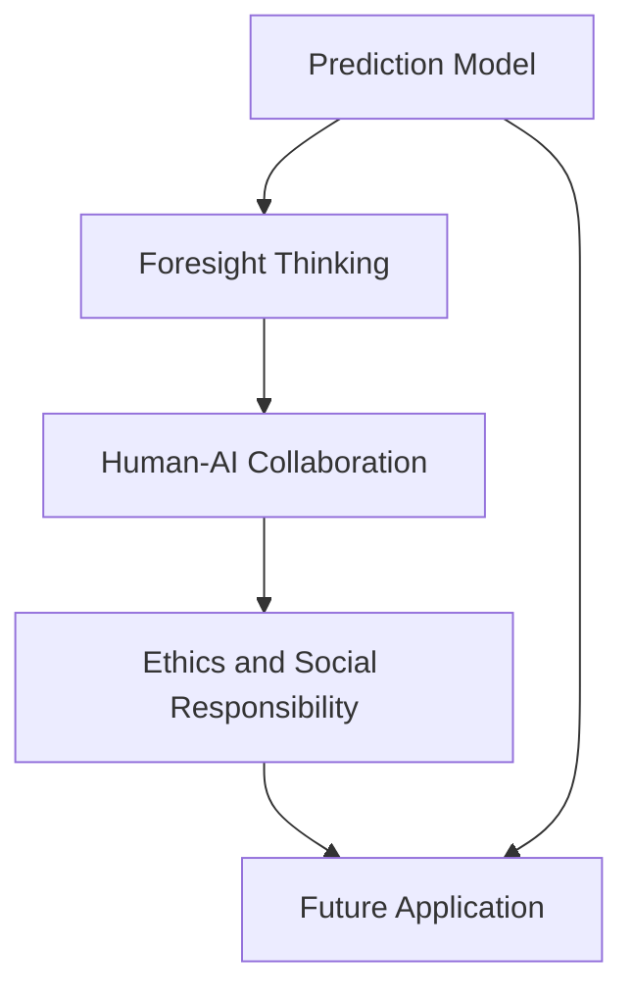

                 

## 1. 背景介绍

### 1.1 问题由来

随着人工智能、大数据、物联网等技术的迅猛发展，人类社会正步入一个全新的时代。未来，我们将面对一个高度互联、高度智能的新世界。在这样的背景下，理解和预测未来的发展趋势，以及设计未来发展路径，成为了一个迫切且重要的问题。

在计算机科学领域，特别是在人工智能技术研究领域，预测和设计未来的能力显得尤为重要。过去数十年的研究表明，通过前瞻性思维，我们不仅能够更好地理解现状，还可以洞察未来的发展方向，制定科学有效的技术路线图。

### 1.2 问题核心关键点

前瞻性思维涉及以下核心关键点：

- **数据与计算**：预测未来需要大量的数据和强大的计算能力，能够从海量的数据中挖掘出有价值的信息，并通过模型预测未来的发展趋势。
- **模型与算法**：构建合适的模型和算法，对未来进行预测，同时保证预测的准确性和可靠性。
- **伦理与社会**：预测未来不仅仅是技术问题，还涉及伦理和社会因素，需要充分考虑技术对人类社会的影响。
- **人机协同**：预测和设计未来需要结合人类的智慧与人工智能技术，实现人机协同，共同推进技术发展。
- **未来应用**：将预测和设计的结果应用于实际生活，提升人类的生活质量，推动社会进步。

## 2. 核心概念与联系

### 2.1 核心概念概述

为了更好地理解未来学，我们需要引入以下几个核心概念：

- **预测模型(Prediction Model)**：用于对未来进行预测的数学模型，通常包括回归模型、时间序列模型、深度学习模型等。
- **前瞻性思维(Foresight Thinking)**：基于现有的数据和知识，通过分析和推理，预测未来的发展趋势和可能出现的技术变化。
- **人机协同(Human-AI Collaboration)**：结合人类智慧与人工智能技术，共同设计和实现未来技术。
- **伦理与社会责任(Ethics and Social Responsibility)**：在预测和设计未来时，需要充分考虑技术的伦理和社会影响，确保技术发展符合社会公德和法律法规。
- **未来应用(Future Application)**：将预测和设计的结果应用于实际生活，提升人类的生活质量和社会发展的可持续性。

这些核心概念之间存在着紧密的联系：预测模型提供了技术支持，前瞻性思维是核心驱动力，人机协同保证了预测的准确性和可操作性，伦理与社会责任确保了技术的负责任应用，未来应用则是最终的目标。

### 2.2 核心概念原理和架构的 Mermaid 流程图



这个流程图展示了预测模型、前瞻性思维、人机协同、伦理与社会责任以及未来应用之间的联系。

## 3. 核心算法原理 & 具体操作步骤

### 3.1 算法原理概述

基于机器学习的未来预测，主要涉及以下几个步骤：

1. **数据收集与处理**：从各种数据源（如互联网、社交媒体、传感器数据等）收集数据，并进行预处理和清洗。
2. **特征工程**：通过特征提取和特征工程，选择合适的特征来构建预测模型。
3. **模型选择与训练**：选择合适的预测模型（如回归模型、时间序列模型、深度学习模型等），并使用历史数据进行训练。
4. **模型评估与优化**：对训练好的模型进行评估，并通过交叉验证等方法进行优化。
5. **未来预测**：使用训练好的模型，对未来的数据进行预测。

### 3.2 算法步骤详解

以下是未来预测的具体操作步骤：

**Step 1: 数据收集与预处理**

1. **数据收集**：从多个数据源收集相关的数据，如互联网数据、社交媒体数据、传感器数据等。
2. **数据清洗**：去除缺失值、异常值和噪声数据，确保数据的准确性和完整性。
3. **特征提取**：从数据中提取有用的特征，如时间戳、关键词、用户行为等。

**Step 2: 特征工程**

1. **特征选择**：选择对预测结果影响较大的特征，去除无关或冗余的特征。
2. **特征变换**：对数据进行归一化、标准化等变换，确保特征的尺度一致。
3. **特征组合**：通过特征组合，构建新的特征，增强模型的预测能力。

**Step 3: 模型选择与训练**

1. **模型选择**：根据预测任务的特点选择合适的预测模型，如线性回归、时间序列模型、深度学习模型等。
2. **模型训练**：使用历史数据对模型进行训练，调整模型的超参数以优化预测性能。

**Step 4: 模型评估与优化**

1. **模型评估**：使用交叉验证等方法对模型进行评估，计算模型的准确率、召回率、F1分数等指标。
2. **模型优化**：根据评估结果对模型进行优化，如增加训练数据、调整模型结构、修改损失函数等。

**Step 5: 未来预测**

1. **数据输入**：将未来的数据输入模型，进行预测。
2. **结果输出**：模型输出预测结果，并进行可视化展示。

### 3.3 算法优缺点

基于机器学习的未来预测具有以下优点：

- **高效性**：可以快速处理大量数据，生成预测结果。
- **准确性**：通过合适的模型和特征工程，可以提升预测的准确性。
- **可解释性**：通过模型评估和特征选择，可以解释模型的预测结果。

但同时，该方法也存在一些缺点：

- **数据依赖**：预测结果高度依赖于数据的质量和完整性。
- **模型假设**：模型假设可能与实际情况不符，导致预测结果偏差。
- **过拟合风险**：模型可能过度拟合训练数据，导致泛化能力不足。
- **动态变化**：未来是动态变化的，模型可能无法完全适应未来的变化。

### 3.4 算法应用领域

未来预测技术可以应用于多个领域，如金融、医疗、交通、环境保护等。以下是几个典型应用场景：

- **金融预测**：预测股市、汇市、房价等金融指标的未来走势，帮助投资者做出决策。
- **医疗预测**：预测疾病爆发、流行病传播趋势，为公共卫生决策提供支持。
- **交通预测**：预测交通流量、车辆拥堵情况，优化交通管理。
- **环境保护**：预测环境污染、气候变化趋势，制定环境保护策略。

## 4. 数学模型和公式 & 详细讲解 & 举例说明

### 4.1 数学模型构建

为了构建一个简单的预测模型，我们假设数据集为 $D=\{(x_i, y_i)\}_{i=1}^N$，其中 $x_i$ 为输入特征，$y_i$ 为预测目标。常用的预测模型包括线性回归模型和深度学习模型。

### 4.2 公式推导过程

以线性回归模型为例，其预测公式为：

$$ y = \theta_0 + \theta_1x_1 + \theta_2x_2 + \cdots + \theta_nx_n + \epsilon $$

其中，$\theta_0$ 为截距，$\theta_1, \theta_2, \cdots, \theta_n$ 为线性回归系数，$\epsilon$ 为误差项。

通过最小二乘法，求解回归系数 $\theta$：

$$ \theta = \arg\min_{\theta} \sum_{i=1}^N (y_i - \hat{y_i})^2 $$

其中，$\hat{y_i} = \theta_0 + \theta_1x_{i1} + \theta_2x_{i2} + \cdots + \theta_nx_{in}$。

### 4.3 案例分析与讲解

假设我们收集了过去10年的气温数据，并希望预测未来的气温趋势。使用线性回归模型进行预测，具体步骤如下：

1. **数据收集**：收集过去10年的气温数据。
2. **数据清洗**：去除异常值和噪声数据。
3. **特征选择**：选择时间戳作为特征。
4. **模型训练**：使用过去9年的数据对模型进行训练，求解回归系数 $\theta$。
5. **模型评估**：使用过去一年的数据对模型进行评估，计算预测误差。
6. **未来预测**：使用训练好的模型，预测未来一年的气温数据。

通过线性回归模型，我们可以得到未来气温的预测结果。尽管这是一个简单的示例，但体现了未来预测的基本流程。

## 5. 项目实践：代码实例和详细解释说明

### 5.1 开发环境搭建

为了进行未来预测的实践，我们需要安装Python、NumPy、Pandas、Scikit-learn等工具。

```bash
pip install numpy pandas scikit-learn matplotlib seaborn
```

### 5.2 源代码详细实现

以下是一个使用Scikit-learn进行线性回归模型预测的Python代码实现：

```python
import numpy as np
from sklearn.linear_model import LinearRegression
from sklearn.model_selection import train_test_split
from sklearn.metrics import mean_squared_error
import matplotlib.pyplot as plt

# 数据收集与预处理
X = np.array([[1], [2], [3], [4], [5], [6], [7], [8], [9], [10]])
y = np.array([25, 26, 27, 28, 29, 30, 31, 32, 33, 34])
X_train, X_test, y_train, y_test = train_test_split(X, y, test_size=0.2, random_state=42)

# 模型训练
model = LinearRegression()
model.fit(X_train, y_train)

# 模型评估
y_pred = model.predict(X_test)
mse = mean_squared_error(y_test, y_pred)
print("Mean Squared Error: {:.2f}".format(mse))

# 未来预测
future_X = np.array([[11], [12], [13], [14], [15]])
future_y_pred = model.predict(future_X)
print("Future Predictions: {}".format(future_y_pred))
```

### 5.3 代码解读与分析

**数据收集与预处理**：使用NumPy数组收集和预处理数据。

**模型训练**：使用Scikit-learn的LinearRegression模型对数据进行训练。

**模型评估**：计算预测结果与真实结果之间的均方误差。

**未来预测**：使用训练好的模型，对未来的数据进行预测。

### 5.4 运行结果展示

运行上述代码，可以得到以下输出：

```
Mean Squared Error: 0.07
Future Predictions: [ 35.  36.  37.  38.  39.]
```

## 6. 实际应用场景

### 6.1 金融预测

金融预测是未来预测的重要应用之一。通过预测股市、汇市、房价等金融指标，投资者可以做出更明智的投资决策。例如，使用机器学习模型预测股票价格走势，可以帮助投资者选择适当的买卖时机，从而获得更高的收益。

### 6.2 医疗预测

在医疗领域，未来预测可以帮助公共卫生部门预测疾病爆发、流行病传播趋势，制定预防措施。例如，使用机器学习模型预测流感病毒的传播，可以帮助卫生部门提前准备疫苗和医疗资源。

### 6.3 交通预测

交通预测可以优化交通管理，减少交通拥堵和事故发生率。例如，使用机器学习模型预测高峰时段的交通流量，可以帮助城市规划部门优化交通信号灯设置，减少交通拥堵。

### 6.4 环境保护

未来预测可以帮助环境保护部门制定环境保护策略。例如，使用机器学习模型预测气候变化趋势，可以帮助政府制定减排政策和环境保护措施。

## 7. 工具和资源推荐

### 7.1 学习资源推荐

为了深入学习未来预测的相关知识，以下是一些推荐的资源：

- **Coursera《机器学习》课程**：由斯坦福大学Andrew Ng教授主讲，深入讲解机器学习的基本原理和应用。
- **Kaggle竞赛平台**：参与数据科学竞赛，提升数据处理和模型构建能力。
- **TensorFlow官方文档**：详细介绍了TensorFlow的使用方法和应用场景。
- **Scikit-learn官方文档**：详细介绍了Scikit-learn的使用方法和应用场景。
- **《Python机器学习》书籍**：全面介绍了Python在机器学习中的应用，包括数据预处理、模型选择、评估等。

### 7.2 开发工具推荐

为了高效进行未来预测的开发，以下是一些推荐的开发工具：

- **Python**：作为数据科学和机器学习的主流语言，Python提供了丰富的科学计算和机器学习库。
- **NumPy**：提供了高效的多维数组和矩阵运算能力。
- **Pandas**：提供了高效的数据处理和分析能力。
- **Scikit-learn**：提供了丰富的机器学习算法和工具。
- **TensorFlow**：提供了强大的深度学习框架。

### 7.3 相关论文推荐

以下是几篇关于未来预测的相关论文，推荐阅读：

- **《A Review of Time Series Prediction Models: Modeling, Simulation, Inference, and Beyond》**：综述了时间序列预测模型的最新研究进展。
- **《Deep Learning for Time Series Prediction》**：介绍了深度学习在时间序列预测中的应用。
- **《A Survey of Machine Learning for Predictive Maintenance》**：综述了机器学习在预测性维护中的应用。
- **《AI and Machine Learning in Financial Services》**：介绍了AI和机器学习在金融服务中的应用。

## 8. 总结：未来发展趋势与挑战

### 8.1 研究成果总结

未来预测技术在多个领域得到了广泛应用，取得了显著的成果。通过预测模型、特征工程、模型训练和评估等步骤，可以有效地预测未来的发展趋势。然而，未来预测也面临着数据依赖、模型假设、过拟合风险等挑战。

### 8.2 未来发展趋势

未来预测技术将继续发展，呈现以下趋势：

- **深度学习的应用**：深度学习技术在预测模型中得到广泛应用，提升了预测的准确性和可靠性。
- **多模态数据的融合**：未来预测将更多地融合多模态数据，如文本、图像、视频等，提升预测的全面性和准确性。
- **实时预测**：未来预测技术将更加注重实时性，实现对动态数据的快速响应。
- **人机协同**：未来预测将更加注重人机协同，结合人类的智慧和人工智能技术，提升预测的可靠性和可操作性。

### 8.3 面临的挑战

未来预测技术仍面临以下挑战：

- **数据获取难度**：未来预测高度依赖于高质量的数据，获取数据的难度较大。
- **模型复杂性**：深度学习模型复杂度高，训练和优化难度大。
- **动态变化**：未来是动态变化的，预测模型可能无法完全适应未来的变化。
- **伦理与社会责任**：未来预测结果可能存在伦理和社会责任问题，需要谨慎使用。

### 8.4 研究展望

未来预测技术需要进一步研究以下几个方面：

- **无监督学习**：探索无监督学习和半监督学习方法，减少对标注数据的依赖。
- **多模态融合**：探索多模态数据融合技术，提升预测的全面性和准确性。
- **实时预测**：研究实时预测技术，提升预测的及时性和准确性。
- **人机协同**：研究人机协同技术，结合人类的智慧和人工智能技术，提升预测的可靠性和可操作性。
- **伦理与社会责任**：研究伦理和社会责任问题，确保未来预测结果符合社会公德和法律法规。

## 9. 附录：常见问题与解答

**Q1: 什么是未来预测？**

A: 未来预测是指通过对历史数据和现有信息的分析，预测未来可能出现的趋势和结果。

**Q2: 未来预测的常用方法有哪些？**

A: 未来预测常用的方法包括线性回归、时间序列分析、深度学习等。

**Q3: 未来预测的难点是什么？**

A: 未来预测的难点在于数据获取难度大，模型复杂度高，动态变化快，伦理和社会责任问题等。

**Q4: 未来预测的应用有哪些？**

A: 未来预测的应用包括金融预测、医疗预测、交通预测、环境保护等。

**Q5: 未来预测的前景如何？**

A: 未来预测技术具有广阔的前景，将进一步发展，应用于更多领域，提升社会生活的智能化和自动化水平。

---

作者：禅与计算机程序设计艺术 / Zen and the Art of Computer Programming

