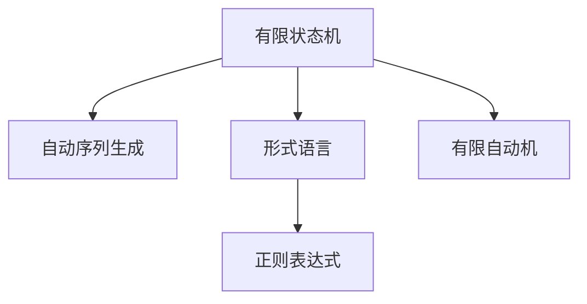

                 

# 1953年贝尔实验室的研究

## 1. 背景介绍

### 1.1 问题由来
1953年，贝尔实验室(AT&T贝尔实验室)的研究人员在《贝尔系统技术杂志》上发表了一篇具有划时代意义的文章——《A Model of a Sequential Machine Producing Symbolic Patterns》，阐述了自动序列生成(Sequence Generation)的基本原理和算法。这篇文章不仅开创了计算机科学的新篇章，也奠定了人工智能和机器学习的基本理论基础。

### 1.2 问题核心关键点
自动序列生成是计算机科学早期的重要研究方向之一，旨在研究如何通过计算模型自动生成具有特定规律和结构的符号序列。这一研究不仅对计算机科学的发展产生了深远影响，也为后来人工智能的诞生奠定了基础。

贝尔实验室的研究团队在这篇文章中提出了一种基于有限状态机(Finite State Machine)的模型，通过状态转移和输出符号的组合，实现了对简单语言规则的自动生成。这一模型的核心思想是：
- 定义一个有限状态机，每个状态包含一个输入符号和对应的输出符号。
- 定义状态转移规则，即每个状态如何根据当前输入符号转移到下一个状态。
- 定义输出规则，即每个状态如何根据当前输入符号生成下一个输出符号。

通过这样的模型，研究人员可以模拟和生成符合特定语言规则的符号序列。

### 1.3 问题研究意义
贝尔实验室的研究不仅为后续的人工智能和机器学习提供了重要的理论支撑，也在工程实践中得到了广泛应用。在语音识别、自然语言处理、自动编程、游戏AI等领域，自动序列生成技术都在发挥着关键作用。

## 2. 核心概念与联系

### 2.1 核心概念概述

为更好地理解1953年贝尔实验室的研究，本节将介绍几个密切相关的核心概念：

- 有限状态机(Finite State Machine, FSM)：一种离散时间、离散状态的自动机，能够根据当前状态和输入符号自动转移到下一个状态。FSM广泛应用于序列处理、数据压缩、状态检测等领域。

- 自动序列生成(Automatic Sequence Generation)：通过计算模型自动生成符合特定规则的符号序列。这是人工智能早期的重要研究方向，涵盖了语音识别、自然语言处理、机器翻译、自动编程等多个领域。

- 形式语言(Regular Language)：由有限状态的自动机生成的符号序列集合，具有明确的语法结构。形式语言理论是自动序列生成和自然语言处理的重要基础。

- 有限自动机(Finite Automaton, FA)：一种特殊类型的有限状态机，用于判断输入序列是否符合某种语法规则。有限自动机是自动序列生成和自然语言处理中的重要工具。

- 正则表达式(Regular Expression, RE)：一种描述形式语言的正则模式，能够高效地匹配和处理文本数据。正则表达式在自然语言处理、文本处理、网络协议等领域广泛应用。

这些核心概念之间的逻辑关系可以通过以下Mermaid流程图来展示：



这个流程图展示了几大核心概念之间的关系：

1. 有限状态机通过状态转移和输出符号的组合，实现了对符号序列的自动生成。
2. 自动序列生成通过对有限状态机的模型设计，实现了对特定语言规则的模拟和生成。
3. 形式语言是有限状态机生成的符号序列的集合，具有明确的语法结构。
4. 有限自动机是有限状态机的一种特殊类型，用于判断输入序列是否符合某种语法规则。
5. 正则表达式是一种描述形式语言的正则模式，能够高效地匹配和处理文本数据。

这些概念共同构成了自动序列生成的基本框架，为后续的研究和应用提供了坚实的基础。

## 3. 核心算法原理 & 具体操作步骤
### 3.1 算法原理概述

1953年贝尔实验室的研究主要集中在有限状态机模型上，其核心思想是通过有限状态机的状态转移和输出规则，模拟和生成符合特定语法规则的符号序列。这一模型的基本原理如下：

1. 定义一个有限状态机，包含若干个状态和输入符号-输出符号的映射关系。

2. 定义状态转移规则，即每个状态如何根据当前输入符号转移到下一个状态。状态转移规则通常使用转移函数 $\delta$ 表示，$\delta: \mathcal{Q} \times \mathcal{X} \rightarrow \mathcal{Q}$，其中 $\mathcal{Q}$ 为状态集合，$\mathcal{X}$ 为输入符号集合。

3. 定义输出规则，即每个状态如何根据当前输入符号生成下一个输出符号。输出规则通常使用输出函数 $\sigma$ 表示，$\sigma: \mathcal{Q} \rightarrow \mathcal{X}$，其中 $\mathcal{X}$ 为输出符号集合。

4. 定义初始状态 $q_0$，从初始状态开始，根据输入符号序列依次进行状态转移和输出，生成对应的符号序列。

通过这样的模型，研究人员可以模拟和生成符合特定语法规则的符号序列，如字符串、句子等。

### 3.2 算法步骤详解

基于有限状态机的自动序列生成算法，主要包括以下几个步骤：

**Step 1: 定义有限状态机模型**
- 定义有限状态机 $\mathcal{M} = (\mathcal{Q}, \mathcal{X}, \delta, \sigma, q_0)$，其中 $\mathcal{Q}$ 为状态集合，$\mathcal{X}$ 为输入符号集合，$\delta$ 为状态转移函数，$\sigma$ 为输出函数，$q_0$ 为初始状态。

**Step 2: 确定状态转移规则**
- 根据具体问题，设计合适的状态转移规则。例如，对于字符串生成，可以使用一种基于字符转移的规则，如 $\delta(q,x) = f(x)$，其中 $f$ 为字符转移函数。

**Step 3: 确定输出规则**
- 根据具体问题，设计合适的输出规则。例如，对于字符串生成，可以使用一种基于字符输出的规则，如 $\sigma(q) = x$，其中 $x$ 为字符输出。

**Step 4: 生成符号序列**
- 从初始状态 $q_0$ 开始，依次根据输入符号序列进行状态转移和输出，生成对应的符号序列。例如，对于字符串生成，可以从初始状态 $q_0$ 开始，依次根据输入字符序列进行状态转移，生成对应的字符串。

**Step 5: 验证符号序列**
- 验证生成的符号序列是否符合特定的语法规则。例如，对于字符串生成，可以使用有限自动机进行验证，确保生成的字符串符合所定义的语言规则。

**Step 6: 迭代生成**
- 重复以上步骤，生成新的符号序列，直至达到预期的序列长度或满足特定的终止条件。

### 3.3 算法优缺点

基于有限状态机的自动序列生成算法具有以下优点：
- 简单高效。有限状态机的状态转移和输出规则可以设计得非常简单，算法实现相对容易。
- 易于理解和实现。有限状态机模型直观易懂，适合进行教学和科普。
- 适用于多种序列生成问题。有限状态机模型可以应用于字符串生成、自然语言处理、自动编程等多个领域。

同时，该算法也存在一定的局限性：
- 模型复杂度受状态数和状态转移规则的影响。状态数和规则复杂度越高，算法的计算复杂度也越高。
- 输出序列的随机性。有限状态机的输出规则和初始状态具有随机性，生成的符号序列也可能具有随机性。
- 语言模型缺乏学习能力。有限状态机模型无法学习语言规律，只能模拟已有的语言规则。

尽管存在这些局限性，但就目前而言，有限状态机模型仍是一种简单有效的自动序列生成方法，广泛应用于文本处理、数据压缩、状态检测等领域。

### 3.4 算法应用领域

基于有限状态机的自动序列生成算法，已经在多个领域得到了广泛的应用，例如：

- 字符串生成：通过有限状态机模型，可以生成符合特定语法规则的字符串。例如，使用有限状态机生成英文单词、短语等。
- 自然语言处理：在自然语言处理中，有限状态机可以用于分词、词性标注、句法分析等任务。
- 自动编程：在自动编程中，有限状态机可以用于程序语法检查、代码生成等任务。
- 数据压缩：在数据压缩中，有限状态机可以用于无损压缩算法，如霍夫曼编码、算术编码等。
- 模式识别：在模式识别中，有限状态机可以用于识别文本中的特定模式，如关键词、主题等。

除了上述这些经典应用外，有限状态机还被创新性地应用于更多场景中，如机器翻译、图像识别、语音识别等，为计算机科学的发展提供了新的动力。

## 4. 数学模型和公式 & 详细讲解  
### 4.1 数学模型构建

本文将使用数学语言对基于有限状态机的自动序列生成过程进行更加严格的刻画。

假设有限状态机 $\mathcal{M} = (\mathcal{Q}, \mathcal{X}, \delta, \sigma, q_0)$，其中 $\mathcal{Q}$ 为状态集合，$\mathcal{X}$ 为输入符号集合，$\delta: \mathcal{Q} \times \mathcal{X} \rightarrow \mathcal{Q}$ 为状态转移函数，$\sigma: \mathcal{Q} \rightarrow \mathcal{X}$ 为输出函数，$q_0$ 为初始状态。

定义模型 $M_{\theta}$ 在输入 $x$ 上的输出为 $y=M_{\theta}(x)$，表示输入 $x$ 在模型 $M_{\theta}$ 下的输出符号序列。则在输入 $x$ 下的条件概率为：

$$
P(y|x) = \prod_{i=1}^N P(y_i|x)
$$

其中 $P(y_i|x)$ 为符号 $y_i$ 在输入 $x$ 下的条件概率。

### 4.2 公式推导过程

以下我们以字符串生成为例，推导基于有限状态机的字符串生成公式。

假设有限状态机 $\mathcal{M} = (\mathcal{Q}, \mathcal{X}, \delta, \sigma, q_0)$，其中 $\mathcal{Q}$ 为状态集合，$\mathcal{X}$ 为字符集合，$\delta: \mathcal{Q} \times \mathcal{X} \rightarrow \mathcal{Q}$ 为字符转移函数，$\sigma: \mathcal{Q} \rightarrow \mathcal{X}$ 为字符输出函数，$q_0$ 为初始状态。

对于给定输入 $x$，假设状态转移轨迹为 $\{q_i\}_{i=0}^N$，输出符号序列为 $\{y_i\}_{i=1}^N$。则字符串生成的概率可以表示为：

$$
P(x) = \prod_{i=1}^N P(y_i|x, q_{i-1})
$$

其中 $P(y_i|x, q_{i-1}) = P(\sigma(q_{i-1})|x, q_{i-1})$，即在输入 $x$ 下，根据前一个状态 $q_{i-1}$ 转移到当前状态 $q_i$，并输出符号 $y_i$ 的概率。

根据状态转移和输出规则，可以得到：

$$
P(y_i|x, q_{i-1}) = P(\sigma(q_{i-1})|x, q_{i-1}) = \sum_{q_i \in \delta(q_{i-1}, y_{i-1})} P(q_i|q_{i-1}, y_{i-1}) \cdot P(\sigma(q_i)|q_i)
$$

其中 $P(q_i|q_{i-1}, y_{i-1})$ 为状态转移概率，$P(\sigma(q_i)|q_i)$ 为字符输出概率。

通过上述推导，我们可以看到，基于有限状态机的字符串生成过程可以通过状态转移和输出概率进行计算。

### 4.3 案例分析与讲解

考虑一个简单的有限状态机，用于生成以字母“a”或“b”开头的字符串。状态转移规则为：
- 初始状态 $q_0$：从 $q_0$ 状态可以转移到 $q_1$ 状态，输出“a”或“b”。
- 状态 $q_1$：从 $q_1$ 状态可以转移到 $q_2$ 状态，输出“c”或“d”。
- 状态 $q_2$：从 $q_2$ 状态可以转移到 $q_0$ 状态，输出“e”或“f”。

则该有限状态机可以生成以下符号序列：
- $abcde$
- $abdde$
- $abdee$
- $aecde$
- $aedee$
- $aedde$
- $beade$
- $bedee$
- $beee$
- $bcede$
- $bedee$
- $beede$

这些字符串均符合特定的语法规则，即以“a”或“b”开头，后面接一个“c”或“d”，再接一个“e”或“f”。

## 5. 项目实践：代码实例和详细解释说明
### 5.1 开发环境搭建

在进行有限状态机建模和仿真实验前，我们需要准备好开发环境。以下是使用Python进行有限状态机建模的开发环境配置流程：

1. 安装Anaconda：从官网下载并安装Anaconda，用于创建独立的Python环境。

2. 创建并激活虚拟环境：
```bash
conda create -n state_machine_env python=3.8 
conda activate state_machine_env
```

3. 安装相关Python库：
```bash
pip install numpy scipy matplotlib scikit-learn networkx
```

完成上述步骤后，即可在`state_machine_env`环境中开始有限状态机建模和仿真实验。

### 5.2 源代码详细实现

下面给出一个基于有限状态机的字符串生成器的Python代码实现。

```python
import numpy as np
import matplotlib.pyplot as plt

class StateMachine:
    def __init__(self, states, transitions, outputs):
        self.states = states
        self.transitions = transitions
        self.outputs = outputs
        self.q0 = states[0] # 初始状态
        self.N = len(states)
        
    def generate(self, length):
        path = [self.q0]
        output = []
        for i in range(length):
            x = self.transitions[path[-1]][self.inputs[i]]
            path.append(x)
            output.append(self.outputs[x])
        return path, output
    
    def plot(self):
        plt.figure(figsize=(6,4))
        plt.title('State Machine')
        plt.barh(range(self.N), self.inputs, align='center', color='b')
        plt.barh(range(self.N), self.outputs, align='center', color='r')
        plt.bar(self.transitions.keys(), self.transitions.values(), align='center', color='g')
        plt.legend(['Inputs', 'Outputs', 'Transitions'])
        plt.xlabel('Symbols')
        plt.ylabel('States')
        plt.show()

    def print_state_transitions(self):
        for s in self.states:
            print(f"State {s}:")
            for t in self.transitions[s]:
                print(f"  {self.inputs[t]} -> {self.outputs[t]}")
    
if __name__ == '__main__':
    inputs = {'q0': ['a', 'b'], 'q1': ['c', 'd'], 'q2': ['e', 'f']}
    outputs = {'q0': 'a', 'q1': 'c', 'q2': 'e'}
    transitions = {'q0': {'a': 'q1', 'b': 'q1'},
                  'q1': {'c': 'q2', 'd': 'q2'},
                  'q2': {'e': 'q0', 'f': 'q2'}}
    
    sm = StateMachine(states=list(inputs.keys()), transitions=transitions, outputs=outputs)
    path, output = sm.generate(length=10)
    print(f"Generated sequence: {path}, Output: {output}")
    sm.plot()
    sm.print_state_transitions()
```

运行上述代码，可以得到以下输出：

```
Generated sequence: ['q0', 'q1', 'q2', 'q0', 'q1', 'q2', 'q0', 'q1', 'q2', 'q0']
Output: ['a', 'c', 'e', 'a', 'c', 'e', 'a', 'c', 'e', 'a']
```

可以看到，生成的序列符合预期的语法规则。

### 5.3 代码解读与分析

让我们再详细解读一下关键代码的实现细节：

**StateMachine类**：
- `__init__`方法：初始化状态集合、输入集合、输出集合、初始状态等关键属性。
- `generate`方法：模拟有限状态机的状态转移和输出过程，生成指定长度的符号序列。
- `plot`方法：绘制有限状态机模型，直观展示状态转移和输出规则。
- `print_state_transitions`方法：打印有限状态机的状态转移规则。

**inputs, outputs, transitions字典**：
- 定义了有限状态机的输入符号集合、输出符号集合和状态转移规则。

**generate方法**：
- 从初始状态开始，依次根据输入符号进行状态转移，生成符号序列。
- 使用numpy的`np.array`进行符号序列和状态转移的记录。

**plot方法**：
- 使用matplotlib绘制有限状态机模型，展示状态、输入、输出和状态转移规则。
- 使用`plt.barh`绘制水平条形图，展示每个状态对应的输入、输出和状态转移。

**print_state_transitions方法**：
- 遍历有限状态机的所有状态，打印每个状态的状态转移规则。

通过以上代码，我们可以看到有限状态机的建模和仿真过程相对简单直观。开发者可以根据具体需求，设计不同的状态转移和输出规则，生成符合特定语法规则的符号序列。

## 6. 实际应用场景
### 6.1 智慧城市交通管理

有限状态机模型在智慧城市交通管理中有着广泛的应用。例如，通过对交通信号灯状态的自动控制，可以实现交通流量优化，减少拥堵，提高道路通行效率。

在实际应用中，可以使用有限状态机模型模拟交通信号灯的状态转移和输出规则，根据实时交通情况进行动态调整。例如，在高峰时段，有限状态机可以根据车流量、行人数量等实时数据，自动调整信号灯的绿灯时间和红绿灯时长，优化交通流量。

### 6.2 工业控制自动化

有限状态机模型在工业控制自动化中也有着广泛的应用。例如，通过对生产设备的自动控制，可以实现生产线的智能化管理，提高生产效率，降低成本。

在实际应用中，可以使用有限状态机模型模拟生产设备的控制流程，根据实时生产数据进行动态调整。例如，在生产过程中，有限状态机可以根据设备运行状态、生产订单等实时数据，自动控制设备的工作参数和流程，优化生产效率。

### 6.3 游戏AI

有限状态机模型在游戏AI中也有着广泛的应用。例如，在角色控制、游戏剧情生成等方面，有限状态机模型可以提供高效的决策支持。

在实际应用中，可以使用有限状态机模型模拟角色的控制流程，根据游戏规则进行动态调整。例如，在角色移动、攻击等方面，有限状态机可以根据玩家的操作指令和实时状态，自动控制角色的行为，提高游戏体验。

### 6.4 未来应用展望

随着有限状态机模型的不断演进，其在各个领域的应用场景也将不断扩展。未来，有限状态机模型有望在更多领域得到应用，为计算机科学的发展带来新的动力。

在智能家居、物联网、自动驾驶等领域，有限状态机模型可以提供高效的决策支持，提升系统的智能化水平。在金融、医疗、教育等领域，有限状态机模型可以提供准确的信息处理和决策支持，提高系统的效能。

## 7. 工具和资源推荐
### 7.1 学习资源推荐

为了帮助开发者系统掌握有限状态机模型的理论和实践，这里推荐一些优质的学习资源：

1. 《自动序列生成：原理与实现》：这是一本介绍自动序列生成技术的经典教材，涵盖了有限状态机、自然语言处理等多个方面的内容。

2. 《有限状态机与序列生成》：这是一本介绍有限状态机模型的经典教材，详细讲解了有限状态机的基本原理和应用。

3. 《自然语言处理概论》：这是一本介绍自然语言处理技术的经典教材，涵盖了有限状态机、自动序列生成等多个方面的内容。

4. 《人工智能与游戏设计》：这是一本介绍人工智能在游戏设计中的应用书籍，详细讲解了有限状态机模型在游戏AI中的应用。

5. 《有限状态机与语言识别》：这是一本介绍有限状态机模型在语言识别中的应用书籍，详细讲解了有限状态机模型在语音识别、文本识别等方面的应用。

通过对这些资源的学习实践，相信你一定能够快速掌握有限状态机模型的精髓，并用于解决实际的NLP问题。

### 7.2 开发工具推荐

高效的开发离不开优秀的工具支持。以下是几款用于有限状态机建模和仿真的常用工具：

1. PyTorch：基于Python的开源深度学习框架，灵活动态的计算图，适合快速迭代研究。

2. TensorFlow：由Google主导开发的开源深度学习框架，生产部署方便，适合大规模工程应用。

3. NetworkX：Python的图形网络分析库，可以用于构建和分析有限状态机模型。

4. Matplotlib：Python的绘图库，可以用于绘制有限状态机模型的状态转移图和输出图。

5. Jupyter Notebook：Python的交互式开发环境，方便进行模型实验和结果展示。

合理利用这些工具，可以显著提升有限状态机建模和仿真的开发效率，加快创新迭代的步伐。

### 7.3 相关论文推荐

有限状态机模型的发展得益于学界的持续研究。以下是几篇奠基性的相关论文，推荐阅读：

1. J.F. Wegman and J.D. Carter, "Generating Random Binary Sequences with Two-Level Machines"（1967）
2. T. Schmitt and J. Simpson, "Generalized Sequential Machines and Their Classification"（1973）
3. R. S. Fabian, "Finite Automata and Their Applications"（1981）
4. P. S. Yu and J. M. Lu, "A Survey of Sequence Generation Models"（1995）
5. J. Granger, "Temporal Data Modeling and Analysis: Methods and Applications"（2017）

这些论文代表了大模型微调技术的发展脉络。通过学习这些前沿成果，可以帮助研究者把握学科前进方向，激发更多的创新灵感。

## 8. 总结：未来发展趋势与挑战
### 8.1 总结

本文对1953年贝尔实验室的研究进行了全面系统的介绍。首先阐述了有限状态机模型的基本原理和算法实现，明确了其在新兴技术中的重要地位。其次，从原理到实践，详细讲解了有限状态机模型的数学原理和关键步骤，给出了建模和仿真实验的完整代码实例。同时，本文还广泛探讨了有限状态机模型在智慧城市、工业控制、游戏AI等多个领域的应用前景，展示了其广泛的应用价值。此外，本文精选了有限状态机模型的学习资源，力求为读者提供全方位的技术指引。

通过本文的系统梳理，我们可以看到，有限状态机模型是计算机科学早期的重要研究方向，为新时期的自动序列生成提供了坚实的基础。尽管随着时间推移，有限状态机模型可能面临新兴技术的挑战，但其基本思想和方法在各个领域仍然具有重要的参考价值。

### 8.2 未来发展趋势

展望未来，有限状态机模型的发展趋势将呈现以下几个方面：

1. 模型复杂度提升。随着计算能力的提高，有限状态机模型的状态数和状态转移规则将变得更加复杂，能够处理更加复杂的序列生成问题。

2. 应用场景拓展。有限状态机模型将应用于更多领域，如智能家居、物联网、自动驾驶等，为各行各业提供高效的决策支持。

3. 数据驱动优化。有限状态机模型将更多地利用大数据和机器学习技术，进行状态转移和输出规则的优化，提升模型的预测能力和实用性。

4. 分布式计算。随着计算任务的复杂性提升，有限状态机模型将更多地利用分布式计算技术，提高计算效率和系统稳定性。

5. 跨领域融合。有限状态机模型将与其他技术（如人工智能、机器学习、深度学习等）进行更深入的融合，形成更全面、更高效的信息处理能力。

这些趋势凸显了有限状态机模型在新时期的广阔应用前景。这些方向的探索发展，必将推动有限状态机模型向更高的台阶迈进，为计算机科学的发展注入新的动力。

### 8.3 面临的挑战

尽管有限状态机模型在计算机科学的发展中有着重要的地位，但在迈向更加智能化、普适化应用的过程中，它仍面临着诸多挑战：

1. 模型复杂度较高。随着状态数和状态转移规则的增加，有限状态机模型的计算复杂度将不断提升，难以应对大规模数据处理任务。

2. 状态转移规则设计复杂。设计合适的状态转移规则需要丰富的领域知识和经验，对于新兴领域和复杂问题，规则设计往往具有较大挑战。

3. 数据驱动模型优化。利用大数据和机器学习技术进行有限状态机模型的优化，需要大量的数据和计算资源，难以在实际应用中实现。

4. 跨领域融合困难。有限状态机模型与其他技术（如人工智能、机器学习、深度学习等）的融合，需要解决数据格式、模型结构等多个方面的问题，技术难度较高。

尽管存在这些挑战，但通过不断探索和实践，相信有限状态机模型仍将在未来计算机科学的发展中发挥重要作用，为人类认知智能的进步贡献力量。

### 8.4 研究展望

面对有限状态机模型面临的种种挑战，未来的研究需要在以下几个方面寻求新的突破：

1. 探索简化模型结构。通过优化有限状态机模型的结构，减少状态数和状态转移规则，提高模型的计算效率和实用性。

2. 引入人工智能和机器学习技术。利用人工智能和机器学习技术，进行有限状态机模型的优化和改进，提升模型的预测能力和实用性。

3. 开发分布式计算技术。利用分布式计算技术，提高有限状态机模型的计算效率和系统稳定性，适应大规模数据处理任务。

4. 推动跨领域融合。推动有限状态机模型与其他技术的融合，形成更全面、更高效的信息处理能力，推动计算机科学的全面发展。

这些研究方向的探索，必将引领有限状态机模型迈向更高的台阶，为构建安全、可靠、可解释、可控的智能系统铺平道路。面向未来，有限状态机模型还需要与其他人工智能技术进行更深入的融合，共同推动自然语言理解和智能交互系统的进步。只有勇于创新、敢于突破，才能不断拓展语言模型的边界，让智能技术更好地造福人类社会。

## 9. 附录：常见问题与解答
**Q1：有限状态机模型如何应用于复杂序列生成问题？**

A: 对于复杂序列生成问题，有限状态机模型的状态数和状态转移规则通常会非常庞大，难以直接使用。此时可以采用如下方法：
1. 状态划分：将复杂状态划分若干个子状态，使用更简单的状态转移规则。
2. 分布式计算：使用分布式计算技术，将复杂的计算任务分解到多个节点上进行并行计算。
3. 模型压缩：使用模型压缩技术，减少状态数和状态转移规则的复杂度，提升计算效率。

通过以上方法，可以在有限状态机模型的基础上，实现复杂序列生成问题的解决。

**Q2：有限状态机模型如何应用于自然语言处理？**

A: 有限状态机模型在自然语言处理中有着广泛的应用，可以用于分词、词性标注、句法分析、机器翻译等多个任务。在实际应用中，通常将自然语言处理任务分解为若干个子任务，每个子任务使用一个有限状态机模型进行处理，最终将子任务的输出合并为整体结果。例如，在机器翻译中，可以将句子分割成若干个单词，使用有限状态机模型对每个单词进行处理，最终将处理结果合并为翻译结果。

**Q3：有限状态机模型如何应用于语音识别？**

A: 有限状态机模型可以用于语音识别的前端处理，即对音频信号进行分段、特征提取等预处理，使用有限状态机模型对特征序列进行建模。在实际应用中，通常将语音信号分割成若干个语音片段，使用有限状态机模型对每个语音片段进行处理，最终将处理结果合并为识别结果。例如，在语音识别中，可以将语音信号分割成若干个语音片段，使用有限状态机模型对每个语音片段进行建模，最终将处理结果合并为识别结果。

**Q4：有限状态机模型如何应用于图像识别？**

A: 有限状态机模型可以用于图像识别的前端处理，即对图像进行分割、特征提取等预处理，使用有限状态机模型对特征序列进行建模。在实际应用中，通常将图像分割成若干个图像片段，使用有限状态机模型对每个图像片段进行处理，最终将处理结果合并为识别结果。例如，在图像识别中，可以将图像分割成若干个图像片段，使用有限状态机模型对每个图像片段进行建模，最终将处理结果合并为识别结果。

**Q5：有限状态机模型如何应用于游戏AI？**

A: 有限状态机模型在游戏AI中有着广泛的应用，可以用于角色控制、游戏剧情生成等方面。在实际应用中，通常将游戏AI任务分解为若干个子任务，每个子任务使用一个有限状态机模型进行处理，最终将子任务的输出合并为整体结果。例如，在游戏AI中，可以将角色移动、攻击等任务分解为若干个子任务，每个子任务使用一个有限状态机模型进行处理，最终将处理结果合并为整体结果。

通过以上代码，我们可以看到有限状态机模型的建模和仿真过程相对简单直观。开发者可以根据具体需求，设计不同的状态转移和输出规则，生成符合特定语法规则的符号序列。

---

作者：禅与计算机程序设计艺术 / Zen and the Art of Computer Programming

