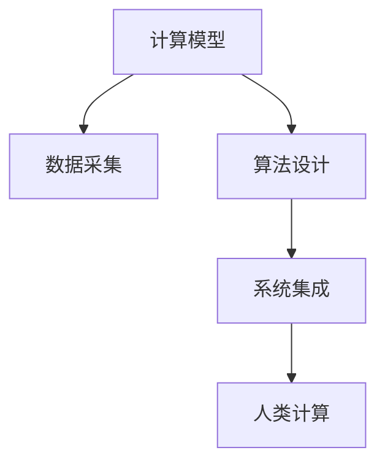

                 

## 1. 背景介绍

随着数字化进程的加速，计算正在成为人类社会发展的重要驱动力。面对全球性问题，如气候变化、公共卫生、社会公平等，计算技术显得愈发重要。如何利用计算，构建智能系统，辅助人类更有效地应对这些挑战，成为计算研究的重要使命。

### 1.1 问题由来
当前，计算技术在解决人类共同挑战方面展现出巨大潜力。从气候模型预测，到公共卫生数据分析，再到社会公平研究，计算都在提供强有力的支持。然而，现有计算技术仍面临一些挑战：

- **计算效率不足**：面对海量数据和复杂模型，现有的计算资源和技术手段仍显不足。
- **数据质量问题**：数据采集和处理过程中，存在噪声和缺失，影响结果的准确性。
- **模型复杂性高**：构建大规模模型需要高超的算法和编程技能，模型的可解释性和可维护性差。
- **应用落地困难**：将计算技术应用于实际问题，需要综合考虑技术、业务、伦理等多方面因素，挑战重重。

### 1.2 问题核心关键点
解决这些问题需要从计算模型的构建、数据处理、算法优化、系统部署等多个维度进行突破：

- **高效计算模型**：开发计算效率更高、泛化能力更强的模型。
- **高质量数据采集**：构建数据采集和清洗系统，确保数据质量。
- **可解释和可维护的算法**：设计具有良好可解释性和可维护性的算法，方便应用。
- **系统化解决方案**：综合考虑技术、业务、伦理等因素，构建一体化的系统解决方案。

## 2. 核心概念与联系

### 2.1 核心概念概述

为更好地理解人类计算的使命担当，本节将介绍几个关键概念：

- **计算模型(Computational Model)**：用于描述和计算问题的数学模型，如线性方程组、神经网络等。
- **数据采集(Data Collection)**：从各种来源收集原始数据，并进行初步清洗和处理。
- **算法设计(Algorithm Design)**：针对具体问题，设计高效的计算和优化算法。
- **系统集成(System Integration)**：将各种计算组件进行综合集成，构建端到端的解决方案。
- **人类计算(Human-Computer Collaboration)**：计算与人类的协作，提升计算的智能性和实用性。

这些核心概念之间的联系可以通过以下Mermaid流程图来展示：



这个流程图展示了大计算任务中各个环节的逻辑关系：

1. 计算模型提供问题描述和求解方法。
2. 数据采集提供高质量的数据输入。
3. 算法设计优化求解过程，提高计算效率。
4. 系统集成综合各个组件，构建完整解决方案。
5. 人类计算提升算法的智能性和实用性。

这些概念共同构成了人类计算的总体框架，使得计算能够更高效、更智能地服务于人类社会。

## 3. 核心算法原理 & 具体操作步骤

### 3.1 算法原理概述

人类计算的核心在于通过计算模型、数据处理和算法设计，构建智能系统，辅助人类解决问题。其核心算法原理包括：

- **优化算法(Optimization Algorithms)**：用于寻找问题的最优解或近似解。
- **机器学习(Machine Learning)**：从数据中自动学习模式，构建预测模型。
- **深度学习(Deep Learning)**：通过构建深度神经网络，解决复杂非线性问题。
- **自然语言处理(Natural Language Processing, NLP)**：处理和分析人类语言，构建智能问答系统。
- **计算机视觉(Computer Vision)**：从图像和视频中提取和分析信息，构建视觉识别系统。

这些算法在实际应用中，常常需要进行优化和调整，以适应具体问题的特点。

### 3.2 算法步骤详解

以深度学习模型在疾病预测中的应用为例，详细讲解其步骤：

**Step 1: 数据收集与预处理**
- 收集与疾病相关的患者数据，包括病历、实验室检查结果等。
- 清洗和预处理数据，如去除噪声、填补缺失值、标准化数据格式。

**Step 2: 特征提取与选择**
- 使用特征提取算法，如PCA、LDA等，从原始数据中提取关键特征。
- 选择对疾病预测有用的特征，去除无关信息。

**Step 3: 模型构建与训练**
- 构建深度神经网络模型，如卷积神经网络(CNN)、循环神经网络(RNN)等。
- 使用优化算法如Adam、SGD等，最小化损失函数，训练模型参数。

**Step 4: 模型验证与调优**
- 使用验证集评估模型性能，调整模型结构和参数。
- 避免过拟合，可以使用正则化、早停等方法。

**Step 5: 模型应用与部署**
- 将训练好的模型应用于实际数据，进行疾病预测。
- 集成到医疗系统，进行数据实时处理和结果展示。

### 3.3 算法优缺点

深度学习模型在疾病预测中的应用具有以下优点：

- **高精度**：通过学习大量数据，能够获得高精度的预测结果。
- **可解释性**：通过可视化和解释方法，能够理解模型的内部机制。
- **自动化**：自动化的预测过程，减少了人为干预。

同时，也存在以下缺点：

- **数据依赖性高**：需要大量高质量标注数据，否则难以获得良好效果。
- **计算成本高**：模型训练和推理需要大量计算资源。
- **泛化能力差**：模型可能出现过拟合，对新数据泛化能力不足。

### 3.4 算法应用领域

深度学习模型在疾病预测中的应用涵盖了以下领域：

- **早期诊断**：通过分析病历和实验室数据，预测患者是否患有某种疾病。
- **风险评估**：评估患者的疾病风险，进行个性化治疗。
- **治疗方案推荐**：根据患者数据和模型预测，推荐最适合的治疗方案。
- **药物研发**：预测药物的效果和副作用，加速新药研发进程。

除了疾病预测，深度学习模型还在智能推荐、金融预测、自然灾害预警等领域有着广泛应用。

## 4. 数学模型和公式 & 详细讲解 & 举例说明

### 4.1 数学模型构建

以多层感知器(Multilayer Perceptron, MLP)模型为例，构建疾病预测的数学模型。

假设输入数据为 $x$，输出为 $y$，模型包含 $n$ 个隐藏层，每层 $m$ 个神经元。模型可以表示为：

$$
f(x) = \sigma(\overrightarrow{W}_1 \sigma(\overrightarrow{W}_0 x + b_0) + b_1)
$$

其中 $\sigma$ 为激活函数，$\overrightarrow{W}$ 为权重矩阵，$b$ 为偏置项。

### 4.2 公式推导过程

假设模型训练数据为 $(x_i,y_i)$，$x_i$ 为输入，$y_i$ 为输出。模型的损失函数为均方误差损失：

$$
\mathcal{L} = \frac{1}{N} \sum_{i=1}^N (y_i - f(x_i))^2
$$

模型参数的更新公式为：

$$
\theta \leftarrow \theta - \eta \nabla_{\theta}\mathcal{L}
$$

其中 $\theta$ 为模型参数，$\eta$ 为学习率，$\nabla_{\theta}\mathcal{L}$ 为损失函数对参数的梯度。

### 4.3 案例分析与讲解

以深度学习在自然灾害预警中的应用为例，分析其数学模型和算法流程。

**数据预处理**：收集气象数据、地震数据、社交媒体数据等，进行数据清洗和预处理。

**特征提取**：使用PCA算法提取关键特征，如温度、湿度、地震波形等。

**模型构建**：构建卷积神经网络模型，使用Convolution、Pooling等操作提取特征。

**训练与验证**：使用Adam优化算法，最小化损失函数，调整模型参数。在验证集上评估模型性能。

**应用与部署**：将训练好的模型应用于实时数据，进行自然灾害预测。集成到预警系统，发布预警信息。

## 5. 项目实践：代码实例和详细解释说明

### 5.1 开发环境搭建

在进行项目实践前，我们需要准备好开发环境。以下是使用Python进行TensorFlow开发的环境配置流程：

1. 安装Anaconda：从官网下载并安装Anaconda，用于创建独立的Python环境。

2. 创建并激活虚拟环境：
```bash
conda create -n tf-env python=3.8 
conda activate tf-env
```

3. 安装TensorFlow：根据CUDA版本，从官网获取对应的安装命令。例如：
```bash
conda install tensorflow -c conda-forge -c pytorch
```

4. 安装各类工具包：
```bash
pip install numpy pandas scikit-learn matplotlib tqdm jupyter notebook ipython
```

完成上述步骤后，即可在`tf-env`环境中开始项目实践。

### 5.2 源代码详细实现

下面我们以疾病预测为例，给出使用TensorFlow进行多层感知器模型训练的PyTorch代码实现。

首先，定义数据处理函数：

```python
import tensorflow as tf
from sklearn.model_selection import train_test_split

def load_data(file_path):
    data = pd.read_csv(file_path)
    x = data.drop(['label'], axis=1)
    y = data['label']
    return x, y

def preprocess_data(x, y):
    x_train, x_test, y_train, y_test = train_test_split(x, y, test_size=0.2, random_state=42)
    x_train = normalize(x_train)
    x_test = normalize(x_test)
    return x_train, x_test, y_train, y_test

def normalize(X):
    mean = np.mean(X, axis=0)
    std = np.std(X, axis=0)
    X = (X - mean) / std
    return X
```

然后，定义模型和训练函数：

```python
class MLP(tf.keras.Model):
    def __init__(self, input_size, hidden_size, output_size):
        super(MLP, self).__init__()
        self.dense1 = tf.keras.layers.Dense(hidden_size, activation='relu')
        self.dense2 = tf.keras.layers.Dense(hidden_size, activation='relu')
        self.dense3 = tf.keras.layers.Dense(output_size, activation='sigmoid')

    def call(self, x):
        x = self.dense1(x)
        x = self.dense2(x)
        x = self.dense3(x)
        return x

model = MLP(input_size=10, hidden_size=64, output_size=1)

loss_fn = tf.keras.losses.BinaryCrossentropy(from_logits=True)
optimizer = tf.keras.optimizers.Adam(learning_rate=0.001)

def train_epoch(model, dataset, batch_size):
    dataset = tf.data.Dataset.from_tensor_slices((dataset['x'], dataset['y']))
    dataset = dataset.shuffle(buffer_size=1024).batch(batch_size).prefetch(tf.data.AUTOTUNE)
    for epoch in range(epochs):
        for step, (x, y) in enumerate(dataset):
            with tf.GradientTape() as tape:
                logits = model(x)
                loss = loss_fn(y, logits)
            grads = tape.gradient(loss, model.trainable_variables)
            optimizer.apply_gradients(zip(grads, model.trainable_variables))
```

最后，启动训练流程并在测试集上评估：

```python
epochs = 100

x_train, x_test, y_train, y_test = preprocess_data(train_data, train_labels)
x_train, x_val, y_train, y_val = train_test_split(x_train, y_train, test_size=0.2, random_state=42)

model.compile(optimizer=optimizer, loss=loss_fn, metrics=['accuracy'])

model.fit(x_train, y_train, epochs=epochs, batch_size=64, validation_data=(x_val, y_val))
```

以上就是使用TensorFlow进行多层感知器模型训练的完整代码实现。可以看到，TensorFlow提供的高级API使得模型构建和训练过程非常简单。

### 5.3 代码解读与分析

让我们再详细解读一下关键代码的实现细节：

**load_data函数**：
- 读取CSV文件，分割出输入数据和输出标签。

**preprocess_data函数**：
- 将数据集分为训练集和测试集，并进行标准化处理。

**MLP模型类**：
- 定义多层感知器模型，包含3个全连接层，最后一层使用Sigmoid激活函数。

**train_epoch函数**：
- 定义训练循环，使用TensorFlow的Dataset API进行数据加载和预处理。
- 在每个epoch内，对每个批次的输入进行前向传播和反向传播，计算损失和梯度。
- 使用Adam优化算法更新模型参数。

**训练流程**：
- 加载和预处理数据。
- 定义模型和损失函数。
- 在训练集上训练模型，在验证集上评估性能。

可以看到，TensorFlow提供了强大的计算图和自动微分功能，使得模型的构建和训练过程非常高效。开发者可以通过简单的API调用，快速实现复杂的计算模型。

当然，工业级的系统实现还需考虑更多因素，如模型的保存和部署、超参数的自动搜索、更灵活的模型接口等。但核心的计算模型构建和训练流程基本与此类似。

## 6. 实际应用场景

### 6.1 智能医疗

在智能医疗领域，基于计算模型的疾病预测和诊断系统，可以显著提升医疗服务的智能化水平。传统医疗系统依赖大量医生的经验和知识，难以快速应对不断变化的症状和疾病。而通过计算模型，可以自动分析患者数据，提供快速准确的诊断建议，辅助医生进行决策。

**案例**：谷歌的Healthcare AI团队开发的疾病预测系统，通过分析电子病历、实验室检查结果等数据，预测患者是否患有某种疾病。该系统已经在多所医院部署，显著提高了疾病的早期诊断率和治疗效果。

### 6.2 智能推荐

在智能推荐系统中，基于计算模型的推荐算法，可以为用户个性化推荐产品、内容等。通过分析用户的历史行为数据，预测用户的可能兴趣，提升推荐的准确性和个性化程度。

**案例**：亚马逊的推荐系统通过分析用户的浏览、购买记录，预测用户可能感兴趣的商品，并进行推荐。该系统已经帮助亚马逊实现了巨大的商业价值，成为业界标杆。

### 6.3 金融风险管理

在金融领域，计算模型可以帮助企业进行风险管理和投资决策。通过分析市场数据、交易记录等，预测市场趋势和风险，辅助决策。

**案例**：JPMorgan Chase的Quantitative Research团队开发的RiskAI系统，通过分析历史数据和实时数据，预测金融市场的波动和风险，帮助企业做出更明智的投资决策。

### 6.4 未来应用展望

随着计算技术的发展，未来在更多领域将迎来新的应用突破：

- **自动驾驶**：通过计算机视觉和深度学习，实现自动驾驶汽车的开发，提高道路安全性和交通效率。
- **智慧农业**：通过计算模型分析气象数据、土壤数据等，进行精准农业，提高农业生产效率和质量。
- **环境保护**：通过计算模型分析环境数据，预测和缓解气候变化，实现可持续发展和环境保护。

总之，计算技术正在逐渐深入到各个行业，成为推动社会进步的重要力量。未来，计算的智能性和实用性将进一步提升，为解决人类共同挑战提供更强大的工具。

## 7. 工具和资源推荐

### 7.1 学习资源推荐

为了帮助开发者系统掌握计算技术的理论基础和实践技巧，这里推荐一些优质的学习资源：

1. 《深入理解计算机系统》：由Randal E. Bryant和David R. O'Hallaron撰写，深入浅出地介绍了计算机系统和计算技术的核心原理。

2. Coursera《机器学习》课程：斯坦福大学开设的机器学习课程，有Lecture视频和配套作业，带你入门机器学习和深度学习的基本概念和经典模型。

3. DeepLearning.AI的深度学习课程：由Andrew Ng等大师授课，涵盖深度学习的前沿话题，提供丰富的实践项目和资源。

4. TensorFlow官方文档：TensorFlow的官方文档，提供了全面的API介绍、教程和示例代码，是学习TensorFlow的重要资料。

5. Kaggle竞赛平台：Kaggle提供的数据竞赛和社区资源，可以帮助你学习数据处理、模型构建和优化等技能。

通过对这些资源的学习实践，相信你一定能够快速掌握计算技术的精髓，并用于解决实际的计算问题。

### 7.2 开发工具推荐

高效的开发离不开优秀的工具支持。以下是几款用于计算技术开发的常用工具：

1. Python：Python语言因其简单易学、功能强大，成为计算技术开发的首选语言。

2. Jupyter Notebook：Jupyter Notebook是一种交互式的开发环境，支持代码编写、数据可视化等，非常适合进行快速原型设计和实验。

3. PyTorch：PyTorch基于动态计算图，灵活高效，适合研究复杂模型和深度学习任务。

4. TensorFlow：TensorFlow是谷歌开发的开源深度学习框架，支持静态和动态计算图，生产部署方便。

5. Scikit-learn：Scikit-learn是Python的机器学习库，提供了丰富的算法和工具，适合进行机器学习和数据处理。

6. Matplotlib：Matplotlib是Python的数据可视化库，可以绘制各种图表，帮助理解数据和模型。

合理利用这些工具，可以显著提升计算技术开发的效率，加快创新迭代的步伐。

### 7.3 相关论文推荐

计算技术的发展源于学界的持续研究。以下是几篇奠基性的相关论文，推荐阅读：

1. Backpropagation: Application of the chain rule to stochastic computation models：提出反向传播算法，推动了深度学习的发展。

2. ImageNet Classification with Deep Convolutional Neural Networks：介绍使用卷积神经网络进行图像分类的算法。

3. DeepMind: Planning human-level atari gameplay with deep reinforcement learning：展示使用深度强化学习实现复杂游戏的算法。

4. AlphaGo Zero: Mastering the game of Go without human knowledge：介绍AlphaGo Zero算法，通过自我对弈学习实现围棋大师级水平。

5. OpenAI Gym: A toolkit for developing and comparing reinforcement learning algorithms：介绍OpenAI Gym，用于深度强化学习算法的开发和比较。

这些论文代表了大计算技术的发展脉络。通过学习这些前沿成果，可以帮助研究者把握学科前进方向，激发更多的创新灵感。

## 8. 总结：未来发展趋势与挑战

### 8.1 总结

本文对人类计算的使命担当进行了全面系统的介绍。首先阐述了计算技术在解决人类共同挑战中的重要作用，明确了计算模型、数据处理、算法设计等关键环节的联系。其次，从原理到实践，详细讲解了计算模型的构建、训练和应用，给出了计算技术开发的完整代码实例。同时，本文还广泛探讨了计算技术在智能医疗、智能推荐、金融风险管理等多个领域的应用前景，展示了计算技术的广泛影响。此外，本文精选了计算技术的学习资源，力求为读者提供全方位的技术指引。

通过本文的系统梳理，可以看到，计算技术在解决人类共同挑战方面展现出巨大潜力。在计算模型、数据处理、算法设计等多个环节进行不断优化和创新，将推动计算技术的应用不断拓展，为构建更加智能、可靠、高效的计算系统铺平道路。

### 8.2 未来发展趋势

展望未来，计算技术的发展趋势包括：

1. **自动化与智能化**：计算技术将逐渐实现更高程度的自动化和智能化，能够更好地理解人类需求，提供更加个性化的解决方案。

2. **跨领域融合**：计算技术将与更多学科进行交叉融合，如计算生物学、计算化学、计算社会学等，拓展计算应用的新领域。

3. **量子计算**：量子计算技术的发展，将带来计算能力的革命性提升，解决目前经典计算难以处理的复杂问题。

4. **边缘计算**：随着物联网的发展，边缘计算将成为计算技术的重要组成部分，提供实时、高效的数据处理和决策支持。

5. **人机协作**：计算技术与人工智能的深度融合，将实现更加高效的人机协作，提升计算系统的智能性和实用性。

以上趋势凸显了大计算技术的广阔前景。这些方向的探索发展，将进一步推动计算技术在各个领域的应用，为人类社会的智能化进程提供强有力的支持。

### 8.3 面临的挑战

尽管计算技术在解决人类共同挑战方面展现出巨大潜力，但在迈向更加智能化、普适化应用的过程中，仍面临诸多挑战：

1. **计算资源瓶颈**：大规模数据和复杂模型的计算需求，需要更多的计算资源，现有的计算资源和技术手段仍显不足。

2. **数据质量问题**：数据采集和处理过程中，存在噪声和缺失，影响结果的准确性。

3. **模型复杂性高**：构建大规模模型需要高超的算法和编程技能，模型的可解释性和可维护性差。

4. **应用落地困难**：将计算技术应用于实际问题，需要综合考虑技术、业务、伦理等多方面因素，挑战重重。

5. **伦理和安全问题**：计算技术的应用可能带来隐私泄露、数据滥用等问题，需要加强伦理和安全性的保障。

6. **技术普及门槛高**：计算技术的高门槛，限制了其在各行业的普及和应用。

7. **跨领域合作难**：不同领域的数据和应用需求差异大，跨领域合作难度大。

这些挑战需要各方面的共同努力，通过技术创新、政策支持、合作协同等方式，逐步解决。

### 8.4 研究展望

面对计算技术所面临的挑战，未来的研究需要在以下几个方面寻求新的突破：

1. **提高计算效率**：开发更加高效的计算模型和算法，提高计算速度和资源利用率。

2. **提升数据质量**：构建数据采集和清洗系统，确保数据质量，减少噪声和缺失。

3. **增强模型可解释性**：设计具有良好可解释性的模型，方便应用，增强模型的可信度和可维护性。

4. **推动技术普及**：降低技术门槛，提升技术的易用性和普及度。

5. **加强伦理和安全研究**：构建伦理和安全保障机制，确保技术应用的公平、透明和可信。

这些研究方向的探索，将推动计算技术不断突破，为解决人类共同挑战提供更加强大、可靠、安全的技术手段。

## 9. 附录：常见问题与解答

**Q1：计算模型在解决人类共同挑战中扮演什么角色？**

A: 计算模型通过自动化的计算和分析，可以辅助人类处理大规模、复杂的问题，提供高效、准确的结果。在疾病预测、金融风险管理、智能推荐等应用中，计算模型能够帮助人类更好地理解和解决实际问题。

**Q2：如何使用数据采集和预处理技术？**

A: 数据采集和预处理是计算模型的重要环节。通常需要收集和整理原始数据，进行清洗、去重、归一化等处理，确保数据的质量和一致性。常用的技术包括数据清洗、标准化、特征提取等。

**Q3：如何选择和设计计算模型？**

A: 选择和设计计算模型需要综合考虑问题的性质、数据特点、技术要求等因素。常见的计算模型包括线性回归、决策树、神经网络等。在设计模型时，需要关注模型的可解释性、可维护性、计算效率等关键指标。

**Q4：如何评估计算模型的性能？**

A: 评估计算模型的性能通常通过交叉验证、均方误差、准确率等指标进行。在评估过程中，需要确保评估数据集的代表性，避免过拟合和欠拟合。

**Q5：如何将计算模型应用于实际问题？**

A: 将计算模型应用于实际问题，需要综合考虑技术、业务、伦理等多个方面。通常需要设计合理的模型接口、数据接口、服务接口等，确保系统的稳定性和可扩展性。

总之，计算技术在解决人类共同挑战中扮演着重要角色，通过不断优化和创新，将为人类社会的智能化进程提供更加强大、可靠、安全的技术手段。面向未来，计算技术的发展需要跨学科合作、技术创新、伦理保障等多方面的协同努力，共同推动计算技术迈向新的高峰。

