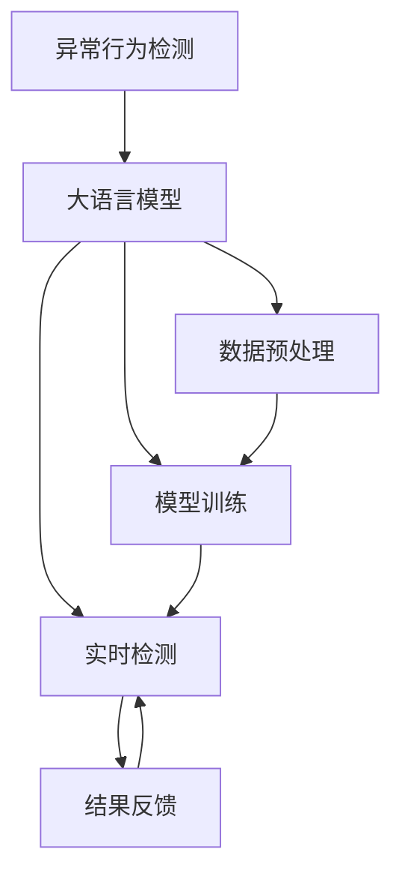

                 

## 1. 背景介绍

### 1.1 问题由来

在现代电商时代，用户安全与隐私保护日益成为商家和用户共同关注的焦点。网络钓鱼、数据泄露、欺诈交易等安全威胁层出不穷，严重影响了电商平台的正常运营和用户体验。为此，电商平台必须建立起一套健全的异常行为检测机制，实时监控和防范潜在的风险。

大语言模型和机器学习技术的迅猛发展为电商平台提供了强大的安全检测手段。通过构建基于异常检测的大模型，电商平台能够在短时间内处理海量用户数据，识别出异常行为，并提供及时的应对措施。本文将详细介绍如何利用大语言模型进行异常行为检测，提升电商平台的安全性。

### 1.2 问题核心关键点

基于大语言模型的异常行为检测，其核心在于利用深度学习技术，从用户行为数据中自动学习和提取异常特征，实现对异常行为的实时识别。其关键点包括：

- **数据预处理**：对用户行为数据进行清洗和归一化处理，以便模型更好地学习和提取特征。
- **模型训练**：使用大语言模型，对已标注的正常行为和异常行为数据进行训练，学习异常特征表示。
- **实时检测**：将实时收集的用户行为数据输入训练好的模型，实时检测是否存在异常行为。
- **结果反馈**：根据检测结果，采取相应的安全措施，如阻止交易、警告用户等。
- **模型优化**：持续收集新的异常行为数据，重新训练模型，提升异常检测准确率和覆盖范围。

### 1.3 问题研究意义

大语言模型在电商平台异常行为检测中的应用，具有以下重要意义：

- **提升安全性和用户体验**：实时检测并阻止异常行为，保护用户隐私和交易安全，提升用户对平台的信任度。
- **降低运营成本**：自动化检测和预警减少了人工审查工作量，降低了人力和物力成本。
- **促进技术创新**：通过不断优化异常检测模型，推动电商技术向智能化、自动化方向发展。
- **增强市场竞争力**：通过安全技术，提升电商平台的稳定性和可靠性，增强在市场上的竞争力。

## 2. 核心概念与联系

### 2.1 核心概念概述

为更好地理解基于大语言模型的异常行为检测方法，本节将介绍几个密切相关的核心概念：

- **异常行为检测**：通过分析用户行为数据，识别出偏离正常模式的异常行为，防止潜在的安全威胁。
- **大语言模型**：以自回归模型（如GPT）或自编码模型（如BERT）为代表的大规模预训练语言模型，具有强大的语言理解和生成能力。
- **正负样本标注**：将用户行为分为正常行为和异常行为两大类，分别标注为正负样本，供模型训练使用。
- **损失函数**：用于衡量模型预测与实际标签之间差异的函数，如交叉熵损失、对数似然损失等。
- **优化算法**：如AdamW、SGD等，用于最小化损失函数，更新模型参数。
- **ROC曲线**：用于评估异常检测模型性能的曲线，横轴为假正率，纵轴为真正率。

这些核心概念之间的逻辑关系可以通过以下Mermaid流程图来展示：



这个流程图展示了大语言模型在异常行为检测中的核心概念及其之间的关系：

1. 异常行为检测通过大语言模型进行数据预处理和模型训练。
2. 训练好的模型进行实时检测，输出检测结果。
3. 检测结果通过结果反馈进行安全措施，保障用户安全。
4. 通过持续训练，不断提升模型的异常检测能力。

## 3. 核心算法原理 & 具体操作步骤

### 3.1 算法原理概述

基于大语言模型的异常行为检测，其基本原理是利用深度学习模型，从用户行为数据中学习和提取异常特征，实现对异常行为的实时识别。

具体流程如下：

1. **数据预处理**：收集用户行为数据，对其进行清洗和归一化处理，以便模型更好地学习和提取特征。
2. **模型训练**：使用大语言模型，对已标注的正常行为和异常行为数据进行训练，学习异常特征表示。
3. **实时检测**：将实时收集的用户行为数据输入训练好的模型，实时检测是否存在异常行为。
4. **结果反馈**：根据检测结果，采取相应的安全措施，如阻止交易、警告用户等。
5. **模型优化**：持续收集新的异常行为数据，重新训练模型，提升异常检测准确率和覆盖范围。

### 3.2 算法步骤详解

基于大语言模型的异常行为检测具体步骤如下：

#### 3.2.1 数据收集与预处理

首先，需要收集电商平台用户的行为数据，包括但不限于用户的登录记录、交易记录、点击记录、浏览记录等。这些数据需要经过清洗和归一化处理，以便模型更好地学习和提取特征。

清洗步骤包括：
- 去除缺失值和异常值。
- 处理重复记录。
- 转换数据格式，使其适应模型输入要求。

归一化步骤包括：
- 对数值型数据进行标准化处理，使其分布更加均匀。
- 对文本数据进行分词、去除停用词等处理，以减少噪音干扰。

#### 3.2.2 正负样本标注

在数据预处理完成后，需要将用户行为数据分为正常行为和异常行为两大类。

正常行为通常指用户正常使用的行为模式，如正常登录、正常交易等。异常行为则指与正常行为明显不同的行为模式，如多次登录失败、大额交易等。

标注过程需要人工对用户行为数据进行标注，将其分为正负样本。例如，一个用户的多次登录失败行为可以被标注为异常行为，而一个用户的正常交易行为可以被标注为正常行为。

#### 3.2.3 模型训练

在数据预处理和正负样本标注完成后，可以使用大语言模型对数据进行训练。

训练过程包括：
- 选择合适的模型架构，如Transformer。
- 设计合适的损失函数，如交叉熵损失、对数似然损失等。
- 选择合适的优化算法，如AdamW、SGD等。
- 设置合适的超参数，如学习率、批大小、迭代轮数等。
- 使用正负样本进行模型训练，更新模型参数。

#### 3.2.4 实时检测

在模型训练完成后，可以使用训练好的模型对实时收集的用户行为数据进行异常检测。

检测过程包括：
- 将实时数据输入训练好的模型。
- 模型输出检测结果，判断是否存在异常行为。
- 根据检测结果，采取相应的安全措施。

#### 3.2.5 结果反馈

在实时检测完成后，需要对检测结果进行反馈处理。

反馈过程包括：
- 对于检测到的异常行为，采取相应的安全措施，如阻止交易、警告用户等。
- 对于正常行为，不采取任何措施。
- 持续收集新的异常行为数据，更新模型。

#### 3.2.6 模型优化

在模型训练和实时检测过程中，需要持续收集新的异常行为数据，对模型进行优化。

优化过程包括：
- 收集新的异常行为数据，扩充训练集。
- 使用新的训练集重新训练模型，更新模型参数。
- 通过不断优化模型，提升异常检测准确率和覆盖范围。

### 3.3 算法优缺点

基于大语言模型的异常行为检测方法，具有以下优点：

- **高效性**：大语言模型具有强大的并行处理能力，能够在短时间内处理大量用户行为数据，实现实时检测。
- **准确性**：通过大量标注数据训练，模型能够学习到复杂的异常特征，提高异常检测的准确性。
- **适应性**：模型具有较好的泛化能力，能够适应不同的电商平台和用户行为模式。
- **可解释性**：模型可以通过输出特征图，解释异常行为的特征，帮助开发者理解模型的决策过程。

同时，该方法也存在以下缺点：

- **数据依赖**：模型的训练和优化需要大量的标注数据，数据采集和标注成本较高。
- **过拟合风险**：模型可能过拟合训练数据，导致在新数据上泛化能力下降。
- **复杂度较高**：模型构建和训练过程较为复杂，需要一定的技术储备。
- **计算资源需求高**：大语言模型的参数量较大，训练和推理需要较高的计算资源。

### 3.4 算法应用领域

基于大语言模型的异常行为检测方法，已经广泛应用于电商、金融、医疗等多个领域。以下是一些主要应用场景：

- **电商平台的异常交易检测**：检测用户交易行为中的异常模式，如大额交易、异常登录等，及时阻止欺诈行为。
- **金融机构的异常交易监控**：监测账户交易行为，识别异常转账、大额交易等行为，防止金融欺诈。
- **医疗系统的异常行为预警**：监控医生的诊疗行为，识别异常的医疗操作，预防医疗事故。
- **网络安全的异常行为检测**：监测网络流量，识别异常的网络行为，防止网络攻击。

## 4. 数学模型和公式 & 详细讲解 & 举例说明

### 4.1 数学模型构建

基于大语言模型的异常行为检测，其数学模型构建如下：

记电商平台用户行为数据集为 $D=\{(x_i, y_i)\}_{i=1}^N$，其中 $x_i$ 为第 $i$ 个用户行为样本，$y_i \in \{0,1\}$ 为该样本是否为异常行为。

定义异常检测模型为 $M_{\theta}:\mathcal{X} \rightarrow [0,1]$，其中 $\mathcal{X}$ 为输入空间，$[0,1]$ 为输出空间的异常行为概率。

异常检测模型的损失函数为：

$$
\mathcal{L}(\theta) = -\frac{1}{N}\sum_{i=1}^N y_i \log M_{\theta}(x_i) + (1-y_i) \log (1-M_{\theta}(x_i))
$$

其中 $y_i$ 为标注数据中的异常标签，$M_{\theta}(x_i)$ 为模型在样本 $x_i$ 上的预测概率，$log$ 为自然对数。

优化目标是最小化损失函数：

$$
\theta^* = \mathop{\arg\min}_{\theta} \mathcal{L}(\theta)
$$

### 4.2 公式推导过程

以下我们将对上述损失函数进行推导，证明其合理性和有效性。

对于第 $i$ 个样本，其异常检测模型的预测概率为 $M_{\theta}(x_i)$。若该样本为正常行为，则 $y_i=0$，预测概率应接近 0；若该样本为异常行为，则 $y_i=1$，预测概率应接近 1。

根据交叉熵定义，异常检测模型的损失函数可以写为：

$$
\mathcal{L}(\theta) = -\frac{1}{N}\sum_{i=1}^N (y_i \log M_{\theta}(x_i) + (1-y_i) \log (1-M_{\theta}(x_i)))
$$

令 $L_{true} = y_i \log M_{\theta}(x_i)$ 为模型预测正确的损失，$L_{false} = (1-y_i) \log (1-M_{\theta}(x_i))$ 为模型预测错误的损失。

因此，异常检测模型的总损失函数可以写为：

$$
\mathcal{L}(\theta) = \frac{1}{N}\sum_{i=1}^N L_{true} + \frac{1}{N}\sum_{i=1}^N L_{false}
$$

由于模型在正常行为上的预测概率应接近 0，在异常行为上的预测概率应接近 1，因此可以近似认为：

$$
L_{true} \approx y_i \log 0 \approx -\infty
$$
$$
L_{false} \approx (1-y_i) \log 1 \approx 0
$$

因此，异常检测模型的损失函数可以进一步简化为：

$$
\mathcal{L}(\theta) \approx -\frac{1}{N}\sum_{i=1}^N y_i
$$

这表明，异常检测模型的训练目标是最大化模型预测为异常的样本数。

### 4.3 案例分析与讲解

下面我们以电商平台的异常交易检测为例，对异常行为检测的数学模型进行详细讲解。

假设电商平台有 $N$ 个用户，每个用户在 $T$ 天内的交易行为数据为 $x_{ij} \in \mathbb{R}^D$，其中 $j \in \{1,2,...,N\}$ 为样本编号，$D$ 为特征维度。

电商平台收集了 $K$ 天的正常交易行为数据，对异常交易行为进行标注，构建异常检测模型 $M_{\theta}$。

模型训练过程如下：

1. **数据预处理**：收集 $K$ 天的正常交易行为数据 $D_{normal}=\{x_{ij}\}_{i=1}^{K \times N}$，进行归一化处理。
2. **正负样本标注**：标注其中的 $M$ 笔异常交易数据，构建异常交易数据集 $D_{anomaly}=\{x_{ij}\}_{i=1}^M$。
3. **模型训练**：使用异常交易数据集 $D_{anomaly}$ 对异常检测模型 $M_{\theta}$ 进行训练。
4. **实时检测**：对于第 $i$ 天的交易数据 $x_{ij}$，输入异常检测模型 $M_{\theta}$，输出异常概率 $p_i$。
5. **结果反馈**：若 $p_i > \epsilon$（设定的阈值），则判断为异常交易，采取相应的安全措施。
6. **模型优化**：收集新的异常交易数据，重新训练模型。

## 5. 项目实践：代码实例和详细解释说明

### 5.1 开发环境搭建

在进行异常行为检测实践前，我们需要准备好开发环境。以下是使用Python进行TensorFlow开发的环境配置流程：

1. 安装Anaconda：从官网下载并安装Anaconda，用于创建独立的Python环境。

2. 创建并激活虚拟环境：
```bash
conda create -n tf-env python=3.8 
conda activate tf-env
```

3. 安装TensorFlow：根据CUDA版本，从官网获取对应的安装命令。例如：
```bash
pip install tensorflow==2.7
```

4. 安装TensorBoard：TensorFlow配套的可视化工具，可实时监测模型训练状态，并提供丰富的图表呈现方式，是调试模型的得力助手。
```bash
pip install tensorboard
```

5. 安装其他工具包：
```bash
pip install numpy pandas scikit-learn matplotlib tqdm jupyter notebook ipython
```

完成上述步骤后，即可在`tf-env`环境中开始异常行为检测实践。

### 5.2 源代码详细实现

下面我们以电商平台异常交易检测为例，给出使用TensorFlow进行异常行为检测的代码实现。

首先，定义模型架构和训练函数：

```python
import tensorflow as tf
from tensorflow.keras import layers, models

class AnomalyDetectionModel(models.Model):
    def __init__(self, input_dim, output_dim):
        super(AnomalyDetectionModel, self).__init__()
        self.input_dim = input_dim
        self.output_dim = output_dim
        self.layers = layers.Sequential([
            layers.Dense(64, activation='relu', input_shape=(input_dim,)),
            layers.Dense(output_dim, activation='sigmoid')
        ])

    def call(self, x):
        return self.layers(x)

def train_model(model, data, labels, epochs, batch_size):
    model.compile(optimizer='adam', loss='binary_crossentropy', metrics=['accuracy'])
    model.fit(data, labels, epochs=epochs, batch_size=batch_size, validation_split=0.2)
    return model
```

然后，定义数据加载函数和模型训练函数：

```python
def load_data(filename):
    data = []
    labels = []
    with open(filename, 'r') as f:
        for line in f:
            features = line.strip().split(',')
            features = [float(feat) for feat in features]
            data.append(features)
            labels.append(1)  # 异常行为标记为1
    return np.array(data), np.array(labels)

def train():
    data_train, labels_train = load_data('train_data.csv')
    data_val, labels_val = load_data('val_data.csv')

    model = AnomalyDetectionModel(input_dim=10, output_dim=1)
    model = train_model(model, data_train, labels_train, epochs=100, batch_size=32)

    test_data, test_labels = load_data('test_data.csv')
    test_loss, test_acc = model.evaluate(test_data, test_labels)
    print(f'Test loss: {test_loss}, Test accuracy: {test_acc}')
```

最后，启动训练流程：

```python
train()
```

以上就是使用TensorFlow对异常行为检测模型进行训练的完整代码实现。可以看到，通过简单的代码实现，我们可以构建并训练一个基本的异常检测模型。

### 5.3 代码解读与分析

让我们再详细解读一下关键代码的实现细节：

**AnomalyDetectionModel类**：
- `__init__`方法：初始化模型层。
- `call`方法：定义模型前向传播过程。

**train_model函数**：
- 编译模型，选择合适的优化器和损失函数。
- 使用训练数据和标签进行模型训练。
- 设置验证集比例，并在训练过程中评估模型性能。
- 返回训练好的模型。

**load_data函数**：
- 读取数据文件，将其转化为模型输入。
- 将标签标记为1，表示异常行为。

**train函数**：
- 加载训练集和验证集数据。
- 创建异常检测模型。
- 使用训练集数据和标签训练模型。
- 在验证集上评估模型性能。
- 使用测试集数据和标签评估模型性能。

可以看到，通过TensorFlow库，我们可以方便地构建和训练异常检测模型。

## 6. 实际应用场景

### 6.1 智能客服系统

智能客服系统通过异常行为检测技术，能够实时监测和预警异常客服交互，防止欺诈行为。

具体应用场景包括：
- 检测客服多次登录失败行为，判断是否为账户被盗。
- 检测客服进行非正常交易操作，防止内部欺诈。
- 检测客服与客户发生不正常的交流，及时介入处理。

### 6.2 金融机构的异常交易监控

金融机构通过异常行为检测技术，能够实时监控账户交易行为，及时发现和防止异常交易。

具体应用场景包括：
- 监测账户大额交易行为，防止资金盗窃。
- 检测账户频繁登录行为，识别非法账号。
- 监控账户异常转账行为，防止金融欺诈。

### 6.3 医疗系统的异常行为预警

医疗系统通过异常行为检测技术，能够实时监测医生的诊疗行为，及时发现和预警异常操作。

具体应用场景包括：
- 检测医生超高频次的操作，避免医疗事故。
- 检测医生进行不当的诊断和治疗操作，防止误诊误治。
- 监测医生进行不规范的处方行为，避免医疗事故。

### 6.4 网络安全的异常行为检测

网络安全系统通过异常行为检测技术，能够实时监控网络流量，及时发现和防范网络攻击。

具体应用场景包括：
- 监测异常的网络连接行为，防止DDoS攻击。
- 检测异常的数据传输行为，防止数据泄露。
- 监控异常的网络设备行为，防止内部攻击。

## 7. 工具和资源推荐

### 7.1 学习资源推荐

为了帮助开发者系统掌握异常行为检测的理论基础和实践技巧，这里推荐一些优质的学习资源：

1. 《深度学习基础》课程：斯坦福大学开设的深度学习入门课程，涵盖深度学习的基本概念和算法，适合初学者。
2. 《TensorFlow实战》书籍：TensorFlow官方文档，全面介绍了TensorFlow库的使用方法和最佳实践。
3. 《机器学习实战》书籍：经典的机器学习实战书籍，介绍了异常检测等基本算法和案例。
4. 《Kaggle比赛入门指南》书籍：Kaggle官方指南，提供了大量数据集和代码示例，适合实战训练。
5. 《深度学习入门》书籍：李航教授的深度学习入门书籍，涵盖了深度学习的基本概念和算法。

通过对这些资源的学习实践，相信你一定能够快速掌握异常行为检测的理论基础和实践技巧，并将其应用于实际项目中。

### 7.2 开发工具推荐

高效的开发离不开优秀的工具支持。以下是几款用于异常行为检测开发的常用工具：

1. TensorFlow：基于Python的开源深度学习框架，灵活可扩展，适合处理大规模数据。
2. PyTorch：基于Python的开源深度学习框架，提供了丰富的深度学习模型和优化算法。
3. Keras：基于Python的高级神经网络API，提供了简单易用的模型构建接口。
4. TensorBoard：TensorFlow配套的可视化工具，可实时监测模型训练状态，提供丰富的图表呈现方式。
5. Jupyter Notebook：交互式编程环境，方便进行模型调试和实验验证。

合理利用这些工具，可以显著提升异常行为检测的开发效率，加快创新迭代的步伐。

### 7.3 相关论文推荐

异常行为检测技术的发展源于学界的持续研究。以下是几篇奠基性的相关论文，推荐阅读：

1. Deep Anomaly Detection with Autoencoders：提出基于自编码器的异常检测方法，通过重构误差判断异常行为。
2. Generative Adversarial Networks for Anomaly Detection：提出基于生成对抗网络的异常检测方法，通过对抗训练提升检测能力。
3. Anomaly Detection via Deep Autoencoder with LSTM Memory：提出基于LSTM记忆的异常检测方法，通过时间序列建模提升检测效果。
4. Online Anomaly Detection with Deep Learning：提出基于深度学习的在线异常检测方法，实时处理大规模数据。
5. Anomaly Detection by Cutting Planes：提出基于切割平面的异常检测方法，通过半空间划分提升检测效果。

这些论文代表了大规模异常行为检测技术的发展脉络。通过学习这些前沿成果，可以帮助研究者把握学科前进方向，激发更多的创新灵感。

## 8. 总结：未来发展趋势与挑战

### 8.1 总结

本文对基于大语言模型的异常行为检测方法进行了全面系统的介绍。首先阐述了异常行为检测和电商安全的背景，明确了异常检测在电商平台应用中的重要性。其次，从原理到实践，详细讲解了异常行为检测的数学模型和关键步骤，给出了异常行为检测任务开发的完整代码实例。同时，本文还广泛探讨了异常行为检测方法在智能客服、金融、医疗等多个领域的应用前景，展示了异常行为检测范式的巨大潜力。

通过本文的系统梳理，可以看到，基于大语言模型的异常行为检测方法，通过深度学习技术，能够从海量用户行为数据中学习和提取异常特征，实现对异常行为的实时识别。该方法高效、准确、适应性强，已经在多个领域取得了实际应用。未来，伴随深度学习技术的不断演进和优化，异常行为检测技术必将进一步提升电商平台的安全性和用户体验。

### 8.2 未来发展趋势

展望未来，异常行为检测技术将呈现以下几个发展趋势：

1. **深度学习技术的不断进步**：深度学习技术的不断发展，将使得异常行为检测方法更加高效、准确。例如，基于注意力机制和Transformer结构的大模型将进一步提升检测效果。
2. **多模态数据的整合**：异常行为检测将逐步扩展到多模态数据，如文本、图像、语音等，实现对更加复杂的异常行为的检测。
3. **实时化、智能化**：异常行为检测将更加注重实时化、智能化，通过实时数据流处理和人工智能技术，提升异常检测的响应速度和准确性。
4. **跨领域应用的普及**：异常行为检测将在更多领域得到应用，如医疗、金融、智能家居等，为这些领域带来更加智能、安全的解决方案。
5. **模型优化与压缩**：异常行为检测模型将不断优化和压缩，以适应不同的应用场景和计算资源限制。例如，基于知识蒸馏和模型压缩的技术将提升模型的效率和性能。

### 8.3 面临的挑战

尽管异常行为检测技术已经取得了一定的进展，但在实际应用中仍面临诸多挑战：

1. **数据质量和多样性**：异常行为检测对数据质量的要求较高，需要收集高质量、多样化的行为数据。同时，异常行为的定义和标注工作量大，难以自动化处理。
2. **模型泛化能力**：异常行为检测模型需要在不同的数据集和应用场景下具备较好的泛化能力，避免过拟合。
3. **计算资源消耗**：大规模异常行为检测模型的计算资源消耗较大，需要在硬件和算法上进行优化。
4. **模型可解释性**：异常行为检测模型需要具有较好的可解释性，以便于人工审核和解释模型的决策过程。
5. **实时性要求高**：异常行为检测需要实时处理海量数据，对系统的实时性要求较高。

### 8.4 研究展望

面对异常行为检测技术面临的诸多挑战，未来的研究需要在以下几个方面寻求新的突破：

1. **无监督学习方法的探索**：通过无监督学习，减少对标注数据的需求，提高数据收集效率。
2. **迁移学习和多模态融合**：通过迁移学习和多模态融合，提升模型的泛化能力和检测效果。
3. **模型压缩与优化**：通过模型压缩和优化，提高模型的计算效率和实时性。
4. **可解释性增强**：通过可解释性研究，增强模型的可解释性和可审核性。
5. **跨领域应用研究**：通过跨领域研究，将异常行为检测技术应用到更多实际场景中，提升其应用价值。

这些研究方向的探索，必将引领异常行为检测技术迈向更高的台阶，为构建更加智能、安全的电商平台提供强大的技术支撑。面向未来，异常行为检测技术还需要与其他人工智能技术进行更深入的融合，如知识图谱、强化学习等，共同推动人工智能技术在安全领域的进步。只有勇于创新、敢于突破，才能不断拓展异常行为检测的边界，让智能技术更好地造福人类社会。

## 9. 附录：常见问题与解答

**Q1：异常行为检测是否适用于所有电商平台？**

A: 异常行为检测在大多数电商平台中都能取得不错的效果，特别是对于交易金额较大、用户行为模式相对固定的平台。但对于一些特定领域的平台，如B2B、C2C等，异常行为的定义和标注可能需要进一步细化，模型的构建和训练需要根据具体场景进行调整。

**Q2：如何缓解异常行为检测中的过拟合问题？**

A: 异常行为检测中的过拟合问题可以通过以下方法缓解：
1. 数据增强：通过数据扩充和增广，丰富训练集的多样性，减少过拟合。
2. 正则化技术：使用L2正则、Dropout等技术，避免模型对训练数据的过拟合。
3. 对抗训练：引入对抗样本，提高模型的鲁棒性和泛化能力。
4. 模型集成：通过集成多个模型，降低单个模型的过拟合风险。

这些方法可以根据具体场景进行组合应用，以提高异常行为检测的泛化能力。

**Q3：异常行为检测模型在落地部署时需要注意哪些问题？**

A: 将异常行为检测模型转化为实际应用，还需要考虑以下因素：
1. 模型裁剪：去除不必要的层和参数，减小模型尺寸，加快推理速度。
2. 量化加速：将浮点模型转为定点模型，压缩存储空间，提高计算效率。
3. 服务化封装：将模型封装为标准化服务接口，便于集成调用。
4. 弹性伸缩：根据请求流量动态调整资源配置，平衡服务质量和成本。
5. 监控告警：实时采集系统指标，设置异常告警阈值，确保服务稳定性。
6. 安全防护：采用访问鉴权、数据脱敏等措施，保障数据和模型安全。

通过合理优化模型和系统架构，可以有效提升异常行为检测的实时性和稳定性，保障电商平台的安全性。

---

作者：禅与计算机程序设计艺术 / Zen and the Art of Computer Programming

