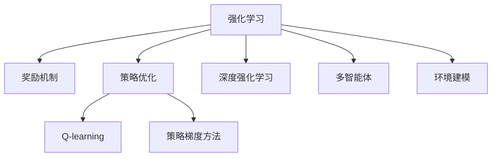

                 

# 强化学习RL原理与代码实例讲解

> 关键词：强化学习, 奖励机制, 策略优化, Q-learning, 深度强化学习, 策略梯度方法, 多智能体, 环境建模, 神经网络, 策略网络, 价值网络, 分布式训练

## 1. 背景介绍

### 1.1 问题由来
强化学习（Reinforcement Learning, RL）是一种通过与环境交互，学习最优决策策略的机器学习方法。其核心思想在于通过不断试错，探索最优的行动策略，以最大化累积奖励。强化学习在众多领域展现了卓越的性能，如游戏AI、机器人控制、自动驾驶、智能推荐等。

然而，尽管RL理论成熟，但在实际应用中，选择合适的奖励函数、确定合适的策略优化算法，以及构建高效率的训练模型，依然是 RL 领域的一大挑战。因此，深入理解 RL 的核心原理、常用算法，并能够实现代码实例讲解，对开发者和研究人员来说尤为重要。

### 1.2 问题核心关键点
本文将重点关注强化学习的核心概念、核心算法原理、具体操作步骤，以及其在实际应用场景中的应用。通过系统地梳理 RL 的原理与实践，希望能为读者提供一个完整的 RL 学习框架，并能够在代码实例中进一步加深理解。

## 2. 核心概念与联系

### 2.1 核心概念概述

为更好地理解强化学习，本文将介绍几个核心概念：

- **强化学习**：通过智能体（agent）与环境的交互，学习最优决策策略以最大化累积奖励的过程。强化学习分为单智能体和多智能体两种，单智能体指单个智能体学习，而多智能体指多个智能体互相协作或竞争。
- **奖励机制**：用于衡量智能体行为的好坏，通常奖励高表示该行为是好的，奖励低或无奖励表示该行为是差的。
- **策略优化**：通过优化智能体的决策策略，使其能够在环境中找到最优的行动方案。常见的策略优化方法包括Q-learning、策略梯度等。
- **Q-learning**：一种基于值函数的强化学习算法，通过更新Q值函数来近似最优策略。
- **深度强化学习**：将神经网络引入强化学习，构建神经网络模型来近似策略或价值函数。
- **策略梯度方法**：通过直接优化智能体的策略函数，而非值函数，来学习最优决策策略。
- **多智能体**：多个智能体在同一环境中共存，可以相互协作或竞争，适用于复杂的多方互动场景。
- **环境建模**：构建一个模拟环境的数学模型，使得智能体能够在该环境中进行学习和互动。

这些核心概念之间的逻辑关系可以通过以下Mermaid流程图来展示：



这个流程图展示了强化学习的核心概念及其之间的关系：

1. 强化学习通过奖励机制来评估智能体的行为，并通过策略优化找到最优决策。
2. Q-learning和策略梯度方法都是策略优化的具体方法，Q-learning通过更新Q值函数来近似最优策略，策略梯度方法通过优化策略函数来学习最优决策。
3. 深度强化学习通过引入神经网络模型，提高了策略和价值函数的表示能力。
4. 多智能体系统通过多个智能体的协作或竞争，模拟了复杂的交互场景。
5. 环境建模为智能体的学习和互动提供了一个虚拟的环境，使得强化学习可以在真实的物理环境之前进行模拟训练。

## 3. 核心算法原理 & 具体操作步骤

### 3.1 算法原理概述

强化学习的目标是通过智能体与环境的交互，找到最优的决策策略，使得智能体在环境中的累积奖励最大化。在强化学习中，智能体在每个时刻选择一个动作，并根据该动作在环境中的即时效果获得一个奖励。通过学习策略，智能体逐渐提高其行动的质量。

强化学习的数学框架可以定义为：

- $s$：环境的状态
- $a$：智能体的动作
- $r(s, a)$：智能体在状态$s$下采取动作$a$获得的奖励
- $p(s'|s, a)$：从状态$s$采取动作$a$后转移到状态$s'$的概率
- $\pi(a|s)$：智能体在状态$s$下采取动作$a$的概率
- $R$：累积奖励

强化学习的核心在于优化智能体的策略$\pi(a|s)$，使得在长期内最大化累积奖励$R$。

### 3.2 算法步骤详解

强化学习的训练过程通常包括以下几个步骤：

**Step 1: 初始化**
- 初始化智能体的策略$\pi$和状态值函数$V$或$Q$。

**Step 2: 环境交互**
- 在每个时间步$t$，智能体根据当前状态$s_t$选择动作$a_t$。
- 环境根据智能体的动作生成下一个状态$s_{t+1}$和即时奖励$r_t$。
- 记录时间步$t$的状态和动作，作为轨迹的一部分。

**Step 3: 更新策略**
- 根据最新收集的经验，更新策略$\pi$。

**Step 4: 策略评估**
- 更新状态值函数$V$或$Q$，以评估智能体的决策质量。

**Step 5: 循环迭代**
- 重复上述步骤，直到智能体的策略收敛或达到预设的训练轮数。

### 3.3 算法优缺点

强化学习的优点包括：
1. 灵活性高。能够处理各种类型的问题，包括连续状态和动作空间、部分可观察环境等。
2. 不需要标注数据。通过与环境的交互学习最优策略，适用于难以获取标注数据的场景。
3. 鲁棒性强。能够适应环境的变化，持续学习新策略。
4. 应用广泛。在游戏AI、自动驾驶、机器人控制等领域具有重要应用。

强化学习的缺点包括：
1. 探索与利用矛盾。在早期阶段，智能体需要探索不同的策略，但随着训练的进行，策略的利用效率会降低。
2. 样本效率低。需要大量的环境交互来探索最优策略，尤其是在高维度空间中。
3. 环境建模复杂。需要构建合适的环境模型来指导智能体的学习。
4. 难以理论分析。强化学习的收敛性和最优策略的计算复杂度是一个未解决的问题。

尽管存在这些局限性，强化学习在实际应用中依然取得了显著的成效，并在不断进步中。

### 3.4 算法应用领域

强化学习在多个领域都展现了其强大的应用潜力，包括但不限于：

- 游戏AI：通过学习策略，游戏AI能够在各种复杂游戏中胜过人类。
- 自动驾驶：通过学习最优驾驶策略，自动驾驶车辆能够安全、高效地行驶。
- 机器人控制：通过学习如何与环境交互，机器人能够在各种复杂任务中自主操作。
- 推荐系统：通过学习用户行为和商品特征，推荐系统能够提供个性化的推荐。
- 金融市场：通过学习最优交易策略，智能交易系统能够在金融市场中获利。
- 供应链管理：通过学习最优库存管理策略，提高供应链效率和响应速度。

## 4. 数学模型和公式 & 详细讲解  
### 4.1 数学模型构建

强化学习的数学模型可以表示为马尔科夫决策过程（Markov Decision Process, MDP）：

$$
\mathcal{M} = (\mathcal{S}, \mathcal{A}, \mathcal{P}, r, \gamma)
$$

其中：
- $\mathcal{S}$：环境状态空间
- $\mathcal{A}$：智能体动作空间
- $\mathcal{P}$：状态转移概率
- $r$：即时奖励函数
- $\gamma$：折扣因子

强化学习的目标是在给定的MDP中，找到一个最优策略$\pi^*$，使得在无限时间步内最大化累积奖励：

$$
\pi^* = \arg\max_{\pi} \mathbb{E}[R]
$$

其中，$R$为累积奖励。

### 4.2 公式推导过程

以下将详细推导强化学习中最基本的Q-learning算法。

假设智能体在状态$s_t$采取动作$a_t$后，环境转移到状态$s_{t+1}$，并获得即时奖励$r_t$。根据Q-learning算法，Q值函数$Q(s_t, a_t)$的更新公式为：

$$
Q(s_t, a_t) = Q(s_t, a_t) + \alpha (r_t + \gamma \max_{a'} Q(s_{t+1}, a') - Q(s_t, a_t))
$$

其中，$\alpha$为学习率，$\max_{a'} Q(s_{t+1}, a')$表示在状态$s_{t+1}$下的最优Q值。

通过迭代上述公式，智能体逐步更新Q值函数，从而近似最优策略$\pi^*$。

### 4.3 案例分析与讲解

以经典的游戏AI示例“CartPole”为例，展示Q-learning算法的应用过程。

**问题描述**：
- 游戏场景：一个小车在竖直轨道上，车后悬挂着一个杆子。小车的目标是保持杆子的水平，尽可能长时间不倒。
- 状态空间：包含车的位置、速度、角度等状态变量。
- 动作空间：包括左转、右转、保持不动三种动作。
- 奖励机制：在时间步内保持杆子不倒获得奖励1，否则获得惩罚-1。

**Q-learning算法实现**：
1. 初始化Q值函数为0。
2. 在每个时间步，智能体根据当前状态$s_t$采取动作$a_t$。
3. 观察环境反馈的下一个状态$s_{t+1}$和即时奖励$r_t$。
4. 根据Q-learning更新公式，更新Q值函数$Q(s_t, a_t)$。
5. 重复上述过程，直到智能体在指定轮次内保持杆子不倒。

**代码示例**：

```python
import numpy as np
import gym

env = gym.make('CartPole-v1')
env.reset()
state = env.state
done = False

Q = np.zeros((env.observation_space.n, env.action_space.n))

while not done:
    action = np.argmax(Q[state, :])
    next_state, reward, done, _ = env.step(action)
    state = next_state
    Q[state, action] += alpha * (reward + gamma * np.max(Q[next_state, :]) - Q[state, action])
```

通过这个简单案例，可以看出Q-learning算法的核心思想：通过更新Q值函数，逐步逼近最优策略。

## 5. 项目实践：代码实例和详细解释说明
### 5.1 开发环境搭建

在进行强化学习实践前，我们需要准备好开发环境。以下是使用Python进行Reinforcement Learning开发的常见环境配置流程：

1. 安装Anaconda：从官网下载并安装Anaconda，用于创建独立的Python环境。

2. 创建并激活虚拟环境：
```bash
conda create -n rein-env python=3.8 
conda activate rein-env
```

3. 安装相关依赖：
```bash
pip install numpy scipy matplotlib gym gymnasium pybullet gym-envs gym[atari] pybullet gym-envs-physix gym[rearrange]
```

4. 安装各类工具包：
```bash
pip install scikit-learn torch numpy matplotlib tqdm jupyter notebook ipython
```

完成上述步骤后，即可在`rein-env`环境中开始强化学习实践。

### 5.2 源代码详细实现

这里我们以“CartPole”游戏为例，给出使用Reinforcement Learning库实现Q-learning算法的PyTorch代码实现。

```python
import numpy as np
import torch
import gym
import torch.nn as nn
import torch.optim as optim
import matplotlib.pyplot as plt

env = gym.make('CartPole-v1')
env.reset()

# 定义神经网络模型
class QNetwork(nn.Module):
    def __init__(self, state_dim, action_dim):
        super(QNetwork, self).__init__()
        self.fc1 = nn.Linear(state_dim, 64)
        self.fc2 = nn.Linear(64, action_dim)

    def forward(self, x):
        x = torch.relu(self.fc1(x))
        x = self.fc2(x)
        return x

# 定义训练过程
def train(env, model, target_model, optimizer, timesteps, max_episodes, alpha=0.1, gamma=0.9, epsilon=0.1):
    global_step = 0
    episode_rewards = []

    while global_step < timesteps:
        state = env.reset()
        done = False
        while not done:
            if np.random.uniform() < epsilon:
                action = np.random.randint(0, env.action_space.n)
            else:
                action = model(state).argmax().item()
            next_state, reward, done, _ = env.step(action)
            Q_value = model(state).gather(1, torch.tensor([action]))
            target_Q_value = target_model(next_state).detach().max(1)[0]
            td_error = reward + gamma * target_Q_value - Q_value
            loss = td_error.pow(2).mean()
            optimizer.zero_grad()
            loss.backward()
            optimizer.step()
            global_step += 1
            state = next_state
        episode_rewards.append(reward)

    # 绘制训练过程中的奖励曲线
    plt.plot(episode_rewards)
    plt.xlabel('Episode')
    plt.ylabel('Reward')
    plt.show()

# 初始化模型和优化器
state_dim = env.observation_space.shape[0]
action_dim = env.action_space.n
model = QNetwork(state_dim, action_dim)
target_model = QNetwork(state_dim, action_dim)
optimizer = optim.Adam(model.parameters(), lr=alpha)

# 训练过程
train(env, model, target_model, optimizer, timesteps=5000, max_episodes=500)

```

在这个代码实现中，我们使用了PyTorch框架，构建了一个简单的神经网络模型作为Q-learning的策略函数。通过训练过程，我们逐步更新模型参数，以逼近最优策略。最终，我们通过训练过程中的奖励曲线，展示了模型的学习效果。

### 5.3 代码解读与分析

让我们再详细解读一下关键代码的实现细节：

**QNetwork类**：
- `__init__`方法：定义神经网络模型的结构，包括两个全连接层。
- `forward`方法：定义前向传播过程，通过两个全连接层计算输出。

**训练过程函数train**：
- 在每个时间步，智能体根据当前状态采取动作，观察环境反馈的下一个状态和即时奖励。
- 根据Q-learning更新公式，更新模型参数，并记录训练过程中的奖励。
- 绘制训练过程中的奖励曲线，以便观察模型学习效果。

**初始化模型和优化器**：
- 定义状态空间和动作空间的维度。
- 初始化QNetwork模型，并使用Adam优化器更新模型参数。

**训练过程**：
- 在训练过程中，智能体根据当前状态采取动作，观察环境反馈的下一个状态和即时奖励。
- 根据Q-learning更新公式，更新模型参数。
- 记录训练过程中的奖励，并在训练结束后绘制奖励曲线。

可以看到，通过PyTorch和Reinforcement Learning库的结合，我们能够轻松实现一个简单的Q-learning算法。开发者可以根据自己的需求，进一步扩展和优化模型结构，以达到更好的学习效果。

## 6. 实际应用场景
### 6.1 智能推荐系统

强化学习在智能推荐系统中的应用，是通过学习用户行为和商品特征，构建推荐模型。具体而言，智能体通过与环境交互，学习用户的偏好和商品的特征，从而在推荐系统中提供个性化的推荐。

**问题描述**：
- 用户有多个行为数据（如浏览、点击、评分等）。
- 商品有多个特征（如价格、类别、品牌等）。
- 推荐系统的目标是最大化用户满意度，即累计奖励。

**强化学习实现**：
1. 收集用户行为和商品特征数据，构建环境。
2. 设计智能体，通过学习用户的偏好和商品的特征，推荐合适的商品。
3. 使用Q-learning或策略梯度等方法，优化推荐策略。
4. 通过奖励机制，评估推荐效果。

**代码示例**：
```python
import numpy as np
import gym
import torch
import torch.nn as nn
import torch.optim as optim

# 定义环境
class RecommendationEnv(gym.Env):
    def __init__(self, num_items, num_users):
        self.num_items = num_items
        self.num_users = num_users
        self.state = np.zeros((self.num_items, self.num_users))
        self.reward = np.zeros(self.num_users)

    def step(self, action):
        # 计算奖励
        self.reward += np.dot(self.state, action)
        next_state = self.state + np.dot(self.reward, action)
        next_state = np.maximum(next_state, 0)
        self.state = next_state
        return self.state, self.reward, False, {}

    def reset(self):
        self.state = np.zeros((self.num_items, self.num_users))
        self.reward = np.zeros(self.num_users)
        return self.state, self.reward

    def render(self, mode='human'):
        pass

# 定义模型
class RecommendationModel(nn.Module):
    def __init__(self, num_items, num_users):
        super(RecommendationModel, self).__init__()
        self.fc1 = nn.Linear(num_items, 64)
        self.fc2 = nn.Linear(64, num_users)

    def forward(self, x):
        x = torch.relu(self.fc1(x))
        x = self.fc2(x)
        return x

# 定义训练过程
def train(env, model, optimizer, alpha=0.1, gamma=0.9, epsilon=0.1, timesteps=5000, max_episodes=500):
    global_step = 0
    episode_rewards = []

    while global_step < timesteps:
        state = env.reset()
        done = False
        while not done:
            if np.random.uniform() < epsilon:
                action = np.random.randint(0, env.action_space.n)
            else:
                action = model(state).argmax().item()
            next_state, reward, done, _ = env.step(action)
            Q_value = model(state).gather(1, torch.tensor([action]))
            target_Q_value = model(next_state).detach().max(1)[0]
            td_error = reward + gamma * target_Q_value - Q_value
            loss = td_error.pow(2).mean()
            optimizer.zero_grad()
            loss.backward()
            optimizer.step()
            global_step += 1
            state = next_state
        episode_rewards.append(reward)

    # 绘制训练过程中的奖励曲线
    plt.plot(episode_rewards)
    plt.xlabel('Episode')
    plt.ylabel('Reward')
    plt.show()

# 初始化模型和优化器
num_items = 10
num_users = 5
model = RecommendationModel(num_items, num_users)
optimizer = optim.Adam(model.parameters(), lr=alpha)

# 训练过程
train(RecommendationEnv(num_items, num_users), model, optimizer)

```

在这个代码实现中，我们使用Reinforcement Learning库构建了一个简单的推荐环境，并定义了一个神经网络模型作为推荐策略。通过训练过程，我们逐步更新模型参数，以逼近最优推荐策略。最终，我们通过训练过程中的奖励曲线，展示了模型的学习效果。

## 7. 工具和资源推荐
### 7.1 学习资源推荐

为了帮助开发者系统掌握强化学习的理论基础和实践技巧，这里推荐一些优质的学习资源：

1. 《Reinforcement Learning: An Introduction》：由Richard S. Sutton和Andrew G. Barto所著的经典教材，详细介绍了强化学习的核心概念和算法。

2. OpenAI的Reinforcement Learning系列课程：提供从基础到高级的课程，涵盖强化学习的各个方面。

3. DeepRL：由DeepMind开发的强化学习课程，包括从基础到高级的课程，涵盖强化学习的各个方面。

4. Coursera的Reinforcement Learning Specialization课程：由David Silver等顶级专家授课，涵盖强化学习的各个方面。

5. Udacity的Reinforcement Learning Nanodegree课程：提供实际项目实践，帮助开发者掌握强化学习的实践技巧。

6. Gym：一个Python库，用于定义和训练强化学习环境。

通过对这些资源的学习实践，相信你一定能够快速掌握强化学习的精髓，并能够在实际项目中灵活应用。

### 7.2 开发工具推荐

高效的开发离不开优秀的工具支持。以下是几款用于强化学习开发的常用工具：

1. PyTorch：基于Python的开源深度学习框架，灵活的动态计算图，适合快速迭代研究。

2. TensorFlow：由Google主导开发的开源深度学习框架，生产部署方便，适合大规模工程应用。

3. OpenAI Gym：一个Python库，用于定义和训练强化学习环境。

4. PyBullet：一个物理引擎，用于模拟机器人运动和环境互动。

5. TensorBoard：TensorFlow配套的可视化工具，可实时监测模型训练状态，并提供丰富的图表呈现方式。

6. Weights & Biases：模型训练的实验跟踪工具，可以记录和可视化模型训练过程中的各项指标。

合理利用这些工具，可以显著提升强化学习的开发效率，加快创新迭代的步伐。

### 7.3 相关论文推荐

强化学习在过去十年中取得了显著进展，以下是几篇奠基性的相关论文，推荐阅读：

1. Q-learning：由D. Q. Wang等人于1992年提出，是强化学习中最基础的算法之一。

2. Deep Q-Learning：由Ian Goodfellow等人在2013年提出，将深度学习引入Q-learning，提高了模型的表示能力。

3. Policy Gradient Methods：由Richard S. Sutton等人在2000年提出，直接优化策略函数，避免了值函数的近似。

4. Actor-Critic Methods：由Richard S. Sutton等人在2000年提出，结合了策略梯度和值函数优化，提高了学习效率。

5. Softmax Policy Iteration：由D. Silver等人在2008年提出，通过迭代更新策略和值函数，提高了收敛速度和稳定性。

6. Multi-Agent Reinforcement Learning：由Marco Ginzburg-Likin等人在2011年提出，研究多个智能体之间的协作和竞争问题。

这些论文代表了大强化学习的发展脉络。通过学习这些前沿成果，可以帮助研究者把握学科前进方向，激发更多的创新灵感。

## 8. 总结：未来发展趋势与挑战

### 8.1 总结

本文对强化学习的基本原理、常用算法、具体操作步骤，以及其在实际应用场景中的应用进行了系统梳理。通过详细讲解强化学习的核心概念，我们展示了强化学习在智能推荐、游戏AI、自动驾驶等领域的广泛应用前景。

强化学习通过智能体与环境的交互，学习最优决策策略，以最大化累积奖励。其核心在于策略优化，通过更新策略函数或值函数，逐步逼近最优策略。在实际应用中，强化学习通过与环境的交互，逐渐提高决策质量，广泛应用于智能推荐、游戏AI、自动驾驶等领域。

通过本文的系统梳理，可以看出强化学习在各个领域的应用潜力，但要进一步优化模型性能和计算效率，还需要不断探索和创新。

### 8.2 未来发展趋势

展望未来，强化学习将呈现以下几个发展趋势：

1. 多智能体系统：通过多个智能体之间的协作或竞争，模拟复杂的多方互动场景，解决更复杂的问题。
2. 分布式训练：通过多台机器并行训练，提高模型的训练效率，适应大规模数据和模型的训练需求。
3. 深度强化学习：将深度神经网络引入强化学习，提高策略和值函数的表示能力，处理更复杂的环境。
4. 强化学习与决策树、规则引擎等结合，构建混合智能系统，提高系统的稳定性和可解释性。
5. 强化学习与自然语言处理、计算机视觉等领域的结合，构建跨领域的智能系统。

这些趋势将推动强化学习向更加智能化、普适化方向发展，带来更多的应用场景和实际价值。

### 8.3 面临的挑战

尽管强化学习在实际应用中已经取得了显著成效，但在迈向更加智能化、普适化应用的过程中，仍面临诸多挑战：

1. 探索与利用矛盾：在早期阶段，智能体需要探索不同的策略，但随着训练的进行，策略的利用效率会降低。
2. 样本效率低：需要大量的环境交互来探索最优策略，尤其是在高维度空间中。
3. 环境建模复杂：需要构建合适的环境模型来指导智能体的学习。
4. 难以理论分析：强化学习的收敛性和最优策略的计算复杂度是一个未解决的问题。
5. 可解释性不足：强化学习的决策过程通常缺乏可解释性，难以对其推理逻辑进行分析和调试。

尽管存在这些挑战，强化学习在实际应用中依然取得了显著成效，并在不断进步中。

### 8.4 研究展望

面向未来，强化学习的研究方向包括：

1. 探索无监督和半监督强化学习算法：摆脱对大规模标注数据的依赖，利用自监督学习、主动学习等无监督和半监督范式，最大限度利用非结构化数据。
2. 研究参数高效和计算高效的强化学习范式：开发更加参数高效的强化学习算法，如AlphaZero等，在固定大部分预训练参数的同时，只更新极少量的任务相关参数。
3. 引入因果推断和对比学习：通过引入因果推断和对比学习思想，增强智能体的决策能力和稳定性。
4. 融合更多先验知识：将符号化的先验知识，如知识图谱、逻辑规则等，与神经网络模型进行融合，引导智能体的学习。
5. 纳入伦理道德约束：在模型训练目标中引入伦理导向的评估指标，过滤和惩罚有偏见、有害的输出倾向，确保输出的安全性。

这些研究方向的探索，必将引领强化学习技术迈向更高的台阶，为构建安全、可靠、可解释、可控的智能系统铺平道路。面向未来，强化学习需要与其他人工智能技术进行更深入的融合，如知识表示、因果推理、强化学习等，多路径协同发力，共同推动自然语言理解和智能交互系统的进步。只有勇于创新、敢于突破，才能不断拓展智能学习的边界，让智能技术更好地造福人类社会。

## 9. 附录：常见问题与解答

**Q1：什么是强化学习？**

A: 强化学习是一种通过智能体与环境的交互，学习最优决策策略的机器学习方法。强化学习通过智能体在环境中的试错过程，逐步学习最优的决策策略，以最大化累积奖励。

**Q2：强化学习的核心是什么？**

A: 强化学习的核心在于策略优化，通过更新策略函数或值函数，逐步逼近最优策略。策略优化是强化学习区别于其他机器学习方法的关键所在。

**Q3：强化学习在实际应用中面临哪些挑战？**

A: 强化学习在实际应用中面临的挑战包括：探索与利用矛盾、样本效率低、环境建模复杂、难以理论分析、可解释性不足等。这些问题需要在算法设计和实际应用中不断探索和优化。

**Q4：强化学习有哪些应用场景？**

A: 强化学习在智能推荐、游戏AI、自动驾驶、机器人控制、金融市场等领域都有广泛应用。通过与环境的交互，智能体能够逐步学习最优决策策略，提升决策质量。

**Q5：什么是Q-learning？**

A: Q-learning是一种基于值函数的强化学习算法，通过更新Q值函数来近似最优策略。Q-learning通过状态动作值（Q值）的迭代更新，逐步逼近最优策略。

通过本文的系统梳理，可以看出强化学习在各个领域的应用潜力，但要进一步优化模型性能和计算效率，还需要不断探索和创新。面向未来，强化学习需要与其他人工智能技术进行更深入的融合，如知识表示、因果推理、强化学习等，多路径协同发力，共同推动自然语言理解和智能交互系统的进步。只有勇于创新、敢于突破，才能不断拓展智能学习的边界，让智能技术更好地造福人类社会。

---

作者：禅与计算机程序设计艺术 / Zen and the Art of Computer Programming

