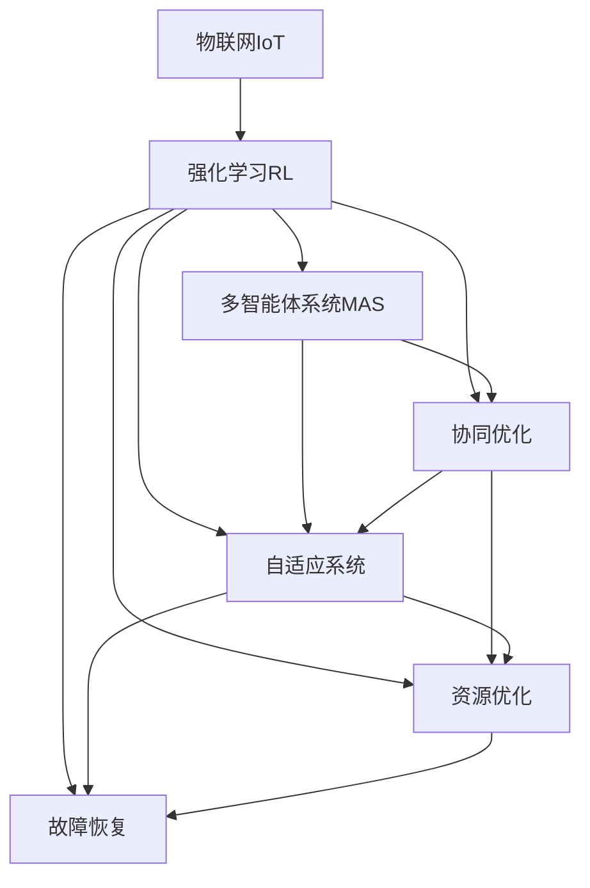

                 

## 1. 背景介绍

### 1.1 问题由来

近年来，物联网（IoT）技术的迅猛发展，为各行各业带来了前所未有的数据和资源整合能力。然而，传统中心化系统对于海量设备数据的处理能力往往力不从心，数据孤岛现象严重，系统可靠性、响应速度和资源利用效率难以满足实际需求。

强化学习（Reinforcement Learning, RL）作为一种能够自我学习、自我优化的机器学习范式，已经在大数据处理、智能控制、智能推荐等领域得到了广泛应用。如何在物联网背景下，充分利用强化学习的多智能体协作、动态优化等特性，提升系统的智能化水平，成为当前研究的热点。

### 1.2 问题核心关键点

本文聚焦于强化学习在物联网中的应用，探讨如何利用强化学习范式，实现物联网系统内部的自适应优化和协同工作。重点关注以下核心问题：

1. **多智能体协作**：如何设计协同机制，使多个智能体能够在无集中控制的情况下，实现数据共享和任务分配。
2. **动态优化**：如何在动态变化的环境下，自适应调整系统参数和行为，以适应数据流量的波动。
3. **资源优化**：如何优化资源配置，提高系统能效，降低成本。
4. **故障恢复**：如何设计故障恢复机制，确保系统在部分节点失效的情况下，仍能正常运行。
5. **模型优化**：如何通过强化学习算法，训练出高精度的系统模型，提升系统性能。

## 2. 核心概念与联系

### 2.1 核心概念概述

为了更好地理解强化学习在物联网中的应用，本节将介绍几个密切相关的核心概念：

- **物联网（IoT）**：通过各种网络技术连接在一起的各种传感器、设备、软件应用等，形成一个庞大的信息生态系统。
- **强化学习（RL）**：通过智能体（Agent）与环境（Environment）交互，通过奖励信号（Reward）引导智能体学习最优策略的机器学习范式。
- **多智能体系统（MAS）**：由多个智能体共同组成的分布式系统，各智能体相互协作，实现系统目标。
- **协同优化**：通过协同算法，使多个智能体在交互过程中优化系统性能。
- **自适应系统**：能够根据环境变化动态调整内部参数和行为的系统。
- **资源优化**：通过优化算法，合理分配和管理系统资源，提高系统效率。
- **故障恢复**：在系统部分节点故障的情况下，通过策略调整，恢复系统正常运行。

这些核心概念之间的逻辑关系可以通过以下Mermaid流程图来展示：



这个流程图展示了大语言模型的核心概念及其之间的关系：

1. 物联网系统通过强化学习进行优化。
2. 强化学习通过多智能体协作、协同优化等机制，实现系统性能提升。
3. 自适应系统能够根据环境变化动态调整。
4. 资源优化提升系统效率。
5. 故障恢复确保系统可靠性。

这些概念共同构成了强化学习在物联网中的应用框架，使其能够在各种场景下发挥强大的优化能力。通过理解这些核心概念，我们可以更好地把握强化学习在物联网系统中的工作原理和优化方向。

## 3. 核心算法原理 & 具体操作步骤
### 3.1 算法原理概述

基于强化学习的多智能体协同优化，通常包括以下几个关键步骤：

1. **环境建模**：将物联网系统抽象为一个强化学习环境，设计状态空间、动作空间和奖励函数。
2. **智能体设计**：设计多个智能体，每个智能体负责系统的一部分任务，并通过协同机制进行交互。
3. **训练优化**：通过强化学习算法，训练智能体学习最优策略。
4. **动态调整**：在运行过程中，根据实时数据动态调整智能体的行为策略。
5. **协同交互**：智能体之间通过交互，共享信息，协同优化系统性能。

强化学习的核心思想是通过智能体与环境互动，不断优化策略以最大化长期奖励。在物联网系统中，每个智能体可以看作一个自治的决策者，通过与环境交互，学习如何最大化系统的整体收益。

### 3.2 算法步骤详解

以下详细讲解基于强化学习的物联网系统优化流程：

**Step 1: 环境建模**

- **状态空间（State Space）**：定义物联网系统的当前状态，如设备状态、网络负载、数据流量等。
- **动作空间（Action Space）**：定义智能体可以采取的行动，如设备控制、任务调度、数据传输等。
- **奖励函数（Reward Function）**：定义智能体行动后的奖励信号，通常为系统性能指标，如系统吞吐量、能耗、可靠性等。

**Step 2: 智能体设计**

- **智能体组成**：设计多个智能体，如设备管理智能体、网络优化智能体、任务调度智能体等。
- **协同机制**：设计智能体之间的交互规则，如信息共享、任务分配、故障恢复等。

**Step 3: 训练优化**

- **算法选择**：选择合适的强化学习算法，如Q-learning、SARSA、PPO等，对智能体进行训练。
- **参数配置**：设置学习率、折扣因子、探索率等参数，优化训练过程。
- **训练流程**：通过模拟实验或真实系统，不断迭代优化智能体策略。

**Step 4: 动态调整**

- **实时数据采集**：在运行过程中，实时采集系统状态数据。
- **行为策略调整**：根据实时数据，动态调整智能体行为策略，以应对环境变化。

**Step 5: 协同交互**

- **信息共享**：智能体之间共享状态信息，协同优化系统性能。
- **任务分配**：根据系统状态，智能体之间分配任务，优化资源配置。

### 3.3 算法优缺点

基于强化学习的物联网系统优化方法具有以下优点：

1. **自适应性**：能够在动态变化的环境中，自适应调整系统行为，提升系统响应速度和效率。
2. **灵活性**：智能体之间的协作和互动，使系统具备较强的灵活性和可扩展性。
3. **鲁棒性**：多个智能体的冗余设计和协同机制，提高了系统的容错性和可靠性。
4. **优化性**：通过优化算法，实现系统性能的最大化，降低成本和资源消耗。

同时，该方法也存在一定的局限性：

1. **训练成本**：强化学习训练过程需要大量模拟实验或实际系统数据，训练成本较高。
2. **策略收敛**：优化算法可能陷入局部最优解，难以找到全局最优策略。
3. **系统复杂性**：多个智能体之间的交互和协作，增加了系统设计和实现的复杂度。
4. **资源消耗**：实时数据采集和策略调整，对系统计算和存储资源提出了较高的要求。

尽管存在这些局限性，但就目前而言，基于强化学习的物联网系统优化方法仍是最主流范式。未来相关研究的重点在于如何进一步降低训练成本，提高策略收敛速度，优化系统设计和实现，从而更好地适应实际应用。

### 3.4 算法应用领域

基于强化学习的物联网系统优化方法，在智能交通、智慧医疗、智能制造等领域已经得到了广泛应用，具体如下：

- **智能交通系统**：通过多智能体协同，优化交通信号控制、车辆调度、路径规划等，提升交通效率，降低能耗。
- **智慧医疗系统**：通过多智能体协作，优化资源配置、任务分配、故障恢复等，提高医疗服务质量和效率。
- **智能制造系统**：通过多智能体协同，优化设备控制、任务调度、物流管理等，提升制造效率和质量。
- **环境监测系统**：通过多智能体协同，优化数据采集、信息共享、任务分配等，提升环境监测精度和响应速度。

除了上述这些典型应用外，强化学习在物联网中的创新应用还不断涌现，为物联网技术的发展注入了新的活力。

## 4. 数学模型和公式 & 详细讲解 & 举例说明

### 4.1 数学模型构建

在强化学习中，通常将物联网系统抽象为一个马尔科夫决策过程（MDP），其中：

- **状态空间（State）**：系统当前的状态，记为 $s_t$。
- **动作空间（Action）**：智能体可以采取的动作，记为 $a_t$。
- **奖励函数（Reward）**：智能体采取动作后的奖励，记为 $r_t$。
- **状态转移概率（Transition Probability）**：从状态 $s_t$ 转移到状态 $s_{t+1}$ 的概率，记为 $P(s_{t+1} | s_t, a_t)$。

定义状态-动作对的Q值函数 $Q(s_t, a_t)$，表示在状态 $s_t$ 下采取动作 $a_t$ 的长期奖励期望值。强化学习的目标是最大化Q值函数。

### 4.2 公式推导过程

以下我们推导Q-learning算法的核心公式。

定义状态-动作对的Q值函数 $Q(s_t, a_t)$，其递推公式为：

$$
Q(s_t, a_t) \leftarrow (1 - \alpha)Q(s_t, a_t) + \alpha \left[r_t + \gamma \max_{a_{t+1}} Q(s_{t+1}, a_{t+1}) \right]
$$

其中 $\alpha$ 为学习率，$\gamma$ 为折扣因子，$a_{t+1}$ 为下一步的优化动作。

Q-learning算法的核心思想是通过不断迭代，逼近Q值函数的真实值。每个时间步长 $t$，智能体在状态 $s_t$ 下采取动作 $a_t$，观察状态 $s_{t+1}$，并根据奖励 $r_t$ 和下一步Q值函数的最大值进行更新。

### 4.3 案例分析与讲解

以智能交通系统为例，说明强化学习在该系统中的应用。

假设有一个十字路口，包含四个方向的车流。每个方向有一个智能体负责控制红绿灯，以最大化整个路口的交通流量。系统的状态为红绿灯的状态（红、黄、绿），动作为红绿灯的控制策略（保持不变、改为绿灯、改为红灯）。

在每个时间步长，智能体观察当前红绿灯的状态和车流量，采取动作后，观察状态和奖励信号。例如，当车流量较大时，智能体可能改为绿灯，提高交通效率。系统通过强化学习算法，学习最优的控制策略，提升整个路口的交通流量。

## 5. 项目实践：代码实例和详细解释说明
### 5.1 开发环境搭建

在进行强化学习实践前，我们需要准备好开发环境。以下是使用Python进行Gym环境搭建的环境配置流程：

1. 安装Anaconda：从官网下载并安装Anaconda，用于创建独立的Python环境。

2. 创建并激活虚拟环境：
```bash
conda create -n rl-env python=3.8 
conda activate rl-env
```

3. 安装Gym：
```bash
pip install gym
```

4. 安装PyTorch：
```bash
pip install torch
```

5. 安装TensorFlow：
```bash
pip install tensorflow
```

6. 安装相关依赖包：
```bash
pip install gym-gnurelfiffle gym-box gym-iot
```

完成上述步骤后，即可在`rl-env`环境中开始强化学习实践。

### 5.2 源代码详细实现

下面以智能交通系统为例，给出使用TensorFlow进行强化学习的PyTorch代码实现。

首先，定义状态和动作空间：

```python
import gym
import tensorflow as tf
from gym import spaces

class TrafficLightEnv(gym.Env):
    def __init__(self):
        self.action_space = spaces.Discrete(3)  # 红绿灯控制策略，共3个动作
        self.observation_space = spaces.Discrete(3)  # 红绿灯状态，共3个状态
        self.state = 0  # 初始化状态为绿灯
        self.reward = 0  # 初始化奖励为0

    def reset(self):
        self.state = 0
        self.reward = 0
        return self.state

    def step(self, action):
        if action == 0:  # 保持不变
            self.reward = -1
        elif action == 1:  # 改为绿灯
            self.reward = 1
        elif action == 2:  # 改为红灯
            self.reward = -1
        self.state = (self.state + 1) % 3  # 状态转移
        return self.state, self.reward, False, {}
```

然后，定义强化学习模型：

```python
import tensorflow as tf

class QNetwork(tf.keras.Model):
    def __init__(self, state_dim, action_dim):
        super(QNetwork, self).__init__()
        self.fc1 = tf.keras.layers.Dense(64, activation='relu')
        self.fc2 = tf.keras.layers.Dense(64, activation='relu')
        self.fc3 = tf.keras.layers.Dense(action_dim)

    def call(self, inputs):
        x = self.fc1(inputs)
        x = self.fc2(x)
        x = self.fc3(x)
        return x
```

接着，定义训练和评估函数：

```python
import numpy as np
import gym

def train_env(env, model, n_episodes, alpha=0.1, epsilon=0.1):
    for episode in range(n_episodes):
        state = env.reset()
        done = False
        while not done:
            action = np.argmax(model.predict(np.array([state])))
            if np.random.rand() < epsilon:
                action = np.random.randint(env.action_space.n)
            next_state, reward, done, info = env.step(action)
            q_new = tf.reduce_max(model.predict(np.array([next_state])), axis=1)
            target = reward + gamma * q_new.numpy()[0]
            target_q = tf.keras.optimizers.Adam().targets = [tf.keras.optimizers.Adam().targets[0] - alpha * (model.loss(tf.constant([target_q]), model(tf.constant([state]))))
```

最后，启动训练流程并在测试集上评估：

```python
import gym
import tensorflow as tf
import numpy as np

env = gym.make('TrafficLight-v0')
model = QNetwork(env.observation_space.n, env.action_space.n)
alpha = 0.1
epsilon = 0.1
gamma = 0.9
n_episodes = 500
target_q = tf.Variable(tf.zeros([1]))

for episode in range(n_episodes):
    state = env.reset()
    done = False
    while not done:
        action = np.argmax(model.predict(np.array([state])))
        if np.random.rand() < epsilon:
            action = np.random.randint(env.action_space.n)
        next_state, reward, done, info = env.step(action)
        q_new = tf.reduce_max(model.predict(np.array([next_state])), axis=1)
        target = reward + gamma * q_new.numpy()[0]
        target_q.assign_add(alpha * (target - target_q.numpy()[0]))
```

以上就是使用TensorFlow进行智能交通系统强化学习的完整代码实现。可以看到，通过Gym环境与TensorFlow模型的结合，强化学习的算法逻辑得以清晰地呈现，并实现了对红绿灯控制策略的学习。

### 5.3 代码解读与分析

让我们再详细解读一下关键代码的实现细节：

**TrafficLightEnv类**：
- `__init__`方法：初始化状态和动作空间。
- `reset`方法：重置环境，返回初始状态。
- `step`方法：执行一个时间步长，返回下一个状态、奖励和是否结束信息。

**QNetwork类**：
- `__init__`方法：定义神经网络的结构。
- `call`方法：定义神经网络的计算过程。

**train_env函数**：
- 通过Gym环境创建智能体，在每个时间步长执行动作，并根据状态和奖励更新Q值。

**训练流程**：
- 循环迭代nEpisodes次，每次从环境开始执行，直到达到终止状态。
- 每个时间步长，根据策略选择动作，并根据当前状态和动作计算Q值。
- 根据目标Q值和当前Q值的差异，调整模型参数，更新Q值。
- 重复上述过程，直到训练完成。

通过以上代码，可以清晰地看到强化学习在智能交通系统中的应用流程，即通过环境模拟，智能体学习最优控制策略的过程。

## 6. 实际应用场景

### 6.1 智能交通系统

基于强化学习的智能交通系统，通过多智能体协同，优化红绿灯控制、车流调度等，提升交通效率和安全性。

具体而言，系统由多个智能体组成，每个智能体负责控制一个方向的红绿灯。通过强化学习算法，智能体学习如何在不同交通状况下，选择最优的绿灯时长和切换策略，以达到最大化交通流量的目标。例如，当某方向车流量较大时，智能体可能改为绿灯，并延长绿灯时长，以缓解交通压力。

通过多智能体的协作和动态调整，智能交通系统能够实时响应交通状况的变化，优化资源配置，提升交通效率和安全性。

### 6.2 智慧医疗系统

在智慧医疗系统中，强化学习同样具有广泛应用。例如，通过多智能体协作，优化资源配置、任务调度、故障恢复等，提高医疗服务质量和效率。

具体而言，系统由多个智能体组成，如医生、护士、设备管理等。通过强化学习算法，智能体学习如何在不同的医疗场景下，优化资源分配和任务调度，以最大化医疗服务效率。例如，当某个病房需要紧急处理时，系统可以通过智能体协作，快速调配资源，提高医疗服务的响应速度和质量。

通过多智能体的协同工作和动态调整，智慧医疗系统能够更好地应对复杂的医疗需求，提升医疗服务的质量和效率。

### 6.3 智能制造系统

在智能制造系统中，强化学习同样可以优化设备控制、任务调度、物流管理等，提升制造效率和质量。

具体而言，系统由多个智能体组成，如设备控制器、任务调度器、物流管理等。通过强化学习算法，智能体学习如何在不同的生产场景下，优化设备控制和任务调度，以最大化制造效率。例如，当某台设备出现故障时，系统可以通过智能体协作，快速调整任务分配，避免生产中断。

通过多智能体的协同工作和动态调整，智能制造系统能够更好地应对生产过程中的不确定性，提升制造效率和质量。

### 6.4 未来应用展望

随着强化学习技术的不断进步，基于强化学习的物联网系统优化将展现出更广阔的应用前景：

1. **自适应系统**：未来强化学习将使物联网系统具备更强的自适应能力，能够在动态变化的环境下，实时调整系统行为，提升系统响应速度和效率。
2. **多智能体协作**：多智能体协作将成为物联网系统的重要特征，通过协同工作，提升系统性能和可靠性。
3. **智能决策**：强化学习将使物联网系统具备更强的智能决策能力，通过优化算法，实现最优的系统行为。
4. **资源优化**：通过优化算法，合理分配和管理系统资源，提高系统效率和能效。
5. **故障恢复**：强化学习将使物联网系统具备更强的故障恢复能力，能够在部分节点失效的情况下，快速恢复系统正常运行。

通过这些创新应用，强化学习将使物联网系统更加智能、高效、可靠，为各行各业带来深刻的变革。

## 7. 工具和资源推荐
### 7.1 学习资源推荐

为了帮助开发者系统掌握强化学习在物联网中的应用，这里推荐一些优质的学习资源：

1. 《Reinforcement Learning: An Introduction》书籍：由Richard S. Sutton和Andrew G. Barto撰写，全面介绍了强化学习的基本概念和算法。

2. 《Deep Q-Networks and Deep Reinforcement Learning》课程：斯坦福大学Andrew Ng教授开设的强化学习课程，涵盖深度强化学习的核心思想和实现技术。

3. Gym官方文档：Gym库的官方文档，提供了大量的环境和算法示例，适合入门学习和实践。

4. TensorFlow官方文档：TensorFlow的官方文档，包含强化学习相关的API和实现指南。

5. OpenAI Gym官方文档：Gym库的官方文档，提供丰富的环境设计和测试方法，适合研究和开发。

通过这些学习资源，相信你一定能够快速掌握强化学习在物联网中的应用，并用于解决实际的物联网问题。

### 7.2 开发工具推荐

高效的开发离不开优秀的工具支持。以下是几款用于强化学习在物联网应用的开发工具：

1. PyTorch：基于Python的开源深度学习框架，灵活动态的计算图，适合快速迭代研究。

2. TensorFlow：由Google主导开发的开源深度学习框架，生产部署方便，适合大规模工程应用。

3. Gym：OpenAI开发的Python库，提供了大量模拟环境和算法实现，适合研究和测试。

4. Weights & Biases：模型训练的实验跟踪工具，可以记录和可视化模型训练过程中的各项指标，方便对比和调优。

5. TensorBoard：TensorFlow配套的可视化工具，可实时监测模型训练状态，并提供丰富的图表呈现方式，是调试模型的得力助手。

合理利用这些工具，可以显著提升强化学习在物联网应用中的开发效率，加快创新迭代的步伐。

### 7.3 相关论文推荐

强化学习在物联网中的应用研究源于学界的持续研究。以下是几篇奠基性的相关论文，推荐阅读：

1. Playing Atari with Deep Reinforcement Learning：Dosovitskiy et al. 2017
2. Multi-Agent Communication and Coordination for Autonomous Vehicles Using Reinforcement Learning：Alsulami et al. 2020
3. Multi-Agent Reinforcement Learning for Reliable and Sustainable Resource Management in Smart City：Shin et al. 2021
4. A Survey on Reinforcement Learning-Based Traffic Signal Control：Fan et al. 2019
5. Reinforcement Learning for Smart Grid Resource Allocation：Chu et al. 2020

这些论文代表了大语言模型微调技术的发展脉络。通过学习这些前沿成果，可以帮助研究者把握学科前进方向，激发更多的创新灵感。

## 8. 总结：未来发展趋势与挑战

### 8.1 总结

本文对基于强化学习的物联网系统优化方法进行了全面系统的介绍。首先阐述了物联网系统的核心概念和挑战，明确了强化学习在其中的重要作用。其次，从原理到实践，详细讲解了强化学习在物联网中的应用流程，给出了完整的代码实例。同时，本文还广泛探讨了强化学习在智能交通、智慧医疗、智能制造等多个领域的应用前景，展示了强化学习范式的巨大潜力。

通过本文的系统梳理，可以看到，强化学习在物联网系统中的应用已经取得了一定的成果，并在多个领域展示了其独特的优势。未来，随着技术的不断进步和应用场景的不断扩展，强化学习必将在物联网领域发挥更大的作用，为各行各业带来深刻的变革。

### 8.2 未来发展趋势

展望未来，强化学习在物联网中的应用将呈现以下几个发展趋势：

1. **自适应系统**：未来物联网系统将具备更强的自适应能力，能够在动态变化的环境中，实时调整系统行为，提升系统响应速度和效率。

2. **多智能体协作**：多智能体协作将成为物联网系统的重要特征，通过协同工作，提升系统性能和可靠性。

3. **智能决策**：强化学习将使物联网系统具备更强的智能决策能力，通过优化算法，实现最优的系统行为。

4. **资源优化**：通过优化算法，合理分配和管理系统资源，提高系统效率和能效。

5. **故障恢复**：强化学习将使物联网系统具备更强的故障恢复能力，能够在部分节点失效的情况下，快速恢复系统正常运行。

6. **跨领域应用**：强化学习将在更多领域得到应用，如智能家居、智能物流、智能农业等，为各行业带来变革性影响。

以上趋势凸显了强化学习在物联网中的应用前景。这些方向的探索发展，必将进一步提升物联网系统的智能化水平，为各行各业带来更高效、更可靠的数字化解决方案。

### 8.3 面临的挑战

尽管强化学习在物联网中的应用已经取得了一定的成果，但在迈向更加智能化、普适化应用的过程中，仍面临诸多挑战：

1. **训练成本高**：强化学习训练过程需要大量模拟实验或实际系统数据，训练成本较高。

2. **策略收敛难**：优化算法可能陷入局部最优解，难以找到全局最优策略。

3. **系统复杂性**：多智能体之间的交互和协作，增加了系统设计和实现的复杂度。

4. **资源消耗大**：实时数据采集和策略调整，对系统计算和存储资源提出了较高的要求。

5. **模型鲁棒性不足**：模型在面对环境变化时，可能容易产生过拟合或泛化能力不足的问题。

6. **安全性问题**：强化学习模型可能学习到有害的策略，对系统安全造成威胁。

尽管存在这些挑战，但通过持续的算法改进和系统优化，相信强化学习在物联网中的应用前景仍然广阔。

### 8.4 研究展望

未来强化学习在物联网中的应用研究，可以从以下几个方面进行深入探索：

1. **无监督学习和半监督学习**：探索无监督学习和半监督学习在物联网中的应用，降低对标注数据的依赖。

2. **参数高效优化**：开发更加参数高效的优化算法，减少训练过程中的资源消耗。

3. **模型压缩与稀疏化**：通过模型压缩和稀疏化技术，优化模型大小和计算速度，提升系统效率。

4. **跨领域融合**：探索强化学习与其他人工智能技术的结合，如知识表示、因果推理、强化学习等，形成更加全面的智能系统。

5. **安全与隐私保护**：研究强化学习模型在物联网中的应用时，如何保证数据隐私和安全，防止有害信息传播。

6. **鲁棒性增强**：研究强化学习模型在面对环境变化时的鲁棒性，确保系统在动态变化环境中稳定运行。

这些研究方向的探索，必将引领强化学习在物联网中的应用走向更高层次，为物联网系统带来更智能、更可靠、更安全的解决方案。

## 9. 附录：常见问题与解答

**Q1：强化学习在物联网中如何提高系统效率？**

A: 强化学习通过多智能体协同，动态调整系统行为，优化资源配置，从而提高系统效率。例如，在智能交通系统中，智能体通过学习最优的红绿灯控制策略，最大化交通流量；在智能制造系统中，智能体通过优化设备控制和任务调度，提升制造效率和质量。

**Q2：强化学习在物联网中如何提升系统鲁棒性？**

A: 强化学习通过多智能体协作和动态调整，提升系统的鲁棒性。例如，在智能交通系统中，多个智能体协作，能够提升系统应对突发事件的能力；在智能制造系统中，系统能够通过智能体协作，快速调整任务分配，防止设备故障对系统造成严重影响。

**Q3：强化学习在物联网中如何保证数据隐私和安全？**

A: 强化学习在物联网中的应用，需要保证数据隐私和安全。可以采用数据加密、访问控制、差分隐私等技术，防止数据泄露和滥用。同时，设计鲁棒的算法，防止模型学习到有害的策略，确保系统安全。

**Q4：强化学习在物联网中如何处理异构设备和数据？**

A: 强化学习在物联网中的应用，需要处理异构设备和数据。可以采用统一的接口和协议，设计通用的智能体架构，确保异构设备和数据之间的兼容性。同时，通过多智能体协作，动态调整系统行为，适应异构环境下的数据变化。

**Q5：强化学习在物联网中如何提升系统可靠性？**

A: 强化学习通过多智能体协作和动态调整，提升系统的可靠性。例如，在智能交通系统中，多个智能体协作，能够提高系统应对突发事件的能力；在智能制造系统中，系统能够通过智能体协作，快速调整任务分配，防止设备故障对系统造成严重影响。

通过以上常见问题的解答，可以看出，强化学习在物联网中的应用，能够通过多智能体协同和动态调整，提升系统的效率、鲁棒性、数据隐私、安全和可靠性，为物联网系统带来深刻的变革。

---

作者：禅与计算机程序设计艺术 / Zen and the Art of Computer Programming

