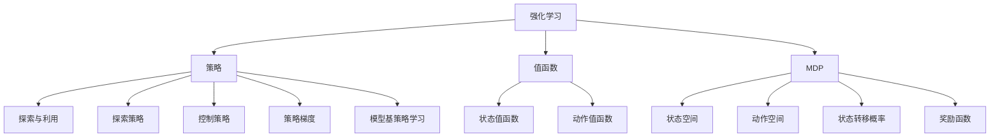

                 

## 1. 背景介绍

### 1.1 问题由来
随着机器人技术的发展，增强机器人的自主操作能力和灵活性成为了研究的热点。传统的基于精确运动控制和预先编程的机器人，难以应对复杂多变的现实环境，适应性较弱。而基于强化学习的机器人操作策略，则可以在不断与环境互动中，自主学习并适应新的操作任务。

近年来，强化学习(Reinforcement Learning, RL)在机器人领域取得了诸多突破性成果。通过RL方法，机器人能够自主学习最优行为策略，提高自主导航、避障、抓取、放置等任务的灵活性和效率。其核心思想是通过环境互动，优化控制策略，在不断试错中探索最优解。

### 1.2 问题核心关键点
强化学习的关键在于如何构建智能体的行动策略，使其在给定环境中，根据即时状态和历史经验，做出最优决策。具体而言，核心问题包括：

1. **状态表示**：如何将环境的状态信息高效、准确地编码，供智能体决策使用。
2. **行动策略**：设计何种策略，才能使智能体在环境中不断探索并最终达到目标。
3. **奖励设计**：如何设计合理的奖励机制，引导智能体向正向方向学习。
4. **探索与利用**：如何在探索新路径和利用已有知识之间找到平衡，确保智能体既能发现最优策略，又能避免陷入局部最优。
5. **泛化能力**：如何使智能体能将学到的策略应用到不同环境和任务中。

本文将深入探讨强化学习在机器人操作中的应用，重点介绍其核心算法原理、具体操作步骤，并结合实际案例进行详细讲解。

## 2. 核心概念与联系

### 2.1 核心概念概述

为更好地理解强化学习在机器人操作中的应用，本节将介绍几个密切相关的核心概念：

- **强化学习(Reinforcement Learning, RL)**：一种通过与环境互动，不断优化行为策略的机器学习方法。智能体在每一步根据当前状态和奖励信号选择动作，逐渐学习最优策略。
- **策略(Policy)**：智能体的决策规则，用于指导智能体选择动作。可以基于值函数、策略梯度等方法进行建模和优化。
- **值函数(Value Function)**：表示智能体在某一状态下，采取某一动作后，未来收益的期望值。常用的有状态值函数和动作值函数。
- **环境模型(MDP)**：强化学习的基础，将环境抽象为马尔可夫决策过程(Markov Decision Process, MDP)。MDP由状态空间、动作空间、状态转移概率和奖励函数构成。
- **探索与利用(Exploration vs. Exploitation)**：在策略学习中，智能体需要在探索新路径和利用已有知识之间进行权衡，寻找最优策略。
- **探索策略(Exploration Strategy)**：如 $\epsilon$-贪心策略，在当前策略基础上以一定概率随机探索新动作。
- **控制策略(Control Strategy)**：如基于值函数的贪心策略，在当前状态下选择动作值最大的动作。
- **策略梯度(Strategy Gradient)**：基于策略的导数优化方法，通过梯度上升法更新策略参数。
- **模型基策略学习(Model-based Policy Learning)**：结合环境模型进行策略学习，提高策略的泛化能力和适应性。

这些核心概念之间的逻辑关系可以通过以下Mermaid流程图来展示：



这个流程图展示出强化学习的核心概念及其相互关系：

1. 强化学习的基础是MDP，由状态、动作、转移概率和奖励构成。
2. 策略用于指导智能体选择动作，可以基于值函数进行建模。
3. 值函数分为状态值函数和动作值函数，用于预测未来收益。
4. 探索与利用策略平衡智能体的探索新路径和利用已有知识。
5. 探索策略如 $\epsilon$-贪心策略，控制策略如值函数策略，用于指导智能体决策。
6. 策略梯度方法通过优化策略参数，更新智能体行为。
7. 模型基策略学习结合环境模型，提升智能体策略泛化能力。

这些概念共同构成了强化学习的基础框架，使其在机器人操作中具有强大的应用潜力。

## 3. 核心算法原理 & 具体操作步骤

### 3.1 算法原理概述

强化学习在机器人操作中的应用，主要通过智能体与环境的互动，学习最优策略。其核心思想是：智能体在每个时刻根据当前状态，选择一个动作，并通过环境反馈获得奖励或惩罚，最终优化策略以最大化总奖励。

形式化地，假设机器人操作的环境为 $E$，当前状态为 $s$，可选动作为 $a$，环境下一步状态为 $s'$，动作选择概率为 $\pi(a|s)$，奖励函数为 $R(s,a,s')$，智能体的目标是通过学习策略 $\pi$，最大化总奖励 $J(\pi)$。

通过强化学习，智能体通过不断试错，探索并优化策略，达到最优行为策略 $\pi^*$。具体而言，主要分为以下几步：

1. **状态观测**：智能体通过传感器获取环境状态 $s_t$。
2. **动作选择**：智能体根据当前状态 $s_t$ 和策略 $\pi$，选择动作 $a_t$。
3. **状态转移**：智能体执行动作 $a_t$，环境转移到下一步状态 $s_{t+1}$。
4. **奖励反馈**：智能体从环境获得奖励信号 $R_{t+1}$。
5. **状态更新**：智能体将状态更新为 $s_{t+1}$。
6. **重复迭代**：重复上述过程，直至达到终止状态或达到预设的迭代次数。

### 3.2 算法步骤详解

**Step 1: 定义环境与奖励机制**
- 定义机器人操作的环境，包括状态空间、动作空间、状态转移概率和奖励函数。
- 设计奖励函数，确保智能体在执行正确动作时获得正奖励，在执行错误动作时获得负奖励。

**Step 2: 定义策略与损失函数**
- 选择策略模型，如基于深度学习的策略网络或基于值的策略网络。
- 设计损失函数，如策略梯度损失，用于优化策略参数。

**Step 3: 定义探索与利用策略**
- 选择探索策略，如 $\epsilon$-贪心策略，控制策略选择动作的随机性。
- 设置探索与利用策略的平衡参数 $\epsilon$，指导智能体的探索行为。

**Step 4: 执行策略优化**
- 将智能体置于环境中，重复执行状态观测、动作选择、状态转移、奖励反馈等步骤。
- 使用策略梯度方法或值函数方法更新策略参数，逐步优化策略。

**Step 5: 测试与部署**
- 在测试集上评估优化后的策略，对比初始策略的性能提升。
- 将优化后的策略部署到实际应用中，进行持续优化和更新。

### 3.3 算法优缺点

强化学习在机器人操作中的应用具有以下优点：
1. 自适应性强：在不断与环境互动中，智能体可以自主学习最优策略，适应多变的环境。
2. 泛化能力强：智能体能够将学到的策略应用到不同环境和任务中，提升泛化能力。
3. 数据效率高：强化学习方法能够在不断试错中，快速优化策略，减少对标注数据的需求。
4. 自主性强：智能体的决策过程不依赖于人工干预，具有较高的自主性和灵活性。

同时，强化学习也存在一些局限性：
1. 状态空间复杂：机器人操作环境通常具有高维复杂的非线性状态空间，建模难度较大。
2. 奖励设计困难：设计合理的奖励函数不易，尤其是对于多任务和复合任务。
3. 探索效率低：在复杂环境中，智能体的探索过程可能过于缓慢，难以快速收敛。
4. 模型稳定性差：强化学习方法对模型初始参数和超参数的敏感度较高，容易陷入局部最优。

尽管存在这些局限性，但就目前而言，强化学习仍是大规模机器人操作的重要范式。未来相关研究的重点在于如何进一步优化探索策略，设计更合理的奖励函数，提升模型稳定性，并实现更高效、自适应强的机器人操作。

### 3.4 算法应用领域

强化学习在机器人操作中的应用广泛，涵盖各类任务，例如：

- 机器人路径规划：通过优化路径奖励函数，使机器人自主规划最优路径。
- 机器人避障导航：通过设计环境奖励，使机器人自主避障，提升导航效率。
- 机器人抓取放置：通过优化动作空间和奖励函数，使机器人自主学习最优抓取和放置策略。
- 机器人协作操作：通过多智能体的交互学习，使机器人协同完成复杂任务。
- 机器人动态调整：通过在线学习机制，使机器人根据环境变化动态调整策略。
- 机器人自我修复：通过奖励机制设计，使机器人自主修复自身故障，提升可靠性和自适应性。

除了上述这些经典任务外，强化学习还将在更多场景中得到应用，如能源管理、智能家居、环境监测等，为智能化的机器人操作提供新的解决方案。

## 4. 数学模型和公式 & 详细讲解  
### 4.1 数学模型构建

本节将使用数学语言对强化学习在机器人操作中的应用进行更加严格的刻画。

假设机器人操作的环境为 $E$，当前状态为 $s$，可选动作为 $a$，环境下一步状态为 $s'$，动作选择概率为 $\pi(a|s)$，奖励函数为 $R(s,a,s')$。机器人操作的目标是学习策略 $\pi$，最大化总奖励 $J(\pi)$。

定义智能体在状态 $s_t$ 下，选择动作 $a_t$ 后，未来奖励的期望值，即**状态值函数** $V(s)$：

$$
V(s) = \mathbb{E}\left[\sum_{t=T}^\infty \gamma^t R(s_t,a_t,s_{t+1}) \mid s_0 = s\right]
$$

其中 $\gamma$ 为折扣因子，用于平衡未来奖励和即时奖励的重要性。

状态值函数可以通过**贝尔曼方程**(Bellman Equation)进行递推计算：

$$
V(s) = \mathbb{E}\left[R(s,a,s') + \gamma V(s') \mid s\right]
$$

智能体在状态 $s_t$ 下，选择动作 $a_t$ 后，下一步状态的期望值，即**动作值函数** $Q(s,a)$：

$$
Q(s,a) = \mathbb{E}\left[\sum_{t=T}^\infty \gamma^t R(s_t,a_t,s_{t+1}) \mid s_0 = s, a_0 = a\right]
$$

动作值函数同样可以通过贝尔曼方程递推计算：

$$
Q(s,a) = \mathbb{E}\left[R(s,a,s') + \gamma Q(s',a') \mid s, a\right]
$$

智能体的策略 $\pi$ 可以通过动作值函数 $Q(s,a)$ 进行建模，即：

$$
\pi(a|s) = \frac{\exp Q(s,a)}{\sum_a \exp Q(s,a)}
$$

状态值函数和动作值函数可以用于设计策略梯度方法，优化策略参数。策略梯度方法的目标是通过梯度上升法，最大化对数策略函数 $\log \pi$：

$$
\max_{\pi} \mathbb{E}\left[\log \pi(a_t|s_t)\right]
$$

常用的策略梯度方法包括**REINFORCE算法**和**Policy Gradient算法**，其核心思想是通过策略的导数，优化策略参数。

### 4.2 公式推导过程

以**REINFORCE算法**为例，其核心公式为**策略梯度公式**(Gradient of the Log-likelihood)：

$$
\mathcal{L}(\theta) = -\mathbb{E}\left[\sum_{t=1}^T \log \pi(a_t|s_t) R_t\right]
$$

其中 $\theta$ 为策略参数，$a_t$ 为智能体在状态 $s_t$ 下选择的动作。通过反向传播算法，计算策略梯度：

$$
\frac{\partial \mathcal{L}(\theta)}{\partial \theta} = -\mathbb{E}\left[\sum_{t=1}^T \frac{\partial \log \pi(a_t|s_t)}{\partial \theta} R_t\right]
$$

利用蒙特卡洛方法，通过采样大量状态和动作序列，计算策略梯度：

$$
\frac{\partial \mathcal{L}(\theta)}{\partial \theta} = -\frac{1}{N}\sum_{i=1}^N \frac{\partial \log \pi(a_t^i|s_t^i)}{\partial \theta} R_t^i
$$

其中 $a_t^i$ 和 $s_t^i$ 表示智能体在第 $i$ 次采样的状态和动作，$R_t^i$ 为对应的奖励。通过迭代优化策略参数 $\theta$，使得策略 $\pi$ 能够最大化总奖励 $J(\pi)$。

### 4.3 案例分析与讲解

以机器人避障导航为例，分析强化学习在实际应用中的具体实现。

假设机器人在平面地图上进行避障导航，状态 $s_t$ 表示机器人的位置 $(x,y)$，动作 $a_t$ 表示机器人向左、向右、向前、向后移动，奖励函数 $R(s_t,a_t,s_{t+1})$ 表示在当前位置下，执行动作后的奖励。

**Step 1: 环境建模**
- 定义状态空间为 $S = \{(x,y)\}$，动作空间为 $A = \{L, R, F, B\}$。
- 定义状态转移概率模型，即在给定动作下，状态转移的概率分布。例如，当机器人向前移动时，状态转移概率模型为：

$$
P(s_{t+1} = (x+1, y) \mid s_t = (x, y), a_t = F) = 0.8
$$

$$
P(s_{t+1} = (x, y-1) \mid s_t = (x, y), a_t = F) = 0.1
$$

$$
P(s_{t+1} = (x-1, y) \mid s_t = (x, y), a_t = F) = 0.1
$$

**Step 2: 策略定义**
- 定义策略网络，如基于深度神经网络的策略网络。
- 定义策略梯度损失函数，如REINFORCE算法中的策略梯度公式。

**Step 3: 奖励设计**
- 设计奖励函数，确保智能体在执行正确动作时获得正奖励，在执行错误动作时获得负奖励。例如，当机器人成功避开障碍物时，奖励为 $R = 1$；当机器人撞上障碍物时，奖励为 $R = -1$。

**Step 4: 策略优化**
- 使用蒙特卡洛方法，通过大量采样状态和动作序列，计算策略梯度。
- 利用梯度上升法，更新策略网络参数，优化策略。

**Step 5: 测试与部署**
- 在测试集上评估优化后的策略，对比初始策略的性能提升。
- 将优化后的策略部署到实际应用中，进行持续优化和更新。

## 5. 项目实践：代码实例和详细解释说明
### 5.1 开发环境搭建

在进行强化学习实践前，我们需要准备好开发环境。以下是使用Python进行Reinforcement Learning开发的环境配置流程：

1. 安装Anaconda：从官网下载并安装Anaconda，用于创建独立的Python环境。

2. 创建并激活虚拟环境：
```bash
conda create -n rl-env python=3.8 
conda activate rl-env
```

3. 安装相关库：
```bash
conda install numpy pandas scipy gym gymnasium
pip install torch torchvision torchaudio
```

4. 安装Reinforcement Learning相关库：
```bash
pip install gym-wrappers pytorch-reinforcement-learning pybullet
```

完成上述步骤后，即可在`rl-env`环境中开始强化学习实践。

### 5.2 源代码详细实现

这里我们以机器人避障导航为例，使用PyTorch和Gym库实现强化学习。

首先，定义Gym环境：

```python
import gym
env = gym.make('MyEnv-v0')
```

然后，定义状态值函数和动作值函数：

```python
import torch
import torch.nn as nn
import torch.optim as optim

class QNetwork(nn.Module):
    def __init__(self, state_dim, action_dim):
        super(QNetwork, self).__init__()
        self.fc1 = nn.Linear(state_dim, 64)
        self.fc2 = nn.Linear(64, action_dim)

    def forward(self, state):
        x = self.fc1(state)
        x = nn.functional.relu(x)
        x = self.fc2(x)
        return x

class ValueNetwork(nn.Module):
    def __init__(self, state_dim):
        super(ValueNetwork, self).__init__()
        self.fc1 = nn.Linear(state_dim, 64)
        self.fc2 = nn.Linear(64, 1)

    def forward(self, state):
        x = self.fc1(state)
        x = nn.functional.relu(x)
        x = self.fc2(x)
        return x

# 定义状态值函数和动作值函数
q_network = QNetwork(state_dim, action_dim)
value_network = ValueNetwork(state_dim)
```

接着，定义策略函数和策略梯度更新方法：

```python
class Policy(nn.Module):
    def __init__(self, q_network, value_network, temperature=1.0):
        super(Policy, self).__init__()
        self.q_network = q_network
        self.value_network = value_network
        self.temperature = temperature

    def forward(self, state):
        q_values = self.q_network(state)
        v_value = self.value_network(state)
        logits = v_value + torch.log(torch.exp(q_values) / (torch.exp(q_values).sum(dim=1, keepdim=True)))
        probs = logits.softmax(dim=1)
        return probs

# 定义策略函数和策略梯度更新方法
def get_probs(state):
    state = torch.unsqueeze(state, dim=0)
    probs = policy.forward(state)
    return probs

def get_q_values(state):
    state = torch.unsqueeze(state, dim=0)
    q_values = q_network(state)
    return q_values

def get_value(state):
    state = torch.unsqueeze(state, dim=0)
    v_value = value_network(state)
    return v_value

def compute_loss(batch, temperature):
    state_batch, action_batch, reward_batch, next_state_batch = batch
    probs = get_probs(state_batch)
    q_values = get_q_values(state_batch)
    v_values = get_value(next_state_batch)

    # 计算策略梯度损失
    probs = probs / temperature
    log_probs = probs.log()
    advantages = torch.zeros_like(probs)
    discounts = torch.pow(gamma, torch.arange(T).float())
    discounts = discounts.to(torch.double)
    advantages = torch.exp(rewards + discounts * value_network(next_state_batch))
    advantages = (advantages - advantages.mean(dim=-1, keepdim=True)) / (advantages.std(dim=-1, keepdim=True) + 1e-8)
    log_probs = log_probs * advantages
    loss = -torch.sum(log_probs * action_batch) / batch_size

    # 计算值函数损失
    q_values = get_q_values(state_batch)
    value_pred = torch.clamp(q_values, min=-50.0, max=50.0)
    targets = rewards + gamma * value_network(next_state_batch)
    value_loss = nn.functional.smooth_l1_loss(value_pred, targets)

    # 计算策略梯度损失
    loss = loss + alpha * value_loss

    return loss

def policy_update(loss, optimizer, temperature):
    optimizer.zero_grad()
    loss.backward()
    optimizer.step()
    temperature -= temperature_decay
    return temperature
```

最后，启动训练流程：

```python
import torch.optim as optim
import torch.nn.functional as F

temperature = 1.0
temperature_decay = 0.999
optimizer = optim.Adam([q_network.parameters()])

for episode in range(EPOCHS):
    state = env.reset()
    done = False
    total_reward = 0

    while not done:
        action = np.random.choice([0, 1, 2, 3])
        next_state, reward, done, _ = env.step(action)
        total_reward += reward
        batch.append((state, action, reward, next_state))

        state = next_state

    loss = compute_loss(batch, temperature)
    temperature = policy_update(loss, optimizer, temperature)

    print(f'Episode {episode+1}, Reward: {total_reward:.2f}, Loss: {loss:.4f}')
```

以上就是使用PyTorch和Gym库实现机器人避障导航的强化学习代码实现。可以看到，代码实现了状态值函数和动作值函数，并使用策略梯度方法进行策略优化。通过不断迭代训练，智能体能够学习到避开障碍物的最优策略。

### 5.3 代码解读与分析

让我们再详细解读一下关键代码的实现细节：

**定义Gym环境**：
- `gym.make('MyEnv-v0')` 创建自定义的Gym环境 `MyEnv`，用于定义状态和动作空间，以及状态转移概率。

**定义状态值函数和动作值函数**：
- `QNetwork` 类定义动作值函数，`ValueNetwork` 类定义状态值函数。
- 使用PyTorch搭建神经网络模型，定义前向传播过程。
- `forward` 方法返回每个状态的动作值。

**定义策略函数和策略梯度更新方法**：
- `Policy` 类定义策略函数，使用动作值函数和状态值函数计算动作概率。
- `get_probs` 方法计算策略函数对当前状态的动作概率。
- `get_q_values` 方法计算动作值函数对当前状态的动作值。
- `get_value` 方法计算状态值函数对当前状态的值。
- `compute_loss` 方法计算策略梯度损失和值函数损失。
- `policy_update` 方法更新策略网络参数，并控制温度参数衰减。

**训练流程**：
- 初始化温度参数 `temperature` 为1.0，并设置温度衰减率 `temperature_decay`。
- 使用Adam优化器优化动作值函数 `q_network` 的参数。
- 在每一轮训练中，从Gym环境获得状态、动作、奖励、下一步状态，存储到批处理数据中。
- 计算策略梯度损失和值函数损失，并进行优化。
- 打印当前轮次总奖励和损失。

可以看到，通过PyTorch和Gym库，我们能够高效地实现强化学习模型，并进行多轮训练。实际应用中，还需要考虑如何设计更好的环境奖励、如何优化策略梯度方法等，才能提升机器人的操作灵活性和适应性。

## 6. 实际应用场景
### 6.1 工业机器人操作

在工业生产中，机器人的操作任务通常包括组装、焊接、喷漆等，要求高精度、高稳定性的操作。基于强化学习的机器人操作策略，可以实现灵活、自适应的操作，提升生产效率和产品质量。

具体而言，可以通过在工业生产环境中采集大量的操作数据，构建环境模型和奖励函数，使用强化学习模型训练机器人操作策略。例如，在机器人焊接操作中，通过优化动作空间和奖励函数，使机器人能够自适应不同的焊接材料和焊接参数，达到最佳的焊接效果。在机器人喷漆操作中，通过设计奖励函数，使机器人能够自主调整喷漆速度和喷漆轨迹，实现高质量的喷漆效果。

### 6.2 家用机器人操作

家用机器人通常需要执行清洁、烹饪、搬运等任务，操作环境复杂，任务多样。基于强化学习的机器人操作策略，能够提升家用机器人的自主操作能力和用户体验。

具体而言，可以通过在家庭环境中采集大量的操作数据，构建环境模型和奖励函数，使用强化学习模型训练机器人操作策略。例如，在机器人清洁操作中，通过优化动作空间和奖励函数，使机器人能够自主避开障碍物，绕过家具，完成地面和家具的清洁。在机器人烹饪操作中，通过设计奖励函数，使机器人能够自主选择食材，调整火候，制作出美味的菜肴。

### 6.3 无人驾驶操作

无人驾驶系统需要高度自主和灵活的操作能力，能够在复杂多变的环境中安全行驶。基于强化学习的无人驾驶策略，能够提升驾驶系统的自主性和灵活性，增强对突发情况的应对能力。

具体而言，可以通过在复杂道路环境中采集大量的驾驶数据，构建环境模型和奖励函数，使用强化学习模型训练无人驾驶策略。例如，在无人驾驶系统中，通过优化动作空间和奖励函数，使车辆能够自主控制加速度和转向，安全行驶在各种路况下。在无人驾驶系统遇到突发情况时，通过设计奖励函数，使车辆能够快速反应，避免碰撞和事故。

### 6.4 未来应用展望

随着强化学习技术的不断发展，基于强化学习的机器人操作将拓展到更多领域，带来更广泛的创新应用：

- 机器人协作操作：通过多智能体的交互学习，使机器人协同完成复杂任务，提升整体效率和灵活性。
- 机器人自我修复：通过设计奖励函数，使机器人自主修复自身故障，提高可靠性和自适应性。
- 机器人动态调整：通过在线学习机制，使机器人根据环境变化动态调整策略，适应多变的现实环境。
- 机器人自适应学习：通过不断试错，优化策略，使机器人具备更强的自适应和学习能力，应对复杂的任务和环境。
- 机器人行为规划：通过优化路径奖励函数，使机器人自主规划最优路径，提高导航效率和安全性。

未来，随着强化学习技术的不断突破，基于强化学习的机器人操作将逐步走向智能化、自适应强的方向，为人类生产生活带来更多便捷和智能。

## 7. 工具和资源推荐
### 7.1 学习资源推荐

为了帮助开发者系统掌握强化学习在机器人操作中的应用，这里推荐一些优质的学习资源：

1. 《强化学习基础》系列课程：由斯坦福大学开设的强化学习课程，提供详细的讲义和实验代码，带你全面了解强化学习的理论基础和实现方法。

2. 《Deep Reinforcement Learning with PyTorch》书籍：由著名强化学习专家撰写，全面介绍了使用PyTorch进行强化学习的方法和技巧，涵盖多领域的实际应用。

3. OpenAI Gym：开源的强化学习框架，包含大量环境模型和实验案例，方便开发者进行学习和实践。

4. PyBullet：用于机器人仿真和物理建模的开源库，提供丰富的模拟环境和机器人模型，支持高精度仿真和动态优化。

5. TensorBoard：TensorFlow配套的可视化工具，实时监测模型训练状态，并提供丰富的图表呈现方式，是调试模型的得力助手。

6. RLlib：由OpenAI开发的强化学习库，支持多智能体的协同学习，提供高效的分布式训练和优化算法。

通过对这些资源的学习实践，相信你一定能够快速掌握强化学习在机器人操作中的应用，并用于解决实际的机器人操作问题。

### 7.2 开发工具推荐

高效的开发离不开优秀的工具支持。以下是几款用于强化学习开发的常用工具：

1. PyTorch：基于Python的开源深度学习框架，灵活动态的计算图，适合快速迭代研究。大部分预训练语言模型都有PyTorch版本的实现。

2. TensorFlow：由Google主导开发的开源深度学习框架，生产部署方便，适合大规模工程应用。同样有丰富的预训练语言模型资源。

3. OpenAI Gym：开源的强化学习框架，包含大量环境模型和实验案例，方便开发者进行学习和实践。

4. PyBullet：用于机器人仿真和物理建模的开源库，提供丰富的模拟环境和机器人模型，支持高精度仿真和动态优化。

5. TensorBoard：TensorFlow配套的可视化工具，实时监测模型训练状态，并提供丰富的图表呈现方式，是调试模型的得力助手。

6. RLlib：由OpenAI开发的强化学习库，支持多智能体的协同学习，提供高效的分布式训练和优化算法。

合理利用这些工具，可以显著提升强化学习任务的开发效率，加快创新迭代的步伐。

### 7.3 相关论文推荐

强化学习在机器人操作中的应用源于学界的持续研究。以下是几篇奠基性的相关论文，推荐阅读：

1. **Deep Reinforcement Learning for Robotic Manipulation**：提出基于强化学习的机器人操作策略，使机器人能够自主执行复杂的抓取和放置任务。

2. **Deep Reinforcement Learning for Autonomous Driving**：提出基于强化学习的无人驾驶策略，使车辆能够自主控制行驶，应对复杂的道路环境。

3. **Learning to Plan Sequential Moves for Robotic Manipulation**：提出基于强化学习的机器人操作策略，使机器人能够自主规划最优路径，提升导航效率和安全性。

4. **Multi-Agent Deep Reinforcement Learning for Robot Manipulation**：提出基于多智能体协同学习的机器人操作策略，使机器人能够协同完成复杂任务。

5. **Robotic Tool Use via Deep Reinforcement Learning**：提出基于强化学习的机器人工具使用策略，使机器人能够自主选择和使用工具，提升操作灵活性。

6. **Optimization of Human-Robot Interaction with Reinforcement Learning**：提出基于强化学习的机器人操作策略，使机器人能够根据人类指令动态调整操作，提升交互体验。

这些论文代表了大规模机器人操作中强化学习技术的发展脉络。通过学习这些前沿成果，可以帮助研究者把握学科前进方向，激发更多的创新灵感。

## 8. 总结：未来发展趋势与挑战

### 8.1 总结

本文对强化学习在机器人操作中的应用进行了全面系统的介绍。首先阐述了强化学习的核心概念和理论基础，明确了强化学习在机器人操作中的重要性和应用前景。其次，从原理到实践，详细讲解了强化学习的数学模型和操作步骤，给出了强化学习任务开发的完整代码实例。同时，本文还广泛探讨了强化学习在工业机器人、家用机器人、无人驾驶等诸多领域的应用场景，展示了强化学习范式的强大潜力。此外，本文精选了强化学习技术的各类学习资源，力求为读者提供全方位的技术指引。

通过本文的系统梳理，可以看到，强化学习在机器人操作中具有广阔的应用前景，能够提升机器人自主操作能力和灵活性。未来，伴随强化学习技术的不断演进，基于强化学习的机器人操作必将在更多领域得到应用，为工业生产、家庭服务、智能交通等领域带来颠覆性变革。

### 8.2 未来发展趋势

展望未来，强化学习在机器人操作中的应用将呈现以下几个发展趋势：

1. **多智能体协同学习**：通过多智能体的交互学习，使机器人协同完成复杂任务，提升整体效率和灵活性。
2. **自适应学习机制**：通过在线学习机制，使机器人根据环境变化动态调整策略，适应多变的现实环境。
3. **跨模态融合学习**：将视觉、听觉、触觉等不同模态的信息进行融合，提升机器人对复杂环境的感知和理解能力。
4. **多任务学习**：通过联合学习多个相关任务，提升机器人的泛化能力和多任务适应性。
5. **因果推断学习**：通过因果推断方法，使机器人具备更强的因果关系建模能力，提升决策的理性和鲁棒性。
6. **分布式优化**：通过分布式训练和优化算法，提升强化学习模型的训练效率和收敛速度。

以上趋势凸显了强化学习在机器人操作中的广阔前景。这些方向的探索发展，必将进一步提升机器人的自主操作能力和智能化水平，为人类生产生活带来更多便捷和智能。

### 8.3 面临的挑战

尽管强化学习在机器人操作中的应用取得了显著进展，但在迈向更加智能化、普适化应用的过程中，仍面临诸多挑战：

1. **高维状态空间**：机器人操作环境通常具有高维复杂的非线性状态空间，建模难度较大。如何高效表示和建模状态空间，是强化学习需要解决的核心问题之一。
2. **奖励设计困难**：设计合理的奖励函数不易，尤其是对于多任务和复合任务。如何设计易于学习、鲁棒的奖励函数，仍需更多研究和实践。
3. **探索效率低**：在复杂环境中，智能体的探索过程可能过于缓慢，难以快速收敛。如何提升探索效率，是强化学习的重要挑战。
4. **模型稳定性差**：强化学习方法对模型初始参数和超参数的敏感度较高，容易陷入局部最优。如何提高模型稳定性，增强泛化能力，是强化学习需要解决的重要问题。

尽管存在这些挑战，但随着学界和产业界的共同努力，强化学习在机器人操作中的应用必将不断突破，带来更多智能化、自主化的操作方式，推动机器人技术的发展。

### 8.4 研究展望

面对强化学习在机器人操作中面临的挑战，未来的研究需要在以下几个方面寻求新的突破：

1. **优化算法研究**：开发更加高效的探索策略和优化算法，提高智能体的探索能力和学习效率。
2. **多模态融合研究**：研究如何将视觉、听觉、触觉等不同模态的信息进行融合，提升机器人对复杂环境的感知和理解能力。
3. **因果推断研究**：引入因果推断方法，增强机器人决策的理性和鲁棒性，提高对环境变化的适应能力。
4. **跨模态融合研究**：研究如何将视觉、听觉、触觉等不同模态的信息进行融合，提升机器人对复杂环境的感知和理解能力。
5. **分布式优化研究**：研究分布式训练和优化算法，提高强化学习模型的训练效率和收敛速度。
6. **跨领域应用研究**：研究强化学习在更多领域的应用，如医疗、金融、教育等，探索更多可能的创新应用场景。

这些研究方向将推动强化学习技术在机器人操作中的不断演进，为机器人技术的智能化、自适应性提供新的突破口。

## 9. 附录：常见问题与解答
**Q1: 强化学习在机器人操作中是否适用所有场景？**

A: 强化学习在机器人操作中适用大部分场景，特别是那些需要自主决策和灵活操作的任务。但对于一些需要精确控制和高精度的任务，如手术机器人，可能需要结合其他技术手段，如精确力控、高精度传感器等，才能满足需求。

**Q2: 如何设计合理的奖励函数？**

A: 设计合理的奖励函数是强化学习中的关键问题之一。奖励函数需要具备以下几个特点：
1. **正向激励**：确保智能体在执行正确动作时获得正奖励，鼓励其向正向方向学习。
2. **鲁棒性**：奖励函数对不同的状态和动作变化不敏感，确保智能体的学习过程稳定。
3. **多样性**：奖励函数设计应考虑任务的多样性和复杂性，确保智能体能够在各种情况下学习到最优策略。
4. **平衡性**：奖励函数应平衡短期奖励和长期奖励，确保智能体能够在追求即时奖励的同时，不会忘记长期目标。

设计奖励函数时，通常需要结合任务特点和经验知识，进行反复调试和优化。

**Q3: 强化学习在机器人操作中如何避免过拟合？**

A: 强化学习中的过拟合问题主要体现在模型参数的优化过程中。为了避免过拟合，可以采取以下措施：
1. **正则化**：使用L2正则化等方法，限制模型参数的复杂度。
2. **数据增强**：通过数据增强技术，丰富训练集的多样性，增强模型的泛化能力。
3. **模型基策略学习**：结合环境模型进行策略学习，提升模型的泛化能力和适应性。
4. **探索与利用平衡**：通过引入探索策略，使智能体在训练过程中不断探索新路径，避免陷入局部最优。

这些措施可以帮助强化学习模型在机器人操作中避免过拟合，提升模型的稳定性和泛化能力。

**Q4: 强化学习在机器人操作中如何优化策略？**

A: 强化学习中的策略优化通常采用梯度上升法，如策略梯度方法或值函数方法。优化策略时，需要注意以下几点：
1. **学习率**：选择合适学习率，防止梯度消失或爆炸，确保模型能够快速收敛。
2. **探索与利用平衡**：通过引入探索策略，使智能体在训练过程中不断探索新路径，避免陷入局部最优。
3. **网络结构**：选择合适的神经网络结构，提升模型的表达能力和泛化能力。
4. **超参数调优**：进行超参数调优，确保模型能够在不同数据集和任务中取得最佳性能。

通过合理的策略优化，强化学习模型可以在机器人操作中不断提升自主操作能力和灵活性。

---

作者：禅与计算机程序设计艺术 / Zen and the Art of Computer Programming

