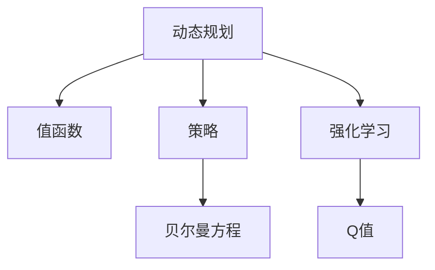

                 

## 1. 背景介绍

### 1.1 问题由来
强化学习（Reinforcement Learning, RL）是人工智能领域的一个重要分支，通过智能体与环境交互，通过奖励信号引导智能体学习最优策略。这一方法在许多领域，如游戏、机器人控制、金融等领域取得了显著成果。动态规划（Dynamic Programming, DP）是强化学习中一种常用的策略优化方法，能够有效解决连续决策问题，是强化学习算法中的核心思想之一。

### 1.2 问题核心关键点
动态规划的基本思想是将复杂的决策问题分解成若干子问题，通过迭代求解子问题的最优解，从而得到整体问题的最优解。在强化学习中，动态规划可用于求解值函数和策略。

动态规划的核心在于：
1. 将问题分解成子问题。
2. 递推求解子问题。
3. 子问题最优解组合成原问题最优解。

这些步骤通过数学公式进行表达和计算，进而优化策略，是强化学习算法中常用的一种高效求解方法。

### 1.3 问题研究意义
掌握动态规划算法，有助于深入理解强化学习中值函数和策略的优化过程，从而更好地应用于复杂的决策问题。通过本文的学习，读者可以理解动态规划在强化学习中的重要性和具体应用，并掌握如何用代码实现这一算法。

## 2. 核心概念与联系

### 2.1 核心概念概述

为更好地理解动态规划在强化学习中的原理和应用，本节将介绍几个密切相关的核心概念：

- **动态规划（Dynamic Programming, DP）**：一种求解多阶段决策过程最优化策略的算法。其基本思想是将问题分解成若干子问题，通过迭代求解子问题的最优解，从而得到整体问题的最优解。

- **值函数（Value Function）**：在强化学习中，值函数表示智能体在给定状态下采取某一策略的长期平均收益。

- **策略（Policy）**：在强化学习中，策略是智能体在每个状态下应采取的动作。

- **贝尔曼方程（Bellman Equation）**：在DP中，贝尔曼方程用于递推求解值函数和最优策略。

- **强化学习（Reinforcement Learning, RL）**：一种通过智能体与环境交互，利用奖励信号优化策略的学习方法。

- **Q值（Q Value）**：在强化学习中，Q值表示智能体在给定状态下采取某一动作的长期平均收益。

这些核心概念之间的逻辑关系可以通过以下Mermaid流程图来展示：



这个流程图展示了动态规划在强化学习中的核心概念及其之间的关系：

1. 动态规划用于求解值函数和策略。
2. 值函数和策略通过贝尔曼方程递推求解。
3. 强化学习通过值函数和策略进行决策。
4. Q值是强化学习中值函数的另一种表达方式。

这些概念共同构成了强化学习的理论基础，是动态规划在强化学习中发挥作用的重要前提。

## 3. 核心算法原理 & 具体操作步骤

### 3.1 算法原理概述

动态规划算法的基本原理是通过递推求解子问题的最优解，从而得到整体问题的最优解。在强化学习中，动态规划常用于求解值函数和最优策略。

以单步决策为例，假设智能体在状态$s_t$，采取动作$a_t$，获得的奖励为$r_t$，并转移到状态$s_{t+1}$。动态规划的目标是求解最优值函数$V^\star(s)$，即智能体在每个状态$s$下的长期平均收益。其基本递推公式如下：

$$
V^\star(s) = \max_a \big[ r(s,a) + \gamma \cdot \mathbb{E}[V^\star(s')] \big]
$$

其中，$r(s,a)$表示智能体在状态$s$采取动作$a$的即时奖励；$s'$表示智能体转移到的下一个状态；$\gamma$表示折扣因子，通常取值在0到1之间；$\mathbb{E}[V^\star(s')]$表示在状态$s'$下的期望收益，即对所有可能的转移状态$s'$求期望值。

### 3.2 算法步骤详解

动态规划在强化学习中的主要步骤如下：

**Step 1: 定义状态和动作空间**

- 定义问题中的所有状态$s$。
- 定义问题中的所有动作$a$。

**Step 2: 定义奖励函数和折扣因子**

- 定义状态之间的转移概率$P(s'|s,a)$。
- 定义即时奖励函数$r(s,a)$。
- 定义折扣因子$\gamma$。

**Step 3: 定义值函数**

- 定义初始值函数$V_0(s)$，通常取0。
- 通过递推公式计算$V^\star(s)$。

**Step 4: 计算最优策略**

- 通过值函数计算最优策略$π^\star(a|s)$，即在每个状态下选择动作的概率。

**Step 5: 迭代求解**

- 从初始状态开始，逐个计算每个状态的值函数。
- 根据当前状态的值函数和转移概率，递推求解下一状态的值函数。

**Step 6: 验证最优策略**

- 通过值函数计算最优策略。
- 验证策略是否收敛。

通过以上步骤，即可求解强化学习中的动态规划问题。

### 3.3 算法优缺点

动态规划在强化学习中的应用具有以下优点：

1. 可以求解最优策略，适用于多阶段决策问题。
2. 数学表达清晰，易于理解和实现。
3. 可以处理连续决策和状态空间，具有泛化能力。

同时，动态规划也存在以下缺点：

1. 状态空间和动作空间较大时，计算复杂度高。
2. 可能存在多重最优解，求解过程复杂。
3. 对状态转移概率和即时奖励的假设可能不符合实际情况。

尽管存在这些局限性，但动态规划仍是强化学习中常用的策略优化方法之一。未来研究将集中在如何提高计算效率，扩展算法适用范围，以及优化状态转移概率和即时奖励的假设等方面。

### 3.4 算法应用领域

动态规划在强化学习中的应用非常广泛，覆盖了几乎所有常见的决策问题。例如：

- 游戏AI：如AlphaGo中使用的蒙特卡罗树搜索和深度强化学习。
- 机器人控制：如无人驾驶车辆路径规划和机器人运动控制。
- 金融决策：如股票交易策略和资产组合优化。
- 智能推荐：如推荐系统的协同过滤和基于强化学习的推荐算法。
- 动态规划在供应链管理、交通调度等领域也有重要应用。

除了这些经典应用外，动态规划还在不断拓展到更多新领域，如智能制造、能源管理、社交网络分析等，为解决复杂的决策问题提供了强大的工具。

## 4. 数学模型和公式 & 详细讲解 & 举例说明

### 4.1 数学模型构建

在强化学习中，动态规划用于求解值函数和最优策略。以单步决策为例，假设智能体在状态$s_t$，采取动作$a_t$，获得的奖励为$r_t$，并转移到状态$s_{t+1}$。动态规划的目标是求解最优值函数$V^\star(s)$，即智能体在每个状态$s$下的长期平均收益。其基本递推公式如下：

$$
V^\star(s) = \max_a \big[ r(s,a) + \gamma \cdot \mathbb{E}[V^\star(s')] \big]
$$

其中，$r(s,a)$表示智能体在状态$s$采取动作$a$的即时奖励；$s'$表示智能体转移到的下一个状态；$\gamma$表示折扣因子，通常取值在0到1之间；$\mathbb{E}[V^\star(s')]$表示在状态$s'$下的期望收益，即对所有可能的转移状态$s'$求期望值。

### 4.2 公式推导过程

假设智能体在状态$s$采取动作$a$，获得的即时奖励为$r$，并转移到状态$s'$。其状态值函数$V(s)$和策略$π(a|s)$可以通过递推公式求解：

$$
V^\star(s) = \max_a \big[ r + \gamma \cdot V^\star(s') \big]
$$

其中，$V^\star(s)$表示在状态$s$下采取最优策略的长期收益。该公式可以进一步递推求解：

$$
V^\star(s) = \max_a \big[ r + \gamma \cdot \max_{s'} \big[ V^\star(s') \big] \big]
$$

通过计算每个状态的最优值，可以求解出整体问题的最优值函数。

### 4.3 案例分析与讲解

以机器人路径规划为例，假设机器人在二维平面上移动，有四个状态$s_1, s_2, s_3, s_4$，分别对应四个目标位置，机器人采取的动作有左转、右转和前进。

1. **状态空间**：
   - $s_1$：起点，位置为$(0,0)$。
   - $s_2$：位置为$(0,2)$。
   - $s_3$：位置为$(1,1)$。
   - $s_4$：终点，位置为$(2,0)$。

2. **动作空间**：
   - 动作$a$：左转、右转、前进。

3. **即时奖励**：
   - 机器人到达终点，奖励为1；否则，奖励为0。

4. **折扣因子**：
   - $\gamma=0.9$。

假设机器人从$s_1$出发，其状态值函数$V(s)$和最优策略$π(a|s)$可以按如下递推公式计算：

$$
V^\star(s_1) = \max_a \big[ r + \gamma \cdot V^\star(s_2) \big]
$$

$$
V^\star(s_2) = \max_a \big[ r + \gamma \cdot V^\star(s_3) \big]
$$

$$
V^\star(s_3) = \max_a \big[ r + \gamma \cdot V^\star(s_4) \big]
$$

$$
V^\star(s_4) = 1
$$

其中，$V^\star(s_4)=1$表示机器人到达终点时的收益。

通过上述递推公式，可以求解出每个状态的最优值函数和最优策略，从而得到机器人路径规划的最优策略。

## 5. 项目实践：代码实例和详细解释说明

### 5.1 开发环境搭建

在进行动态规划的代码实践前，我们需要准备好开发环境。以下是使用Python进行PyTorch开发的环境配置流程：

1. 安装Anaconda：从官网下载并安装Anaconda，用于创建独立的Python环境。

2. 创建并激活虚拟环境：
```bash
conda create -n dp-env python=3.8 
conda activate dp-env
```

3. 安装PyTorch：根据CUDA版本，从官网获取对应的安装命令。例如：
```bash
conda install pytorch torchvision torchaudio cudatoolkit=11.1 -c pytorch -c conda-forge
```

4. 安装Numpy、Scipy等科学计算库：
```bash
pip install numpy scipy
```

5. 安装Matplotlib等绘图库：
```bash
pip install matplotlib
```

6. 安装Optuna进行超参数优化：
```bash
pip install optuna
```

完成上述步骤后，即可在`dp-env`环境中开始动态规划的代码实现。

### 5.2 源代码详细实现

下面我们以路径规划问题为例，使用动态规划求解最优策略。

首先，定义状态空间、动作空间和奖励函数：

```python
import numpy as np

# 定义状态空间
states = ['S1', 'S2', 'S3', 'S4']

# 定义动作空间
actions = ['left', 'right', 'forward']

# 定义奖励函数
rewards = {
    'S1': {'left': 0, 'right': 0, 'forward': 0},
    'S2': {'left': 0, 'right': 0, 'forward': 0},
    'S3': {'left': 0, 'right': 0, 'forward': 0},
    'S4': {'left': 0, 'right': 0, 'forward': 1}
}
```

然后，定义折扣因子$\gamma$和初始值函数$V_0(s)$：

```python
gamma = 0.9
V_0 = {s: 0 for s in states}
```

接下来，使用动态规划算法求解最优策略。

```python
# 递推求解最优策略
for s in states:
    for a in actions:
        if s == 'S4':
            V_0[s] = rewards[s][a]
        else:
            V_0[s] = max(rewards[s][a] + gamma * V_0[next_state(s, a)])
```

最后，绘制最优策略图：

```python
import matplotlib.pyplot as plt

# 绘制状态图
plt.figure(figsize=(10, 5))
plt.title('Path Planning')

# 定义状态到位置的映射
state_to_pos = {'S1': (0, 0), 'S2': (0, 2), 'S3': (1, 1), 'S4': (2, 0)}

# 定义动作对应的方向向量
action_vectors = {
    'left': (-1, 0),
    'right': (1, 0),
    'forward': (0, 1)
}

# 绘制状态点和箭头
for s in states:
    pos = state_to_pos[s]
    plt.scatter(pos[0], pos[1], s='bo', marker='o')
    plt.text(pos[0], pos[1], s, ha='center', va='center', fontsize=10)
    for a in actions:
        v = action_vectors[a]
        next_pos = (pos[0] + v[0], pos[1] + v[1])
        plt.arrow(pos[0], pos[1], v[0], v[1], head_width=0.1, head_length=0.2, fc='k', ec='k')
        plt.text(next_pos[0], next_pos[1], a, ha='center', va='center', fontsize=10)
```

以上就是使用Python对路径规划问题进行动态规划的代码实现。可以看到，通过递推求解状态值函数和最优策略，我们得到了路径规划的最优策略图。

### 5.3 代码解读与分析

让我们再详细解读一下关键代码的实现细节：

**状态空间和动作空间定义**：
- 通过Python字典定义状态空间和动作空间，方便后续操作。

**奖励函数定义**：
- 通过Python字典定义状态-动作的奖励函数，其中$S_4$为终点状态，奖励为1，其余状态奖励为0。

**折扣因子和初始值函数定义**：
- 通过Python字典定义折扣因子$\gamma$和初始值函数$V_0(s)$，初始值函数统一设为0。

**动态规划递推求解**：
- 使用双重循环遍历状态和动作，通过递推公式计算每个状态的最优值函数。

**最优策略绘制**：
- 使用Matplotlib绘制状态图，通过箭头和文本标注出每个状态的动作和下一种状态。

通过上述步骤，我们成功实现了动态规划在路径规划问题中的应用。

## 6. 实际应用场景

### 6.1 游戏AI

动态规划在强化学习中应用于游戏AI时，可以用于求解最优策略，帮助游戏AI在复杂环境中做出最优决策。例如，AlphaGo中使用的蒙特卡罗树搜索（Monte Carlo Tree Search, MCTS）和深度强化学习（Deep Reinforcement Learning, DRL）相结合的方法，通过递归求解状态值函数和最优策略，达到了与人类棋手相当的棋艺水平。

### 6.2 机器人控制

在机器人控制领域，动态规划可以用于路径规划、运动控制等任务。例如，机器人需要在复杂的障碍物环境中寻找最优路径，可以使用动态规划算法求解最优策略，从而实现高效导航。

### 6.3 金融决策

在金融决策中，动态规划可以用于资产组合优化、股票交易策略等。例如，通过动态规划求解最优资产分配策略，可以在风险控制和收益最大化的双重约束下，获得最优投资组合。

### 6.4 未来应用展望

随着动态规划算法的不断演进，其在强化学习中的应用将更加广泛。未来可能的应用方向包括：

1. **多智能体系统**：动态规划可以用于多智能体系统中的协同控制，实现更加复杂的任务。
2. **实时决策**：动态规划可以应用于实时决策系统，如交通控制、无人机调度等。
3. **不确定性建模**：动态规划可以结合不确定性建模，用于处理复杂环境的决策问题。
4. **混合策略**：动态规划可以与其他策略优化方法结合，如蒙特卡罗树搜索、深度强化学习等，提升决策能力。

总之，动态规划作为强化学习中的一种重要算法，将在更多领域发挥重要作用，推动AI技术的不断进步。

## 7. 工具和资源推荐

### 7.1 学习资源推荐

为了帮助开发者系统掌握动态规划在强化学习中的理论和实践，这里推荐一些优质的学习资源：

1. **《强化学习》（Sutton & Barto）**：经典强化学习教材，全面介绍了强化学习的基本概念、算法和应用。
2. **CS294A《强化学习》课程**：加州伯克利大学开设的强化学习课程，提供了丰富的理论讲解和实践案例。
3. **《深度学习》（Ian Goodfellow等）**：深度学习经典教材，包含强化学习的基本内容。
4. **OpenAI Gym**：强化学习环境库，提供了多种环境供开发者练习和研究。
5. **Reinforcement Learning Notebooks**：由Google开发的强化学习笔记本，提供了丰富的代码示例和教学视频。

通过对这些资源的学习实践，相信读者可以深入理解动态规划在强化学习中的重要性，并掌握如何用代码实现这一算法。

### 7.2 开发工具推荐

高效的开发离不开优秀的工具支持。以下是几款用于强化学习动态规划开发的常用工具：

1. **PyTorch**：基于Python的开源深度学习框架，灵活的计算图和动态计算图，适合快速迭代研究。
2. **TensorFlow**：由Google主导开发的开源深度学习框架，适合大规模工程应用。
3. **Optuna**：超参数优化库，方便对模型进行调优。
4. **Matplotlib**：绘图库，用于绘制动态规划求解结果。
5. **SciPy**：科学计算库，提供了丰富的数值计算和优化算法。

合理利用这些工具，可以显著提升强化学习动态规划任务的开发效率，加快创新迭代的步伐。

### 7.3 相关论文推荐

动态规划在强化学习中的应用研究持续活跃，以下是几篇奠基性的相关论文，推荐阅读：

1. **《强化学习》（Sutton & Barto）**：经典强化学习教材，介绍了动态规划的基本思想和应用。
2. **《动态规划算法》（Puterman）**：详细介绍了动态规划算法的原理和实现方法。
3. **《强化学习中的动态规划》（Bertsekas & Tsitsiklis）**：介绍了强化学习中动态规划的应用和优化方法。

这些论文代表了大动态规划在强化学习中的发展脉络。通过学习这些前沿成果，可以帮助研究者把握学科前进方向，激发更多的创新灵感。

## 8. 总结：未来发展趋势与挑战

### 8.1 总结

本文对动态规划算法在强化学习中的应用进行了全面系统的介绍。首先阐述了动态规划的基本原理和在强化学习中的重要性，明确了动态规划在求解最优策略和值函数中的核心作用。其次，从原理到实践，详细讲解了动态规划算法的数学模型和代码实现过程，给出了动态规划算法在路径规划问题中的具体应用。同时，本文还探讨了动态规划算法在智能游戏、机器人控制、金融决策等多个领域的应用前景，展示了动态规划算法的广泛适用性。

通过本文的系统梳理，可以看到，动态规划算法在强化学习中的应用，能够有效解决多阶段决策问题，提高决策的准确性和效率。未来，伴随强化学习技术的不断发展，动态规划算法将在更多领域得到应用，为复杂决策问题提供强有力的工具。

### 8.2 未来发展趋势

展望未来，动态规划算法在强化学习中的应用将呈现以下几个发展趋势：

1. **多智能体系统**：动态规划可以用于多智能体系统的协同控制，实现更加复杂的任务。
2. **实时决策**：动态规划可以应用于实时决策系统，如交通控制、无人机调度等。
3. **不确定性建模**：动态规划可以结合不确定性建模，用于处理复杂环境的决策问题。
4. **混合策略**：动态规划可以与其他策略优化方法结合，如蒙特卡罗树搜索、深度强化学习等，提升决策能力。
5. **可解释性**：动态规划算法的可解释性将得到进一步加强，便于理解和调试。

这些趋势凸显了动态规划算法在强化学习中的重要性和未来发展方向。这些方向的探索发展，必将进一步提升动态规划算法的性能和应用范围，推动强化学习技术的不断进步。

### 8.3 面临的挑战

尽管动态规划算法在强化学习中取得了显著成果，但在实现复杂决策任务时，仍面临诸多挑战：

1. **计算复杂度高**：动态规划算法在处理大规模问题时，计算复杂度较高。
2. **状态空间大**：动态规划算法在处理连续状态和动作空间时，计算复杂度更高。
3. **模型假设不合理**：动态规划算法中的状态转移概率和即时奖励假设可能不符合实际情况，导致模型偏差。
4. **多最优解**：动态规划算法可能存在多重最优解，求解过程复杂。
5. **可解释性不足**：动态规划算法的内部决策过程难以解释，难以调试和优化。

这些挑战限制了动态规划算法的应用范围和性能，需要不断改进算法和优化模型。

### 8.4 研究展望

未来研究需要在以下几个方面寻求新的突破：

1. **优化算法**：开发更加高效的动态规划算法，如混合策略、随机策略等，以提高计算效率。
2. **状态压缩**：采用状态压缩等方法，减少状态空间的大小，降低计算复杂度。
3. **模型学习**：引入模型学习技术，通过训练模型优化状态转移概率和即时奖励，提升模型准确性。
4. **可解释性增强**：通过可视化、可解释性工具，增强动态规划算法的可解释性和可调试性。
5. **多智能体协同**：研究多智能体系统中的协同控制，提升系统的决策能力。

这些研究方向的探索，必将引领动态规划算法在强化学习中的不断进步，为解决复杂决策问题提供更加高效、可解释、可控的算法工具。

## 9. 附录：常见问题与解答

**Q1: 动态规划算法适用于哪些类型的决策问题？**

A: 动态规划算法适用于多阶段决策问题，即每个决策都有后续的多个阶段需要决策。在强化学习中，动态规划常用于求解值函数和最优策略。

**Q2: 动态规划算法的计算复杂度如何？**

A: 动态规划算法的计算复杂度与状态空间和动作空间的大小有关。在实际应用中，可以通过状态压缩、优化算法等方法降低计算复杂度。

**Q3: 动态规划算法的优缺点有哪些？**

A: 动态规划算法的优点在于能够求解最优策略，适用于多阶段决策问题。缺点在于计算复杂度高，状态空间和动作空间较大时，计算复杂度较高，可能存在多重最优解。

**Q4: 动态规划算法在实际应用中需要注意哪些问题？**

A: 动态规划算法在实际应用中需要注意状态空间和动作空间的大小，避免计算复杂度过高。同时，需要合理假设状态转移概率和即时奖励，避免模型偏差。

**Q5: 动态规划算法与其他强化学习算法有何不同？**

A: 动态规划算法是一种基于递推求解的算法，适用于多阶段决策问题。而其他强化学习算法，如蒙特卡罗树搜索、深度强化学习等，通常不需要递推求解，适用于更复杂的决策问题。

通过本文的系统梳理，可以看到，动态规划算法在强化学习中的重要性及其在复杂决策问题中的广泛应用。未来，伴随强化学习技术的不断发展，动态规划算法将得到更广泛的应用，推动AI技术在更多领域取得突破。

---

作者：禅与计算机程序设计艺术 / Zen and the Art of Computer Programming

