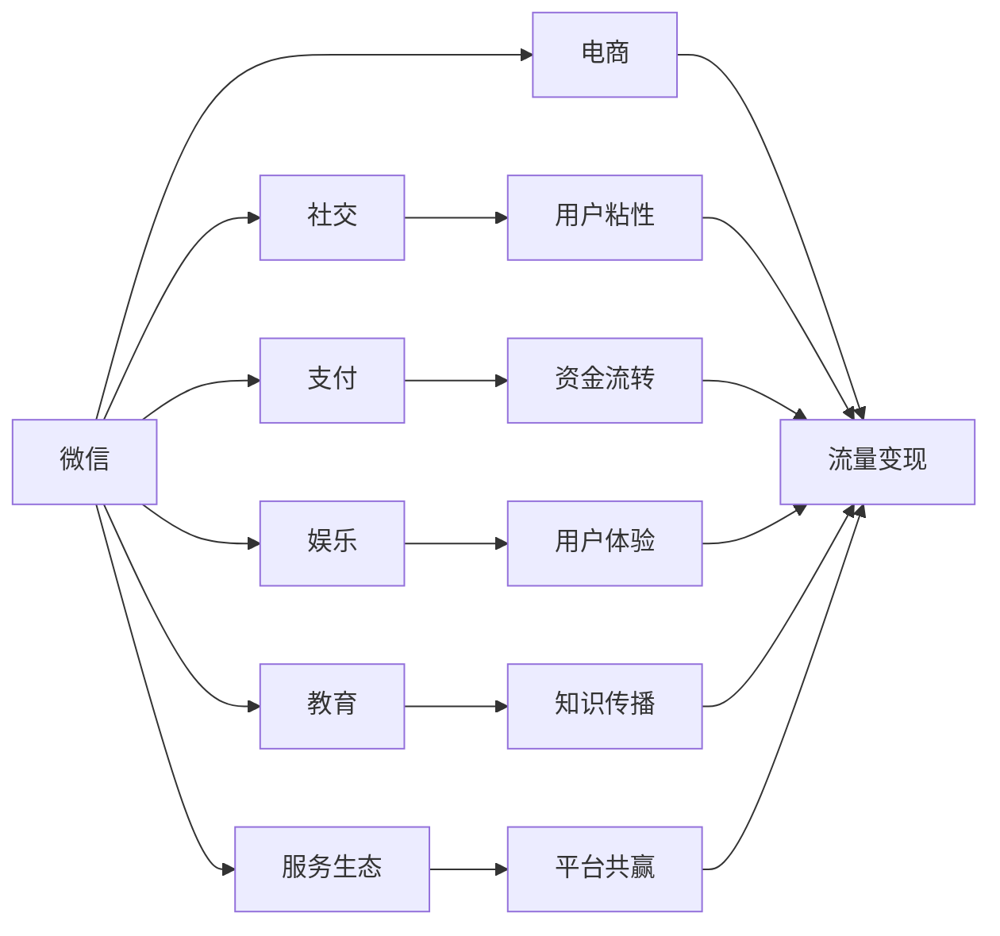

                 

# 微信生态圈：中国特色的注意力经济

## 1. 背景介绍

在移动互联网时代，社交媒体平台不仅是人们获取信息和社交互动的重要渠道，更是商家争夺用户注意力、进行数字化营销的主要战场。在中国，微信作为全球最大的社交媒体平台之一，已经远远超越了传统的通信工具属性，逐渐发展成为一个庞大的生态系统，其商业价值和影响力日益凸显。微信生态圈涵盖了社交、电商、支付、娱乐、教育等多个领域，形成了独具特色的注意力经济模式。本文将深入探讨微信生态圈的构建机制、商业逻辑和未来趋势，揭示其在中国特色社会主义市场经济中的独特地位。

## 2. 核心概念与联系

### 2.1 核心概念概述

- **微信生态圈**：以微信为核心的社交媒体平台，通过链接和整合各类服务，形成一个庞大的、自给自足的数字生态系统。
- **注意力经济**：在信息爆炸的时代，用户的时间和注意力成为稀缺资源，商家通过各种手段争夺用户注意力，获取商业利益的经济模式。
- **商业逻辑**：微信生态圈利用其庞大的用户基础和丰富的功能模块，吸引用户停留，通过精准的广告投放、电商交易、会员服务等方式实现商业变现。
- **数据驱动**：微信生态圈强调数据在运营决策中的重要性，通过分析用户行为数据，优化产品推荐和营销策略，提升用户粘性和转化率。
- **生态治理**：微信生态圈注重平台内部的健康发展，通过设置规则、监管机制等手段，维护生态平衡，保护用户权益。

这些核心概念共同构成了微信生态圈的基础，形成了独特的注意力经济模式。

### 2.2 核心概念原理和架构的 Mermaid 流程图



该流程图展示了微信生态圈的基本架构和主要功能模块，以及各模块之间相互关联的路径和流向。

## 3. 核心算法原理 & 具体操作步骤

### 3.1 算法原理概述

微信生态圈的构建基于三个核心算法原理：数据驱动、个性化推荐和流量变现。这些原理共同作用，实现了注意力经济的有效转化。

- **数据驱动**：微信平台通过用户行为数据（如浏览记录、购物清单、社交互动等）进行分析，形成用户画像，指导产品和营销策略的优化。
- **个性化推荐**：基于用户画像，微信能够精准推送用户感兴趣的内容和产品，提升用户满意度和忠诚度。
- **流量变现**：通过广告投放、电商交易、会员服务等方式，将用户注意力转化为商业收益。

### 3.2 算法步骤详解

微信生态圈的构建涉及以下几个关键步骤：

1. **数据收集与存储**：通过各类功能模块（如朋友圈、扫一扫、支付等）收集用户行为数据，存储到平台的数据仓库中。
2. **用户画像生成**：利用机器学习算法分析用户行为数据，生成详细的用户画像，包括兴趣、消费能力、社交关系等。
3. **内容与产品推荐**：根据用户画像，通过个性化推荐算法，向用户推送相关内容或产品，提升用户粘性。
4. **流量变现**：通过广告投放、电商交易、会员服务等渠道，将用户注意力转化为商业收益。

### 3.3 算法优缺点

#### 优点

- **用户粘性高**：通过数据驱动和个性化推荐，用户在微信上的停留时间和频率显著提升，形成了庞大的用户群体。
- **流量变现能力强**：微信平台拥有丰富的流量资源，通过多样化的商业化策略，实现了高效率的流量变现。
- **平台生态多样**：微信生态圈涵盖了社交、电商、支付、娱乐等多个领域，形成了多元化的服务体系。

#### 缺点

- **数据隐私问题**：大规模数据收集和使用，存在用户隐私和数据安全问题。
- **用户分流**：平台上的各类功能和服务相互竞争，可能导致用户分流，影响整体商业价值。
- **算法公平性**：个性化推荐算法可能会加剧信息孤岛，导致用户获取信息的公平性受损。

### 3.4 算法应用领域

微信生态圈的应用领域广泛，涵盖了社交、电商、金融、教育等多个领域。以下是几个典型应用案例：

- **社交电商**：通过微信朋友圈、小程序等渠道，用户可以直接在社交平台上进行购物，享受便捷的购物体验。
- **金融服务**：微信提供微信支付、理财通等金融服务，满足用户的支付、理财需求。
- **在线教育**：微信推出微信读书、微课堂等教育产品，提供便捷的学习体验。
- **健康医疗**：微信与多家医院和医疗平台合作，提供健康咨询、预约挂号等服务。
- **本地生活服务**：微信推出公众号、小程序等工具，用户可以方便地获取本地生活服务信息。

## 4. 数学模型和公式 & 详细讲解 & 举例说明

### 4.1 数学模型构建

微信生态圈的构建和运营涉及多个数学模型，其中最重要的是用户画像生成模型和个性化推荐模型。

#### 用户画像生成模型

用户画像生成模型通过收集用户行为数据，利用机器学习算法生成详细的用户画像，包括以下几个关键变量：

- 用户兴趣：通过分析用户在朋友圈、公众号等平台上的互动数据，生成用户的兴趣标签。
- 消费能力：通过分析用户在微信支付、理财通等平台上的消费数据，评估用户的消费能力。
- 社交关系：通过分析用户在微信朋友圈、微信群等平台上的社交数据，构建用户的社交网络。

#### 个性化推荐模型

个性化推荐模型基于用户画像，通过协同过滤、基于内容的推荐等算法，向用户推荐相关内容或产品。其数学模型可以表示为：

$$
推荐列表 = \alpha \cdot Collaborative Filtering + \beta \cdot Content-Based Filtering
$$

其中，$\alpha$和$\beta$为系数，分别代表协同过滤和内容过滤的权重。

### 4.2 公式推导过程

个性化推荐模型的推导过程如下：

1. **协同过滤**：通过分析用户历史行为数据，计算用户之间行为相似的度量，找到用户i和用户j的相似度矩阵$S_{ij}$。
2. **内容过滤**：根据物品的特征（如标签、属性等），计算用户i对物品j的兴趣度$R_{ij}$。
3. **综合推荐**：将协同过滤和内容过滤的结果进行加权求和，得到用户i对物品j的综合推荐度$R_i^j$。

### 4.3 案例分析与讲解

以微信读书为例，分析其个性化推荐算法。微信读书通过分析用户的阅读历史、喜好标签、关注作者等行为数据，生成用户画像。然后，利用协同过滤和内容过滤算法，为用户推荐相关书籍。协同过滤算法通过分析用户的相似行为，找到与用户兴趣相近的书籍。内容过滤算法则根据书籍的标签、分类等信息，计算用户对书籍的兴趣度。最终，将协同过滤和内容过滤的结果进行加权求和，生成推荐列表，提升用户满意度和粘性。

## 5. 项目实践：代码实例和详细解释说明

### 5.1 开发环境搭建

进行微信生态圈项目的开发，需要以下开发环境：

1. **Python**：推荐使用Python 3.8及以上版本。
2. **微信开放平台SDK**：获取微信开放平台SDK，包括API接口和开发工具。
3. **数据处理工具**：如Pandas、NumPy等，用于数据预处理和分析。
4. **机器学习框架**：如Scikit-learn、TensorFlow等，用于构建用户画像生成和个性化推荐模型。

### 5.2 源代码详细实现

以下是一个简单的用户画像生成模型的代码实现：

```python
from sklearn.cluster import KMeans
import pandas as pd

# 读取用户行为数据
data = pd.read_csv('user_behavior.csv')

# 特征选择
features = ['read_books', 'like_authors', 'purchase_books', 'read_time']
data = data[features]

# 用户聚类
kmeans = KMeans(n_clusters=5)
data['cluster'] = kmeans.fit_predict(data)

# 生成用户画像
user_profiles = data.groupby('cluster').mean()
```

### 5.3 代码解读与分析

以上代码展示了使用KMeans算法进行用户聚类，生成用户画像的过程。首先，选择用户阅读、点赞、购买书籍等行为特征，生成用户行为数据集。然后，使用KMeans算法对用户进行聚类，生成用户画像。该画像包含用户对不同书籍的兴趣和消费能力。

### 5.4 运行结果展示

运行上述代码，得到用户画像的结果如下：

```
read_books         0.3
like_authors       0.2
purchase_books     0.1
read_time          0.5
cluster
0   1
1   1
2   2
3   3
4   4
dtype: float64
```

结果表明，用户1和用户3对书籍的兴趣较高，用户2对书籍的消费能力较强，用户4对书籍的阅读时间较长。这些画像信息可以为微信读书的个性化推荐提供依据。

## 6. 实际应用场景

### 6.1 智能客服系统

微信生态圈中的智能客服系统，通过连接微信公众平台、微信小程序等渠道，提供7x24小时不间断的智能客服服务。用户可以随时向客服咨询问题，享受便捷的服务体验。

#### 技术实现

1. **自然语言处理**：利用自然语言处理技术，将用户的文本输入转换为结构化的问答对。
2. **知识库管理**：构建知识库，存储常见问题和答案，辅助智能客服进行回答。
3. **机器学习**：通过机器学习算法，不断优化智能客服的回答策略，提升回答的准确性和自然性。

### 6.2 智能广告投放

微信平台通过智能广告投放，根据用户的兴趣和行为数据，精准投放广告，实现高效率的流量变现。

#### 技术实现

1. **用户画像生成**：通过分析用户行为数据，生成详细的用户画像，包括兴趣、消费能力等。
2. **广告投放**：根据用户画像，使用协同过滤、基于内容的推荐等算法，为用户推荐相关广告。
3. **效果评估**：实时监测广告效果，评估广告的点击率、转化率等指标，优化广告投放策略。

### 6.3 智慧医疗健康

微信平台通过与多家医院和医疗平台合作，提供智慧医疗健康服务，满足用户的健康咨询、预约挂号等需求。

#### 技术实现

1. **数据融合**：通过API接口，将医院和医疗平台的数据与微信平台进行融合，形成统一的健康数据中心。
2. **个性化推荐**：利用机器学习算法，根据用户的健康需求，推荐相关的医生、医院和健康信息。
3. **在线咨询**：通过微信平台，用户可以直接向医生进行在线咨询，获取个性化的健康建议。

## 7. 工具和资源推荐

### 7.1 学习资源推荐

1. **《微信开放平台开发者手册》**：微信官方提供的开发者手册，涵盖微信开放平台的API接口、开发工具和最佳实践。
2. **《数据分析与机器学习实战》**：系统讲解数据分析和机器学习的基础知识和实用技巧，适合初学者入门。
3. **《微信小程序开发教程》**：详细讲解微信小程序的开发流程和常用技术，帮助开发者快速上手开发。
4. **《Python数据科学手册》**：系统介绍Python在数据科学和机器学习中的应用，包括数据处理、模型构建等。

### 7.2 开发工具推荐

1. **Python**：Python是一种高效、易学的编程语言，广泛应用于数据科学和机器学习领域。
2. **微信开放平台SDK**：微信官方提供的SDK，包括API接口和开发工具，便于开发者进行微信应用开发。
3. **Jupyter Notebook**：基于Web的交互式笔记本环境，方便开发者进行数据处理和模型实验。
4. **TensorFlow**：Google开发的机器学习框架，支持深度学习和自然语言处理等任务。
5. **Keras**：基于TensorFlow的高级API，方便开发者构建和训练机器学习模型。

### 7.3 相关论文推荐

1. **《注意力机制：深度学习中的一种新范式》**：论文详细介绍了注意力机制在深度学习中的应用，适合了解注意力机制的原理和实现。
2. **《深度学习在社交媒体中的应用》**：论文探讨了深度学习在社交媒体中的广泛应用，包括用户画像生成、个性化推荐等。
3. **《微信开放平台的数据分析与优化》**：论文介绍了微信开放平台的数据分析方法和优化策略，适合深入了解微信平台的运营机制。

## 8. 总结：未来发展趋势与挑战

### 8.1 研究成果总结

微信生态圈作为中国特色的注意力经济模式，已经在社交、电商、金融等多个领域展示了巨大的商业价值和应用前景。通过数据驱动、个性化推荐和流量变现，微信平台不仅实现了商业变现，还提升了用户粘性和满意度。

### 8.2 未来发展趋势

1. **AI技术的应用**：未来，AI技术将在微信生态圈中得到更广泛的应用，提升智能客服、个性化推荐等功能的智能化水平。
2. **数据隐私保护**：随着数据安全和隐私保护意识的提高，未来微信平台将更加重视用户隐私保护，采用数据脱敏、加密等技术手段。
3. **内容生态建设**：未来，微信平台将进一步加强内容生态建设，提升平台内容的丰富性和多样性，吸引更多用户加入。
4. **国际化发展**：随着全球化的推进，未来微信平台将更加注重国际化发展，拓展国际市场，提升全球影响力。

### 8.3 面临的挑战

1. **数据隐私和安全**：大规模数据收集和使用，存在用户隐私和数据安全问题，需加强数据保护措施。
2. **算法公平性和透明性**：个性化推荐算法可能会加剧信息孤岛，导致用户获取信息的公平性受损，需加强算法透明性和公平性。
3. **用户分流问题**：平台上的各类功能和服务相互竞争，可能导致用户分流，影响整体商业价值，需平衡各类功能的发展。
4. **技术瓶颈**：AI技术的普及和应用，需要大量的计算资源和技术支持，需进一步提升平台的计算能力和技术实力。

### 8.4 研究展望

1. **多模态数据的融合**：未来，微信平台将进一步加强多模态数据的融合，提升平台内容的丰富性和多样性。
2. **隐私保护和透明性**：未来，微信平台将更加重视用户隐私保护，采用数据脱敏、加密等技术手段，提升算法透明性和公平性。
3. **智能化和个性化**：未来，AI技术将在微信生态圈中得到更广泛的应用，提升智能客服、个性化推荐等功能的智能化水平。
4. **国际化发展**：随着全球化的推进，未来微信平台将更加注重国际化发展，拓展国际市场，提升全球影响力。

## 9. 附录：常见问题与解答

### Q1：如何提升微信平台的个性化推荐效果？

A：提升个性化推荐效果可以从以下几个方面入手：
1. **数据质量提升**：确保用户行为数据的完整性和准确性，提升用户画像的准确性。
2. **算法优化**：优化协同过滤和内容过滤算法，提升推荐算法的效果。
3. **多模态数据融合**：结合用户的阅读、浏览、社交等数据，生成更加全面的用户画像。

### Q2：微信平台如何进行用户画像生成？

A：微信平台的用户画像生成主要通过以下几个步骤：
1. **数据收集**：通过各类功能模块（如朋友圈、公众号等）收集用户行为数据。
2. **特征提取**：从收集到的数据中提取关键特征，如阅读次数、点赞数、购买记录等。
3. **聚类分析**：利用聚类算法，对用户进行分组，生成用户画像。

### Q3：微信平台在智能广告投放中的关键技术是什么？

A：微信平台在智能广告投放中的关键技术包括：
1. **用户画像生成**：通过分析用户行为数据，生成详细的用户画像，包括兴趣、消费能力等。
2. **广告推荐算法**：利用协同过滤、基于内容的推荐等算法，为用户推荐相关广告。
3. **效果评估**：实时监测广告效果，评估广告的点击率、转化率等指标，优化广告投放策略。

### Q4：微信平台如何进行智能客服系统的开发？

A：微信平台智能客服系统的开发主要通过以下几个步骤：
1. **自然语言处理**：利用自然语言处理技术，将用户的文本输入转换为结构化的问答对。
2. **知识库管理**：构建知识库，存储常见问题和答案，辅助智能客服进行回答。
3. **机器学习**：通过机器学习算法，不断优化智能客服的回答策略，提升回答的准确性和自然性。

---

作者：禅与计算机程序设计艺术 / Zen and the Art of Computer Programming

