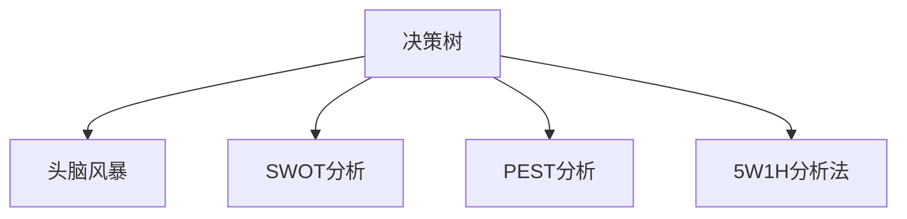

                 

# 思维工具在管理中的实际应用

## 1. 背景介绍

### 1.1 问题由来
在快速变化的商业环境中，管理工作的复杂性和多样性不断增加。从战略规划、资源分配到日常运营，每一项决策都涉及对多方面信息的综合判断和处理。传统的管理工具和方法，如Excel、PPT、线性规划等，已逐渐显现出其局限性。如何有效整合信息、优化决策、提升管理效率，成为现代企业管理中的核心挑战。

### 1.2 问题核心关键点
为了应对这些挑战，思维工具应运而生。思维工具，基于数据科学、认知科学、心理学等多学科的知识和方法，为管理决策提供了一套系统化的思维框架和工具集。其核心在于通过科学的思维模型和分析方法，帮助管理者更好地理解和应对复杂问题，提升决策质量和管理效果。

## 2. 核心概念与联系

### 2.1 核心概念概述

本节将介绍几个关键的思维工具概念及其相互关系：

- **决策树**：一种将决策过程图形化的工具，通过节点和分支，直观地展示决策路径和可能的后果。
- **头脑风暴**：一种集体创造性思维过程，旨在通过发散性思维产生尽可能多的创意，以解决复杂问题。
- **SWOT分析**：一种战略规划工具，用于评估组织的优势(Strengths)、劣势(Weaknesses)、机会(Opportunities)和威胁(Threats)。
- **PEST分析**：一种宏观环境分析工具，用于评估政治(Political)、经济(Economic)、社会(Social)和技术(Technological)环境对组织的影响。
- **5W1H分析法**：一种问题分析工具，通过询问"What"、"Why"、"Who"、"Where"、"When"和"How"六个问题，全面了解问题的背景和细节。

这些核心概念通过以下Mermaid流程图连接起来，展示了它们之间的逻辑关系：



这个流程图展示了思维工具之间的逻辑联系：

1. **决策树**：用于直观展示决策路径和可能结果，基于具体问题结构化决策过程。
2. **头脑风暴**：在决策树提供框架的基础上，通过头脑风暴生成创意和解决方案。
3. **SWOT分析**：在头脑风暴生成的解决方案中，进行优势劣势机会威胁的全面评估，以形成整体战略规划。
4. **PEST分析**：在SWOT分析的基础上，考虑宏观环境因素，完善战略规划。
5. **5W1H分析法**：在战略规划的制定过程中，对问题的各个细节进行深入挖掘，为决策提供全面的信息。

这些工具共同构成了一个系统的思维框架，帮助管理者从宏观到微观，全面深入地分析问题，制定科学合理的决策。

## 3. 核心算法原理 & 具体操作步骤
### 3.1 算法原理概述

思维工具的核心原理基于系统化、结构化的思考方法和数据分析技术。其基本步骤包括：

1. **问题定义**：明确需要解决的问题，并将其转化为可操作的形式。
2. **数据收集**：收集与问题相关的数据和信息，形成数据集。
3. **数据处理**：对数据进行清洗、整理、分析，形成可操作的模型。
4. **工具应用**：选择合适的思维工具，进行问题分析和决策支持。
5. **结果评估**：对决策结果进行评估，检验其有效性和可行性。
6. **迭代优化**：根据评估结果，迭代优化决策过程和工具应用。

这些步骤构成了一个闭环的决策流程，确保决策的科学性和有效性。

### 3.2 算法步骤详解

以决策树和头脑风暴为例，详细介绍具体操作步骤：

**Step 1: 问题定义**
- 确定需要解决的问题，如新产品上市策略、供应链优化等。
- 将问题转化为具体的决策目标，如市场占有率、成本效益等。

**Step 2: 数据收集**
- 收集与问题相关的数据，如市场调研结果、历史销售数据、供应商信息等。
- 对数据进行清洗、整理，去除噪音和异常值。

**Step 3: 数据处理**
- 将数据进行分类、编码、标准化，准备输入模型。
- 使用数据分析方法，如回归分析、聚类分析等，发现数据规律和趋势。

**Step 4: 工具应用**
- 构建决策树模型，使用节点和分支描述决策路径和后果。
- 组织头脑风暴会议，生成尽可能多的解决方案和创意。
- 对头脑风暴生成的解决方案进行评估和筛选，选择最具可行性的方案。
- 在决策树中进行策略模拟和测试，验证解决方案的可行性和效果。

**Step 5: 结果评估**
- 对决策结果进行定量评估，如计算市场占有率、成本效益等指标。
- 进行定性评估，如调查用户满意度、供应商反馈等。
- 综合评估结果，判断决策效果是否符合预期。

**Step 6: 迭代优化**
- 根据评估结果，识别决策中的不足和改进点。
- 使用迭代方法，不断优化决策模型和工具应用。
- 反馈结果，调整问题定义和数据处理，重新进行决策过程。

### 3.3 算法优缺点

思维工具在管理决策中的应用具有以下优点：

1. **系统化思考**：通过结构化的流程和工具，帮助管理者全面、系统地分析问题，减少主观偏见。
2. **数据驱动决策**：基于数据和模型，支持客观、科学、量化的决策过程，减少决策错误。
3. **创新性思维**：通过头脑风暴等工具，激发创造性思维，产生更多元化的解决方案。
4. **协作性提升**：在头脑风暴和SWOT分析中，促进团队协作，集思广益，优化决策质量。

但同时，这些工具也存在一些局限性：

1. **数据依赖**：思维工具的效果高度依赖于数据的质量和数量，获取高质量数据的成本较高。
2. **复杂性高**：对于一些复杂问题，需要投入大量时间和精力进行数据分析和模型构建。
3. **适用范围有限**：思维工具适用于结构化、数据驱动的决策，对模糊、不确定性较大的问题可能效果有限。
4. **结果解释难度大**：模型和工具生成的结果往往需要较强的专业知识和解释能力，难以直接应用。
5. **实施难度大**：需要管理者和团队具备一定的数据科学和工具应用能力，实施门槛较高。

尽管存在这些局限，思维工具在管理中的应用仍具有重要意义。合理利用这些工具，可以帮助管理者提高决策质量，优化资源配置，提升管理效率。

### 3.4 算法应用领域

思维工具在多个管理领域都有广泛的应用，例如：

- **战略规划**：利用SWOT分析和PEST分析，评估组织的内外环境，制定长期战略规划。
- **项目管理和运营**：通过决策树和头脑风暴，优化项目流程，提升运营效率。
- **人力资源管理**：使用5W1H分析法，了解员工需求和组织结构，制定有效的人力资源策略。
- **市场营销**：运用决策树和头脑风暴，优化市场策略，提升产品竞争力。
- **财务管理和预算**：通过数据分析和PEST分析，优化财务决策，提升资金利用效率。
- **风险管理**：利用决策树和SWOT分析，评估和管理组织面临的风险。

这些应用场景展示了思维工具在管理中的强大潜力和广泛适用性，为管理者提供了一套科学的决策支持系统。

## 4. 数学模型和公式 & 详细讲解  
### 4.1 数学模型构建

本节将使用数学语言对决策树工具进行更加严格的刻画。

记决策树模型为 $T=(V,E)$，其中 $V$ 为节点集，$E$ 为边集。节点 $v_i$ 表示一个决策点，边 $e_{ij}$ 表示从节点 $v_i$ 到节点 $v_j$ 的决策路径。

假设模型 $T$ 的根节点为 $v_1$，目标节点为 $v_t$，节点 $v_i$ 的决策变量为 $x_i$，决策结果为 $y_i$。目标函数为最大化决策结果，即：

$$
\max \sum_{i=1}^t w_i y_i
$$

其中 $w_i$ 为节点 $v_i$ 的权重，$y_i$ 为目标节点的决策结果。

在实际应用中，通常使用贪心算法或递归算法构建决策树。贪心算法从根节点开始，依次选择最佳决策节点，直到达到目标节点。递归算法则是从根节点开始，对每个决策点进行递归处理，生成子树。

### 4.2 公式推导过程

以下是决策树算法的基本推导过程：

1. **选择根节点**：从所有决策节点中，选择具有最大信息增益的节点作为根节点。信息增益定义为：

$$
IG(x)=H(p) - \sum_{i=1}^n p_i H(p_i)
$$

其中 $p$ 为决策节点 $v_i$ 的分布概率，$n$ 为决策节点 $v_i$ 的决策分支数，$H(p)$ 为信息熵。

2. **选择决策变量**：根据信息增益，选择最佳的决策变量 $x_i$ 进行划分。划分后的子节点 $v_{i_1}, v_{i_2}, ..., v_{i_n}$ 的信息熵为：

$$
H(p_i) = \sum_{j=1}^{n_i} p_{ij} \log p_{ij}
$$

其中 $p_{ij}$ 为子节点 $v_{i_j}$ 的分布概率。

3. **递归构建子树**：对每个子节点递归应用上述步骤，直到达到叶子节点，叶子节点为目标节点的决策结果。

### 4.3 案例分析与讲解

以一个简单的投资决策树为例，展示决策树的应用过程：

假设公司面临两个投资机会 $A$ 和 $B$，每个机会的成功概率分别为 $P_A=0.7, P_B=0.8$，预期收益分别为 $R_A=20\%, R_B=25\%$，投资成本分别为 $C_A=10, C_B=15$。公司希望选择投资机会 $A$ 或 $B$ 中的一个，以最大化收益。

1. **问题定义**：公司需要从 $A$ 和 $B$ 中选择一个投资机会，最大化预期收益。
2. **数据收集**：收集 $A$ 和 $B$ 的成功概率、预期收益、投资成本等数据。
3. **数据处理**：将数据整理为决策树的形式，计算每个节点的信息增益。
4. **工具应用**：构建决策树，通过贪心算法选择最佳决策节点。
5. **结果评估**：评估决策结果，计算最大预期收益。
6. **迭代优化**：根据结果，选择最优投资机会，评估风险，进行风险管理。

## 5. 项目实践：代码实例和详细解释说明
### 5.1 开发环境搭建

在进行决策树等思维工具的开发前，我们需要准备好开发环境。以下是使用Python进行SciPy开发的开发环境配置流程：

1. 安装Anaconda：从官网下载并安装Anaconda，用于创建独立的Python环境。

2. 创建并激活虚拟环境：
```bash
conda create -n scikit-learn-env python=3.8 
conda activate scikit-learn-env
```

3. 安装SciPy：使用pip安装SciPy，这是一个开源的Python科学计算库，提供了决策树、聚类、统计分析等多种工具。

4. 安装各类工具包：
```bash
pip install numpy pandas scikit-learn matplotlib tqdm jupyter notebook ipython
```

完成上述步骤后，即可在`scikit-learn-env`环境中开始决策树等工具的实践。

### 5.2 源代码详细实现

下面我们以决策树为例，给出使用SciPy进行决策树构建的Python代码实现。

首先，定义决策树节点类：

```python
import numpy as np

class Node:
    def __init__(self, feature, threshold, left=None, right=None, is_leaf=False, value=None):
        self.feature = feature
        self.threshold = threshold
        self.left = left
        self.right = right
        self.is_leaf = is_leaf
        self.value = value

class DecisionTree:
    def __init__(self):
        self.root = None
    
    def fit(self, X, y, min_samples_split=2):
        n_samples, n_features = X.shape
        n_labels = len(np.unique(y))
        
        self.root = self._build_tree(X, y, min_samples_split)
    
    def _build_tree(self, X, y, min_samples_split=2):
        if len(X) == 0 or n_labels == 1 or min_samples_split == 1:
            return self._make_leaf(y)
        
        best_feature, best_threshold = self._choose_split(X, y)
        left_indices = X[:, best_feature] < best_threshold
        right_indices = X[:, best_feature] >= best_threshold
        
        left = self._build_tree(X[left_indices], y[left_indices], min_samples_split)
        right = self._build_tree(X[right_indices], y[right_indices], min_samples_split)
        
        node = Node(best_feature, best_threshold, left, right)
        return node
    
    def _choose_split(self, X, y):
        best_gini = float('inf')
        best_feature = None
        best_threshold = None
        
        for feature in range(X.shape[1]):
            thresholds = np.unique(X[:, feature])
            for threshold in thresholds:
                gini = self._gini_index(y, feature, threshold)
                if gini < best_gini:
                    best_gini = gini
                    best_feature = feature
                    best_threshold = threshold
        
        return best_feature, best_threshold
    
    def _gini_index(self, y, feature, threshold):
        left_indices = y[:] <= threshold
        right_indices = y[:] > threshold
        
        p_left = np.mean(left_indices)
        p_right = np.mean(right_indices)
        
        gini = 1 - p_left**2 - p_right**2
        return gini
    
    def _make_leaf(self, y):
        return Node(is_leaf=True, value=np.mean(y))
```

然后，使用已有的决策树工具进行模型训练和评估：

```python
from sklearn.model_selection import train_test_split
from sklearn.metrics import accuracy_score

X = np.array([[10, 20], [20, 30], [30, 40], [40, 50]])
y = np.array([0, 0, 1, 1])

X_train, X_test, y_train, y_test = train_test_split(X, y, test_size=0.3)

tree = DecisionTree()
tree.fit(X_train, y_train)
y_pred = tree.predict(X_test)

print("Accuracy:", accuracy_score(y_test, y_pred))
```

以上就是使用SciPy对决策树进行建模的完整代码实现。可以看到，利用SciPy的决策树工具，我们能够快速构建和评估决策树模型。

### 5.3 代码解读与分析

让我们再详细解读一下关键代码的实现细节：

**Node类**：
- `__init__`方法：初始化节点信息，包括特征、阈值、左右子节点、是否为叶子节点和叶子节点的值。
- `fit`方法：使用贪心算法构建决策树，递归处理子节点。
- `_build_tree`方法：递归构建子树。
- `_choose_split`方法：选择最佳的决策变量和阈值。
- `_gini_index`方法：计算Gini指数，评估决策变量和阈值的效果。
- `_make_leaf`方法：处理叶子节点，返回平均目标值。

**DecisionTree类**：
- `__init__`方法：初始化决策树，根节点为空。
- `fit`方法：使用`_build_tree`方法构建决策树，最小样本分割点为2。

在实际应用中，还可以根据具体问题，对决策树模型进行优化，如引入剪枝、特征选择等技术，以提高模型精度和泛化能力。

## 6. 实际应用场景
### 6.1 投资决策

在投资决策中，决策树可以用于评估不同投资机会的预期收益和风险。通过历史数据和专家知识，构建决策树模型，选择最佳的投资机会，实现收益最大化。

具体实现时，可以将投资机会的成功概率、预期收益、投资成本等数据输入决策树模型，使用信息增益或Gini指数选择最佳的决策节点，生成最终的投资策略。通过不断迭代和优化，可以逐步提升投资决策的准确性和科学性。

### 6.2 产品推荐

在电商平台上，推荐系统需要根据用户行为和商品特征，推荐最适合的商品。决策树可以帮助系统优化推荐策略，提升用户体验。

具体实现时，可以将用户行为、商品特征、用户反馈等数据输入决策树模型，使用决策树算法进行分类和预测。通过不断迭代和优化，可以逐步提升推荐系统的准确性和个性化程度。

### 6.3 风险管理

在金融行业中，风险管理是企业运营的重要环节。决策树可以帮助金融机构评估和管理各种风险，如信用风险、市场风险等。

具体实现时，可以将历史数据和专家知识输入决策树模型，使用决策树算法进行分类和预测。通过不断迭代和优化，可以逐步提升风险管理的科学性和有效性。

### 6.4 未来应用展望

随着人工智能和大数据技术的发展，决策树等思维工具在管理中的应用前景将更加广阔。未来，决策树将被应用于更多领域，如智慧城市、医疗健康、公共安全等，为社会治理提供科学决策支持。

此外，随着人工智能技术的不断进步，决策树等工具也将与其他技术进行更深入的融合，如机器学习、深度学习等，形成更加全面、高效的管理决策系统。

## 7. 工具和资源推荐
### 7.1 学习资源推荐

为了帮助开发者系统掌握决策树等思维工具的理论基础和实践技巧，这里推荐一些优质的学习资源：

1. 《决策树理论与应用》系列博文：由决策树技术专家撰写，深入浅出地介绍了决策树的原理、应用和优化方法。

2. CS231n《深度学习视觉识别》课程：斯坦福大学开设的计算机视觉课程，包含决策树在图像识别中的应用案例。

3. 《Python数据科学手册》书籍：该书详细介绍了Python在数据科学中的应用，包括决策树等算法。

4. Scikit-learn官方文档：SciPy库的官方文档，提供了决策树等算法的详细使用指南和示例代码。

5. 《数据科学入门：从数据清洗到模型评估》课程：Coursera平台提供的入门级数据科学课程，涵盖决策树等工具的应用。

通过对这些资源的学习实践，相信你一定能够快速掌握决策树等思维工具的精髓，并用于解决实际的管理问题。

### 7.2 开发工具推荐

高效的开发离不开优秀的工具支持。以下是几款用于决策树等思维工具开发的常用工具：

1. Scikit-learn：基于Python的科学计算库，提供了丰富的决策树算法和工具。

2. TensorFlow：由Google主导开发的开源深度学习框架，支持决策树等算法。

3. Weights & Biases：模型训练的实验跟踪工具，可以记录和可视化模型训练过程中的各项指标，方便对比和调优。

4. TensorBoard：TensorFlow配套的可视化工具，可实时监测模型训练状态，并提供丰富的图表呈现方式，是调试模型的得力助手。

5. Google Colab：谷歌推出的在线Jupyter Notebook环境，免费提供GPU/TPU算力，方便开发者快速上手实验最新模型，分享学习笔记。

合理利用这些工具，可以显著提升决策树等思维工具的开发效率，加快创新迭代的步伐。

### 7.3 相关论文推荐

决策树等思维工具的发展源于学界的持续研究。以下是几篇奠基性的相关论文，推荐阅读：

1. ID3: A Program for Building Induction Rules from Data：提出了ID3算法，奠定了决策树基础。

2. C4.5: Programs for Machine Learning：扩展了ID3算法，引入了信息增益比、剪枝等优化方法。

3. CART: Classification and Regression Trees：提出了CART算法，将决策树扩展到回归任务。

4. Random Forests: Randomization, Computation, and Parallelism for Classification: Rethinking SVMs: 提出了随机森林算法，提高了决策树的泛化能力和鲁棒性。

5. Decision Trees for Life: A Decision Tree Approach to Self-Directed Learning: 探讨了决策树在个人发展和自我提升中的应用。

这些论文代表了大数据和人工智能在决策树等领域的发展脉络。通过学习这些前沿成果，可以帮助研究者把握学科前进方向，激发更多的创新灵感。

## 8. 总结：未来发展趋势与挑战

### 8.1 总结

本文对决策树等思维工具在管理中的应用进行了全面系统的介绍。首先阐述了决策树等思维工具的研究背景和意义，明确了其在系统化思考、数据驱动决策等方面的独特价值。其次，从原理到实践，详细讲解了决策树的数学原理和关键步骤，给出了决策树任务开发的完整代码实例。同时，本文还广泛探讨了决策树在投资决策、产品推荐、风险管理等多个领域的应用前景，展示了决策树范式的巨大潜力。此外，本文精选了决策树等工具的学习资源，力求为读者提供全方位的技术指引。

通过本文的系统梳理，可以看到，决策树等思维工具正在成为管理决策的重要范式，极大地提升管理决策的科学性和有效性。未来，伴随大数据和人工智能技术的不断进步，决策树等工具将进一步拓展应用场景，为社会治理提供更加科学、高效的决策支持。

### 8.2 未来发展趋势

展望未来，决策树等思维工具将呈现以下几个发展趋势：

1. **多模态融合**：决策树等工具将与其他数据源进行融合，如图像、语音、文本等，形成更加全面、多维的决策支持系统。

2. **深度学习融合**：决策树等工具将与其他深度学习算法进行融合，如神经网络、卷积神经网络等，提升模型的预测能力和泛化能力。

3. **自动化优化**：决策树等工具将引入自动化优化技术，如自动剪枝、特征选择等，提高模型的自动化水平和应用效率。

4. **自适应学习**：决策树等工具将引入自适应学习机制，根据环境变化和数据更新，动态优化模型，提升决策的实时性和适应性。

5. **跨领域应用**：决策树等工具将扩展到更多领域，如智慧城市、医疗健康、公共安全等，为社会治理提供更加全面、高效的支持。

6. **知识图谱融合**：决策树等工具将与知识图谱技术结合，形成更加全面、深入的决策支持系统。

以上趋势凸显了决策树等思维工具的广阔前景。这些方向的探索发展，必将进一步提升管理决策的科学性和有效性，为构建人机协同的智能系统铺平道路。

### 8.3 面临的挑战

尽管决策树等思维工具在管理中的应用已经取得了显著成果，但在迈向更加智能化、普适化应用的过程中，它仍面临着诸多挑战：

1. **数据依赖**：决策树等工具的效果高度依赖于数据的质量和数量，获取高质量数据的成本较高。

2. **模型解释**：决策树等工具生成的模型结果往往需要较强的专业知识和解释能力，难以直接应用。

3. **复杂性高**：对于一些复杂问题，需要投入大量时间和精力进行数据分析和模型构建。

4. **鲁棒性不足**：面对异常数据和噪声，决策树等工具的鲁棒性有待提高。

5. **技术门槛高**：需要管理者和团队具备一定的数据科学和工具应用能力，实施门槛较高。

尽管存在这些局限，决策树等思维工具在管理中的应用仍具有重要意义。合理利用这些工具，可以帮助管理者提高决策质量，优化资源配置，提升管理效率。

### 8.4 研究展望

面对决策树等思维工具面临的挑战，未来的研究需要在以下几个方面寻求新的突破：

1. **数据增强技术**：开发更多数据增强方法，提升决策树等工具对数据质量和数量的适应性。

2. **模型解释技术**：引入模型解释技术，如LIME、SHAP等，增强模型的透明性和可解释性。

3. **自动化工具开发**：开发更多自动化工具，如特征选择、模型优化等，提升决策树等工具的自动化水平。

4. **自适应学习机制**：引入自适应学习机制，根据环境变化和数据更新，动态优化模型。

5. **跨领域应用扩展**：将决策树等工具扩展到更多领域，如智慧城市、医疗健康、公共安全等，提升社会治理的科学性和有效性。

6. **知识图谱融合**：将决策树等工具与知识图谱技术结合，形成更加全面、深入的决策支持系统。

这些研究方向将进一步推动决策树等思维工具的发展，为构建智能化的管理决策系统奠定基础。

## 9. 附录：常见问题与解答

**Q1：如何使用决策树进行投资决策？**

A: 使用决策树进行投资决策，可以通过以下步骤：
1. 收集历史投资数据，包括投资机会的成功概率、预期收益、投资成本等。
2. 构建决策树模型，使用信息增益或Gini指数选择最佳的决策节点。
3. 生成最终的投资策略，通过不断迭代和优化，逐步提升投资决策的准确性和科学性。

**Q2：如何理解决策树的剪枝技术？**

A: 决策树的剪枝技术分为预剪枝和后剪枝两种。预剪枝是在构建决策树的过程中，通过设置一个阈值，提前终止节点的分裂。后剪枝是在构建完整的决策树后，对过拟合的节点进行删除或合并，以提升模型的泛化能力。剪枝技术可以有效减少模型的复杂性，提高模型的泛化能力，避免过拟合。

**Q3：决策树在应用中需要考虑哪些因素？**

A: 决策树在应用中需要考虑以下因素：
1. 数据质量：决策树的效果高度依赖于数据的质量和数量，需要确保数据完整、准确。
2. 模型复杂度：决策树的复杂度需要适中，避免过于复杂导致过拟合。
3. 特征选择：选择合适的特征进行决策树构建，可以提高模型的准确性和泛化能力。
4. 剪枝技术：使用剪枝技术可以提升模型的泛化能力，避免过拟合。
5. 解释能力：决策树的解释能力较强，需要结合具体应用场景，进行合理的模型解释。

**Q4：如何在决策树中处理连续型特征？**

A: 在决策树中处理连续型特征，可以使用二分法进行离散化处理。具体方法包括：
1. 对连续型特征进行划分，生成若干离散区间。
2. 对每个区间赋予一个代表值。
3. 在决策树中使用代表值进行分类和预测。
通过二分法处理连续型特征，可以将决策树模型应用于更多场景，提升模型的灵活性和泛化能力。

**Q5：决策树在实际应用中需要注意哪些问题？**

A: 决策树在实际应用中需要注意以下问题：
1. 数据依赖：确保数据完整、准确，避免数据噪声和异常值影响决策结果。
2. 模型解释：决策树的解释能力较强，需要结合具体应用场景，进行合理的模型解释。
3. 复杂性高：决策树的复杂度需要适中，避免过于复杂导致过拟合。
4. 鲁棒性不足：面对异常数据和噪声，决策树的鲁棒性有待提高。
5. 技术门槛高：需要管理者和团队具备一定的数据科学和工具应用能力，实施门槛较高。

通过本文的系统梳理，可以看到，决策树等思维工具在管理中的应用前景广阔，但在实施过程中，仍需注意数据质量、模型复杂度、解释能力等问题。合理利用这些工具，可以帮助管理者提高决策质量，优化资源配置，提升管理效率。

---

作者：禅与计算机程序设计艺术 / Zen and the Art of Computer Programming

