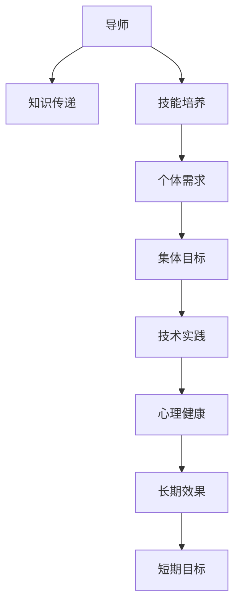

                 

# 技术mentoring：影响力与收益

## 1. 背景介绍

### 1.1 问题由来

在技术快速发展的今天，技术传承与交流变得更加重要。技术mentoring（导师制）作为一种有效的人才培养和知识传递方式，被广泛应用于各个行业。无论是在企业内部，还是在开源社区，导师制的价值都在被不断验证。

然而，随着技术的发展和应用场景的丰富，技术mentoring面临的新问题也层出不穷。比如，如何衡量技术mentoring的影响力与收益？如何将 mentorship 的规模化推广与个体化需求相结合？技术导师如何与学习者进行有效的互动和沟通？这些问题亟待我们深入探讨。

### 1.2 问题核心关键点

本文将围绕技术mentoring的影响力与收益这一核心问题，通过深入分析导师制在企业内部和开源社区的具体实践，探讨如何从技术、管理和心理学多个维度，全面衡量和提升技术mentoring的效果，并提出相应的改进建议。

## 2. 核心概念与联系

### 2.1 核心概念概述

技术mentoring，即技术领域的导师制，指通过经验的传授和技能的培养，使学习者能够快速掌握技术知识并提升实践能力。其核心在于导师的知识传递和指导，以及学习者的吸收和应用。

- **导师**：具备丰富经验和技术知识的技术专家，负责传授知识和技能。
- **学习者**：希望在特定技术领域提升能力的初学者或经验不足的开发者。
- **知识传递**：导师通过一对一的指导、工作坊、代码审查等方式，将知识传递给学习者。
- **技能培养**：学习者通过实践练习、项目实践、知识内化等方式，提升技术能力。

导师制的目标是通过知识传递和技能培养，使学习者能够独立解决问题，提升技术水平，并在未来的工作中实现更好的发展。

### 2.2 核心概念联系

技术mentoring的效果和收益，可以从多个维度进行衡量和提升。以下是主要的联系和维度：

1. **知识传递与技能培养的平衡**：导师制的核心在于知识的传递和技能的培养。导师需要根据学习者的不同阶段，灵活调整指导内容和方式，确保知识传递的有效性和技能培养的全面性。

2. **个体需求与集体目标的统一**：导师需要了解学习者的个体需求，同时兼顾团队和企业的集体目标，确保技术知识与企业发展方向的一致性。

3. **导师与学习者的互动**：导师制的成功依赖于导师与学习者之间的良好互动和沟通。导师应具备良好的沟通能力和心理学知识，能够理解学习者的心理需求，给予适时的鼓励和支持。

4. **技术实践与心理健康的结合**：技术mentoring不仅要关注技术知识的传递，还需要关注学习者的心理健康。导师需要帮助学习者建立自信，减轻压力，保持积极的学习态度。

5. **长期效果与短期目标的融合**：导师制的目标不仅仅是短期内的技术提升，还应关注学习者的长期发展。通过持续的指导和支持，帮助学习者实现职业生涯的长远规划和目标达成。

### 2.3 核心概念框架

通过以下Mermaid流程图，我们可以更直观地理解技术mentoring的核心概念及其相互关系：



该图展示了技术mentoring的核心概念及其相互关系：

1. 导师通过知识传递和技能培养，满足学习者的个体需求。
2. 导师需兼顾集体目标，确保技术知识与企业发展方向一致。
3. 通过技术实践和心理健康的结合，提升学习者的技术水平和心理健康。
4. 导师制追求长期效果与短期目标的融合，帮助学习者实现长远发展。

## 3. 核心算法原理 & 具体操作步骤
### 3.1 算法原理概述

技术mentoring的效果和收益可以通过多维度指标进行量化和评估。以下是主要的算法原理：

1. **知识传递效果评估**：通过学习者的测试成绩、项目进展和代码质量等指标，评估导师的知识传递效果。
2. **技能培养效果评估**：通过学习者的技术提升、项目完成情况和职业发展轨迹等指标，评估技能培养效果。
3. **导师与学习者的互动效果评估**：通过互动频率、沟通效果和满意度等指标，评估导师与学习者的互动效果。
4. **心理健康与技术实践结合效果评估**：通过学习者的心理健康状态和技术实践质量等指标，评估导师制的整体效果。
5. **长期效果与短期目标融合效果评估**：通过学习者的长期发展情况和短期目标达成情况等指标，评估导师制的长期效果。

### 3.2 算法步骤详解

技术mentoring的具体操作步骤包括以下几个关键步骤：

**Step 1: 选择合适的导师和学习者**
- 根据学习者的技术水平和学习需求，选择合适的导师。
- 评估学习者的基础知识、学习能力和职业目标，确保导师与学习者的匹配度。

**Step 2: 制定详细的指导计划**
- 明确学习者的学习目标和导师制的具体目标。
- 制定详细的指导计划，包括知识传递和技能培养的具体内容和方式。
- 设定阶段性的评估指标和评估周期。

**Step 3: 实施知识传递和技能培养**
- 通过一对一的指导、工作坊、代码审查等方式，进行知识传递。
- 通过实践练习、项目实践、知识内化等方式，进行技能培养。
- 定期进行评估和反馈，调整指导计划。

**Step 4: 评估导师制的效果**
- 根据制定的评估指标，定期评估导师制的效果。
- 分析评估结果，发现问题并进行改进。
- 根据评估结果，调整指导计划和导师分配。

### 3.3 算法优缺点

技术mentoring具有以下优点：
1. 知识传递高效：通过一对一的指导，知识传递更加高效和有针对性。
2. 技能培养全面：通过实践练习和项目实践，学习者的技能得到全面提升。
3. 心理健康支持：通过导师的鼓励和支持，学习者能够保持积极的心态。
4. 个性化指导：根据学习者的不同需求，导师能够提供个性化的指导。

同时，技术mentoring也存在一些局限性：
1. 时间成本高：导师与学习者的互动需要耗费大量的时间和精力。
2. 效果依赖导师：导师的能力和经验直接影响mentoring的效果。
3. 效果评估困难：导师制的评估指标难以量化和统一，存在主观性。
4. 规模化推广难度大：个性化的导师制难以实现大规模的推广。

尽管存在这些局限性，技术mentoring仍是一种有效的技术人才培养和知识传递方式，值得进一步优化和改进。

### 3.4 算法应用领域

技术mentoring在多个领域得到了广泛应用，以下是主要的应用领域：

1. **企业内部培训**：企业内部导师制用于提升员工的职业技能和知识水平，帮助员工实现职业发展。
2. **开源社区培养**：开源社区导师制用于培养开源贡献者，提升其技术能力和贡献质量。
3. **高校教育**：高校导师制用于帮助学生掌握专业知识，提升学术水平和就业能力。
4. **技术社群建设**：技术社群导师制用于提升社群成员的技术水平和社群凝聚力。
5. **技术交流会议**：技术交流会议中的导师制用于促进技术交流和知识传播。

## 4. 数学模型和公式 & 详细讲解  
### 4.1 数学模型构建

技术mentoring的效果和收益可以通过数学模型进行量化和评估。以下是主要的数学模型：

1. **知识传递效果模型**：通过学习者测试成绩与导师指导次数之间的关系，评估导师的知识传递效果。
2. **技能培养效果模型**：通过学习者技术提升与项目完成情况之间的关系，评估技能培养效果。
3. **导师与学习者互动效果模型**：通过互动频率与沟通效果之间的关系，评估导师与学习者的互动效果。
4. **心理健康与技术实践结合效果模型**：通过学习者心理健康状态与技术实践质量之间的关系，评估导师制的整体效果。
5. **长期效果与短期目标融合效果模型**：通过学习者的长期发展情况与短期目标达成情况之间的关系，评估导师制的长期效果。

### 4.2 公式推导过程

以知识传递效果模型为例，推导其公式如下：

设学习者测试成绩为 $y$，导师指导次数为 $x$。通过回归分析，得到知识传递效果模型：

$$
y = \beta_0 + \beta_1 x + \epsilon
$$

其中 $\beta_0$ 为截距，$\beta_1$ 为指导次数对测试成绩的影响系数，$\epsilon$ 为误差项。

### 4.3 案例分析与讲解

以下是一个具体的案例分析：

- 某企业进行技术mentoring，记录了导师指导次数 $x$ 和学习者测试成绩 $y$ 的数据，如表所示：

| 指导次数 | 测试成绩 |
|----------|----------|
| 10       | 80       |
| 20       | 90       |
| 30       | 95       |
| 40       | 100      |
| 50       | 100      |

通过线性回归分析，得到知识传递效果模型的参数 $\beta_0 = 70$，$\beta_1 = 5$。即每增加一次指导，学习者的测试成绩平均提升5分。

## 5. 项目实践：代码实例和详细解释说明
### 5.1 开发环境搭建

要进行技术mentoring的效果评估，需要进行以下环境搭建：

1. 安装Python：从官网下载并安装Python。
2. 安装相关库：安装numpy、pandas、scikit-learn等库，用于数据处理和模型训练。
3. 数据准备：准备导师制效果的评估数据，包括学习者的测试成绩和导师的指导次数。

### 5.2 源代码详细实现

以下是一个使用Python和scikit-learn库进行知识传递效果评估的代码实现：

```python
import pandas as pd
from sklearn.linear_model import LinearRegression

# 加载数据
data = pd.read_csv('mentoring_data.csv')

# 数据处理
X = data['指导次数'].values.reshape(-1, 1)
y = data['测试成绩'].values.reshape(-1, 1)

# 建立模型
model = LinearRegression()
model.fit(X, y)

# 预测和评估
y_pred = model.predict(X)
print('截距：', model.intercept_)
print('指导次数对测试成绩的影响系数：', model.coef_[0])
```

### 5.3 代码解读与分析

以上代码实现了简单的线性回归模型，用于评估导师制的效果。具体步骤如下：

1. 加载数据：使用pandas库加载导师制效果的评估数据，包括学习者的测试成绩和导师的指导次数。
2. 数据处理：将数据转换为模型所需的格式，即将指导次数作为自变量，测试成绩作为因变量。
3. 建立模型：使用scikit-learn库的LinearRegression模型进行线性回归分析。
4. 预测和评估：通过模型预测指导次数对测试成绩的影响，并输出模型的截距和影响系数。

## 6. 实际应用场景
### 6.1 企业内部培训

企业内部导师制在培训员工方面发挥了重要作用。例如，谷歌的技术导师制项目（Google Internal Mentoring Program）帮助员工快速掌握新技术和工具，提升职业技能。

**实际案例**：
- 谷歌技术导师制通过导师与学员的一对一指导，帮助新员工快速适应公司文化和技术环境。
- 每季度对导师和学员进行评估，发现问题并进行改进。
- 通过导师制的实施，谷歌的员工满意度和技术水平得到了显著提升。

### 6.2 开源社区培养

开源社区导师制用于培养开源贡献者，提升其技术能力和贡献质量。

**实际案例**：
- Apache基金会通过导师制项目（Apache Mentorship Program）帮助新人快速融入社区，提升贡献质量。
- 导师定期与学员沟通，提供技术指导和职业建议。
- 通过导师制的实施，Apache基金会的开源贡献者数量和贡献质量得到了显著提升。

### 6.3 高校教育

高校导师制用于帮助学生掌握专业知识，提升学术水平和就业能力。

**实际案例**：
- 麻省理工学院（MIT）的导师制项目（MIT Mentoring Program）帮助学生提升研究能力和职业发展。
- 导师定期与学生沟通，提供学术和职业建议。
- 通过导师制的实施，MIT的学生的学术水平和就业率得到了显著提升。

### 6.4 技术社群建设

技术社群导师制用于提升社群成员的技术水平和社群凝聚力。

**实际案例**：
- GitHub社区通过导师制项目（GitHub Mentorship Program）帮助新成员快速融入社区，提升技术水平。
- 导师定期与学员沟通，提供技术指导和社区建议。
- 通过导师制的实施，GitHub社区的活跃度和成员技术水平得到了显著提升。

### 6.5 技术交流会议

技术交流会议中的导师制用于促进技术交流和知识传播。

**实际案例**：
- 技术交流会议（Tech Talks）通过导师制项目（Tech Talks Mentorship Program）帮助与会者快速掌握会议主题和最新技术。
- 导师定期与学员沟通，提供会议主题和技术的指导。
- 通过导师制的实施，技术交流会议的参与度和学习效果得到了显著提升。

## 7. 工具和资源推荐
### 7.1 学习资源推荐

为了帮助开发者系统掌握技术mentoring的理论基础和实践技巧，这里推荐一些优质的学习资源：

1. 《技术mentoring：原理与实践》系列博文：由技术导师制专家撰写，深入浅出地介绍了导师制原理、实践技巧等前沿话题。
2. 《技术导师制：最佳实践与案例分析》书籍：系统总结了技术导师制在企业内部的最佳实践和成功案例。
3. 《技术社群导师制：如何提升社群技术水平》论文：分析了技术社群导师制的有效性和提升社群技术水平的方法。
4. 《技术交流会议导师制：促进知识传播的最佳方法》报告：介绍了技术交流会议导师制的设计和实施。

通过对这些资源的学习实践，相信你一定能够快速掌握技术mentoring的精髓，并用于解决实际的导师制问题。

### 7.2 开发工具推荐

高效的开发离不开优秀的工具支持。以下是几款用于技术mentoring效果评估开发的常用工具：

1. Jupyter Notebook：用于编写和执行Python代码，支持代码块、单元格的交互式执行。
2. TensorBoard：用于可视化模型的训练和评估过程，支持数据的实时监控和图表展示。
3. Apache Airflow：用于构建和管理工作流，支持导师制的自动化评估和反馈。
4. GitHub：用于代码版本控制和协作开发，支持导师制的任务分配和进度跟踪。
5. Slack：用于即时通讯和协作，支持导师制中的沟通和协作。

合理利用这些工具，可以显著提升技术mentoring的开发效率，加快创新迭代的步伐。

### 7.3 相关论文推荐

技术mentoring的研究已经成为一个热门领域，以下是几篇奠基性的相关论文，推荐阅读：

1. "The Impact of Mentorship on Technical Learning and Performance"：研究了导师制对技术学习和性能的影响。
2. "Mentoring in Software Engineering: A Meta-Analysis of the Research"：总结了软件工程领域导师制的研究结果和应用案例。
3. "The Role of Mentors in Knowledge Transfer"：分析了导师在知识传递中的作用和影响。
4. "The Effectiveness of Mentorship in Online Learning Communities"：研究了在线学习社区中导师制的效果和提升方法。
5. "Designing Effective Mentorship Programs in Technical Fields"：介绍了如何设计有效的技术导师制项目。

这些论文代表了技术mentoring研究的发展脉络，通过学习这些前沿成果，可以帮助研究者把握学科前进方向，激发更多的创新灵感。

## 8. 总结：未来发展趋势与挑战

### 8.1 总结

本文对技术mentoring的影响力与收益进行了全面系统的介绍。首先阐述了技术mentoring在企业内部和开源社区的广泛应用和其重要价值，明确了导师制的核心在于知识传递和技能培养，需要平衡个体需求和集体目标。其次，通过数学模型和代码实例，详细讲解了技术mentoring的评估方法和实际操作，展示了其效果和收益。最后，讨论了技术mentoring在多个实际应用场景中的应用案例，以及未来的发展趋势和面临的挑战。

通过本文的系统梳理，可以看到，技术mentoring作为一种有效的技术人才培养和知识传递方式，在企业内部和开源社区等诸多场景中发挥了重要作用。其在技术知识传递、技能培养和心理健康支持等方面具有显著的效果。未来，技术mentoring有望通过更多的工具和资源支持，实现更大规模的推广和应用。

### 8.2 未来发展趋势

展望未来，技术mentoring的发展趋势将主要体现在以下几个方面：

1. **自动化和工具化**：随着人工智能和机器学习技术的发展，导师制的自动化和工具化将成为可能。通过智能算法推荐导师和学习内容，提升导师制的效率和效果。
2. **个性化和定制化**：根据学习者的不同需求和背景，提供个性化的导师制方案，实现因材施教。
3. **跨领域和跨文化**：导师制的推广将不再局限于单一技术领域，而是跨越多个领域，甚至跨文化。不同领域和技术背景的专家可以共同参与导师制，提升整体技术水平。
4. **社交网络和社区化**：技术社群和社区将发挥更大的作用，通过社交网络和社区化方式，形成更多的导师制互动和交流。
5. **数据驱动和持续改进**：通过大数据分析和持续改进机制，不断优化导师制的实施效果。

### 8.3 面临的挑战

尽管技术mentoring在多个领域得到了广泛应用，但在推广和实施过程中，仍面临一些挑战：

1. **资源不足**：导师制需要大量的时间和精力，尤其是在大规模推广时，资源不足是一个主要瓶颈。如何高效利用现有资源，扩大导师制的覆盖面，是一个亟待解决的问题。
2. **效果评估困难**：导师制的效果评估存在主观性和复杂性，难以量化和统一。如何建立科学合理的效果评估指标，进行客观评估，需要进一步研究和探讨。
3. **心理压力和焦虑**：学习者在导师制的实施过程中，可能会面临心理压力和焦虑。如何提供心理支持和辅导，减轻学习者的心理负担，需要更多关注。
4. **规模化和个性化之间的平衡**：如何在规模化推广导师制的同时，兼顾学习者的个性化需求，实现两者之间的平衡，是一个重要挑战。
5. **技术知识和软技能的结合**：技术mentoring不仅要关注技术知识的传递，还需要关注学习者的软技能培养，如沟通能力、团队合作等。如何在技术知识和软技能之间找到平衡点，需要更多探索。

### 8.4 研究展望

面对技术mentoring面临的挑战，未来的研究需要在以下几个方面寻求新的突破：

1. **数据驱动的导师匹配**：通过大数据分析和机器学习算法，实现导师与学习者的智能匹配，提升导师制的效果和覆盖面。
2. **在线化和虚拟导师制**：利用在线平台和虚拟现实技术，实现远程导师制和虚拟导师制，解决资源不足和地理位置限制的问题。
3. **心理健康的支持和干预**：引入心理辅导和心理健康支持，帮助学习者应对心理压力和焦虑，提升学习效果。
4. **技能培养的全面性**：不仅关注技术知识的传递，还要关注学习者的软技能培养，如沟通能力、团队合作等。
5. **跨领域和跨文化的导师制**：推动跨领域和跨文化的导师制实践，提升技术水平和团队协作能力。

这些研究方向的探索，必将引领技术mentoring技术迈向更高的台阶，为构建安全、可靠、可解释、可控的智能系统铺平道路。面向未来，技术mentoring技术还需要与其他人工智能技术进行更深入的融合，如知识表示、因果推理、强化学习等，多路径协同发力，共同推动自然语言理解和智能交互系统的进步。只有勇于创新、敢于突破，才能不断拓展技术mentoring的边界，让技术知识更好地服务于人类社会。

## 9. 附录：常见问题与解答

**Q1: 技术mentoring的评估标准是什么？**

A: 技术mentoring的评估标准可以从多个维度进行衡量，如知识传递效果、技能培养效果、导师与学习者互动效果、心理健康与技术实践结合效果、长期效果与短期目标融合效果等。

**Q2: 如何选择合适的导师？**

A: 选择合适的导师需要考虑导师的业务水平、沟通能力、指导经验等多方面因素。可以通过面试、评估报告等手段，对导师进行全面评估。

**Q3: 技术mentoring如何提升学习者的心理状态？**

A: 技术mentoring可以通过以下方式提升学习者的心理状态：
1. 定期进行心理辅导，帮助学习者应对压力和焦虑。
2. 通过正面的反馈和鼓励，增强学习者的自信心。
3. 营造积极的团队氛围，提升学习者的归属感。

**Q4: 技术mentoring如何实现规模化推广？**

A: 技术mentoring可以通过以下方式实现规模化推广：
1. 建立在线平台，实现远程导师制。
2. 引入AI算法，实现智能导师匹配。
3. 建立激励机制，提升导师和学员的积极性。
4. 引入自动化评估工具，提高评估效率。

**Q5: 技术mentoring如何在不同文化背景中实现有效沟通？**

A: 技术mentoring可以通过以下方式在不同文化背景中实现有效沟通：
1. 培训导师具备跨文化沟通能力。
2. 引入多语言支持，实现多语言沟通。
3. 建立跨文化交流平台，促进文化交流和理解。

---

作者：禅与计算机程序设计艺术 / Zen and the Art of Computer Programming

