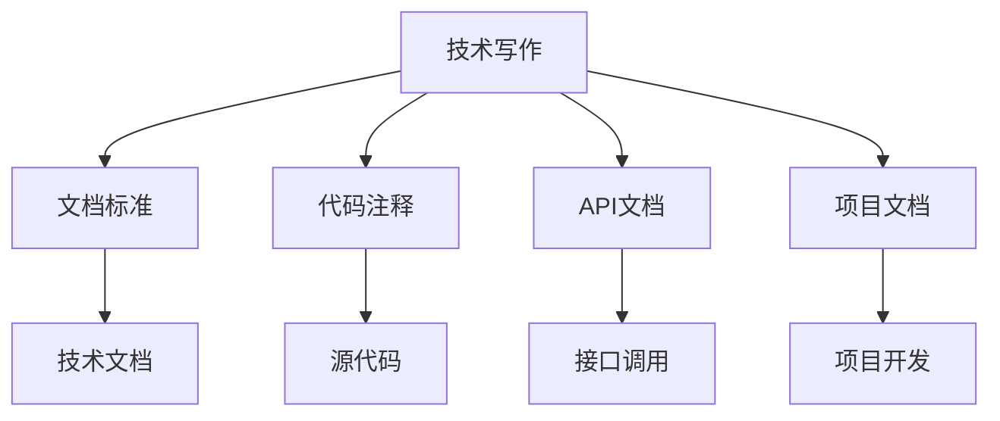

                 

# 技术写作：额外收入的来源

## 1. 背景介绍

在数字化和信息化迅猛发展的今天，技术写作（Technical Writing）成为了一个越来越重要的职业。技术写作不仅仅涉及撰写技术文档、产品说明、用户手册等，更是一个广泛的领域，包括编程文档、项目文档、培训材料、技术博客等。特别是在开源社区、互联网公司和软件开发企业中，技术写作已经成为一项不可或缺的技能。

### 1.1 技术写作的兴起
技术写作的兴起与互联网和软件行业的发展密切相关。早期，软件开发更多是闭门造车，开发者主要关注代码的编写和调试。但随着互联网应用的增多，用户体验变得尤为重要，技术文档、用户手册等开始受到广泛关注。

### 1.2 技术写作的现状
当前，技术写作的竞争激烈，专业性强，需要具备良好的写作能力、技术功底和项目经验。据调查，技术写作人员的薪资普遍较高，部分优秀者年薪可达数十万元。同时，技术写作还为从业者提供了多元化的发展路径，包括软件开发、项目管理、产品设计等方向。

## 2. 核心概念与联系

### 2.1 核心概念概述

要深入理解技术写作，需要先了解几个核心概念：

- **技术写作**：通过专业、规范的表达方式，将复杂的技术知识、产品信息、项目进展等清晰传达给目标受众的写作方式。
- **文档标准**：如IEEE标准、AP风格指南等，确保技术文档的规范性和一致性。
- **代码注释**：在编程中附加的解释性文本，帮助理解代码逻辑、注意事项等。
- **API文档**：接口文档，描述API的使用方式、参数要求、返回值等，方便开发者使用。
- **项目文档**：如需求文档、设计文档、测试文档等，记录项目开发全过程。

这些概念之间紧密联系，共同构成了技术写作的体系。技术写作不仅是文字工作，更是对技术知识和产品理解的深入。

### 2.2 核心概念原理和架构的 Mermaid 流程图



## 3. 核心算法原理 & 具体操作步骤

### 3.1 算法原理概述

技术写作的算法原理，主要涉及两个方面：一是如何有效地将技术知识转化为易于理解的文字表达；二是如何通过技术写作提升产品的用户体验和市场竞争力。

### 3.2 算法步骤详解

#### 3.2.1 准备阶段
- **需求调研**：了解目标受众的需求，确定文档内容与结构。
- **编写计划**：制定编写计划，包括文档结构、内容框架、撰写时间表等。

#### 3.2.2 撰写阶段
- **草拟初稿**：根据计划草拟初稿，不断修改完善，力求清晰、准确。
- **审查校对**：邀请同行或项目经理审查，确保文档无误。
- **反馈改进**：根据反馈进行修改，确保文档质量。

#### 3.2.3 发布阶段
- **排版格式化**：使用专业工具进行排版和格式化，保证文档可读性。
- **版本管理**：使用版本控制系统，管理文档的历史版本。

#### 3.2.4 更新维护
- **持续更新**：定期更新文档内容，确保信息准确、时效。
- **用户反馈**：收集用户反馈，改进文档质量。

### 3.3 算法优缺点

#### 3.3.1 优点
- **提升用户体验**：通过清晰、易懂的文档，帮助用户快速上手，提高产品使用率。
- **增强市场竞争力**：优质的文档能够吸引更多用户，提升产品口碑和市场份额。
- **降低维护成本**：通过文档标准化，减少沟通成本，提高团队效率。

#### 3.3.2 缺点
- **写作难度大**：技术写作需要深厚的技术功底和良好的写作能力。
- **时间投入大**：撰写和校对文档需要大量时间和精力。
- **信息更新快**：随着产品迭代，文档需要频繁更新，工作量较大。

### 3.4 算法应用领域

技术写作的应用领域非常广泛，包括但不限于：

- **软件开发**：编程文档、API文档、开发手册等。
- **产品管理**：产品文档、功能描述、用户指南等。
- **IT运维**：运维手册、故障排查、监控文档等。
- **教育培训**：培训教材、实验指南、案例分析等。

## 4. 数学模型和公式 & 详细讲解 & 举例说明

### 4.1 数学模型构建

技术写作的数学模型构建，主要是为了量化技术文档的质量和用户满意度。常用的模型包括：

- **可读性评估模型**：通过统计文本的易读性指标（如句子长度、词语多样性、语法错误等），评估文档的可读性。
- **用户满意度模型**：通过用户反馈，量化文档的满意度，如NPS（净推荐值）。

### 4.2 公式推导过程

以可读性评估模型为例，公式推导过程如下：

- **句子长度**：使用每个句子的平均长度作为指标，理想值在15-20字之间。
- **词语多样性**：使用词语熵（Shannon熵）衡量词语多样性，熵值越高表示词语越丰富。
- **语法错误**：通过统计语法错误的数量，评估文档的质量。

$$
\text{可读性得分} = \text{句子长度} \times \text{词语多样性} - \text{语法错误数量}
$$

### 4.3 案例分析与讲解

以一个GitHub项目为例，其API文档的撰写过程如下：

1. **需求调研**：项目团队通过调研得知，用户在使用API时遇到很多困难。
2. **编写计划**：制定了详细的编写计划，包括文档结构、内容框架、时间表等。
3. **撰写阶段**：项目经理和技术专家共同撰写文档，通过多次修改和校对，确保内容准确、易理解。
4. **发布阶段**：使用Markdown格式排版文档，发布在项目主页，方便用户查阅。
5. **更新维护**：随着项目迭代，团队定期更新文档，确保信息及时、准确。

## 5. 项目实践：代码实例和详细解释说明

### 5.1 开发环境搭建

#### 5.1.1 安装开发环境
- **安装Python**：在Windows或Linux系统下安装Python 3.8及以上版本。
- **安装Git**：在Windows系统下使用Git for Windows，在Linux系统下使用apt-get install git。
- **安装VSCode**：安装VSCode，配置Git扩展。

#### 5.1.2 配置开发环境
- **创建仓库**：在GitHub上创建仓库，并克隆到本地。
- **安装开发工具**：安装Python开发工具（如PyCharm、VSCode等）。

### 5.2 源代码详细实现

以编写API文档为例，使用Markdown格式进行实现：

```markdown
# API 文档

## 简介
本文档详细描述了项目中使用的所有API，包括API的参数、返回值、错误码等。

## API列表

### /api/users
- **描述**：获取用户列表。
- **参数**：
  - `page`：页码，默认为1。
  - `per_page`：每页记录数，默认为10。
- **返回值**：
  - **成功**：返回用户列表。
  - **失败**：返回错误码和错误信息。
- **示例**：
  ```python
  response = requests.get('http://example.com/api/users?page=1&per_page=10')
  ```

### /api/products
- **描述**：获取商品列表。
- **参数**：
  - `id`：商品ID，必填。
- **返回值**：
  - **成功**：返回商品信息。
  - **失败**：返回错误码和错误信息。
- **示例**：
  ```python
  response = requests.get('http://example.com/api/products?id=123')
  ```

## 版本记录

- **版本号**：1.0.0
- **更新日期**：2023-01-01
```

### 5.3 代码解读与分析

以上代码是一个简单的API文档示例，主要内容包括：

- **标题**：明确文档主题。
- **简介**：简要介绍文档内容。
- **API列表**：详细描述每个API的参数、返回值和示例。
- **版本记录**：记录文档的版本号和更新日期。

通过使用Markdown，文档结构清晰，内容易于阅读和理解。同时，Markdown的语法简洁，易于编写和修改。

### 5.4 运行结果展示

#### 5.4.1 文档生成
- **生成命令**：
  ```bash
  python markdown2html.py README.md > README.html
  ```
- **运行结果**：
  打开`README.html`文件，可以看到格式化的API文档。

#### 5.4.2 代码示例
- **代码示例**：
  ```python
  import requests

  # 获取用户列表
  response = requests.get('http://example.com/api/users?page=1&per_page=10')
  print(response.json())
  
  # 获取商品信息
  response = requests.get('http://example.com/api/products?id=123')
  print(response.json())
  ```
- **运行结果**：
  用户和商品信息被成功获取并打印出来。

## 6. 实际应用场景

### 6.1 软件开发

#### 6.1.1 项目文档

项目文档是软件开发中的重要组成部分，包括需求文档、设计文档、开发文档、测试文档等。通过规范化的技术写作，团队能够更好地理解项目需求，提高开发效率。

#### 6.1.2 编程文档

编程文档详细描述了项目的代码逻辑、接口定义、API文档等，帮助其他开发者快速理解代码，提高代码复用性。

### 6.2 产品管理

#### 6.2.1 产品文档

产品文档描述了产品的功能和特性，帮助用户快速了解产品，提高用户满意度。同时，产品文档还可以作为培训材料，帮助新用户上手。

#### 6.2.2 功能描述

功能描述详细描述了产品的各个功能模块，帮助用户更好地使用产品，提高产品粘性。

### 6.3 教育培训

#### 6.3.1 培训教材

培训教材是教育培训中的重要组成部分，帮助学员快速理解课程内容，提高学习效率。

#### 6.3.2 实验指南

实验指南详细描述了实验过程和注意事项，帮助学员顺利完成实验，提高实验成功率。

## 7. 工具和资源推荐

### 7.1 学习资源推荐

#### 7.1.1 技术写作教程
- **《技术写作之道》**：讲解了技术写作的基础知识和最佳实践。
- **Coursera《Technical Writing and Documentation》**：由杜克大学开设的在线课程，系统介绍了技术写作的各个方面。

#### 7.1.2 编程实践指南
- **《Effective Python》**：讲解了Python编程的最佳实践，包括代码注释、文档编写等。
- **GitHub的Style Guide**：提供了GitHub项目文档的格式要求和最佳实践。

#### 7.1.3 项目管理工具
- **JIRA**：项目管理工具，帮助团队协作，记录文档的历史版本。
- **Confluence**：协作平台，支持文档共享和版本管理。

### 7.2 开发工具推荐

#### 7.2.1 文档编写工具
- **PyCharm**：强大的Python开发工具，支持Markdown格式文档编写。
- **Visual Studio Code**：开源的代码编辑器，支持多种语法高亮和代码片段。

#### 7.2.2 版本控制工具
- **Git**：版本控制系统，支持多人协作开发。
- **GitHub/GitLab**：代码托管平台，支持版本控制和文档管理。

#### 7.2.3 在线文档生成工具
- **ReadTheDocs**：在线文档生成工具，支持Markdown格式文档，自动生成HTML页面。
- **Sphinx**：文档生成工具，支持多种格式文档生成。

### 7.3 相关论文推荐

#### 7.3.1 技术写作研究
- **《Technical Writing as a Process》**：探讨了技术写作的过程和最佳实践。
- **《The Influence of Technical Writing on User Experience》**：研究了技术写作对用户体验的影响。

#### 7.3.2 编程文档研究
- **《Documentation as a First Class Citizen》**：探讨了编程文档的重要性和最佳实践。
- **《API Documentation: Best Practices and Challenges》**：研究了API文档的最佳实践和面临的挑战。

## 8. 总结：未来发展趋势与挑战

### 8.1 研究成果总结

技术写作在软件开发和产品管理中扮演着越来越重要的角色。通过规范化的技术写作，团队能够更好地理解项目需求，提高开发效率和用户满意度。

### 8.2 未来发展趋势

#### 8.2.1 智能化
随着AI技术的发展，智能化的技术写作工具将越来越多。如智能摘要生成、自动校对等，能够帮助开发者更快更好地完成文档编写。

#### 8.2.2 多模态
未来的技术写作将不再局限于文本，还将包括视频、音频等多模态内容。多模态技术写作能够更全面地描述产品和服务。

#### 8.2.3 本地化
随着全球化的发展，本地化的技术写作需求将越来越普遍。通过本地化技术写作，产品能够在不同地区更好地推广和销售。

### 8.3 面临的挑战

#### 8.3.1 文档一致性
不同团队、不同时间编写的文档，风格和格式可能不一致。如何保证文档的一致性，是一个重要挑战。

#### 8.3.2 文档更新频率
随着产品迭代，文档需要频繁更新。如何高效地管理和更新文档，是一个重要挑战。

#### 8.3.3 文档质量保障
文档质量是用户满意度的关键。如何确保文档的高质量，是一个重要挑战。

### 8.4 研究展望

未来的技术写作研究，将聚焦以下几个方面：

#### 8.4.1 自动化工具
研究并开发自动化的技术写作工具，提高文档编写效率和质量。

#### 8.4.2 文档一致性
开发文档一致性管理工具，确保不同文档风格和格式的一致性。

#### 8.4.3 文档质量保障
研究并开发文档质量评估工具，确保文档的高质量。

## 9. 附录：常见问题与解答

**Q1：技术写作是否适用于所有类型的文档？**

A: 技术写作适用于所有类型的文档，包括编程文档、产品文档、培训教材等。无论何种类型的文档，技术写作都能帮助清晰、准确地传达信息。

**Q2：技术写作是否需要专业的背景知识？**

A: 技术写作需要一定的专业背景知识，但不需要深入的领域知识。通过学习基本的写作技巧和模板，任何人都可以写出高质量的文档。

**Q3：技术写作需要多少时间？**

A: 技术写作的时间取决于文档的复杂度和篇幅。一般来说，编写一个完整的文档需要几周到几个月的时间。

**Q4：技术写作的薪资如何？**

A: 技术写作的薪资因地区和经验不同而有所差异。一般来说，优秀的技术写作人员年薪可达数十万元。

**Q5：技术写作的未来发展前景如何？**

A: 随着数字化和信息化的发展，技术写作的需求将越来越大。未来的技术写作将更加智能化、自动化，同时也会更加注重本地化和国际化。技术写作人员将有更多机会成为项目经理、产品经理等。

作者：禅与计算机程序设计艺术 / Zen and the Art of Computer Programming

