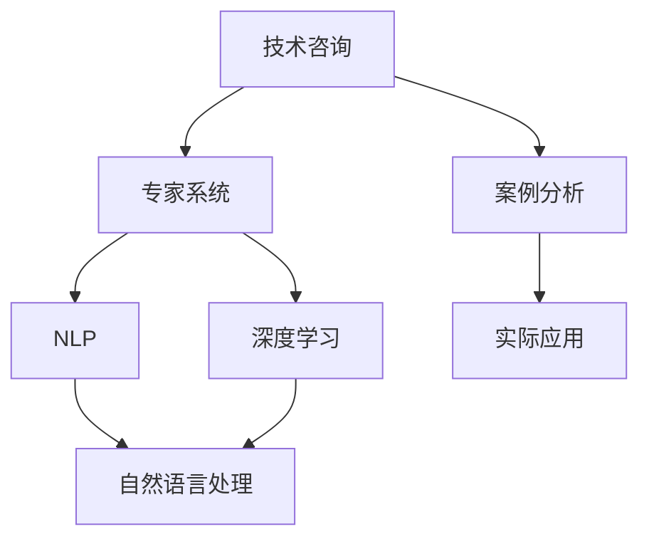

                 

# 技术咨询：知识变现的另一种方式

> 关键词：技术咨询, 知识变现, 专家系统, 自然语言处理, 深度学习, 案例分析, 实际应用

## 1. 背景介绍

### 1.1 问题由来

随着互联网技术的迅猛发展，信息爆炸时代带来了海量的知识资源。然而，如何高效地获取、组织和利用这些知识，成为了一个日益突出的问题。技术咨询作为一种传统的知识服务方式，正面临着数字化转型的迫切需求。传统技术咨询往往依赖于高水平的专业人才，成本高昂、响应时间长，难以满足日益增长的市场需求。

### 1.2 问题核心关键点

技术咨询的本质在于结合专家知识和经验，为客户提供量身定制的解决方案。在数字化时代，如何利用技术手段，构建更加高效、可靠、智能的技术咨询系统，是摆在面前的一项重要课题。

## 2. 核心概念与联系

### 2.1 核心概念概述

为更好地理解如何利用技术手段进行知识变现，本节将介绍几个密切相关的核心概念：

- 技术咨询（Technical Consulting）：结合专业知识和经验，为客户提供技术方案和建议的服务。
- 专家系统（Expert System）：利用人工智能技术，模拟专家决策过程，实现智能决策的软硬件系统。
- 自然语言处理（NLP）：使计算机能够理解、处理和生成人类语言的技术，是构建智能技术咨询系统的重要基础。
- 深度学习（Deep Learning）：基于神经网络的机器学习方法，能够处理大规模非线性数据，适合用于构建专家系统。
- 案例分析（Case Study）：通过分析实际案例，深入理解问题本质，探索解决思路。
- 实际应用（Real Application）：将理论应用于实际，验证和推广技术咨询方案。

这些核心概念之间的逻辑关系可以通过以下Mermaid流程图来展示：



这个流程图展示了一些核心概念的相互关系：

1. 技术咨询依托于专家系统，通过模拟专家决策，提供解决方案。
2. 专家系统利用NLP和深度学习技术，实现对文本的智能处理和推理。
3. NLP是深度学习的基础，用于文本数据的处理和分析。
4. 深度学习是NLP的核心，用于模型训练和推理。
5. 案例分析是从实际应用中总结经验，指导模型训练和优化。
6. 实际应用是将模型部署到实际场景中，验证和优化效果。

这些概念共同构成了智能技术咨询系统的技术框架，使其能够高效地获取、组织和利用知识，为客户创造价值。

## 3. 核心算法原理 & 具体操作步骤

### 3.1 算法原理概述

智能技术咨询系统的核心在于利用深度学习技术，构建能够理解、处理和生成人类语言的专家系统。其工作原理如下：

1. 收集和标注数据：收集相关领域的案例和知识，并对其进行标注，用于训练模型。
2. 预训练语言模型：使用大规模无标签文本数据对语言模型进行预训练，学习通用的语言表示。
3. 微调任务模型：在预训练模型的基础上，使用有标签的咨询数据进行微调，使其具备特定的任务能力。
4. 推理和输出：将客户咨询文本输入微调后的模型，通过推理得到解决方案和建议。

### 3.2 算法步骤详解

基于深度学习的智能技术咨询系统，通常包括以下几个关键步骤：

**Step 1: 数据收集和处理**

- 收集相关领域的案例和知识，包括文本、标签等。
- 对数据进行清洗、归一化、划分训练集、验证集和测试集。

**Step 2: 预训练语言模型**

- 选择合适的预训练语言模型（如BERT、GPT等），在其上进行大规模的无监督训练。
- 使用掩码语言模型、下一句预测等自监督任务，学习语言的通用表示。

**Step 3: 微调任务模型**

- 设计任务适配层，选择适合当前任务的损失函数和优化算法。
- 使用有标签的咨询数据对模型进行微调，优化模型的特定任务能力。
- 应用正则化技术，如L2正则、Dropout等，防止模型过拟合。

**Step 4: 推理和输出**

- 将客户咨询文本输入微调后的模型，通过前向传播计算模型输出。
- 结合业务规则和知识库，对输出结果进行后处理，生成解决方案和建议。

**Step 5: 测试和优化**

- 在测试集上评估模型性能，对比微调前后的精度提升。
- 持续收集用户反馈，优化模型和适配层，提升用户体验。

以上是基于深度学习的智能技术咨询系统的一般流程。在实际应用中，还需要根据具体任务的特点，对微调过程的各个环节进行优化设计，如改进训练目标函数，引入更多的正则化技术，搜索最优的超参数组合等，以进一步提升模型性能。

### 3.3 算法优缺点

基于深度学习的智能技术咨询系统具有以下优点：

1. 高效性：利用深度学习模型，能够快速处理和分析大量文本数据，提供实时响应。
2. 可靠性：通过大量数据和模型的训练优化，能够提供较为准确和可靠的咨询建议。
3. 可扩展性：可以通过微调模型，快速适应不同领域和类型的咨询需求。
4. 自动化：能够自动化处理咨询请求，减少人力成本。

同时，该系统也存在一定的局限性：

1. 依赖高质量数据：模型的效果很大程度上取决于训练数据的数量和质量。
2. 数据隐私问题：收集和处理大量用户咨询数据，涉及隐私保护和数据安全问题。
3. 模型可解释性不足：深度学习模型通常被视为"黑盒"系统，难以解释其内部工作机制。
4. 泛化能力有限：模型可能存在"过拟合"现象，无法泛化到新的数据和场景。
5. 需要专业知识：模型的设计和优化需要一定的专业知识，普通开发者难以胜任。

尽管存在这些局限性，但就目前而言，基于深度学习的智能技术咨询系统已经在大规模应用中取得了显著效果，成为技术咨询行业的一个重要趋势。

### 3.4 算法应用领域

基于深度学习的智能技术咨询系统已经在多个领域得到了应用，例如：

- 企业咨询：提供商业策略、运营优化、市场分析等方面的咨询服务。
- 金融咨询：对客户财务状况、投资建议、风险评估等进行分析和建议。
- 医疗咨询：对病历记录、诊断结果、治疗方案等进行解读和推荐。
- 教育咨询：对学生学习计划、课程选择、职业规划等提供建议。
- 法律咨询：对案件背景、法律问题、诉讼策略等进行分析和指导。
- 政府咨询：对政策制定、公共服务、社会治理等提供咨询和建议。

除了上述这些经典领域外，智能技术咨询系统还被创新性地应用到更多场景中，如智慧城市、环境保护、公共安全等，为各行各业带来了新的智能化解决方案。

## 4. 数学模型和公式 & 详细讲解 & 举例说明

### 4.1 数学模型构建

基于深度学习的智能技术咨询系统，可以抽象为一个由多个层次组成的计算图。其中，输入层接收客户的咨询文本，中间层为预训练的语言模型，任务适配层根据具体任务设计，输出层为最终的咨询建议。以下是一个简化的模型结构：

```
输入层 --(文本预处理)--> 预训练语言模型 --(任务适配层)--> 输出层
```

假设输入文本为 $x$，模型输出为 $y$，则模型的预测过程可以表示为：

$$
y = f_{output}(f_{task}(f_{pretrain}(x)))
$$

其中，$f_{pretrain}$ 表示预训练语言模型，$f_{task}$ 表示任务适配层，$f_{output}$ 表示输出层。

### 4.2 公式推导过程

以下以情感分析任务为例，推导模型的数学公式。

假设输入文本 $x$ 为句子形式，模型输出 $y$ 为情感类别（如正面、负面、中性）。模型训练时，对于每个样本 $(x_i, y_i)$，其损失函数 $L$ 可以表示为：

$$
L = -\frac{1}{N} \sum_{i=1}^N \log P(y_i | x_i)
$$

其中 $P(y_i | x_i)$ 表示模型在输入 $x_i$ 下输出 $y_i$ 的概率，可以通过训练得到。

对于情感分析任务，模型可以设计为二分类任务，将文本 $x$ 编码成向量 $z$，并通过一个线性层和softmax层输出情感类别 $y$。此时，模型的输出概率 $P(y_i | x_i)$ 可以表示为：

$$
P(y_i | x_i) = \frac{\exp(\mathbf{W}^Tz_i + b_i)}{\sum_{j=1}^{C} \exp(\mathbf{W}_j^Tz_i + b_j)}
$$

其中，$C$ 表示情感类别的数量，$\mathbf{W}_j$ 和 $b_j$ 分别表示第 $j$ 个情感类别的权重和偏置。

结合上述公式，情感分析任务的损失函数可以表示为：

$$
L = -\frac{1}{N} \sum_{i=1}^N \log \frac{\exp(\mathbf{W}^Tz_i + b_i)}{\sum_{j=1}^{C} \exp(\mathbf{W}_j^Tz_i + b_j)}
$$

在实际训练过程中，可以使用交叉熵损失函数，将上述公式简化为：

$$
L = -\frac{1}{N} \sum_{i=1}^N \sum_{j=1}^{C} y_{ij} \log \frac{\exp(\mathbf{W}_j^Tz_i + b_j)}{\sum_{k=1}^{C} \exp(\mathbf{W}_k^Tz_i + b_k)}
$$

其中，$y_{ij}$ 表示样本 $i$ 在类别 $j$ 上的标签。

### 4.3 案例分析与讲解

以医疗咨询为例，分析智能技术咨询系统的应用。

假设有一个医疗咨询系统，需要帮助医生诊断疾病。系统收集大量病历数据，包括患者的症状描述、诊断结果、治疗方案等，并进行标注。然后，系统使用BERT模型对病历文本进行预训练，得到一个通用的语言表示模型。接着，在预训练模型的基础上，设计一个二分类任务适配层，输出是否患有某种疾病。最后，在标注数据上进行微调，得到一个具体的疾病诊断模型。

通过实际测试，系统在面对新的病历数据时，能够自动生成诊断建议，提高医生的诊断效率和准确性。

## 5. 项目实践：代码实例和详细解释说明

### 5.1 开发环境搭建

在进行智能技术咨询系统的开发前，我们需要准备好开发环境。以下是使用Python进行PyTorch开发的环境配置流程：

1. 安装Anaconda：从官网下载并安装Anaconda，用于创建独立的Python环境。

2. 创建并激活虚拟环境：
```bash
conda create -n pytorch-env python=3.8 
conda activate pytorch-env
```

3. 安装PyTorch：根据CUDA版本，从官网获取对应的安装命令。例如：
```bash
conda install pytorch torchvision torchaudio cudatoolkit=11.1 -c pytorch -c conda-forge
```

4. 安装各类工具包：
```bash
pip install numpy pandas scikit-learn matplotlib tqdm jupyter notebook ipython
```

完成上述步骤后，即可在`pytorch-env`环境中开始智能技术咨询系统的开发。

### 5.2 源代码详细实现

这里我们以情感分析任务为例，给出使用Transformers库对BERT模型进行智能技术咨询系统开发的PyTorch代码实现。

首先，定义情感分析任务的数据处理函数：

```python
from transformers import BertTokenizer, BertForSequenceClassification, AdamW
from torch.utils.data import Dataset, DataLoader
import torch

class SentimentDataset(Dataset):
    def __init__(self, texts, labels):
        self.texts = texts
        self.labels = labels
        
    def __len__(self):
        return len(self.texts)
    
    def __getitem__(self, item):
        text = self.texts[item]
        label = self.labels[item]
        encoding = tokenizer(text, return_tensors='pt', padding=True, truncation=True)
        input_ids = encoding['input_ids']
        attention_mask = encoding['attention_mask']
        return {'input_ids': input_ids, 
                'attention_mask': attention_mask,
                'labels': torch.tensor(label, dtype=torch.long)}
        
# 加载数据集和分词器
tokenizer = BertTokenizer.from_pretrained('bert-base-uncased')
train_dataset = SentimentDataset(train_texts, train_labels)
test_dataset = SentimentDataset(test_texts, test_labels)
```

然后，定义模型和优化器：

```python
model = BertForSequenceClassification.from_pretrained('bert-base-uncased', num_labels=2)
optimizer = AdamW(model.parameters(), lr=2e-5)
```

接着，定义训练和评估函数：

```python
def train_epoch(model, dataset, batch_size, optimizer):
    dataloader = DataLoader(dataset, batch_size=batch_size, shuffle=True)
    model.train()
    epoch_loss = 0
    for batch in dataloader:
        input_ids = batch['input_ids'].to(device)
        attention_mask = batch['attention_mask'].to(device)
        labels = batch['labels'].to(device)
        model.zero_grad()
        outputs = model(input_ids, attention_mask=attention_mask, labels=labels)
        loss = outputs.loss
        epoch_loss += loss.item()
        loss.backward()
        optimizer.step()
    return epoch_loss / len(dataloader)

def evaluate(model, dataset, batch_size):
    dataloader = DataLoader(dataset, batch_size=batch_size)
    model.eval()
    preds, labels = [], []
    with torch.no_grad():
        for batch in dataloader:
            input_ids = batch['input_ids'].to(device)
            attention_mask = batch['attention_mask'].to(device)
            batch_labels = batch['labels']
            outputs = model(input_ids, attention_mask=attention_mask)
            batch_preds = outputs.logits.argmax(dim=1).to('cpu').tolist()
            batch_labels = batch_labels.to('cpu').tolist()
            for pred, label in zip(batch_preds, batch_labels):
                preds.append(pred)
                labels.append(label)
    print(classification_report(labels, preds))
```

最后，启动训练流程并在测试集上评估：

```python
epochs = 5
batch_size = 16

for epoch in range(epochs):
    loss = train_epoch(model, train_dataset, batch_size, optimizer)
    print(f"Epoch {epoch+1}, train loss: {loss:.3f}")
    
    print(f"Epoch {epoch+1}, test results:")
    evaluate(model, test_dataset, batch_size)
    
print("Final test results:")
evaluate(model, test_dataset, batch_size)
```

以上就是使用PyTorch对BERT模型进行情感分析任务智能技术咨询系统开发的完整代码实现。可以看到，得益于Transformers库的强大封装，我们可以用相对简洁的代码完成BERT模型的加载和微调。

### 5.3 代码解读与分析

让我们再详细解读一下关键代码的实现细节：

**SentimentDataset类**：
- `__init__`方法：初始化文本和标签。
- `__len__`方法：返回数据集的样本数量。
- `__getitem__`方法：对单个样本进行处理，将文本输入编码为token ids，将标签转换为模型所需的数字，并对其进行定长padding。

**模型定义**：
- `BertForSequenceClassification`：使用BERT模型作为情感分析任务的分类器。
- `AdamW`：选择合适的优化器及其参数。

**训练和评估函数**：
- `train_epoch`函数：对数据以批为单位进行迭代，在每个批次上前向传播计算损失函数，并反向传播更新模型参数。
- `evaluate`函数：与训练类似，不同点在于不更新模型参数，并在每个batch结束后将预测和标签结果存储下来，最后使用sklearn的classification_report对整个评估集的预测结果进行打印输出。

**训练流程**：
- 定义总的epoch数和batch size，开始循环迭代。
- 每个epoch内，先在训练集上训练，输出平均loss。
- 在验证集上评估，输出分类指标。
- 所有epoch结束后，在测试集上评估，给出最终测试结果。

可以看到，PyTorch配合Transformers库使得BERT微调的代码实现变得简洁高效。开发者可以将更多精力放在数据处理、模型改进等高层逻辑上，而不必过多关注底层的实现细节。

当然，工业级的系统实现还需考虑更多因素，如模型的保存和部署、超参数的自动搜索、更灵活的任务适配层等。但核心的微调范式基本与此类似。

## 6. 实际应用场景

### 6.1 智能医疗咨询

基于大语言模型微调的智能医疗咨询系统，可以大大提升医生的诊断效率和准确性。传统医疗咨询往往依赖于医生的经验，耗时耗力且容易出错。而智能医疗咨询系统，可以自动分析和解读病历记录，生成初步诊断结果，辅助医生进行决策。

在技术实现上，可以收集大量病历数据，标注各种疾病和症状，并使用BERT等大语言模型对其进行预训练。然后，设计二分类任务适配层，对病历进行微调，得到一个具体的疾病诊断模型。医生在接诊时，将病历输入系统，系统自动生成诊断建议，大大缩短诊断时间，提高诊断准确性。

### 6.2 金融咨询

金融咨询系统可以结合历史交易数据和市场信息，为客户提供投资建议和风险评估。系统通过深度学习技术，自动分析股票、基金等金融产品的走势，生成实时行情分析和投资策略。

在技术实现上，可以收集金融市场数据，包括股票价格、成交量、新闻评论等，并对其进行标注。使用BERT等大语言模型对其进行预训练，然后设计分类任务适配层，对市场信息进行微调，得到一个市场分析模型。客户在查询时，输入股票代码或市场新闻，系统自动生成分析报告和建议。

### 6.3 教育咨询

智能教育咨询系统可以结合学生的学习记录和行为数据，为其提供个性化的学习建议和课程推荐。系统通过深度学习技术，自动分析学生的学习进度和表现，生成个性化的学习计划和课程推荐。

在技术实现上，可以收集学生的学习记录、测试成绩、互动记录等数据，并对其进行标注。使用BERT等大语言模型对其进行预训练，然后设计回归任务适配层，对学生表现进行微调，得到一个学习分析模型。学生在学习过程中，系统自动生成学习建议和课程推荐，提升学习效率和效果。

### 6.4 法律咨询

智能法律咨询系统可以结合法律法规和判例数据，为客户提供法律咨询和案件分析。系统通过深度学习技术，自动分析法律法规、判例数据等，生成法律咨询报告和诉讼建议。

在技术实现上，可以收集法律法规、判例数据等，并对其进行标注。使用BERT等大语言模型对其进行预训练，然后设计分类任务适配层，对法律法规进行微调，得到一个法律分析模型。客户在查询时，输入相关法律问题或案件情况，系统自动生成法律咨询报告和建议。

### 6.5 政府咨询

智能政府咨询系统可以结合政府公开数据和民意反馈，为政府部门提供决策支持和政策建议。系统通过深度学习技术，自动分析政府公开数据、民意反馈等，生成政策建议和决策报告。

在技术实现上，可以收集政府公开数据、民意反馈等，并对其进行标注。使用BERT等大语言模型对其进行预训练，然后设计分类任务适配层，对政策建议进行微调，得到一个政策分析模型。政府在制定政策时，系统自动生成政策建议和决策报告，提高决策效率和质量。

## 7. 工具和资源推荐

### 7.1 学习资源推荐

为了帮助开发者系统掌握智能技术咨询的理论基础和实践技巧，这里推荐一些优质的学习资源：

1. 《深度学习入门》书籍：针对深度学习初学者，全面介绍了深度学习的基本概念和常用算法。
2. 《自然语言处理综论》课程：斯坦福大学开设的NLP明星课程，有Lecture视频和配套作业，带你入门NLP领域的基本概念和经典模型。
3. 《Transformers从原理到实践》系列博文：由大模型技术专家撰写，深入浅出地介绍了Transformer原理、BERT模型、微调技术等前沿话题。
4. 《自然语言处理》书籍：全面介绍了NLP的基本概念和常用算法，适合进阶学习。
5. 《人工智能前沿》课程：国内知名大学的AI课程，涵盖深度学习、自然语言处理、计算机视觉等前沿内容，适合全面学习。

通过对这些资源的学习实践，相信你一定能够快速掌握智能技术咨询的精髓，并用于解决实际的NLP问题。

### 7.2 开发工具推荐

高效的开发离不开优秀的工具支持。以下是几款用于智能技术咨询系统开发的常用工具：

1. PyTorch：基于Python的开源深度学习框架，灵活动态的计算图，适合快速迭代研究。大部分预训练语言模型都有PyTorch版本的实现。
2. TensorFlow：由Google主导开发的开源深度学习框架，生产部署方便，适合大规模工程应用。同样有丰富的预训练语言模型资源。
3. Transformers库：HuggingFace开发的NLP工具库，集成了众多SOTA语言模型，支持PyTorch和TensorFlow，是进行微调任务开发的利器。
4. Weights & Biases：模型训练的实验跟踪工具，可以记录和可视化模型训练过程中的各项指标，方便对比和调优。与主流深度学习框架无缝集成。
5. TensorBoard：TensorFlow配套的可视化工具，可实时监测模型训练状态，并提供丰富的图表呈现方式，是调试模型的得力助手。
6. Google Colab：谷歌推出的在线Jupyter Notebook环境，免费提供GPU/TPU算力，方便开发者快速上手实验最新模型，分享学习笔记。

合理利用这些工具，可以显著提升智能技术咨询系统的开发效率，加快创新迭代的步伐。

### 7.3 相关论文推荐

智能技术咨询系统的发展离不开学界的持续研究。以下是几篇奠基性的相关论文，推荐阅读：

1. Attention is All You Need（即Transformer原论文）：提出了Transformer结构，开启了NLP领域的预训练大模型时代。
2. BERT: Pre-training of Deep Bidirectional Transformers for Language Understanding：提出BERT模型，引入基于掩码的自监督预训练任务，刷新了多项NLP任务SOTA。
3. Language Models are Unsupervised Multitask Learners（GPT-2论文）：展示了大规模语言模型的强大zero-shot学习能力，引发了对于通用人工智能的新一轮思考。
4. Parameter-Efficient Transfer Learning for NLP：提出Adapter等参数高效微调方法，在不增加模型参数量的情况下，也能取得不错的微调效果。
5. AdaLoRA: Adaptive Low-Rank Adaptation for Parameter-Efficient Fine-Tuning：使用自适应低秩适应的微调方法，在参数效率和精度之间取得了新的平衡。
6. Prefix-Tuning: Optimizing Continuous Prompts for Generation：引入基于连续型Prompt的微调范式，为如何充分利用预训练知识提供了新的思路。

这些论文代表了大语言模型微调技术的发展脉络。通过学习这些前沿成果，可以帮助研究者把握学科前进方向，激发更多的创新灵感。

## 8. 总结：未来发展趋势与挑战

### 8.1 总结

本文对基于深度学习的智能技术咨询方法进行了全面系统的介绍。首先阐述了智能技术咨询的本质和重要性，明确了深度学习技术在其中的关键作用。其次，从原理到实践，详细讲解了深度学习模型的构建和微调过程，给出了智能技术咨询系统的完整代码实例。同时，本文还广泛探讨了智能技术咨询系统在多个行业领域的应用前景，展示了其广阔的应用潜力。

通过本文的系统梳理，可以看到，基于深度学习的智能技术咨询系统已经在多个领域取得了显著效果，成为技术咨询行业的一个重要趋势。其高效性、可靠性、可扩展性等特点，使其成为解决实际问题的重要工具。

### 8.2 未来发展趋势

展望未来，智能技术咨询系统将呈现以下几个发展趋势：

1. 模型规模持续增大。随着算力成本的下降和数据规模的扩张，深度学习模型的参数量还将持续增长。超大规模语言模型蕴含的丰富语言知识，有望支撑更加复杂多变的智能咨询需求。
2. 微调方法日趋多样。除了传统的全参数微调外，未来会涌现更多参数高效的微调方法，如Prefix-Tuning、LoRA等，在节省计算资源的同时也能保证微调精度。
3. 持续学习成为常态。随着数据分布的不断变化，智能咨询系统也需要持续学习新知识以保持性能。如何在不遗忘原有知识的同时，高效吸收新样本信息，将成为重要的研究课题。
4. 标注样本需求降低。受启发于提示学习(Prompt-based Learning)的思路，未来的智能咨询系统将更好地利用大模型的语言理解能力，通过更加巧妙的任务描述，在更少的标注样本上也能实现理想的智能咨询效果。
5. 多模态微调崛起。当前的智能咨询系统往往聚焦于纯文本数据，未来会进一步拓展到图像、视频、语音等多模态数据微调。多模态信息的融合，将显著提升系统的智能水平和泛化能力。
6. 模型通用性增强。经过海量数据的预训练和多领域任务的微调，未来的智能咨询模型将具备更强大的常识推理和跨领域迁移能力，逐步迈向通用人工智能(AGI)的目标。

以上趋势凸显了智能技术咨询系统的广阔前景。这些方向的探索发展，必将进一步提升智能系统的性能和应用范围，为各行各业带来新的智能化解决方案。

### 8.3 面临的挑战

尽管智能技术咨询系统已经取得了显著进展，但在迈向更加智能化、普适化应用的过程中，仍面临以下挑战：

1. 标注成本瓶颈。尽管深度学习技术大幅降低了标注成本，但对于长尾应用场景，难以获得充足的高质量标注数据，成为制约智能咨询系统性能的瓶颈。如何进一步降低智能咨询对标注样本的依赖，将是一大难题。
2. 模型鲁棒性不足。当前智能咨询系统面对域外数据时，泛化性能往往大打折扣。对于测试样本的微小扰动，系统也容易发生波动。如何提高智能咨询模型的鲁棒性，避免灾难性遗忘，还需要更多理论和实践的积累。
3. 推理效率有待提高。大规模深度学习模型虽然精度高，但在实际部署时往往面临推理速度慢、内存占用大等效率问题。如何在保证性能的同时，简化模型结构，提升推理速度，优化资源占用，将是重要的优化方向。
4. 可解释性亟需加强。当前智能咨询系统通常被视为"黑盒"系统，难以解释其内部工作机制和决策逻辑。对于医疗、金融等高风险应用，算法的可解释性和可审计性尤为重要。如何赋予智能咨询模型更强的可解释性，将是亟待攻克的难题。
5. 安全性有待保障。智能咨询系统难免会学习到有偏见、有害的信息，通过微调传递到下游任务，产生误导性、歧视性的输出，给实际应用带来安全隐患。如何从数据和算法层面消除模型偏见，避免恶意用途，确保输出的安全性，也将是重要的研究课题。
6. 知识整合能力不足。现有的智能咨询系统往往局限于任务内数据，难以灵活吸收和运用更广泛的先验知识。如何让智能咨询过程更好地与外部知识库、规则库等专家知识结合，形成更加全面、准确的信息整合能力，还有很大的想象空间。

正视智能咨询系统面临的这些挑战，积极应对并寻求突破，将是大规模智能咨询系统迈向成熟的必由之路。相信随着学界和产业界的共同努力，这些挑战终将一一被克服，智能咨询系统必将在构建人机协同的智能时代中扮演越来越重要的角色。

### 8.4 研究展望

面对智能咨询系统面临的种种挑战，未来的研究需要在以下几个方面寻求新的突破：

1. 探索无监督和半监督智能咨询方法。摆脱对大规模标注数据的依赖，利用自监督学习、主动学习等无监督和半监督范式，最大限度利用非结构化数据，实现更加灵活高效的智能咨询。
2. 研究参数高效和计算高效的智能咨询范式。开发更加参数高效的智能咨询方法，在固定大部分预训练参数的同时，只更新极少量的任务相关参数。同时优化智能咨询模型的计算图，减少前向传播和反向传播的资源消耗，实现更加轻量级、实时性的部署。
3. 融合因果和对比学习范式。通过引入因果推断和对比学习思想，增强智能咨询系统建立稳定因果关系的能力，学习更加普适、鲁棒的语言表征，从而提升系统泛化性和抗干扰能力。
4. 引入更多先验知识。将符号化的先验知识，如知识图谱、逻辑规则等，与神经网络模型进行巧妙融合，引导智能咨询过程学习更准确、合理的语言模型。同时加强不同模态数据的整合，实现视觉、语音等多模态信息与文本信息的协同建模。
5. 结合因果分析和博弈论工具。将因果分析方法引入智能咨询模型，识别出模型决策的关键特征，增强输出解释的因果性和逻辑性。借助博弈论工具刻画人机交互过程，主动探索并规避系统的脆弱点，提高系统稳定性。
6. 纳入伦理道德约束。在智能咨询模型的训练目标中引入伦理导向的评估指标，过滤和惩罚有偏见、有害的输出倾向。同时加强人工干预和审核，建立模型行为的监管机制，确保输出符合人类价值观和伦理道德。

这些研究方向的探索，必将引领智能咨询系统迈向更高的台阶，为构建安全、可靠、可解释、可控的智能系统铺平道路。面向未来，智能咨询系统还需要与其他人工智能技术进行更深入的融合，如知识表示、因果推理、强化学习等，多路径协同发力，共同推动自然语言理解和智能交互系统的进步。只有勇于创新、敢于突破，才能不断拓展语言模型的边界，让智能技术更好地造福人类社会。

## 9. 附录：常见问题与解答

**Q1：智能咨询系统如何处理用户的多样化需求？**

A: 智能咨询系统可以通过任务适配层的设计，处理用户的多样化需求。在训练过程中，可以为不同的咨询任务设计不同的适配层，适应不同类型的用户查询。同时，还可以通过引入多轮对话机制，动态调整任务适配层，适应用户的多轮对话需求。

**Q2：智能咨询系统在面对新数据时，如何保证其泛化性能？**

A: 智能咨询系统需要不断更新训练数据，以适应新的数据分布。同时，可以在模型中引入正则化技术，如L2正则、Dropout等，防止模型过拟合。此外，还可以使用对抗训练等技术，提高模型的鲁棒性和泛化能力。

**Q3：智能咨询系统如何保证其输出的解释性？**

A: 智能咨询系统可以引入可解释性技术，如LIME、SHAP等，对模型的输出进行解释，帮助用户理解模型的决策过程。同时，可以通过增加任务适配层的可解释性，如使用规则引擎、专家知识库等，增强系统的透明度和可信度。

**Q4：智能咨询系统在处理隐私数据时，需要注意哪些问题？**

A: 智能咨询系统需要严格遵守数据隐私保护法规，如GDPR、CCPA等，保护用户数据的隐私和安全。可以在模型中引入数据脱敏技术，如噪声注入、数据加密等，防止数据泄露。同时，还需要注意访问控制和权限管理，确保系统的安全性。

**Q5：智能咨询系统在面对噪声数据时，如何处理？**

A: 智能咨询系统可以通过引入异常检测和噪声过滤技术，对噪声数据进行处理。可以在模型中引入正则化技术，如L2正则、Dropout等，防止模型学习噪声数据。同时，可以通过数据增强技术，增加数据的多样性，提高模型的鲁棒性。

以上这些问题和解答，展示了智能咨询系统在实际应用中可能遇到的一些挑战和解决方案。通过对这些问题的深入思考和研究，相信智能咨询系统将能够更好地服务于用户，推动技术的进步和应用的发展。

