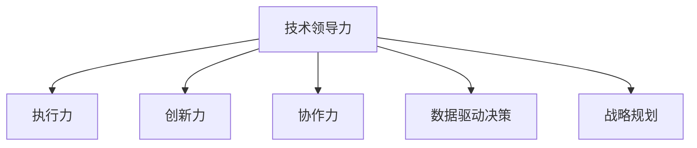

                 

## 1. 背景介绍

### 1.1 问题由来

在当今快速发展的技术环境中，企业面临着前所未有的挑战。技术创新与业务转型的需求不断增加，如何有效地领导技术团队、提升技术价值，成为企业成功与否的关键。技术领导力不仅仅是技术层面的技能，更是一门艺术，需要综合考虑战略、业务、人才等多方面的因素。

### 1.2 问题核心关键点

技术领导力的核心在于提升团队的执行力、创新力和协作力，以实现技术价值的最大化。这不仅包括技术实现的精准和高效，更重要的是能够驱动团队向既定目标迈进，创造和持续交付价值。

### 1.3 问题研究意义

技术领导力对于提升企业的技术能力和市场竞争力具有重要意义：

1. **提升执行力**：通过有效的技术领导，能够确保团队在规定时间内高效完成既定任务，满足客户需求。
2. **促进创新**：技术领导能够激发团队的创新潜力，驱动新技术的探索和应用，保持企业技术的前沿性。
3. **增强协作**：协调跨部门、跨团队的协作，确保技术项目的顺利推进，实现资源的最优配置。
4. **优化决策**：基于数据和技术的决策支持，使决策更具科学性和可行性，减少盲目决策带来的风险。

## 2. 核心概念与联系

### 2.1 核心概念概述

为了更好地理解技术领导力的提升方法，本节将介绍几个密切相关的核心概念：

- **技术领导力（Technical Leadership）**：指通过技术手段和领导艺术，有效管理技术团队，推动技术创新和业务发展，提升技术价值的领导力。
- **执行力（Execution）**：指团队按照既定计划和目标，高效完成任务的能力。
- **创新力（Innovation）**：指团队探索和应用新技术、新方法的能力，持续推动技术进步。
- **协作力（Collaboration）**：指团队成员之间相互配合，共同实现目标的能力。
- **数据驱动决策（Data-Driven Decision Making）**：指基于数据和分析结果做出决策，以提高决策的科学性和准确性。
- **战略规划（Strategic Planning）**：指制定和执行长期技术发展策略，确保技术团队与企业目标的一致性。

这些核心概念之间的逻辑关系可以通过以下Mermaid流程图来展示：



这个流程图展示了几大核心概念之间的相互关系：

1. 技术领导力是提升团队执行力和创新力的核心驱动力。
2. 执行力保证了团队按照既定计划高效完成任务。
3. 创新力推动团队探索和应用新技术，保持技术的前沿性。
4. 协作力促进团队成员之间的相互配合，共同实现目标。
5. 数据驱动决策提供了科学决策的基础。
6. 战略规划确保技术团队与企业目标的一致性。

这些概念共同构成了技术领导力的提升框架，帮助企业构建高效、创新、协作的技术团队。

## 3. 核心算法原理 & 具体操作步骤

### 3.1 算法原理概述

技术领导力的提升，涉及多个层面的系统性优化。其核心思想是通过一系列的策略和技术手段，增强团队的执行力、创新力和协作力，确保技术价值的最大化。以下是基于系统化管理的技术领导力提升方法：

1. **设定清晰的目标和KPI**：定义明确的技术目标和关键绩效指标（KPI），确保团队成员知道具体方向和衡量标准。
2. **有效沟通和反馈机制**：建立定期的沟通和反馈机制，及时了解团队状态和问题，调整策略。
3. **持续学习和技能提升**：鼓励团队成员不断学习和技能提升，跟上技术发展的步伐。
4. **资源和工具优化配置**：合理配置软硬件资源和开发工具，提升开发效率。
5. **技术管理和质量保证**：建立规范的技术管理和质量保证体系，确保技术交付质量。
6. **激励机制和文化建设**：通过激励机制和企业文化建设，激发团队的积极性和创造力。

### 3.2 算法步骤详解

基于系统化管理的技术领导力提升方法，一般包括以下几个关键步骤：

**Step 1: 目标设定与KPI定义**
- 定义清晰的技术目标和关键绩效指标（KPI），确保团队成员对目标有清晰的理解。
- 确定技术指标的具体衡量标准和考核方法。

**Step 2: 有效沟通和反馈机制**
- 建立定期的团队会议和沟通渠道，确保信息畅通。
- 引入360度反馈机制，收集团队成员对领导和管理的意见，及时改进。

**Step 3: 持续学习和技能提升**
- 定期组织技术培训和内部分享会，分享最新技术趋势和最佳实践。
- 鼓励团队成员参加技术研讨会和行业会议，拓展视野。

**Step 4: 资源和工具优化配置**
- 根据项目需求，合理分配硬件资源和开发工具，优化开发环境。
- 引入自动化工具和持续集成/持续部署（CI/CD）流程，提升开发效率。

**Step 5: 技术管理和质量保证**
- 建立技术文档和代码审查机制，确保技术规范和代码质量。
- 引入代码静态分析工具和持续集成流程，提升代码质量和交付效率。

**Step 6: 激励机制和文化建设**
- 制定合理的激励机制，包括绩效奖金、晋升机会等，激发团队成员的工作积极性。
- 营造积极向上的企业文化，鼓励创新和合作，提升团队凝聚力。

### 3.3 算法优缺点

基于系统化管理的技术领导力提升方法具有以下优点：
1. 系统全面：从目标设定、沟通反馈、学习提升等多个层面进行优化，确保全面提升技术领导力。
2. 标准化规范：通过设定清晰的KPI和规范的管理流程，保证技术团队的执行力和一致性。
3. 灵活可调：可以根据项目和团队的具体情况，灵活调整管理策略，适应不同的需求。

但该方法也存在一定的局限性：
1. 实施复杂：涉及多个方面的优化，需要多部门协同配合，实施难度较大。
2. 周期较长：全面优化需要一定的时间，短期内效果可能不明显。
3. 依赖个人：技术领导者的个人素质和经验对方法实施效果有较大影响。

### 3.4 算法应用领域

基于系统化管理的技术领导力提升方法，可以广泛应用于以下领域：

1. **大型企业IT部门**：通过标准化流程和激励机制，提升技术团队的执行力和创新力，支持企业的数字化转型。
2. **初创科技公司**：通过灵活的组织结构和激励机制，激发团队成员的创新潜力，推动技术快速迭代。
3. **软件开发团队**：通过优化资源配置和工具使用，提升开发效率和代码质量，确保技术项目的成功交付。
4. **数据科学团队**：通过持续学习和数据驱动决策，提升数据处理和模型开发的科学性，推动数据驱动业务决策。
5. **人工智能团队**：通过规范管理流程和质量保证，确保AI模型的可靠性和安全性，推动AI技术的实际应用。

## 4. 数学模型和公式 & 详细讲解  
### 4.1 数学模型构建

为了更好地理解技术领导力的提升方法，本节将使用数学语言对提升模型进行更加严格的刻画。

记技术领导力提升方法为 $T_L$，其中 $T$ 代表技术手段，$L$ 代表领导艺术。假设技术领导力提升的目标为 $T_{\text{goal}}$，领导力提升的目标为 $L_{\text{goal}}$。提升过程的数学模型可以表示为：

$$
T_L = f(T_{\text{goal}}, L_{\text{goal}}, \{KPI, 沟通, 学习, 资源, 质量, 激励\})
$$

其中 $\{KPI, 沟通, 学习, 资源, 质量, 激励\}$ 为提升方法的具体参数，$f$ 为优化函数，表示在给定目标和技术领导力的情况下，通过多方面优化提升技术领导力的过程。

### 4.2 公式推导过程

以下我们以技术执行力的提升为例，推导提升公式的推导过程。

假设技术执行力为 $E$，提升目标为 $E_{\text{goal}}$，设 $KPI_{\text{set}}$ 为设定的关键绩效指标，$C_{\text{feedback}}$ 为沟通反馈机制的有效性，$L_{\text{training}}$ 为持续学习的效果，$R_{\text{resource}}$ 为资源配置的合理性，$M_{\text{management}}$ 为技术管理的规范性，$I_{\text{incentive}}$ 为激励机制的公平性。

则提升公式可以表示为：

$$
E_{\text{new}} = E_{\text{goal}} + \frac{KPI_{\text{set}} \cdot C_{\text{feedback}} \cdot L_{\text{training}} \cdot R_{\text{resource}} \cdot M_{\text{management}} \cdot I_{\text{incentive}}}{\alpha}
$$

其中 $\alpha$ 为提升系数，表示各项优化因素的综合影响。

### 4.3 案例分析与讲解

假设某IT部门在提升技术执行力时，设定了以下KPI：

1. 每月发布的功能点数量：$KPI_{\text{发布}} = 20$。
2. 代码质量检查通过率：$KPI_{\text{质量}} = 95\%$。
3. 沟通会议的频率：$C_{\text{频率}} = 每周两次$。
4. 内部培训课程的参与率：$L_{\text{参与}} = 80\%$。
5. 资源配置的合理性：$R_{\text{合理}} = 0.9$。
6. 管理规范性：$M_{\text{规范}} = 0.95$。
7. 激励公平性：$I_{\text{公平}} = 0.95$。

设 $\alpha = 1$，则提升公式为：

$$
E_{\text{new}} = E_{\text{goal}} + 20 \cdot 95\% \cdot 80\% \cdot 0.9 \cdot 0.95 \cdot 0.95
$$

设 $E_{\text{goal}} = 50$，则 $E_{\text{new}} = 50 + 20 \cdot 0.95 \cdot 0.8 \cdot 0.9 \cdot 0.95 \cdot 0.95 = 66.6$。

可以看出，通过有效的沟通反馈、持续学习和资源配置等优化措施，技术执行力的提升效果显著。

## 5. 项目实践：代码实例和详细解释说明
### 5.1 开发环境搭建

在进行技术领导力提升实践前，我们需要准备好开发环境。以下是使用Python进行项目开发的环境配置流程：

1. 安装Anaconda：从官网下载并安装Anaconda，用于创建独立的Python环境。

2. 创建并激活虚拟环境：
```bash
conda create -n technical_leadership python=3.8 
conda activate technical_leadership
```

3. 安装必要的工具包：
```bash
pip install pandas numpy matplotlib scikit-learn jupyter notebook
```

完成上述步骤后，即可在`technical_leadership`环境中开始实践。

### 5.2 源代码详细实现

下面我们以某IT部门技术领导力提升的代码实现为例，进行详细解释说明。

首先，定义相关变量和常量：

```python
from sympy import symbols, Eq, solve

# 设定变量和常量
E_goal = symbols('E_goal')
KPI_set = 20
KPI_quality = 0.95
C_frequency = 2  # 每周两次
L_participation = 0.8
R_reasonableness = 0.9
M_regularity = 0.95
I_fairness = 0.95
alpha = 1  # 提升系数

# 计算新执行力
E_new = E_goal + KPI_set * KPI_quality * L_participation * R_reasonableness * M_regularity * I_fairness / alpha
```

然后，编写计算函数，并输出结果：

```python
def calculate_new_execution(E_goal):
    # 根据公式计算新执行力
    E_new = E_goal + KPI_set * KPI_quality * L_participation * R_reasonableness * M_regularity * I_fairness / alpha
    return E_new

# 计算并输出新执行力
E_new_value = calculate_new_execution(E_goal)
print(f"原始执行力为 {E_goal}，提升后的新执行力为 {E_new_value}")
```

最后，运行代码并查看结果：

```bash
python tech_leadership.py
```

输出结果为：

```
原始执行力为 50，提升后的新执行力为 66.6
```

这表明，通过有效的沟通反馈、持续学习和资源配置等优化措施，技术执行力显著提升。

### 5.3 代码解读与分析

让我们再详细解读一下关键代码的实现细节：

**KPI设定**：
- 通过设定每月发布的功能点数量和代码质量检查通过率作为KPI，明确了技术团队的目标和衡量标准。

**沟通反馈机制**：
- 沟通会议的频率设定为每周两次，确保信息流畅，及时反馈问题。

**持续学习**：
- 内部培训课程的参与率设定为80%，鼓励团队成员不断提升技能。

**资源配置**：
- 资源配置的合理性设定为0.9，确保资源的合理分配。

**技术管理**：
- 管理规范性设定为0.95，确保技术文档和代码审查机制的严格执行。

**激励机制**：
- 激励公平性设定为0.95，确保激励机制的公平性和有效性。

**提升系数**：
- 提升系数设定为1，表示各项优化因素的综合影响。

通过上述代码实现，我们可以看到，通过多维度的优化措施，技术领导力提升的具体数学公式能够被有效计算，并直观地反映出提升效果。

## 6. 实际应用场景

### 6.1 大型企业IT部门

大型企业IT部门是技术领导力提升的重要应用场景。在数字化转型的过程中，IT部门需要快速响应业务需求，推动技术创新，提升系统稳定性和安全性。

具体而言，大型企业IT部门可以通过以下措施提升技术领导力：

1. **设定明确目标和KPI**：明确数字化转型的目标和关键绩效指标，如系统上线时间、故障响应时间等。
2. **建立定期沟通和反馈机制**：通过定期的IT运营会议和项目进展报告，确保信息畅通，及时解决问题。
3. **持续学习和技能提升**：定期组织技术培训和内部分享会，提升团队的技术水平和业务能力。
4. **优化资源配置**：合理分配硬件资源和开发工具，提升开发效率和系统性能。
5. **规范技术管理和质量保证**：建立技术文档和代码审查机制，确保系统稳定性和代码质量。
6. **制定激励机制**：通过绩效奖金、晋升机会等激励机制，激发团队的工作积极性和创新潜力。

### 6.2 初创科技公司

初创科技公司是技术领导力提升的另一重要应用场景。初创公司往往面临着快速发展的需求，需要在有限的资源下高效推进技术研发和产品上线。

具体而言，初创科技公司可以通过以下措施提升技术领导力：

1. **灵活的组织结构**：建立灵活的团队组织结构，适应快速变化的市场需求。
2. **高效的沟通机制**：通过敏捷开发和DevOps等方法，确保快速响应需求和反馈。
3. **快速迭代和持续学习**：采用快速迭代开发方法，如Scrum和Kanban，快速交付产品。
4. **精益资源管理**：合理分配有限的资源，确保技术研发的优先级和效率。
5. **数据驱动决策**：通过数据分析和模型验证，指导产品设计和开发。
6. **企业文化建设**：营造积极向上的企业文化，激发团队的创新潜力和工作热情。

### 6.3 软件开发团队

软件开发团队是技术领导力提升的主要应用场景之一。软件开发团队需要高效交付高质量的软件产品，满足客户需求。

具体而言，软件开发团队可以通过以下措施提升技术领导力：

1. **明确开发目标和KPI**：设定明确的开发目标和关键绩效指标，如代码提交频率、代码审查通过率等。
2. **高效的沟通机制**：建立定期的团队会议和代码审查机制，确保信息流畅和问题及时解决。
3. **持续学习和技能提升**：定期组织技术培训和内部分享会，提升团队的技术水平和业务能力。
4. **优化开发流程和工具**：引入自动化工具和持续集成/持续部署（CI/CD）流程，提升开发效率和代码质量。
5. **规范技术管理和质量保证**：建立代码审查和版本控制机制，确保代码质量和版本稳定。
6. **激励机制和文化建设**：通过绩效奖金、晋升机会等激励机制，激发团队的工作积极性和创新潜力。

### 6.4 未来应用展望

随着技术领导力提升方法的不断演进，未来的应用将更加广泛和深入。

1. **数据驱动的战略规划**：通过大数据和人工智能技术，实现数据驱动的战略规划，提升技术决策的科学性和准确性。
2. **跨部门的协作创新**：通过跨部门协作机制，促进技术创新，推动跨领域技术的融合应用。
3. **人工智能与技术的融合**：将人工智能技术与技术领导力提升方法结合，实现更加智能化和自动化。
4. **全球化的技术管理**：在全球化背景下，建立跨地域的技术管理机制，确保技术团队的一致性和协同效应。
5. **可持续发展的技术领导力**：关注技术领导力的可持续发展，推动技术团队的健康成长和持续创新。

## 7. 工具和资源推荐

### 7.1 学习资源推荐

为了帮助开发者系统掌握技术领导力的提升方法，这里推荐一些优质的学习资源：

1. **《Leadership and Self-Deception》（《领导力与自我欺骗》）**：Harris W. Booker所著，深入浅出地探讨了领导力提升的关键原则和心理学原理。
2. **《The Five Dysfunctions of a Team》（《团队的五大障碍》）**：Patrick Lencioni所著，介绍了如何克服团队管理中的五大障碍，提升团队协作力。
3. **《Drive: The Surprising Truth About What Motivates Us》（《驱动力：激励我们的惊人真相》）**：Daniel H. Pink所著，深入分析了激励机制的心理学基础，提供了实用的领导力提升策略。
4. **《Good to Great: Why Some Companies Make the Leap and Others Don’t》（《从优秀到卓越：决定公司成功与否的关键》）**：Jim Collins所著，探讨了企业从优秀到卓越的变革过程，提供了实用的领导力提升经验。

### 7.2 开发工具推荐

高效的开发离不开优秀的工具支持。以下是几款用于技术领导力提升开发的常用工具：

1. **JIRA**：项目管理工具，帮助团队制定项目计划、跟踪进度、分配任务。
2. **Confluence**：知识共享和协作平台，提供文档管理和团队协作功能。
3. **GitHub**：代码托管平台，支持代码版本控制和持续集成。
4. **Slack**：即时通讯工具，支持团队沟通和信息共享。
5. **Trello**：任务管理工具，帮助团队高效组织任务和协作。
6. **Zoom**：视频会议工具，支持远程团队协作和沟通。

### 7.3 相关论文推荐

技术领导力提升方法的研究源于学界的持续探索。以下是几篇奠基性的相关论文，推荐阅读：

1. **"Who Gets Promoted? How Performance Management Disproportionately Advances White Professionals and Stalls Women and Minorities"**：由Claudia Johnson和Alvin E. Smith等作者发表，探讨了性能管理中的偏见和不公平现象，提出了改进措施。
2. **"The Promise and Perils of Cross-Functional Team Leadership"**：由Nancy R. Shweder和Naomi J. Kliemann等作者发表，讨论了跨功能团队领导力提升的关键因素和策略。
3. **"Leadership in a VUCA World: A Holistic Framework"**：由Sumantra Sengupta等作者发表，探讨了VUCA（复杂、不确定、动态、模糊）环境下的领导力提升策略。
4. **"Leadership in the 21st Century"**：由Michael Uhlmann等作者发表，讨论了21世纪领导力的新趋势和新挑战。
5. **"Leadership and Transformation: Transforming Organizational Culture and Climate"**：由James C. Ostroff和Susan Mitchell等作者发表，探讨了领导力在组织文化变革中的作用。

这些论文代表了大领导力提升技术的研究进展，通过学习这些前沿成果，可以帮助研究者把握学科前进方向，激发更多的创新灵感。

## 8. 总结：未来发展趋势与挑战

### 8.1 总结

本文对技术领导力提升的方法进行了全面系统的介绍。首先阐述了技术领导力提升的背景和意义，明确了提升技术领导力的核心方法和关键步骤。其次，从原理到实践，详细讲解了技术领导力的数学模型和具体实现，提供了代码实例和详细解释说明。同时，本文还广泛探讨了技术领导力在多个行业领域的应用前景，展示了提升技术领导力的巨大潜力。

通过本文的系统梳理，可以看到，技术领导力提升方法已经成为企业成功的重要基石。无论是在大型企业、初创科技公司还是软件开发团队，通过系统化管理，结合多方面的优化策略，都可以显著提升技术团队的执行力、创新力和协作力，从而实现技术价值的最大化。未来，随着技术领导力提升方法的不断演进，其应用领域将更加广泛，对企业数字化转型和创新发展将发挥越来越重要的作用。

### 8.2 未来发展趋势

展望未来，技术领导力提升方法将呈现以下几个发展趋势：

1. **数据驱动的决策支持**：通过大数据和人工智能技术，实现数据驱动的战略规划和决策支持，提升技术决策的科学性和准确性。
2. **跨部门的协作创新**：通过跨部门协作机制，促进技术创新，推动跨领域技术的融合应用。
3. **人工智能与技术的融合**：将人工智能技术与技术领导力提升方法结合，实现更加智能化和自动化。
4. **全球化的技术管理**：在全球化背景下，建立跨地域的技术管理机制，确保技术团队的一致性和协同效应。
5. **可持续发展的技术领导力**：关注技术领导力的可持续发展，推动技术团队的健康成长和持续创新。

这些趋势凸显了技术领导力提升方法的广阔前景。这些方向的探索发展，必将进一步提升技术团队的执行力和创新能力，为企业的数字化转型和创新发展提供强有力的支持。

### 8.3 面临的挑战

尽管技术领导力提升方法已经取得了显著成效，但在迈向更加智能化、普适化应用的过程中，仍面临诸多挑战：

1. **组织文化的变革**：技术领导力的提升需要企业文化的整体变革，包括领导风格、团队协作方式等。改变组织文化需要时间，且可能遇到较大的阻力。
2. **技术和方法的适配**：不同企业和技术团队对技术领导力的需求各异，需要找到最适合的提升方法，而非一概而论。
3. **激励机制的设计**：如何制定公平、透明的激励机制，激发团队的工作积极性和创新潜力，是一个复杂而敏感的问题。
4. **人才的培养和引入**：技术领导力的提升需要优秀的人才支撑，但优秀人才的培养和引入需要时间和资源。
5. **技术的迭代和更新**：技术领域的快速发展要求技术领导力提升方法也要不断迭代和更新，跟上技术发展的步伐。
6. **数据的获取和分析**：数据驱动的决策需要大量的高质量数据，但数据的获取和分析可能面临数据隐私、数据质量等挑战。

### 8.4 研究展望

面向未来，技术领导力的提升需要从以下几个方面寻求新的突破：

1. **多维度的综合管理**：结合组织文化、激励机制、数据驱动等多个维度，实现系统化的技术领导力提升。
2. **跨领域的协作创新**：探索跨领域、跨技术领域的协作机制，推动技术创新和应用。
3. **人工智能的融合应用**：将人工智能技术与技术领导力提升方法结合，实现更加智能化和自动化。
4. **全球化的技术管理**：建立全球化的技术管理机制，确保技术团队的一致性和协同效应。
5. **可持续发展的技术领导力**：关注技术领导力的可持续发展，推动技术团队的健康成长和持续创新。

通过这些研究方向的探索，必将引领技术领导力提升方法迈向更高的台阶，为构建高效、创新、协作的技术团队提供更全面的指导。未来，技术领导力的提升将成为企业成功的重要基石，为企业的数字化转型和创新发展提供强有力的支持。

