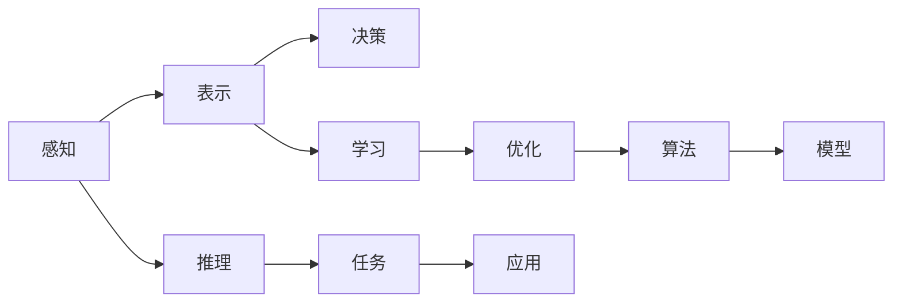

                 

# 探索人工智能基本原理的框架

## 1. 背景介绍

### 1.1 问题由来
人工智能(AI)作为21世纪最具颠覆性的技术之一，正逐渐渗透到各行各业，改变着我们的工作和生活方式。随着深度学习、计算机视觉、自然语言处理等技术的不断进步，AI已经从实验室走向实际应用，为各行各业带来了前所未有的机遇和挑战。然而，尽管AI技术在不断进步，对其基本原理的深入理解和框架构建，仍然是推动AI技术发展的关键。

### 1.2 问题核心关键点
本文聚焦于人工智能基本原理的框架构建，试图通过系统的理论分析和实践经验，为研究者和开发者提供一个清晰的理解和指导。我们将从基本概念出发，探讨人工智能的核心算法和模型，以及这些算法和模型在实际应用中的表现和挑战。

## 2. 核心概念与联系

### 2.1 核心概念概述

为更好地理解人工智能基本原理的框架，本节将介绍几个核心概念：

- **人工智能(AI)**：指通过计算机程序和算法，使机器模拟人类智能行为，包括感知、推理、学习、决策等能力。

- **深度学习(Deep Learning)**：一种基于人工神经网络的机器学习方法，通过多层非线性变换，实现对大规模数据的高效建模和处理。

- **强化学习(Reinforcement Learning)**：一种通过与环境互动，不断试错学习和优化策略的AI技术。

- **自然语言处理(NLP)**：研究计算机如何处理和理解人类语言，包括语言理解、生成、翻译等任务。

- **计算机视觉(Computer Vision)**：研究计算机如何理解和分析图像和视频数据，包括目标检测、图像分割、场景理解等任务。

- **推荐系统(Recommendation Systems)**：一种基于用户行为数据和物品特征，智能推荐相关物品的技术，广泛应用于电商、社交网络等领域。

这些核心概念共同构成了人工智能的技术基础，涵盖了从基础感知到高级推理的各个层次，为后续深入研究提供了清晰的框架。

### 2.2 核心概念原理和架构的 Mermaid 流程图



这个流程图展示了人工智能的基本框架：

1. **感知**：通过传感器和数据采集，获取外部信息。
2. **表示**：将感知数据转化为机器可处理的数字形式，如图像表示、文本表示等。
3. **推理**：通过机器学习模型进行数据处理和逻辑推理。
4. **决策**：根据推理结果，生成智能行为和决策。
5. **学习**：利用经验数据不断优化模型参数，提升智能性能。
6. **任务**：定义具体应用场景，如自然语言理解、目标检测等。
7. **优化**：调整模型和算法参数，提升性能。
8. **算法**：选择和设计适用于特定任务的算法。
9. **模型**：设计具体的模型架构，如神经网络、决策树等。
10. **应用**：将模型部署到实际应用场景中，进行智能处理。

## 3. 核心算法原理 & 具体操作步骤
### 3.1 算法原理概述

人工智能的算法和模型多种多样，但基本的框架可以归纳为以下步骤：

1. **数据预处理**：收集和清洗数据，进行特征提取和转换。
2. **模型选择**：根据任务需求选择合适的模型和算法。
3. **模型训练**：利用标注数据训练模型，调整参数，使其能更好地适应任务。
4. **模型评估**：通过测试集评估模型性能，调整超参数和模型结构。
5. **模型部署**：将训练好的模型部署到实际应用中，进行智能处理。

### 3.2 算法步骤详解

**数据预处理**：
- **数据收集**：从不同来源获取数据，包括公开数据集、API接口、传感器数据等。
- **数据清洗**：去除噪声和异常值，处理缺失数据，保证数据质量。
- **特征提取**：将原始数据转化为机器可处理的形式，如特征向量、标签等。

**模型选择**：
- **任务识别**：根据任务类型选择合适的算法和模型。如分类任务常用逻辑回归、SVM、决策树等；回归任务常用线性回归、岭回归等。
- **算法设计**：根据数据特征和任务需求，设计合适的算法结构和参数。

**模型训练**：
- **参数初始化**：设置模型初始参数，如权重、偏置等。
- **前向传播**：将输入数据通过模型，得到预测输出。
- **损失计算**：计算模型预测输出与真实标签之间的误差。
- **反向传播**：根据误差，计算梯度，调整模型参数。
- **迭代优化**：重复前向传播、损失计算和反向传播，直至模型收敛。

**模型评估**：
- **测试集划分**：将数据集分为训练集和测试集。
- **模型评估**：在测试集上评估模型性能，如准确率、召回率、F1-score等。
- **超参数调优**：根据评估结果，调整模型超参数，如学习率、正则化参数等。

**模型部署**：
- **模型保存**：将训练好的模型保存为文件或数据库。
- **模型加载**：在实际应用中加载模型，进行预测和推理。
- **实时监控**：实时采集模型性能指标，监控模型运行状态。

### 3.3 算法优缺点

人工智能算法和模型各有优缺点，主要体现在以下方面：

**优点**：
- **高效处理大规模数据**：深度学习模型能够高效处理大规模数据，适用于图像、文本、语音等多种数据类型。
- **自动特征提取**：深度学习模型能够自动学习数据中的重要特征，减少人工干预。
- **泛化能力强**：经过充分训练的深度学习模型具有较强的泛化能力，能够适应多种数据分布。

**缺点**：
- **模型复杂度高**：深度学习模型结构复杂，训练和推理成本较高。
- **需要大量标注数据**：许多深度学习算法需要大量标注数据进行训练，标注成本高。
- **解释性差**：深度学习模型通常是黑盒系统，难以解释其内部工作机制。

### 3.4 算法应用领域

人工智能算法和模型在各个领域都有广泛应用，如：

- **自然语言处理(NLP)**：包括文本分类、情感分析、机器翻译等任务。
- **计算机视觉(CV)**：包括图像识别、目标检测、图像分割等任务。
- **推荐系统(Recommender Systems)**：如电商推荐、音乐推荐、视频推荐等。
- **强化学习(Reinforcement Learning)**：如游戏AI、自动驾驶、机器人控制等。
- **智能客服**：通过自然语言处理和机器学习技术，提供自动问答和智能推荐服务。
- **医疗诊断**：利用计算机视觉和深度学习技术，辅助医生进行疾病诊断和治疗方案推荐。
- **金融风控**：通过机器学习和大数据分析，识别和预测金融风险。

这些应用领域展示了人工智能技术的广泛应用，也突显了深度学习、强化学习等算法的重要性。

## 4. 数学模型和公式 & 详细讲解 & 举例说明
### 4.1 数学模型构建

人工智能的数学模型可以归结为优化问题，即在给定约束条件下，最小化或最大化某个目标函数。

形式化地，假设数据集为 $D=\{(x_i, y_i)\}_{i=1}^N$，其中 $x_i$ 为输入特征，$y_i$ 为标签。模型的目标函数为 $L(\theta)$，其中 $\theta$ 为模型参数。目标为最小化损失函数 $L(\theta)$：

$$
\min_{\theta} \sum_{i=1}^N L(\theta, x_i, y_i)
$$

其中，损失函数 $L(\theta, x_i, y_i)$ 衡量模型预测输出与真实标签之间的差异。

### 4.2 公式推导过程

以线性回归为例，推导最小二乘法的目标函数和梯度下降算法的具体步骤：

**目标函数**：
假设目标函数为均方误差损失函数，则目标函数为：

$$
L(\theta) = \frac{1}{2N} \sum_{i=1}^N (y_i - \theta^T x_i)^2
$$

其中，$\theta^T x_i$ 为模型预测输出，$y_i$ 为真实标签。

**梯度下降算法**：
梯度下降算法通过计算目标函数对参数 $\theta$ 的梯度，不断调整参数值，使目标函数最小化。梯度下降的更新公式为：

$$
\theta \leftarrow \theta - \eta \nabla_{\theta} L(\theta)
$$

其中，$\eta$ 为学习率，$\nabla_{\theta} L(\theta)$ 为损失函数对参数 $\theta$ 的梯度。

### 4.3 案例分析与讲解

以图像分类为例，分析卷积神经网络(CNN)的训练过程：

- **数据预处理**：将图像转换为特征向量，归一化处理。
- **模型选择**：选择卷积神经网络模型作为分类器。
- **模型训练**：通过反向传播算法，计算损失函数对每个权重参数的梯度，使用梯度下降法调整权重。
- **模型评估**：在测试集上评估模型性能，计算准确率和损失。
- **模型部署**：将训练好的模型部署到实际应用中，进行图像分类。

## 5. 项目实践：代码实例和详细解释说明
### 5.1 开发环境搭建

在进行人工智能项目实践前，需要准备好开发环境。以下是使用Python进行TensorFlow开发的环境配置流程：

1. 安装Anaconda：从官网下载并安装Anaconda，用于创建独立的Python环境。

2. 创建并激活虚拟环境：
```bash
conda create -n tf-env python=3.8 
conda activate tf-env
```

3. 安装TensorFlow：根据CUDA版本，从官网获取对应的安装命令。例如：
```bash
pip install tensorflow
```

4. 安装各类工具包：
```bash
pip install numpy pandas scikit-learn matplotlib tqdm jupyter notebook ipython
```

完成上述步骤后，即可在`tf-env`环境中开始项目实践。

### 5.2 源代码详细实现

我们以线性回归为例，展示TensorFlow的代码实现：

```python
import tensorflow as tf

# 定义目标函数
def loss_fn(y_true, y_pred):
    return tf.reduce_mean(tf.square(y_true - y_pred))

# 定义梯度下降更新函数
def train_fn(x, y, learning_rate, batch_size):
    num_epochs = 1000
    dataset = tf.data.Dataset.from_tensor_slices((x, y))
    dataset = dataset.shuffle(1000).batch(batch_size)
    
    for epoch in range(num_epochs):
        for (batch_x, batch_y) in dataset:
            with tf.GradientTape() as tape:
                predictions = model(batch_x)
                loss = loss_fn(batch_y, predictions)
            gradients = tape.gradient(loss, model.trainable_variables)
            optimizer.apply_gradients(zip(gradients, model.trainable_variables))
```

### 5.3 代码解读与分析

以下是关键代码的实现细节：

**损失函数**：
- `loss_fn`函数计算均方误差损失。

**梯度下降更新函数**：
- `train_fn`函数定义了梯度下降算法，通过迭代更新模型参数，使损失函数最小化。

**TensorFlow模型**：
- 假设模型为`model`，使用`model(batch_x)`计算模型预测输出，`tf.reduce_mean(tf.square(y_true - y_pred))`计算损失函数。

**数据处理**：
- `dataset.from_tensor_slices`将原始数据转换为TensorFlow可处理的格式。
- `dataset.shuffle`和`dataset.batch`对数据进行打乱和分批次加载。

**训练过程**：
- `for`循环控制训练轮数，`for`循环内部迭代训练数据。
- `with tf.GradientTape()`开启梯度计算，`tape.gradient`计算梯度，`optimizer.apply_gradients`更新模型参数。

**运行结果展示**：
```python
import numpy as np

# 生成随机数据
x = np.random.rand(100).reshape(10, 10)
y = 2*x + np.random.randn(10, 1)

# 创建模型
model = tf.keras.Sequential([
    tf.keras.layers.Dense(1, input_shape=(10,))
])

# 训练模型
train_fn(x, y, learning_rate=0.01, batch_size=10)

# 预测新数据
new_x = np.random.rand(1, 10)
predictions = model.predict(new_x)
```

## 6. 实际应用场景
### 6.1 智能客服系统

智能客服系统通过自然语言处理技术，实现自动问答和智能推荐服务。智能客服系统可以24小时在线，快速响应客户咨询，提高客户满意度。

在技术实现上，可以收集企业内部的历史客服对话记录，将问题和最佳答复构建成监督数据，在此基础上对预训练模型进行微调。微调后的模型能够自动理解用户意图，匹配最合适的答案模板进行回复。对于客户提出的新问题，还可以接入检索系统实时搜索相关内容，动态组织生成回答。

### 6.2 金融风控系统

金融风控系统利用机器学习和大数据分析技术，识别和预测金融风险。传统的人工风控方法成本高、效率低，难以应对网络时代海量信息爆发的挑战。通过机器学习模型，可以对用户的信用记录、交易行为进行分析，预测其未来的还款能力。一旦发现风险较高的用户，系统便会自动触发预警，帮助金融机构及时防范风险。

### 6.3 推荐系统

推荐系统通过机器学习和大数据分析技术，智能推荐相关物品。推荐系统可以应用在电商、社交网络等多个领域，为用户提供个性化的推荐服务。通过分析用户的历史行为数据，推荐系统可以预测用户可能感兴趣的商品，提高用户满意度和转化率。

## 7. 工具和资源推荐
### 7.1 学习资源推荐

为了帮助开发者系统掌握人工智能的基本原理和实践技巧，这里推荐一些优质的学习资源：

1. 《深度学习》系列博文：由大模型技术专家撰写，深入浅出地介绍了深度学习的基本概念和常用算法。

2. Coursera《机器学习》课程：斯坦福大学开设的机器学习经典课程，提供丰富的学习资源和实际应用案例。

3. 《TensorFlow实战》书籍：TensorFlow官方出版的实战指南，详细介绍了TensorFlow的基本用法和实际应用。

4. Kaggle平台：提供大量公开数据集和竞赛，通过实际项目训练和比赛，提升实战能力。

5. Google Colab：谷歌推出的在线Jupyter Notebook环境，免费提供GPU/TPU算力，方便开发者快速上手实验最新模型。

通过对这些资源的学习实践，相信你一定能够快速掌握人工智能的基本原理和实践技巧，并用于解决实际的AI问题。

### 7.2 开发工具推荐

高效的开发离不开优秀的工具支持。以下是几款用于人工智能开发常用的工具：

1. TensorFlow：由Google主导开发的开源深度学习框架，生产部署方便，适合大规模工程应用。

2. PyTorch：基于Python的开源深度学习框架，灵活动态的计算图，适合快速迭代研究。

3. Keras：高层次的神经网络API，提供简洁的API接口，易于上手。

4. Weights & Biases：模型训练的实验跟踪工具，可以记录和可视化模型训练过程中的各项指标，方便对比和调优。

5. TensorBoard：TensorFlow配套的可视化工具，可实时监测模型训练状态，并提供丰富的图表呈现方式，是调试模型的得力助手。

合理利用这些工具，可以显著提升人工智能项目的开发效率，加快创新迭代的步伐。

### 7.3 相关论文推荐

人工智能领域的研究成果丰硕，以下是几篇奠基性的相关论文，推荐阅读：

1. AlexNet：2012年ImageNet图像分类大赛冠军模型，开启了深度学习在计算机视觉领域的应用。

2. GoogleNet和Inception：2014年ImageNet图像分类大赛冠军模型，提出卷积神经网络的多层结构，大幅提升模型性能。

3. ResNet：2015年ImageNet图像分类大赛冠军模型，提出残差网络结构，解决了深层网络训练中的梯度消失问题。

4. Attention Mechanism：提出注意力机制，解决序列建模中的信息遮挡问题，提升了自然语言处理模型的表现。

5. AlphaGo：2016年AlphaGo战胜围棋世界冠军，展示了强化学习的强大能力。

这些论文代表了大规模深度学习模型的发展脉络，展示了深度学习技术在计算机视觉和自然语言处理领域的重要进展。

## 8. 总结：未来发展趋势与挑战
### 8.1 总结

本文对人工智能基本原理的框架构建进行了全面系统的介绍。首先，我们阐述了人工智能的基本概念和核心算法，展示了深度学习、自然语言处理、计算机视觉等技术的广泛应用。其次，我们通过数学模型和公式，详细讲解了人工智能的目标函数和优化算法，并通过案例分析，进一步说明了这些算法的应用过程。

通过本文的系统梳理，可以看到，人工智能技术的广泛应用和大规模深度学习模型的强大能力。这些技术不仅推动了各行业的数字化转型，也极大地提高了人类生活的智能化水平。未来，随着人工智能技术的不断进步，我们必将看到更多创新突破，为社会带来更广泛、更深刻的变化。

### 8.2 未来发展趋势

展望未来，人工智能技术将继续快速发展，呈现以下几个趋势：

1. **模型的泛化能力增强**：随着预训练模型的规模不断增大，模型的泛化能力和泛化性能也将显著提升。大规模模型能够更好地适应各种数据分布，解决更多复杂问题。

2. **算法的自动化**：未来的算法设计将更多地依赖自动化工具，如自动搜索超参数、自动化模型选择等，大幅提升模型训练的效率和精度。

3. **多模态融合**：未来的模型将更多地融合多种模态数据，如图像、语音、文本等，提升跨模态数据理解和处理的性能。

4. **实时性提升**：随着硬件设备的进步，深度学习模型的推理速度和实时性也将显著提升，满足更多实时应用的需求。

5. **可解释性和透明性增强**：未来的模型将更注重可解释性和透明性，能够清晰地解释其决策过程，增强用户信任和应用可靠性。

6. **伦理和安全保障**：随着人工智能技术的广泛应用，伦理和安全问题将成为重要考量。未来的模型将更多地融入伦理和安全保障机制，确保其使用的安全性和公平性。

### 8.3 面临的挑战

尽管人工智能技术取得了瞩目成就，但在迈向更加智能化、普适化应用的过程中，仍面临诸多挑战：

1. **数据隐私和安全**：随着数据量的增加，数据隐私和安全问题愈发突出。如何在保障数据隐私的同时，实现数据的高效利用，将是未来的重要课题。

2. **模型的公平性和鲁棒性**：当前的人工智能模型仍存在公平性和鲁棒性问题，即在不同数据分布下表现不一致，甚至产生偏见。如何提高模型的公平性和鲁棒性，避免歧视性输出，还需更多研究和实践。

3. **模型的解释性和透明性**：尽管深度学习模型的表现优异，但其黑盒特性使其难以解释和调试。如何提高模型的解释性和透明性，增强用户信任，将是未来的重要研究方向。

4. **算法的自动化和可解释性**：尽管自动化工具在提升模型效率和精度方面取得了进展，但算法的自动化和可解释性问题仍未完全解决。如何在保证模型效率的同时，增强算法的透明性和可解释性，将是未来的重要课题。

5. **跨模态融合的复杂性**：多模态数据的融合虽然带来了新的应用场景，但也增加了融合的复杂性。如何在保留模态特性的同时，实现不同模态数据的协同建模，将是一个重要的研究方向。

### 8.4 研究展望

面对人工智能技术所面临的诸多挑战，未来的研究需要在以下几个方面寻求新的突破：

1. **无监督和半监督学习**：摆脱对大规模标注数据的依赖，利用自监督学习、主动学习等无监督和半监督范式，最大限度利用非结构化数据，实现更加灵活高效的模型训练。

2. **多任务学习**：通过多任务学习，模型能够同时学习多个相关任务，提升模型泛化能力和性能。

3. **自适应学习**：开发自适应学习算法，使得模型能够根据环境和任务的变化，动态调整模型参数和结构，适应更广泛的应用场景。

4. **跨模态学习**：通过跨模态学习，模型能够融合多种模态数据，提升跨模态数据理解和处理的性能。

5. **鲁棒性和公平性**：研究如何提高模型的鲁棒性和公平性，避免模型在训练数据分布变化时性能下降，同时避免模型输出中的歧视性偏见。

6. **可解释性和透明性**：开发可解释性和透明性更高的模型，提高模型的解释性和用户信任度。

这些研究方向将引领人工智能技术迈向更高层次，推动人工智能技术在各领域的广泛应用。未来，人工智能技术必将在更多领域得到应用，为人类生活带来更广泛、更深远的影响。

## 9. 附录：常见问题与解答

**Q1：人工智能和深度学习的关系是什么？**

A: 人工智能是研究如何让机器模拟人类智能行为的技术，深度学习是其中一种基于人工神经网络的机器学习方法。深度学习通过多层非线性变换，实现对大规模数据的高效建模和处理，是人工智能技术的重要组成部分。

**Q2：人工智能算法的训练过程是怎样的？**

A: 人工智能算法的训练过程通常包括以下步骤：数据预处理、模型选择、模型训练、模型评估和模型部署。其中，模型训练是关键步骤，通过反向传播算法计算梯度，调整模型参数，使模型在目标函数最小化或最大化的过程中不断优化。

**Q3：如何提高人工智能算法的泛化能力？**

A: 提高人工智能算法的泛化能力，可以通过以下方法：
1. 使用大规模、多样化的数据集进行训练。
2. 使用正则化技术，如L2正则化、Dropout等，防止过拟合。
3. 使用迁移学习，利用预训练模型在不同任务间共享知识。
4. 使用多任务学习，同时学习多个相关任务，提升模型泛化能力。

**Q4：人工智能算法在实际应用中面临哪些挑战？**

A: 人工智能算法在实际应用中面临的挑战包括：
1. 数据隐私和安全问题。
2. 模型的公平性和鲁棒性问题。
3. 算法的自动化和可解释性问题。
4. 跨模态融合的复杂性问题。
5. 模型的解释性和透明性问题。

**Q5：未来人工智能技术将如何发展？**

A: 未来人工智能技术将朝着以下几个方向发展：
1. 模型的泛化能力增强。
2. 算法的自动化。
3. 多模态融合。
4. 实时性提升。
5. 可解释性和透明性增强。
6. 伦理和安全保障。

通过不断解决上述挑战，未来的人工智能技术将更加智能、普适、透明和安全，为各行各业带来更广泛、更深刻的变化。

---

作者：禅与计算机程序设计艺术 / Zen and the Art of Computer Programming

