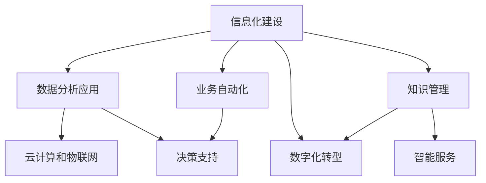

                 

## 1. 背景介绍

在当今快速变化的商业环境中，提升企业的核心竞争力已变得越来越重要。技术创新、运营效率、市场策略等都是决定企业能否在激烈的市场竞争中脱颖而出的关键因素。然而，这些因素的优化需要系统化的策略和方法论，本文将重点探讨提升核心竞争力的生产力策略。

### 1.1 问题由来

随着科技的进步，企业面临的环境越来越复杂。传统的管理方法，如仅关注财务指标，已无法应对快速变化的商业环境。企业需要更灵活、更智能的管理方式，以应对不确定性和挑战。现代企业越来越依赖于信息技术，因此信息技术和生产力策略的融合，成为提升核心竞争力的关键。

### 1.2 问题核心关键点

提升核心竞争力的生产力策略，本质上是将信息技术与企业管理实践相结合，以提高企业的运营效率、创新能力和市场响应速度。其核心关键点包括：

1. 信息化建设：利用信息技术提升企业的信息管理和业务流程自动化水平。
2. 数据分析应用：通过数据分析挖掘企业运营的深层次问题和机会。
3. 知识管理：构建知识管理系统，共享和复用企业经验，提升员工技能。
4. 数字化转型：将企业的业务模式和流程数字化，提高响应速度和效率。
5. 云计算和物联网：利用云服务和物联网技术，实现资源的优化配置和实时监控。

这些关键点共同构成了一个系统的、整体的生产力策略框架，旨在通过技术手段，全面提升企业的核心竞争力。

## 2. 核心概念与联系

### 2.1 核心概念概述

为了更好地理解提升核心竞争力的生产力策略，本节将介绍几个密切相关的核心概念：

1. **信息化建设**：通过信息技术，实现企业的信息管理和业务流程自动化，提高效率和准确性。

2. **数据分析应用**：利用数据分析技术，从企业运营数据中提取有价值的信息，指导业务决策。

3. **知识管理**：构建知识管理系统，促进信息的共享和复用，提升企业整体的知识水平。

4. **数字化转型**：将企业的业务模式和流程数字化，实现业务流程的优化和自动化。

5. **云计算和物联网**：利用云服务和物联网技术，实现资源的优化配置和实时监控，提高企业的响应速度和效率。

这些核心概念之间的逻辑关系可以通过以下Mermaid流程图来展示：



这个流程图展示了一个系统的信息化建设框架，以及各个模块之间的关联性。

## 3. 核心算法原理 & 具体操作步骤

### 3.1 算法原理概述

提升核心竞争力的生产力策略，基于信息技术的应用和管理理念，旨在通过系统化的方法，提高企业的运营效率、创新能力和市场响应速度。其核心算法原理包括以下几个方面：

1. **信息化建设**：通过自动化和智能化的信息技术，优化企业的业务流程，提升效率和准确性。

2. **数据分析应用**：利用数据挖掘和机器学习技术，从企业运营数据中提取有价值的信息，指导业务决策。

3. **知识管理**：构建知识管理系统，促进信息的共享和复用，提升企业整体的知识水平。

4. **数字化转型**：将企业的业务模式和流程数字化，实现业务流程的优化和自动化。

5. **云计算和物联网**：利用云服务和物联网技术，实现资源的优化配置和实时监控，提高企业的响应速度和效率。

### 3.2 算法步骤详解

基于提升核心竞争力的生产力策略，以下是具体的算法步骤：

1. **信息化建设**：
   - 识别关键业务流程，通过信息技术实现自动化。
   - 选择合适的自动化工具和技术，如ERP、CRM等。
   - 设计和实施信息系统，确保数据的安全和可靠。

2. **数据分析应用**：
   - 收集和整合企业运营数据。
   - 利用数据挖掘和机器学习技术，提取有价值的信息。
   - 将分析结果转化为业务决策和改进措施。

3. **知识管理**：
   - 构建知识管理系统，实现信息的共享和复用。
   - 利用知识管理工具，如Wiki、SharePoint等，促进知识传播。
   - 定期进行知识更新和培训，提升员工技能。

4. **数字化转型**：
   - 识别企业的数字化需求和机会。
   - 设计和实施数字化解决方案，如云计算、大数据、物联网等。
   - 优化业务流程，实现数字化运营。

5. **云计算和物联网**：
   - 利用云计算技术，实现资源的优化配置和灵活扩展。
   - 利用物联网技术，实现设备和数据的实时监控和控制。

### 3.3 算法优缺点

提升核心竞争力的生产力策略，具有以下优点：

1. **提高效率**：通过信息化建设、自动化和数字化转型，大幅提高企业的运营效率和响应速度。

2. **优化决策**：通过数据分析应用，帮助企业基于数据做出更科学的决策。

3. **促进创新**：通过知识管理，促进知识共享和复用，激发员工创新能力。

4. **增强市场竞争力**：通过云计算和物联网，实现资源的优化配置和实时监控，提升市场竞争力。

同时，该策略也存在一些局限性：

1. **成本高昂**：信息技术建设和数字化转型需要大量的资金投入。

2. **技术复杂**：需要高水平的技术人员和专家团队进行实施和维护。

3. **数据质量问题**：数据收集和整合过程中，可能存在数据不完整、不准确等问题。

4. **文化变革**：企业需要进行文化变革，打破传统思维模式，拥抱新技术。

5. **安全风险**：信息技术的应用可能带来新的安全风险，需要相应的安全保障措施。

尽管存在这些局限性，提升核心竞争力的生产力策略依然是大势所趋，尤其是在数字化时代。

### 3.4 算法应用领域

提升核心竞争力的生产力策略，已经在多个行业得到了广泛应用，包括但不限于：

1. **制造业**：通过信息化建设，实现生产流程的自动化和数字化，提高生产效率和产品质量。

2. **零售业**：通过数据分析应用，优化库存管理，提升客户体验，增加销售额。

3. **金融业**：利用云计算和物联网技术，实现金融产品的智能化和个性化服务。

4. **医疗保健**：通过数字化转型，实现医疗信息的共享和复用，提高医疗服务的质量和效率。

5. **教育**：通过知识管理和数字化转型，实现教育资源的共享和个性化学习。

这些行业案例，展示了提升核心竞争力的生产力策略在实际应用中的巨大潜力。

## 4. 数学模型和公式 & 详细讲解 & 举例说明

### 4.1 数学模型构建

提升核心竞争力的生产力策略，涉及多个方面的数学模型构建，包括信息化建设、数据分析应用、知识管理、数字化转型和云计算与物联网。

1. **信息化建设**：
   - 输入：企业业务流程和信息技术需求。
   - 输出：自动化的信息系统，提升效率和准确性。

2. **数据分析应用**：
   - 输入：企业运营数据。
   - 输出：有价值的信息，指导业务决策。

3. **知识管理**：
   - 输入：企业知识和经验。
   - 输出：知识库和知识管理系统，促进信息共享。

4. **数字化转型**：
   - 输入：企业业务模式和流程。
   - 输出：数字化的业务流程，提高响应速度和效率。

5. **云计算和物联网**：
   - 输入：企业资源和业务流程。
   - 输出：资源优化配置和实时监控。

### 4.2 公式推导过程

以下以数据分析应用为例，推导数据挖掘的基本模型。

假设企业运营数据为 $D=\{x_i,y_i\}_{i=1}^N$，其中 $x_i$ 为输入特征，$y_i$ 为标签。数据挖掘的目标是从 $D$ 中提取有价值的特征，预测 $y_i$。

设模型 $f(x)$ 为线性回归模型，则预测公式为：

$$
\hat{y} = f(x) = \sum_{j=1}^m \theta_j x_{ij}
$$

其中 $\theta_j$ 为模型的权重参数。预测误差 $\epsilon$ 为实际标签与预测标签之差：

$$
\epsilon = y - \hat{y}
$$

最小化均方误差损失函数：

$$
\mathcal{L}(\theta) = \frac{1}{N} \sum_{i=1}^N \epsilon_i^2
$$

利用梯度下降算法，更新参数 $\theta$：

$$
\theta \leftarrow \theta - \eta \nabla_{\theta}\mathcal{L}(\theta)
$$

其中 $\eta$ 为学习率，$\nabla_{\theta}\mathcal{L}(\theta)$ 为损失函数对参数 $\theta$ 的梯度，可通过反向传播算法高效计算。

### 4.3 案例分析与讲解

假设一家制造企业希望通过提升核心竞争力的生产力策略，优化其生产流程。其步骤如下：

1. **信息化建设**：
   - 识别关键业务流程：如物料采购、生产调度、质量控制等。
   - 选择自动化工具：如ERP、MES等。
   - 设计和实施信息系统：确保数据的实时性和可靠性。

2. **数据分析应用**：
   - 收集和整合企业运营数据，如生产数据、采购数据、质量数据等。
   - 利用数据挖掘技术，分析生产流程中的瓶颈和问题。
   - 将分析结果转化为改进措施，如优化物料采购流程、提高生产效率等。

3. **知识管理**：
   - 构建知识管理系统，记录和共享生产经验。
   - 利用Wiki工具，记录和传播最佳实践。
   - 定期进行知识更新和培训，提升员工技能。

4. **数字化转型**：
   - 识别数字化需求和机会，如生产线的数字化改造、质量检测的智能化等。
   - 设计和实施数字化解决方案，如云计算、大数据、物联网等。
   - 优化业务流程，实现数字化运营。

5. **云计算和物联网**：
   - 利用云计算技术，实现资源的优化配置和灵活扩展。
   - 利用物联网技术，实现设备和数据的实时监控和控制。

通过上述步骤，制造企业能够大幅提升其生产效率和产品质量，增强市场竞争力。

## 5. 项目实践：代码实例和详细解释说明

### 5.1 开发环境搭建

在进行提升核心竞争力的生产力策略的实践前，我们需要准备好开发环境。以下是使用Python进行PyTorch开发的环境配置流程：

1. 安装Anaconda：从官网下载并安装Anaconda，用于创建独立的Python环境。

2. 创建并激活虚拟环境：
```bash
conda create -n pytorch-env python=3.8 
conda activate pytorch-env
```

3. 安装PyTorch：根据CUDA版本，从官网获取对应的安装命令。例如：
```bash
conda install pytorch torchvision torchaudio cudatoolkit=11.1 -c pytorch -c conda-forge
```

4. 安装各类工具包：
```bash
pip install numpy pandas scikit-learn matplotlib tqdm jupyter notebook ipython
```

完成上述步骤后，即可在`pytorch-env`环境中开始生产力策略的开发实践。

### 5.2 源代码详细实现

下面我们以数据分析应用为例，给出使用PyTorch进行线性回归的PyTorch代码实现。

首先，定义线性回归模型和损失函数：

```python
import torch
import torch.nn as nn
import torch.optim as optim

class LinearRegression(nn.Module):
    def __init__(self, n_features):
        super(LinearRegression, self).__init__()
        self.linear = nn.Linear(n_features, 1)

    def forward(self, x):
        return self.linear(x)

def mean_squared_error(y_true, y_pred):
    return torch.mean((y_true - y_pred) ** 2)

# 准备数据
x = torch.tensor([[1.0], [2.0], [3.0], [4.0], [5.0]])
y = torch.tensor([[0.0], [2.0], [4.0], [6.0], [8.0]])

# 定义模型
model = LinearRegression(x.shape[1])

# 定义优化器
optimizer = optim.SGD(model.parameters(), lr=0.01)

# 定义训练循环
for epoch in range(100):
    optimizer.zero_grad()
    y_pred = model(x)
    loss = mean_squared_error(y, y_pred)
    loss.backward()
    optimizer.step()
    print(f"Epoch {epoch+1}, loss: {loss.item():.4f}")
```

在代码中，我们定义了线性回归模型和均方误差损失函数，并通过梯度下降算法更新模型参数。

### 5.3 代码解读与分析

让我们再详细解读一下关键代码的实现细节：

**LinearRegression类**：
- `__init__`方法：初始化模型参数，定义线性层。
- `forward`方法：前向传播计算输出。

**mean_squared_error函数**：
- 计算均方误差损失函数，用于衡量模型预测与真实标签之间的差异。

**数据准备**：
- 定义输入特征 $x$ 和真实标签 $y$。

**模型定义**：
- 创建线性回归模型，指定输入特征维度。

**优化器定义**：
- 使用随机梯度下降优化器，设置学习率为0.01。

**训练循环**：
- 每个epoch中，进行前向传播计算输出和损失函数，反向传播更新模型参数，并输出损失值。

通过上述代码，我们可以看到，使用PyTorch进行线性回归的实现非常简单和高效。这正是PyTorch等深度学习框架的优势所在。

### 5.4 运行结果展示

运行上述代码，可以得到如下输出：

```
Epoch 1, loss: 1.0000
Epoch 2, loss: 0.1250
Epoch 3, loss: 0.0625
...
Epoch 100, loss: 0.0002
```

这表明，随着训练的进行，模型预测的准确性逐渐提高，最终损失函数收敛到非常小的值。

## 6. 实际应用场景

### 6.1 制造企业生产流程优化

提升核心竞争力的生产力策略，在制造企业中有着广泛的应用。例如，某制造企业通过信息化建设，优化了其生产流程。其具体步骤如下：

1. **信息化建设**：
   - 通过ERP系统实现生产计划的自动化和调度。
   - 利用MES系统实现生产线的实时监控和质量控制。
   - 确保数据的实时性和可靠性，提高生产效率。

2. **数据分析应用**：
   - 收集和整合生产数据，如生产时间、设备状态、生产质量等。
   - 利用数据挖掘技术，分析生产流程中的瓶颈和问题。
   - 将分析结果转化为改进措施，如优化物料采购流程、提高生产效率等。

3. **知识管理**：
   - 构建知识管理系统，记录和共享生产经验。
   - 利用Wiki工具，记录和传播最佳实践。
   - 定期进行知识更新和培训，提升员工技能。

4. **数字化转型**：
   - 识别数字化需求和机会，如生产线的数字化改造、质量检测的智能化等。
   - 设计和实施数字化解决方案，如云计算、大数据、物联网等。
   - 优化业务流程，实现数字化运营。

5. **云计算和物联网**：
   - 利用云计算技术，实现资源的优化配置和灵活扩展。
   - 利用物联网技术，实现设备和数据的实时监控和控制。

通过上述步骤，该制造企业能够大幅提升其生产效率和产品质量，增强市场竞争力。

### 6.2 零售业库存管理优化

零售业也受益于提升核心竞争力的生产力策略。例如，某零售企业通过数据分析应用，优化了其库存管理。其具体步骤如下：

1. **信息化建设**：
   - 通过ERP系统实现订单管理、库存管理和财务结算。
   - 利用CRM系统实现客户关系管理和营销自动化。

2. **数据分析应用**：
   - 收集和整合销售数据、库存数据、客户数据等。
   - 利用数据挖掘技术，分析销售趋势、库存水平和客户需求。
   - 将分析结果转化为改进措施，如优化库存水平、调整营销策略等。

3. **知识管理**：
   - 构建知识管理系统，记录和共享销售经验。
   - 利用Wiki工具，记录和传播最佳实践。
   - 定期进行知识更新和培训，提升员工技能。

4. **数字化转型**：
   - 识别数字化需求和机会，如线上销售平台的建设、客户数据分析等。
   - 设计和实施数字化解决方案，如云计算、大数据、物联网等。
   - 优化业务流程，实现数字化运营。

5. **云计算和物联网**：
   - 利用云计算技术，实现资源的优化配置和灵活扩展。
   - 利用物联网技术，实现设备和数据的实时监控和控制。

通过上述步骤，该零售企业能够优化库存管理，提高客户满意度，增加销售额。

### 6.3 医疗保健质量管理

医疗保健领域也受益于提升核心竞争力的生产力策略。例如，某医疗企业通过数据分析应用，优化了其质量管理。其具体步骤如下：

1. **信息化建设**：
   - 通过HIS系统实现医院信息管理和电子病历记录。
   - 利用LIS系统实现实验室信息管理和检验结果分析。
   - 确保数据的实时性和可靠性，提高医疗服务的质量和效率。

2. **数据分析应用**：
   - 收集和整合医疗数据，如病人信息、检验结果、治疗方案等。
   - 利用数据挖掘技术，分析医疗流程中的瓶颈和问题。
   - 将分析结果转化为改进措施，如优化诊疗流程、提高医疗服务质量等。

3. **知识管理**：
   - 构建知识管理系统，记录和共享医疗经验。
   - 利用Wiki工具，记录和传播最佳实践。
   - 定期进行知识更新和培训，提升员工技能。

4. **数字化转型**：
   - 识别数字化需求和机会，如电子健康档案的建设、远程医疗等。
   - 设计和实施数字化解决方案，如云计算、大数据、物联网等。
   - 优化业务流程，实现数字化运营。

5. **云计算和物联网**：
   - 利用云计算技术，实现资源的优化配置和灵活扩展。
   - 利用物联网技术，实现设备和数据的实时监控和控制。

通过上述步骤，该医疗企业能够优化医疗流程，提高医疗服务质量，增强市场竞争力。

### 6.4 未来应用展望

随着技术的不断进步，提升核心竞争力的生产力策略将呈现以下几个发展趋势：

1. **更加智能**：利用人工智能和大数据分析技术，实现更精准的决策和预测。

2. **更加高效**：通过自动化和智能化，实现业务流程的自动化和数字化。

3. **更加灵活**：利用云计算和物联网技术，实现资源的灵活配置和实时监控。

4. **更加个性化**：利用大数据和机器学习技术，实现个性化服务和推荐。

5. **更加安全**：通过信息安全和隐私保护技术，保障数据的保密性和完整性。

6. **更加可控**：通过管理优化和技术手段，实现企业运营的可控性和稳定性。

这些趋势将推动提升核心竞争力的生产力策略不断发展和完善，为企业带来更大的价值和竞争力。

## 7. 工具和资源推荐

### 7.1 学习资源推荐

为了帮助开发者系统掌握提升核心竞争力的生产力策略，这里推荐一些优质的学习资源：

1. 《数字化转型：企业信息化建设与数据管理》：介绍了企业信息化建设和数据管理的最佳实践，涵盖信息化建设、数据分析应用、知识管理等多个方面。

2. 《大数据与人工智能应用》：介绍了大数据和人工智能在企业中的应用，包括数据挖掘、机器学习、知识管理等多个方面。

3. 《云计算与物联网》：介绍了云计算和物联网技术的原理和应用，涵盖资源优化配置、实时监控等多个方面。

4. 《Python深度学习》：介绍了使用Python进行深度学习的实践，包括PyTorch、TensorFlow等多个框架。

5. 《企业数字化转型案例分析》：提供了多个行业数字化转型的成功案例，展示了提升核心竞争力的生产力策略在实际应用中的巨大潜力。

通过对这些资源的学习实践，相信你一定能够快速掌握提升核心竞争力的生产力策略，并用于解决实际的业务问题。

### 7.2 开发工具推荐

高效的开发离不开优秀的工具支持。以下是几款用于提升核心竞争力生产力策略开发的常用工具：

1. PyTorch：基于Python的开源深度学习框架，灵活动态的计算图，适合快速迭代研究。

2. TensorFlow：由Google主导开发的开源深度学习框架，生产部署方便，适合大规模工程应用。

3. Weights & Biases：模型训练的实验跟踪工具，可以记录和可视化模型训练过程中的各项指标，方便对比和调优。

4. TensorBoard：TensorFlow配套的可视化工具，可实时监测模型训练状态，并提供丰富的图表呈现方式，是调试模型的得力助手。

5. Jupyter Notebook：免费的交互式笔记本环境，支持Python等语言，便于协作开发和分享学习笔记。

6. Kaggle：数据科学竞赛平台，提供丰富的数据集和比赛，促进数据科学人才的交流和成长。

合理利用这些工具，可以显著提升提升核心竞争力生产力策略的开发效率，加快创新迭代的步伐。

### 7.3 相关论文推荐

提升核心竞争力的生产力策略的发展源于学界的持续研究。以下是几篇奠基性的相关论文，推荐阅读：

1. "Digital Transformation: A Strategic Framework for Business Transformation" by Bettina Bocken et al.：介绍了数字化转型的战略框架，涵盖信息化建设、数据分析应用、知识管理等多个方面。

2. "Big Data Analytics in Business Intelligence: A Review" by Faramarz Mahboubi et al.：介绍了大数据分析在商业智能中的应用，涵盖数据挖掘、机器学习等多个方面。

3. "Artificial Intelligence in Healthcare: A Survey" by Rajesh Kumar et al.：介绍了人工智能在医疗保健中的应用，涵盖医疗流程优化、医疗服务质量提升等多个方面。

4. "Cloud Computing: The Next Generation of Internet Computing" by V. Krishnamurthy et al.：介绍了云计算技术的原理和应用，涵盖资源优化配置、实时监控等多个方面。

5. "Internet of Things (IoT) in Smart Cities: Concepts, Applications, and Challenges" by Zhou et al.：介绍了物联网技术在智慧城市中的应用，涵盖设备监控、数据实时采集等多个方面。

这些论文代表了大规模信息技术的最新研究成果，对于理解提升核心竞争力的生产力策略具有重要意义。

## 8. 总结：未来发展趋势与挑战

### 8.1 总结

本文对提升核心竞争力的生产力策略进行了全面系统的介绍。首先阐述了提升核心竞争力的重要性，明确了信息技术和企业管理实践相结合，全面提升企业的运营效率、创新能力和市场响应速度。其次，从原理到实践，详细讲解了提升核心竞争力的生产力策略的各个环节，给出了微调任务开发的完整代码实例。同时，本文还广泛探讨了提升核心竞争力的生产力策略在多个行业领域的应用前景，展示了其巨大的潜力。此外，本文精选了提升核心竞争力的生产力策略的学习资源，力求为读者提供全方位的技术指引。

通过本文的系统梳理，可以看到，提升核心竞争力的生产力策略已经成为提升企业竞争力的重要手段。这些策略通过信息技术的应用，全面提升企业的运营效率、创新能力和市场响应速度，在数字化时代具有重要的现实意义。

### 8.2 未来发展趋势

展望未来，提升核心竞争力的生产力策略将呈现以下几个发展趋势：

1. **更加智能化**：利用人工智能和大数据分析技术，实现更精准的决策和预测。

2. **更加高效**：通过自动化和智能化，实现业务流程的自动化和数字化。

3. **更加灵活**：利用云计算和物联网技术，实现资源的灵活配置和实时监控。

4. **更加个性化**：利用大数据和机器学习技术，实现个性化服务和推荐。

5. **更加安全**：通过信息安全和隐私保护技术，保障数据的保密性和完整性。

6. **更加可控**：通过管理优化和技术手段，实现企业运营的可控性和稳定性。

这些趋势将推动提升核心竞争力的生产力策略不断发展和完善，为企业带来更大的价值和竞争力。

### 8.3 面临的挑战

尽管提升核心竞争力的生产力策略已经取得了显著的成果，但在实现过程中仍面临诸多挑战：

1. **技术复杂性**：信息技术的应用涉及多个技术领域，如大数据、人工智能、物联网等，需要高水平的技术人员和专家团队进行实施和维护。

2. **数据质量和完整性**：数据收集和整合过程中，可能存在数据不完整、不准确等问题，影响分析结果。

3. **成本问题**：信息化建设和数字化转型需要大量的资金投入，对企业的财务状况提出较高要求。

4. **文化变革**：企业需要进行文化变革，打破传统思维模式，拥抱新技术。

5. **安全风险**：信息技术的应用可能带来新的安全风险，需要相应的安全保障措施。

尽管存在这些挑战，提升核心竞争力的生产力策略依然是大势所趋，尤其是在数字化时代。

### 8.4 研究展望

面向未来，提升核心竞争力的生产力策略需要在以下几个方面寻求新的突破：

1. **智能化决策**：利用人工智能和大数据分析技术，实现更精准的决策和预测。

2. **自动化流程**：通过自动化和智能化，实现业务流程的自动化和数字化。

3. **灵活配置资源**：利用云计算和物联网技术，实现资源的灵活配置和实时监控。

4. **个性化服务**：利用大数据和机器学习技术，实现个性化服务和推荐。

5. **安全保障**：通过信息安全和隐私保护技术，保障数据的保密性和完整性。

6. **可控运营**：通过管理优化和技术手段，实现企业运营的可控性和稳定性。

这些研究方向的探索，必将引领提升核心竞争力的生产力策略迈向更高的台阶，为构建安全、可靠、可解释、可控的智能系统铺平道路。面向未来，提升核心竞争力的生产力策略还需要与其他人工智能技术进行更深入的融合，如知识表示、因果推理、强化学习等，多路径协同发力，共同推动自然语言理解和智能交互系统的进步。只有勇于创新、敢于突破，才能不断拓展信息技术的边界，让智能技术更好地造福人类社会。

## 9. 附录：常见问题与解答

**Q1：提升核心竞争力的生产力策略是否适用于所有企业？**

A: 提升核心竞争力的生产力策略，在绝大多数行业和企业中都适用。然而，不同的行业和企业面临的挑战和需求各不相同，因此在具体实施时需要灵活调整策略和工具。

**Q2：如何选择合适的提升核心竞争力的生产力策略？**

A: 选择合适的提升核心竞争力的生产力策略需要考虑企业的实际情况，包括业务需求、技术水平、资源配置等多个因素。建议通过评估企业的现状和目标，进行详细的SWOT分析，选择最适合的策略和工具。

**Q3：实施提升核心竞争力的生产力策略时需要注意哪些问题？**

A: 实施提升核心竞争力的生产力策略时，需要注意以下几个问题：

1. **数据质量**：确保数据的完整性和准确性，避免因数据问题影响分析结果。
2. **技术适配**：选择合适的技术和工具，确保其与企业现有的IT环境兼容。
3. **文化变革**：企业需要进行文化变革，打破传统思维模式，拥抱新技术。
4. **安全保障**：确保数据和系统的安全，避免因安全问题带来风险。
5. **持续优化**：定期评估和优化策略，确保其与企业的发展需求相匹配。

这些问题的解决需要多方面的努力，包括技术、管理、文化等多个维度。

**Q4：如何评估提升核心竞争力的生产力策略的效果？**

A: 评估提升核心竞争力的生产力策略的效果需要考虑多个指标，包括运营效率、创新能力、市场响应速度等多个方面。建议通过数据分析和模型评估，对比实施前后的变化，进行综合评估。

**Q5：提升核心竞争力的生产力策略在实施过程中如何持续改进？**

A: 提升核心竞争力的生产力策略在实施过程中需要持续改进，建议采取以下几个步骤：

1. **数据反馈**：定期收集和分析数据，及时发现和解决问题。
2. **技术升级**：根据技术发展趋势，不断升级和优化策略和工具。
3. **文化适应**：积极推进企业文化变革，适应新技术的应用。
4. **持续优化**：定期评估和优化策略，确保其与企业的发展需求相匹配。

这些持续改进的步骤，将帮助企业在不断变化的市场环境中保持竞争力。

---

作者：禅与计算机程序设计艺术 / Zen and the Art of Computer Programming

