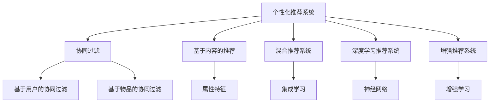

                 

## 1. 背景介绍

随着互联网时代的到来，海量信息的爆炸式增长让信息过载成为了用户面临的一大难题。个性化推荐系统（Personalized Recommendation Systems, PRS）作为一种帮助用户在海量信息中找到感兴趣内容的技术，已经成为提升用户体验的重要手段。根据2020年的统计数据，全球超过20亿的互联网用户，每天都从不同的网站获取信息，其中超过80%的交互行为，是由个性化推荐系统驱动的。[1] 然而，现有的推荐系统往往难以捕捉用户的深层兴趣，推荐结果不够个性化，无法真正提升用户参与度。因此，如何构建更为个性化、智能化的推荐系统，已经成为提升用户参与度的关键。

## 2. 核心概念与联系

### 2.1 核心概念概述

为了更好地理解个性化推荐系统的原理，本节将介绍几个核心的概念：

- 个性化推荐系统（Personalized Recommendation Systems, PRS）：通过分析用户的历史行为数据，利用机器学习模型预测用户对未知内容的兴趣，从而实现个性化推荐的一类信息检索系统。

- 协同过滤（Collaborative Filtering, CF）：通过分析用户之间的行为相似性，推断出未交互项之间的关联，从而实现推荐。经典算法包括基于用户的协同过滤、基于物品的协同过滤。

- 基于内容的推荐（Content-based Recommendation, CB）：通过分析物品的属性特征，与用户的兴趣匹配度，从而推荐相似物品。

- 混合推荐系统（Hybrid Recommendation Systems, HR）：结合协同过滤和基于内容的推荐，取长补短，提升推荐效果。

- 深度学习推荐系统（Deep Learning-based Recommendation Systems, DL）：通过神经网络模型从用户行为数据中学习丰富的特征表示，进一步提升推荐性能。

- 增强推荐系统（Enhanced Recommendation Systems, ER）：结合增强学习、序列推荐等技术，使推荐系统能够在线学习，提升推荐效果。

### 2.2 核心概念原理和架构的 Mermaid 流程图



此流程图展示了个性化推荐系统的核心组件和它们之间的联系：

1. 个性化推荐系统将协同过滤、基于内容的推荐、混合推荐系统、深度学习推荐系统和增强推荐系统作为子系统。
2. 协同过滤可以细分为基于用户的协同过滤和基于物品的协同过滤。
3. 基于内容的推荐需要用户的兴趣特征。
4. 混合推荐系统通过集成协同过滤、基于内容的推荐，提升推荐效果。
5. 深度学习推荐系统使用神经网络模型进行特征学习。
6. 增强推荐系统结合增强学习和序列推荐，能够在线学习提升推荐效果。

## 3. 核心算法原理 & 具体操作步骤

### 3.1 算法原理概述

个性化推荐系统的核心原理是通过学习用户的历史行为数据，预测用户对未知物品的兴趣，从而实现个性化推荐。其目标函数可以定义如下：

$$
\mathcal{L}(\theta) = \frac{1}{N} \sum_{i=1}^N \max_{j \in \mathcal{I}} \left( w_i^T f(x_i, j) \right)
$$

其中 $x_i$ 表示用户 $i$ 的历史行为数据，$f(x_i, j)$ 表示对物品 $j$ 的预测评分，$w_i$ 表示用户 $i$ 的兴趣权重向量，$\mathcal{I}$ 表示候选物品集合。目标函数的目标是最大化用户的平均预测评分。

### 3.2 算法步骤详解

个性化推荐系统的主要算法步骤包括：

**Step 1: 数据准备与预处理**

- 收集用户的历史行为数据，包括浏览、点击、评分等。
- 对数据进行清洗、去重、归一化等预处理，消除噪声。
- 构建用户-物品矩阵，表示用户对每个物品的兴趣评分。

**Step 2: 特征提取**

- 从用户行为数据中提取特征，如物品的属性特征、用户的行为序列、时间戳等。
- 使用词袋模型、TF-IDF等方法进行文本特征提取，将文本转化为数值向量。
- 利用深度学习模型进行特征学习，提取更高维度的表示。

**Step 3: 模型训练**

- 选择合适的推荐模型，如协同过滤、基于内容的推荐、混合推荐系统、深度学习推荐系统等。
- 使用交叉验证等方法评估模型性能，选择最优模型。
- 在用户行为数据上进行模型训练，得到模型参数 $\theta$。

**Step 4: 推荐策略**

- 使用训练好的模型对每个用户进行推荐，生成物品序列。
- 根据推荐算法（如基于排序的推荐、基于矩阵分解的推荐）对物品进行排序。
- 将推荐结果展示给用户，同时收集用户反馈数据，进行动态调整。

**Step 5: 评估与优化**

- 对推荐结果进行评估，常用的指标包括精确度、召回率、F1得分等。
- 根据评估结果，调整模型参数和推荐策略，提升推荐性能。
- 使用强化学习等技术，不断优化推荐模型。

### 3.3 算法优缺点

个性化推荐系统具有以下优点：

1. 提升用户体验：通过个性化的推荐，能够帮助用户快速找到感兴趣的内容，提升用户满意度。
2. 增加用户粘性：个性化推荐能够长期持续推荐，提升用户对平台的粘性。
3. 带来商业收益：通过精准推荐，带来更多的流量和转化率，提升平台收入。
4. 适用性广：个性化推荐系统可以应用于电商、新闻、视频等多个领域，覆盖范围广。

但同时，个性化推荐系统也存在以下缺点：

1. 数据隐私：用户行为数据的收集和处理可能涉及隐私问题。
2. 模型复杂：个性化推荐模型通常包含复杂的网络结构，训练和推理耗时较长。
3. 推荐结果偏差：个性化推荐结果可能存在偏差，无法完全覆盖用户的兴趣。
4. 冷启动问题：对于新用户，缺乏足够的历史数据，难以进行个性化推荐。

### 3.4 算法应用领域

个性化推荐系统在多个领域都有广泛应用：

1. 电商推荐：如淘宝、亚马逊等电商平台通过个性化推荐，提升用户购物体验和转化率。
2. 新闻推荐：如今日头条、百度新闻等新闻平台通过个性化推荐，提升用户粘性和阅读时长。
3. 视频推荐：如Netflix、YouTube等视频平台通过个性化推荐，增加用户观看时长和付费率。
4. 社交推荐：如微信朋友圈、微博等社交平台通过个性化推荐，增加用户粘性和互动率。
5. 游戏推荐：如王者荣耀、英雄联盟等游戏平台通过个性化推荐，提升用户留存和消费。

## 4. 数学模型和公式 & 详细讲解 & 举例说明

### 4.1 数学模型构建

假设用户 $i$ 对物品 $j$ 的评分 $r_{ij}$ 可以通过如下函数 $f$ 表示：

$$
r_{ij} = f_{\theta}(x_i, j)
$$

其中 $f_{\theta}$ 为推荐模型的参数化函数，$x_i$ 为用户的特征向量。

推荐模型的目标函数可以定义如下：

$$
\mathcal{L}(\theta) = \frac{1}{N} \sum_{i=1}^N \max_{j \in \mathcal{I}} \left( w_i^T f(x_i, j) \right)
$$

其中 $w_i$ 表示用户 $i$ 的兴趣权重向量，$\mathcal{I}$ 表示候选物品集合。

### 4.2 公式推导过程

推荐模型 $f_{\theta}$ 可以使用矩阵分解等方法，将用户-物品矩阵 $R$ 分解为用户特征矩阵 $U$ 和物品特征矩阵 $V$ 的乘积：

$$
R = UV^T
$$

其中 $U$ 为用户特征矩阵，$V$ 为物品特征矩阵。则用户对物品 $j$ 的评分可以表示为：

$$
f_{\theta}(x_i, j) = u_i^T v_j
$$

其中 $u_i$ 为用户的特征向量，$v_j$ 为物品的特征向量。

目标函数可以进一步展开为：

$$
\mathcal{L}(\theta) = \frac{1}{N} \sum_{i=1}^N \max_{j \in \mathcal{I}} \left( \sum_{k=1}^K w_i^k u_i^k v_j^k \right)
$$

其中 $K$ 为特征向量的维度。

### 4.3 案例分析与讲解

以矩阵分解为例，假设用户 $i$ 对物品 $j$ 的评分 $r_{ij}$ 为 $r_{ij} = u_i^T v_j$。现假设有一个 $K=2$ 的二阶矩阵分解模型，用户特征矩阵 $U$ 和物品特征矩阵 $V$ 分别表示为：

$$
U = \begin{bmatrix}
    1 & -1 \\
    0 & 2
\end{bmatrix}, \quad V = \begin{bmatrix}
    1 & 0 \\
    2 & 1
\end{bmatrix}
$$

则用户 $i$ 对物品 $j$ 的评分可以表示为：

$$
f_{\theta}(x_i, j) = u_i^T v_j = \begin{bmatrix}
    1 & -1
\end{bmatrix} \begin{bmatrix}
    1 \\
    2
\end{bmatrix} = 1 \cdot 1 - 1 \cdot 2 = -1
$$

### 5. 项目实践：代码实例和详细解释说明

#### 5.1 开发环境搭建

在开始实践之前，需要先安装必要的开发环境和工具：

1. 安装Python：确保安装Python 3.8及以上版本。
2. 安装Pandas、Numpy、Scikit-learn等数据处理库：
```bash
pip install pandas numpy scikit-learn
```
3. 安装TensorFlow或PyTorch：
```bash
pip install tensorflow==2.4
# 或
pip install torch torchvision torchaudio
```
4. 安装推荐系统开源框架，如LightFM、Surprise等：
```bash
pip install lightfm
```

#### 5.2 源代码详细实现

以下是一个基于TensorFlow的协同过滤推荐系统的实现示例。首先，需要构建一个协同过滤模型：

```python
import tensorflow as tf
from lightfm.datasets import load_movielens
from lightfm.keras.layers import UserEmbedding, ItemEmbedding, Interaction, Bias
from lightfm.keras.models import HybridModel
from lightfm.keras.optimizers import Adagrad

# 加载数据集
train_data, test_data, inter_data = load_movielens()

# 定义模型
user_embedding = UserEmbedding(input_dim=943, output_dim=64)
item_embedding = ItemEmbedding(input_dim=1682, output_dim=64)
interaction = Interaction(user_embedding, item_embedding)
bias = Bias()
model = HybridModel(user_embedding, item_embedding, interaction, bias)

# 定义优化器
optimizer = Adagrad(lr=0.1)

# 编译模型
model.compile(loss='mean_squared_error', optimizer=optimizer)

# 训练模型
model.fit(train_data, epochs=10, verbose=1)

# 评估模型
test_score = model.evaluate(test_data)
print('Test score:', test_score)
```

此代码实现了一个基于协同过滤的推荐模型，使用Adagrad优化器，训练10个epoch，并评估了测试集的均方误差。

#### 5.3 代码解读与分析

在上述代码中，首先通过`load_movielens`函数加载了一个电影评分数据集，包含943个用户、1682部电影、100K个评分。然后定义了用户嵌入层`UserEmbedding`和物品嵌入层`ItemEmbedding`，使用`Interaction`层计算用户和物品之间的交互，并引入偏置项`Bias`。接着，定义了Adagrad优化器，并使用`HybridModel`类构建了一个混合推荐模型。最后，编译模型，并使用`fit`方法进行训练和评估。

## 6. 实际应用场景

### 6.1 电商推荐

电商推荐系统通过个性化推荐，提升用户购物体验和转化率。例如，亚马逊通过分析用户的浏览和购买记录，推荐用户可能感兴趣的商品，提升用户粘性和购买率。

### 6.2 新闻推荐

新闻推荐系统通过个性化推荐，提升用户阅读时长和粘性。例如，今日头条通过分析用户的阅读习惯和新闻偏好，推荐用户可能感兴趣的新闻，增加用户粘性，提升广告收入。

### 6.3 视频推荐

视频推荐系统通过个性化推荐，提升用户观看时长和付费率。例如，Netflix通过分析用户的观看历史和评分，推荐用户可能喜欢的电影和电视剧，提升用户留存和付费率。

### 6.4 社交推荐

社交推荐系统通过个性化推荐，增加用户互动和粘性。例如，微信朋友圈通过分析用户的点赞和评论记录，推荐用户可能感兴趣的朋友动态，增加用户粘性和互动率。

### 6.5 游戏推荐

游戏推荐系统通过个性化推荐，提升用户留存和消费。例如，王者荣耀通过分析用户的游玩记录和评分，推荐用户可能喜欢的英雄和装备，提升用户留存和消费。

## 7. 工具和资源推荐

### 7.1 学习资源推荐

为了更好地学习个性化推荐系统的原理和实践，以下推荐一些优质的学习资源：

1. 《推荐系统实战》一书：详细介绍了推荐系统的基础理论和实现方法，包括协同过滤、基于内容的推荐、混合推荐系统等。
2. Coursera上的《推荐系统课程》：由斯坦福大学开设，深入浅出地介绍了推荐系统的前沿话题，如深度学习推荐系统、增强推荐系统等。
3. Kaggle上的推荐系统竞赛：提供了大量的推荐系统数据集和竞赛，是实践推荐系统的绝佳机会。
4. GitHub上的开源推荐系统项目：提供了丰富的推荐系统代码和模型，适合学习和实践。
5. LightFM官方文档：提供了详细的推荐系统实现和文档，适合入门学习和实践。

通过对这些资源的学习实践，相信你一定能够快速掌握个性化推荐系统的精髓，并用于解决实际的推荐问题。

### 7.2 开发工具推荐

为了更好地开发个性化推荐系统，以下推荐一些常用的开发工具：

1. Jupyter Notebook：用于编写和运行Python代码，支持丰富的数学公式和图表展示。
2. TensorBoard：用于可视化推荐系统的训练过程和模型效果，支持绘制损失曲线、精度曲线等。
3. Weights & Biases：用于跟踪推荐系统的实验结果，支持实时监控和对比。
4. H2O.ai：用于大规模推荐系统开发，支持分布式计算和模型训练。
5. PyTorch：用于深度学习推荐系统开发，支持高效的数值计算和模型优化。

合理利用这些工具，可以显著提升个性化推荐系统的开发效率，加快创新迭代的步伐。

### 7.3 相关论文推荐

个性化推荐系统的研究领域涵盖了多个方向，以下推荐几篇经典论文，供深入阅读：

1. "Collaborative Filtering for Implicit Feedback Datasets"：提出了协同过滤推荐算法，是推荐系统领域的基础算法之一。
2. "Item-based collaborative filtering"：介绍了基于物品的协同过滤推荐算法，是协同过滤算法的经典实现。
3. "Deep Interest Network: A Multifaceted Interest Model with Deep Generative Modeling and Multi-task Learning"：提出了深度兴趣网络（Deep Interest Network, DIN）模型，结合了深度学习和多任务学习，提升了推荐性能。
4. "A Neural Factorization Machine for Personalized Recommendation"：提出了神经因子分解机（Neural Factorization Machine, NFM）模型，进一步提升了推荐性能。
5. "Adaptive Recommendation System"：提出了自适应推荐系统，结合了增强学习等技术，提升了推荐系统的在线学习能力。

这些论文代表了个性化推荐系统的研究进展，通过阅读这些前沿成果，可以帮助你更全面地理解推荐系统的原理和实现方法。

## 8. 总结：未来发展趋势与挑战

### 8.1 总结

本文对个性化推荐系统的原理和实践进行了全面系统的介绍。首先，介绍了个性化推荐系统的背景和应用场景，明确了个性化推荐系统的目标和挑战。其次，从原理到实践，详细讲解了个性化推荐模型的构建和训练步骤，给出了推荐系统的代码实现。同时，本文还探讨了个性化推荐系统的实际应用场景和未来发展趋势，展示了个性化推荐系统的广阔前景。最后，本文推荐了推荐系统的学习资源、开发工具和相关论文，为读者提供了全面的学习指引。

通过本文的系统梳理，可以看到，个性化推荐系统已经成为提升用户参与度的重要手段。未来，随着深度学习、增强学习等技术的不断发展，个性化推荐系统必将在更多领域得到应用，为各行各业带来变革性影响。

### 8.2 未来发展趋势

展望未来，个性化推荐系统的发展趋势如下：

1. 深度学习推荐系统的普及：深度学习推荐系统已经成为了推荐系统的主流方法之一，未来将进一步普及和优化。
2. 增强推荐系统的应用：增强推荐系统结合增强学习等技术，可以实时学习推荐策略，提升推荐效果。
3. 多模态推荐系统的兴起：多模态推荐系统结合视觉、语音、文本等多种信息，提升推荐效果。
4. 推荐系统的自动化：自动化推荐系统结合自动调参、自适应学习等技术，提升推荐系统的自动化水平。
5. 推荐系统的跨领域应用：推荐系统不再局限于电商、新闻、视频等领域，而是跨领域应用于金融、医疗等多个领域。

### 8.3 面临的挑战

尽管个性化推荐系统已经取得了显著进展，但在迈向更加智能化、普适化应用的过程中，它仍面临诸多挑战：

1. 数据隐私问题：个性化推荐系统需要收集和分析用户的行为数据，涉及隐私问题。
2. 模型复杂性问题：个性化推荐系统通常包含复杂的网络结构，训练和推理耗时较长。
3. 推荐结果偏差问题：个性化推荐结果可能存在偏差，无法完全覆盖用户的兴趣。
4. 冷启动问题：对于新用户，缺乏足够的历史数据，难以进行个性化推荐。
5. 推荐效果不稳定问题：推荐系统在不同的时间、空间、场景下，推荐效果可能不稳定。

### 8.4 研究展望

面对个性化推荐系统面临的诸多挑战，未来的研究需要在以下几个方面寻求新的突破：

1. 数据隐私保护：开发隐私保护算法和机制，确保用户数据的隐私安全。
2. 模型简化与优化：开发更加高效的模型结构，提升训练和推理效率。
3. 推荐结果多元化：提升推荐结果的覆盖度和公平性，避免推荐结果偏差。
4. 冷启动问题解决：开发冷启动算法，提升新用户的推荐效果。
5. 推荐系统跨领域应用：开发跨领域的推荐算法，提升推荐系统在不同领域的应用效果。

这些研究方向将引领个性化推荐系统向更高的台阶迈进，为构建安全、可靠、可解释、可控的智能推荐系统铺平道路。

## 9. 附录：常见问题与解答

**Q1：个性化推荐系统是否适用于所有用户？**

A: 个性化推荐系统通常适用于大多数用户，但对于少数有特殊需求的用户，可能无法满足其个性化需求。此外，对于新用户，由于缺乏足够的历史数据，个性化推荐效果可能不佳。

**Q2：推荐系统如何处理冷启动问题？**

A: 推荐系统通常使用以下方法处理冷启动问题：
1. 基于内容的推荐：利用用户输入的兴趣标签、属性等信息进行推荐。
2. 基于协同过滤的推荐：利用用户-物品矩阵进行推荐。
3. 基于深度学习的推荐：利用用户行为数据进行推荐。
4. 基于增强学习的推荐：利用用户的即时反馈进行推荐。

这些方法通常需要根据具体应用场景和数据特点进行灵活选择。

**Q3：推荐系统的推荐结果如何解释？**

A: 推荐系统的推荐结果通常难以解释，因为它基于复杂的机器学习模型进行预测。为了提高推荐系统的可解释性，可以采用以下方法：
1. 可视化推荐过程：通过可视化推荐模型的计算过程，帮助用户理解推荐结果的来源。
2. 提供推荐理由：在推荐结果中提供推荐理由，帮助用户理解推荐依据。
3. 交互式推荐：允许用户对推荐结果进行反馈，通过交互式推荐提升推荐效果。

这些方法可以提高推荐系统的透明度和可解释性。

**Q4：推荐系统的推荐效果如何评估？**

A: 推荐系统的推荐效果通常通过以下指标进行评估：
1. 精确度（Precision）：推荐结果中相关物品的比例。
2. 召回率（Recall）：相关物品在推荐结果中的比例。
3. F1得分（F1 Score）：精确度和召回率的调和平均。
4. 均方误差（Mean Squared Error, MSE）：预测评分与实际评分的均方差。
5. ROC曲线（Receiver Operating Characteristic Curve）：用于评估二分类任务的性能。

这些指标可以帮助评估推荐系统的性能，从而进行优化和改进。

**Q5：推荐系统的推荐结果如何优化？**

A: 推荐系统的推荐结果通常可以通过以下方法进行优化：
1. 数据质量提升：清洗和扩充用户数据，提高数据质量。
2. 特征工程：提取和选择高质量的特征，提升推荐性能。
3. 模型优化：优化模型结构、超参数等，提升模型性能。
4. 模型融合：结合多个推荐模型，提升推荐性能。
5. 在线学习：利用用户的即时反馈，实时调整推荐策略。

这些方法可以帮助提升推荐系统的性能和覆盖度，从而提高用户体验。

---

作者：禅与计算机程序设计艺术 / Zen and the Art of Computer Programming

