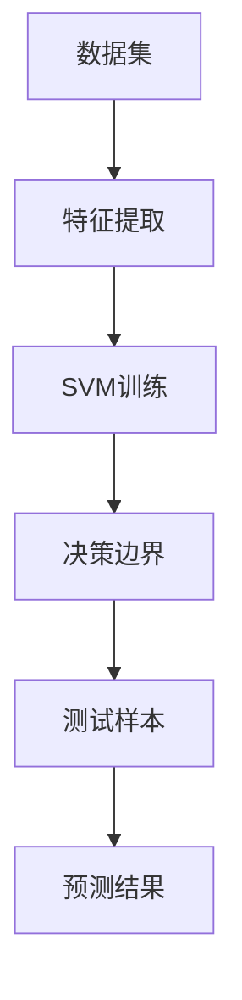

                 

# 支持向量机 (Support Vector Machines, SVM) 原理与代码实例讲解

## 1. 背景介绍

### 1.1 问题由来
支持向量机(Support Vector Machines, SVM)是一种广泛应用于分类和回归分析的监督学习方法。其基本思想是通过构建最优超平面，将不同类别的数据点分开，从而达到分类的目的。SVM最早由Vapnik在20世纪90年代提出，并因其在数据稀疏性、高维性、非线性问题上出色的表现，被广泛应用于图像识别、文本分类、生物信息学等多个领域。

然而，由于其理论性强、算法复杂、不易调试等问题，使得其在工业界的普及受到了一定的限制。为了帮助读者更好地理解SVM算法原理及其实现过程，本文将从背景、原理、实现以及应用等方面，深入浅出地讲解SVM的核心概念和实现方法。

## 2. 核心概念与联系

### 2.1 核心概念概述
SVM算法基于统计学习理论，通过寻找一个最优的超平面，将数据分为两类或多类。SVM的目标是在保证分类准确性的同时，最大化分类间隔，从而减少过拟合风险，提高泛化能力。

### 2.2 核心概念原理和架构的 Mermaid 流程图



该流程图展示了大数据集经过特征提取后，通过SVM训练，最终得到决策边界的过程。其中，关键步骤如下：
- 数据集预处理：将原始数据进行标准化、归一化等预处理，提取特征向量。
- SVM训练：在特征空间中寻找最优超平面，最大化分类间隔。
- 决策边界：利用训练得到的超平面对新样本进行分类预测。

## 3. 核心算法原理 & 具体操作步骤
### 3.1 算法原理概述

SVM算法的核心在于最大化分类间隔，即寻找一个能够将不同类别的数据点分开且距离最大的超平面。该超平面的数学表达形式为：

$$w \cdot x + b = 0$$

其中，$w$ 为超平面的法向量，$b$ 为截距，$x$ 为特征向量。

SVM的目标函数为：

$$\min_{w,b} \frac{1}{2}\|w\|^2$$

$$\text{subject to} \quad y_i(w \cdot x_i + b) \geq 1 - \epsilon$$

其中，$y_i$ 为样本的类别标签，$\epsilon$ 为误差项，$C$ 为正则化系数。

在训练过程中，SVM算法采用拉格朗日乘子法，将上述目标函数转化为对偶问题：

$$\min_{\alpha} \frac{1}{2} \sum_{i=1}^{n} \sum_{j=1}^{n} \alpha_i \alpha_j y_i y_j \langle \phi(x_i), \phi(x_j) \rangle - \sum_{i=1}^{n} \alpha_i$$

$$\text{subject to} \quad \sum_{i=1}^{n} \alpha_i y_i = 0$$

$$\alpha_i \geq 0$$

其中，$\alpha_i$ 为拉格朗日乘子，$\langle \phi(x_i), \phi(x_j) \rangle$ 为核函数。

### 3.2 算法步骤详解

SVM算法的详细步骤包括：

1. 数据预处理：对原始数据进行标准化、归一化等预处理，提取特征向量。
2. 构建SVM模型：根据SVM的目标函数和约束条件，使用拉格朗日乘子法构建对偶问题。
3. 求解对偶问题：通过迭代算法求解对偶问题，得到拉格朗日乘子 $\alpha$。
4. 得到超平面：根据得到的拉格朗日乘子 $\alpha$ 和核函数，得到最优超平面。
5. 分类预测：对新样本进行特征提取和分类预测。

### 3.3 算法优缺点

SVM算法的优点：
1. 高效性：在高维空间中具有高效的分类能力，对小样本数据表现出色。
2. 鲁棒性：具有较好的鲁棒性和泛化能力，对噪声和异常值不敏感。
3. 可解释性：通过选择不同的核函数，可以解释不同特征的重要性。

SVM算法的缺点：
1. 计算复杂：在高维空间中的计算复杂度较高，不易处理大规模数据集。
2. 对参数敏感：需要选择合适的正则化系数和核函数，对参数敏感，不适宜对参数调优。
3. 数据稀疏性：对数据的稀疏性要求较高，需要保证数据的样本数量足够多。

### 3.4 算法应用领域

SVM算法在多个领域得到了广泛应用，包括：

- 图像识别：利用SVM进行图像分类、目标检测等任务。
- 文本分类：对文本进行分类、情感分析、信息检索等。
- 生物信息学：在DNA序列分类、蛋白质结构预测等方面应用广泛。
- 金融分析：用于股票价格预测、信用评分等金融领域。
- 推荐系统：用于用户画像、推荐物品的分类和排序。

## 4. 数学模型和公式 & 详细讲解  
### 4.1 数学模型构建

SVM算法的数学模型基于支持向量(hypersphere)和间隔最大化(interval maximization)的思想。假设训练数据集为 $\{x_i, y_i\}_{i=1}^{n}$，其中 $x_i \in \mathbb{R}^d$ 为特征向量，$y_i \in \{-1, 1\}$ 为类别标签。

SVM的目标是最小化训练误差，同时最大化分类间隔。通过引入拉格朗日乘子 $\alpha$，可以将原问题转化为对偶问题。对偶问题表达式为：

$$\min_{\alpha} \frac{1}{2} \sum_{i=1}^{n} \sum_{j=1}^{n} \alpha_i \alpha_j y_i y_j \langle \phi(x_i), \phi(x_j) \rangle - \sum_{i=1}^{n} \alpha_i$$

$$\text{subject to} \quad \sum_{i=1}^{n} \alpha_i y_i = 0$$

$$\alpha_i \geq 0$$

其中，$\alpha_i$ 为拉格朗日乘子，$\langle \phi(x_i), \phi(x_j) \rangle$ 为核函数。

### 4.2 公式推导过程

为了将原问题转化为对偶问题，需要引入拉格朗日乘子 $\alpha$，并构建拉格朗日函数：

$$\mathcal{L}(\alpha) = \frac{1}{2} \sum_{i=1}^{n} \alpha_i \sum_{j=1}^{n} \alpha_j y_i y_j \langle \phi(x_i), \phi(x_j) \rangle - \sum_{i=1}^{n} \alpha_i y_i$$

$$\text{subject to} \quad \alpha_i \geq 0$$

对拉格朗日函数进行求导，并令导数为零，得到拉格朗日乘子 $\alpha$ 的表达式：

$$\frac{\partial \mathcal{L}}{\partial \alpha_i} = \sum_{j=1}^{n} \alpha_j y_j \langle \phi(x_j), \phi(x_i) \rangle - y_i = 0$$

$$\frac{\partial \mathcal{L}}{\partial \alpha_j} = \sum_{i=1}^{n} \alpha_i y_i \langle \phi(x_i), \phi(x_j) \rangle - y_j = 0$$

将上述两个方程联立，即可得到 $\alpha$ 的解。

### 4.3 案例分析与讲解

以线性SVM为例，假设训练数据集为 $\{x_i, y_i\}_{i=1}^{n}$，其中 $x_i \in \mathbb{R}^d$ 为特征向量，$y_i \in \{-1, 1\}$ 为类别标签。假设 $\alpha$ 的解为 $\alpha_i = 0$ 或 $\alpha_i = C$，则对应的超平面方程为：

$$w \cdot x_i + b = 0$$

其中，$w$ 为超平面的法向量，$b$ 为截距。通过最大化分类间隔，可以确保最优超平面的鲁棒性和泛化能力。

## 5. 项目实践：代码实例和详细解释说明
### 5.1 开发环境搭建

在使用Python实现SVM算法时，需要安装Scikit-learn库，该库提供了SVM算法及其相关函数。可以使用以下命令进行安装：

```bash
pip install scikit-learn
```

### 5.2 源代码详细实现

以下是一个简单的SVM代码实现，用于二分类任务：

```python
from sklearn import svm
from sklearn import datasets
import numpy as np

# 加载数据集
iris = datasets.load_iris()
X = iris.data
y = iris.target

# 创建SVM模型
clf = svm.SVC(kernel='linear', C=1.0)

# 训练模型
clf.fit(X, y)

# 预测新样本
x_new = np.array([[5.1, 3.5, 1.4, 0.2]])
y_new = clf.predict(x_new)
print(y_new)
```

在上述代码中，首先加载了iris数据集，然后创建了一个线性核SVM模型，训练模型后，对新样本进行了预测。

### 5.3 代码解读与分析

SVM算法的代码实现相对简洁，主要包含以下几个步骤：

1. 加载数据集：使用Scikit-learn提供的函数加载数据集。
2. 创建SVM模型：根据数据集的特点选择合适的核函数和正则化系数。
3. 训练模型：通过训练数据集拟合模型，得到拉格朗日乘子 $\alpha$。
4. 预测新样本：对新样本进行特征提取和分类预测。

SVM算法的核心在于选择合适的核函数和正则化系数。常用的核函数包括线性核、多项式核、径向基核等。正则化系数 $C$ 控制模型的复杂度，需要根据实际问题进行选择。

## 6. 实际应用场景
### 6.1 图像识别

在图像识别任务中，SVM算法可以用于图像分类、目标检测等任务。通过提取图像的特征向量，如HOG特征、SIFT特征等，并将其输入SVM模型进行分类预测。

### 6.2 文本分类

在文本分类任务中，SVM算法可以用于文本分类、情感分析、信息检索等任务。通过提取文本的特征向量，如TF-IDF特征、Word2Vec特征等，并将其输入SVM模型进行分类预测。

### 6.3 生物信息学

在生物信息学任务中，SVM算法可以用于DNA序列分类、蛋白质结构预测等方面。通过提取DNA序列或蛋白质结构的模式特征，并将其输入SVM模型进行分类预测。

### 6.4 金融分析

在金融分析任务中，SVM算法可以用于股票价格预测、信用评分等任务。通过提取股票历史价格、公司财务数据等特征，并将其输入SVM模型进行分类预测。

## 7. 工具和资源推荐
### 7.1 学习资源推荐

为了帮助读者更好地理解SVM算法原理及其实现过程，这里推荐一些优质的学习资源：

1. 《Pattern Recognition and Machine Learning》：Christopher Bishop所著的经典机器学习教材，系统介绍了SVM算法及其相关知识。
2. 《Introduction to Statistical Learning》：Gareth James等所著的统计学习教材，详细讲解了SVM算法及其应用实例。
3. 《Support Vector Machines: Theory and Applications》：Cortes和Vapnik等所著的SVM理论及应用书籍，深入浅出地介绍了SVM算法的核心原理及其应用场景。
4. 《The Elements of Statistical Learning》：Hastie等所著的统计学习教材，包含SVM算法及其相关算法的详细推导和实现。

通过对这些资源的学习实践，相信读者一定能够全面掌握SVM算法的基本原理和实现过程，并在实际应用中灵活运用。

### 7.2 开发工具推荐

在进行SVM算法开发时，需要使用到Scikit-learn库，该库提供了丰富的机器学习函数和算法，包括SVM算法。以下是一些常用的开发工具：

1. Python：SVM算法的实现需要Python的支持，Python语言具有简洁易学、开源免费等优点，适合SVM算法的开发和应用。
2. Jupyter Notebook：一个交互式的Python编程环境，适合进行SVM算法的交互式开发和调试。
3. Visual Studio Code：一个轻量级的代码编辑器，支持Python开发和调试，适合进行SVM算法的开发和测试。

合理利用这些工具，可以显著提升SVM算法的开发效率，加快创新迭代的步伐。

### 7.3 相关论文推荐

SVM算法的研究历史悠久，涉及多个领域，以下是几篇重要的相关论文，推荐阅读：

1. "Support Vector Networks" (Bradley, 1998)：提出了SVM算法及其在网络中的应用，成为SVM算法发展的里程碑。
2. "Support Vector Machines" (Cortes and Vapnik, 1995)：提出了SVM算法的原始版本，奠定了SVM算法的基本框架。
3. "SVMlight and Beyond" (Joachims, 2006)：详细介绍了SVM算法的实现过程和优化技巧，适合实际开发应用。
4. "Beyond Support Vector Machines" (Osuna et al., 1997)：提出了多个改进的SVM算法，包括高斯核SVM、多类别SVM等。
5. "Kernel Methods in Machine Learning" (Schölkopf and Smola, 2002)：系统介绍了核函数的原理和应用，适合深入理解SVM算法的核心技术。

这些论文代表了SVM算法的发展脉络，通过学习这些前沿成果，可以帮助研究者把握学科前进方向，激发更多的创新灵感。

## 8. 总结：未来发展趋势与挑战

### 8.1 总结

本文对支持向量机(SVM)算法进行了全面系统的介绍。首先阐述了SVM算法的背景、原理及其实现方法，使读者能够深入理解SVM的核心概念。其次，通过实际应用案例，展示了SVM算法在不同领域的应用效果，使读者能够切实感受到SVM算法的强大性能。最后，介绍了SVM算法的学习资源、开发工具及相关的学术研究，帮助读者快速上手SVM算法，并进行深度研究。

通过本文的系统梳理，可以看到，SVM算法在多个领域均有着广泛的应用，其高效性、鲁棒性和可解释性使其成为机器学习领域的重要算法。未来，随着SVM算法的研究不断深入，其应用范围和效果将更加广泛，为各个行业的智能化转型提供强有力的支持。

### 8.2 未来发展趋势

展望未来，SVM算法的研发和应用将呈现以下几个发展趋势：

1. 高效性：SVM算法将进一步优化核函数和特征提取方法，降低算法复杂度，提高计算效率。
2. 鲁棒性：SVM算法将进一步优化正则化系数和超参数，提高算法的鲁棒性和泛化能力。
3. 可解释性：SVM算法将进一步优化模型解释方法，提高算法的可解释性和可理解性。
4. 多模态融合：SVM算法将进一步融合多模态数据，提高算法的跨领域迁移能力和泛化能力。
5. 实时性：SVM算法将进一步优化模型结构和计算图，提高算法的实时性和部署效率。

以上趋势凸显了SVM算法的广阔前景，这些方向的探索发展，必将进一步提升SVM算法的性能和应用范围，为各个行业的智能化转型提供强有力的支持。

### 8.3 面临的挑战

尽管SVM算法在多个领域得到了广泛应用，但在迈向更加智能化、普适化应用的过程中，仍面临诸多挑战：

1. 数据稀疏性：SVM算法对数据的稀疏性要求较高，需要保证数据的样本数量足够多。
2. 计算复杂度：SVM算法在高维空间中的计算复杂度较高，不易处理大规模数据集。
3. 参数调优：SVM算法对参数敏感，需要选择合适的正则化系数和核函数，对参数调优的难度较大。
4. 模型解释：SVM算法的模型解释较为复杂，难以解释其内部工作机制和决策逻辑。
5. 算法鲁棒性：SVM算法对噪声和异常值较为敏感，需要进一步优化算法鲁棒性。

正视SVM算法面临的这些挑战，积极应对并寻求突破，将使SVM算法更加成熟，成为智能系统中的重要组成部分。

### 8.4 研究展望

为了解决SVM算法面临的挑战，未来的研究需要在以下几个方面寻求新的突破：

1. 优化核函数：开发更高效的核函数，降低SVM算法的计算复杂度，提高算法的实时性。
2. 引入先验知识：将先验知识与SVM算法结合，提高算法的泛化能力和跨领域迁移能力。
3. 模型解释：开发更高效的模型解释方法，提高算法的可解释性和可理解性。
4. 优化超参数：引入更高效的超参数调优方法，提高算法的鲁棒性和泛化能力。
5. 融合多模态数据：将多模态数据融合到SVM算法中，提高算法的跨领域迁移能力和泛化能力。

这些研究方向的探索，必将引领SVM算法迈向更高的台阶，为各个行业的智能化转型提供强有力的支持。未来，随着SVM算法的研究不断深入，其应用范围和效果将更加广泛，为各个行业的智能化转型提供强有力的支持。

## 9. 附录：常见问题与解答

**Q1: SVM算法与逻辑回归的区别是什么？**

A: SVM算法与逻辑回归均属于分类算法，但两者在算法原理和应用场景上存在区别。
1. 算法原理：逻辑回归是基于线性模型的算法，通过拟合线性分类边界将数据分为两类；SVM算法则是基于核函数的算法，通过寻找最优超平面将数据分为两类或多类。
2. 应用场景：逻辑回归适用于样本数量较少、特征维度较低的场景；SVM算法适用于样本数量较多、特征维度较高的场景。

**Q2: 如何选择合适的核函数？**

A: 选择合适的核函数需要根据实际问题的特点和数据集的特性进行选择。常用的核函数包括线性核、多项式核、径向基核等。在实际应用中，需要根据数据集的特点进行实验比较，选择最优的核函数。

**Q3: SVM算法对超参数的敏感性如何？**

A: SVM算法对超参数较为敏感，需要进行参数调优。常用的超参数包括正则化系数和核函数参数等。在实际应用中，需要根据数据集的特点进行参数调优，以提高算法的鲁棒性和泛化能力。

**Q4: SVM算法的计算复杂度如何？**

A: SVM算法在高维空间中的计算复杂度较高，需要选择合适的核函数和正则化系数，以降低计算复杂度。同时，SVM算法对小样本数据表现出色，适合处理数据量较小的任务。

**Q5: SVM算法是否适用于大规模数据集？**

A: SVM算法在高维空间中的计算复杂度较高，不适合处理大规模数据集。此时，可以考虑使用其他高效的分类算法，如随机森林、深度学习等。

---

作者：禅与计算机程序设计艺术 / Zen and the Art of Computer Programming

