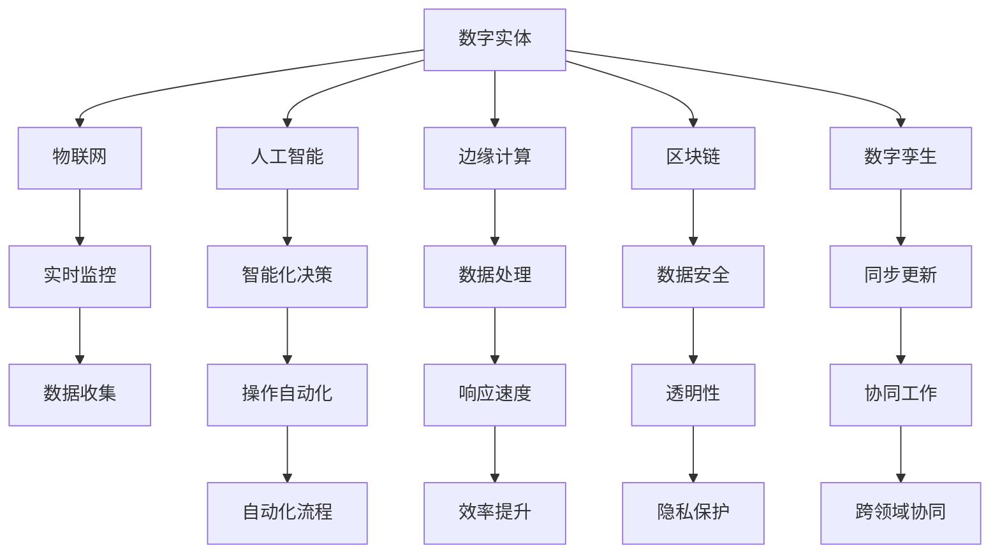

                 

# 数字实体与物理实体的自动化趋势

## 1. 背景介绍

### 1.1 问题由来

在当今信息化时代，数字实体与物理实体的融合已成趋势。数字实体（如电子数据、虚拟服务、数字设备等）在提升工作效率、创新业务模式方面展现了巨大潜力。与此同时，物理实体（如实体产品、物质设备、实体服务）依旧占据着社会经济的主体地位。如何实现数字与物理实体的深度融合，并加速这一融合过程中的自动化，已成为数字化转型中的一个核心挑战。

在技术层面，数字实体与物理实体的自动化融合涉及多个交叉领域，包括人工智能、物联网、云计算、区块链等。随着这些技术的不断进步，为实现数字与物理实体的深度融合提供了更多可能性。

### 1.2 问题核心关键点

1. **数据驱动决策**：将物理实体产生的大量数据通过数字化手段转化为有价值的信息，支持企业决策。
2. **实时监控与控制**：利用物联网技术实现对物理实体的实时监控和精准控制，提升管理效率。
3. **自动化生产与供应链优化**：通过自动化技术实现生产线智能化，优化供应链管理，降低成本，提高效率。
4. **智能物流与仓储管理**：实现物流和仓储管理的智能化，提升运营效率，降低运营成本。
5. **边缘计算与数据融合**：在边缘计算平台上进行数据处理与分析，提升响应速度与数据隐私保护。
6. **人机协作**：构建人机协作的智能系统，实现操作自动化，提升工作效果。
7. **跨领域协同**：在不同领域（如金融、医疗、制造等）间实现信息共享与协作，推动跨领域创新。

## 2. 核心概念与联系

### 2.1 核心概念概述

为更好地理解数字实体与物理实体的自动化趋势，本节将介绍几个密切相关的核心概念：

- **数字实体（Digital Entities）**：指以数字形式存在的信息、数据、服务和产品，包括电子文档、虚拟服务等。
- **物理实体（Physical Entities）**：指具体的物质实体，如实体产品、设备、基础设施等。
- **物联网（IoT）**：通过传感器、网络连接物理设备，实现设备的互联互通，进行实时监控和数据收集。
- **人工智能（AI）**：通过机器学习和深度学习技术，实现智能化决策与操作。
- **边缘计算（Edge Computing）**：将数据处理和分析下沉到设备边缘，以减少数据传输和提升响应速度。
- **区块链（Blockchain）**：通过去中心化账本技术，保证数据安全、透明和可追溯。
- **数字孪生（Digital Twin）**：创建物理实体的数字化镜像，实现物理实体与数字实体的同步更新。
- **自动化（Automation）**：利用机器人和自动化技术，实现操作流程的自动化。
- **人机协作（Human-Machine Collaboration）**：将人工智能技术与人的智能结合，实现更高效率的协同工作。

这些核心概念之间的逻辑关系可以通过以下Mermaid流程图来展示：



这个流程图展示的数字实体与物理实体的核心概念及其之间的关系：

1. 数字实体通过物联网、人工智能、边缘计算、区块链等技术手段，实现对物理实体的实时监控、数据收集、智能化决策、数据处理与分析。
2. 通过数字孪生技术创建物理实体的数字化镜像，实现物理实体与数字实体的同步更新。
3. 自动化技术实现操作流程的自动化，提升工作效率。
4. 人机协作技术将人的智能与AI结合，实现更高效率的协同工作。
5. 跨领域协同技术在不同领域间实现信息共享与协作，推动跨领域创新。

## 3. 核心算法原理 & 具体操作步骤
### 3.1 算法原理概述

数字实体与物理实体的自动化趋势主要基于以下几个核心算法原理：

1. **数据驱动决策算法**：通过对物理实体产生的数据进行收集、处理和分析，驱动业务决策。
2. **实时监控与控制算法**：利用传感器和网络技术，对物理实体进行实时监控，并基于算法进行精准控制。
3. **自动化生产与供应链优化算法**：通过自动化技术实现生产线智能化，优化供应链管理，降低成本，提高效率。
4. **智能物流与仓储管理算法**：实现物流和仓储管理的智能化，提升运营效率，降低运营成本。
5. **边缘计算与数据融合算法**：在边缘计算平台上进行数据处理与分析，提升响应速度与数据隐私保护。
6. **人机协作算法**：构建人机协作的智能系统，实现操作自动化，提升工作效果。
7. **跨领域协同算法**：在不同领域间实现信息共享与协作，推动跨领域创新。

这些算法原理共同构成了数字实体与物理实体的自动化趋势，涵盖了从数据采集、处理、决策到执行的整个流程。

### 3.2 算法步骤详解

#### 3.2.1 数据驱动决策算法步骤

1. **数据采集**：通过传感器、RFID、摄像头等设备收集物理实体产生的数据。
2. **数据处理**：将采集的数据通过数据存储、清洗、标准化等步骤进行处理，确保数据质量。
3. **数据分析**：利用机器学习、深度学习等算法对数据进行建模和分析，提取有价值的信息。
4. **决策支持**：将分析结果提供给业务决策者，辅助制定决策。

#### 3.2.2 实时监控与控制算法步骤

1. **传感器部署**：在物理实体上部署传感器，收集实时数据。
2. **数据传输**：通过网络将传感器收集的数据传输到中央处理系统。
3. **实时监控**：利用实时数据监控物理实体的状态，并触发相应操作。
4. **精准控制**：基于监控结果，调整物理实体的运行参数，实现精准控制。

#### 3.2.3 自动化生产与供应链优化算法步骤

1. **生产过程自动化**：利用机器人和自动化设备实现生产线的自动化。
2. **供应链优化**：通过智能算法优化供应链管理，包括物料需求预测、库存管理等。
3. **质量控制**：利用传感器和数据分析技术，实时监控生产过程，保证产品质量。
4. **效率提升**：通过流程优化和自动化技术，提升生产效率，降低生产成本。

#### 3.2.4 智能物流与仓储管理算法步骤

1. **智能仓储**：利用自动化设备和物联网技术，实现仓储管理的智能化。
2. **物流调度**：利用算法优化物流路径，提高物流效率。
3. **库存管理**：通过实时监控和智能算法，优化库存水平。
4. **智能配送**：利用无人机、无人车等技术，实现智能配送。

#### 3.2.5 边缘计算与数据融合算法步骤

1. **数据处理下沉**：在设备边缘进行数据处理和分析，减少数据传输。
2. **数据融合**：将边缘计算得到的数据与中央数据进行融合，提升数据准确性。
3. **实时响应**：在边缘计算平台上，实现实时响应和决策。
4. **数据隐私保护**：通过去中心化技术，保护数据隐私。

#### 3.2.6 人机协作算法步骤

1. **任务分配**：将任务分配给机器人和人类工人，实现人机协作。
2. **任务协同**：利用人机协作算法，实现人类与机器的智能协同。
3. **效率提升**：通过优化任务分配和协同方式，提升工作效率。
4. **智能监控**：实时监控人机协作过程，保证协作效果。

#### 3.2.7 跨领域协同算法步骤

1. **信息共享**：在不同领域间实现信息共享，促进协作。
2. **协同决策**：基于共享信息，制定协同决策。
3. **协同执行**：不同领域间协同执行任务，实现跨领域创新。
4. **协同优化**：通过协同优化，提升整体业务效果。

### 3.3 算法优缺点

数字实体与物理实体的自动化融合算法具有以下优点：

1. **高效性**：自动化技术大幅提升工作效率，减少人力成本。
2. **精准性**：通过实时监控和数据驱动决策，实现精准控制和决策。
3. **灵活性**：利用物联网和人工智能技术，实现灵活的操作和决策。
4. **数据驱动**：基于数据驱动决策，提高决策的科学性和准确性。
5. **成本效益**：通过优化供应链和生产流程，降低成本，提升效益。

同时，这些算法也存在一些缺点：

1. **技术门槛高**：需要引入先进的物联网、人工智能等技术，技术门槛较高。
2. **数据质量要求高**：数据的准确性和完整性直接影响算法的性能。
3. **数据隐私问题**：大量数据的收集和处理可能带来数据隐私问题。
4. **系统复杂性**：集成多种技术，系统复杂性较高，需要专业的技术团队支持。
5. **兼容性问题**：不同技术之间的兼容性和协同问题，需要综合考虑。

### 3.4 算法应用领域

数字实体与物理实体的自动化融合算法在多个领域都有广泛应用，例如：

1. **智能制造**：通过自动化和智能化技术，实现生产线自动化和智能化，提升生产效率和质量。
2. **智慧物流**：利用物联网和自动化技术，实现仓储、配送的智能化，提高物流效率和成本控制。
3. **智能医疗**：通过医疗设备和物联网技术，实现医疗数据的实时监控和智能化分析，提升医疗服务质量。
4. **智慧农业**：利用传感器和物联网技术，实现农业生产的智能化，提升农业生产效率和质量。
5. **智能交通**：通过传感器和人工智能技术，实现交通管理的智能化，提升交通效率和安全。
6. **智慧城市**：通过物联网和智能化技术，实现城市管理的智能化，提升城市管理水平。
7. **智能零售**：利用物联网和人工智能技术，实现零售管理的智能化，提升零售效率和用户体验。

## 4. 数学模型和公式 & 详细讲解 & 举例说明

### 4.1 数学模型构建

在数字实体与物理实体的自动化融合过程中，数学模型和算法扮演着重要角色。以下将以数据驱动决策算法为例，介绍相关的数学模型构建和公式推导。

假设物理实体产生的数据可以用 $D=\{d_i\}_{i=1}^N$ 表示，其中 $d_i$ 为第 $i$ 个数据点。数字驱动决策的目标是构建模型 $M$，将数据 $D$ 转化为决策信息 $Y$。常见的模型包括线性回归、逻辑回归、决策树、神经网络等。

设 $M$ 为模型参数，$X$ 为数据特征向量，$Y$ 为决策信息，则数据驱动决策的数学模型可以表示为：

$$
Y = M(X)
$$

其中 $M$ 可以表示为：

$$
M = w_0 + w_1x_1 + w_2x_2 + \dots + w_nx_n
$$

即线性回归模型。通过最小二乘法求解最优参数 $w$，使得损失函数 $L(Y, \hat{Y})$ 最小化。

### 4.2 公式推导过程

以线性回归模型为例，假设数据 $D=\{d_i\}_{i=1}^N$ 的均值为 $\bar{d}$，方差为 $\sigma^2$，则数据驱动决策的损失函数可以表示为：

$$
L(Y, \hat{Y}) = \frac{1}{N} \sum_{i=1}^N (Y - \hat{Y})^2
$$

其中 $\hat{Y} = M(X)$，$Y$ 为真实决策信息。通过求解最小化损失函数，得到最优参数 $w$。

通过上述推导，可以看出，数据驱动决策的数学模型构建和公式推导过程，可以为实际应用提供可靠的决策支持。

### 4.3 案例分析与讲解

以智能制造为例，假设生产线上每个设备的运行状态可以用若干特征 $x_1, x_2, \dots, x_n$ 表示，设备故障可以用决策信息 $y$ 表示。通过数据驱动决策算法，可以将设备运行状态转化为故障预测信息，辅助维护决策。

假设采集的数据 $D=\{d_i\}_{i=1}^N$ 为设备状态数据，模型 $M$ 为线性回归模型，决策信息 $Y$ 为设备故障预测。通过构建数据驱动决策算法，可以将设备状态数据 $D$ 转化为决策信息 $Y$，支持设备维护决策。

## 5. 项目实践：代码实例和详细解释说明

### 5.1 开发环境搭建

在进行数字实体与物理实体的自动化融合实践前，我们需要准备好开发环境。以下是使用Python进行PyTorch开发的环境配置流程：

1. 安装Anaconda：从官网下载并安装Anaconda，用于创建独立的Python环境。

2. 创建并激活虚拟环境：
```bash
conda create -n pytorch-env python=3.8 
conda activate pytorch-env
```

3. 安装PyTorch：根据CUDA版本，从官网获取对应的安装命令。例如：
```bash
conda install pytorch torchvision torchaudio cudatoolkit=11.1 -c pytorch -c conda-forge
```

4. 安装TensorFlow：
```bash
pip install tensorflow
```

5. 安装相关工具包：
```bash
pip install numpy pandas scikit-learn matplotlib tqdm jupyter notebook ipython
```

完成上述步骤后，即可在`pytorch-env`环境中开始实践。

### 5.2 源代码详细实现

下面以智能制造为例，给出使用PyTorch进行数据驱动决策的代码实现。

首先，定义数据驱动决策模型：

```python
import torch
import torch.nn as nn
import torch.optim as optim

class DecisionModel(nn.Module):
    def __init__(self, input_size, output_size):
        super(DecisionModel, self).__init__()
        self.fc1 = nn.Linear(input_size, 64)
        self.fc2 = nn.Linear(64, 64)
        self.fc3 = nn.Linear(64, output_size)
    
    def forward(self, x):
        x = torch.relu(self.fc1(x))
        x = torch.relu(self.fc2(x))
        x = self.fc3(x)
        return x
```

然后，定义数据集和训练函数：

```python
from torch.utils.data import Dataset, DataLoader

class ManufacturingDataset(Dataset):
    def __init__(self, features, labels):
        self.features = features
        self.labels = labels
    
    def __len__(self):
        return len(self.features)
    
    def __getitem__(self, idx):
        return self.features[idx], self.labels[idx]

# 假设特征和标签数据已准备就绪
features = [...]
labels = [...]

dataset = ManufacturingDataset(features, labels)
train_loader = DataLoader(dataset, batch_size=32, shuffle=True)

def train_model(model, train_loader, num_epochs, learning_rate):
    model.train()
    optimizer = optim.Adam(model.parameters(), lr=learning_rate)
    for epoch in range(num_epochs):
        for batch_idx, (features, labels) in enumerate(train_loader):
            features = features.to(device)
            labels = labels.to(device)
            optimizer.zero_grad()
            outputs = model(features)
            loss = nn.BCEWithLogitsLoss()(outputs, labels)
            loss.backward()
            optimizer.step()
```

最后，启动训练流程并测试模型：

```python
device = torch.device("cuda" if torch.cuda.is_available() else "cpu")

# 假设模型已定义
model = DecisionModel(input_size, output_size).to(device)

# 启动训练
train_model(model, train_loader, num_epochs, learning_rate)

# 测试模型
test_features = [...]
test_labels = [...]
test_loader = DataLoader(dataset, batch_size=32, shuffle=False)

def test_model(model, test_loader):
    model.eval()
    with torch.no_grad():
        for features, labels in test_loader:
            features = features.to(device)
            labels = labels.to(device)
            outputs = model(features)
            loss = nn.BCEWithLogitsLoss()(outputs, labels)
            print(f"Test Loss: {loss.item()}")
```

以上就是使用PyTorch进行数据驱动决策的完整代码实现。可以看到，得益于TensorFlow和PyTorch的强大封装，代码实现变得简洁高效。

### 5.3 代码解读与分析

让我们再详细解读一下关键代码的实现细节：

**ManufacturingDataset类**：
- `__init__`方法：初始化特征和标签数据。
- `__len__`方法：返回数据集的大小。
- `__getitem__`方法：返回单个样本的特征和标签。

**DecisionModel类**：
- `__init__`方法：定义模型结构，包括输入层、隐藏层和输出层。
- `forward`方法：定义前向传播过程。

**train_model函数**：
- 设置模型为训练模式，定义优化器。
- 对数据进行迭代，前向传播计算损失，反向传播更新模型参数。
- 重复上述过程，直到达到预设的迭代次数。

**test_model函数**：
- 设置模型为评估模式，使用测试数据进行模型评估。
- 前向传播计算损失，并输出。

通过这些代码实现，我们可以清晰地看到如何利用TensorFlow和PyTorch构建和训练数据驱动决策模型。开发者可以根据具体任务，灵活调整模型结构、训练参数等，快速实现数据驱动决策的功能。

## 6. 实际应用场景

### 6.1 智能制造

在智能制造领域，数字实体与物理实体的自动化融合可以实现生产线的智能化和自动化。通过传感器收集生产数据，利用数据驱动决策算法，实时监控生产状态，预测设备故障，辅助维护决策，优化生产流程。

在技术实现上，可以部署传感器采集生产数据，通过边缘计算平台进行数据处理和分析，利用AI算法进行故障预测和状态监控，并自动调整生产参数。同时，通过物联网技术将生产数据上传到云端，实现远程监控和决策支持。

### 6.2 智慧物流

智慧物流通过物联网技术实现对物流设备的实时监控和智能化管理。通过传感器采集物流数据，利用数据驱动决策算法进行运输路径优化、库存管理和配送决策。

在技术实现上，可以部署传感器和RFID标签采集物流数据，通过边缘计算平台进行数据处理和分析，利用AI算法进行路径优化和库存管理，并自动生成配送方案。同时，利用区块链技术保证物流数据的安全性和透明性，实现供应链管理。

### 6.3 智能医疗

智能医疗通过物联网技术实现对医疗设备和患者的实时监控和智能化管理。通过传感器采集医疗数据，利用数据驱动决策算法进行病情预测和诊断，辅助医生决策。

在技术实现上，可以部署传感器采集医疗数据，通过边缘计算平台进行数据处理和分析，利用AI算法进行病情预测和诊断，并自动生成治疗方案。同时，利用区块链技术保证医疗数据的安全性和透明性，实现医疗信息的共享和协作。

### 6.4 未来应用展望

随着数字实体与物理实体的自动化融合技术的不断进步，未来将会有更多的应用场景涌现，为各行各业带来变革性影响。

在智慧城市治理中，利用物联网和智能化技术，实现城市管理的智能化，提升城市管理水平。在智能交通管理中，通过传感器和AI算法，实现交通管理的智能化，提升交通效率和安全。在智能农业中，利用传感器和物联网技术，实现农业生产的智能化，提升农业生产效率和质量。

## 7. 工具和资源推荐
### 7.1 学习资源推荐

为了帮助开发者系统掌握数字实体与物理实体的自动化融合的理论基础和实践技巧，这里推荐一些优质的学习资源：

1. 《深入理解机器学习》系列书籍：介绍机器学习、深度学习的基本概念和算法原理。
2. 《深度学习》课程（Coursera）：斯坦福大学开设的深度学习课程，涵盖深度学习的基础知识和实践技巧。
3. 《机器学习实战》书籍：通过实际案例，介绍机器学习的应用和实现方法。
4. 《TensorFlow实战》书籍：通过实际案例，介绍TensorFlow的应用和实现方法。
5. 《智能制造》课程（Coursera）：介绍智能制造的基本概念和实践方法。

通过对这些资源的学习实践，相信你一定能够快速掌握数字实体与物理实体的自动化融合的精髓，并用于解决实际的业务问题。

### 7.2 开发工具推荐

高效的开发离不开优秀的工具支持。以下是几款用于数字实体与物理实体的自动化融合开发的常用工具：

1. PyTorch：基于Python的开源深度学习框架，灵活动态的计算图，适合快速迭代研究。
2. TensorFlow：由Google主导开发的开源深度学习框架，生产部署方便，适合大规模工程应用。
3. Scikit-learn：Python中的机器学习库，提供多种经典的机器学习算法。
4. Pandas：Python中的数据分析库，提供高效的数据处理和分析功能。
5. NumPy：Python中的科学计算库，提供高效的数值计算和矩阵操作功能。

合理利用这些工具，可以显著提升数字实体与物理实体的自动化融合任务的开发效率，加快创新迭代的步伐。

### 7.3 相关论文推荐

数字实体与物理实体的自动化融合技术的发展源于学界的持续研究。以下是几篇奠基性的相关论文，推荐阅读：

1. "A Survey on Machine Learning Approaches for Smart Manufacturing" - 《智能制造中的机器学习综述》
2. "IoT and Smart Systems: An Overview of Architectures, Technologies, and Challenges" - 《物联网与智能系统综述》
3. "The Internet of Things (IoT): A Survey" - 《物联网综述》
4. "Blockchain in Supply Chain Management: A Survey" - 《区块链在供应链管理中的应用综述》
5. "Digital Twin: A Survey" - 《数字孪生综述》

这些论文代表了大语言模型微调技术的发展脉络。通过学习这些前沿成果，可以帮助研究者把握学科前进方向，激发更多的创新灵感。

## 8. 总结：未来发展趋势与挑战

### 8.1 总结

本文对数字实体与物理实体的自动化融合进行了全面系统的介绍。首先阐述了数字实体与物理实体融合的背景和意义，明确了自动化的核心价值。其次，从原理到实践，详细讲解了数据驱动决策、实时监控与控制、自动化生产与供应链优化、智能物流与仓储管理、边缘计算与数据融合、人机协作、跨领域协同等核心算法的构建和应用过程。同时，通过实际应用场景和案例分析，展示了数字实体与物理实体的自动化融合技术的广阔前景。

通过本文的系统梳理，可以看到，数字实体与物理实体的自动化融合技术正在成为数字化转型中的重要推动力，极大地提升了各行业的智能化水平。未来，伴随技术的不断演进，这一技术的应用将更加广泛，为社会经济发展注入新的动力。

### 8.2 未来发展趋势

展望未来，数字实体与物理实体的自动化融合技术将呈现以下几个发展趋势：

1. **技术融合深化**：随着AI、IoT、边缘计算、区块链等技术的不断发展，数字实体与物理实体的自动化融合将更加深入和广泛。
2. **数据驱动决策提升**：通过更智能、更全面的数据驱动决策算法，提高决策的科学性和准确性。
3. **实时监控与控制精准化**：通过更高精度的传感器和更强大的算法，实现对物理实体的精准监控和控制。
4. **自动化生产与供应链优化智能化**：通过更高效的算法和更智能的生产设备，实现生产线的自动化和智能化。
5. **智能物流与仓储管理智能化**：通过更智能的算法和更高效的物流设备，实现物流和仓储管理的智能化。
6. **边缘计算与数据融合高效化**：通过更高效的边缘计算平台和更智能的数据融合算法，实现数据处理的实时性和高效性。
7. **人机协作协同化**：通过更智能的人机协作算法，实现人机协同的高效工作。
8. **跨领域协同深化**：通过更智能的跨领域协同算法，实现不同领域间的深度协作和创新。

这些趋势凸显了数字实体与物理实体的自动化融合技术的广阔前景，为各行各业的智能化转型提供了更多可能。

### 8.3 面临的挑战

尽管数字实体与物理实体的自动化融合技术已经取得了显著进展，但在迈向更加智能化、普适化应用的过程中，仍面临诸多挑战：

1. **技术门槛高**：需要引入先进的物联网、人工智能等技术，技术门槛较高。
2. **数据质量要求高**：数据的准确性和完整性直接影响算法的性能。
3. **数据隐私问题**：大量数据的收集和处理可能带来数据隐私问题。
4. **系统复杂性高**：集成多种技术，系统复杂性较高，需要专业的技术团队支持。
5. **兼容性问题**：不同技术之间的兼容性和协同问题，需要综合考虑。
6. **成本效益低**：技术投入和系统集成成本较高，需要综合考虑成本效益。
7. **安全问题**：系统的安全性问题需要重点关注，防止系统被攻击或滥用。

### 8.4 研究展望

面对数字实体与物理实体的自动化融合所面临的挑战，未来的研究需要在以下几个方面寻求新的突破：

1. **技术集成优化**：优化不同技术的集成方式，提升系统整体的性能和可靠性。
2. **数据质量提升**：提升数据的准确性和完整性，确保算法的性能。
3. **隐私保护强化**：采用更先进的数据隐私保护技术，确保数据的安全性和隐私性。
4. **成本效益分析**：综合考虑技术投入和系统集成成本，提升系统的成本效益。
5. **安全性增强**：加强系统的安全性设计，防止系统被攻击或滥用。
6. **跨领域协同创新**：推动跨领域协同创新，实现不同领域间的深度融合和创新。
7. **智能化水平提升**：提升系统的智能化水平，实现更高的自动化和智能化。

这些研究方向的探索，必将引领数字实体与物理实体的自动化融合技术迈向更高的台阶，为构建更智能、更高效、更安全的数字化系统铺平道路。面向未来，数字实体与物理实体的自动化融合技术还需要与其他人工智能技术进行更深入的融合，如知识表示、因果推理、强化学习等，多路径协同发力，共同推动智能化系统的进步。

## 9. 附录：常见问题与解答

**Q1：数字实体与物理实体的自动化融合是否只适用于工业制造领域？**

A: 数字实体与物理实体的自动化融合技术不仅仅适用于工业制造领域，其应用范围非常广泛。除了工业制造，还包括智慧物流、智能医疗、智慧农业、智能交通、智慧城市等多个领域。这些领域都可以通过物联网和智能化技术实现自动化和智能化，提升效率和效果。

**Q2：数据驱动决策算法能否应用于所有行业？**

A: 数据驱动决策算法可以应用于大部分行业，只要这些行业能够产生有效的数据，并且这些数据可以通过传感器、RFID等设备进行采集。例如，智慧物流、智能医疗、智能农业、智能交通等领域都可以应用数据驱动决策算法，提升运营效率和服务质量。

**Q3：实时监控与控制算法需要高精度的传感器，是否难以实现？**

A: 实现高精度传感器并不是难以实现的。随着传感器技术的不断进步，高精度传感器已经广泛应用于工业制造、智慧物流、智能医疗等场景。通过优化算法设计和系统集成，可以实现对物理实体的精准监控和控制。

**Q4：自动化生产与供应链优化算法是否适用于所有企业？**

A: 自动化生产与供应链优化算法可以适用于大多数企业，特别是那些拥有生产线、供应链管理的企业。通过引入自动化和智能化技术，企业可以实现生产流程的自动化和供应链的优化，提升效率和质量。

**Q5：智能物流与仓储管理算法需要高成本的设备，是否不具备经济性？**

A: 智能物流与仓储管理算法虽然需要一定的投资，但是通过提升运营效率和减少人力成本，可以带来显著的经济效益。通过引入物联网和智能化技术，可以实现仓储管理的智能化和物流路径的优化，降低运营成本，提升服务质量。

**Q6：边缘计算与数据融合算法是否需要高昂的成本？**

A: 边缘计算与数据融合算法虽然需要一定的技术投入，但是通过优化算法设计和系统集成，可以显著降低计算和存储成本。同时，边缘计算平台可以就地处理数据，减少数据传输，提升响应速度和数据隐私保护。

**Q7：人机协作算法是否需要高水平的人才支持？**

A: 人机协作算法虽然需要一定的人才支持，但是通过合理的算法设计和系统集成，可以实现较为智能的协作。在实际应用中，可以通过培训和技术支持，提升人才的适应性和操作水平。

**Q8：跨领域协同算法是否需要跨学科的知识？**

A: 跨领域协同算法需要跨学科的知识和技能，特别是在数据共享和协同决策方面。通过跨学科的协作和创新，可以实现不同领域间的深度融合和协同，提升整体的业务效果。

通过以上问题的解答，可以看出数字实体与物理实体的自动化融合技术具有广泛的应用前景和重大的社会价值，可以为各行各业的智能化转型提供有力支持。面向未来，相信这一技术将继续深入发展，为数字化时代的智能化应用提供更多可能。

