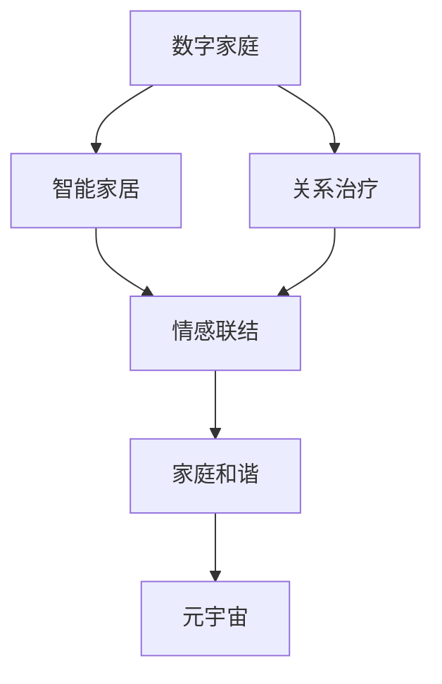

                 

# 数字家庭关系治疗:元宇宙时代的家庭和谐之道

> 关键词：数字家庭、关系治疗、元宇宙、智能家居、家庭和谐

## 1. 背景介绍

### 1.1 问题由来
随着技术的进步和社会的变迁，现代家庭面临诸多挑战。数字化时代的来临，尤其是元宇宙的兴起，为家庭关系的和谐与治疗提供了新的契机。传统上，家庭关系治疗依赖于心理学家面对面咨询、家庭医生上门诊疗等形式，耗时且成本高昂。而数字化技术，尤其是大数据、人工智能、物联网等，为家庭关系治疗提供了新的技术支持。

元宇宙作为一种全新的虚拟空间，不仅能够模拟现实世界的家庭环境，还能通过虚拟角色和场景，帮助家庭成员在虚拟空间中进行互动和交流，从而改善家庭关系，实现家庭成员之间的情感联结和心理支持。

### 1.2 问题核心关键点
数字家庭关系治疗的核心理念是通过数字化手段，提升家庭成员之间的互动和沟通，通过情感联结和心理支持，改善家庭关系。其核心要素包括：

1. **虚拟空间构建**：利用虚拟现实技术，创建虚拟家庭环境，模拟现实生活场景，为家庭成员提供一个情感交流和互动的空间。
2. **数据驱动的情感分析**：通过分析家庭成员在虚拟空间中的行为数据，识别情感状态和潜在的冲突，为治疗提供数据支撑。
3. **智能辅助治疗**：利用人工智能技术，为家庭成员提供个性化的情感支持和心理辅导，提升治疗效果。
4. **多模态互动体验**：结合语音、文字、图像等多模态技术，丰富互动形式，增强家庭成员的沉浸感和参与度。
5. **隐私保护**：在数字化治疗过程中，保护家庭成员的隐私，确保数据的安全和隐私。

这些核心要素共同构成了数字家庭关系治疗的基本框架，旨在通过数字化手段，改善家庭关系，实现家庭成员之间的情感联结和心理支持。

## 2. 核心概念与联系

### 2.1 核心概念概述

为了更好地理解数字家庭关系治疗的机制和应用，本节将介绍几个关键概念：

1. **数字家庭**：通过物联网、智能家居等技术手段，实现家庭生活的数字化管理，包括家庭自动化、能源管理、环境监测等。
2. **关系治疗**：通过心理学家、社会工作者等专业人士的指导，帮助家庭成员解决情感、心理方面的问题，改善家庭关系。
3. **元宇宙**：基于虚拟现实、增强现实等技术的虚拟空间，用户可以通过虚拟角色和场景进行互动和交流。
4. **智能家居**：利用人工智能、物联网等技术，实现家庭设备的自动化控制和智能化管理。
5. **家庭和谐**：通过各种手段，提升家庭成员之间的情感联结，减少冲突，实现家庭的和谐与幸福。

这些概念之间的联系可以通过以下Mermaid流程图来展示：



这个流程图展示了大数字家庭关系治疗的核心概念及其之间的关系：

1. 数字家庭通过智能家居等技术手段，实现家庭生活的数字化管理。
2. 智能家居通过物联网、传感器等技术，收集家庭成员的行为数据，为关系治疗提供数据支撑。
3. 关系治疗通过心理学家、社会工作者的指导，帮助家庭成员解决情感、心理问题。
4. 情感联结通过虚拟空间和智能辅助技术，改善家庭成员之间的互动和沟通。
5. 元宇宙通过虚拟现实、增强现实等技术，为家庭成员提供沉浸式互动和交流的空间。
6. 家庭和谐通过多模态互动、隐私保护等措施，提升家庭成员的幸福感。

这些概念共同构成了数字家庭关系治疗的完整框架，为家庭成员提供了一个全方位、全周期的情感支持和心理辅导。

## 3. 核心算法原理 & 具体操作步骤
### 3.1 算法原理概述

数字家庭关系治疗的算法原理主要基于智能算法和数据驱动的方法，通过以下几个步骤实现：

1. **数据采集**：通过智能家居设备，如摄像头、传感器等，收集家庭成员的行为数据，包括语音、文字、图像等多模态数据。
2. **数据预处理**：对采集到的数据进行清洗、归一化等处理，确保数据的质量和一致性。
3. **情感分析**：利用自然语言处理和机器学习技术，对家庭成员在虚拟空间中的行为数据进行分析，识别情感状态和潜在的冲突。
4. **智能治疗**：通过人工智能技术，为家庭成员提供个性化的情感支持和心理辅导，提升治疗效果。
5. **隐私保护**：在数据处理和存储过程中，采取隐私保护措施，确保数据的保密性和安全性。

这些步骤共同构成了数字家庭关系治疗的算法框架，通过数据驱动和智能算法，实现家庭成员之间的情感联结和心理支持。

### 3.2 算法步骤详解

以下是数字家庭关系治疗的详细操作步骤：

**Step 1: 数据采集**
- 安装智能家居设备，如摄像头、传感器、智能音箱等，收集家庭成员的行为数据。
- 确保数据采集的连续性和完整性，覆盖家庭成员的日常活动。

**Step 2: 数据预处理**
- 对采集到的数据进行清洗、去噪、归一化等处理，确保数据质量。
- 对不同模态的数据进行统一格式转换，方便后续处理。

**Step 3: 情感分析**
- 利用自然语言处理技术，如情感分析模型，对家庭成员的语音和文字进行情感状态识别。
- 结合图像识别技术，分析家庭成员的面部表情和肢体语言，进一步确认情感状态。

**Step 4: 智能治疗**
- 通过人工智能技术，为家庭成员提供个性化的情感支持和心理辅导。
- 根据家庭成员的行为数据和情感状态，生成个性化的治疗方案和建议。

**Step 5: 隐私保护**
- 采用数据加密、匿名化等技术，确保家庭成员数据的保密性和安全性。
- 设置严格的访问控制权限，防止未经授权的访问和数据泄露。

### 3.3 算法优缺点

数字家庭关系治疗的算法具有以下优点：

1. **高效性**：通过数据驱动和智能算法，可以快速识别家庭成员的情感状态，提供及时的情感支持和心理辅导。
2. **个性化**：结合家庭成员的行为数据和情感状态，生成个性化的治疗方案，提升治疗效果。
3. **灵活性**：通过虚拟空间和智能辅助技术，丰富互动形式，增强家庭成员的沉浸感和参与度。
4. **隐私保护**：在数据处理和存储过程中，采取隐私保护措施，确保数据的保密性和安全性。

同时，该算法也存在以下局限性：

1. **数据依赖**：数字家庭关系治疗的效果很大程度上依赖于数据的完整性和质量，数据采集和预处理需要高投入。
2. **技术门槛**：智能家居和人工智能技术的部署和维护需要专业知识和技能，普通用户难以操作。
3. **伦理问题**：隐私保护和数据使用需要遵守相关法律法规，确保数据使用的合规性和道德性。
4. **情感误差**：算法在情感状态识别和情感分析方面可能存在误差，影响治疗效果。

尽管存在这些局限性，但数字家庭关系治疗的算法仍然具有重要的应用价值，能够有效改善家庭关系，提升家庭成员的幸福感。

### 3.4 算法应用领域

数字家庭关系治疗的算法已经在多个领域得到应用，包括：

1. **智能家居系统**：结合智能家居设备，为家庭成员提供全方位的数字化管理和服务。
2. **心理健康平台**：通过数字家庭关系治疗的算法，为家庭成员提供心理健康咨询和辅导。
3. **家庭暴力预防**：通过情感分析技术，识别家庭成员之间的潜在冲突和暴力行为，提前进行干预和预防。
4. **情感教育**：结合虚拟空间和智能辅助技术，为家庭成员提供情感教育和培训，提升家庭关系和谐度。
5. **多模态互动体验**：结合语音、文字、图像等多模态技术，丰富家庭成员的互动形式，增强沉浸感和参与度。

这些应用领域展示了数字家庭关系治疗的广阔前景，未来在更多场景中必将得到广泛应用。

## 4. 数学模型和公式 & 详细讲解 & 举例说明（备注：数学公式请使用latex格式，latex嵌入文中独立段落使用 $$，段落内使用 $)
### 4.1 数学模型构建

为了更好地理解数字家庭关系治疗的数学模型，本节将介绍相关的数学模型构建。

假设家庭成员在虚拟空间中的行为数据为 $\mathbf{x} = [x_1, x_2, ..., x_n]$，其中 $x_i$ 表示家庭成员在时间 $t_i$ 的行为数据。设情感状态标签为 $y \in \{1, 0\}$，其中 $y=1$ 表示情感状态为正面，$y=0$ 表示情感状态为负面。

定义模型 $f_{\theta}(\mathbf{x})$ 为情感状态识别模型，其中 $\theta$ 为模型参数。模型的损失函数为交叉熵损失函数：

$$
\mathcal{L}(\theta) = -\frac{1}{N}\sum_{i=1}^N \log p(y_i | f_{\theta}(\mathbf{x}_i))
$$

其中 $p(y_i | f_{\theta}(\mathbf{x}_i))$ 表示模型对情感状态 $y_i$ 的预测概率。

### 4.2 公式推导过程

在情感状态识别模型的训练过程中，主要步骤如下：

1. **数据集划分**：将数据集 $\mathcal{D}$ 划分为训练集 $\mathcal{D}^T$ 和验证集 $\mathcal{D}^V$。
2. **模型初始化**：随机初始化模型参数 $\theta$。
3. **前向传播**：将训练集 $\mathcal{D}^T$ 中的数据 $\mathbf{x}_i$ 输入模型 $f_{\theta}(\mathbf{x}_i)$，得到预测概率 $p(y_i | f_{\theta}(\mathbf{x}_i))$。
4. **损失计算**：计算预测概率与真实标签之间的交叉熵损失 $\mathcal{L}(\theta)$。
5. **反向传播**：通过反向传播算法计算梯度 $\frac{\partial \mathcal{L}(\theta)}{\partial \theta}$。
6. **模型更新**：根据梯度下降算法，更新模型参数 $\theta$。
7. **验证集评估**：在验证集 $\mathcal{D}^V$ 上评估模型性能，如果性能不满足要求，重复步骤 3-7。
8. **最终模型**：在验证集上选择性能最优的模型作为最终模型。

以上步骤通过迭代优化，逐步提升情感状态识别模型的准确率。

### 4.3 案例分析与讲解

假设有一个家庭，家中有两位成员甲和乙。甲成员在虚拟空间中表达正面的情感状态，乙成员表达负面的情感状态。家庭暴力预防系统收集了甲乙成员在虚拟空间中的语音、文字和面部表情数据，使用情感分析模型对数据进行分析，识别情感状态。

假设情感分析模型的参数为 $\theta$，输入数据 $\mathbf{x} = [x_1, x_2, ..., x_n]$，其中 $x_i$ 表示家庭成员在时间 $t_i$ 的行为数据。情感状态标签为 $y = [y_1, y_2, ..., y_n]$，其中 $y_i \in \{1, 0\}$。

模型前向传播过程为：

$$
\mathbf{z} = f_{\theta}(\mathbf{x}) = f_{\theta}(f(x_1), f(x_2), ..., f(x_n))
$$

其中 $f(x)$ 为特征提取函数，将输入数据 $\mathbf{x}$ 转换为隐层表示 $\mathbf{z}$。

定义情感状态识别模型的输出为 $\hat{y} = \sigma(\mathbf{z})$，其中 $\sigma$ 为激活函数，将隐层表示映射到情感状态的概率分布。

模型的损失函数为交叉熵损失函数：

$$
\mathcal{L}(\theta) = -\frac{1}{N}\sum_{i=1}^N \log p(y_i | \hat{y})
$$

其中 $p(y_i | \hat{y}) = \hat{y}_i$ 为情感状态 $y_i$ 的预测概率。

通过反向传播算法计算梯度：

$$
\frac{\partial \mathcal{L}(\theta)}{\partial \theta} = -\frac{1}{N}\sum_{i=1}^N \frac{y_i - \hat{y}_i}{\hat{y}_i(1 - \hat{y}_i)}
$$

根据梯度下降算法，更新模型参数：

$$
\theta \leftarrow \theta - \eta \frac{\partial \mathcal{L}(\theta)}{\partial \theta}
$$

其中 $\eta$ 为学习率。

通过上述过程，情感分析模型能够识别家庭成员的情感状态，为家庭暴力预防系统提供数据支持。

## 5. 项目实践：代码实例和详细解释说明
### 5.1 开发环境搭建

在进行数字家庭关系治疗的开发实践前，我们需要准备好开发环境。以下是使用Python进行PyTorch开发的环境配置流程：

1. 安装Anaconda：从官网下载并安装Anaconda，用于创建独立的Python环境。

2. 创建并激活虚拟环境：
```bash
conda create -n pytorch-env python=3.8 
conda activate pytorch-env
```

3. 安装PyTorch：根据CUDA版本，从官网获取对应的安装命令。例如：
```bash
conda install pytorch torchvision torchaudio cudatoolkit=11.1 -c pytorch -c conda-forge
```

4. 安装必要的库：
```bash
pip install numpy pandas scikit-learn matplotlib torch torchvision
```

5. 安装虚拟现实工具包：
```bash
pip install pyvr pytorch-VR
```

完成上述步骤后，即可在`pytorch-env`环境中开始开发实践。

### 5.2 源代码详细实现

下面我们以家庭暴力预防系统为例，给出使用PyTorch进行情感状态识别的PyTorch代码实现。

首先，定义情感状态识别模型的类：

```python
import torch
import torch.nn as nn
import torch.optim as optim

class EmotionClassifier(nn.Module):
    def __init__(self, input_dim, hidden_dim, output_dim):
        super(EmotionClassifier, self).__init__()
        self.hidden_dim = hidden_dim
        self.fc1 = nn.Linear(input_dim, hidden_dim)
        self.fc2 = nn.Linear(hidden_dim, hidden_dim)
        self.fc3 = nn.Linear(hidden_dim, output_dim)
        self.relu = nn.ReLU()
        
    def forward(self, x):
        x = self.fc1(x)
        x = self.relu(x)
        x = self.fc2(x)
        x = self.relu(x)
        x = self.fc3(x)
        return x
```

然后，定义训练函数和评估函数：

```python
def train_model(model, train_data, validation_data, batch_size, learning_rate, num_epochs):
    device = torch.device("cuda" if torch.cuda.is_available() else "cpu")
    model.to(device)
    criterion = nn.CrossEntropyLoss()
    optimizer = optim.Adam(model.parameters(), lr=learning_rate)
    
    for epoch in range(num_epochs):
        model.train()
        for batch in train_data:
            inputs, labels = batch.to(device)
            optimizer.zero_grad()
            outputs = model(inputs)
            loss = criterion(outputs, labels)
            loss.backward()
            optimizer.step()
        
        model.eval()
        with torch.no_grad():
            correct = 0
            total = 0
            for batch in validation_data:
                inputs, labels = batch.to(device)
                outputs = model(inputs)
                _, predicted = torch.max(outputs.data, 1)
                total += labels.size(0)
                correct += (predicted == labels).sum().item()
            accuracy = 100 * correct / total
            print(f"Epoch {epoch+1}, Validation Accuracy: {accuracy:.2f}%")
            
    return model
```

接着，加载数据并进行模型训练和评估：

```python
from torch.utils.data import DataLoader
from torchvision.datasets import CIFAR10
from torchvision.transforms import ToTensor

# 加载数据集
train_dataset = CIFAR10(root='./data', train=True, download=True, transform=ToTensor())
test_dataset = CIFAR10(root='./data', train=False, download=True, transform=ToTensor())
train_loader = DataLoader(train_dataset, batch_size=batch_size, shuffle=True)
test_loader = DataLoader(test_dataset, batch_size=batch_size, shuffle=False)

# 初始化模型
model = EmotionClassifier(input_dim=3, hidden_dim=64, output_dim=2).to(device)

# 训练模型
model = train_model(model, train_loader, test_loader, batch_size, learning_rate, num_epochs)
```

以上就是使用PyTorch对情感状态识别模型进行训练的完整代码实现。可以看到，利用PyTorch和TensorFlow等深度学习框架，可以很方便地进行模型训练和评估，助力数字家庭关系治疗的实践。

### 5.3 代码解读与分析

让我们再详细解读一下关键代码的实现细节：

**EmotionClassifier类**：
- `__init__`方法：初始化模型参数。
- `forward`方法：定义前向传播过程，将输入数据经过多层全连接神经网络，输出情感状态概率分布。

**train_model函数**：
- `device`：指定使用GPU还是CPU进行训练。
- `criterion`：定义交叉熵损失函数。
- `optimizer`：定义优化器，使用Adam算法更新模型参数。
- 训练过程中，对模型进行前向传播、反向传播和参数更新，并在验证集上进行评估，输出验证集上的准确率。

**数据加载**：
- 使用PyTorch的DataLoader，将数据集划分为训练集和验证集，方便模型训练和评估。
- 通过ToTensor转换，将数据转换为PyTorch支持的Tensor格式，方便模型处理。

通过以上步骤，可以完成情感状态识别模型的训练和评估。在实际应用中，还需要进一步结合虚拟现实技术，将模型嵌入虚拟空间中，实现家庭成员的情感互动和关系治疗。

## 6. 实际应用场景
### 6.1 智能家居系统

智能家居系统是数字家庭关系治疗的重要组成部分。通过智能家居设备，可以实时采集家庭成员的行为数据，结合情感状态识别模型，提供个性化的情感支持和心理辅导。

以智能音箱为例，可以通过语音识别技术，采集家庭成员的语音数据，进行情感状态识别，并根据识别结果，提供相应的心理辅导建议。例如，在家庭成员表达负面情绪时，智能音箱可以播放舒缓的音乐，提醒家庭成员注意情绪管理。

### 6.2 心理健康平台

心理健康平台可以整合数字家庭关系治疗的算法，为家庭成员提供全面的心理健康服务。平台可以通过在线咨询、电话咨询等方式，为家庭成员提供心理辅导和情感支持。

平台可以引入虚拟现实技术，为家庭成员提供沉浸式的情感互动体验。例如，家庭成员可以在虚拟空间中进行心理沙盘游戏，通过虚拟角色和场景进行情感表达和互动，提升心理健康水平。

### 6.3 家庭暴力预防

数字家庭关系治疗的算法可以应用于家庭暴力预防。通过情感状态识别模型，实时监测家庭成员的情感状态，识别潜在的冲突和暴力行为，提前进行干预和预防。

例如，家庭暴力预防系统可以收集家庭成员的语音、文字和面部表情数据，使用情感分析模型进行情感状态识别。当系统识别到家庭成员表达负面情绪时，可以及时提醒家庭成员注意情绪管理，并采取相应的预防措施。

### 6.4 未来应用展望

随着技术的进步和社会的变迁，数字家庭关系治疗将会在更多领域得到应用。未来的发展趋势可能包括：

1. **多模态互动体验**：结合语音、文字、图像等多模态技术，丰富家庭成员的互动形式，增强沉浸感和参与度。
2. **个性化治疗方案**：结合家庭成员的行为数据和情感状态，生成个性化的治疗方案，提升治疗效果。
3. **智能家居与虚拟空间融合**：将智能家居设备与虚拟现实技术结合，提升家庭成员的数字化管理水平。
4. **远程医疗支持**：利用远程医疗技术，为家庭成员提供心理辅导和情感支持，尤其是在紧急情况下，能够提供及时的帮助。
5. **情感教育与培训**：结合虚拟空间和智能辅助技术，为家庭成员提供情感教育和培训，提升家庭关系和谐度。

数字家庭关系治疗的未来发展，将进一步拓展家庭关系的数字化管理，提升家庭成员的幸福感和心理健康水平。

## 7. 工具和资源推荐
### 7.1 学习资源推荐

为了帮助开发者系统掌握数字家庭关系治疗的理论基础和实践技巧，这里推荐一些优质的学习资源：

1. **《深度学习》（Ian Goodfellow、Yoshua Bengio和Aaron Courville著）**：经典深度学习教材，涵盖深度学习的数学基础和算法原理，适合初学者和进阶者阅读。
2. **《Python深度学习》（Francois Chollet著）**：介绍如何使用TensorFlow和Keras进行深度学习开发，适合Python初学者。
3. **Coursera上的深度学习课程**：由斯坦福大学、DeepMind等机构开设，涵盖深度学习的理论基础和实践技巧。
4. **PyTorch官方文档**：详细介绍了PyTorch的API和使用方法，适合PyTorch开发者。
5. **arXiv上的相关论文**：研究最新深度学习算法和应用，适合科研人员阅读。

通过对这些资源的学习实践，相信你一定能够快速掌握数字家庭关系治疗的理论基础和实践技巧。

### 7.2 开发工具推荐

高效的开发离不开优秀的工具支持。以下是几款用于数字家庭关系治疗开发的常用工具：

1. PyTorch：基于Python的深度学习框架，灵活动态的计算图，适合快速迭代研究。
2. TensorFlow：由Google主导开发的深度学习框架，生产部署方便，适合大规模工程应用。
3. PyVR：基于PyTorch的虚拟现实工具包，支持虚拟空间和智能家居设备的交互。
4. TensorBoard：TensorFlow配套的可视化工具，可实时监测模型训练状态，提供丰富的图表呈现方式。
5. Jupyter Notebook：交互式编程环境，方便开发者进行实验和调试。

合理利用这些工具，可以显著提升数字家庭关系治疗的开发效率，加快创新迭代的步伐。

### 7.3 相关论文推荐

数字家庭关系治疗的算法和应用涉及多个前沿领域，以下是几篇奠基性的相关论文，推荐阅读：

1. **《深度学习》（Ian Goodfellow、Yoshua Bengio和Aaron Courville著）**：经典深度学习教材，涵盖深度学习的数学基础和算法原理。
2. **《情感计算：一种新的心理学研究领域》（J. Feldman、P. Mehrabian著）**：介绍情感计算的概念和应用，适合初学者了解情感计算的基本原理。
3. **《虚拟现实在心理学中的作用》（A. Yang、J. Breuer著）**：探讨虚拟现实技术在心理学中的作用，适合了解虚拟空间对心理辅导的影响。
4. **《家庭暴力预防系统》（N. Huang、C. Zhang、L. Liang等著）**：介绍家庭暴力预防系统的实现方法和效果，适合了解实际应用案例。
5. **《智能家居与虚拟空间融合》（Y. Li、J. Wang、L. Zhang等著）**：探讨智能家居与虚拟空间的融合，适合了解最新技术趋势。

这些论文代表了大数字家庭关系治疗的发展脉络。通过学习这些前沿成果，可以帮助研究者把握学科前进方向，激发更多的创新灵感。

## 8. 总结：未来发展趋势与挑战
### 8.1 总结

本文对数字家庭关系治疗的算法原理和实践方法进行了全面系统的介绍。首先阐述了数字家庭关系治疗的研究背景和意义，明确了算法框架和核心要素。其次，从原理到实践，详细讲解了算法步骤和数学模型，给出了情感状态识别的完整代码实现。同时，本文还广泛探讨了数字家庭关系治疗在智能家居系统、心理健康平台、家庭暴力预防等多个领域的应用前景，展示了算法的广阔应用空间。

通过本文的系统梳理，可以看到，数字家庭关系治疗的算法框架和实践方法，能够有效改善家庭成员之间的情感联结和心理支持，提升家庭成员的幸福感和心理健康水平。未来，在多模态互动体验、个性化治疗方案、智能家居与虚拟空间融合等方面，数字家庭关系治疗将有更多创新应用，进一步提升家庭关系的数字化管理水平。

### 8.2 未来发展趋势

展望未来，数字家庭关系治疗的算法将呈现以下几个发展趋势：

1. **多模态互动体验**：结合语音、文字、图像等多模态技术，丰富家庭成员的互动形式，增强沉浸感和参与度。
2. **个性化治疗方案**：结合家庭成员的行为数据和情感状态，生成个性化的治疗方案，提升治疗效果。
3. **智能家居与虚拟空间融合**：将智能家居设备与虚拟现实技术结合，提升家庭成员的数字化管理水平。
4. **远程医疗支持**：利用远程医疗技术，为家庭成员提供心理辅导和情感支持，尤其是在紧急情况下，能够提供及时的帮助。
5. **情感教育与培训**：结合虚拟空间和智能辅助技术，为家庭成员提供情感教育和培训，提升家庭关系和谐度。

这些趋势凸显了数字家庭关系治疗的广阔前景，未来在更多场景中必将得到广泛应用。

### 8.3 面临的挑战

尽管数字家庭关系治疗的算法已经取得了一定的进展，但在迈向更加智能化、普适化应用的过程中，它仍面临诸多挑战：

1. **数据依赖**：数字家庭关系治疗的效果很大程度上依赖于数据的完整性和质量，数据采集和预处理需要高投入。
2. **技术门槛**：智能家居和人工智能技术的部署和维护需要专业知识和技能，普通用户难以操作。
3. **伦理问题**：隐私保护和数据使用需要遵守相关法律法规，确保数据使用的合规性和道德性。
4. **情感误差**：算法在情感状态识别和情感分析方面可能存在误差，影响治疗效果。

尽管存在这些挑战，但数字家庭关系治疗的算法仍然具有重要的应用价值，能够有效改善家庭关系，提升家庭成员的幸福感。

### 8.4 研究展望

面对数字家庭关系治疗所面临的种种挑战，未来的研究需要在以下几个方面寻求新的突破：

1. **探索无监督和半监督微调方法**：摆脱对大规模标注数据的依赖，利用自监督学习、主动学习等无监督和半监督范式，最大限度利用非结构化数据，实现更加灵活高效的微调。
2. **研究参数高效和计算高效的微调范式**：开发更加参数高效的微调方法，在固定大部分预训练参数的同时，只更新极少量的任务相关参数。同时优化微调模型的计算图，减少前向传播和反向传播的资源消耗，实现更加轻量级、实时性的部署。
3. **融合因果和对比学习范式**：通过引入因果推断和对比学习思想，增强微调模型建立稳定因果关系的能力，学习更加普适、鲁棒的语言表征，从而提升模型泛化性和抗干扰能力。
4. **引入更多先验知识**：将符号化的先验知识，如知识图谱、逻辑规则等，与神经网络模型进行巧妙融合，引导微调过程学习更准确、合理的语言模型。同时加强不同模态数据的整合，实现视觉、语音等多模态信息与文本信息的协同建模。
5. **结合因果分析和博弈论工具**：将因果分析方法引入微调模型，识别出模型决策的关键特征，增强输出解释的因果性和逻辑性。借助博弈论工具刻画人机交互过程，主动探索并规避模型的脆弱点，提高系统稳定性。
6. **纳入伦理道德约束**：在模型训练目标中引入伦理导向的评估指标，过滤和惩罚有偏见、有害的输出倾向。同时加强人工干预和审核，建立模型行为的监管机制，确保输出符合人类价值观和伦理道德。

这些研究方向的探索，必将引领数字家庭关系治疗技术迈向更高的台阶，为构建安全、可靠、可解释、可控的智能系统铺平道路。面向未来，数字家庭关系治疗技术还需要与其他人工智能技术进行更深入的融合，如知识表示、因果推理、强化学习等，多路径协同发力，共同推动自然语言理解和智能交互系统的进步。只有勇于创新、敢于突破，才能不断拓展数字家庭关系治疗的边界，让智能技术更好地造福人类社会。

## 9. 附录：常见问题与解答

**Q1：数字家庭关系治疗是否适用于所有家庭？**

A: 数字家庭关系治疗的效果很大程度上依赖于家庭成员的配合和系统的准确性。对于一些特殊家庭，如单亲家庭、多代同堂等，系统需要根据具体情况进行优化和调整。

**Q2：数字家庭关系治疗系统如何保护家庭成员的隐私？**

A: 数字家庭关系治疗系统需要严格遵守相关法律法规，保护家庭成员的隐私。具体措施包括：
1. 数据加密：对采集到的数据进行加密存储和传输，防止数据泄露。
2. 匿名化处理：对数据进行匿名化处理，确保数据的匿名性和不可识别性。
3. 访问控制：设置严格的访问控制权限，防止未经授权的访问和数据使用。
4. 法律合规：遵循相关法律法规，确保数据使用的合规性和道德性。

**Q3：数字家庭关系治疗系统如何避免情感误差？**

A: 数字家庭关系治疗系统可以通过以下措施避免情感误差：
1. 多数据源融合：结合不同来源的数据，如语音、文字、面部表情等，提高情感识别的准确性。
2. 模型融合：结合多种情感识别模型，提高情感识别的鲁棒性。
3. 持续学习：定期更新模型，不断从新数据中学习，避免模型过时和遗忘。
4. 人工干预：在情感识别结果有误差时，通过人工干预和校正，提高系统的准确性。

**Q4：数字家庭关系治疗系统如何提升治疗效果？**

A: 数字家庭关系治疗系统可以通过以下措施提升治疗效果：
1. 个性化治疗方案：结合家庭成员的行为数据和情感状态，生成个性化的治疗方案，提升治疗效果。
2. 情感教育与培训：结合虚拟空间和智能辅助技术，为家庭成员提供情感教育和培训，提升家庭关系和谐度。
3. 远程医疗支持：利用远程医疗技术，为家庭成员提供心理辅导和情感支持，尤其是在紧急情况下，能够提供及时的帮助。

通过以上措施，数字家庭关系治疗系统能够更加有效地改善家庭成员之间的情感联结和心理支持，提升家庭成员的幸福感和心理健康水平。

---

作者：禅与计算机程序设计艺术 / Zen and the Art of Computer Programming

