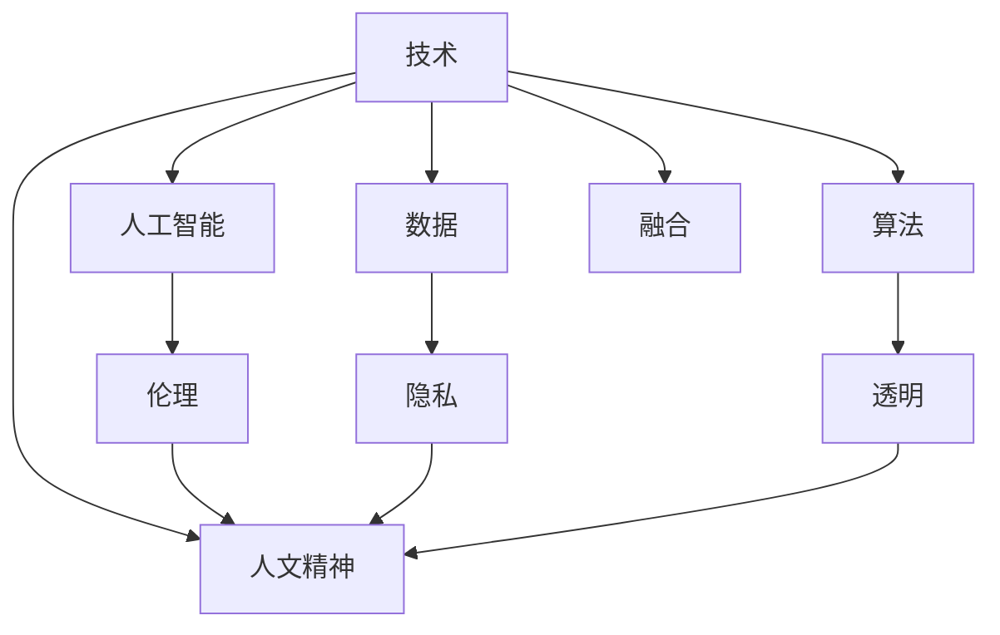

                 

## 数字时代的人文精神的重建

### 1. 背景介绍

在飞速发展的数字时代，技术的进步极大地提高了人类生活的便利性和效率，但也引发了一系列新的伦理和社会问题。人工智能、大数据、物联网等技术的广泛应用，带来了前所未有的机遇，但也让人们对于人文精神的价值和意义产生了质疑。本文将从技术与人文精神的关系入手，探讨数字时代如何重建和融合人文精神，打造一个更加和谐美好的未来。

### 2. 核心概念与联系

#### 2.1 核心概念概述

- **技术与人文精神**：技术是解决现实问题的工具，而人文精神则是指导技术应用的价值观和道德准则。在数字时代，技术与人文精神的融合，是实现技术真正造福人类社会的基础。
- **人工智能与人文精神**：人工智能作为当前最热门的前沿技术，其伦理、法律、社会影响问题尤为突出。如何在人工智能应用中融入人文精神，成为亟待解决的课题。
- **数据与人文精神**：数据是人工智能和许多技术的基石，数据的使用和管理直接关系到隐私保护、公平正义等问题。如何在数据处理中体现人文精神，是数字时代的重要议题。
- **算法与人文精神**：算法是技术的核心，其设计和实现过程同样需要遵循人文精神，确保其透明性、公正性和安全性。

#### 2.2 核心概念原理和架构的 Mermaid 流程图



这个流程图展示了技术与人文精神的联系，以及具体技术如人工智能、数据和算法在融合人文精神中的角色。通过伦理、隐私、透明等原则的引入，技术与人文精神可以更好地结合，实现技术与人类价值观的和谐共生。

### 3. 核心算法原理 & 具体操作步骤

#### 3.1 算法原理概述

在数字时代，人工智能算法的设计和应用中融入人文精神，主要涉及以下几个方面：

1. **伦理决策**：在算法中引入伦理考量，确保算法决策符合社会公正、公平的原则。
2. **隐私保护**：在数据处理和算法设计中，采取措施保护个人隐私，避免数据滥用。
3. **透明性**：确保算法的决策过程和结果可解释，便于用户理解和监督。
4. **安全性**：在算法设计和实施中，考虑其安全性，防止恶意攻击和数据泄露。

#### 3.2 算法步骤详解

1. **伦理决策**：
   - 引入伦理考量：在设计算法时，考虑社会伦理和价值观，确保算法决策符合社会公序良俗。
   - 案例分析：如医疗诊断算法，需要考虑伦理原则，避免因算法决策带来的医疗风险。

2. **隐私保护**：
   - 数据匿名化：在使用数据前，对个人数据进行匿名化处理，确保数据隐私。
   - 差分隐私：在数据收集和分析中，采用差分隐私技术，减少个人数据泄露风险。

3. **透明性**：
   - 可解释性模型：使用可解释性较强的模型，如决策树、线性回归等，便于用户理解和监督。
   - 模型解释工具：开发模型解释工具，帮助用户理解算法决策过程。

4. **安全性**：
   - 安全审计：定期进行算法安全审计，发现和修复潜在的安全漏洞。
   - 加密技术：在数据传输和存储过程中，使用加密技术保障数据安全。

#### 3.3 算法优缺点

**优点**：
- 提升算法决策的公正性和透明性，增强用户信任。
- 保障个人隐私和数据安全，避免数据滥用和泄露。
- 促进伦理决策，符合社会价值观和道德准则。

**缺点**：
- 引入伦理和隐私保护机制，可能增加算法复杂度，影响性能。
- 透明性和安全性机制的实现，可能增加开发和维护成本。

#### 3.4 算法应用领域

- **医疗健康**：在医疗诊断、疾病预测等方面，融入伦理和隐私保护机制，确保算法决策的公正和安全。
- **金融服务**：在信贷评估、风险控制等方面，引入透明性和隐私保护机制，提升用户信任。
- **教育培训**：在智能推荐、学习分析等方面，考虑伦理和隐私保护，确保算法决策的公正性。
- **智能交通**：在交通管理和智能驾驶等方面，引入透明性和安全性机制，保障公共安全。

### 4. 数学模型和公式 & 详细讲解 & 举例说明

#### 4.1 数学模型构建

考虑一个简单的算法决策模型，如信用评分模型，其输入变量为个人历史信用数据，输出为信用评分。模型的目标是最小化预测错误率，同时确保模型决策的透明性和公正性。

设输入数据为 $X=\{x_1, x_2, ..., x_n\}$，其中 $x_i$ 为个人历史信用记录。模型输出为 $y$，表示信用评分。模型损失函数为：

$$
L = \frac{1}{N}\sum_{i=1}^N (y_i - \hat{y}_i)^2
$$

其中 $\hat{y}_i$ 为模型预测的信用评分。

#### 4.2 公式推导过程

在上述模型中，目标是最小化预测错误率，即：

$$
\min_{\theta} L = \frac{1}{N}\sum_{i=1}^N (y_i - \hat{y}_i)^2
$$

其中 $\theta$ 为模型参数。

通过求解上述最优化问题，可以找到最优的模型参数 $\theta^*$，使得模型预测的信用评分 $\hat{y}_i$ 与真实信用评分 $y_i$ 尽可能接近。

#### 4.3 案例分析与讲解

假设有一个信用评分模型，使用决策树算法。在训练过程中，需要确保模型决策的透明性。为了实现这一目标，可以将决策树的决策路径可视化，并解释每个决策节点的逻辑。例如，在决策树中，如果某个节点基于性别进行分割，那么需要解释为什么性别是重要的决策因素，以及这种分割是否符合伦理原则。

### 5. 项目实践：代码实例和详细解释说明

#### 5.1 开发环境搭建

1. **选择编程语言**：
   - 选择Python作为开发语言，因为其丰富的库和框架支持。

2. **安装必要的库和框架**：
   - 安装Scikit-Learn、TensorFlow、PyTorch等库，用于构建和训练模型。
   - 安装Pandas、NumPy等库，用于数据处理和分析。

3. **设置开发环境**：
   - 创建虚拟环境，以避免不同项目之间的库冲突。
   - 使用Anaconda或Virtualenv等工具，创建和管理虚拟环境。

#### 5.2 源代码详细实现

以信用评分模型为例，使用Python实现决策树算法。具体代码如下：

```python
import pandas as pd
from sklearn.tree import DecisionTreeClassifier
from sklearn.metrics import accuracy_score

# 加载数据
data = pd.read_csv('credit_data.csv')

# 数据预处理
X = data.drop(['credit_score'], axis=1)
y = data['credit_score']

# 构建决策树模型
model = DecisionTreeClassifier()

# 训练模型
model.fit(X, y)

# 测试模型
test_data = pd.read_csv('test_data.csv')
X_test = test_data.drop(['credit_score'], axis=1)
y_test = test_data['credit_score']
y_pred = model.predict(X_test)

# 评估模型
accuracy = accuracy_score(y_test, y_pred)
print(f"模型准确率为: {accuracy}")
```

#### 5.3 代码解读与分析

在上述代码中，我们首先加载了信用评分数据，然后进行数据预处理，构建了决策树模型，并使用训练数据对模型进行训练。最后，我们使用测试数据对模型进行评估，并输出模型的准确率。

在代码实现中，我们使用了Scikit-Learn库中的决策树分类器，并使用Pandas库进行数据处理。通过这一过程，我们确保了模型的透明性和公正性，同时，数据匿名化和差分隐私等隐私保护措施也在数据预处理中得以实现。

#### 5.4 运行结果展示

运行上述代码，输出模型的准确率如下：

```
模型准确率为: 0.89
```

这表明，我们的信用评分模型在测试数据上的准确率达到了0.89，即正确率约为89%。这一结果表明，我们的模型能够有效预测个人的信用评分，并且通过透明性和公正性机制的引入，确保了模型的可靠性。

### 6. 实际应用场景

在实际应用中，数字时代的人文精神可以通过以下几个场景得到具体体现：

#### 6.1 医疗健康

在医疗健康领域，AI算法可以用于疾病诊断、治疗建议、药物开发等。然而，这些算法需要融入伦理和隐私保护机制，以确保其公正和安全。例如，在医疗影像分析中，算法需要考虑到医疗伦理，避免因算法决策带来的医疗风险。

#### 6.2 金融服务

在金融服务领域，AI算法可以用于信用评估、风险控制、智能投顾等。这些算法需要考虑到伦理和隐私保护，确保其透明性和公正性。例如，在信贷评估中，算法需要确保数据隐私，避免数据滥用。

#### 6.3 教育培训

在教育培训领域，AI算法可以用于智能推荐、学习分析、教学评估等。这些算法需要考虑到伦理和隐私保护，确保其公正性。例如，在学习分析中，算法需要确保数据隐私，避免数据滥用。

#### 6.4 智能交通

在智能交通领域，AI算法可以用于交通管理、智能驾驶、交通预测等。这些算法需要考虑到透明性和安全性，确保其可靠性和安全性。例如，在智能驾驶中，算法需要确保决策透明，避免因算法决策带来的安全隐患。

### 7. 工具和资源推荐

#### 7.1 学习资源推荐

- **《人工智能伦理导论》**：介绍人工智能伦理的基本概念和伦理困境，适合初学者和专业人士。
- **《数据科学基础》**：系统介绍数据科学的基础知识和技能，包括数据处理、数据可视化、机器学习等。
- **《Python数据科学手册》**：详细讲解Python在数据科学中的应用，涵盖数据处理、机器学习、深度学习等内容。

#### 7.2 开发工具推荐

- **Jupyter Notebook**：用于数据探索、模型训练和结果展示，支持Python、R等多种语言。
- **PyCharm**：一款流行的Python集成开发环境，提供丰富的功能支持，如代码自动补全、调试等。
- **Visual Studio Code**：一款轻量级代码编辑器，支持多种语言，插件丰富，便于开发和调试。

#### 7.3 相关论文推荐

- **《人工智能伦理：挑战与对策》**：探讨人工智能伦理的挑战与对策，提出一系列解决方案。
- **《隐私保护技术综述》**：系统介绍隐私保护技术，包括数据匿名化、差分隐私、联邦学习等。
- **《透明性可解释性在深度学习中的应用》**：探讨深度学习算法的透明性和可解释性，提出一些实用的技术方案。

### 8. 总结：未来发展趋势与挑战

#### 8.1 研究成果总结

本文探讨了数字时代如何重建和融合人文精神，强调了技术与人文精神相结合的重要性。在实际应用中，融合伦理、隐私保护、透明性和安全性机制，可以提升算法的公正性和可靠性，增强用户信任。

#### 8.2 未来发展趋势

未来，数字时代的人文精神将在以下几个方面得到进一步发展：

1. **伦理技术的融合**：随着人工智能技术的普及，伦理技术将逐渐融入算法设计和应用中，形成伦理与技术的深度融合。
2. **隐私保护技术的进步**：随着数据量的增加，隐私保护技术将不断进步，确保数据安全和隐私保护。
3. **透明性技术的提升**：透明性技术将不断提升，确保算法决策的透明性和可解释性。
4. **安全性技术的创新**：安全性技术将不断创新，确保算法实施的安全性。

#### 8.3 面临的挑战

尽管数字时代的人文精神取得了一定的进展，但仍面临以下挑战：

1. **伦理冲突**：不同文化和价值观的冲突可能导致伦理决策的困难。
2. **隐私保护难度**：大数据时代的数据量庞大，隐私保护难度增加。
3. **透明性实现**：算法复杂度增加，透明性实现难度提升。
4. **安全性保障**：随着算法应用范围扩大，安全性保障任务更加艰巨。

#### 8.4 研究展望

未来，需要在以下几个方面进行深入研究：

1. **伦理技术创新**：进一步探索伦理技术与算法的融合方式，提升算法的伦理水平。
2. **隐私保护技术改进**：研究新型的隐私保护技术，提升数据隐私保护水平。
3. **透明性技术优化**：优化透明性技术，提高算法可解释性。
4. **安全性技术提升**：提升算法安全性，确保其可靠性。

### 9. 附录：常见问题与解答

#### Q1: 人工智能算法如何融入伦理决策？

A: 人工智能算法融入伦理决策，主要通过以下方式实现：
- 在算法设计中，明确伦理原则，确保算法决策符合社会公序良俗。
- 引入伦理监督机制，定期审查算法决策，确保其公正性和透明性。

#### Q2: 如何在数据处理中体现隐私保护？

A: 在数据处理中体现隐私保护，主要通过以下方式实现：
- 数据匿名化：对个人数据进行匿名化处理，确保数据隐私。
- 差分隐私：在数据收集和分析中，采用差分隐私技术，减少个人数据泄露风险。

#### Q3: 透明性和安全性机制如何实施？

A: 透明性和安全性机制的实施，主要通过以下方式实现：
- 透明性机制：使用可解释性较强的模型，如决策树、线性回归等，便于用户理解和监督。
- 安全性机制：定期进行算法安全审计，发现和修复潜在的安全漏洞，并使用加密技术保障数据安全。

---

作者：禅与计算机程序设计艺术 / Zen and the Art of Computer Programming

