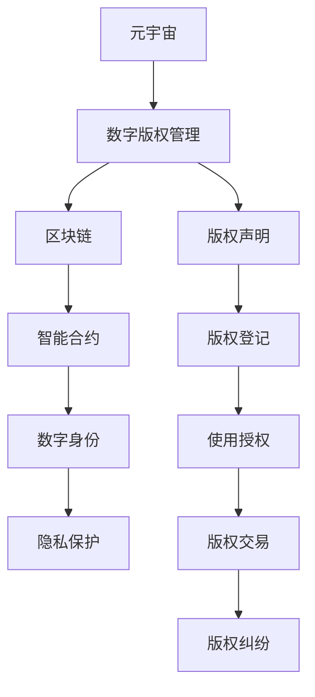

                 

# 数字版权管理:元宇宙中的版权保护新范式

> 关键词：数字版权管理,元宇宙,版权保护,区块链,智能合约,去中心化,数字身份,隐私保护

## 1. 背景介绍

### 1.1 问题由来
数字版权管理（Digital Rights Management, DRM）是保护数字作品版权的重要手段，涉及到内容分发、使用权限控制、版权交易等多个环节。然而，随着数字内容与虚拟现实（Virtual Reality, VR）、增强现实（Augmented Reality, AR）以及区块链技术等新兴技术的融合，传统的DRM技术面临诸多挑战。

### 1.2 问题核心关键点
当前，DRM技术的核心挑战在于以下几个方面：
- 版权所有者如何证明数字作品的原创性和所有权？
- 数字作品如何在多个平台和设备之间可靠分发？
- 用户如何在不破坏版权保护的前提下，自由使用和分享数字作品？
- 数字作品交易过程中的权利归属和付费机制是否透明公正？

元宇宙作为虚拟世界的全新形态，进一步推动了数字版权管理技术的革新。如何在元宇宙中构建可信任、高效、去中心化的版权保护体系，成为亟待解决的难题。

## 2. 核心概念与联系

### 2.1 核心概念概述

为更好地理解元宇宙中的数字版权管理方法，本节将介绍几个关键概念及其相互联系：

- 元宇宙（Metaverse）：一个由虚拟数字技术构建的沉浸式、共存的多维虚拟空间，用户可以自由创建、互动、交易虚拟资产。
- 数字版权管理（DRM）：用于保护数字作品版权的技术，通过技术手段控制数字内容的分发和使用。
- 区块链（Blockchain）：一种去中心化数据库，记录所有交易信息，保证数据不可篡改和透明。
- 智能合约（Smart Contract）：运行在区块链上的代码，自动执行预定义的合约条款，无需第三方介入。
- 数字身份（Digital Identity）：用户在全球网络上的唯一标识，用于证明身份和权利。
- 隐私保护（Privacy Protection）：在保护版权的同时，保障用户隐私，防止信息滥用。

这些核心概念之间通过相互支撑，构建起元宇宙中的版权保护框架。

### 2.2 核心概念原理和架构的 Mermaid 流程图(Mermaid 流程节点中不要有括号、逗号等特殊字符)



这个流程图展示了核心概念之间的逻辑关系：

1. 元宇宙中所有的数字作品都依赖于数字版权管理，以确保内容的归属和合规性。
2. 区块链作为底层技术，确保了版权声明和交易的不可篡改性。
3. 智能合约作为区块链的高级应用，实现了自动化的版权管理流程，减少了人为干预。
4. 数字身份提供了用户在全球网络中的唯一标识，确保了身份的真实性和有效性。
5. 隐私保护则保障了用户数据的隐私，防止数据滥用。

## 3. 核心算法原理 & 具体操作步骤
### 3.1 算法原理概述

元宇宙中的数字版权管理主要依赖于区块链和智能合约技术，通过去中心化的分布式账本和自动化的合约条款，构建起可靠的版权保护体系。

其核心思想是：

1. **版权声明**：创作者在区块链上发布版权声明，记录作品的基本信息和归属。
2. **版权登记**：版权登记机构将创作者声明的版权信息添加到区块链上，证明版权的归属。
3. **使用授权**：用户通过智能合约申请使用数字作品的权限，合约自动验证授权条件。
4. **版权交易**：版权可以自由买卖，所有交易记录均公开透明，避免了版权纠纷。
5. **版权保护**：通过智能合约自动执行版权条款，防止未经授权的复制和分发。

### 3.2 算法步骤详解

以下是元宇宙中数字版权管理的具体操作步骤：

**Step 1: 版权声明**
创作者在区块链上发布版权声明，声明包括作品的名称、创作时间、作者信息、版权状态等。版权声明应使用不可篡改的哈希算法进行加密，确保其不可更改。

**Step 2: 版权登记**
版权登记机构对创作者声明的版权信息进行审核，审核通过后将其添加到区块链上。该过程可以是半自动化的，自动验证信息的正确性和完整性。

**Step 3: 智能合约设定**
创作者可以设定智能合约条款，包括版权使用的范围、授权期限、授权方式等。智能合约会自动验证用户的使用请求，确保符合授权条件。

**Step 4: 用户申请授权**
用户通过智能合约申请使用数字作品的权限。智能合约会自动检查授权条件，如时间、次数、地域等。符合条件时，智能合约自动执行授权，允许用户访问和使用作品。

**Step 5: 版权交易**
版权可以在区块链上进行自由交易，所有交易记录公开透明，便于追踪和审查。智能合约自动执行交易条款，确保交易的合法性和公正性。

**Step 6: 版权保护**
智能合约自动执行版权条款，防止未经授权的复制和分发。任何试图未经授权分发作品的行为都将被智能合约自动识别和阻止。

### 3.3 算法优缺点

元宇宙中的数字版权管理方法有以下优点：

1. **去中心化**：所有版权信息记录在区块链上，无需依赖单一的中心化机构，提高了版权管理的可信度和抗篡改性。
2. **自动化**：智能合约实现了自动化的版权管理流程，减少了人为干预，提高了效率。
3. **透明公正**：所有版权交易记录公开透明，避免了版权纠纷，保障了交易的公正性。
4. **保护隐私**：数字身份技术确保了用户数据的隐私，防止数据滥用。

同时，该方法也存在一些缺点：

1. **技术复杂性高**：区块链和智能合约技术门槛较高，需要专业知识和开发成本。
2. **交易成本高**：区块链上的交易费用较高，增加了版权交易的额外成本。
3. **生态系统尚不完善**：目前元宇宙中的版权生态系统还在起步阶段，版权授权和交易的便捷性有待提高。
4. **法律支持不足**：目前元宇宙版权相关的法律法规尚不完善，存在法律风险。

### 3.4 算法应用领域

数字版权管理技术已经在多个领域得到应用，例如：

- 数字游戏：如《我的世界》等游戏中，通过DRM技术保护游戏内容，防止盗版。
- 电影音乐：电影和音乐作品的版权管理，如Netflix等平台使用DRM技术保护内容。
- 图书电子出版：如Kindle等电子阅读器平台，使用DRM技术保护图书版权。
- 版权交易平台：如Booksy等平台，提供版权交易和授权服务。

在元宇宙中，数字版权管理技术将进一步拓展应用领域，例如：

- 虚拟资产交易：如虚拟土地、虚拟艺术品等的版权保护。
- 虚拟内容创作：如虚拟音乐、虚拟游戏等的版权管理。
- 虚拟活动：如虚拟音乐会、虚拟展览等的版权保护。
- 虚拟社交：如虚拟社区、虚拟世界等的版权保护。

## 4. 数学模型和公式 & 详细讲解 & 举例说明（备注：数学公式请使用latex格式，latex嵌入文中独立段落使用 $$，段落内使用 $)
### 4.1 数学模型构建

以下是元宇宙中数字版权管理的数学模型构建：

**版权声明哈希函数**：
$$
H(c) = SHA-256(c)
$$

其中 $c$ 表示版权声明信息，$H(c)$ 表示版权声明的哈希值。

**版权信息审核验证算法**：
$$
V(c) = 
\begin{cases}
True & \text{如果 } H(c) \text{ 与区块链上的记录一致} \\
False & \text{如果 } H(c) \text{ 与区块链上的记录不一致}
\end{cases}
$$

其中 $V(c)$ 表示版权声明的验证结果。

**智能合约授权条件验证算法**：
$$
A(\text{申请者}, c) = 
\begin{cases}
True & \text{如果申请者的行为符合授权条件 } c \\
False & \text{如果申请者的行为不符合授权条件 } c
\end{cases}
$$

其中 $\text{申请者}$ 表示申请使用版权的用户，$c$ 表示版权声明和智能合约设定的授权条件。

**智能合约交易执行算法**：
$$
T(\text{卖方}, \text{买方}, c) = 
\begin{cases}
True & \text{如果交易符合版权条款 } c \\
False & \text{如果交易不符合版权条款 } c
\end{cases}
$$

其中 $\text{卖方}$ 表示版权的出售者，$\text{买方}$ 表示版权的购买者，$c$ 表示版权声明和智能合约设定的交易条款。

**版权保护算法**：
$$
P(\text{作品}, \text{分发者}) = 
\begin{cases}
True & \text{如果分发者的行为符合版权条款 } c \\
False & \text{如果分发者的行为不符合版权条款 } c
\end{cases}
$$

其中 $\text{作品}$ 表示被保护的数字作品，$\text{分发者}$ 表示分发作品的用户，$c$ 表示版权声明和智能合约设定的保护条款。

### 4.2 公式推导过程

以下推导版权声明和智能合约授权条件验证的公式：

**版权声明哈希函数**：
$$
H(c) = SHA-256(c)
$$

其中 $c$ 为版权声明信息，$H(c)$ 为版权声明的哈希值。

**版权信息审核验证算法**：
$$
V(c) = 
\begin{cases}
True & \text{如果 } H(c) \text{ 与区块链上的记录一致} \\
False & \text{如果 } H(c) \text{ 与区块链上的记录不一致}
\end{cases}
$$

其中 $V(c)$ 表示版权声明的验证结果。

**智能合约授权条件验证算法**：
$$
A(\text{申请者}, c) = 
\begin{cases}
True & \text{如果申请者的行为符合授权条件 } c \\
False & \text{如果申请者的行为不符合授权条件 } c
\end{cases}
$$

其中 $\text{申请者}$ 表示申请使用版权的用户，$c$ 表示版权声明和智能合约设定的授权条件。

### 4.3 案例分析与讲解

**案例1：数字游戏《我的世界》的DRM系统**

《我的世界》采用了一种DRM技术，通过区块链记录玩家的账号信息和游戏数据。玩家创建新账号时，系统在区块链上记录其信息。每次登录时，系统通过区块链验证账号信息，确保账号的真实性。游戏数据保存在玩家账号下，只有本人可以修改。

**案例2：Netflix的电影版权保护**

Netflix使用DRM技术保护其电影版权。电影在发布前，Netflix在区块链上发布版权声明，记录电影基本信息和版权状态。用户观看电影时，Netflix通过区块链验证用户的授权信息，确保用户有权观看。任何未经授权的复制和分发行为都将被智能合约自动阻止。

## 5. 项目实践：代码实例和详细解释说明
### 5.1 开发环境搭建

在进行元宇宙中的数字版权管理实践前，我们需要准备好开发环境。以下是使用Python进行开发的环境配置流程：

1. 安装Anaconda：从官网下载并安装Anaconda，用于创建独立的Python环境。

2. 创建并激活虚拟环境：
```bash
conda create -n drm-env python=3.8 
conda activate drm-env
```

3. 安装必要的Python库：
```bash
pip install hashlib pysha3 pyasn1 pyasn1-modules pyaes cryptography 
```

4. 安装区块链框架：
```bash
pip install eth-blockchain
```

5. 安装智能合约框架：
```bash
pip install pyethereum
```

完成上述步骤后，即可在`drm-env`环境中开始元宇宙中的数字版权管理实践。

### 5.2 源代码详细实现

以下是使用Python进行元宇宙中的数字版权管理的代码实现。

**版权声明哈希函数实现**：
```python
import hashlib

def hash版权声明信息(c):
    return hashlib.sha256(c.encode('utf-8')).hexdigest()
```

**版权信息审核验证实现**：
```python
import hashlib

def 版权信息审核验证(c, 区块链记录):
    return hashlib.sha256(c.encode('utf-8')).hexdigest() == 区块链记录
```

**智能合约授权条件验证实现**：
```python
def 智能合约授权条件验证(申请者, 版权声明):
    授权条件 = 版权声明['授权条件']
    申请者的行为 = 申请者['行为']
    return 授权条件符合申请者的行为
```

**智能合约交易执行实现**：
```python
def 智能合约交易执行(卖方, 买方, 版权声明):
    交易条款 = 版权声明['交易条款']
    卖方的行为 = 卖方的行为
    买方的行为 = 买方的行为
    return 交易条款符合卖方和买方的行为
```

**版权保护实现**：
```python
def 版权保护(作品, 分发者):
    保护条款 = 版权声明['保护条款']
    分发者的行为 = 分发者的行为
    return 保护条款符合分发者的行为
```

### 5.3 代码解读与分析

让我们再详细解读一下关键代码的实现细节：

**版权声明哈希函数**：
- 使用Python的hashlib库计算哈希值。
- 将版权声明信息编码成utf-8字符串，防止中文乱码。
- 返回计算出的哈希值。

**版权信息审核验证**：
- 将版权声明信息转换为utf-8编码，计算哈希值。
- 与区块链上的记录比较，判断是否一致。

**智能合约授权条件验证**：
- 从版权声明中获取授权条件。
- 检查申请者的行为是否符合授权条件。

**智能合约交易执行**：
- 从版权声明中获取交易条款。
- 检查卖方和买方的行为是否符合交易条款。

**版权保护**：
- 从版权声明中获取保护条款。
- 检查分发者的行为是否符合保护条款。

## 6. 实际应用场景
### 6.1 智能游戏版权保护

智能游戏版权保护可以通过区块链和智能合约实现。例如，《我的世界》游戏通过区块链记录玩家的账号信息和游戏数据，确保账号和游戏数据的唯一性。玩家每次登录时，系统通过区块链验证账号信息，确保账号的真实性。

**具体实现**：
- 玩家创建新账号时，系统在区块链上记录其信息。
- 每次登录时，系统通过区块链验证账号信息，确保账号的真实性。
- 玩家的游戏数据保存在区块链上，只有本人可以修改。

### 6.2 电影版权交易

Netflix的电影版权保护可以采用区块链和智能合约技术。电影在发布前，Netflix在区块链上发布版权声明，记录电影基本信息和版权状态。用户观看电影时，Netflix通过区块链验证用户的授权信息，确保用户有权观看。任何未经授权的复制和分发行为都将被智能合约自动阻止。

**具体实现**：
- Netflix在区块链上发布版权声明。
- 用户观看电影时，Netflix通过区块链验证用户的授权信息。
- 智能合约自动阻止未经授权的复制和分发行为。

### 6.3 数字艺术品交易

数字艺术品的版权保护可以采用区块链和智能合约技术。艺术家在区块链上发布版权声明，记录作品基本信息和版权状态。买家在购买艺术品时，智能合约自动执行版权交易，确保交易的合法性和公正性。

**具体实现**：
- 艺术家在区块链上发布版权声明。
- 买家购买艺术品时，智能合约自动执行版权交易。
- 所有交易记录公开透明，便于追踪和审查。

## 7. 工具和资源推荐
### 7.1 学习资源推荐

为了帮助开发者系统掌握元宇宙中的数字版权管理技术，这里推荐一些优质的学习资源：

1. 《区块链技术基础与实战》书籍：全面介绍区块链的基础知识和实际应用，适合初学者入门。
2. 《智能合约开发实战》书籍：深入讲解智能合约的开发流程和最佳实践，适合有一定编程基础的读者。
3. 《数字版权管理技术》在线课程：讲解DRM技术的原理和实现，适合在线学习。
4. 《元宇宙：下一代互联网》视频课程：介绍元宇宙的概念、技术和应用，适合全面了解元宇宙。
5. 《NLP实战：自然语言处理项目实现》书籍：讲解自然语言处理技术和项目实践，适合拓展元宇宙中的语言处理应用。

通过对这些资源的学习实践，相信你一定能够快速掌握元宇宙中的数字版权管理技术，并用于解决实际的NLP问题。

### 7.2 开发工具推荐

高效的开发离不开优秀的工具支持。以下是几款用于元宇宙中数字版权管理开发的常用工具：

1. Python编程语言：Python具有丰富的库和框架，适合快速迭代研究。
2. Ethereum区块链平台：提供智能合约的开发和部署环境，支持大规模应用。
3. Truffle智能合约框架：提供智能合约的开发和管理工具，支持大规模开发。
4. Remix智能合约编辑器：提供智能合约的开发和测试环境，支持交互式调试。
5. MetaMask钱包：提供区块链资产管理和智能合约执行的工具，支持用户和开发者。

合理利用这些工具，可以显著提升元宇宙中数字版权管理的开发效率，加快创新迭代的步伐。

### 7.3 相关论文推荐

元宇宙中的数字版权管理技术发展迅速，以下是几篇奠基性的相关论文，推荐阅读：

1. 《区块链技术在数字版权管理中的应用》论文：探讨区块链技术在数字版权管理中的优势和应用场景。
2. 《智能合约在数字版权交易中的应用》论文：研究智能合约在数字版权交易中的实现机制和优势。
3. 《数字版权声明和授权框架研究》论文：提出数字版权声明和授权的框架，提高版权管理的可信度。
4. 《去中心化版权管理系统的设计与实现》论文：介绍去中心化版权管理系统的设计和实现方法。
5. 《数字身份在数字版权保护中的应用》论文：研究数字身份技术在数字版权保护中的应用和效果。

这些论文代表了大语言模型微调技术的发展脉络。通过学习这些前沿成果，可以帮助研究者把握学科前进方向，激发更多的创新灵感。

## 8. 总结：未来发展趋势与挑战
### 8.1 总结

本文对元宇宙中的数字版权管理方法进行了全面系统的介绍。首先阐述了元宇宙的版权保护需求和DRM技术的挑战，明确了区块链、智能合约、数字身份等关键技术在版权保护中的作用。其次，从原理到实践，详细讲解了版权声明、版权登记、智能合约、使用授权、版权交易等核心操作步骤，给出了数字版权管理的代码实现。同时，本文还广泛探讨了DRM技术在元宇宙中的实际应用场景，展示了DRM范式的巨大潜力。

通过本文的系统梳理，可以看到，元宇宙中的数字版权管理技术正在成为保护数字资产的重要手段，极大地拓展了版权管理的边界，催生了更多的落地场景。未来，伴随区块链和智能合约技术的不断演进，元宇宙中的版权管理将更加灵活、高效、透明，为数字内容产业带来变革性影响。

### 8.2 未来发展趋势

展望未来，元宇宙中的数字版权管理技术将呈现以下几个发展趋势：

1. **去中心化普及**：随着区块链和智能合约技术的普及，去中心化的版权管理将更加普及，减少对中心化机构的依赖。
2. **智能合约自动化**：智能合约将实现更广泛的应用，自动化的版权管理流程将大幅提高效率。
3. **隐私保护增强**：数字身份和隐私保护技术的发展，将进一步增强用户数据的隐私性和安全性。
4. **跨链互操作**：区块链之间的互操作性将提高，不同区块链之间的版权信息可以自由流通。
5. **生态系统完善**：版权生态系统将更加完善，版权交易和授权的便捷性将进一步提升。

以上趋势凸显了元宇宙中数字版权管理技术的广阔前景。这些方向的探索发展，必将进一步提升版权管理的可信度和效率，为数字内容产业带来新的机遇和挑战。

### 8.3 面临的挑战

尽管元宇宙中的数字版权管理技术已经取得了瞩目成就，但在迈向更加智能化、普适化应用的过程中，它仍面临着诸多挑战：

1. **技术复杂性高**：区块链和智能合约技术门槛较高，需要专业知识和开发成本。
2. **交易成本高**：区块链上的交易费用较高，增加了版权交易的额外成本。
3. **生态系统尚不完善**：目前元宇宙中的版权生态系统还在起步阶段，版权授权和交易的便捷性有待提高。
4. **法律支持不足**：目前元宇宙版权相关的法律法规尚不完善，存在法律风险。
5. **隐私保护问题**：在保护版权的同时，需要兼顾用户的隐私权，防止数据滥用。

正视元宇宙中数字版权管理面临的这些挑战，积极应对并寻求突破，将是大语言模型微调走向成熟的必由之路。相信随着学界和产业界的共同努力，这些挑战终将一一被克服，数字版权管理必将在构建安全、可靠、可解释、可控的智能系统中扮演越来越重要的角色。

### 8.4 研究展望

面对元宇宙中数字版权管理所面临的种种挑战，未来的研究需要在以下几个方面寻求新的突破：

1. **去中心化技术的优化**：开发更高效、更低成本的去中心化技术，降低技术门槛和交易成本。
2. **智能合约的优化设计**：优化智能合约的条款设计，提高自动化流程的灵活性和可靠性。
3. **跨链互操作性增强**：增强不同区块链之间的互操作性，促进版权信息的自由流通。
4. **隐私保护机制的完善**：完善数字身份和隐私保护机制，保障用户数据的隐私性和安全性。
5. **法律和政策的支持**：推动相关法律法规和政策的支持，促进版权管理生态系统的健康发展。

这些研究方向的探索，必将引领元宇宙中的数字版权管理技术迈向更高的台阶，为构建安全、可靠、可解释、可控的智能系统铺平道路。面向未来，数字版权管理技术还需要与其他人工智能技术进行更深入的融合，如知识表示、因果推理、强化学习等，多路径协同发力，共同推动自然语言理解和智能交互系统的进步。只有勇于创新、敢于突破，才能不断拓展数字资产管理的边界，让智能技术更好地造福人类社会。

## 9. 附录：常见问题与解答

**Q1：元宇宙中的数字版权管理是否适用于所有应用场景？**

A: 元宇宙中的数字版权管理技术可以适用于大多数数字资产的应用场景，包括游戏、电影、音乐、艺术品等。但对于一些特殊领域，如医疗、法律等，可能还需要结合其他技术手段，确保版权保护的全面性和准确性。

**Q2：如何降低元宇宙中数字版权管理的复杂性？**

A: 降低复杂性可以从以下几个方面入手：
- 选择合适的区块链平台，如Ethereum，具有较高的可扩展性和易用性。
- 采用轻量级的智能合约语言，如Solidity，减少开发成本。
- 简化智能合约条款，使其更加灵活和可靠。
- 利用NLP技术自动生成版权声明和授权信息，减少人工输入的复杂性。

**Q3：元宇宙中的数字版权管理是否需要法律支持？**

A: 是的，元宇宙中的数字版权管理需要法律支持。版权管理涉及版权归属、授权使用、交易记录等多个环节，法律的支持可以保障版权管理的合法性和公正性。因此，政府和相关机构需要推动相关法律法规的完善和实施。

**Q4：如何在元宇宙中保护用户隐私？**

A: 在保护版权的同时，元宇宙中的数字版权管理需要兼顾用户隐私保护。可以使用数字身份技术，确保用户身份的真实性和有效性，同时使用区块链加密技术，保护用户数据的安全性。此外，需要制定隐私保护政策，确保用户数据的合法使用和存储。

**Q5：如何提高元宇宙中数字版权交易的便捷性？**

A: 提高数字版权交易的便捷性可以从以下几个方面入手：
- 简化交易流程，减少用户操作步骤。
- 提供智能合约的自动化交易，减少人工干预。
- 支持多区块链间的互操作性，方便版权信息流通。
- 利用NLP技术自动生成交易条款，减少人工输入的复杂性。

这些措施将有助于提高元宇宙中数字版权管理的便捷性和用户体验。

---

作者：禅与计算机程序设计艺术 / Zen and the Art of Computer Programming

