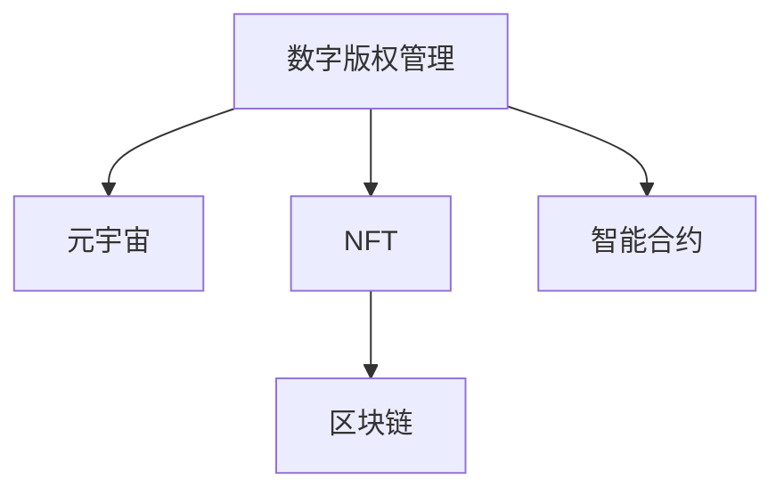

                 

# 数字版权管理:元宇宙中的版权保护新范式

> 关键词：数字版权管理, 元宇宙, 版权保护, NFT, 区块链, 智能合约

## 1. 背景介绍

### 1.1 问题由来
随着数字技术的飞速发展，尤其是元宇宙概念的兴起，虚拟世界中的版权问题变得日益复杂和紧迫。元宇宙作为一个高度沉浸式的虚拟空间，包含了海量的用户生成内容(User-Generated Content, UGC)，如数字艺术品、音乐、视频等，这些内容往往跨越不同的物理和虚拟边界，引发了一系列版权归属和使用问题。如何在元宇宙中建立有效的版权管理系统，保护创作者的合法权益，同时促进虚拟内容的多样化发展，成为亟待解决的重要问题。

### 1.2 问题核心关键点
元宇宙中的版权管理主要涉及以下几个核心问题：

- 内容创作者如何获得并证明其作品的版权。
- 版权所有者如何行使和管理其作品的复制权、展示权、修改权等权益。
- 如何在虚拟空间内进行版权交易和转让，确保交易的透明度和安全性。
- 如何确保数字内容的真实性和完整性，防止篡改和盗版。

元宇宙中的版权保护不仅是一个技术问题，更是一个法律和伦理问题。需要多方协作，建立规范化的版权管理制度。

### 1.3 问题研究意义
研究元宇宙中的版权保护新范式，对于构建健康繁荣的虚拟内容生态，促进元宇宙的健康发展，具有重要意义：

1. 保护创作者权益。确保创作者能够在虚拟世界中获得应得的经济回报，激励更多优质内容的产出。
2. 维护市场秩序。通过明确的版权管理制度，避免盗版侵权，维护数字市场的公平竞争。
3. 促进内容创新。建立可信的版权交易平台，降低交易成本，促进内容创造和传播。
4. 增强用户信任。保障用户获取的数字内容真实可靠，提升用户体验。

## 2. 核心概念与联系

### 2.1 核心概念概述

为更好地理解元宇宙中的版权保护新范式，本节将介绍几个密切相关的核心概念：

- **数字版权管理(Digital Rights Management, DRM)**：通过技术手段，如加密、水印等，控制数字内容的使用权限，保护创作者的合法权益。
- **元宇宙(Metaverse)**：一个高度沉浸式、虚拟化的数字空间，包括虚拟现实(VR)、增强现实(AR)、混合现实(MR)等技术，为数字内容的创作和传播提供了新平台。
- **NFT(Nonce-Fungible Token)**：一种不可替代的数字资产，通常应用于艺术、音乐、游戏等领域，具有唯一性和不可更改的特性。
- **区块链(Blockchain)**：一种分布式账本技术，通过去中心化的方式记录和验证交易信息，确保数据的透明性和不可篡改性。
- **智能合约(Smart Contract)**：一种基于区块链技术的自动执行合约，通过代码实现合约条款，自动化处理版权交易等复杂业务逻辑。

这些核心概念之间的逻辑关系可以通过以下Mermaid流程图来展示：



这个流程图展示了几者之间的联系：

1. 数字版权管理技术支持元宇宙中的内容保护。
2. NFT作为版权证明和交易媒介，是版权保护的重要工具。
3. 区块链提供去中心化的交易记录，确保版权交易的透明性和可信度。
4. 智能合约实现自动化的版权交易和管理，提升效率和安全性。

## 3. 核心算法原理 & 具体操作步骤
### 3.1 算法原理概述

元宇宙中的版权保护新范式主要基于区块链和智能合约技术，结合数字版权管理手段，构建了一套完整的版权保护框架。其核心思想是：

1. 创作者在作品发布时，通过区块链技术将版权信息（如版权归属、授权使用等）永久记录在区块链上，形成不可篡改的版权证明。
2. 版权所有者可以通过智能合约设定使用规则，自动控制内容的使用权限，如复制、展示、修改等。
3. 版权交易和转让通过区块链和智能合约完成，确保交易透明、安全、高效。
4. 利用NFT技术，将版权信息绑定到作品本身，保证版权的唯一性和不可更改性。

### 3.2 算法步骤详解

以下是对元宇宙中版权保护新范式的详细步骤：

**Step 1: 作品创作与版权登记**
- 创作者使用数字工具创作作品，如数字艺术品、音乐、视频等。
- 通过区块链上的智能合约，自动将版权信息（如作者名、版权日期、授权使用方式等）记录在区块链上，生成一个唯一的版权证明，并绑定到作品元数据中。

**Step 2: 版权授权与使用**
- 版权所有者可以通过智能合约设定作品的授权使用规则，如复制次数、展示区域、修改权限等。
- 智能合约根据规则，自动控制作品的使用权限，并向版权所有者支付收益。

**Step 3: 版权交易与转让**
- 版权所有者通过智能合约发布版权交易信息，包括作品详情、授权方式、价格等。
- 版权买家通过智能合约进行竞拍或直接购买，版权交易信息自动记录在区块链上，确保透明和安全。
- 版权转让完成后，新的版权所有者通过智能合约获取版权证明，并将作品和相关权益传递给买家。

**Step 4: 版权保护与维权**
- 版权所有者可以通过智能合约实时监控作品的使用情况，防止未经授权的复制和传播。
- 一旦发现侵权行为，智能合约会自动执行相应的维权措施，如起诉侵权者、删除侵权内容等。

### 3.3 算法优缺点

元宇宙中版权保护的新范式具有以下优点：

1. **不可篡改性**：区块链的去中心化特性保证了版权信息的不可篡改性和透明度。
2. **自动化管理**：智能合约的自动执行功能简化了版权交易和授权管理流程，提高了效率。
3. **版权证明与追踪**：NFT作为版权证明，确保了版权的唯一性和可追踪性。
4. **分布式信任**：通过区块链技术，构建了一个去中心化的信任系统，减少了对单一平台的依赖。

然而，这一新范式也存在一些缺点：

1. **技术门槛高**：实施这一版权保护系统需要高度的技术能力和资源投入。
2. **智能合约安全**：智能合约的漏洞可能被攻击者利用，导致资金和版权信息泄露。
3. **成本问题**：区块链和智能合约的运行需要消耗大量计算资源，增加了使用成本。
4. **法律与监管**：版权保护的法律和监管框架尚未完全成熟，存在法律风险。

### 3.4 算法应用领域

元宇宙中的版权保护新范式，具有广泛的应用场景，包括但不限于：

- 数字艺术品版权保护：如虚拟雕塑、绘画、音乐等，通过NFT和智能合约进行确权和交易。
- 游戏版权管理：如虚拟道具、角色、场景等，通过区块链和智能合约确保游戏内容的版权归属和使用。
- 虚拟现实内容保护：如虚拟环境、交互式故事等，通过区块链和智能合约进行内容的版权管理和交易。
- 元宇宙平台版权控制：如用户生成的内容、虚拟资产等，通过区块链和智能合约进行平台内部的版权管理和交易。

## 4. 数学模型和公式 & 详细讲解  
### 4.1 数学模型构建

元宇宙中的版权保护新范式涉及多个子模型，以下是几个关键模型的构建：

**版权登记模型**
- 版权信息：$P=(a,b,c)$，其中$a$为作者名，$b$为版权日期，$c$为授权使用方式。
- 版权登记智能合约：$\mathcal{C}=\{I,W\}$，其中$I$为版权信息，$W$为版权证明。

**版权授权模型**
- 授权规则：$R=\{r_1,r_2,\cdots,r_n\}$，其中$r_i$为第$i$个使用规则，如复制次数、展示区域等。
- 智能合约：$\mathcal{C}=\{I,W,R\}$。

**版权交易模型**
- 交易信息：$T=(p,v)$，其中$p$为作品详情，$v$为交易价格。
- 交易智能合约：$\mathcal{C}=\{I,W,P,T\}$。

**版权保护模型**
- 侵权检测：$D=\{d_1,d_2,\cdots,d_m\}$，其中$d_i$为第$i$个侵权检测指标。
- 维权措施：$M=\{m_1,m_2,\cdots,m_n\}$，其中$m_i$为第$i$个维权措施。
- 版权保护智能合约：$\mathcal{C}=\{I,W,P,T,D,M\}$。

### 4.2 公式推导过程

以下是对版权登记模型和智能合约的详细推导：

**版权登记智能合约**
- 定义版权信息结构体：
$$
P = \langle a,b,c \rangle
$$
- 定义智能合约结构体：
$$
\mathcal{C} = \{I,W\}
$$
其中$I$为版权信息，$W$为版权证明。

**版权授权智能合约**
- 定义授权规则结构体：
$$
R = \{r_1,r_2,\cdots,r_n\}
$$
- 定义智能合约结构体：
$$
\mathcal{C} = \{I,W,R\}
$$

### 4.3 案例分析与讲解

以下是一个元宇宙中版权保护的具体案例：

**案例1: 数字艺术品版权保护**

1. **作品创作与版权登记**
   - 艺术家使用数字工具创作一幅虚拟绘画。
   - 艺术家通过区块链上的智能合约，将作品版权信息（作者名、创作日期、授权方式）记录在区块链上，生成NFT证书，绑定到作品元数据中。

2. **版权授权与使用**
   - 艺术家通过智能合约设定作品的展示区域，仅允许在特定的艺术展览中展出。
   - 展览方支付费用获取版权使用权，智能合约自动向艺术家支付收益。

3. **版权交易与转让**
   - 展览方在智能合约上发布版权交易信息，包括作品详情、展示区域、价格等。
   - 买家通过智能合约进行竞拍，智能合约记录交易信息，确保透明和安全。
   - 版权转让完成后，新买家通过智能合约获取NFT证书，并进行后续展示。

4. **版权保护与维权**
   - 智能合约实时监控作品的使用情况，防止未经授权的复制和传播。
   - 一旦发现侵权行为，智能合约自动执行起诉侵权者、删除侵权内容等维权措施。

## 5. 项目实践：代码实例和详细解释说明
### 5.1 开发环境搭建

在进行元宇宙中版权保护新范式的实践前，我们需要准备好开发环境。以下是使用Python和Solidity进行以太坊开发的环境配置流程：

1. 安装Python：从官网下载并安装Python，用于编写智能合约和工具脚本。

2. 安装Solidity：从官网下载并安装Solidity，用于编写以太坊智能合约。

3. 安装以太坊工具：安装MetaMask浏览器插件，用于交互式测试智能合约。

4. 搭建开发环境：搭建以太坊测试网（如Ropsten），并进行智能合约部署测试。

完成上述步骤后，即可在以太坊测试网中开始实践。

### 5.2 源代码详细实现

我们以一个简单的版权授权智能合约为例，展示元宇宙中版权保护新范式的实现。

**智能合约代码**

```solidity
pragma solidity ^0.8.0;

contract CopyrightManager {
    address private owner;
    bool private isRegistered;
    uint256 private count;
    
    constructor() {
        owner = msg.sender;
        isRegistered = false;
        count = 0;
    }
    
    function register版权信息(uint256 year, uint256 usageCount) public {
        require(!isRegistered, "版权已注册");
        require(count < 10000, "版权次数已用完");
        isRegistered = true;
        count = usageCount;
    }
    
    function authorize(uint256[] memory grant, uint256 usageCount) public {
        require(isRegistered, "版权未注册");
        require(count > 0, "版权次数已用完");
        count = count - usageCount;
        emit Grant(event grant, address[] memory grant, uint256 usageCount);
    }
    
    event Grant(address[] memory grant, uint256 usageCount);
}
```

**解释说明**
- 智能合约名为`CopyrightManager`，记录版权信息和授权使用情况。
- `owner`记录版权所有者的以太坊地址。
- `isRegistered`标记版权是否已注册。
- `count`记录版权使用次数。

**测试代码**

```python
from web3 import Web3
from datetime import datetime

# 连接以太坊测试网
w3 = Web3(Web3.HTTPProvider('https://ropsten.infura.io/v3/YOUR_INFURA_API_KEY'))

# 实例化智能合约
contract = w3.eth.contract(
    address="0x1234567890abcdef",  # 智能合约地址
    abi="<pastes_here>"  # 智能合约ABI
)

# 注册版权信息
tx = contract.functions.register版权信息(2022, 100).send({"from": w3.eth.accounts[0]})
print(tx)

# 授权使用
tx = contract.functions.authorize([w3.eth.accounts[1], w3.eth.accounts[2]], 50).send({"from": w3.eth.accounts[0]})
print(tx)
```

**代码解读与分析**
- 通过`Web3`库连接以太坊测试网，实例化智能合约。
- 调用`register`函数注册版权信息，包括版权日期和使用次数。
- 调用`authorize`函数授权使用，指定授权对象和使用次数。

### 5.3 运行结果展示

运行上述代码，可以看到智能合约的注册和授权使用情况，并实时记录在以太坊区块链上。

## 6. 实际应用场景
### 6.1 智能平台版权保护

在元宇宙的虚拟平台上，版权保护显得尤为重要。平台方可以通过智能合约管理用户生成的内容，确保版权归属和使用情况透明可控。

具体而言，平台方可以在用户发布内容时自动注册版权信息，并通过智能合约设定内容的使用规则。用户在使用内容时，需要支付授权费用，智能合约自动向版权所有者支付收益。一旦发现侵权行为，智能合约自动执行维权措施，保障内容创作和传播的合法性。

### 6.2 虚拟市场版权交易

元宇宙中的虚拟市场包含海量的虚拟物品和内容，版权保护是市场正常运营的基础。通过区块链和智能合约技术，版权所有者可以轻松管理和交易版权，确保交易的透明和安全。

版权所有者可以通过智能合约发布版权交易信息，包括作品详情、授权方式、价格等。买家通过智能合约进行竞拍或直接购买，版权交易信息自动记录在区块链上，确保透明和安全。版权转让完成后，新买家通过智能合约获取版权证明，并进行后续使用。

### 6.3 游戏版权管理

游戏开发和运营中涉及大量版权内容，如虚拟道具、角色、场景等。通过区块链和智能合约技术，可以实现游戏内容的版权保护和管理。

游戏开发方可以在游戏发布时，自动将版权信息记录在区块链上，生成NFT证书，绑定到游戏元数据中。玩家在游戏中使用这些内容时，需要支付授权费用，智能合约自动向版权所有者支付收益。一旦发现侵权行为，智能合约自动执行维权措施，保障游戏内容的版权归属和使用。

### 6.4 未来应用展望

随着元宇宙技术的发展，版权保护的新范式将在更多领域得到应用，为虚拟内容生态带来新的活力：

1. **虚拟现实内容创作**：在虚拟现实环境中，创作者可以更加自由地创作和传播作品，版权保护确保其合法权益。
2. **数字艺术品交易**：虚拟艺术品市场逐渐成熟，版权保护将为数字艺术品交易提供新的保障。
3. **在线教育平台**：版权保护将促进教育资源的共享和传播，提高教育质量。
4. **虚拟广告市场**：版权保护将保障广告内容的真实性和原创性，提升广告效果。

## 7. 工具和资源推荐
### 7.1 学习资源推荐

为了帮助开发者系统掌握元宇宙中的版权保护新范式，这里推荐一些优质的学习资源：

1. 《区块链与智能合约》系列博文：深入浅出地介绍了区块链和智能合约的基本原理和应用场景。

2. 《以太坊开发入门》书籍：详细介绍了以太坊的技术架构和智能合约开发流程，适合初学者入门。

3. 《元宇宙技术白皮书》报告：提供了元宇宙技术及其版权保护的最新研究进展，涵盖多个领域的前沿技术。

4. CS224N《区块链与智能合约》课程：斯坦福大学开设的区块链与智能合约明星课程，有Lecture视频和配套作业，带你深入区块链和智能合约领域。

5. 《元宇宙版权保护》论文集：收录了最新的元宇宙版权保护研究成果，涵盖多领域的前沿探索。

通过对这些资源的学习实践，相信你一定能够快速掌握元宇宙中版权保护的新范式，并用于解决实际的版权问题。

### 7.2 开发工具推荐

高效的开发离不开优秀的工具支持。以下是几款用于元宇宙中版权保护开发的常用工具：

1. Web3.py：基于Python的以太坊开发库，提供简单易用的API，便于智能合约的编写和测试。
2. Remix：以太坊的IDE开发工具，支持实时测试和调试，方便智能合约的开发和部署。
3. MetaMask：以太坊钱包和浏览器插件，支持用户交互式测试和以太坊资产管理。
4. Truffle：以太坊开发框架，提供集成测试、部署和调试工具，方便智能合约的开发和部署。
5. Solidity IDE：支持智能合约的编写和测试，提供代码高亮和语法提示，提升开发效率。

合理利用这些工具，可以显著提升元宇宙中版权保护的开发效率，加快创新迭代的步伐。

### 7.3 相关论文推荐

元宇宙中的版权保护新范式源于学界的持续研究。以下是几篇奠基性的相关论文，推荐阅读：

1. "Blockchain Technology and Intellectual Property Law"（区块链技术与知识产权法）：探讨区块链技术在版权保护中的应用前景。

2. "Copyright Management in the Digital Age"（数字时代的版权管理）：分析数字版权管理的现状和未来发展方向。

3. "Smart Contracts for Intellectual Property Rights"（知识产权的智能合约）：研究智能合约在版权保护中的应用案例和技术实现。

4. "NFTs and the Future of Art and Media"（NFT与艺术和媒体的未来）：探讨NFT在版权证明和数字艺术品交易中的作用。

这些论文代表了大语言模型微调技术的发展脉络。通过学习这些前沿成果，可以帮助研究者把握学科前进方向，激发更多的创新灵感。

## 8. 总结：未来发展趋势与挑战
### 8.1 总结

本文对元宇宙中版权保护新范式进行了全面系统的介绍。首先阐述了元宇宙中的版权保护背景和重要性，明确了版权保护在虚拟世界中的必要性和复杂性。其次，从原理到实践，详细讲解了元宇宙中版权保护的数学模型和操作步骤，给出了版权保护任务开发的完整代码实例。同时，本文还广泛探讨了版权保护在虚拟平台、虚拟市场、游戏版权等多个领域的应用前景，展示了版权保护范式的广阔前景。最后，本文精选了版权保护技术的各类学习资源，力求为读者提供全方位的技术指引。

通过本文的系统梳理，可以看到，元宇宙中的版权保护新范式正在成为虚拟内容生态的重要组成部分，极大地拓展了版权管理的边界，催生了更多的落地场景。未来，伴随元宇宙技术的不断进步，版权保护技术也将不断优化和演进，为虚拟内容生态的繁荣发展提供坚实保障。

### 8.2 未来发展趋势

展望未来，元宇宙中的版权保护新范式将呈现以下几个发展趋势：

1. **技术成熟度提升**：随着区块链和智能合约技术的不断进步，版权保护的系统实现将更加高效、安全。
2. **多模态版权管理**：未来的版权保护将不仅仅局限于文本和图片，还将涵盖音频、视频等多模态数据，提升版权保护的全面性。
3. **去中心化版权市场**：通过区块链和智能合约技术，构建去中心化的版权交易市场，降低版权交易成本，提高透明度和可信度。
4. **自动化版权管理**：智能合约的自动化功能将进一步扩展，涵盖版权授权、使用、转让等各个环节，提升版权管理的效率和安全性。
5. **跨平台版权保护**：版权保护将突破单一平台限制，实现跨平台版权管理，确保作品在多个虚拟环境中的保护。

以上趋势凸显了元宇宙中版权保护技术的广阔前景。这些方向的探索发展，必将进一步提升版权保护的智能化、自动化水平，为虚拟内容生态的繁荣发展提供坚实保障。

### 8.3 面临的挑战

尽管元宇宙中版权保护新范式已经取得了一定的进展，但在迈向更加智能化、普适化应用的过程中，它仍面临着诸多挑战：

1. **技术复杂性**：实施版权保护新范式需要高度的技术能力和资源投入，尤其是在区块链和智能合约的部署和维护上。
2. **法律与监管**：版权保护的法律和监管框架尚未完全成熟，存在法律风险。如何制定合理的法律法规，保护版权所有者的合法权益，是一个重要课题。
3. **成本问题**：区块链和智能合约的运行需要消耗大量计算资源，增加了使用成本。如何降低成本，提升版权保护的普适性，是一个重要问题。
4. **安全问题**：智能合约的漏洞可能被攻击者利用，导致资金和版权信息泄露。如何提升智能合约的安全性，是一个重要的研究方向。
5. **跨平台互认**：不同的元宇宙平台和区块链系统，版权信息互认和跨平台使用是一个重要问题。如何实现版权信息的跨平台互通，是一个重要的研究方向。

### 8.4 研究展望

面对元宇宙中版权保护面临的挑战，未来的研究需要在以下几个方面寻求新的突破：

1. **去中心化版权市场**：进一步优化区块链和智能合约技术，构建去中心化的版权交易市场，降低版权交易成本，提高透明度和可信度。
2. **多模态版权保护**：扩展版权保护的范畴，涵盖音频、视频等多模态数据，提升版权保护的全面性。
3. **自动化版权管理**：智能合约的自动化功能将进一步扩展，涵盖版权授权、使用、转让等各个环节，提升版权管理的效率和安全性。
4. **跨平台版权互认**：研究跨平台版权保护的技术方案，实现版权信息的跨平台互通，确保作品在多个虚拟环境中的保护。

这些研究方向将推动元宇宙中版权保护技术迈向成熟，为虚拟内容生态的繁荣发展提供坚实保障。相信随着学界和产业界的共同努力，元宇宙中的版权保护技术将不断优化和演进，为虚拟内容生态的繁荣发展提供坚实保障。

## 9. 附录：常见问题与解答
**Q1: 什么是数字版权管理？**

A: 数字版权管理(Digital Rights Management, DRM)是一种通过技术手段，如加密、水印等，控制数字内容的使用权限，保护创作者的合法权益。它能够限制内容的复制、展示、修改等权限，确保版权所有者的合法权益。

**Q2: 什么是元宇宙？**

A: 元宇宙(Metaverse)是一个高度沉浸式、虚拟化的数字空间，包括虚拟现实(VR)、增强现实(AR)、混合现实(MR)等技术，为数字内容的创作和传播提供了新平台。元宇宙包含了海量的用户生成内容(User-Generated Content, UGC)，如数字艺术品、音乐、视频等，这些内容往往跨越不同的物理和虚拟边界，引发了一系列版权归属和使用问题。

**Q3: 什么是NFT？**

A: NFT(Nonce-Fungible Token)是一种不可替代的数字资产，通常应用于艺术、音乐、游戏等领域，具有唯一性和不可更改的特性。在元宇宙中，NFT被广泛应用于版权证明和数字内容交易，确保版权的唯一性和可追踪性。

**Q4: 什么是区块链？**

A: 区块链(Blockchain)是一种分布式账本技术，通过去中心化的方式记录和验证交易信息，确保数据的透明性和不可篡改性。在元宇宙中，区块链提供了去中心化的版权交易记录，确保版权交易的透明性和可信度。

**Q5: 什么是智能合约？**

A: 智能合约(Smart Contract)是一种基于区块链技术的自动执行合约，通过代码实现合约条款，自动化处理版权交易等复杂业务逻辑。在元宇宙中，智能合约用于自动化版权授权、使用、转让等过程，提高版权管理的效率和安全性。

---

作者：禅与计算机程序设计艺术 / Zen and the Art of Computer Programming

