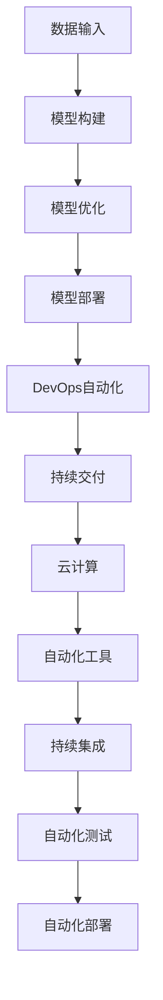

                 

# 数据即模型,软件2.0颠覆传统软件方法论

> 关键词：数据驱动、模型驱动、软件2.0、DevOps、云计算、自动化、持续交付

## 1. 背景介绍

### 1.1 问题由来

在传统的软件开发方法论中，程序员通过分析业务需求，编写代码，再通过测试来验证和优化。然而，这种方法存在显著的局限性：

- 需求不明确：业务需求描述模糊不清，难以直接转化为可执行代码。
- 迭代周期长：需求变更频繁，开发周期和测试周期长，难以快速迭代。
- 开发成本高：开发和测试成本高，需要大量人力物力。

随着信息技术的不断发展，特别是云计算和大数据技术的应用，使得数据成为驱动软件创新的重要因素。通过对数据进行分析、挖掘和建模，可以发现隐藏在数据背后的规律和洞见，驱动软件创新，构建智能化的业务系统。

### 1.2 问题核心关键点

数据驱动的软件开发方法，即通过数据驱动模型构建，利用机器学习算法、数据挖掘技术，进行模型训练、优化和部署。这种方法将数据作为软件系统的核心驱动力，通过数据驱动模型，提高软件系统的准确性和可靠性。

数据驱动方法的核心在于：

1. 以数据为输入，模型为计算单元，优化模型输出，驱动软件实现。
2. 使用先进的机器学习算法，如深度学习、强化学习、生成对抗网络等，提升模型复杂度和精度。
3. 采用DevOps模式，实现模型训练、验证、部署的自动化和持续交付。

数据驱动方法论不仅能提升软件的性能和效率，还能加速创新迭代，降低开发成本，提升用户体验。

### 1.3 问题研究意义

数据驱动的软件开发方法，将数据作为软件系统的核心驱动力，通过模型构建和优化，驱动软件实现。这种方法具有以下重要意义：

- 提高软件质量：通过数据驱动的模型优化，可以精确捕捉业务需求，提高软件系统的准确性和可靠性。
- 加速创新迭代：数据驱动方法能快速迭代，及时响应业务需求变化，缩短开发周期。
- 降低开发成本：数据驱动方法可以减少人工干预，自动化开发和测试，降低开发成本。
- 提升用户体验：数据驱动方法能更准确地预测用户行为，提升用户体验和满意度。

## 2. 核心概念与联系

### 2.1 核心概念概述

数据驱动的软件开发方法，涉及以下几个核心概念：

- 数据驱动：通过数据输入，模型计算，驱动软件系统的实现。
- 模型驱动：使用先进的机器学习算法，构建高性能、高精度的模型。
- DevOps：采用自动化工具和流程，实现软件系统的持续交付。
- 云计算：利用云平台提供的数据存储和计算能力，支撑大数据分析和模型训练。
- 自动化：通过工具和流程自动化，提升开发效率和软件系统的稳定性。
- 持续交付：采用DevOps模式，实现软件系统的快速迭代和持续交付。

这些核心概念之间的逻辑关系可以通过以下Mermaid流程图来展示：



这个流程图展示了大数据驱动方法的核心概念及其之间的关系：

1. 数据输入作为模型构建的基础。
2. 使用先进的机器学习算法进行模型构建和优化。
3. 利用云计算平台提供的数据存储和计算能力，支撑模型训练。
4. 采用DevOps自动化工具，实现模型的持续交付和部署。
5. 利用自动化工具和流程，提升开发效率和软件系统稳定性。

这些概念共同构成了大数据驱动软件开发方法的核心框架，使其能够在各种场景下发挥强大的数据驱动能力。

## 3. 核心算法原理 & 具体操作步骤
### 3.1 算法原理概述

数据驱动的软件开发方法，本质上是一个基于数据驱动的模型构建和优化的过程。其核心思想是：通过数据驱动模型，使用先进的机器学习算法，对数据进行建模、分析和优化，驱动软件系统的实现。

形式化地，假设数据集为 $D=\{(x_i, y_i)\}_{i=1}^N, x_i \in \mathbb{R}^d, y_i \in \mathbb{R}^k$，其中 $d$ 为特征维度，$k$ 为标签维度。模型为 $f: \mathbb{R}^d \rightarrow \mathbb{R}^k$。

数据驱动方法的目标是找到最优模型 $f^*$，使得模型在训练集 $D$ 上的经验风险最小，即：

$$
f^* = \mathop{\arg\min}_{f} \frac{1}{N} \sum_{i=1}^N \ell(f(x_i),y_i)
$$

其中 $\ell$ 为损失函数，通常为均方误差或交叉熵损失。

### 3.2 算法步骤详解

数据驱动的软件开发方法一般包括以下几个关键步骤：

**Step 1: 数据准备和预处理**
- 收集业务相关数据，进行清洗、去重、归一化等预处理。
- 划分训练集、验证集和测试集，保证数据分布的一致性。
- 采用特征工程技术，提取和构造关键特征。

**Step 2: 模型构建**
- 选择合适的机器学习算法，如线性回归、支持向量机、深度学习等。
- 设计模型结构，包括输入层、隐藏层、输出层等。
- 进行模型训练，选择合适的优化器，如随机梯度下降、Adam等。

**Step 3: 模型验证和优化**
- 在验证集上评估模型性能，选择最优模型超参数，如学习率、批大小、迭代次数等。
- 采用交叉验证、正则化等技术，避免过拟合。
- 引入集成学习技术，提升模型性能。

**Step 4: 模型部署和应用**
- 利用自动化工具，将模型部署到生产环境。
- 利用DevOps工具，实现模型的持续交付和更新。
- 利用云计算平台，提供高效的数据存储和计算能力。

**Step 5: 持续改进和优化**
- 定期收集新数据，进行模型重新训练和优化。
- 利用自动化工具，实现模型训练、验证、部署的自动化。
- 引入持续集成和持续交付(CICD)流程，实现软件的快速迭代和优化。

以上是数据驱动软件开发方法的一般流程。在实际应用中，还需要针对具体任务的特点，对各个环节进行优化设计，如改进特征工程技术，引入更先进的算法等。

### 3.3 算法优缺点

数据驱动的软件开发方法具有以下优点：

1. 数据驱动：以数据为输入，模型为计算单元，驱动软件系统的实现，提高了软件系统的可靠性和准确性。
2. 自动化：利用自动化工具和流程，提升开发效率和软件系统稳定性。
3. 持续交付：通过DevOps模式，实现软件的快速迭代和持续交付。
4. 高效性：利用云计算平台提供的数据存储和计算能力，支撑大数据分析和模型训练。

同时，该方法也存在一定的局限性：

1. 数据依赖：数据驱动方法高度依赖数据质量，数据偏差可能导致模型预测错误。
2. 复杂性：模型构建和优化过程复杂，需要专业知识支撑。
3. 资源消耗：模型训练和推理需要大量计算资源，成本较高。
4. 可解释性：模型的决策过程通常缺乏可解释性，难以进行调试和优化。

尽管存在这些局限性，但就目前而言，数据驱动方法仍然是软件创新和应用的重要范式。未来相关研究的重点在于如何进一步降低数据依赖，提高模型的可解释性和鲁棒性，同时兼顾性能和成本等因素。

### 3.4 算法应用领域

数据驱动的软件开发方法，在多个领域得到了广泛应用，例如：

- 金融科技：利用大数据分析，构建风控模型、信用评估模型、交易预测模型等。
- 医疗健康：通过分析患者数据，构建疾病预测模型、个性化治疗方案等。
- 零售电商：利用用户行为数据，构建推荐系统、库存管理模型等。
- 智能交通：通过交通数据，构建交通流量预测模型、路径规划算法等。
- 制造业：利用设备运行数据，构建设备故障预测模型、生产调度模型等。

除了上述这些经典应用外，数据驱动方法还被创新性地应用到更多场景中，如社交网络分析、情感分析、舆情监测等，为各行各业提供了新的解决方案。

## 4. 数学模型和公式 & 详细讲解  
### 4.1 数学模型构建

本节将使用数学语言对数据驱动的软件开发方法进行更加严格的刻画。

假设数据集 $D=\{(x_i, y_i)\}_{i=1}^N, x_i \in \mathbb{R}^d, y_i \in \mathbb{R}^k$。模型为 $f: \mathbb{R}^d \rightarrow \mathbb{R}^k$，其中 $d$ 为特征维度，$k$ 为标签维度。

定义模型 $f$ 在数据样本 $(x,y)$ 上的损失函数为 $\ell(f(x),y)$。在数据集 $D$ 上的经验风险为：

$$
\mathcal{L}(f) = \frac{1}{N} \sum_{i=1}^N \ell(f(x_i),y_i)
$$

数据驱动方法的目标是最小化经验风险，即找到最优模型 $f^*$：

$$
f^* = \mathop{\arg\min}_{f} \mathcal{L}(f)
$$

在实践中，我们通常使用基于梯度的优化算法（如SGD、Adam等）来近似求解上述最优化问题。设 $\eta$ 为学习率，$\lambda$ 为正则化系数，则参数的更新公式为：

$$
f \leftarrow f - \eta \nabla_{f}\mathcal{L}(f) - \eta\lambda f
$$

其中 $\nabla_{f}\mathcal{L}(f)$ 为损失函数对参数 $f$ 的梯度，可通过反向传播算法高效计算。

### 4.2 公式推导过程

以下我们以线性回归为例，推导损失函数及其梯度的计算公式。

假设模型 $f(x) = wx + b$，其中 $w$ 为权重，$b$ 为偏置，$x$ 为输入。定义均方误差损失函数为：

$$
\ell(f(x),y) = \frac{1}{2}(f(x)-y)^2
$$

将其代入经验风险公式，得：

$$
\mathcal{L}(f) = \frac{1}{N} \sum_{i=1}^N \frac{1}{2}(f(x_i)-y_i)^2
$$

根据链式法则，损失函数对参数 $w$ 的梯度为：

$$
\frac{\partial \mathcal{L}(f)}{\partial w} = -\frac{1}{N}\sum_{i=1}^N (f(x_i)-y_i)x_i
$$

其中 $x_i$ 为输入特征，$y_i$ 为标签。

在得到损失函数的梯度后，即可带入参数更新公式，完成模型的迭代优化。重复上述过程直至收敛，最终得到适应数据集的最优模型 $f^*$。

## 5. 项目实践：代码实例和详细解释说明
### 5.1 开发环境搭建

在进行数据驱动的模型开发实践前，我们需要准备好开发环境。以下是使用Python进行TensorFlow开发的環境配置流程：

1. 安装Anaconda：从官网下载并安装Anaconda，用于创建独立的Python环境。

2. 创建并激活虚拟环境：
```bash
conda create -n tf-env python=3.8 
conda activate tf-env
```

3. 安装TensorFlow：根据CUDA版本，从官网获取对应的安装命令。例如：
```bash
conda install tensorflow -c conda-forge
```

4. 安装各类工具包：
```bash
pip install numpy pandas scikit-learn matplotlib tqdm jupyter notebook ipython
```

完成上述步骤后，即可在`tf-env`环境中开始模型开发实践。

### 5.2 源代码详细实现

下面我们以线性回归模型为例，给出使用TensorFlow进行数据驱动的线性回归模型开发的PyTorch代码实现。

首先，定义训练集和测试集：

```python
import tensorflow as tf
from sklearn.datasets import load_boston
from sklearn.model_selection import train_test_split

# 加载波士顿房价数据集
boston = load_boston()
X, y = boston.data, boston.target

# 划分训练集和测试集
X_train, X_test, y_train, y_test = train_test_split(X, y, test_size=0.2, random_state=42)
```

然后，定义模型和优化器：

```python
model = tf.keras.Sequential([
    tf.keras.layers.Dense(1, input_dim=X_train.shape[1], activation='linear')
])
optimizer = tf.keras.optimizers.Adam(learning_rate=0.01)
```

接着，定义训练和评估函数：

```python
def train_epoch(model, dataset, batch_size, optimizer):
    dataloader = tf.data.Dataset.from_tensor_slices(dataset).batch(batch_size).shuffle(buffer_size=100).repeat().prefetch(buffer_size=1)
    model.compile(optimizer=optimizer, loss='mse', metrics=['mae'])
    model.fit(dataloader, epochs=100)
    
def evaluate(model, dataset, batch_size):
    dataloader = tf.data.Dataset.from_tensor_slices(dataset).batch(batch_size).prefetch(buffer_size=1)
    loss, mae = model.evaluate(dataloader)
    print(f'MAE: {mae:.2f}')
```

最后，启动训练流程并在测试集上评估：

```python
epochs = 10
batch_size = 32

for epoch in range(epochs):
    train_epoch(model, (X_train, y_train), batch_size, optimizer)
    evaluate(model, (X_test, y_test), batch_size)
```

以上就是使用TensorFlow进行数据驱动的线性回归模型开发的完整代码实现。可以看到，得益于TensorFlow的强大封装，我们可以用相对简洁的代码完成线性回归模型的开发。

### 5.3 代码解读与分析

让我们再详细解读一下关键代码的实现细节：

**加载数据集**：
- 使用sklearn的`load_boston`函数，加载波士顿房价数据集，包含14个特征和一个目标变量。

**划分数据集**：
- 使用`train_test_split`函数，将数据集划分为训练集和测试集，比例为8:2。

**定义模型**：
- 使用`tf.keras.Sequential`定义一个线性回归模型，包含一个全连接层，输出为1个节点，激活函数为线性。

**定义优化器**：
- 使用`tf.keras.optimizers.Adam`定义优化器，学习率为0.01。

**训练函数**：
- 将数据集转换为TF数据集，并进行批处理、打乱、重复和预取等操作，用于模型训练。
- 使用`model.compile`方法定义模型编译，指定优化器、损失函数和评价指标。
- 使用`model.fit`方法训练模型，指定数据集、批次大小和轮数。

**评估函数**：
- 将数据集转换为TF数据集，并进行预取操作，用于模型评估。
- 使用`model.evaluate`方法评估模型性能，指定数据集和批次大小，输出MAE误差。

**训练流程**：
- 循环训练模型，每次在训练集上训练一个epoch，并在测试集上评估模型性能。

可以看到，TensorFlow使得数据驱动的模型开发变得简洁高效。开发者可以将更多精力放在数据处理、模型改进等高层逻辑上，而不必过多关注底层的实现细节。

当然，工业级的系统实现还需考虑更多因素，如模型的保存和部署、超参数的自动搜索、更灵活的特征工程技术等。但核心的数据驱动开发范式基本与此类似。

## 6. 实际应用场景
### 6.1 智能推荐系统

基于数据驱动的智能推荐系统，可以通过分析用户行为数据，构建推荐模型，为用户推荐个性化的商品、内容和服务。智能推荐系统已经成为电商、新闻、视频等领域不可或缺的一部分。

在技术实现上，可以收集用户浏览、点击、评分等行为数据，提取和构造关键特征，构建推荐模型。常用的模型包括协同过滤、内容推荐、基于深度学习的推荐等。在训练过程中，通过交叉验证、正则化等技术，避免过拟合。在部署过程中，利用自动化工具和DevOps流程，实现模型的持续交付和更新。如此构建的智能推荐系统，能够及时响应用户需求变化，提供个性化推荐，提升用户体验和满意度。

### 6.2 风险管理

在金融、保险等领域，风险管理是关键任务之一。通过分析历史数据，构建风险预测模型，可以有效评估客户的信用风险、市场风险等。数据驱动的风险管理方法，能够及时发现风险信号，减少损失，提升决策质量。

在技术实现上，可以收集客户的交易记录、信用评分、行为数据等，提取和构造关键特征，构建风险预测模型。常用的模型包括逻辑回归、随机森林、神经网络等。在训练过程中，通过交叉验证、正则化等技术，避免过拟合。在部署过程中，利用自动化工具和DevOps流程，实现模型的持续交付和更新。如此构建的风险管理模型，能够及时发现风险信号，减少损失，提升决策质量。

### 6.3 智能医疗

在医疗领域，数据驱动的智能医疗系统可以通过分析患者数据，构建疾病预测模型、个性化治疗方案等。数据驱动的智能医疗系统，能够提升医疗服务的智能化水平，辅助医生诊断和治疗。

在技术实现上，可以收集患者的电子病历、影像数据、基因数据等，提取和构造关键特征，构建疾病预测模型、个性化治疗方案等。常用的模型包括支持向量机、深度学习等。在训练过程中，通过交叉验证、正则化等技术，避免过拟合。在部署过程中，利用自动化工具和DevOps流程，实现模型的持续交付和更新。如此构建的智能医疗系统，能够提升医疗服务的智能化水平，辅助医生诊断和治疗。

### 6.4 未来应用展望

随着数据驱动方法的发展，未来的应用场景将会更加丰富。除了上述这些经典应用外，数据驱动方法还被创新性地应用到更多场景中，如智能交通、智慧城市、智能家居等，为各行各业提供了新的解决方案。

在智能交通领域，通过分析交通数据，构建交通流量预测模型、路径规划算法等。在智慧城市领域，通过分析城市运行数据，构建城市事件监测、舆情分析等系统。在智能家居领域，通过分析用户行为数据，构建智能家居控制系统等。

未来，伴随数据驱动方法论的不断演进，将会涌现更多创新应用，为各行各业带来新的变革。数据驱动方法将成为构建智能化业务系统的关键手段，推动各行业的数字化转型升级。

## 7. 工具和资源推荐
### 7.1 学习资源推荐

为了帮助开发者系统掌握数据驱动方法的理论基础和实践技巧，这里推荐一些优质的学习资源：

1. 《深度学习》（周志华）：全面介绍深度学习的基本概念和经典模型，包括神经网络、卷积神经网络、循环神经网络等。

2. 《机器学习实战》（Peter Harrington）：通过实战案例，介绍机器学习的基本算法和应用，包括线性回归、逻辑回归、决策树等。

3. 《Python数据科学手册》（Jake VanderPlas）：全面介绍Python在数据科学中的应用，包括数据处理、数据分析、数据可视化等。

4. 《TensorFlow实战》（李沐）：全面介绍TensorFlow的使用方法，包括模型构建、训练、评估等。

5. Kaggle：全球最大的数据科学竞赛平台，提供大量开源数据集和模型代码，可以借鉴和学习。

通过对这些资源的学习实践，相信你一定能够快速掌握数据驱动方法的理论基础和实践技巧，并用于解决实际的业务问题。

### 7.2 开发工具推荐

高效的开发离不开优秀的工具支持。以下是几款用于数据驱动方法开发的常用工具：

1. TensorFlow：由Google主导开发的深度学习框架，功能强大，支持分布式计算和模型部署。

2. PyTorch：由Facebook主导开发的深度学习框架，灵活高效，适合研究和开发。

3. Scikit-learn：Python的机器学习库，提供丰富的算法和工具，适合快速开发和实验。

4. Pandas：Python的数据处理库，支持数据清洗、处理和分析，适合大数据分析。

5. Jupyter Notebook：开源的交互式计算环境，支持Python和R等多种编程语言，方便实验和分享。

6. Git：分布式版本控制系统，支持团队协作和代码管理，适合版本控制和协作开发。

合理利用这些工具，可以显著提升数据驱动方法的开发效率，加快创新迭代的步伐。

### 7.3 相关论文推荐

数据驱动方法的发展源于学界的持续研究。以下是几篇奠基性的相关论文，推荐阅读：

1. 《深度学习》（Ian Goodfellow）：全面介绍深度学习的基本概念和算法，涵盖卷积神经网络、循环神经网络、生成对抗网络等。

2. 《机器学习：实践操作指南》（Peter Harrington）：通过实战案例，介绍机器学习的基本算法和应用，包括线性回归、逻辑回归、决策树等。

3. 《大数据分析：统计学习基础》（John D. Keselman）：全面介绍大数据分析的基本概念和算法，包括回归分析、聚类分析、异常检测等。

4. 《基于数据驱动的智能推荐系统》（Li Chen）：介绍数据驱动的智能推荐系统的构建方法，包括协同过滤、内容推荐、深度学习等。

5. 《数据驱动的风险管理》（Donglin Zhou）：介绍数据驱动的风险管理方法，包括逻辑回归、随机森林、神经网络等。

这些论文代表了大数据驱动方法的发展脉络。通过学习这些前沿成果，可以帮助研究者把握学科前进方向，激发更多的创新灵感。

## 8. 总结：未来发展趋势与挑战

### 8.1 总结

本文对数据驱动的软件开发方法进行了全面系统的介绍。首先阐述了数据驱动方法的核心理念和研究背景，明确了数据驱动方法在提升软件系统性能、加速创新迭代方面的独特价值。其次，从原理到实践，详细讲解了数据驱动的数学模型和核心算法，给出了数据驱动方法开发的完整代码实例。同时，本文还广泛探讨了数据驱动方法在智能推荐、风险管理、智能医疗等多个领域的应用前景，展示了数据驱动方法论的巨大潜力。此外，本文精选了数据驱动方法的相关学习资源，力求为读者提供全方位的技术指引。

通过本文的系统梳理，可以看到，数据驱动方法论正在成为软件开发的重要范式，极大地提升了软件的性能和效率，加速了创新迭代，降低了开发成本，提升了用户体验。未来，伴随数据驱动方法论的不断演进，将会涌现更多创新应用，为各行各业带来新的变革。

### 8.2 未来发展趋势

展望未来，数据驱动方法的发展趋势包括以下几个方面：

1. 模型复杂性提升：随着深度学习技术的发展，模型结构将更加复杂，性能和精度将大幅提升。

2. 自动化程度提高：利用自动化工具和流程，提升开发效率和软件系统稳定性。

3. 云计算和分布式计算：利用云计算平台提供的数据存储和计算能力，支撑大数据分析和模型训练。

4. 持续交付和持续集成：通过DevOps模式，实现软件的快速迭代和持续交付。

5. 数据驱动的智能决策：利用数据驱动的模型，构建智能化的决策系统，提升决策质量和效率。

以上趋势凸显了数据驱动方法论的广阔前景。这些方向的探索发展，必将进一步提升数据驱动方法论的科学性和工程性，为构建智能化业务系统提供坚实的技术支撑。

### 8.3 面临的挑战

尽管数据驱动方法论已经取得了瞩目成就，但在迈向更加智能化、普适化应用的过程中，它仍面临诸多挑战：

1. 数据依赖：数据驱动方法高度依赖数据质量，数据偏差可能导致模型预测错误。

2. 复杂性：模型构建和优化过程复杂，需要专业知识支撑。

3. 资源消耗：模型训练和推理需要大量计算资源，成本较高。

4. 可解释性：模型的决策过程通常缺乏可解释性，难以进行调试和优化。

5. 安全性：数据驱动方法可能学习到有偏见、有害的信息，给实际应用带来安全隐患。

尽管存在这些挑战，但未来研究需要在以下几个方面寻求新的突破：

1. 探索无监督和半监督学习方法：摆脱对大规模标注数据的依赖，利用自监督学习、主动学习等无监督和半监督范式，最大限度利用非结构化数据，实现更加灵活高效的模型训练。

2. 开发更加参数高效的方法：开发更加参数高效的模型训练方法，在固定大部分预训练参数的同时，只更新极少量的任务相关参数，提高训练效率和模型性能。

3. 引入更多的先验知识：将符号化的先验知识，如知识图谱、逻辑规则等，与神经网络模型进行巧妙融合，引导模型学习更准确、合理的语言表征，提升模型的泛化能力和鲁棒性。

4. 引入持续学习机制：利用持续学习机制，让模型能够不断学习新知识，避免过拟合和灾难性遗忘，提升模型的实时性和稳定性。

5. 引入因果分析工具：将因果分析方法引入模型构建和优化过程，识别出模型决策的关键特征，增强模型输出的可解释性和逻辑性，提升系统的可信度和安全性。

这些研究方向将进一步推动数据驱动方法论的发展，提升模型的性能和可靠性，保障应用的安全性和稳定性，为构建安全、可靠、可解释、可控的智能系统提供坚实的技术支撑。

### 8.4 研究展望

未来，数据驱动方法论将继续在各领域广泛应用，为各行各业带来新的变革。以下是一些可能的研究方向：

1. 数据驱动的智能交通系统：通过分析交通数据，构建交通流量预测模型、路径规划算法等，提升智能交通系统的智能化水平。

2. 数据驱动的智慧城市治理：通过分析城市运行数据，构建城市事件监测、舆情分析等系统，提升城市治理的智能化水平。

3. 数据驱动的智能家居系统：通过分析用户行为数据，构建智能家居控制系统等，提升智能家居系统的智能化水平。

4. 数据驱动的智能制造系统：通过分析设备运行数据，构建设备故障预测模型、生产调度模型等，提升智能制造系统的智能化水平。

5. 数据驱动的智能教育系统：通过分析学生学习数据，构建个性化学习推荐系统、智能辅导系统等，提升教育系统的智能化水平。

6. 数据驱动的智能医疗系统：通过分析患者数据，构建疾病预测模型、个性化治疗方案等，提升医疗系统的智能化水平。

7. 数据驱动的智能金融系统：通过分析市场数据、交易数据等，构建风险预测模型、投资推荐系统等，提升金融系统的智能化水平。

以上研究方向将进一步推动数据驱动方法论的发展，提升各系统的智能化水平，为各行各业带来新的变革。相信随着学界和产业界的共同努力，数据驱动方法论必将引领人工智能技术迈向新的高峰，为构建安全、可靠、可解释、可控的智能系统铺平道路。

## 9. 附录：常见问题与解答

**Q1：数据驱动的软件开发方法有哪些优点？**

A: 数据驱动的软件开发方法具有以下优点：

1. 数据驱动：以数据为输入，模型为计算单元，驱动软件系统的实现，提高了软件系统的可靠性和准确性。
2. 自动化：利用自动化工具和流程，提升开发效率和软件系统稳定性。
3. 持续交付：通过DevOps模式，实现软件的快速迭代和持续交付。
4. 高效性：利用云计算平台提供的数据存储和计算能力，支撑大数据分析和模型训练。

**Q2：数据驱动的软件开发方法有哪些局限性？**

A: 数据驱动的软件开发方法也存在以下局限性：

1. 数据依赖：数据驱动方法高度依赖数据质量，数据偏差可能导致模型预测错误。
2. 复杂性：模型构建和优化过程复杂，需要专业知识支撑。
3. 资源消耗：模型训练和推理需要大量计算资源，成本较高。
4. 可解释性：模型的决策过程通常缺乏可解释性，难以进行调试和优化。

尽管存在这些局限性，但就目前而言，数据驱动方法仍是软件创新和应用的重要范式。未来相关研究的重点在于如何进一步降低数据依赖，提高模型的可解释性和鲁棒性，同时兼顾性能和成本等因素。

**Q3：如何选择合适的数据驱动模型？**

A: 选择合适的数据驱动模型需要综合考虑以下几个因素：

1. 问题类型：根据问题类型选择适合的模型，如线性回归适用于线性问题，神经网络适用于非线性问题。
2. 数据规模：根据数据规模选择适合的模型，大数据集适合使用深度学习模型，小数据集适合使用传统机器学习模型。
3. 模型复杂性：根据模型复杂性选择适合的模型，简单问题使用线性模型，复杂问题使用深度神经网络模型。
4. 模型可解释性：根据模型可解释性需求选择适合的模型，可解释性要求高的问题使用线性模型，可解释性要求低的问题使用深度神经网络模型。

**Q4：如何进行数据驱动的模型优化？**

A: 进行数据驱动的模型优化需要综合考虑以下几个方面：

1. 数据预处理：对数据进行清洗、归一化、特征工程等预处理，提高数据质量。
2. 模型选择：选择适合问题的模型，如线性回归、决策树、神经网络等。
3. 损失函数选择：根据问题类型选择适合的损失函数，如均方误差损失、交叉熵损失等。
4. 正则化技术：使用L2正则、Dropout等技术，避免过拟合。
5. 模型验证：在验证集上评估模型性能，选择最优模型超参数。
6. 集成学习：使用集成学习技术，提升模型性能。

**Q5：数据驱动的软件开发方法在实际应用中如何优化？**

A: 在实际应用中，数据驱动的软件开发方法需要进行以下优化：

1. 数据预处理：对数据进行清洗、归一化、特征工程等预处理，提高数据质量。
2. 模型选择：根据问题类型选择适合的模型，如线性回归、决策树、神经网络等。
3. 损失函数选择：根据问题类型选择适合的损失函数，如均方误差损失、交叉熵损失等。
4. 正则化技术：使用L2正则、Dropout等技术，避免过拟合。
5. 模型验证：在验证集上评估模型性能，选择最优模型超参数。
6. 集成学习：使用集成学习技术，提升模型性能。
7. 自动化工具：利用自动化工具和流程，提升开发效率和软件系统稳定性。
8. 持续交付：通过DevOps模式，实现软件的快速迭代和持续交付。

通过以上优化措施，可以最大限度地发挥数据驱动方法的优势，提升软件系统的性能和效率，加速创新迭代，降低开发成本，提升用户体验。

**Q6：数据驱动的软件开发方法如何降低开发成本？**

A: 数据驱动的软件开发方法可以通过以下方式降低开发成本：

1. 自动化工具：利用自动化工具和流程，提升开发效率和软件系统稳定性。
2. 持续交付：通过DevOps模式，实现软件的快速迭代和持续交付，减少人工干预和测试成本。
3. 持续学习：利用持续学习机制，让模型能够不断学习新知识，避免过拟合和灾难性遗忘，提升模型的实时性和稳定性。
4. 可解释性：引入可解释性工具，提高模型的可解释性，方便调试和优化。

通过以上措施，可以大幅度降低开发成本，提升开发效率，加速创新迭代，缩短开发周期。

**Q7：数据驱动的软件开发方法如何提高软件系统的准确性和可靠性？**

A: 数据驱动的软件开发方法可以通过以下方式提高软件系统的准确性和可靠性：

1. 数据驱动：以数据为输入，模型为计算单元，驱动软件系统的实现，提高了软件系统的可靠性和准确性。
2. 自动化工具：利用自动化工具和流程，提升开发效率和软件系统稳定性。
3. 持续交付：通过DevOps模式，实现软件的快速迭代和持续交付，减少人工干预和测试成本。
4. 模型优化：通过模型优化，提高模型的准确性和可靠性，提升软件系统的性能。

通过以上措施，可以最大限度地发挥数据驱动方法的优势，提升软件系统的性能和可靠性，确保软件系统的稳定性和准确性。

---

作者：禅与计算机程序设计艺术 / Zen and the Art of Computer Programming

