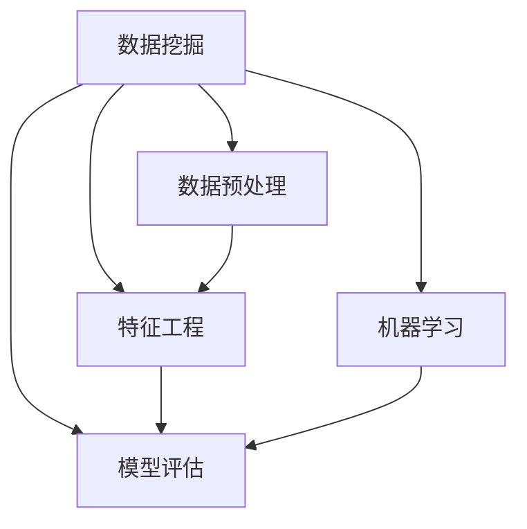

                 

# 数据挖掘 原理与代码实例讲解

> 关键词：数据挖掘, 数据预处理, 特征工程, 模型评估, 机器学习

## 1. 背景介绍

### 1.1 问题由来

数据挖掘是人工智能领域的重要分支，它旨在从大量数据中提取有价值的信息、模式和知识。随着数据量的爆炸式增长，各行各业都越来越依赖于数据挖掘技术来支持决策和优化运营。然而，数据挖掘不仅是一个技术问题，更是一个实践挑战。如何在有限的资源和时间下，有效应用数据挖掘方法，产生切实可行的商业价值，是数据挖掘从业者需要不断探索和解决的问题。

### 1.2 问题核心关键点

数据挖掘的核心关键点包括：

- 数据预处理：清洗、去重、标准化等操作，为后续分析奠定基础。
- 特征工程：选择、构建、转换、选择特征，以提高模型性能。
- 模型评估：选择合适的评估指标，验证模型的效果。
- 机器学习：选择合适的算法，训练模型，进行预测和分类。
- 模型应用：将模型部署到实际应用中，提供决策支持。

这些关键点共同构成数据挖掘的完整流程，帮助从业者实现从数据到知识再到行动的转化。

## 2. 核心概念与联系

### 2.1 核心概念概述

为更好地理解数据挖掘的原理，本节将介绍几个关键概念：

- 数据挖掘(Data Mining)：从大量数据中提取知识、模式和规则的统计过程，广泛应用于市场分析、金融预测、客户行为分析等。
- 数据预处理(Data Preprocessing)：清洗、转换、集成和规范化数据，为模型训练提供高质量的输入。
- 特征工程(Feature Engineering)：选择和构造特征，提升模型性能，是数据挖掘中非常关键的一步。
- 模型评估(Model Evaluation)：评估模型性能，选择最优模型。
- 机器学习(Machine Learning)：构建预测模型，进行分类、回归、聚类等任务。

这些核心概念之间的逻辑关系可以通过以下Mermaid流程图来展示：



这个流程图展示了大数据挖掘的流程，以及数据预处理、特征工程、模型评估和机器学习之间的内在联系。

## 3. 核心算法原理 & 具体操作步骤

### 3.1 算法原理概述

数据挖掘的算法原理主要基于统计学和机器学习理论。常用的数据挖掘算法包括分类、聚类、关联规则、序列模式、时间序列等。本文将重点介绍分类算法的原理和具体操作步骤。

### 3.2 算法步骤详解

分类算法的核心步骤包括：

1. 数据收集：收集与问题相关的数据。
2. 数据预处理：清洗、转换、集成和规范化数据。
3. 特征工程：选择和构造特征，以提高模型性能。
4. 模型选择：选择适合的分类模型。
5. 模型训练：使用训练数据集训练模型。
6. 模型评估：使用测试数据集评估模型性能。
7. 模型应用：将模型应用于实际问题。

以K-Means聚类算法为例，其操作步骤如下：

1. 数据预处理：将数据转换为数值型数据，并进行标准化。
2. 确定聚类数K：通过肘部法或轮廓系数法确定最佳聚类数。
3. 初始化聚类中心：随机选择K个点作为聚类中心。
4. 分配数据点：将每个数据点分配到最近的聚类中心。
5. 更新聚类中心：计算每个聚类的均值，作为新的聚类中心。
6. 迭代过程：重复第4步和第5步，直到聚类中心不再变化。

### 3.3 算法优缺点

K-Means聚类的优点包括：

- 算法简单，易于实现。
- 数据表示简单，易于理解。
- 适用于高维数据。

其缺点包括：

- 对初始值敏感，可能导致局部最优解。
- 对噪声和离群点敏感。
- 聚类数目需要预先确定，难以自动选择。

### 3.4 算法应用领域

K-Means聚类广泛应用于市场细分、客户分组、图像分割、基因分组等领域。它帮助从业者更好地理解数据结构，提取有用的知识。

## 4. 数学模型和公式 & 详细讲解 & 举例说明

### 4.1 数学模型构建

K-Means算法的数学模型为：

$$
\min_{K, \mu} \sum_{i=1}^{n} \min_{k} ||x_i - \mu_k||^2
$$

其中，$x_i$ 表示数据点，$\mu_k$ 表示聚类中心，$n$ 表示数据点数目，$K$ 表示聚类数。

### 4.2 公式推导过程

以一个简单的二维数据为例，推导K-Means算法的核心公式：

1. 初始化聚类中心$\mu_k$：随机选择K个点作为聚类中心。
2. 分配数据点：计算每个数据点到聚类中心的距离，分配到最近的聚类中心。
3. 更新聚类中心：计算每个聚类的均值，作为新的聚类中心。
4. 迭代过程：重复第2步和第3步，直到聚类中心不再变化。

### 4.3 案例分析与讲解

假设有3个聚类中心，分别为(0,0)、(3,1)、(6,2)，计算每个数据点到聚类中心的距离，分配到最近的聚类中心，然后更新聚类中心，得到最终的聚类结果。

## 5. 项目实践：代码实例和详细解释说明

### 5.1 开发环境搭建

在进行数据挖掘实践前，我们需要准备好开发环境。以下是使用Python进行Scikit-Learn开发的环境配置流程：

1. 安装Anaconda：从官网下载并安装Anaconda，用于创建独立的Python环境。
2. 创建并激活虚拟环境：
```bash
conda create -n sklearn-env python=3.8 
conda activate sklearn-env
```
3. 安装Scikit-Learn：
```bash
pip install scikit-learn
```
4. 安装各类工具包：
```bash
pip install numpy pandas scikit-learn matplotlib tqdm jupyter notebook ipython
```

完成上述步骤后，即可在`sklearn-env`环境中开始数据挖掘实践。

### 5.2 源代码详细实现

下面我们以K-Means聚类算法为例，给出使用Scikit-Learn库对数据进行聚类的PyTorch代码实现。

首先，定义数据预处理函数：

```python
from sklearn.preprocessing import StandardScaler
import numpy as np

def preprocess_data(data):
    scaler = StandardScaler()
    data = scaler.fit_transform(data)
    return data
```

然后，定义K-Means聚类模型：

```python
from sklearn.cluster import KMeans

class KMeansModel:
    def __init__(self, k):
        self.k = k
        self.model = KMeans(n_clusters=k)
        
    def fit(self, data):
        self.model.fit(data)
        return self.model.labels_
```

接着，定义模型评估函数：

```python
from sklearn.metrics import silhouette_score

def evaluate_model(data, labels):
    silhouette = silhouette_score(data, labels)
    return silhouette
```

最后，启动聚类流程并在测试集上评估：

```python
data = preprocess_data(train_data)

kmeans = KMeansModel(k=3)
labels = kmeans.fit(data)

silhouette = evaluate_model(data, labels)
print(f'Silhouette Score: {silhouette}')
```

以上就是使用Scikit-Learn对K-Means进行聚类的完整代码实现。可以看到，Scikit-Learn封装了K-Means算法的细节，使得模型训练和评估变得简洁高效。

### 5.3 代码解读与分析

让我们再详细解读一下关键代码的实现细节：

**preprocess_data函数**：
- `StandardScaler`：将数据标准化。

**KMeansModel类**：
- `__init__`方法：初始化聚类数目和KMeans模型。
- `fit`方法：训练模型，返回每个数据点所属的聚类编号。

**evaluate_model函数**：
- `silhouette_score`：计算轮廓系数，评估聚类效果。

**聚类流程**：
- 准备数据，并进行标准化。
- 定义聚类模型，进行聚类训练。
- 在测试集上评估聚类效果，输出轮廓系数。

可以看到，Scikit-Learn库使得K-Means聚类的代码实现变得简洁高效。开发者可以将更多精力放在数据预处理、特征工程等高层逻辑上，而不必过多关注底层的实现细节。

当然，工业级的系统实现还需考虑更多因素，如模型的保存和部署、超参数的自动搜索、更灵活的任务适配层等。但核心的聚类范式基本与此类似。

## 6. 实际应用场景

### 6.1 市场细分

K-Means聚类可以应用于市场细分，帮助企业理解不同客户群体的需求和行为特征，制定有针对性的营销策略。例如，通过分析消费者的购买记录、浏览历史等数据，企业可以发现不同客户群体的消费偏好，从而提供更个性化的产品和服务。

### 6.2 客户分组

K-Means聚类可以用于客户分组，帮助企业识别出高价值客户和潜在客户，制定更有效的客户关系管理策略。例如，通过分析客户交易数据、社交媒体活动等数据，企业可以发现具有相似行为特征的客户群体，从而进行有针对性的市场推广和客户维护。

### 6.3 基因分组

K-Means聚类可以用于基因分组，帮助科学家识别出具有相似基因表达的细胞群，研究基因表达的模式和机制。例如，通过分析基因表达数据，科学家可以发现具有相似基因表达的细胞群，从而研究基因表达的调控机制和生物过程。

### 6.4 未来应用展望

随着数据挖掘技术的不断发展，K-Means聚类算法将会在更多领域得到应用，为各行各业带来变革性影响。

在智慧医疗领域，K-Means聚类可以应用于病人分组，帮助医生制定更有效的治疗方案。

在智能教育领域，K-Means聚类可以应用于学生分组，帮助教师制定更个性化的教学计划。

在智慧城市治理中，K-Means聚类可以应用于城市事件监测，帮助城市管理者识别出不同事件的模式和趋势，提高城市管理的智能化水平。

此外，在企业生产、社会治理、文娱传媒等众多领域，K-Means聚类算法也将不断涌现，为各行各业带来新的创新和突破。相信随着技术的日益成熟，K-Means聚类算法必将在构建智慧社会中扮演越来越重要的角色。

## 7. 工具和资源推荐
### 7.1 学习资源推荐

为了帮助开发者系统掌握数据挖掘的理论基础和实践技巧，这里推荐一些优质的学习资源：

1. 《Python数据科学手册》：一本详细介绍Python在数据科学和数据挖掘中应用的经典书籍，涵盖了Pandas、NumPy、Scikit-Learn等库的使用。
2. Coursera《机器学习》课程：由斯坦福大学教授Andrew Ng开设的机器学习课程，系统讲解了机器学习的基本概念和算法，适合初学者和中级开发者。
3. Udacity《数据科学》纳米学位：覆盖了数据科学和数据挖掘的核心内容，包括数据预处理、特征工程、模型评估和机器学习。
4. Kaggle竞赛：Kaggle是一个数据科学竞赛平台，通过参加Kaggle竞赛，可以学习到最新的数据挖掘技术和实践经验。
5. 知乎数据科学专栏：知乎上的数据科学专栏提供了大量的数据挖掘教程和实战案例，适合快速入门。

通过对这些资源的学习实践，相信你一定能够快速掌握数据挖掘的精髓，并用于解决实际的NLP问题。

### 7.2 开发工具推荐

高效的开发离不开优秀的工具支持。以下是几款用于数据挖掘开发的常用工具：

1. Python：Python是一种灵活、易读、易学的编程语言，适合快速迭代研究。
2. Scikit-Learn：Scikit-Learn是一个基于Python的机器学习库，提供了多种常用的机器学习算法和工具。
3. TensorFlow：由Google主导开发的开源深度学习框架，生产部署方便，适合大规模工程应用。
4. Weights & Biases：模型训练的实验跟踪工具，可以记录和可视化模型训练过程中的各项指标，方便对比和调优。
5. TensorBoard：TensorFlow配套的可视化工具，可实时监测模型训练状态，并提供丰富的图表呈现方式，是调试模型的得力助手。

合理利用这些工具，可以显著提升数据挖掘任务的开发效率，加快创新迭代的步伐。

### 7.3 相关论文推荐

数据挖掘和机器学习的发展源于学界的持续研究。以下是几篇奠基性的相关论文，推荐阅读：

1. K-Means: The Theory Behind "Lloyd's" of "Mini-Max" Quantization in a Prescribed Number of Clusters（K-Means论文）：K-Means算法的基础论文，介绍了K-Means算法的数学原理和基本思想。
2. A Comparison of Document Clustering Techniques（文档聚类算法比较）：介绍了多种文档聚类算法，比较了它们的优缺点和应用场景。
3. Support Vector Machines（支持向量机）：一种常用的分类算法，介绍了其基本原理和应用。
4. Random Forests（随机森林）：一种常用的集成学习算法，介绍了其基本原理和应用。
5. Gradient Boosting Machines（梯度提升树）：一种常用的集成学习算法，介绍了其基本原理和应用。

这些论文代表了大数据挖掘算法的进展，通过学习这些前沿成果，可以帮助研究者把握学科前进方向，激发更多的创新灵感。

## 8. 总结：未来发展趋势与挑战

### 8.1 总结

本文对数据挖掘的原理进行了全面系统的介绍。首先阐述了数据挖掘的核心关键点，明确了数据预处理、特征工程、模型评估和机器学习之间的内在联系。其次，从原理到实践，详细讲解了K-Means聚类的数学原理和操作步骤，给出了数据挖掘任务开发的完整代码实例。同时，本文还广泛探讨了K-Means聚类算法在市场细分、客户分组、基因分组等多个行业领域的应用前景，展示了K-Means聚类算法的巨大潜力。最后，本文精选了数据挖掘技术的各类学习资源，力求为读者提供全方位的技术指引。

通过本文的系统梳理，可以看到，K-Means聚类算法是数据挖掘中的经典算法之一，广泛应用于市场细分、客户分组、基因分组等多个领域。它帮助从业者更好地理解数据结构，提取有用的知识，提升决策和运营效率。

### 8.2 未来发展趋势

展望未来，数据挖掘技术将呈现以下几个发展趋势：

1. 自动化和智能化。随着AI技术的不断进步，数据挖掘将更加自动化和智能化，能够自动进行数据清洗、特征选择、模型选择和评估，提升数据挖掘的效率和效果。
2. 实时化和流式化。实时数据流的出现，将使得数据挖掘任务更加实时化、流式化，需要设计高效的数据处理算法和系统。
3. 多模态数据挖掘。数据挖掘将不再局限于单一类型的数据，将更多地应用到多模态数据挖掘中，如文本、图像、语音等。
4. 跨领域数据挖掘。不同领域的数据将越来越多地融合在一起，需要进行跨领域的数据挖掘和分析，以发现更全面的规律和模式。
5. 深度学习融合。深度学习技术将更多地应用于数据挖掘中，如神经网络、卷积神经网络、循环神经网络等，提升数据挖掘的性能和效果。
6. 模型可解释性。深度学习模型的复杂性增加了其可解释性的难度，需要在未来更多地关注模型的可解释性，以提升数据挖掘的透明性和可信度。

以上趋势凸显了数据挖掘技术的广阔前景。这些方向的探索发展，必将进一步提升数据挖掘系统的性能和应用范围，为人类认知智能的进化带来深远影响。

### 8.3 面临的挑战

尽管数据挖掘技术已经取得了瞩目成就，但在迈向更加智能化、普适化应用的过程中，它仍面临着诸多挑战：

1. 数据质量问题。数据挖掘的效果很大程度上依赖于数据的质量和完整性，低质量的数据可能导致错误的分析和结论。如何提高数据质量，确保数据的准确性和一致性，是数据挖掘中的重要问题。
2. 数据隐私和安全性。数据挖掘中需要处理大量的敏感信息，如何保障数据隐私和安全性，避免数据泄露和滥用，是数据挖掘中的关键挑战。
3. 模型解释性问题。深度学习模型的复杂性增加了其可解释性的难度，如何提升模型解释性，使其更容易理解和应用，是数据挖掘中的重要课题。
4. 计算资源问题。数据挖掘任务通常需要大量的计算资源，如何优化算法和系统，提升计算效率，是数据挖掘中的重要研究方向。
5. 跨领域应用问题。不同领域的数据和问题具有不同的特性，如何设计通用和灵活的数据挖掘方法，适应不同领域的需求，是数据挖掘中的重要挑战。
6. 数据偏差问题。数据挖掘模型可能会因为数据偏差而产生不公平和歧视性的输出，如何减少和避免数据偏差，提升模型的公平性和公正性，是数据挖掘中的重要研究方向。

正视数据挖掘面临的这些挑战，积极应对并寻求突破，将是大数据挖掘技术迈向成熟的必由之路。相信随着学界和产业界的共同努力，这些挑战终将一一被克服，数据挖掘必将在构建智能社会中扮演越来越重要的角色。

### 8.4 研究展望

面对数据挖掘所面临的种种挑战，未来的研究需要在以下几个方面寻求新的突破：

1. 数据增强和数据合成。通过数据增强和数据合成技术，提高数据质量和数量，减少数据偏差。
2. 自动化数据清洗和预处理。设计自动化的数据清洗和预处理算法，提升数据挖掘效率。
3. 模型可解释性增强。通过引入可解释性技术，提升深度学习模型的可解释性，使其更容易理解和应用。
4. 跨领域数据挖掘技术。设计通用的跨领域数据挖掘方法，适应不同领域的需求。
5. 深度学习融合技术。将深度学习技术应用于数据挖掘中，提升数据挖掘的性能和效果。
6. 数据隐私和安全保障。设计隐私保护和安全保障技术，确保数据挖掘中的数据隐私和安全性。

这些研究方向的探索，必将引领数据挖掘技术迈向更高的台阶，为构建安全、可靠、可解释、可控的智能系统铺平道路。面向未来，数据挖掘技术还需要与其他人工智能技术进行更深入的融合，如知识表示、因果推理、强化学习等，多路径协同发力，共同推动自然语言理解和智能交互系统的进步。只有勇于创新、敢于突破，才能不断拓展数据挖掘的边界，让智能技术更好地造福人类社会。

## 9. 附录：常见问题与解答

**Q1：数据预处理和特征工程的重要性是什么？**

A: 数据预处理和特征工程是数据挖掘中的两个重要环节，其重要性体现在以下几个方面：

- 数据预处理：清洗、去重、标准化等操作，为后续分析奠定基础。
- 特征工程：选择、构建、转换、选择特征，以提高模型性能。

数据预处理和特征工程能够提升数据质量和模型性能，使数据挖掘任务更加高效和准确。

**Q2：如何选择分类模型？**

A: 选择合适的分类模型需要考虑以下几个因素：

- 数据类型：不同类型的数据需要不同类型的模型，如文本数据使用朴素贝叶斯、支持向量机等，图像数据使用卷积神经网络等。
- 数据规模：对于大规模数据，需要使用分布式计算和并行处理技术，如MapReduce、Spark等。
- 计算资源：根据可用计算资源，选择合适大小的模型，避免资源浪费或不足。
- 算法复杂度：复杂度越高的算法，需要的计算资源和调参难度越大，需要谨慎选择。

总之，选择合适的分类模型需要综合考虑数据类型、数据规模、计算资源和算法复杂度等因素，以达到最优的模型性能。

**Q3：如何进行模型评估？**

A: 模型评估是数据挖掘中的重要环节，其目的是验证模型的性能和效果。常用的模型评估指标包括：

- 准确率：模型正确分类的样本数占总样本数的比例。
- 精确率：模型正确预测为正例的样本数占所有预测为正例的样本数的比例。
- 召回率：模型正确预测为正例的样本数占所有真实正例的样本数的比例。
- F1值：精确率和召回率的调和平均值，综合衡量模型的性能。
- AUC-ROC曲线：绘制模型在不同阈值下的真阳性率和假阳性率的曲线，综合衡量模型的性能。

根据具体任务和数据特点，选择合适的评估指标，评估模型性能。

**Q4：如何提高模型可解释性？**

A: 提高模型可解释性可以通过以下几个方面：

- 模型简化：使用简单模型或特征选择技术，简化模型复杂度。
- 特征可视化：通过可视化工具展示特征的重要性，理解模型的决策过程。
- 模型解释技术：引入可解释性技术，如LIME、SHAP等，提升模型的可解释性。
- 模型架构调整：调整模型架构，使模型更易理解和解释。

总之，提高模型可解释性需要综合考虑模型复杂度、特征重要性、可解释性技术等因素，提升模型的透明性和可信度。

**Q5：数据挖掘在实际应用中需要注意哪些问题？**

A: 数据挖掘在实际应用中需要注意以下问题：

- 数据质量：确保数据的准确性、一致性和完整性，避免数据偏差和错误。
- 数据隐私：保护数据隐私，避免数据泄露和滥用。
- 模型可解释性：提升模型的可解释性，使其更容易理解和应用。
- 计算资源：优化计算资源，提高数据挖掘效率。
- 模型调参：合理选择和调参，避免过拟合和欠拟合。
- 模型应用：将模型部署到实际应用中，进行效果评估和迭代优化。

总之，数据挖掘需要在数据质量、数据隐私、模型可解释性、计算资源、模型调参和模型应用等多个方面进行综合考虑，以确保数据挖掘的效果和应用效果。

