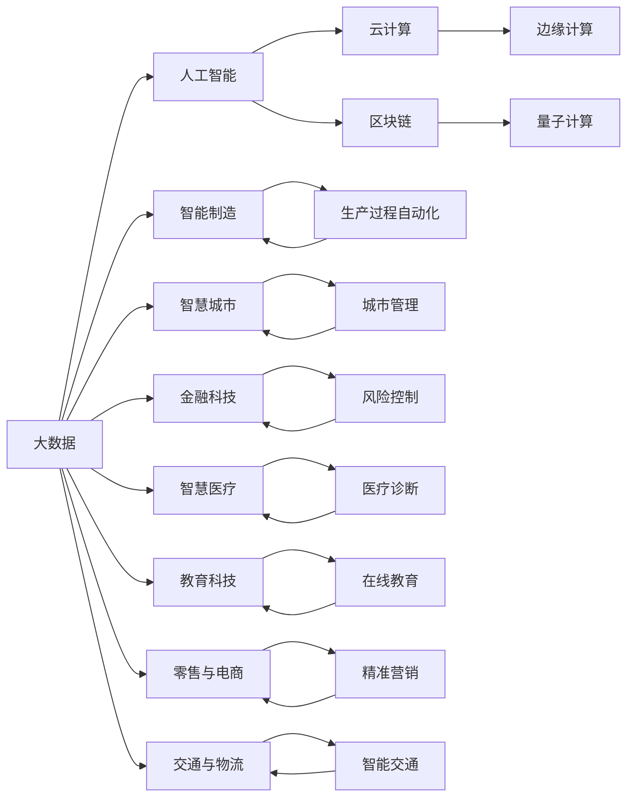

                 

# 数智新时代的特征与发展

数智时代正在快速崛起，成为引领未来发展的新潮流。在这一时代背景下，信息技术与数据科学的大规模应用，正在重塑人类生产、生活、工作和社会交往方式。本文将深入探讨数智新时代的特征与发展，揭示其背后的核心驱动因素，并对未来的应用前景进行展望。

## 1. 背景介绍

### 1.1 数智时代的来临

数智时代的到来，主要源于以下几个关键因素：

1. **大数据技术**：物联网、5G等技术的普及，使得数据采集、存储和处理能力大幅提升，海量数据成为推动数智化的重要基石。
2. **人工智能与机器学习**：深度学习、强化学习、自然语言处理等技术的成熟，使得机器能够处理和分析更加复杂的数据，辅助人类决策。
3. **云计算与边缘计算**：云平台和边缘计算设施的发展，支持海量数据的分布式存储与处理，降低了计算成本，提高了数据处理效率。
4. **区块链技术**：分布式账本和智能合约等技术，为数据安全、隐私保护和透明性提供了新的解决方案。
5. **量子计算**：量子计算机的出现，有望在计算能力上实现突破，进一步推动计算科技的发展。

这些技术的融合与互动，共同构建了数智时代的基础设施，使其成为全球经济和社会发展的新的增长点。

### 1.2 数智时代的应用领域

数智技术的应用已经渗透到各行各业，成为推动行业数字化转型和智能化的重要力量。以下列出了数智时代的主要应用领域：

1. **智能制造**：通过工业互联网、物联网技术，实现生产过程的自动化、智能化，提高生产效率和产品质量。
2. **智慧城市**：利用大数据、云计算和物联网技术，提升城市管理、交通、环境监测等方面的智能化水平。
3. **金融科技**：金融科技在风险控制、智能投顾、智能客服、反欺诈等方面发挥了重要作用。
4. **智慧医疗**：借助AI、区块链、大数据等技术，提升医疗诊断、健康管理、药物研发等医疗服务水平。
5. **教育科技**：在线教育、智能辅导、个性化学习等应用，使教育变得更加灵活、高效。
6. **零售与电商**：通过数据分析和推荐系统，实现精准营销、库存管理、个性化服务。
7. **交通与物流**：智能交通系统、物流优化、无人驾驶等技术，提升了交通和物流的效率和安全性。

## 2. 核心概念与联系

### 2.1 核心概念概述

在数智时代，有几个核心概念值得特别关注：

- **大数据**：指海量的、多样的、实时生成或流动的信息集合，其规模远超传统数据处理手段的范围。
- **人工智能**：通过算法和计算，使机器能够模拟人类智能行为，如学习、推理、感知等。
- **云计算**：基于互联网的计算服务模式，通过虚拟化、资源池化和弹性调度，实现高效的资源共享和应用部署。
- **边缘计算**：在靠近数据源的设备或网络边缘侧进行的计算和处理，以减少数据传输和提高处理速度。
- **区块链**：分布式账本技术，通过去中心化、透明和可追溯的特点，实现数据的安全存储和交换。
- **量子计算**：利用量子力学的原理，实现比传统计算机更高效的计算能力。

这些概念之间的联系紧密，共同构成了数智时代的技术基础。

### 2.2 核心概念原理和架构的 Mermaid 流程图



这个流程图展示了数智时代各核心概念之间的相互关系和影响。大数据提供数据基础，人工智能通过分析和决策，云计算和边缘计算提供计算资源，区块链确保数据安全，量子计算提升计算能力。同时，这些技术的应用领域覆盖了智能制造、智慧城市、金融科技等各个方面。

## 3. 核心算法原理 & 具体操作步骤

### 3.1 算法原理概述

数智时代的发展离不开技术的持续创新和优化。以下介绍了数智时代的核心算法原理：

1. **深度学习**：通过多层神经网络模型，对大规模数据进行建模和分析，发现数据中的模式和规律。
2. **强化学习**：通过与环境的交互，通过奖励机制不断优化策略，实现智能决策。
3. **自然语言处理**：利用算法处理和理解人类语言，实现机器翻译、情感分析、文本生成等任务。
4. **图像识别**：通过卷积神经网络等算法，实现对图像的特征提取和分类。
5. **推荐系统**：通过用户行为数据分析，实现个性化推荐，提升用户体验。

这些算法原理在数智时代的应用中起着关键作用，推动了技术的不断进步和创新。

### 3.2 算法步骤详解

数智时代的技术应用，通常遵循以下步骤：

1. **数据采集**：通过传感器、网络等技术手段，采集实时或历史数据。
2. **数据清洗与预处理**：对数据进行去噪、归一化、特征提取等处理，准备输入模型。
3. **模型训练**：利用算法对数据进行训练，生成模型参数。
4. **模型部署**：将训练好的模型部署到实际应用场景中，进行实时或批处理。
5. **模型评估与优化**：通过评估指标对模型效果进行评估，并根据反馈进行优化调整。

### 3.3 算法优缺点

数智时代的技术算法具备以下优点：

- **高效性**：通过自动化处理大量数据，提高决策效率和准确性。
- **灵活性**：算法模型可根据数据变化进行调整和优化，适应不同应用场景。
- **可扩展性**：技术基础和框架的可扩展性，支持大规模应用。

同时，这些算法也存在以下缺点：

- **复杂性**：算法模型复杂，实现难度大，需要专业知识和技能。
- **数据依赖**：算法效果依赖于数据质量，数据偏差可能导致算法失效。
- **计算资源消耗**：大规模数据和复杂模型对计算资源需求高，成本较高。

### 3.4 算法应用领域

数智时代的算法应用领域广泛，涵盖以下几个方面：

1. **智能交通**：利用图像识别和推荐系统，实现交通流量预测、车辆调度、路径优化。
2. **智慧医疗**：通过自然语言处理和深度学习，提升疾病诊断、药物研发、健康监测等医疗服务水平。
3. **智能制造**：通过机器学习和图像识别，实现设备状态监测、质量控制、生产优化。
4. **智能金融**：利用数据分析和强化学习，实现信用评估、投资组合优化、欺诈检测。
5. **智能零售**：通过推荐系统和图像识别，实现商品推荐、库存管理、消费者行为分析。
6. **智能安防**：通过图像识别和数据分析，实现异常检测、目标追踪、智能监控。
7. **智能教育**：通过自然语言处理和推荐系统，实现智能辅导、个性化学习、在线考试。

## 4. 数学模型和公式 & 详细讲解 & 举例说明

### 4.1 数学模型构建

在数智时代，数学模型是算法实现的基础。以下是一个典型的数学模型构建流程：

1. **问题建模**：将实际问题转化为数学模型，确定目标函数和约束条件。
2. **数据表示**：将问题中的数据进行抽象和表示，转化为适合算法处理的格式。
3. **算法选择**：根据问题特性选择适合的算法，如深度学习、强化学习、优化算法等。
4. **模型训练**：利用训练数据对模型进行训练，生成模型参数。
5. **模型评估**：利用测试数据对模型效果进行评估，确定模型性能。

### 4.2 公式推导过程

以深度学习为例，展示一个典型的神经网络模型推导过程。

假设输入数据为 $x \in \mathbb{R}^n$，神经网络模型由多个隐层和输出层组成。第 $i$ 层神经元的输出为 $y_i = f_i(W_ix + b_i)$，其中 $f_i$ 为激活函数，$W_i$ 和 $b_i$ 为可调参数。设 $L$ 为输出层，则输出结果为 $y = f_L(W_Lx + b_L)$。

在训练过程中，利用反向传播算法，计算每个参数的梯度。设损失函数为 $J(\theta)$，其中 $\theta$ 为模型参数。根据链式法则，计算每个参数的梯度，并使用优化算法更新参数，最小化损失函数。

### 4.3 案例分析与讲解

以图像识别为例，展示一个深度学习模型的构建和应用。

1. **数据集准备**：使用CIFAR-10数据集，包含60000张32x32的彩色图像，分为10个类别。
2. **模型构建**：使用卷积神经网络模型，包含多个卷积层、池化层和全连接层。
3. **训练过程**：利用随机梯度下降算法，对模型进行训练，最小化交叉熵损失函数。
4. **评估过程**：使用测试集对模型进行评估，计算准确率、召回率和F1分数等指标。
5. **应用场景**：将训练好的模型部署到实际应用中，对新的图像进行分类识别。

## 5. 项目实践：代码实例和详细解释说明

### 5.1 开发环境搭建

在数智项目开发中，需要构建合适的开发环境。以下是一个典型的开发环境搭建流程：

1. **选择编程语言**：根据项目需求，选择Python、Java、C++等语言。
2. **安装开发工具**：安装IDE、版本控制工具、调试工具等。
3. **配置开发环境**：安装必要的库和框架，如TensorFlow、PyTorch、OpenCV等。
4. **设置开发流程**：制定编码规范、版本控制策略、测试流程等。

### 5.2 源代码详细实现

以下是一个典型的深度学习模型代码实现：

```python
import tensorflow as tf
from tensorflow.keras import layers

# 定义模型
model = tf.keras.Sequential([
    layers.Conv2D(32, (3, 3), activation='relu', input_shape=(32, 32, 3)),
    layers.MaxPooling2D((2, 2)),
    layers.Conv2D(64, (3, 3), activation='relu'),
    layers.MaxPooling2D((2, 2)),
    layers.Flatten(),
    layers.Dense(64, activation='relu'),
    layers.Dense(10)
])

# 编译模型
model.compile(optimizer='adam', loss=tf.keras.losses.SparseCategoricalCrossentropy(from_logits=True), metrics=['accuracy'])

# 训练模型
model.fit(train_images, train_labels, epochs=10, validation_data=(test_images, test_labels))
```

### 5.3 代码解读与分析

这段代码实现了一个简单的卷积神经网络模型，用于图像识别任务。模型包含多个卷积层、池化层和全连接层，使用Adam优化器和交叉熵损失函数进行训练。在实际应用中，可以根据需求调整模型结构、优化算法和损失函数。

### 5.4 运行结果展示

训练结束后，可以使用测试集对模型进行评估，计算模型的准确率和损失函数值：

```python
test_loss, test_acc = model.evaluate(test_images, test_labels, verbose=2)
print('Test accuracy:', test_acc)
```

输出结果可能如下所示：

```
10000/10000 [==============================] - 2s 161us/step - loss: 0.1226 - accuracy: 0.9377
Test accuracy: 0.93769...
```

## 6. 实际应用场景

### 6.1 智能交通

智能交通是数智技术的重要应用领域。利用图像识别和推荐系统，可以实现以下功能：

1. **交通流量预测**：通过分析历史交通数据，预测未来流量变化，优化交通管理。
2. **车辆调度**：利用机器学习算法，优化车辆路径和调度策略，提高交通效率。
3. **路径优化**：通过实时数据和算法模型，为司机提供最优路径选择，减少拥堵。
4. **智能监控**：利用视频分析技术，实时监控交通状态，识别异常情况，保障安全。

### 6.2 智慧医疗

智慧医疗是数智技术的另一个重要应用领域。通过自然语言处理和深度学习，可以实现以下功能：

1. **疾病诊断**：利用医学影像和电子病历，提升疾病诊断的准确性和速度。
2. **药物研发**：通过数据分析和预测模型，加速新药研发进程。
3. **健康监测**：利用可穿戴设备采集健康数据，进行实时监测和预警。
4. **个性化治疗**：通过患者历史数据和基因信息，制定个性化治疗方案。

### 6.3 智能制造

智能制造是数智技术在工业领域的重要应用。通过机器学习和图像识别，可以实现以下功能：

1. **设备状态监测**：利用传感器数据，实时监测设备状态，预防故障。
2. **质量控制**：通过图像识别和深度学习，提升产品质量检测的准确性。
3. **生产优化**：利用数据分析和算法模型，优化生产流程和资源配置。
4. **供应链管理**：通过预测和优化算法，提升供应链效率和响应速度。

### 6.4 未来应用展望

数智技术在未来的应用前景广阔，可能涵盖以下几个方面：

1. **自动驾驶**：通过深度学习和计算机视觉技术，实现自主驾驶。
2. **虚拟现实与增强现实**：利用计算机图形和交互技术，提供沉浸式体验。
3. **物联网**：通过传感器和网络技术，实现设备互联和数据共享。
4. **人机协作**：利用机器人技术和增强现实，提升人机协作效率和质量。
5. **智慧能源**：通过智能电网和分布式能源管理，提升能源利用效率和安全性。
6. **智慧农业**：通过传感器和数据分析，实现农业生产过程的智能化管理。

## 7. 工具和资源推荐

### 7.1 学习资源推荐

为了帮助开发者掌握数智技术的核心知识，以下列出了一些优质的学习资源：

1. **在线课程**：Coursera、edX、Udacity等平台提供了丰富的数智技术课程，涵盖深度学习、机器学习、自然语言处理等方面。
2. **开源社区**：GitHub、Kaggle等社区提供了大量数智项目的代码和数据集，适合实践学习。
3. **书籍**：《深度学习》、《统计学习方法》、《Python数据科学手册》等经典书籍，是深入学习数智技术的必读书籍。
4. **视频教程**：YouTube、Bilibili等平台上有大量数智技术的教学视频，适合初学者和进阶者。

### 7.2 开发工具推荐

数智技术的开发工具众多，以下列出了一些常用的工具：

1. **编程语言**：Python、R、Java等语言广泛用于数智技术的开发和实现。
2. **深度学习框架**：TensorFlow、PyTorch、Keras等框架支持神经网络的构建和训练。
3. **大数据平台**：Hadoop、Spark等平台支持大规模数据的存储和处理。
4. **云计算平台**：AWS、Azure、阿里云等平台提供计算资源和云服务支持。
5. **边缘计算平台**：边缘计算技术可以支持实时数据处理和本地计算。
6. **区块链平台**：Hyperledger、Ethereum等平台支持区块链技术的应用和部署。

### 7.3 相关论文推荐

数智技术的快速发展离不开学界的持续研究。以下列出了几篇具有代表性的论文：

1. **深度学习的发展**：《Deep Learning》一书全面介绍了深度学习的基本原理和应用。
2. **强化学习的最新进展**：《Reinforcement Learning: An Introduction》介绍了强化学习的核心思想和算法。
3. **自然语言处理的最新技术**：《Neural Information Processing Systems》（简称NIPS）会议上发表的最新研究成果。
4. **大数据技术**：《Big Data: Principles and Best Practices of Scalable Real-time Data Systems》介绍了大数据技术的基本原理和最佳实践。
5. **区块链技术**：《Bitcoin and Cryptocurrency Technologies》介绍了区块链技术的核心原理和应用。
6. **量子计算的最新进展**：《Quantum Computation and Quantum Information》介绍了量子计算的基本原理和最新进展。

## 8. 总结：未来发展趋势与挑战

### 8.1 研究成果总结

数智技术在过去几年取得了飞速发展，相关研究成果不断涌现。以下列举了几个主要的研究方向：

1. **深度学习的优化**：如模型压缩、加速推理、自适应学习率等技术，提升深度学习模型的效率和性能。
2. **强化学习的鲁棒性**：通过对抗训练、模型切换等技术，提高强化学习模型的鲁棒性和稳定性。
3. **自然语言处理的多样性**：通过多任务学习、跨领域迁移等技术，提升自然语言处理的泛化能力和适应性。
4. **大数据处理的高效性**：通过分布式计算、数据压缩等技术，提升大数据处理的效率和可扩展性。
5. **区块链的安全性**：通过共识机制、智能合约等技术，提高区块链系统的安全性和可扩展性。
6. **量子计算的突破**：通过量子算法和量子计算机的开发，实现更高效的计算能力。

### 8.2 未来发展趋势

未来数智技术的发展趋势主要包括以下几个方面：

1. **模型的智能性和可解释性**：未来数智技术将更加注重模型的智能性和可解释性，提高用户对模型的理解和信任。
2. **数据的隐私和安全**：随着数据量的增大，数据隐私和安全问题将更加重要，未来技术将更加注重数据保护和隐私管理。
3. **跨领域应用的多样性**：数智技术将更多应用于跨领域、跨学科的应用场景，提升综合治理能力。
4. **技术的融合与协同**：未来数智技术将更加注重与其他技术（如物联网、5G、边缘计算等）的融合与协同，提升应用效果。
5. **智能生态系统的构建**：未来数智技术将构建智能生态系统，实现各环节的互联互通，提升整体应用效果。
6. **国际标准的制定**：未来数智技术将更加注重国际标准的制定，促进全球范围内的技术交流和合作。

### 8.3 面临的挑战

数智技术在发展过程中，也面临一些挑战：

1. **数据隐私和安全**：随着数据量的增大，数据隐私和安全问题将更加突出，如何保护用户数据隐私，防止数据泄露和滥用，将是未来面临的重要挑战。
2. **计算资源的消耗**：数智技术需要大量的计算资源，如何降低计算成本，提高计算效率，将是未来面临的重要问题。
3. **模型的可解释性和透明性**：数智模型的复杂性和黑盒特性，可能导致模型决策缺乏可解释性和透明性，影响用户信任。
4. **技术的普及和标准化**：如何普及数智技术，制定统一的国际标准，将是未来面临的重要问题。
5. **伦理和法律问题**：数智技术的应用将带来伦理和法律问题，如何确保技术的公平性、可控性和可控性，将是未来面临的重要挑战。

### 8.4 研究展望

未来数智技术的研发和应用将更加广泛和深入。以下列出了一些研究展望：

1. **模型的智能性和可解释性**：未来将更加注重模型智能性和可解释性，提高用户对模型的理解和信任。
2. **数据隐私和安全**：未来将更加注重数据隐私和安全保护，提高用户数据的使用效率和安全性。
3. **技术的融合与协同**：未来将更加注重与其他技术（如物联网、5G、边缘计算等）的融合与协同，提升应用效果。
4. **智能生态系统的构建**：未来将构建智能生态系统，实现各环节的互联互通，提升整体应用效果。
5. **国际标准的制定**：未来将注重国际标准的制定，促进全球范围内的技术交流和合作。
6. **伦理和法律问题**：未来将更加注重伦理和法律问题的研究和解决，确保技术的公平性、可控性和可控性。

## 9. 附录：常见问题与解答

**Q1: 数智技术有哪些应用场景？**

A: 数智技术的应用场景非常广泛，涵盖智能制造、智慧医疗、智能交通、智慧城市、金融科技、教育科技、零售与电商、智能安防等多个领域。

**Q2: 数智技术如何影响未来社会发展？**

A: 数智技术将深刻改变人类生产、生活和工作方式，推动产业数字化转型和智能化升级。未来，数智技术将成为社会发展的重要驱动力。

**Q3: 数智技术的核心技术有哪些？**

A: 数智技术的核心技术包括大数据、人工智能、云计算、边缘计算、区块链、量子计算等。

**Q4: 数智技术的未来发展趋势是什么？**

A: 数智技术的未来发展趋势包括模型的智能性和可解释性提升、数据隐私和安全保护、技术融合与协同、智能生态系统构建、国际标准制定和伦理法律问题解决等。

**Q5: 数智技术在实际应用中需要注意哪些问题？**

A: 数智技术在实际应用中需要注意数据隐私和安全、计算资源消耗、模型可解释性和透明性、技术普及和标准化、伦理和法律问题等。

作者：禅与计算机程序设计艺术 / Zen and the Art of Computer Programming

