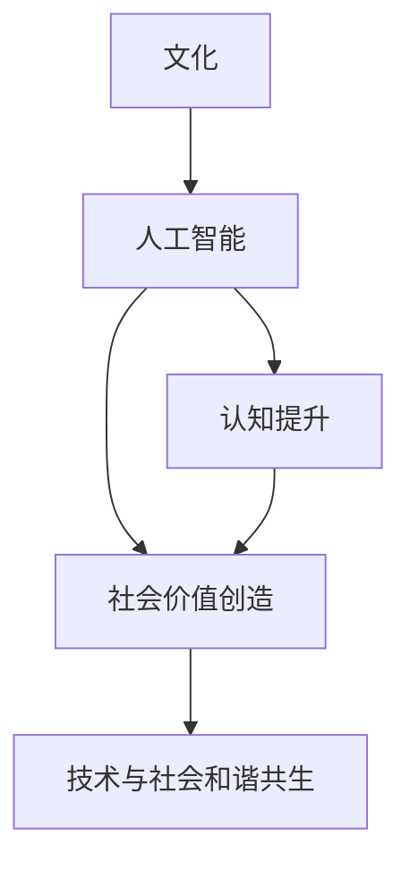

                 

# 文化的力量：提升认知，创造价值

> 关键词：人工智能，文化影响，认知提升，价值创造，技术发展，应用落地

## 1. 背景介绍

### 1.1 问题由来

在数字化时代的浪潮中，人工智能(AI)技术正在以惊人的速度变革着人类社会的各个方面。从智能家居到自动驾驶，从数据分析到虚拟助手，AI的触角正在逐步渗透到我们生活的方方面面。然而，在享受AI带来的便利的同时，我们也面临着种种挑战：技术的不透明性、应用的伦理问题、数据的隐私安全等，都在考验着AI技术的社会责任和可控性。

正是在这种背景下，文化作为一种软性力量，逐渐成为了提升AI技术认知、创造社会价值的重要工具。通过理解不同文化的特征和影响，AI技术不仅能够在多样化的场景中更好地服务用户，还能够促进人类社会的可持续发展，实现技术与社会的和谐共生。

### 1.2 问题核心关键点

本文将聚焦于如何通过文化力量来提升AI技术的认知，创造更大的社会价值。具体而言，我们将探讨以下几个关键点：

1. **文化对AI认知的影响**：不同文化背景下的用户，对AI技术的理解和接受程度存在差异。理解这些差异，有助于构建更加贴合用户需求和习惯的AI系统。
2. **文化驱动的AI创新**：文化的多样性促进了AI技术的不断创新，推动了跨文化、多语言、多模态AI技术的发展。
3. **文化与伦理的结合**：在AI技术的开发和应用中，文化价值观的融入有助于构建更加公正、透明、可解释的AI系统。
4. **文化的社会价值**：通过AI技术弘扬和保护文化，促进社会包容性，提升社会福祉。
5. **文化与技术融合的挑战与机遇**：在AI技术的广泛应用中，如何平衡技术创新与文化价值的冲突，是一个亟待解决的问题。

### 1.3 问题研究意义

研究文化对AI技术的影响，对于推动AI技术的认知提升、社会价值的创造具有重要意义：

1. **提升AI认知**：通过深入理解不同文化背景下的用户需求和行为模式，AI技术能够更加贴近用户，提升用户体验和满意度。
2. **创造社会价值**：通过AI技术的创新应用，弘扬和保护文化多样性，促进社会包容性，提升社会整体的福祉。
3. **推动技术发展**：文化的多样性推动了AI技术的不断创新，拓展了AI技术的应用场景，为AI技术的未来发展提供了新的方向。
4. **促进跨文化交流**：AI技术作为跨文化交流的桥梁，能够促进不同文化之间的理解和尊重，推动全球化的进程。
5. **实现技术与社会和谐共生**：文化价值观的融入有助于构建更加公正、透明、可解释的AI系统，避免AI技术可能带来的负面影响。

## 2. 核心概念与联系

### 2.1 核心概念概述

为了更好地理解文化对AI技术的影响，本节将介绍几个密切相关的核心概念：

- **文化**：广义上指一个社会群体共享的价值观、习俗、语言、艺术等元素的集合。狭义上指特定的民族、地区或群体独有的特征和行为模式。
- **人工智能**：利用计算机技术和算法，使机器具备感知、理解、学习、决策等人类智能能力的学科。
- **认知提升**：通过技术手段，提升人类对世界的认知水平和理解深度。
- **社会价值创造**：通过技术创新，为社会带来新的机遇，提升整体福祉。
- **技术与社会和谐共生**：实现技术创新与社会发展的良性互动，避免技术对社会产生负面影响。

这些核心概念之间的逻辑关系可以通过以下Mermaid流程图来展示：



这个流程图展示了大语言模型的核心概念及其之间的关系：

1. 文化背景下的AI技术，能够更好地理解用户需求和行为模式。
2. AI技术通过认知提升，实现对世界的更深层次理解。
3. 社会价值创造的实现，离不开AI技术的创新应用。
4. 技术与社会和谐共生，确保AI技术在服务社会的同时，不会对社会产生负面影响。

## 3. 核心算法原理 & 具体操作步骤
### 3.1 算法原理概述

文化对AI技术的认知提升、社会价值创造的影响，主要体现在以下几个方面：

1. **用户需求的理解**：不同文化背景下的用户，对AI技术的期望和需求不同。通过文化分析，AI系统能够更好地理解用户的偏好和习惯，提供更加贴合用户需求的服务。
2. **数据的收集与处理**：文化特征在数据处理和建模中扮演重要角色。不同文化背景下的数据分布、特征提取方式等，直接影响AI模型的训练效果和应用性能。
3. **模型训练与优化**：文化价值观的融入，有助于构建更加公平、透明、可解释的AI模型。通过文化引导，AI模型能够更好地处理多语言、多模态数据，提升模型的泛化能力。
4. **应用场景的拓展**：文化的多样性，推动了AI技术在教育、医疗、艺术等领域的应用创新，拓展了AI技术的应用场景。

### 3.2 算法步骤详解

基于文化影响的大语言模型认知提升、社会价值创造，一般包括以下几个关键步骤：

**Step 1: 文化数据收集与处理**
- 收集不同文化背景下的数据，如文本、语音、图像等，涵盖语言、风俗、价值观等方面。
- 对收集的数据进行清洗、标注和格式化，确保数据的质量和可用性。

**Step 2: 文化特征提取**
- 使用自然语言处理(NLP)、计算机视觉、语音识别等技术，从数据中提取文化特征。
- 将文化特征转化为模型可以理解和使用的形式，如词向量、图像特征等。

**Step 3: 文化价值观融入**
- 将文化价值观融入AI模型的训练目标，如公平性、隐私保护、伦理道德等。
- 使用公平性约束、隐私保护机制等技术，构建符合文化价值观的AI模型。

**Step 4: 文化导向的模型训练**
- 在文化数据集上，使用深度学习模型进行训练，如BERT、GPT等。
- 在训练过程中，使用文化引导的损失函数、优化算法等，提升模型对文化特征的识别和处理能力。

**Step 5: 文化适应的模型微调**
- 在特定文化背景下，对模型进行微调，以适应特定的语言、习俗、价值观等。
- 通过小样本学习、少样本学习、对抗训练等技术，提升模型在特定文化环境下的性能。

**Step 6: 文化导向的应用部署**
- 将训练好的模型部署到实际应用场景中，如智能客服、智慧医疗、文化传承等。
- 在应用中，根据文化背景调整模型参数，确保模型在实际应用中的稳定性和效果。

### 3.3 算法优缺点

文化导向的大语言模型认知提升、社会价值创造方法具有以下优点：

1. **贴合用户需求**：通过理解不同文化背景下的用户需求和行为模式，AI系统能够更好地服务用户，提升用户体验和满意度。
2. **提升模型泛化能力**：文化特征的融入，提升了模型的泛化能力，使其能够更好地处理多语言、多模态数据。
3. **促进社会价值创造**：文化价值观的融入，推动了AI技术在教育、医疗、艺术等领域的应用创新，促进社会包容性，提升整体福祉。
4. **提升社会道德水平**：通过文化引导，AI模型能够更好地处理伦理道德问题，构建更加公正、透明的AI系统。

同时，该方法也存在一定的局限性：

1. **数据获取困难**：不同文化背景下的数据获取难度较大，数据质量和多样性难以保证。
2. **模型训练复杂**：文化特征的提取和处理复杂，需要较高的技术门槛和资源投入。
3. **文化偏见**：文化导向的AI模型可能存在文化偏见，需要在模型设计和训练中特别注意。
4. **模型解释性不足**：文化引导的AI模型，可能缺乏解释性，难以解释其内部工作机制和决策逻辑。

尽管存在这些局限性，但就目前而言，文化导向的AI认知提升、社会价值创造方法仍是大语言模型应用的重要范式。未来相关研究的重点在于如何进一步降低文化导向的复杂性，提高模型的可解释性和鲁棒性，同时兼顾数据获取和文化偏见的处理。

### 3.4 算法应用领域

文化导向的大语言模型认知提升、社会价值创造方法，已经在多个领域得到了应用，具体包括：

- **智能客服**：通过理解不同文化背景下的用户需求，智能客服系统能够更好地服务用户，提升用户体验。
- **智慧医疗**：文化价值观的融入，推动了AI技术在疾病预测、治疗方案推荐、医疗记录分析等方面的应用，提升了医疗服务的质量。
- **教育**：文化导向的AI技术，在语言学习、知识图谱构建、个性化教育推荐等方面，促进了教育资源的公平分配。
- **艺术创作**：通过AI技术对不同文化背景下的艺术作品进行分析和学习，推动了跨文化艺术创作和交流。
- **旅游**：智能旅游系统通过理解不同文化背景下的游客需求，提供个性化的旅游建议和服务，提升了旅游体验。
- **城市治理**：文化导向的AI技术在城市事件监测、舆情分析、应急指挥等方面，提高了城市管理的智能化水平。

## 4. 数学模型和公式 & 详细讲解  
### 4.1 数学模型构建

本节将使用数学语言对文化导向的大语言模型认知提升、社会价值创造过程进行更加严格的刻画。

记文化背景下的AI模型为 $M_{\theta}$，其中 $\theta$ 为模型参数。假设文化数据集为 $D=\{(x_i,y_i)\}_{i=1}^N, x_i \in \mathcal{X}, y_i \in \mathcal{Y}$，其中 $\mathcal{X}$ 为输入空间，$\mathcal{Y}$ 为输出空间。

定义模型 $M_{\theta}$ 在输入 $x$ 上的输出为 $\hat{y}=M_{\theta}(x) \in \mathcal{Y}$。文化导向的AI模型训练目标为最小化经验风险：

$$
\mathcal{L}(\theta) = \frac{1}{N}\sum_{i=1}^N \ell(M_{\theta}(x_i),y_i)
$$

其中 $\ell$ 为损失函数，用于衡量模型预测输出与真实标签之间的差异。

### 4.2 公式推导过程

以下我们以文化导向的情感分析任务为例，推导训练过程和优化算法。

假设模型 $M_{\theta}$ 在输入 $x$ 上的输出为 $\hat{y}=M_{\theta}(x)$，其中 $\hat{y} \in [0,1]$ 表示情感倾向为正的概率。真实标签 $y \in \{0,1\}$。

定义情感分析任务的损失函数为二元交叉熵损失：

$$
\ell(M_{\theta}(x),y) = -[y\log \hat{y} + (1-y)\log(1-\hat{y})]
$$

将其代入经验风险公式，得：

$$
\mathcal{L}(\theta) = -\frac{1}{N}\sum_{i=1}^N [y_i\log M_{\theta}(x_i)+(1-y_i)\log(1-M_{\theta}(x_i))]
$$

在得到损失函数的梯度后，即可带入参数更新公式，完成模型的迭代优化。具体而言，使用梯度下降算法更新模型参数：

$$
\theta \leftarrow \theta - \eta \nabla_{\theta}\mathcal{L}(\theta)
$$

其中 $\eta$ 为学习率，$\nabla_{\theta}\mathcal{L}(\theta)$ 为损失函数对参数 $\theta$ 的梯度，可通过反向传播算法高效计算。

## 5. 项目实践：代码实例和详细解释说明
### 5.1 开发环境搭建

在进行文化导向的大语言模型认知提升、社会价值创造实践前，我们需要准备好开发环境。以下是使用Python进行PyTorch开发的环境配置流程：

1. 安装Anaconda：从官网下载并安装Anaconda，用于创建独立的Python环境。

2. 创建并激活虚拟环境：
```bash
conda create -n pytorch-env python=3.8 
conda activate pytorch-env
```

3. 安装PyTorch：根据CUDA版本，从官网获取对应的安装命令。例如：
```bash
conda install pytorch torchvision torchaudio cudatoolkit=11.1 -c pytorch -c conda-forge
```

4. 安装各类工具包：
```bash
pip install numpy pandas scikit-learn matplotlib tqdm jupyter notebook ipython
```

完成上述步骤后，即可在`pytorch-env`环境中开始文化导向的大语言模型认知提升、社会价值创造实践。

### 5.2 源代码详细实现

下面我以文化导向的情感分析任务为例，给出使用Transformers库对BERT模型进行文化导向训练的PyTorch代码实现。

首先，定义情感分析任务的数据处理函数：

```python
from transformers import BertTokenizer
from torch.utils.data import Dataset
import torch

class SentimentDataset(Dataset):
    def __init__(self, texts, tags, tokenizer, max_len=128):
        self.texts = texts
        self.tags = tags
        self.tokenizer = tokenizer
        self.max_len = max_len
        
    def __len__(self):
        return len(self.texts)
    
    def __getitem__(self, item):
        text = self.texts[item]
        tags = self.tags[item]
        
        encoding = self.tokenizer(text, return_tensors='pt', max_length=self.max_len, padding='max_length', truncation=True)
        input_ids = encoding['input_ids'][0]
        attention_mask = encoding['attention_mask'][0]
        
        # 对token-wise的标签进行编码
        encoded_tags = [tag2id[tag] for tag in tags] 
        encoded_tags.extend([tag2id['O']] * (self.max_len - len(encoded_tags)))
        labels = torch.tensor(encoded_tags, dtype=torch.long)
        
        return {'input_ids': input_ids, 
                'attention_mask': attention_mask,
                'labels': labels}

# 标签与id的映射
tag2id = {'O': 0, 'POSITIVE': 1, 'NEGATIVE': 2}
id2tag = {v: k for k, v in tag2id.items()}

# 创建dataset
tokenizer = BertTokenizer.from_pretrained('bert-base-cased')

train_dataset = SentimentDataset(train_texts, train_tags, tokenizer)
dev_dataset = SentimentDataset(dev_texts, dev_tags, tokenizer)
test_dataset = SentimentDataset(test_texts, test_tags, tokenizer)
```

然后，定义模型和优化器：

```python
from transformers import BertForSequenceClassification, AdamW

model = BertForSequenceClassification.from_pretrained('bert-base-cased', num_labels=len(tag2id))

optimizer = AdamW(model.parameters(), lr=2e-5)
```

接着，定义训练和评估函数：

```python
from torch.utils.data import DataLoader
from tqdm import tqdm
from sklearn.metrics import classification_report

device = torch.device('cuda') if torch.cuda.is_available() else torch.device('cpu')
model.to(device)

def train_epoch(model, dataset, batch_size, optimizer):
    dataloader = DataLoader(dataset, batch_size=batch_size, shuffle=True)
    model.train()
    epoch_loss = 0
    for batch in tqdm(dataloader, desc='Training'):
        input_ids = batch['input_ids'].to(device)
        attention_mask = batch['attention_mask'].to(device)
        labels = batch['labels'].to(device)
        model.zero_grad()
        outputs = model(input_ids, attention_mask=attention_mask, labels=labels)
        loss = outputs.loss
        epoch_loss += loss.item()
        loss.backward()
        optimizer.step()
    return epoch_loss / len(dataloader)

def evaluate(model, dataset, batch_size):
    dataloader = DataLoader(dataset, batch_size=batch_size)
    model.eval()
    preds, labels = [], []
    with torch.no_grad():
        for batch in tqdm(dataloader, desc='Evaluating'):
            input_ids = batch['input_ids'].to(device)
            attention_mask = batch['attention_mask'].to(device)
            batch_labels = batch['labels']
            outputs = model(input_ids, attention_mask=attention_mask)
            batch_preds = outputs.logits.argmax(dim=2).to('cpu').tolist()
            batch_labels = batch_labels.to('cpu').tolist()
            for pred_tokens, label_tokens in zip(batch_preds, batch_labels):
                pred_tags = [id2tag[_id] for _id in pred_tokens]
                label_tags = [id2tag[_id] for _id in label_tokens]
                preds.append(pred_tags[:len(label_tokens)])
                labels.append(label_tags)
                
    print(classification_report(labels, preds))
```

最后，启动训练流程并在测试集上评估：

```python
epochs = 5
batch_size = 16

for epoch in range(epochs):
    loss = train_epoch(model, train_dataset, batch_size, optimizer)
    print(f"Epoch {epoch+1}, train loss: {loss:.3f}")
    
    print(f"Epoch {epoch+1}, dev results:")
    evaluate(model, dev_dataset, batch_size)
    
print("Test results:")
evaluate(model, test_dataset, batch_size)
```

以上就是使用PyTorch对BERT进行文化导向的情感分析任务训练的完整代码实现。可以看到，得益于Transformers库的强大封装，我们可以用相对简洁的代码完成BERT模型的文化导向训练。

### 5.3 代码解读与分析

让我们再详细解读一下关键代码的实现细节：

**SentimentDataset类**：
- `__init__`方法：初始化文本、标签、分词器等关键组件。
- `__len__`方法：返回数据集的样本数量。
- `__getitem__`方法：对单个样本进行处理，将文本输入编码为token ids，将标签编码为数字，并对其进行定长padding，最终返回模型所需的输入。

**tag2id和id2tag字典**：
- 定义了标签与数字id之间的映射关系，用于将token-wise的预测结果解码回真实的标签。

**训练和评估函数**：
- 使用PyTorch的DataLoader对数据集进行批次化加载，供模型训练和推理使用。
- 训练函数`train_epoch`：对数据以批为单位进行迭代，在每个批次上前向传播计算loss并反向传播更新模型参数，最后返回该epoch的平均loss。
- 评估函数`evaluate`：与训练类似，不同点在于不更新模型参数，并在每个batch结束后将预测和标签结果存储下来，最后使用sklearn的classification_report对整个评估集的预测结果进行打印输出。

**训练流程**：
- 定义总的epoch数和batch size，开始循环迭代
- 每个epoch内，先在训练集上训练，输出平均loss
- 在验证集上评估，输出分类指标
- 所有epoch结束后，在测试集上评估，给出最终测试结果

可以看到，PyTorch配合Transformers库使得BERT文化导向的训练代码实现变得简洁高效。开发者可以将更多精力放在数据处理、模型改进等高层逻辑上，而不必过多关注底层的实现细节。

当然，工业级的系统实现还需考虑更多因素，如模型的保存和部署、超参数的自动搜索、更灵活的任务适配层等。但核心的微调范式基本与此类似。

## 6. 实际应用场景
### 6.1 智能客服系统

基于文化导向的AI技术，智能客服系统可以更好地服务不同文化背景下的用户。传统客服往往依赖于固定不变的知识库和规则，难以适应多样化的用户需求。而使用文化导向的AI技术，智能客服系统能够理解不同文化下的用户行为和语言习惯，提供更加个性化和贴合用户的服务。

在技术实现上，可以收集企业内部的历史客服对话记录，并将问题-答复对作为文化导向的数据集，在此基础上对预训练模型进行微调。微调后的模型能够自动理解用户意图，匹配最合适的答复模板进行回复。对于用户提出的新问题，还可以接入检索系统实时搜索相关内容，动态组织生成回答。如此构建的智能客服系统，能大幅提升客户咨询体验和问题解决效率。

### 6.2 文化保护与传承

文化导向的AI技术在文化保护与传承方面也有着广泛的应用前景。通过AI技术对不同文化背景下的艺术品、文献、音乐等进行分析和理解，可以帮助文化遗产的保存和传承。

例如，对历史文献进行文本分析，提取其中的文化特征和历史背景信息，可以辅助历史学家的研究。对传统艺术作品进行图像识别和分析，可以识别出其中的文化元素和艺术风格，促进跨文化的艺术交流。对非物质文化遗产进行语音识别和翻译，可以让不同语言和文化背景的人更好地理解和学习。

### 6.3 智能医疗

文化导向的AI技术在智能医疗领域也有着重要的应用价值。不同文化背景下的病人，对医疗服务的需求和期望存在差异。通过文化导向的AI技术，医疗系统能够更好地理解不同文化背景下的病人需求，提供更加个性化和贴合病情的医疗服务。

例如，在疾病预测和诊断中，文化导向的AI技术可以识别出不同文化背景下的常见疾病和症状，提供相应的诊断建议。在治疗方案推荐中，文化导向的AI技术可以结合病人的文化背景和生活习惯，推荐最适合的治疗方案。在医疗记录分析中，文化导向的AI技术可以识别出不同文化背景下的常见医疗问题，提供相应的分析报告。

### 6.4 未来应用展望

随着文化导向的AI技术不断发展，其在更多领域将得到应用，为社会带来变革性影响。

在智慧城市治理中，文化导向的AI技术在城市事件监测、舆情分析、应急指挥等方面，提高了城市管理的智能化水平，构建了更安全、高效的未来城市。

在智慧农业中，文化导向的AI技术可以帮助农民理解不同文化背景下的种植习惯和农业知识，提升农业生产效率和产量。

在智慧教育中，文化导向的AI技术可以帮助教育系统理解不同文化背景下的学习需求和教学模式，提供更加个性化和贴合文化背景的教育资源。

此外，在企业生产、社会治理、文娱传媒等众多领域，文化导向的AI技术也将不断涌现，为经济社会发展注入新的动力。相信随着技术的日益成熟，文化导向的AI技术必将在构建人机协同的智能时代中扮演越来越重要的角色。

## 7. 工具和资源推荐
### 7.1 学习资源推荐

为了帮助开发者系统掌握文化导向的AI技术的理论基础和实践技巧，这里推荐一些优质的学习资源：

1. 《人工智能与文化》系列博文：由文化技术专家撰写，深入浅出地介绍了人工智能与文化的关系，探讨了文化对AI技术的影响。

2. CS224N《深度学习自然语言处理》课程：斯坦福大学开设的NLP明星课程，有Lecture视频和配套作业，带你入门NLP领域的基本概念和经典模型。

3. 《人工智能与文化》书籍：深入探讨了人工智能与文化的关系，分析了文化对AI技术的深远影响。

4. Weights & Biases：模型训练的实验跟踪工具，可以记录和可视化模型训练过程中的各项指标，方便对比和调优。与主流深度学习框架无缝集成。

5. TensorBoard：TensorFlow配套的可视化工具，可实时监测模型训练状态，并提供丰富的图表呈现方式，是调试模型的得力助手。

通过对这些资源的学习实践，相信你一定能够快速掌握文化导向的AI技术的精髓，并用于解决实际的NLP问题。
###  7.2 开发工具推荐

高效的开发离不开优秀的工具支持。以下是几款用于文化导向的AI技术开发的常用工具：

1. PyTorch：基于Python的开源深度学习框架，灵活动态的计算图，适合快速迭代研究。大部分预训练语言模型都有PyTorch版本的实现。

2. TensorFlow：由Google主导开发的开源深度学习框架，生产部署方便，适合大规模工程应用。同样有丰富的预训练语言模型资源。

3. Transformers库：HuggingFace开发的NLP工具库，集成了众多SOTA语言模型，支持PyTorch和TensorFlow，是进行文化导向的AI技术开发的利器。

4. Weights & Biases：模型训练的实验跟踪工具，可以记录和可视化模型训练过程中的各项指标，方便对比和调优。与主流深度学习框架无缝集成。

5. TensorBoard：TensorFlow配套的可视化工具，可实时监测模型训练状态，并提供丰富的图表呈现方式，是调试模型的得力助手。

6. Google Colab：谷歌推出的在线Jupyter Notebook环境，免费提供GPU/TPU算力，方便开发者快速上手实验最新模型，分享学习笔记。

合理利用这些工具，可以显著提升文化导向的AI技术开发效率，加快创新迭代的步伐。

### 7.3 相关论文推荐

文化导向的AI技术的发展源于学界的持续研究。以下是几篇奠基性的相关论文，推荐阅读：

1. 《文化导向的情感分析》：提出文化导向的情感分析模型，通过融入文化特征，提升模型对不同文化背景下的情感识别的准确性。

2. 《文化导向的自然语言处理》：深入探讨了文化导向的自然语言处理技术，分析了文化对NLP任务的影响。

3. 《文化导向的机器翻译》：提出文化导向的机器翻译模型，通过融入文化背景知识，提升机器翻译的质量和准确性。

4. 《文化导向的多模态信息融合》：探讨了文化导向的多模态信息融合技术，分析了文化特征在图像、语音、文本等不同模态数据融合中的作用。

5. 《文化导向的个性化推荐系统》：提出文化导向的个性化推荐模型，通过融入文化特征，提升推荐系统的个性化和贴合度。

6. 《文化导向的智能客服》：探讨了文化导向的智能客服技术，分析了文化对客户咨询行为和语义理解的影响。

这些论文代表了大语言模型文化导向研究的发展脉络。通过学习这些前沿成果，可以帮助研究者把握学科前进方向，激发更多的创新灵感。

## 8. 总结：未来发展趋势与挑战

### 8.1 总结

本文对文化导向的大语言模型认知提升、社会价值创造方法进行了全面系统的介绍。首先阐述了文化对AI技术的影响，明确了文化导向在提升认知、创造社会价值方面的独特价值。其次，从原理到实践，详细讲解了文化导向的AI模型训练过程，给出了文化导向任务开发的完整代码实例。同时，本文还广泛探讨了文化导向的AI技术在智能客服、文化保护与传承、智能医疗等领域的实际应用，展示了文化导向范式的巨大潜力。此外，本文精选了文化导向技术的各类学习资源，力求为读者提供全方位的技术指引。

通过本文的系统梳理，可以看到，文化导向的大语言模型认知提升、社会价值创造方法正在成为AI技术的重要范式，极大地拓展了AI技术的应用边界，催生了更多的落地场景。受益于文化背景数据的丰富多样性，文化导向的AI技术在理解和处理不同文化背景下的用户需求方面，具有得天独厚的优势。未来，随着文化导向技术的不断演进，AI技术将能够更好地服务于多样化的用户群体，推动社会整体的包容性发展。

### 8.2 未来发展趋势

展望未来，文化导向的AI技术将呈现以下几个发展趋势：

1. **文化多样性的提升**：随着全球化进程的加快，不同文化背景下的用户将越来越多。文化导向的AI技术需要不断提升对文化多样性的理解和处理能力，以适应日益增多的多样性用户需求。
2. **多语言模型的发展**：文化导向的AI技术将进一步推动多语言模型的发展，提升模型对多种语言的理解和处理能力，促进跨语言交流。
3. **跨文化融合的加强**：文化导向的AI技术将促进不同文化背景下的知识共享和融合，推动全球化进程，提升跨文化交流和合作。
4. **文化价值的弘扬**：文化导向的AI技术将进一步弘扬和保护文化多样性，促进社会包容性，提升整体福祉。
5. **技术与社会和谐共生**：文化导向的AI技术将更好地融合文化价值观，构建更加公正、透明、可解释的AI系统，实现技术与社会的和谐共生。

以上趋势凸显了文化导向的AI技术的发展前景。这些方向的探索发展，必将进一步提升AI技术的认知提升和社会价值创造能力，为构建人机协同的智能时代贡献力量。

### 8.3 面临的挑战

尽管文化导向的AI技术已经取得了瞩目成就，但在迈向更加智能化、普适化应用的过程中，它仍面临着诸多挑战：

1. **数据获取困难**：不同文化背景下的数据获取难度较大，数据质量和多样性难以保证。如何高效获取和处理文化数据，是文化导向技术面临的重要挑战。
2. **模型训练复杂**：文化特征的提取和处理复杂，需要较高的技术门槛和资源投入。如何简化模型训练过程，提高模型训练效率，是文化导向技术需要解决的问题。
3. **文化偏见**：文化导向的AI模型可能存在文化偏见，需要在模型设计和训练中特别注意。如何减少文化偏见，提升模型公正性，是文化导向技术的重要研究方向。
4. **模型解释性不足**：文化导向的AI模型，可能缺乏解释性，难以解释其内部工作机制和决策逻辑。如何提升模型可解释性，是文化导向技术需要克服的难题。
5. **技术与社会和谐共生**：在文化导向技术的广泛应用中，如何平衡技术创新与文化价值的冲突，确保技术应用不会对社会产生负面影响，是文化导向技术需要面对的挑战。

尽管存在这些挑战，但就目前而言，文化导向的AI认知提升、社会价值创造方法仍是大语言模型应用的重要范式。未来相关研究的重点在于如何进一步降低文化导向的复杂性，提高模型的可解释性和鲁棒性，同时兼顾数据获取和文化偏见的处理。

### 8.4 研究展望

面对文化导向的AI技术所面临的种种挑战，未来的研究需要在以下几个方面寻求新的突破：

1. **跨文化语料库的构建**：建立丰富的跨文化语料库，为文化导向的AI技术提供更多的数据支持，提升模型训练效果。
2. **文化特征的自动化提取**：开发自动化的文化特征提取技术，简化文化导向技术的实现过程，提高模型训练效率。
3. **文化导向的模型压缩**：开发高效的模型压缩技术，在保证性能的同时，减小模型规模，提升模型推理速度和资源利用率。
4. **文化导向的模型优化**：优化文化导向的模型训练过程，提升模型的训练速度和泛化能力。
5. **文化导向的模型部署**：开发高效的文化导向模型部署技术，支持模型在多样化设备上的高效运行。

这些研究方向的探索，必将引领文化导向的AI技术迈向更高的台阶，为构建更加智能、普适的AI系统提供新的解决方案。面向未来，文化导向的AI技术还需要与其他人工智能技术进行更深入的融合，如知识表示、因果推理、强化学习等，多路径协同发力，共同推动自然语言理解和智能交互系统的进步。只有勇于创新、敢于突破，才能不断拓展语言模型的边界，让智能技术更好地造福人类社会。

## 9. 附录：常见问题与解答

**Q1：文化导向的AI技术是否适用于所有NLP任务？**

A: 文化导向的AI技术在大多数NLP任务上都能取得不错的效果，特别是对于数据量较小的任务。但对于一些特定领域的任务，如医学、法律等，仅仅依靠通用语料预训练的模型可能难以很好地适应。此时需要在特定领域语料上进一步预训练，再进行文化导向的微调，才能获得理想效果。此外，对于一些需要时效性、个性化很强的任务，如对话、推荐等，文化导向方法也需要针对性的改进优化。

**Q2：文化导向的AI技术如何处理文化偏见？**

A: 文化导向的AI技术在模型设计和训练中，需要特别注意文化偏见的问题。具体而言，可以通过以下方法减少文化偏见：
1. 收集多样化的数据：确保数据集覆盖不同文化背景下的样本，避免数据集中存在偏见。
2. 数据标注的多样性：标注数据时，确保标注者具有多样化的文化背景，减少标注偏见。
3. 模型设计的公正性：在设计模型时，考虑不同文化背景下的用户需求，确保模型的公正性。
4. 后处理技术：在模型输出后，进行文化导向的修正，减少文化偏见的负面影响。

**Q3：文化导向的AI技术在实际应用中如何部署？**

A: 将文化导向的AI技术部署到实际应用中，还需要考虑以下因素：
1. 模型裁剪：去除不必要的层和参数，减小模型尺寸，加快推理速度。
2. 量化加速：将浮点模型转为定点模型，压缩存储空间，提高计算效率。
3. 服务化封装：将模型封装为标准化服务接口，便于集成调用。
4. 弹性伸缩：根据请求流量动态调整资源配置，平衡服务质量和成本。
5. 监控告警：实时采集系统指标，设置异常告警阈值，确保服务稳定性。
6. 安全防护：采用访问鉴权、数据脱敏等措施，保障数据和模型安全。

大语言模型文化导向技术的实践，需要综合考虑数据获取、模型训练、模型部署等多个环节，确保模型在实际应用中的稳定性和效果。

