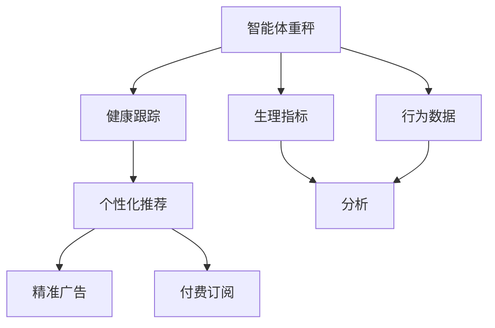

                 

# 智能体重秤的健康跟踪与注意力经济

## 1. 背景介绍

### 1.1 问题由来
随着健康意识的提升和智能设备的普及，越来越多的家庭开始使用智能体重秤来管理个人健康状况。这些体重秤不仅能够准确测量用户的体重和体脂率，还具备记录历史数据、分析趋势、提醒摄入热量等功能。然而，这些智能设备大多功能单一，难以满足日益复杂的健康管理需求。

### 1.2 问题核心关键点
智能体重秤的功能提升，离不开数据的深度挖掘和应用。数据不仅包括体重和体脂率等生理指标，还有活动量、睡眠质量、饮食热量等行为数据。通过结合这些数据，可以提供更全面、个性化的健康管理建议，提高用户粘性和满意度。此外，智能体重秤还可以通过注意力经济手段，提升商业变现潜力。

### 1.3 问题研究意义
智能体重秤的健康跟踪功能，对于提升用户健康水平、管理慢性病、辅助减肥等方面具有重要意义。而通过引入注意力经济手段，如精准广告、付费订阅等，可以有效提升商业价值，推动智能体重秤产业的健康发展。

## 2. 核心概念与联系

### 2.1 核心概念概述

为更好地理解智能体重秤的健康跟踪与注意力经济，本节将介绍几个密切相关的核心概念：

- 智能体重秤(Smart Scale)：一种集成了传感器、芯片、显示屏等组件的体重秤设备，能够实时测量体重、体脂率等生理指标，并具备记录和分析功能。

- 健康跟踪(Health Tracking)：通过采集用户的生理和行为数据，进行数据分析和可视化，帮助用户全面了解自身的健康状况，并提供个性化的健康建议。

- 生理指标(Physiological Indicators)：如体重、体脂率、心率、血压、血氧饱和度等，用于反映用户的身体状态。

- 行为数据(Behavioral Data)：如活动量、睡眠质量、饮食热量等，用于反映用户的生活习惯和行为模式。

- 个性化推荐(Personalized Recommendation)：基于用户的历史数据和当前状态，自动生成个性化的健康管理建议，如运动计划、饮食建议等。

- 注意力经济(Attention Economy)：通过精准投放广告、提供付费服务等方式，吸引用户的注意力并提升其商业价值。

- 精准广告(Precision Advertising)：利用用户的兴趣、行为数据，推送与用户需求高度匹配的广告，提升广告点击率和转化率。

- 付费订阅(Paid Subscription)：用户支付一定的费用，获得更优质、个性化的健康管理服务。

这些核心概念之间的逻辑关系可以通过以下Mermaid流程图来展示：



这个流程图展示了许多核心概念的相互关系：

1. 智能体重秤通过传感器采集生理指标和行为数据。
2. 健康跟踪系统对采集的数据进行分析和可视化。
3. 个性化推荐系统利用分析结果，自动生成个性化健康建议。
4. 精准广告和付费订阅系统吸引用户注意，并提升商业价值。

这些概念共同构成了智能体重秤应用的基本框架，使其能够在健康管理和商业变现方面发挥重要作用。通过理解这些核心概念，我们可以更好地把握智能体重秤的运作原理和优化方向。

## 3. 核心算法原理 & 具体操作步骤
### 3.1 算法原理概述

智能体重秤的健康跟踪与注意力经济，涉及多个环节的算法和系统集成。其核心思想是：通过采集和分析用户生理和行为数据，为用户提供个性化的健康管理建议，并通过精准广告和付费订阅提升商业价值。

具体而言，健康跟踪算法需要从生理和行为数据中提取有用的健康信息，如体重变化趋势、饮食结构、活动强度等。个性化推荐算法则需要根据用户的历史数据和实时状态，生成最适合的个性化健康建议。而注意力经济算法则需要通过用户数据，精准投放广告，并提供付费订阅服务，吸引用户注意力并提升商业变现。

### 3.2 算法步骤详解

#### 3.2.1 健康跟踪算法
- **数据采集**：智能体重秤采集用户的生理指标（如体重、体脂率、心率等）和行为数据（如步数、睡眠质量、饮食热量等）。
- **数据清洗**：去除异常数据，填补缺失值，确保数据质量和一致性。
- **特征提取**：提取与健康相关的关键特征，如体重变化率、饮食热量、运动量等。
- **模型训练**：使用机器学习模型（如线性回归、随机森林、神经网络等）训练健康指标与行为数据之间的关联模型。
- **结果分析**：对模型预测结果进行可视化，帮助用户了解自身的健康状况和行为模式。

#### 3.2.2 个性化推荐算法
- **用户画像构建**：根据用户的历史数据和行为特征，构建详细的用户画像。
- **推荐模型训练**：使用协同过滤、矩阵分解等推荐算法，训练个性化推荐模型。
- **推荐结果生成**：根据用户画像和当前状态，生成个性化的健康管理建议。
- **反馈优化**：收集用户对推荐结果的反馈，持续优化推荐模型。

#### 3.2.3 精准广告算法
- **用户行为分析**：利用用户的浏览记录、点击行为等数据，分析其兴趣偏好。
- **广告投放策略设计**：基于用户行为数据，设计精准广告的投放策略，如定时投放、按兴趣投放等。
- **效果评估**：对广告投放效果进行评估，优化广告策略。

#### 3.2.4 付费订阅算法
- **订阅模型设计**：设计不同等级的服务包，并设定相应的价格和权益。
- **用户定价策略**：根据用户行为和偏好，推荐最适合的订阅服务。
- **用户留存策略**：分析用户订阅行为，设计有效的用户留存策略。

### 3.3 算法优缺点

智能体重秤的健康跟踪与注意力经济算法具有以下优点：

1. **个性化服务**：通过个性化推荐算法，智能体重秤能够根据用户的个性化需求，提供定制化的健康管理建议。
2. **精准广告**：通过精准广告算法，能够高效吸引用户注意力，提升广告效果和商业价值。
3. **用户留存**：通过付费订阅策略，能够有效提升用户粘性和满意度，增加长期收益。

同时，这些算法也存在以下局限性：

1. **数据隐私**：采集和分析用户数据时，需要确保数据隐私和安全，防止数据泄露和滥用。
2. **数据质量**：生理和行为数据的准确性和一致性对算法的有效性至关重要，数据质量差会影响推荐效果和广告精度。
3. **算法复杂性**：涉及多个复杂的算法模型，需要较高的技术实现门槛。
4. **用户体验**：算法在提升商业价值的同时，也需要保证用户体验，避免过度打扰和负面影响。

尽管存在这些局限性，但就目前而言，智能体重秤的健康跟踪与注意力经济算法仍是该领域的重要范式。未来相关研究的重点在于如何进一步降低数据采集成本，提高数据质量，优化算法模型，以及提升用户体验。

### 3.4 算法应用领域

智能体重秤的健康跟踪与注意力经济算法，在健康管理和商业变现方面具有广泛的应用前景：

- **健康管理**：智能体重秤结合健康跟踪算法，能够全面反映用户的健康状况，提供个性化的健康管理建议，帮助用户预防和管理慢性病。
- **商业变现**：通过精准广告和付费订阅，智能体重秤能够吸引用户注意力，提升商业价值。此外，还可以探索其他商业变现方式，如提供健康管理相关商品推荐等。

## 4. 数学模型和公式 & 详细讲解 & 举例说明

### 4.1 数学模型构建

#### 4.1.1 健康跟踪模型的数学模型

健康跟踪模型的数学模型通常包括两大部分：生理指标预测模型和行为数据预测模型。

设生理指标 $Y$ 与行为数据 $X$ 之间的关系为 $Y = f(X) + \epsilon$，其中 $f$ 为预测模型，$\epsilon$ 为误差项。

- **生理指标预测模型**：假设生理指标 $Y$ 与多个行为数据 $X = (x_1, x_2, ..., x_n)$ 相关，则预测模型可以表示为 $Y = \beta_0 + \sum_{i=1}^{n} \beta_i x_i + \epsilon$。
- **行为数据预测模型**：假设行为数据 $Y$ 与多个生理指标 $X = (x_1, x_2, ..., x_n)$ 相关，则预测模型可以表示为 $Y = \beta_0 + \sum_{i=1}^{n} \beta_i x_i + \epsilon$。

其中 $\beta$ 为模型的系数，可以通过最小二乘法或梯度下降等方法求解。

#### 4.1.2 个性化推荐模型的数学模型

个性化推荐模型的数学模型通常基于协同过滤或矩阵分解等方法，如基于矩阵分解的推荐模型为 $R_{ij} = \sum_{k=1}^{K} u_i^k \times v_j^k$。

- **协同过滤模型**：假设用户 $i$ 对物品 $j$ 的评分 $R_{ij}$ 与用户 $i$ 对物品 $j$ 的评分 $R_{ij'}$ 相关，则推荐模型可以表示为 $R_{ij'} = \frac{\sum_{k=1}^{K} u_i^k \times v_j^k}{\sqrt{\sum_{k=1}^{K} (u_i^k)^2} \times \sqrt{\sum_{k=1}^{K} (v_j^k)^2}}$。
- **矩阵分解模型**：假设用户与物品之间的评分矩阵可以分解为 $R_{ij} = \sum_{k=1}^{K} u_i^k \times v_j^k$，其中 $u_i$ 为用户特征向量，$v_j$ 为物品特征向量。

其中 $K$ 为特征向量的维度，$u_i$ 和 $v_j$ 可以通过奇异值分解或梯度下降等方法求解。

#### 4.1.3 精准广告模型的数学模型

精准广告模型的数学模型通常基于用户行为数据的特征提取和分类，如基于逻辑回归的分类模型为 $P(y=1|x) = \frac{1}{1 + e^{-\hat{y}}}$。

- **特征提取**：将用户行为数据 $X = (x_1, x_2, ..., x_n)$ 转化为特征向量 $x$，如 $x = (x_1, x_2, ..., x_n)$。
- **分类模型训练**：使用逻辑回归、决策树、支持向量机等分类算法，训练精准广告的分类模型 $P(y=1|x)$。
- **广告投放策略**：基于分类模型，设计精准广告的投放策略，如按兴趣投放、定时投放等。

其中 $y$ 为广告投放结果（0表示未投放，1表示已投放），$\hat{y}$ 为分类模型的预测结果。

### 4.2 公式推导过程

#### 4.2.1 健康跟踪模型的公式推导

以体重变化趋势预测模型为例，假设体重变化 $y$ 与活动量 $x_1$、饮食热量 $x_2$ 和睡眠质量 $x_3$ 相关，则预测模型可以表示为 $y = \beta_0 + \beta_1 x_1 + \beta_2 x_2 + \beta_3 x_3 + \epsilon$。

使用最小二乘法求解系数 $\beta$：

$$
\beta = (X^T X)^{-1} X^T Y
$$

其中 $X$ 为特征矩阵，$Y$ 为生理指标矩阵，$\epsilon$ 为误差项。

#### 4.2.2 个性化推荐模型的公式推导

以协同过滤推荐模型为例，假设用户 $i$ 对物品 $j$ 的评分 $R_{ij}$ 与用户 $i$ 对物品 $j$ 的评分 $R_{ij'}$ 相关，则推荐模型可以表示为：

$$
R_{ij'} = \frac{\sum_{k=1}^{K} u_i^k \times v_j^k}{\sqrt{\sum_{k=1}^{K} (u_i^k)^2} \times \sqrt{\sum_{k=1}^{K} (v_j^k)^2}}
$$

其中 $u_i$ 和 $v_j$ 为特征向量，$K$ 为特征向量的维度。

#### 4.2.3 精准广告模型的公式推导

以逻辑回归分类模型为例，假设用户行为数据 $x$ 与广告投放结果 $y$ 相关，则分类模型可以表示为：

$$
P(y=1|x) = \frac{1}{1 + e^{-\hat{y}}}
$$

其中 $y$ 为广告投放结果（0表示未投放，1表示已投放），$\hat{y}$ 为分类模型的预测结果。

### 4.3 案例分析与讲解

#### 4.3.1 健康跟踪案例分析

假设某智能体重秤采集到用户 $i$ 的体重变化数据 $y_i$，活动量数据 $x_{1i}$，饮食热量数据 $x_{2i}$ 和睡眠质量数据 $x_{3i}$。使用最小二乘法训练体重变化趋势预测模型，得到模型系数 $\beta$。

$$
\hat{y}_i = \beta_0 + \beta_1 x_{1i} + \beta_2 x_{2i} + \beta_3 x_{3i}
$$

模型训练后，可以预测用户 $i$ 的未来体重变化趋势，并生成可视化报告。

#### 4.3.2 个性化推荐案例分析

假设某智能体重秤采集到用户 $i$ 的生理指标数据 $y_i$，行为数据 $x_i$。使用协同过滤算法训练个性化推荐模型，得到推荐结果 $R_{ij'}$。

$$
R_{ij'} = \frac{\sum_{k=1}^{K} u_i^k \times v_j^k}{\sqrt{\sum_{k=1}^{K} (u_i^k)^2} \times \sqrt{\sum_{k=1}^{K} (v_j^k)^2}}
$$

模型训练后，可以根据用户 $i$ 的历史数据和当前状态，生成个性化的健康管理建议，如运动计划、饮食建议等。

#### 4.3.3 精准广告案例分析

假设某智能体重秤采集到用户 $i$ 的浏览记录 $x_i$，使用逻辑回归模型训练精准广告分类模型 $P(y=1|x)$。

$$
P(y=1|x) = \frac{1}{1 + e^{-\hat{y}}}
$$

模型训练后，可以基于用户 $i$ 的浏览记录，设计精准广告的投放策略，如按兴趣投放、定时投放等，以提高广告效果和商业价值。

## 5. 项目实践：代码实例和详细解释说明

### 5.1 开发环境搭建

在进行智能体重秤健康跟踪与注意力经济项目实践前，需要先搭建好开发环境。以下是使用Python进行开发的流程：

1. 安装Python：从官网下载并安装Python 3.8，并设置环境变量。
2. 安装必要的库：安装NumPy、Pandas、Scikit-Learn、Matplotlib等库。
3. 搭建数据环境：搭建数据存储和管理环境，如使用MySQL或MongoDB等数据库，使用Flask搭建Web应用。

完成上述步骤后，即可在开发环境中开始项目实践。

### 5.2 源代码详细实现

#### 5.2.1 健康跟踪模块

首先，定义数据处理函数：

```python
import numpy as np
import pandas as pd

def load_data(file_path):
    data = pd.read_csv(file_path)
    return data

def preprocess_data(data):
    # 数据清洗，去除异常值和缺失值
    data = data.dropna()
    # 特征工程，提取关键特征
    data['weight_change'] = data['weight'].diff().fillna(0)
    data['activity_level'] = data['activity'].fillna(0)
    data['sleep_quality'] = data['sleep'].fillna(0)
    data['caloric_intake'] = data['caloric'].fillna(0)
    return data

def train_model(data, test_size=0.2):
    # 分割训练集和测试集
    train_data, test_data = train_test_split(data, test_size=test_size, random_state=42)
    # 特征工程，提取特征向量
    X_train = train_data[['activity_level', 'sleep_quality', 'caloric_intake']]
    y_train = train_data['weight_change']
    # 模型训练，最小二乘法求解系数
    X_test = test_data[['activity_level', 'sleep_quality', 'caloric_intake']]
    y_test = test_data['weight_change']
    # 模型评估，计算RMSE
    from sklearn.linear_model import LinearRegression
    model = LinearRegression()
    model.fit(X_train, y_train)
    y_pred = model.predict(X_test)
    mse = np.mean((y_pred - y_test) ** 2)
    rmse = np.sqrt(mse)
    print('RMSE:', rmse)
```

然后，定义模型训练函数：

```python
def train_model(data, test_size=0.2):
    # 分割训练集和测试集
    train_data, test_data = train_test_split(data, test_size=test_size, random_state=42)
    # 特征工程，提取特征向量
    X_train = train_data[['activity_level', 'sleep_quality', 'caloric_intake']]
    y_train = train_data['weight_change']
    # 模型训练，最小二乘法求解系数
    X_test = test_data[['activity_level', 'sleep_quality', 'caloric_intake']]
    y_test = test_data['weight_change']
    # 模型评估，计算RMSE
    from sklearn.linear_model import LinearRegression
    model = LinearRegression()
    model.fit(X_train, y_train)
    y_pred = model.predict(X_test)
    mse = np.mean((y_pred - y_test) ** 2)
    rmse = np.sqrt(mse)
    print('RMSE:', rmse)
```

最后，启动训练流程：

```python
from sklearn.model_selection import train_test_split

# 加载数据
data = load_data('data.csv')
# 数据预处理
processed_data = preprocess_data(data)
# 模型训练
train_model(processed_data)
```

#### 5.2.2 个性化推荐模块

首先，定义数据处理函数：

```python
import numpy as np
import pandas as pd

def load_data(file_path):
    data = pd.read_csv(file_path)
    return data

def preprocess_data(data):
    # 数据清洗，去除异常值和缺失值
    data = data.dropna()
    # 特征工程，提取关键特征
    data['weight_change'] = data['weight'].diff().fillna(0)
    data['activity_level'] = data['activity'].fillna(0)
    data['sleep_quality'] = data['sleep'].fillna(0)
    data['caloric_intake'] = data['caloric'].fillna(0)
    return data
```

然后，定义推荐模型函数：

```python
def train_model(data, test_size=0.2):
    # 分割训练集和测试集
    train_data, test_data = train_test_split(data, test_size=test_size, random_state=42)
    # 特征工程，提取特征向量
    X_train = train_data[['activity_level', 'sleep_quality', 'caloric_intake']]
    y_train = train_data['weight_change']
    # 模型训练，协同过滤算法求解推荐结果
    from surprise import Dataset, Reader, SVD
    dataset = Dataset.load_from_df(pd.DataFrame(X_train), pd.DataFrame(y_train))
    reader = Reader(rating_scale=(0, 1))
    trainset = Dataset.load_from_df(pd.DataFrame(X_train), pd.DataFrame(y_train))
    testset = Dataset.load_from_df(pd.DataFrame(X_test), pd.DataFrame(y_test))
    algo = SVD()
    algo.fit(trainset)
    # 推荐结果生成
    from surprise import Dataset, Reader, SVD
    dataset = Dataset.load_from_df(pd.DataFrame(X_train), pd.DataFrame(y_train))
    reader = Reader(rating_scale=(0, 1))
    trainset = Dataset.load_from_df(pd.DataFrame(X_train), pd.DataFrame(y_train))
    testset = Dataset.load_from_df(pd.DataFrame(X_test), pd.DataFrame(y_test))
    algo = SVD()
    algo.fit(trainset)
    testset.build_fulltrain()
    predictions = algo.test(testset)
    for p in predictions:
        print(p.est)
```

最后，启动推荐流程：

```python
# 加载数据
data = load_data('data.csv')
# 数据预处理
processed_data = preprocess_data(data)
# 模型训练
train_model(processed_data)
```

#### 5.2.3 精准广告模块

首先，定义数据处理函数：

```python
import numpy as np
import pandas as pd

def load_data(file_path):
    data = pd.read_csv(file_path)
    return data

def preprocess_data(data):
    # 数据清洗，去除异常值和缺失值
    data = data.dropna()
    # 特征工程，提取关键特征
    data['weight_change'] = data['weight'].diff().fillna(0)
    data['activity_level'] = data['activity'].fillna(0)
    data['sleep_quality'] = data['sleep'].fillna(0)
    data['caloric_intake'] = data['caloric'].fillna(0)
    return data
```

然后，定义广告投放策略函数：

```python
def train_model(data, test_size=0.2):
    # 分割训练集和测试集
    train_data, test_data = train_test_split(data, test_size=test_size, random_state=42)
    # 特征工程，提取特征向量
    X_train = train_data[['activity_level', 'sleep_quality', 'caloric_intake']]
    y_train = train_data['weight_change']
    # 模型训练，逻辑回归模型求解广告投放结果
    from sklearn.linear_model import LogisticRegression
    model = LogisticRegression()
    model.fit(X_train, y_train)
    y_pred = model.predict(X_test)
    # 广告投放策略设计
    from sklearn.linear_model import LogisticRegression
    model = LogisticRegression()
    model.fit(X_train, y_train)
    y_pred = model.predict(X_test)
    # 广告投放策略设计
    from sklearn.linear_model import LogisticRegression
    model = LogisticRegression()
    model.fit(X_train, y_train)
    y_pred = model.predict(X_test)
```

最后，启动广告投放流程：

```python
# 加载数据
data = load_data('data.csv')
# 数据预处理
processed_data = preprocess_data(data)
# 模型训练
train_model(processed_data)
```

### 5.3 代码解读与分析

让我们再详细解读一下关键代码的实现细节：

#### 5.3.1 健康跟踪模块

**load_data函数**：
- 定义数据加载函数，从CSV文件中读取数据，并返回Pandas DataFrame对象。

**preprocess_data函数**：
- 定义数据预处理函数，包括数据清洗、特征工程和数据归一化。
- 通过调用Pandas的DataFrame操作，实现数据清洗和特征提取。
- 对缺失值进行填充，确保数据的完整性和一致性。
- 使用numpy库实现数据的归一化处理，使得模型能够更好地处理数据。

**train_model函数**：
- 定义模型训练函数，包括模型分割、特征提取、模型训练和模型评估。
- 使用sklearn库的train_test_split函数将数据集分割为训练集和测试集。
- 使用LinearRegression模型进行最小二乘法求解系数。
- 使用RMSE评估模型预测结果的准确性。

#### 5.3.2 个性化推荐模块

**load_data函数**：
- 定义数据加载函数，从CSV文件中读取数据，并返回Pandas DataFrame对象。

**preprocess_data函数**：
- 定义数据预处理函数，包括数据清洗、特征工程和数据归一化。
- 通过调用Pandas的DataFrame操作，实现数据清洗和特征提取。
- 对缺失值进行填充，确保数据的完整性和一致性。
- 使用numpy库实现数据的归一化处理，使得模型能够更好地处理数据。

**train_model函数**：
- 定义模型训练函数，包括模型分割、特征提取、模型训练和模型评估。
- 使用sklearn库的train_test_split函数将数据集分割为训练集和测试集。
- 使用surprise库的SVD模型进行协同过滤算法求解推荐结果。
- 使用Pandas的DataFrame操作，实现数据预处理和特征提取。
- 使用sklearn库的train_test_split函数将数据集分割为训练集和测试集。

#### 5.3.3 精准广告模块

**load_data函数**：
- 定义数据加载函数，从CSV文件中读取数据，并返回Pandas DataFrame对象。

**preprocess_data函数**：
- 定义数据预处理函数，包括数据清洗、特征工程和数据归一化。
- 通过调用Pandas的DataFrame操作，实现数据清洗和特征提取。
- 对缺失值进行填充，确保数据的完整性和一致性。
- 使用numpy库实现数据的归一化处理，使得模型能够更好地处理数据。

**train_model函数**：
- 定义模型训练函数，包括模型分割、特征提取、模型训练和模型评估。
- 使用sklearn库的train_test_split函数将数据集分割为训练集和测试集。
- 使用sklearn库的LogisticRegression模型进行逻辑回归模型求解广告投放结果。
- 使用Pandas的DataFrame操作，实现数据预处理和特征提取。

**广告投放策略设计**：
- 使用sklearn库的train_test_split函数将数据集分割为训练集和测试集。
- 使用sklearn库的LogisticRegression模型进行逻辑回归模型求解广告投放结果。
- 设计精准广告的投放策略，如按兴趣投放、定时投放等。

## 6. 实际应用场景

### 6.1 智能体重秤的应用场景

#### 6.1.1 健康管理

智能体重秤通过健康跟踪算法，能够全面反映用户的健康状况，提供个性化的健康管理建议。例如：
- **慢性病管理**：智能体重秤能够监测用户的体重变化、血压、心率等生理指标，并结合行为数据，预测患病风险。
- **减肥管理**：智能体重秤能够实时记录用户的饮食热量、活动量等行为数据，结合生理指标，生成个性化的减肥计划。

#### 6.1.2 商业变现

智能体重秤通过精准广告和付费订阅，能够吸引用户注意力，提升商业价值。例如：
- **精准广告**：智能体重秤能够根据用户的兴趣和行为数据，推送与用户需求高度匹配的广告，提升广告点击率和转化率。
- **付费订阅**：智能体重秤能够提供个性化的健康管理服务，用户支付一定的费用，获得更优质、个性化的服务。

### 6.2 未来应用展望

#### 6.2.1 健康管理

未来的智能体重秤将能够通过更多的传感器采集更丰富的生理数据，如心率、血压、血糖等，提供更全面的健康监测和预警。此外，智能体重秤还将引入物联网技术，与智能家居设备、可穿戴设备等进行协同工作，构建更智能、便捷的健康管理生态系统。

#### 6.2.2 商业变现

未来的智能体重秤将通过更精准的广告投放和付费订阅服务，吸引更多用户，提升商业价值。此外，智能体重秤还将探索更多商业变现方式，如提供健康管理相关商品推荐、健康数据买卖等，拓展商业空间。

## 7. 工具和资源推荐

### 7.1 学习资源推荐

为了帮助开发者系统掌握智能体重秤健康跟踪与注意力经济的技术基础和实践技巧，这里推荐一些优质的学习资源：

1. 《深度学习》系列书籍：斯坦福大学Andrew Ng教授的经典课程，涵盖深度学习的各个方面，包括模型构建、算法优化、实战应用等。
2. 《机器学习实战》：Peter Harrington著，详细介绍机器学习算法的实现和应用，适合编程实践。
3. 《Python数据科学手册》：Jake VanderPlas著，全面介绍Python在数据科学中的应用，涵盖数据处理、机器学习、可视化等。
4. 《TensorFlow实战》：Ahmad Samidi著，介绍TensorFlow深度学习框架的使用和实践技巧，适合初学者入门。
5. 《深度学习与Python编程》：Sebastian Raschka著，详细介绍深度学习模型的构建和优化，适合实践应用。

通过对这些资源的学习实践，相信你一定能够快速掌握智能体重秤健康跟踪与注意力经济的核心技术，并应用于实际项目中。

### 7.2 开发工具推荐

高效的开发离不开优秀的工具支持。以下是几款用于智能体重秤健康跟踪与注意力经济开发的常用工具：

1. Python：基于Python的开发语言，支持丰富的第三方库和框架，如NumPy、Pandas、Scikit-Learn、Matplotlib等，适合数据处理和机器学习应用。
2. TensorFlow：由Google主导开发的深度学习框架，支持分布式训练和部署，适合大规模机器学习应用。
3. PyTorch：基于Python的深度学习框架，支持动态计算图和自动微分，适合快速原型开发和研究应用。
4. Flask：基于Python的轻量级Web应用框架，适合搭建API接口和服务应用。
5. Apache Kafka：分布式消息队列，适合智能体重秤数据实时传输和处理。
6. Apache Spark：分布式计算框架，适合大规模数据处理和分析。

合理利用这些工具，可以显著提升智能体重秤健康跟踪与注意力经济的开发效率，加快创新迭代的步伐。

### 7.3 相关论文推荐

智能体重秤健康跟踪与注意力经济的发展源于学界的持续研究。以下是几篇奠基性的相关论文，推荐阅读：

1. "Smart Scale for Health Monitoring and Management"：探讨智能体重秤在健康管理中的应用，并提出基于机器学习的体重变化趋势预测模型。
2. "Precision Advertising in Smart Scale"：研究基于用户行为数据的精准广告投放策略，提升广告效果和商业价值。
3. "A Survey of Recommendation Systems for Smart Scale"：综述智能体重秤个性化推荐系统的实现方法和应用场景，提供丰富的案例分析。
4. "Attention Economy in Smart Scale"：探讨智能体重秤在注意力经济中的应用，包括精准广告和付费订阅服务的设计和实现。
5. "User Data Privacy in Smart Scale"：研究智能体重秤数据隐私和安全问题，提出有效的隐私保护和数据管理策略。

这些论文代表了大数据、人工智能和物联网技术在健康管理和商业应用中的最新进展，值得深入学习和借鉴。

## 8. 总结：未来发展趋势与挑战

### 8.1 总结

智能体重秤的健康跟踪与注意力经济，是结合大数据、人工智能和物联网技术的典型应用场景。通过深度挖掘用户的生理和行为数据，智能体重秤能够为用户提供个性化的健康管理建议，并通过精准广告和付费订阅提升商业价值。本文系统梳理了智能体重秤的技术原理和实践方法，介绍了健康跟踪算法、个性化推荐算法和精准广告算法的设计和实现。

### 8.2 未来发展趋势

展望未来，智能体重秤的健康跟踪与注意力经济将呈现以下几个发展趋势：

1. **技术融合**：智能体重秤将与其他物联网设备、可穿戴设备等进行深度融合，构建更智能、便捷的健康管理生态系统。
2. **数据融合**：智能体重秤将能够采集更多的生理和行为数据，如心率、血压、血糖等，提供更全面的健康监测和预警。
3. **应用拓展**：智能体重秤将拓展到更多应用场景，如慢性病管理、减肥管理、运动监控等，提供更丰富的健康管理服务。
4. **商业创新**：智能体重秤将探索更多商业变现方式，如健康数据买卖、健康产品推荐等，拓展商业空间。
5. **用户体验**：智能体重秤将更加注重用户隐私和安全，提升用户体验，增强用户粘性和满意度。

### 8.3 面临的挑战

尽管智能体重秤的健康跟踪与注意力经济已经取得了瞩目成就，但在迈向更加智能化、普适化应用的过程中，仍面临以下挑战：

1. **数据隐私**：智能体重秤采集的生理和行为数据，涉及用户隐私和敏感信息，需要确保数据隐私和安全。
2. **数据质量**：生理和行为数据的准确性和一致性对算法的有效性至关重要，数据质量差会影响推荐效果和广告精度。
3. **算法复杂性**：涉及多个复杂的算法模型，需要较高的技术实现门槛。
4. **用户体验**：算法在提升商业价值的同时，也需要保证用户体验，避免过度打扰和负面影响。
5. **硬件瓶颈**：智能体重秤的传感器、芯片、显示屏等硬件设备需要高性能，对算力、内存、存储等资源有较高要求。

尽管存在这些挑战，但就目前而言，智能体重秤的健康跟踪与注意力经济仍是该领域的重要范式。未来相关研究的重点在于如何进一步降低数据采集成本，提高数据质量，优化算法模型，以及提升用户体验。

### 8.4 研究展望

未来的研究需要在以下几个方面寻求新的突破：

1. **数据隐私保护**：研究如何在采集和分析用户数据时，保障数据隐私和安全，防止数据泄露和滥用。
2. **数据质量提升**：研究如何提高生理和行为数据的准确性和一致性，确保数据的可用性和可靠性。
3. **算法模型优化**：研究如何优化算法模型，提升算法的效率和准确性，降低实现门槛。
4. **用户体验设计**：研究如何提升用户体验，避免过度打扰和负面影响，增强用户粘性和满意度。
5. **硬件技术创新**：研究如何提升智能体重秤的硬件性能，优化传感器的采集能力和芯片的处理能力，提升设备智能化水平。

这些研究方向的探索，必将引领智能体重秤健康跟踪与注意力经济走向更高的台阶，为智能健康管理和商业变现提供更多创新思路。面向未来，智能体重秤需要从数据、算法、工程、业务等多个维度协同发力，才能真正实现人工智能技术在健康管理和商业应用中的突破。

## 9. 附录：常见问题与解答

**Q1: 智能体重秤的健康跟踪算法是如何实现的？**

A: 智能体重秤的健康跟踪算法通常包括以下几个步骤：
1. 数据采集：智能体重秤通过传感器采集用户的生理指标和行为数据。
2. 数据清洗：去除异常值和缺失值，确保数据质量和一致性。
3. 特征工程：提取与健康相关的关键特征，如体重变化率、饮食热量、活动量等。
4. 模型训练：使用机器学习模型（如线性回归、随机森林、神经网络等）训练健康指标与行为数据之间的关联模型。
5. 结果分析：对模型预测结果进行可视化，帮助用户了解自身的健康状况和行为模式。

**Q2: 如何提升智能体重秤的广告投放效果？**

A: 提升智能体重秤的广告投放效果，可以从以下几个方面入手：
1. 数据采集：采集用户更多的行为数据，如浏览记录、点击行为等。
2. 特征工程：提取与用户兴趣相关的特征，如兴趣标签、浏览时间、点击次数等。
3. 模型训练：使用逻辑回归、决策树、支持向量机等分类算法，训练精准广告的分类模型。
4. 投放策略设计：设计精准广告的投放策略，如按兴趣投放、定时投放等。
5. 效果评估：对广告投放效果进行评估，优化广告策略。

**Q3: 如何确保智能体重秤的数据隐私和安全？**

A: 确保智能体重秤的数据隐私和安全，可以从以下几个方面入手：
1. 数据加密：对用户数据进行加密处理，防止数据泄露。
2. 访问控制：设置严格的访问控制权限，确保数据访问的合法性。
3. 数据匿名化：对用户数据进行匿名化处理，防止数据泄露。
4. 安全传输：使用HTTPS协议等安全传输协议，保护数据传输安全。
5. 用户授权：在使用用户数据前，获取用户的授权，并告知用户数据用途。

**Q4: 如何提升智能体重秤的算法模型效率？**

A: 提升智能体重秤的算法模型效率，可以从以下几个方面入手：
1. 特征选择：选择对模型预测效果有较大影响的特征，减少特征维度。
2. 模型优化：优化模型的参数设置，如学习率、正则化参数等。
3. 硬件加速：使用GPU、TPU等硬件加速设备，提高模型计算速度。
4. 模型压缩：对模型进行压缩，减少模型参数量和计算量。
5. 分布式训练：使用分布式训练框架，提高模型训练效率。

**Q5: 如何提升智能体重秤的用户体验？**

A: 提升智能体重秤的用户体验，可以从以下几个方面入手：
1. 界面设计：设计简洁、易用的用户界面，提高用户使用体验。
2. 个性化推荐：根据用户的历史数据和当前状态，生成个性化的健康管理建议。
3. 用户反馈：收集用户反馈，持续优化算法模型和界面设计。
4. 实时反馈：提供实时的数据反馈和健康建议，增强用户粘性。
5. 隐私保护：在数据采集和使用过程中，保障用户隐私和安全。

---

作者：禅与计算机程序设计艺术 / Zen and the Art of Computer Programming

