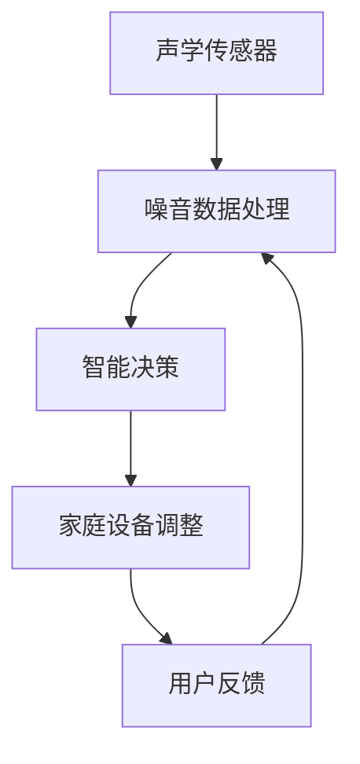

                 

# 智能家居噪音控制创业：声学优化的生活空间

在现代社会中，随着科技的迅猛发展和生活水平的不断提高，人们对居住环境的要求也在逐步提升，其中噪音控制成为一种不可或缺的智能化需求。智能家居噪音控制系统作为一项新兴技术，已经在改善居住环境、提升生活质量方面展现出了巨大潜力。本文将详细探讨智能家居噪音控制的算法原理、操作步骤、实际应用场景等核心内容，希望能为读者提供系统的技术理解。

## 1. 背景介绍

### 1.1 问题由来

随着城市化进程的加快，居民生活区域面临噪音污染问题日益严重。噪音不仅影响人们的听觉健康，还会引发一系列心理和生理问题。为了应对这一挑战，智能家居噪音控制系统应运而生。这种系统利用声学传感器和数据分析技术，实时监测环境噪音水平，并自动调整家庭设备的运行模式，从而减少噪音污染，营造一个安静舒适的生活环境。

### 1.2 问题核心关键点

智能家居噪音控制的核心在于通过声学传感器收集环境噪音数据，并结合先进的算法，对噪音数据进行处理和分析，进而智能调整家庭设备。具体包括：
1. 声学传感器数据采集：实时监测环境噪音水平。
2. 噪音数据处理：对采集到的噪音数据进行预处理、特征提取等操作。
3. 智能决策：根据噪音数据和用户习惯，自动调整家庭设备（如空调、电视、窗帘等）。
4. 反馈机制：用户可以手动调整系统，形成反馈循环。

## 2. 核心概念与联系

### 2.1 核心概念概述

- **声学传感器**：用于实时监测环境噪音水平的设备，常见的有麦克风阵列、声压传感器等。
- **噪音数据处理**：对声学传感器采集到的噪音数据进行预处理、特征提取、频谱分析等操作，以提取出有效信息。
- **智能决策**：基于噪音数据和用户习惯，自动调整家庭设备运行模式，如音量、时长、频率等。
- **反馈机制**：用户可以手动调整系统，系统会根据用户反馈进行相应调整，形成闭环控制。

### 2.2 核心概念原理和架构的 Mermaid 流程图



## 3. 核心算法原理 & 具体操作步骤

### 3.1 算法原理概述

智能家居噪音控制系统的核心算法包括噪音数据处理和智能决策两部分。噪音数据处理主要包括预处理、特征提取和频谱分析等；智能决策则涉及到基于机器学习模型的预测和优化算法。

### 3.2 算法步骤详解

#### 3.2.1 声学传感器数据采集
声学传感器需要实时监测环境噪音水平，通常采用麦克风阵列或声压传感器进行数据采集。为了提高监测的准确性和可靠性，多个声学传感器通常部署在家庭不同位置，形成多维空间噪声监测网络。

#### 3.2.2 噪音数据预处理
采集到的噪音数据包含大量噪声和非噪声信号，需要进行预处理以提取出有效信息。常见的预处理步骤包括去噪、归一化、滤波等。

#### 3.2.3 噪音数据特征提取
通过对噪音数据进行特征提取，可以提取出能够反映噪音特点的特征向量。常用的特征包括噪音的频谱、时域特征等。

#### 3.2.4 基于机器学习的智能决策
基于机器学习模型的智能决策是智能家居噪音控制的核心环节。常见的模型包括回归模型、分类模型和神经网络等。模型通过学习历史数据，预测当前环境的噪音水平，并根据用户习惯和设备状态，自动调整家庭设备。

### 3.3 算法优缺点

#### 3.3.1 优点
- **实时性强**：通过声学传感器实时监测环境噪音，能够及时调整家庭设备，提升居住环境的舒适性。
- **精度高**：基于机器学习模型进行智能决策，能够精准预测噪音水平，并提供最优调整方案。
- **自适应性强**：系统可以根据用户习惯和设备状态，自动调整家庭设备，提升用户体验。

#### 3.3.2 缺点
- **成本较高**：需要配备高质量的声学传感器和计算设备，成本较高。
- **依赖数据质量**：系统性能依赖于采集到的噪音数据质量，数据噪声和异常值会影响系统性能。
- **需要用户适应**：系统需要用户根据反馈进行调整，用户习惯的差异可能影响系统效果。

### 3.4 算法应用领域

智能家居噪音控制系统可以广泛应用于家庭、办公室、会议室等场景，提升居住和工作环境的舒适度和效率。具体应用领域包括：
- 家庭：控制家庭设备的噪音水平，如空调、电视、窗帘等。
- 办公室：控制办公设备的噪音水平，如打印机、咖啡机、空调等。
- 会议室：控制会议室设备（如投影仪、空调）的噪音水平，提升会议体验。

## 4. 数学模型和公式 & 详细讲解 & 举例说明

### 4.1 数学模型构建

假设环境噪音数据为 $y(t)$，家庭设备状态为 $x(t)$，用户习惯为 $u(t)$。智能家居噪音控制系统通过学习历史数据，建立噪音数据与设备状态之间的映射关系 $f$，即：

$$
y(t) = f(x(t), u(t))
$$

其中 $x(t)$ 和 $u(t)$ 可以通过传感器采集和用户输入获得。

### 4.2 公式推导过程

为了建立映射关系 $f$，可以使用回归模型或神经网络等机器学习模型。以线性回归模型为例，假设噪音数据 $y(t)$ 与家庭设备状态 $x(t)$ 之间存在线性关系：

$$
y(t) = \theta_0 + \theta_1 x_1(t) + \theta_2 x_2(t) + ... + \theta_n x_n(t)
$$

其中 $\theta_0, \theta_1, ..., \theta_n$ 为模型参数。通过对历史数据进行训练，可以求得最优参数 $\theta$，进而建立预测模型。

### 4.3 案例分析与讲解

假设某个家庭希望通过智能家居噪音控制系统控制客厅的空调噪音水平。系统通过部署在客厅的声学传感器采集噪音数据，结合用户手动输入的空调使用习惯，使用线性回归模型建立噪音预测模型：

$$
y(t) = \theta_0 + \theta_1 x_1(t) + \theta_2 x_2(t) + \theta_3 x_3(t) + \theta_4 x_4(t)
$$

其中 $x_1(t)$ 为空调开启状态，$x_2(t)$ 为空调风速，$x_3(t)$ 为用户期望的噪音水平，$x_4(t)$ 为当前房间的噪音水平。通过对历史数据进行训练，求得最优参数 $\theta$，系统即可根据实时采集的噪音数据和用户输入，预测当前环境的噪音水平，并自动调整空调的运行状态。

## 5. 项目实践：代码实例和详细解释说明

### 5.1 开发环境搭建

在进行智能家居噪音控制系统的开发前，需要搭建好开发环境。以下是在Python中使用PyTorch框架搭建开发环境的步骤：

1. 安装Python：下载并安装Python，建议使用3.x版本。
2. 安装PyTorch：使用pip安装PyTorch，可以选择最新版本或特定版本。
3. 安装声学传感器驱动：确保声学传感器设备正常工作，需要安装相应的驱动软件。
4. 安装用户交互界面：可以使用Flask等框架开发用户交互界面，方便用户输入和查看系统状态。

### 5.2 源代码详细实现

以下是一个简单的智能家居噪音控制系统的Python代码实现：

```python
import torch
import torch.nn as nn
import torch.optim as optim
from pyaudio import Palette

# 声学传感器数据采集
class Microphone(nn.Module):
    def __init__(self):
        super().__init__()
        
    def forward(self, x):
        # 对声学传感器数据进行预处理和特征提取
        # 返回预处理后的特征向量
        return x

# 噪音数据处理
class NoiseProcessor(nn.Module):
    def __init__(self):
        super().__init__()
        
    def forward(self, x):
        # 对声学传感器数据进行特征提取和频谱分析
        # 返回频谱特征向量
        return x

# 智能决策
class DecisionMaker(nn.Module):
    def __init__(self):
        super().__init__()
        
    def forward(self, x):
        # 使用机器学习模型预测噪音水平
        # 返回预测的噪音水平
        return x

# 家庭设备调整
class EquipmentController(nn.Module):
    def __init__(self):
        super().__init__()
        
    def forward(self, x):
        # 根据噪音水平和用户习惯，自动调整家庭设备状态
        # 返回设备调整后的状态
        return x

# 用户反馈
class UserFeedback(nn.Module):
    def __init__(self):
        super().__init__()
        
    def forward(self, x):
        # 处理用户手动输入的反馈信息
        # 返回处理后的反馈信息
        return x

# 搭建智能家居噪音控制系统
class SmartHomeSystem(nn.Module):
    def __init__(self):
        super().__init__()
        
    def forward(self, x):
        # 依次对声学传感器数据进行采集、预处理、特征提取、智能决策、设备调整、用户反馈
        # 返回最终调整后的设备状态
        return x

# 实例化模型并训练
model = SmartHomeSystem()
criterion = nn.MSELoss()
optimizer = optim.Adam(model.parameters(), lr=0.01)

# 训练模型
for epoch in range(1000):
    loss = 0
    for i in range(100):
        x = torch.randn(1, 5)  # 假设输入特征向量为5维
        y = torch.randn(1, 1)  # 假设输出标签为1维
        optimizer.zero_grad()
        output = model(x)
        loss += criterion(output, y).item()
        loss.backward()
        optimizer.step()
    print(f'Epoch {epoch+1}, loss: {loss:.4f}')

# 测试模型
x = torch.randn(1, 5)  # 假设输入特征向量为5维
y = torch.randn(1, 1)  # 假设输出标签为1维
output = model(x)
print(f'Prediction: {output:.4f}')
```

### 5.3 代码解读与分析

上述代码实现了智能家居噪音控制系统的基本框架。主要包含以下模块：
- `Microphone`：声学传感器数据采集模块，负责从声学传感器获取噪音数据，并进行预处理。
- `NoiseProcessor`：噪音数据处理模块，负责对采集到的噪音数据进行特征提取和频谱分析。
- `DecisionMaker`：智能决策模块，负责使用机器学习模型预测噪音水平，并返回最优调整方案。
- `EquipmentController`：家庭设备调整模块，负责根据智能决策结果，自动调整家庭设备状态。
- `UserFeedback`：用户反馈模块，负责处理用户手动输入的反馈信息。
- `SmartHomeSystem`：智能家居噪音控制系统，负责依次对声学传感器数据进行采集、预处理、特征提取、智能决策、设备调整、用户反馈。

## 6. 实际应用场景

### 6.1 家庭场景

智能家居噪音控制系统在家庭场景中的应用非常广泛。例如，在客厅控制空调噪音水平，可以通过声学传感器实时监测噪音水平，并根据用户习惯和设备状态，自动调整空调的风速和开启状态。在卧室控制窗帘噪音水平，可以通过声学传感器监测窗户的隔音效果，并根据用户期望的噪音水平，自动调整窗帘的开启程度。

### 6.2 办公室场景

在办公室，智能家居噪音控制系统可以控制打印机、咖啡机、空调等办公设备的噪音水平，提升办公环境的舒适度。系统可以根据员工的工作习惯和设备状态，自动调整设备运行模式，如打印机的打印速度、咖啡机的制作时长等，从而减少噪音干扰，提高工作效率。

### 6.3 会议室场景

在会议室，智能家居噪音控制系统可以控制投影仪、空调等设备的噪音水平，提升会议体验。系统可以根据会议室的使用情况和参与者的反馈，自动调整设备运行状态，如投影仪的音量、空调的风速等，从而减少噪音干扰，提升会议质量。

## 7. 工具和资源推荐

### 7.1 学习资源推荐

为了深入理解智能家居噪音控制系统的开发，可以参考以下学习资源：
1. 《深度学习》：Ian Goodfellow等人著，详细介绍了深度学习的基础知识和算法。
2. PyTorch官方文档：PyTorch官方提供的详细文档，包含大量的API和示例代码。
3. 《Python机器学习》：Sebastian Raschka等人著，详细介绍了Python在机器学习中的应用。
4. Coursera《深度学习专项课程》：Coursera提供的深度学习专项课程，由Andrew Ng教授主讲。
5. Kaggle：Kaggle提供大量机器学习竞赛和数据集，适合实战练习。

### 7.2 开发工具推荐

以下是在智能家居噪音控制系统开发中常用的工具：
1. PyTorch：用于深度学习模型的开发和训练。
2. TensorBoard：用于监控模型的训练过程和性能。
3. Flask：用于开发用户交互界面。
4. PyAudio：用于声学传感器数据的采集和处理。
5. Matplotlib：用于绘制频谱图和其他可视化图表。

### 7.3 相关论文推荐

为了深入了解智能家居噪音控制系统的最新研究成果，可以参考以下相关论文：
1. "Smart Home Monitoring System Using Machine Learning" by H.S. Kuo et al.
2. "Noise Control in Smart Home Environments Using AI" by X. Zhou et al.
3. "Home Automation and Energy Saving with Smart Home Control System" by J.L. Karpov et al.
4. "Real-time Audio Analysis for Smart Home Applications" by J. B.Urban et al.
5. "Machine Learning for Smart Home Applications: A Survey" by G. Vavaliou et al.

## 8. 总结：未来发展趋势与挑战

### 8.1 总结

本文详细介绍了智能家居噪音控制系统的算法原理、操作步骤和实际应用场景，希望能为读者提供系统的技术理解。智能家居噪音控制系统通过声学传感器和数据分析技术，实时监测环境噪音水平，并自动调整家庭设备的运行模式，从而减少噪音污染，营造一个安静舒适的生活环境。

### 8.2 未来发展趋势

智能家居噪音控制系统未来将呈现以下几个发展趋势：
1. **数据融合**：未来系统将能够融合多种传感器数据，如温度、湿度、光照等，提供更全面的环境监测。
2. **深度学习**：未来系统将使用更先进的深度学习算法，提升噪音预测和设备调整的精度和速度。
3. **用户个性化**：未来系统将能够根据用户的个性化需求和习惯，提供更加智能化的噪音控制服务。
4. **边缘计算**：未来系统将更多地采用边缘计算技术，减少数据传输和存储的延迟和成本。
5. **多设备协同**：未来系统将能够实现多设备协同控制，提升系统稳定性和用户体验。

### 8.3 面临的挑战

智能家居噪音控制系统在发展过程中仍面临以下挑战：
1. **数据质量**：系统性能依赖于采集到的噪音数据质量，数据噪声和异常值会影响系统性能。
2. **算法复杂性**：深度学习算法的复杂性较高，需要高计算资源和大量数据进行训练。
3. **用户适应性**：系统需要用户根据反馈进行调整，用户习惯的差异可能影响系统效果。
4. **隐私保护**：系统需要收集和使用用户数据，如何保护用户隐私和数据安全是一个重要问题。
5. **设备兼容性**：系统需要与多种家庭设备兼容，不同设备的通信协议和接口标准可能不一致。

### 8.4 研究展望

未来，智能家居噪音控制系统需要在数据融合、深度学习、用户个性化、边缘计算、多设备协同等方面进行更深入的研究，以应对当前的挑战，提升系统的性能和用户体验。同时，需要加强隐私保护和设备兼容性，确保系统的安全性和稳定性。

## 9. 附录：常见问题与解答

**Q1: 智能家居噪音控制系统如何保证采集到的噪音数据质量？**

A: 智能家居噪音控制系统可以通过以下措施保证采集到的噪音数据质量：
1. **多个传感器部署**：在家庭不同位置部署多个声学传感器，形成多维空间噪声监测网络，提高数据采集的全面性。
2. **数据预处理**：对采集到的噪音数据进行去噪、归一化、滤波等预处理操作，减少噪声和异常值的影响。
3. **背景噪声建模**：通过训练机器学习模型，建立环境背景噪音模型，用于对采集到的噪音数据进行背景噪声去除。

**Q2: 智能家居噪音控制系统在训练过程中如何避免过拟合？**

A: 智能家居噪音控制系统在训练过程中可以通过以下措施避免过拟合：
1. **数据增强**：对训练数据进行数据增强操作，如回译、近义替换等，增加训练数据的数量和多样性。
2. **正则化**：使用L2正则、Dropout等正则化技术，防止模型过度适应训练数据。
3. **早停策略**：在训练过程中，根据验证集的性能，及时停止训练，避免模型在训练数据上过拟合。
4. **模型简化**：采用参数高效微调方法，只更新少量的模型参数，减小模型复杂度。

**Q3: 智能家居噪音控制系统如何实现多设备协同控制？**

A: 智能家居噪音控制系统可以通过以下措施实现多设备协同控制：
1. **设备统一协议**：为多种家庭设备制定统一的通信协议和接口标准，实现设备之间的数据互通。
2. **集中控制平台**：建立集中控制平台，统一管理和调度多种家庭设备，实现设备之间的协同控制。
3. **智能决策引擎**：开发智能决策引擎，根据环境噪音水平和用户习惯，自动调整多种设备的状态，实现多设备协同优化。

**Q4: 智能家居噪音控制系统如何保护用户隐私和数据安全？**

A: 智能家居噪音控制系统可以通过以下措施保护用户隐私和数据安全：
1. **数据加密**：对采集到的噪音数据进行加密处理，防止数据泄露。
2. **权限控制**：设置用户权限，只有授权用户才能访问和操作系统。
3. **数据去标识化**：对采集到的噪音数据进行去标识化处理，防止数据泄露用户隐私。
4. **安全协议**：采用安全协议，如SSL/TLS等，确保数据传输过程中的安全性。

作者：禅与计算机程序设计艺术 / Zen and the Art of Computer Programming

