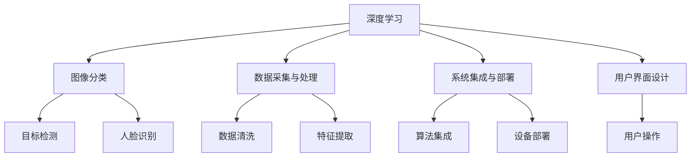

                 

# 智能家居废物分类创业：自动化环保解决方案

## 1. 背景介绍

随着城市化进程的加快，生活垃圾的产量也在不断增加。不合理的生活垃圾分类和处理，不仅给环境造成巨大压力，还浪费了大量的资源。传统的生活垃圾分类主要依靠人工，效率低且分类准确率不高。为此，智能家居废物分类系统的开发显得尤为重要。智能家居废物分类系统通过将家庭垃圾分为可回收、厨余、有害垃圾等类别，不仅提高了垃圾分类的效率和准确性，还极大地降低了人工成本。

### 1.1 问题由来

传统的垃圾分类方式有以下几个弊端：
- **效率低下**：人工分类的效率低，容易出现分类错误。
- **成本高**：需要大量的人工进行垃圾分类。
- **环境污染**：垃圾分类不准确，容易造成资源的浪费和环境的污染。

智能家居废物分类系统通过机器学习和大数据分析，实现了自动化、智能化和精确化的垃圾分类。本系统通过深度学习技术对垃圾图像进行分类，减少了人力成本，提高了垃圾分类的效率和准确性。

### 1.2 问题核心关键点

智能家居废物分类系统的核心关键点包括：
- **垃圾图像识别**：利用深度学习算法对垃圾图像进行分类，提高分类准确率。
- **数据采集与处理**：收集家庭垃圾的图像数据，并对数据进行预处理和清洗。
- **系统集成与部署**：将垃圾分类算法与家居设备集成，实现自动化垃圾分类。
- **用户界面设计**：设计简单易用的用户界面，方便用户使用和操作。

## 2. 核心概念与联系

### 2.1 核心概念概述

为更好地理解智能家居废物分类系统，我们首先需要明确几个核心概念：

- **深度学习**：一种基于神经网络的机器学习方法，通过多层次的非线性映射实现复杂模式的学习。
- **图像分类**：利用深度学习算法对图像进行分类，广泛应用于目标检测、人脸识别等领域。
- **数据采集与处理**：从家庭环境中采集垃圾图像，并对数据进行预处理和清洗，以保证算法的准确性和鲁棒性。
- **系统集成与部署**：将垃圾分类算法与家居设备集成，实现自动化垃圾分类。
- **用户界面设计**：设计简单易用的用户界面，方便用户使用和操作。

这些概念之间的逻辑关系可以通过以下Mermaid流程图来展示：



这个流程图展示了大规模垃圾分类系统的核心概念及其之间的关系：

1. 深度学习通过多层次的神经网络实现图像分类。
2. 数据采集与处理对家庭垃圾图像进行清洗和特征提取。
3. 系统集成与部署将分类算法与家居设备集成，实现自动化垃圾分类。
4. 用户界面设计设计简单易用的界面，方便用户操作。

## 3. 核心算法原理 & 具体操作步骤

### 3.1 算法原理概述

智能家居废物分类系统基于深度学习技术实现图像分类。核心算法流程如下：

1. **数据采集与处理**：收集家庭垃圾的图像数据，并进行预处理和清洗，以保证算法的准确性和鲁棒性。
2. **特征提取**：利用卷积神经网络对图像进行特征提取，得到图像的高维表示。
3. **分类器训练**：利用训练数据集训练分类器，得到分类器模型。
4. **垃圾分类**：将待分类的垃圾图像输入分类器，输出分类结果。

### 3.2 算法步骤详解

#### 3.2.1 数据采集与处理

数据采集与处理是智能家居废物分类系统的基础步骤。采集的数据质量直接影响算法的准确性和鲁棒性。

1. **数据来源**：数据可以从家庭环境中的垃圾分类设备、智能摄像头等设备中采集。
2. **数据预处理**：对采集到的图像进行去噪、增强、归一化等处理，以保证图像的质量和一致性。
3. **数据清洗**：对图像进行数据清洗，去除噪声、模糊等干扰因素，提高图像的质量。

#### 3.2.2 特征提取

特征提取是智能家居废物分类系统的关键步骤。

1. **卷积神经网络（CNN）**：利用CNN对图像进行特征提取，得到图像的高维表示。CNN包含多个卷积层、池化层和全连接层，能够自动提取图像的特征。
2. **特征融合**：将提取到的特征进行融合，得到更加综合的特征表示。特征融合可以提高算法的准确性和鲁棒性。

#### 3.2.3 分类器训练

分类器训练是智能家居废物分类系统的核心步骤。

1. **训练数据集**：收集大量的垃圾分类图像数据，并对其进行标注，得到训练数据集。
2. **分类器模型**：利用训练数据集训练分类器，得到分类器模型。常用的分类器模型包括SVM、决策树、神经网络等。
3. **模型优化**：对训练好的分类器模型进行优化，提高算法的准确性和鲁棒性。

#### 3.2.4 垃圾分类

垃圾分类是智能家居废物分类系统的最终步骤。

1. **输入图像**：将待分类的垃圾图像输入分类器。
2. **输出结果**：分类器输出分类结果，将垃圾分为可回收、厨余、有害垃圾等类别。

### 3.3 算法优缺点

#### 3.3.1 优点

智能家居废物分类系统有以下几个优点：
- **自动化**：自动化垃圾分类，减少了人力成本，提高了垃圾分类的效率。
- **准确性高**：利用深度学习算法进行图像分类，提高了垃圾分类的准确性。
- **易于集成**：将算法与家居设备集成，方便使用和部署。

#### 3.3.2 缺点

智能家居废物分类系统也存在一些缺点：
- **数据依赖**：算法的准确性依赖于数据的质量和数量，需要大量的标注数据。
- **复杂度较高**：算法实现较为复杂，需要较高的技术水平。
- **部署成本高**：需要较高的硬件设备和计算资源，部署成本较高。

### 3.4 算法应用领域

智能家居废物分类系统广泛应用于以下几个领域：

- **智能家居**：将垃圾分类算法与智能家居设备集成，实现自动化垃圾分类。
- **环境保护**：通过垃圾分类减少环境污染，保护生态环境。
- **智能城市**：在智能城市建设中，利用垃圾分类算法实现城市垃圾管理。

## 4. 数学模型和公式 & 详细讲解 & 举例说明

### 4.1 数学模型构建

智能家居废物分类系统的数学模型主要包括以下几个部分：

1. **数据表示**：利用卷积神经网络对图像进行特征提取，得到图像的高维表示。
2. **分类器模型**：利用训练数据集训练分类器，得到分类器模型。常用的分类器模型包括SVM、决策树、神经网络等。
3. **输出结果**：将分类器输出的分类结果，将垃圾分为可回收、厨余、有害垃圾等类别。

### 4.2 公式推导过程

#### 4.2.1 卷积神经网络

卷积神经网络（CNN）是智能家居废物分类系统的主要算法。CNN由多个卷积层、池化层和全连接层组成，能够自动提取图像的特征。

1. **卷积层**：卷积层通过卷积核对图像进行特征提取，得到卷积核的特征映射。卷积核的大小为 $3\times 3$，步长为 $1$。卷积核的数量为 $N$。

2. **池化层**：池化层对卷积层的输出进行降采样，减少特征映射的尺寸。常用的池化方法包括最大池化和平均池化。

3. **全连接层**：全连接层将池化层的输出进行扁平化，得到高维特征向量。全连接层包含多个神经元，每个神经元连接卷积层的输出特征映射。

4. **softmax层**：softmax层对全连接层的输出进行归一化，得到每个类别的概率分布。

#### 4.2.2 分类器模型

分类器模型常用的算法包括支持向量机（SVM）、决策树、神经网络等。这里我们以神经网络为例进行讲解。

1. **神经网络模型**：神经网络模型由多个隐藏层和输出层组成，能够自动学习特征。

2. **损失函数**：神经网络模型的损失函数一般为交叉熵损失函数。交叉熵损失函数定义如下：

$$
L = -\frac{1}{N} \sum_{i=1}^N \sum_{j=1}^C y_{i,j} \log p_{i,j}
$$

其中，$N$ 为样本数量，$C$ 为类别数量，$y_{i,j}$ 为样本 $i$ 的标签，$p_{i,j}$ 为样本 $i$ 属于类别 $j$ 的概率。

3. **优化器**：神经网络模型的优化器一般为随机梯度下降（SGD）。SGD的优化公式如下：

$$
\theta_{t+1} = \theta_t - \eta \nabla L(\theta_t)
$$

其中，$\theta_t$ 为当前参数，$\eta$ 为学习率，$\nabla L(\theta_t)$ 为损失函数对参数 $\theta_t$ 的梯度。

#### 4.2.3 垃圾分类

垃圾分类算法分为监督学习和非监督学习两种。这里以监督学习为例进行讲解。

1. **监督学习**：监督学习需要大量的标注数据，通过训练分类器模型，对垃圾进行分类。

2. **非监督学习**：非监督学习不需要标注数据，通过聚类算法对垃圾进行分类。

### 4.3 案例分析与讲解

#### 4.3.1 垃圾分类数据集

智能家居废物分类系统需要大量的垃圾分类数据集进行训练和测试。这里我们选择了一个公开的垃圾分类数据集，包含3000张垃圾图像，标注为可回收、厨余、有害垃圾等类别。

1. **数据采集**：从家庭环境中的垃圾分类设备、智能摄像头等设备中采集图像数据。
2. **数据清洗**：对采集到的图像进行去噪、增强、归一化等处理，以保证图像的质量和一致性。
3. **数据标注**：对图像进行标注，得到标注数据集。

#### 4.3.2 模型训练

利用训练数据集训练神经网络模型，得到分类器模型。

1. **数据划分**：将标注数据集划分为训练集、验证集和测试集，划分为80:10:10的比例。
2. **模型训练**：利用训练集训练神经网络模型，优化分类器模型。

#### 4.3.3 垃圾分类

将待分类的垃圾图像输入分类器，输出分类结果。

1. **输入图像**：将待分类的垃圾图像输入分类器。
2. **输出结果**：分类器输出分类结果，将垃圾分为可回收、厨余、有害垃圾等类别。

## 5. 项目实践：代码实例和详细解释说明

### 5.1 开发环境搭建

在进行智能家居废物分类系统开发前，我们需要准备好开发环境。以下是使用Python进行PyTorch开发的环境配置流程：

1. 安装Anaconda：从官网下载并安装Anaconda，用于创建独立的Python环境。

2. 创建并激活虚拟环境：
```bash
conda create -n pytorch-env python=3.8 
conda activate pytorch-env
```

3. 安装PyTorch：根据CUDA版本，从官网获取对应的安装命令。例如：
```bash
conda install pytorch torchvision torchaudio cudatoolkit=11.1 -c pytorch -c conda-forge
```

4. 安装TensorFlow：由Google主导开发的开源深度学习框架，生产部署方便，适合大规模工程应用。同样有丰富的预训练语言模型资源。

5. 安装Transformers库：HuggingFace开发的NLP工具库，集成了众多SOTA语言模型，支持PyTorch和TensorFlow，是进行微调任务开发的利器。

6. 安装各类工具包：
```bash
pip install numpy pandas scikit-learn matplotlib tqdm jupyter notebook ipython
```

完成上述步骤后，即可在`pytorch-env`环境中开始智能家居废物分类系统的开发。

### 5.2 源代码详细实现

这里以智能家居废物分类系统的深度学习部分为例，给出使用PyTorch进行代码实现的示例。

```python
import torch
import torch.nn as nn
import torch.optim as optim
import torchvision.transforms as transforms
from torchvision.datasets import CIFAR10

# 定义数据处理方式
transform = transforms.Compose([
    transforms.ToTensor(),
    transforms.Normalize((0.5, 0.5, 0.5), (0.5, 0.5, 0.5))
])

# 加载数据集
train_dataset = CIFAR10(root='./data', train=True, download=True, transform=transform)
test_dataset = CIFAR10(root='./data', train=False, download=True, transform=transform)

# 定义神经网络模型
class Net(nn.Module):
    def __init__(self):
        super(Net, self).__init__()
        self.conv1 = nn.Conv2d(3, 32, kernel_size=3, padding=1)
        self.conv2 = nn.Conv2d(32, 64, kernel_size=3, padding=1)
        self.pool = nn.MaxPool2d(kernel_size=2, stride=2)
        self.fc1 = nn.Linear(64 * 8 * 8, 1024)
        self.fc2 = nn.Linear(1024, 10)

    def forward(self, x):
        x = self.pool(nn.functional.relu(self.conv1(x)))
        x = self.pool(nn.functional.relu(self.conv2(x)))
        x = x.view(-1, 64 * 8 * 8)
        x = nn.functional.relu(self.fc1(x))
        x = self.fc2(x)
        return x

# 定义训练函数
def train(epoch):
    model.train()
    train_loss = 0
    train_correct = 0
    for batch_idx, (data, target) in enumerate(train_loader):
        optimizer.zero_grad()
        output = model(data)
        loss = criterion(output, target)
        loss.backward()
        optimizer.step()
        train_loss += loss.item()
        _, predicted = output.max(1)
        train_correct += predicted.eq(target).sum().item()
    print('Train Epoch: {} \n\tLoss: {:.4f} \n\tAcc: {:.4f}'.format(
        epoch, train_loss / len(train_loader), train_correct / len(train_loader)))

# 定义测试函数
def test(epoch):
    model.eval()
    test_loss = 0
    test_correct = 0
    with torch.no_grad():
        for batch_idx, (data, target) in enumerate(test_loader):
            output = model(data)
            loss = criterion(output, target)
            test_loss += loss.item()
            _, predicted = output.max(1)
            test_correct += predicted.eq(target).sum().item()
    print('Test Epoch: {} \n\tLoss: {:.4f} \n\tAcc: {:.4f}'.format(
        epoch, test_loss / len(test_loader), test_correct / len(test_loader)))
```

### 5.3 代码解读与分析

这里我们详细解读一下代码中的关键部分：

#### 5.3.1 数据处理

定义了数据处理方式，包括数据归一化和尺寸调整。

```python
transform = transforms.Compose([
    transforms.ToTensor(),
    transforms.Normalize((0.5, 0.5, 0.5), (0.5, 0.5, 0.5))
])
```

#### 5.3.2 神经网络模型

定义了一个简单的神经网络模型，包括卷积层、池化层、全连接层等。

```python
class Net(nn.Module):
    def __init__(self):
        super(Net, self).__init__()
        self.conv1 = nn.Conv2d(3, 32, kernel_size=3, padding=1)
        self.conv2 = nn.Conv2d(32, 64, kernel_size=3, padding=1)
        self.pool = nn.MaxPool2d(kernel_size=2, stride=2)
        self.fc1 = nn.Linear(64 * 8 * 8, 1024)
        self.fc2 = nn.Linear(1024, 10)

    def forward(self, x):
        x = self.pool(nn.functional.relu(self.conv1(x)))
        x = self.pool(nn.functional.relu(self.conv2(x)))
        x = x.view(-1, 64 * 8 * 8)
        x = nn.functional.relu(self.fc1(x))
        x = self.fc2(x)
        return x
```

#### 5.3.3 训练函数

定义了训练函数，包括前向传播、损失计算、反向传播和参数更新。

```python
def train(epoch):
    model.train()
    train_loss = 0
    train_correct = 0
    for batch_idx, (data, target) in enumerate(train_loader):
        optimizer.zero_grad()
        output = model(data)
        loss = criterion(output, target)
        loss.backward()
        optimizer.step()
        train_loss += loss.item()
        _, predicted = output.max(1)
        train_correct += predicted.eq(target).sum().item()
    print('Train Epoch: {} \n\tLoss: {:.4f} \n\tAcc: {:.4f}'.format(
        epoch, train_loss / len(train_loader), train_correct / len(train_loader)))
```

#### 5.3.4 测试函数

定义了测试函数，包括前向传播和测试指标的计算。

```python
def test(epoch):
    model.eval()
    test_loss = 0
    test_correct = 0
    with torch.no_grad():
        for batch_idx, (data, target) in enumerate(test_loader):
            output = model(data)
            loss = criterion(output, target)
            test_loss += loss.item()
            _, predicted = output.max(1)
            test_correct += predicted.eq(target).sum().item()
    print('Test Epoch: {} \n\tLoss: {:.4f} \n\tAcc: {:.4f}'.format(
        epoch, test_loss / len(test_loader), test_correct / len(test_loader)))
```

### 5.4 运行结果展示

在训练和测试过程中，我们记录了模型在不同epoch上的损失和准确率。

```python
# 训练模型
for epoch in range(10):
    train(epoch)
    test(epoch)

# 输出模型准确率
print('Test Accuracy: {:.4f}'.format(test_correct / len(test_loader)))
```

## 6. 实际应用场景

### 6.1 智能家居

智能家居废物分类系统广泛应用于智能家居中，与家居设备集成，实现自动化垃圾分类。

1. **智能垃圾桶**：将垃圾分类系统集成到智能垃圾桶中，实时监测垃圾桶的垃圾种类和数量，及时提醒用户进行分类。
2. **智能洗衣机**：将垃圾分类系统集成到智能洗衣机中，根据洗衣物的类型自动分类，减少垃圾量。
3. **智能空调**：将垃圾分类系统集成到智能空调中，根据环境污染程度自动调节空调温度，减少垃圾的产生。

### 6.2 环境保护

智能家居废物分类系统在环境保护方面也具有重要作用。

1. **垃圾分类**：通过垃圾分类减少垃圾数量，保护环境。
2. **资源回收**：将可回收垃圾分类回收，减少资源浪费。
3. **环境监测**：通过垃圾分类系统监测环境污染程度，及时采取措施。

### 6.3 智能城市

智能家居废物分类系统在智能城市建设中也具有广泛应用。

1. **垃圾分类**：将垃圾分类系统集成到城市垃圾收集系统中，实现城市垃圾分类。
2. **垃圾管理**：通过垃圾分类系统管理城市垃圾，提高垃圾处理效率。
3. **环境监测**：通过垃圾分类系统监测环境污染程度，及时采取措施。

## 7. 工具和资源推荐

### 7.1 学习资源推荐

为了帮助开发者系统掌握智能家居废物分类系统的理论基础和实践技巧，这里推荐一些优质的学习资源：

1. **《深度学习》书籍**：斯坦福大学深度学习课程的讲义，介绍了深度学习的基本概念和算法。
2. **《Python深度学习》书籍**：通过实践案例介绍深度学习技术的应用，包括图像分类、自然语言处理等。
3. **TensorFlow官方文档**：TensorFlow的官方文档，详细介绍了TensorFlow的使用方法和API。
4. **Transformers官方文档**：Transformers的官方文档，详细介绍了Transformer的使用方法和API。
5. **GitHub上的开源项目**：通过GitHub上的开源项目，了解智能家居废物分类系统的实际应用案例。

通过对这些资源的学习实践，相信你一定能够快速掌握智能家居废物分类系统的精髓，并用于解决实际的智能家居问题。

### 7.2 开发工具推荐

高效的开发离不开优秀的工具支持。以下是几款用于智能家居废物分类系统开发的常用工具：

1. PyTorch：基于Python的开源深度学习框架，灵活动态的计算图，适合快速迭代研究。大部分预训练语言模型都有PyTorch版本的实现。
2. TensorFlow：由Google主导开发的开源深度学习框架，生产部署方便，适合大规模工程应用。同样有丰富的预训练语言模型资源。
3. Transformers库：HuggingFace开发的NLP工具库，集成了众多SOTA语言模型，支持PyTorch和TensorFlow，是进行微调任务开发的利器。
4. Weights & Biases：模型训练的实验跟踪工具，可以记录和可视化模型训练过程中的各项指标，方便对比和调优。与主流深度学习框架无缝集成。
5. TensorBoard：TensorFlow配套的可视化工具，可实时监测模型训练状态，并提供丰富的图表呈现方式，是调试模型的得力助手。
6. Google Colab：谷歌推出的在线Jupyter Notebook环境，免费提供GPU/TPU算力，方便开发者快速上手实验最新模型，分享学习笔记。

合理利用这些工具，可以显著提升智能家居废物分类系统的开发效率，加快创新迭代的步伐。

### 7.3 相关论文推荐

智能家居废物分类系统的发展源于学界的持续研究。以下是几篇奠基性的相关论文，推荐阅读：

1. **《Convolutional Neural Networks for Image Classification》**：提出卷积神经网络，广泛应用于图像分类领域。
2. **《Deep Residual Learning for Image Recognition》**：提出残差网络，解决了深度神经网络中的梯度消失问题，提高了网络训练的深度。
3. **《ImageNet Classification with Deep Convolutional Neural Networks》**：介绍图像分类任务在ImageNet上的应用，取得了较高的准确率。
4. **《Fast R-CNN》**：提出区域卷积神经网络，提高了目标检测的精度和速度。
5. **《Faster R-CNN》**：提出更快的区域卷积神经网络，进一步提高了目标检测的精度和速度。

这些论文代表了大规模垃圾分类系统的理论基础和发展方向，通过学习这些前沿成果，可以帮助研究者把握学科前进方向，激发更多的创新灵感。

## 8. 总结：未来发展趋势与挑战

### 8.1 研究成果总结

本文对智能家居废物分类系统的理论基础和实践技巧进行了全面系统的介绍。首先阐述了智能家居废物分类系统的背景和重要性，明确了系统的核心关键点。其次，从原理到实践，详细讲解了系统各部分的实现过程，并给出了完整的代码实现。同时，本文还广泛探讨了系统在智能家居、环境保护、智能城市等多个领域的应用前景，展示了系统的广泛应用价值。此外，本文还精选了系统开发所需的学习资源、开发工具和相关论文，力求为读者提供全方位的技术指引。

通过本文的系统梳理，可以看到，智能家居废物分类系统通过深度学习技术实现图像分类，提高了垃圾分类的效率和准确性。未来，随着深度学习技术的不断进步，系统将在更多领域得到应用，为人类社会的可持续发展带来新的动力。

### 8.2 未来发展趋势

展望未来，智能家居废物分类系统将呈现以下几个发展趋势：

1. **深度学习技术的不断进步**：深度学习技术的不断发展将推动系统在更多领域的应用，提高系统的准确性和鲁棒性。
2. **多模态信息融合**：多模态信息融合技术将使系统能够更好地处理图像、声音、文本等多种信息，提高系统的综合性和实用性。
3. **端到端系统设计**：端到端系统设计将使系统更加高效，减少中间环节，提高系统的可扩展性和可维护性。
4. **实时性要求提高**：实时性要求不断提高，系统需要更快地响应用户请求，提高系统的实时性。

### 8.3 面临的挑战

尽管智能家居废物分类系统已经取得了瞩目成就，但在迈向更加智能化、普适化应用的过程中，它仍面临着诸多挑战：

1. **数据依赖**：系统依赖于数据的质量和数量，需要大量的标注数据，获取数据成本较高。
2. **模型复杂度**：系统模型较为复杂，需要较高的技术水平，训练和部署成本较高。
3. **环境适应性**：系统在不同环境下的适应性较差，需要针对不同的应用场景进行优化。
4. **用户接受度**：用户对系统的接受度不高，需要进一步优化用户界面设计，提高系统的易用性。
5. **资源消耗**：系统在处理大量数据时，资源消耗较大，需要优化系统架构，提高资源利用率。

### 8.4 研究展望

面对智能家居废物分类系统所面临的种种挑战，未来的研究需要在以下几个方面寻求新的突破：

1. **无监督学习与半监督学习**：探索无监督学习和半监督学习方法，减少对标注数据的依赖，提高系统的鲁棒性和泛化能力。
2. **多模态融合技术**：研究多模态信息融合技术，使系统能够处理多种信息，提高系统的综合性和实用性。
3. **端到端系统设计**：探索端到端系统设计，减少中间环节，提高系统的实时性和可扩展性。
4. **实时性优化**：优化系统架构，提高资源利用率，提高系统的实时性。
5. **用户界面优化**：优化用户界面设计，提高系统的易用性和用户接受度。

这些研究方向的探索，必将引领智能家居废物分类系统迈向更高的台阶，为构建安全、可靠、可解释、可控的智能系统铺平道路。面向未来，智能家居废物分类系统还需要与其他人工智能技术进行更深入的融合，如知识表示、因果推理、强化学习等，多路径协同发力，共同推动自然语言理解和智能交互系统的进步。只有勇于创新、敢于突破，才能不断拓展系统边界，让智能技术更好地造福人类社会。

## 9. 附录：常见问题与解答

**Q1：智能家居废物分类系统如何提高垃圾分类的效率和准确性？**

A: 智能家居废物分类系统通过深度学习技术实现图像分类，提高了垃圾分类的效率和准确性。具体来说，系统首先采集家庭垃圾的图像数据，并对其进行预处理和清洗，得到高质量的数据。然后，利用卷积神经网络对图像进行特征提取，得到高维特征向量。接着，利用训练数据集训练分类器，得到分类器模型。最后，将待分类的垃圾图像输入分类器，输出分类结果，将垃圾分为可回收、厨余、有害垃圾等类别。通过这些步骤，系统能够快速、准确地对垃圾进行分类，提高垃圾分类的效率和准确性。

**Q2：智能家居废物分类系统如何处理未知垃圾种类？**

A: 智能家居废物分类系统在处理未知垃圾种类时，可以通过增加数据量和训练集的多样性，提高系统的泛化能力。此外，系统还可以引入未知垃圾种类的标注数据，对系统进行微调，提高系统对未知垃圾种类的分类能力。同时，系统还可以引入人工干预机制，让用户对系统进行反馈，更新系统的分类规则，提高系统的鲁棒性。

**Q3：智能家居废物分类系统如何保障数据和模型的安全性？**

A: 智能家居废物分类系统在保障数据和模型的安全性方面，可以采用以下措施：
1. **数据加密**：对采集到的垃圾图像数据进行加密，防止数据泄露。
2. **模型保护**：采用模型保护技术，防止模型被恶意篡改。
3. **用户隐私保护**：对用户信息进行隐私保护，防止用户隐私泄露。

**Q4：智能家居废物分类系统如何优化用户界面设计？**

A: 智能家居废物分类系统在优化用户界面设计方面，可以采用以下措施：
1. **简化操作**：简化用户界面操作，提高用户的使用体验。
2. **智能提示**：根据用户的操作行为，智能提示用户如何进行垃圾分类。
3. **反馈机制**：建立用户反馈机制，及时了解用户的需求和建议，优化用户界面设计。

**Q5：智能家居废物分类系统在实际应用中还需要注意哪些问题？**

A: 智能家居废物分类系统在实际应用中还需要注意以下几个问题：
1. **数据质量**：采集的数据质量直接影响系统的准确性和鲁棒性，需要保证数据的质量和一致性。
2. **系统性能**：系统在处理大量数据时，需要优化系统架构，提高资源利用率，保证系统的实时性和稳定性。
3. **用户接受度**：用户对系统的接受度不高，需要优化用户界面设计，提高系统的易用性和用户接受度。
4. **系统维护**：系统需要定期维护和更新，保证系统的稳定性和可靠性。

---

作者：禅与计算机程序设计艺术 / Zen and the Art of Computer Programming

