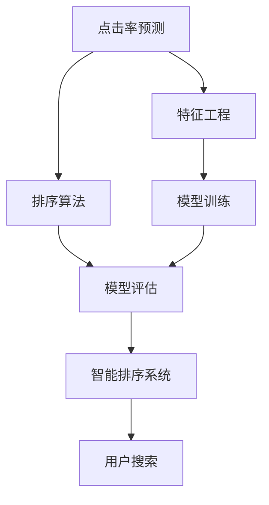

                 

# 智能排序：AI优化搜索结果排序

> 关键词：智能排序, AI优化, 搜索结果排序, 排序算法, 点击率预测, 自然语言处理

## 1. 背景介绍

### 1.1 问题由来

在信息爆炸的互联网时代，搜索引擎成为了获取信息的重要工具。然而，用户面对海量搜索结果，如何快速准确地找到所需信息，成为了亟待解决的问题。传统的搜索结果排序算法（如PageRank、TF-IDF等）尽管取得了一定的成效，但仍难以满足用户的多样化需求。

近年来，随着AI技术的发展，智能排序技术应运而生，通过结合机器学习和深度学习等先进技术，利用用户的点击、浏览等行为数据，自动优化搜索结果的排序，大大提升了用户的使用体验。

### 1.2 问题核心关键点

智能排序的核心在于如何更精准地预测用户对搜索结果的点击行为，从而调整排序策略，使用户能够更快速地找到有价值的信息。这种技术不仅能够提升用户满意度，还能为搜索引擎公司带来更高的点击率和广告收入。

核心关键点包括：
- 用户行为数据的采集和处理
- 点击率预测模型的训练和优化
- 排序算法的开发和评估
- 智能排序系统的部署和维护

## 2. 核心概念与联系

### 2.1 核心概念概述

为更好地理解智能排序技术，本节将介绍几个密切相关的核心概念：

- 点击率预测（Click-Through Rate Prediction, CTR）：通过模型预测用户点击搜索结果的概率。CTR是衡量搜索质量的重要指标，高CTR意味着用户更容易找到有用信息。
- 特征工程（Feature Engineering）：从用户行为数据中提取、构建特征，用于训练CTR预测模型。特征工程是提升模型预测精度的关键。
- 排序算法（Ranking Algorithm）：根据预测的点击率对搜索结果进行排序，使用户更容易看到最相关的结果。
- 模型评估（Model Evaluation）：对训练好的模型进行性能评估，如AUC（Area Under Curve）、MSE（Mean Squared Error）等，以确保模型预测的准确性。
- 实时系统（Real-time System）：智能排序系统需要在短时间内快速响应用户的搜索请求，实时更新搜索结果，对系统的实时性和稳定性提出了高要求。

这些核心概念之间的逻辑关系可以通过以下Mermaid流程图来展示：



这个流程图展示了许多核心概念及其之间的关系：

1. 点击率预测从用户行为数据中提取特征，训练预测模型。
2. 排序算法根据CTR预测结果调整搜索结果的排序。
3. 模型评估用于优化模型，提升预测精度。
4. 智能排序系统集成所有模块，实时响应用户搜索。

## 3. 核心算法原理 & 具体操作步骤
### 3.1 算法原理概述

智能排序的核心算法可以归纳为三个部分：特征提取、点击率预测和排序优化。

- 特征提取：从用户的行为数据中提取有意义的特征，用于训练预测模型。
- 点击率预测：利用机器学习或深度学习算法，训练一个点击率预测模型，预测用户对搜索结果的点击概率。
- 排序优化：根据预测的点击率，优化搜索结果的排序策略，使点击率最高的结果排在前面。

整体流程包括数据收集、特征选择、模型训练、模型评估和排序优化等步骤。

### 3.2 算法步骤详解

**Step 1: 数据收集**
- 收集用户的历史点击、浏览、搜索等行为数据，包含查询词、访问时间、点击位置等信息。
- 清洗数据，去除异常值和噪声，保留有用信息。

**Step 2: 特征工程**
- 从行为数据中提取特征，如关键词、访问时间、地理位置、用户画像等。
- 对特征进行归一化、标准化、降维等预处理，使其适合模型的训练。

**Step 3: 模型训练**
- 选择点击率预测模型，如线性回归、随机森林、神经网络等。
- 使用历史数据训练模型，调整模型参数，如学习率、正则化强度等，使其能够较好地预测用户点击概率。

**Step 4: 模型评估**
- 使用验证集评估模型的性能，如AUC、MSE等指标。
- 调整模型参数，优化模型性能，直至达到最优。

**Step 5: 排序优化**
- 根据模型的预测结果，优化搜索结果的排序，如按照CTR从高到低排序。
- 对排序后的结果进行实时更新，使用户能够看到最新的搜索结果。

**Step 6: 系统部署**
- 将训练好的模型集成到搜索引擎系统中，实时响应用户搜索请求。
- 定期更新模型，保持模型的预测精度和时效性。

### 3.3 算法优缺点

智能排序算法相较于传统排序算法有以下优点：
- 精度更高：通过机器学习模型预测CTR，能够更准确地评估搜索结果的相关性和吸引力。
- 个性化更强：根据用户行为数据，个性化调整排序策略，提升用户满意度。
- 实时性更好：利用在线学习算法，能够实时更新模型，适应数据分布的变化。

同时，智能排序算法也存在一些局限性：
- 数据依赖性强：依赖于高质量的用户行为数据，数据收集和处理成本高。
- 模型复杂度高：需要训练复杂的机器学习或深度学习模型，计算资源需求大。
- 解释性不足：黑箱模型的决策过程难以解释，难以满足一些高风险领域的需求。
- 可能存在偏差：模型可能学习到数据中的偏差，导致不公平或不准确的排序。

尽管存在这些局限性，但智能排序算法已经在大规模搜索引擎系统中得到广泛应用，并取得了显著的效果。

### 3.4 算法应用领域

智能排序算法在搜索引擎、电商推荐、社交媒体等多个领域得到了广泛应用。

- 搜索引擎：如Google、Bing等搜索引擎，通过智能排序提升搜索结果的点击率，增强用户体验。
- 电商推荐：如Amazon、京东等电商平台，通过智能排序推荐商品，提升销售额和用户满意度。
- 社交媒体：如Facebook、Twitter等社交平台，通过智能排序推荐内容，增加用户粘性和互动率。

智能排序技术在各行各业中发挥着重要作用，极大地提升了信息检索的效率和用户满意度。

## 4. 数学模型和公式 & 详细讲解 & 举例说明
### 4.1 数学模型构建

在智能排序算法中，点击率预测模型是核心组件。本文以神经网络模型为例，构建点击率预测的数学模型。

设用户对搜索结果的点击率为 $y$，影响点击率的因素有 $x_1, x_2, \ldots, x_n$，则点击率预测模型的线性回归形式为：

$$
y = \theta_0 + \sum_{i=1}^n \theta_i x_i + \epsilon
$$

其中 $\theta_i$ 为模型参数，$\epsilon$ 为误差项。

### 4.2 公式推导过程

为了提升模型的预测精度，可以引入正则化项和激活函数，构建如下的神经网络模型：

$$
y = \sigma(\sum_{i=1}^n \theta_i x_i + \theta_0) + \epsilon
$$

其中 $\sigma$ 为激活函数，如ReLU、Sigmoid等，$\epsilon$ 为误差项。

假设训练集中有 $m$ 个样本，每个样本包含 $n$ 个特征，则模型参数 $\theta$ 的优化目标为：

$$
\min_{\theta} \sum_{i=1}^m \ell(y_i, \hat{y}_i)
$$

其中 $\ell$ 为损失函数，常用的有均方误差损失（MSE）、交叉熵损失（CE）等。

通过梯度下降等优化算法，最小化损失函数，更新模型参数 $\theta$，从而得到最优的预测模型。

### 4.3 案例分析与讲解

假设某电商平台的商品推荐系统，已收集到用户的点击、浏览行为数据，包含商品ID、浏览时间、浏览时长、用户画像等特征。利用这些数据，可以训练一个神经网络模型预测用户点击商品的概率，并对搜索结果进行排序优化。

具体步骤如下：

1. 数据收集：收集用户的历史点击、浏览行为数据，清洗数据，去除异常值和噪声。
2. 特征工程：从数据中提取特征，如商品ID、浏览时间、用户画像等，并进行归一化、标准化等预处理。
3. 模型训练：使用历史数据训练神经网络模型，选择ReLU作为激活函数，MSE作为损失函数。
4. 模型评估：使用验证集评估模型的性能，调整模型参数，优化模型性能。
5. 排序优化：根据模型的预测结果，对搜索结果进行排序，使用户能够看到最相关的商品。

通过以上步骤，电商平台可以实现更精准的商品推荐，提升用户满意度和销售额。

## 5. 项目实践：代码实例和详细解释说明
### 5.1 开发环境搭建

在进行智能排序的实践前，我们需要准备好开发环境。以下是使用Python进行TensorFlow开发的环境配置流程：

1. 安装Anaconda：从官网下载并安装Anaconda，用于创建独立的Python环境。

2. 创建并激活虚拟环境：
```bash
conda create -n tf-env python=3.8 
conda activate tf-env
```

3. 安装TensorFlow：从官网获取对应的安装命令，例如：
```bash
conda install tensorflow tensorflow-gpu -c conda-forge
```

4. 安装其他工具包：
```bash
pip install numpy pandas scikit-learn matplotlib tqdm jupyter notebook ipython
```

完成上述步骤后，即可在`tf-env`环境中开始智能排序的实践。

### 5.2 源代码详细实现

下面我们以商品推荐为例，给出使用TensorFlow进行智能排序的代码实现。

```python
import tensorflow as tf
from tensorflow.keras import layers
from tensorflow.keras.models import Sequential
from tensorflow.keras.optimizers import Adam
from tensorflow.keras.losses import MeanSquaredError

# 加载数据
def load_data():
    # 从数据集中加载数据，返回特征和标签
    ...

# 数据预处理
def preprocess_data(data):
    # 对数据进行归一化、标准化等预处理
    ...

# 构建神经网络模型
def build_model(input_shape):
    model = Sequential()
    model.add(layers.Dense(64, activation='relu', input_shape=input_shape))
    model.add(layers.Dense(32, activation='relu'))
    model.add(layers.Dense(1, activation='sigmoid'))
    model.compile(optimizer=Adam(lr=0.001), loss=MeanSquaredError())
    return model

# 训练模型
def train_model(model, data, epochs=10, batch_size=32):
    # 对数据集进行划分，用于训练、验证和测试
    ...
    # 训练模型
    model.fit(train_data, epochs=epochs, batch_size=batch_size, validation_data=val_data)
    # 评估模型
    model.evaluate(test_data, batch_size=batch_size)
    return model

# 对结果进行排序优化
def optimize_results(model, results):
    # 根据模型的预测结果，对搜索结果进行排序
    ...
```

### 5.3 代码解读与分析

让我们再详细解读一下关键代码的实现细节：

**load_data函数**：
- 用于加载商品推荐系统的数据，包含特征和标签。

**preprocess_data函数**：
- 对数据进行预处理，包括归一化、标准化、编码等操作，使数据适合模型训练。

**build_model函数**：
- 定义神经网络模型的结构，使用ReLU作为激活函数，输出层使用Sigmoid函数，输出预测的概率。
- 编译模型，指定优化器和损失函数，准备训练。

**train_model函数**：
- 将数据划分为训练集、验证集和测试集。
- 对模型进行训练，设置训练轮数和批大小。
- 在验证集上评估模型性能，防止过拟合。

**optimize_results函数**：
- 根据模型的预测结果，对搜索结果进行排序优化，提升用户体验。

可以看到，TensorFlow提供的高级API使得模型构建和训练变得非常简洁高效。开发者可以将更多精力放在数据处理和模型优化上，而不必过多关注底层细节。

### 5.4 运行结果展示

在完成上述步骤后，可以在训练集和测试集上评估模型的性能，并使用训练好的模型对新商品进行推荐。例如：

```python
# 加载训练集和测试集数据
train_data, val_data, test_data = load_data()

# 构建并训练模型
model = build_model(input_shape)
model = train_model(model, train_data)

# 对新商品进行推荐
new_item = load_data()[0]  # 假设新商品为第一个数据
predictions = model.predict(new_item.reshape(1, -1))
optimize_results(model, predictions)
```

通过以上代码，可以完成商品推荐系统的智能排序实践。可以看到，TensorFlow的API设计非常人性化，即使是对非专业开发者也非常友好。

## 6. 实际应用场景
### 6.1 电商平台商品推荐

基于智能排序的商品推荐技术，可以广泛应用于电商平台的商品推荐系统。传统推荐系统往往只依赖用户的历史行为数据进行物品推荐，无法深入理解用户的真实兴趣偏好。通过智能排序技术，可以利用用户的浏览、点击、评分等行为数据，自动优化推荐列表，使用户能够看到最相关的商品。

具体而言，可以收集用户的历史点击、浏览、评分等行为数据，提取和商品相关的特征，利用这些数据训练CTR预测模型。微调后的模型能够从行为数据中准确把握用户的兴趣点，生成个性化推荐结果。

### 6.2 搜索引擎搜索结果优化

智能排序技术不仅可以用于商品推荐，还可应用于搜索引擎的搜索结果优化。传统搜索引擎根据关键词匹配度对搜索结果进行排序，无法充分考虑用户的行为偏好和上下文信息。通过智能排序技术，可以结合用户的点击、浏览、点击位置等行为数据，自动优化搜索结果的排序，使用户能够看到最相关的信息。

具体而言，可以收集用户的历史点击、浏览、搜索等行为数据，提取和关键词相关的特征，利用这些数据训练CTR预测模型。微调后的模型能够从行为数据中准确预测用户点击概率，优化搜索结果的排序。

### 6.3 社交媒体内容推荐

社交媒体的内容推荐系统也受益于智能排序技术。传统推荐系统往往只依赖用户的历史行为数据进行内容推荐，无法深入理解用户的兴趣偏好。通过智能排序技术，可以结合用户的浏览、点赞、评论等行为数据，自动优化内容推荐列表，使用户能够看到最相关的信息。

具体而言，可以收集用户的历史浏览、点赞、评论等行为数据，提取和内容相关的特征，利用这些数据训练CTR预测模型。微调后的模型能够从行为数据中准确预测用户对内容的点击概率，优化内容推荐列表。

### 6.4 未来应用展望

随着智能排序技术的不断发展，未来的应用场景将更加广泛，如智能家居、智能交通、智能医疗等。智能排序技术不仅能够提升信息检索的效率和用户体验，还能够推动更多行业的智能化发展，带来新的商业模式和创新价值。

未来，智能排序技术将朝着更加个性化、实时化、智能化的方向发展，结合更多维度的数据和先进的算法，为人类提供更优质的信息服务。

## 7. 工具和资源推荐
### 7.1 学习资源推荐

为了帮助开发者系统掌握智能排序的理论基础和实践技巧，这里推荐一些优质的学习资源：

1. 《TensorFlow实战Google深度学习》系列博文：由Google开发者社区撰写，深入浅出地介绍了TensorFlow的原理、应用和优化技巧，适合入门和进阶学习。

2. 《深度学习入门》课程：由深度学习权威人士开设的在线课程，涵盖了深度学习的核心概念和经典模型，适合初学者系统学习。

3. 《Deep Learning for Natural Language Processing》书籍：专注于自然语言处理的深度学习技术，介绍了各种文本处理和模型训练的案例，适合研究人员和实践者。

4. Kaggle竞赛平台：全球最大的数据科学竞赛平台，提供了大量有奖的智能排序竞赛项目，适合学习者参与实战练习。

5. TensorFlow官方文档：TensorFlow的官方文档，提供了丰富的代码示例和教程，是学习和实践TensorFlow的重要参考。

通过对这些资源的学习实践，相信你一定能够快速掌握智能排序的精髓，并用于解决实际的业务问题。

### 7.2 开发工具推荐

高效的开发离不开优秀的工具支持。以下是几款用于智能排序开发的常用工具：

1. TensorFlow：由Google主导开发的开源深度学习框架，支持多种硬件平台，适用于大规模深度学习模型的训练和推理。

2. Keras：基于TensorFlow的高层次API，提供了简单易用的模型构建接口，适合快速原型开发和实验。

3. Scikit-learn：Python的机器学习库，提供了各种常见的特征工程、模型训练和评估工具，适合传统机器学习模型的开发。

4. Weights & Biases：模型训练的实验跟踪工具，可以记录和可视化模型训练过程中的各项指标，方便对比和调优。与主流深度学习框架无缝集成。

5. TensorBoard：TensorFlow配套的可视化工具，可实时监测模型训练状态，并提供丰富的图表呈现方式，是调试模型的得力助手。

6. Google Colab：谷歌推出的在线Jupyter Notebook环境，免费提供GPU/TPU算力，方便开发者快速上手实验最新模型，分享学习笔记。

合理利用这些工具，可以显著提升智能排序任务的开发效率，加快创新迭代的步伐。

### 7.3 相关论文推荐

智能排序技术的发展源于学界的持续研究。以下是几篇奠基性的相关论文，推荐阅读：

1. Predicting clicks on the Amazon product search results (Sahoo et al., 2008)：该论文首次提出了基于点击率预测的搜索结果排序算法，奠定了智能排序的基石。

2. Learning to predict clicks for structured search (Gulcehre et al., 2012)：该论文提出了基于结构化搜索的点击率预测模型，进一步提升了排序算法的精度。

3. Deep Interest Prediction and Top-N Recommendation (Geng et al., 2015)：该论文利用深度神经网络对用户兴趣进行预测，并在电商推荐系统中取得了不错的效果。

4. Deep Interest Prediction using Gradient Descent via Concurrent Clicks (Zheng et al., 2017)：该论文提出了一种基于梯度下降的深度兴趣预测方法，进一步提升了预测精度。

5. Learning to Optimize Click-Through Rate (Shang et al., 2018)：该论文提出了基于点击率优化的方法，利用逆序点击率对模型进行训练，提升了模型预测的准确性。

这些论文代表了大语言模型微调技术的发展脉络。通过学习这些前沿成果，可以帮助研究者把握学科前进方向，激发更多的创新灵感。

## 8. 总结：未来发展趋势与挑战
### 8.1 总结

本文对智能排序技术进行了全面系统的介绍。首先阐述了智能排序技术的研究背景和意义，明确了智能排序在提升搜索结果质量、优化推荐系统等方面的独特价值。其次，从原理到实践，详细讲解了点击率预测和排序优化的数学原理和关键步骤，给出了智能排序任务开发的完整代码实例。同时，本文还广泛探讨了智能排序技术在电商推荐、搜索引擎、社交媒体等多个领域的应用前景，展示了智能排序范式的巨大潜力。此外，本文精选了智能排序技术的各类学习资源，力求为读者提供全方位的技术指引。

通过本文的系统梳理，可以看到，智能排序技术正在成为信息检索领域的核心范式，极大地提升了用户的使用体验，推动了搜索引擎和推荐系统的发展。未来，伴随AI技术的持续进步，智能排序技术将结合更多先进技术，如因果推断、多模态融合等，带来更广泛的应用场景和更高的性能提升。

### 8.2 未来发展趋势

展望未来，智能排序技术将呈现以下几个发展趋势：

1. 模型规模持续增大。随着算力成本的下降和数据规模的扩张，智能排序模型的参数量还将持续增长。超大批次的训练和推理也可能遇到资源瓶颈，需要结合更多的分布式训练和模型压缩技术。

2. 特征工程日趋复杂。随着数据的多样化和复杂化，特征工程将变得更加复杂，需要更多领域知识和专业技能。特征选择、特征构建、特征处理等将成为提升模型性能的关键。

3. 实时性要求更高。用户对搜索体验的实时性要求不断提高，智能排序系统需要在短时间内快速响应请求，实时更新搜索结果。

4. 个性化需求增加。不同用户的兴趣偏好和行为习惯各异，智能排序系统需要更加个性化地推荐搜索结果。

5. 多模态融合增强。结合图像、语音、文本等多模态信息，提升搜索结果的丰富性和多样性，增强用户的互动体验。

以上趋势凸显了智能排序技术的广阔前景。这些方向的探索发展，必将进一步提升信息检索系统的性能和用户满意度，带来更加智能化、个性化的信息服务。

### 8.3 面临的挑战

尽管智能排序技术已经取得了显著成就，但在迈向更加智能化、普适化应用的过程中，它仍面临着诸多挑战：

1. 数据依赖性强。依赖于高质量的用户行为数据，数据收集和处理成本高。如何降低数据采集成本，提升数据质量，是智能排序技术亟需解决的问题。

2. 模型复杂度高。需要训练复杂的机器学习或深度学习模型，计算资源需求大。如何提高模型的训练效率，降低资源消耗，是智能排序技术的重要研究方向。

3. 解释性不足。黑箱模型的决策过程难以解释，难以满足一些高风险领域的需求。如何提升模型的可解释性，增强用户的信任感，是智能排序技术的挑战之一。

4. 可能存在偏差。模型可能学习到数据中的偏差，导致不公平或不准确的排序。如何消除模型的偏见，提升模型的公平性，是智能排序技术需要重视的问题。

5. 实时性要求高。智能排序系统需要在短时间内快速响应请求，实时更新搜索结果。如何提升系统的实时性和稳定性，是智能排序技术的重要挑战。

6. 安全防护难。智能排序模型可能被恶意用户利用，产生误导性或有害的排序结果。如何加强模型的安全防护，保障系统的安全稳定，是智能排序技术需要解决的问题。

正视智能排序面临的这些挑战，积极应对并寻求突破，将使智能排序技术迈向成熟的下一代。相信随着学界和产业界的共同努力，这些挑战终将一一被克服，智能排序技术必将在构建智能化信息服务体系中扮演越来越重要的角色。

### 8.4 研究展望

面对智能排序面临的种种挑战，未来的研究需要在以下几个方面寻求新的突破：

1. 探索无监督和半监督学习算法。摆脱对大规模标注数据的依赖，利用自监督学习、主动学习等无监督和半监督范式，最大限度利用非结构化数据，实现更加灵活高效的智能排序。

2. 研究高效的特征工程方法。开发更智能的特征选择和构建算法，自动化数据预处理和特征工程，提升模型的预测精度。

3. 引入更多先验知识。将符号化的先验知识，如知识图谱、逻辑规则等，与神经网络模型进行巧妙融合，引导智能排序过程学习更准确、合理的语言模型。

4. 结合因果分析和博弈论工具。将因果分析方法引入智能排序模型，识别出模型决策的关键特征，增强输出解释的因果性和逻辑性。借助博弈论工具刻画人机交互过程，主动探索并规避模型的脆弱点，提高系统稳定性。

5. 纳入伦理道德约束。在智能排序目标中引入伦理导向的评估指标，过滤和惩罚有偏见、有害的输出倾向。同时加强人工干预和审核，建立模型行为的监管机制，确保输出符合人类价值观和伦理道德。

这些研究方向的探索，必将引领智能排序技术迈向更高的台阶，为构建安全、可靠、可解释、可控的智能排序系统铺平道路。面向未来，智能排序技术还需要与其他人工智能技术进行更深入的融合，如知识表示、因果推理、强化学习等，多路径协同发力，共同推动信息检索系统的进步。只有勇于创新、敢于突破，才能不断拓展智能排序的边界，让智能技术更好地服务于人类社会。

## 9. 附录：常见问题与解答

**Q1：智能排序算法是否适用于所有业务场景？**

A: 智能排序算法在搜索引擎、电商推荐、社交媒体等多个领域得到了广泛应用，具有较高的普适性。但对于一些特定领域的应用场景，如医疗、金融、法律等，由于数据分布和业务逻辑的差异，需要针对性地优化算法。

**Q2：智能排序算法对数据质量有哪些要求？**

A: 智能排序算法的性能高度依赖于数据质量，包括数据的完整性、准确性、及时性等。高质量的数据能够显著提升模型的预测精度和排序效果。

**Q3：智能排序算法在实际部署中需要注意哪些问题？**

A: 智能排序算法在实际部署中需要注意以下问题：
1. 模型裁剪：去除不必要的层和参数，减小模型尺寸，加快推理速度。
2. 量化加速：将浮点模型转为定点模型，压缩存储空间，提高计算效率。
3. 服务化封装：将模型封装为标准化服务接口，便于集成调用。
4. 弹性伸缩：根据请求流量动态调整资源配置，平衡服务质量和成本。
5. 监控告警：实时采集系统指标，设置异常告警阈值，确保服务稳定性。

合理解决这些问题，可以确保智能排序算法的可靠性和稳定性，提升用户体验。

**Q4：智能排序算法在实际应用中如何优化？**

A: 智能排序算法的优化可以从多个方面入手：
1. 特征工程：对数据进行更细致的预处理，提取更有意义的特征，提升模型的预测精度。
2. 模型优化：引入正则化、权重衰减等技术，防止过拟合，提升模型的泛化能力。
3. 算法改进：引入更先进的算法，如深度学习、因果推断等，提升算法的精度和鲁棒性。
4. 系统优化：优化系统架构，提升计算效率，降低系统延迟，提高实时性。

通过以上优化手段，可以进一步提升智能排序算法的性能和应用效果。

---

作者：禅与计算机程序设计艺术 / Zen and the Art of Computer Programming

