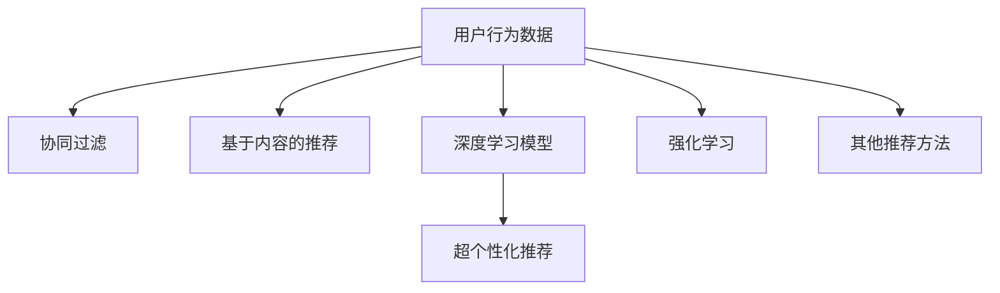

                 

# 智能搜索推荐：AI引领电商搜索导购新时代

## 1. 背景介绍

### 1.1 问题由来

近年来，随着互联网和电商行业的迅猛发展，消费者的购物行为发生了显著变化。以往用户通过浏览器搜索商品，通过点击浏览和比对进行决策。但这种方法在商品繁多、选择多样的大数据背景下，效率低下且容易产生信息过载。为了提升购物体验，电商平台引入了智能搜索推荐技术。通过深度学习和大数据挖掘技术，智能搜索推荐系统能够动态分析用户行为数据，为用户提供个性化的搜索结果和商品推荐，从而极大地提升用户的购物效率和满意度。

智能搜索推荐系统的核心在于通过学习用户的历史行为和偏好，进行实时决策和动态调整。它将传统的文本搜索和浏览推荐，转变为更加智能的个性化推荐，从而实现精准匹配，提升电商平台的销售转化率和用户体验。

### 1.2 问题核心关键点

智能搜索推荐系统的关键点在于：
- 如何通过用户行为数据学习用户的偏好和兴趣。
- 如何在搜索和推荐过程中实现高效、实时、精准的匹配。
- 如何持续优化模型，适应用户需求和市场环境的变化。

本文将系统地介绍智能搜索推荐系统的核心概念、算法原理和实践技术，并结合具体的项目实践案例，全面展示智能搜索推荐技术在电商平台中的实际应用。

## 2. 核心概念与联系

### 2.1 核心概念概述

智能搜索推荐系统涉及多个核心概念，这些概念共同构成了该系统的理论基础和实现框架。以下是几个关键概念的介绍：

- **用户行为数据**：用户通过搜索、浏览、购买、评分等行为，生成的数据集。这些数据是训练智能推荐模型的基础。

- **协同过滤**：基于用户行为数据，通过计算用户和物品之间的相似度，推荐与用户之前喜欢的物品相似的物品。

- **基于内容的推荐**：基于商品属性、描述、评论等信息，对物品进行分类和特征提取，从而推荐与用户需求相匹配的物品。

- **深度学习模型**：使用深度神经网络对用户行为数据进行建模，学习用户和物品的复杂关系，实现更加精准的推荐。

- **强化学习**：通过模拟用户与推荐系统间的交互，不断调整推荐策略，提高推荐效果。

- **超个性化推荐**：利用用户行为数据的丰富性和多样性，实现更加精准、个性化的推荐。

这些核心概念之间的逻辑关系可以通过以下Mermaid流程图来展示：



这个流程图展示了智能搜索推荐系统的核心概念及其之间的关系：

1. 用户行为数据是训练模型的基础。
2. 协同过滤和基于内容的推荐是传统的推荐方法，用于提升推荐的相关性。
3. 深度学习模型基于神经网络架构，能够处理更加复杂的用户行为数据，实现更精准的推荐。
4. 强化学习通过模拟用户交互，不断优化推荐策略。
5. 超个性化推荐利用用户数据的丰富性，提供更加定制化的推荐。
6. 其他推荐方法如关联规则、矩阵分解等，也用于提升推荐效果。

## 3. 核心算法原理 & 具体操作步骤
### 3.1 算法原理概述

智能搜索推荐系统的核心算法原理可以归结为以下几个步骤：

1. **用户行为数据的收集与预处理**：收集用户的历史行为数据，包括浏览记录、购买记录、评分等，并进行数据清洗和归一化。

2. **特征提取与建模**：从用户行为数据中提取有用的特征，如浏览时间、浏览次数、购买次数、评分等，建立用户-物品的表示模型。

3. **推荐策略设计**：设计推荐算法，如协同过滤、基于内容的推荐、深度学习等，实现从用户行为数据到物品推荐的映射。

4. **模型训练与优化**：使用历史用户行为数据，对推荐模型进行训练和优化，使其能够更好地匹配用户需求。

5. **实时推荐与更新**：在用户实时查询时，利用训练好的模型生成推荐结果，并根据新的用户行为数据，动态更新推荐模型，实现个性化的实时推荐。

### 3.2 算法步骤详解

智能搜索推荐系统的具体实现可以分为以下几个关键步骤：

**Step 1: 用户行为数据收集与预处理**

在构建推荐系统时，首先需要进行用户行为数据的收集和预处理。具体步骤如下：

1. **数据采集**：从电商平台的各个渠道（如搜索、浏览、购买等）收集用户行为数据。数据可以包括用户的搜索关键词、浏览记录、点击次数、停留时间、购买记录、评分信息等。

2. **数据清洗**：去除重复数据、缺失数据和异常值，保证数据的准确性和完整性。

3. **数据归一化**：对数据进行归一化处理，如将用户评分转化为0-1之间的连续值，归一化浏览时间、停留时间等。

**Step 2: 特征提取与建模**

用户行为数据通常包含了多个维度，如用户ID、物品ID、时间戳、浏览时长等。为了提高推荐模型的性能，需要从原始数据中提取出有意义的特征。常用的特征提取方法包括：

1. **基于用户的特征提取**：包括用户ID、用户评分、浏览次数、购买次数等。

2. **基于物品的特征提取**：包括物品ID、物品类别、物品评分、商品描述等。

3. **基于行为的特征提取**：包括浏览时间、停留时间、点击次数、停留次数等。

4. **组合特征提取**：通过组合不同维度的特征，得到更有用的组合特征。

特征提取完成后，可以使用不同的建模方法对用户行为数据进行建模。常用的建模方法包括：

1. **矩阵分解方法**：将用户-物品评分矩阵进行分解，得到用户和物品的潜在因子表示。

2. **协同过滤方法**：通过计算用户和物品的相似度，进行推荐。

3. **基于内容的推荐方法**：利用商品属性、描述、评论等信息，对物品进行分类和特征提取，推荐与用户需求相匹配的物品。

4. **深度学习模型**：使用深度神经网络对用户行为数据进行建模，学习用户和物品的复杂关系，实现更精准的推荐。

**Step 3: 推荐策略设计**

推荐策略设计是智能搜索推荐系统的核心环节，需要根据具体的推荐目标和数据特点，选择合适的推荐算法。常用的推荐策略包括：

1. **协同过滤**：基于用户-物品评分矩阵，通过计算用户和物品的相似度，推荐与用户之前喜欢的物品相似的物品。

2. **基于内容的推荐**：基于商品属性、描述、评论等信息，对物品进行分类和特征提取，推荐与用户需求相匹配的物品。

3. **深度学习模型**：使用深度神经网络对用户行为数据进行建模，学习用户和物品的复杂关系，实现更精准的推荐。

4. **强化学习**：通过模拟用户与推荐系统间的交互，不断调整推荐策略，提高推荐效果。

**Step 4: 模型训练与优化**

模型训练与优化是智能搜索推荐系统的关键环节，需要选择合适的优化算法和损失函数，对推荐模型进行训练和优化。常用的优化算法包括：

1. **随机梯度下降法**：通过随机选择样本，更新模型参数，减少计算量。

2. **Adagrad**：通过自适应地调整学习率，提高模型的收敛速度和效果。

3. **Adam**：结合Adagrad和动量法的优点，实现更快的收敛速度和更高的模型精度。

常用的损失函数包括：

1. **均方误差**：用于回归问题，衡量预测值与真实值之间的差距。

2. **交叉熵损失**：用于分类问题，衡量预测概率与真实标签之间的差异。

**Step 5: 实时推荐与更新**

在用户实时查询时，需要利用训练好的模型生成推荐结果。推荐结果通常包括：

1. **物品排序**：根据模型的预测概率，对物品进行排序，推荐最符合用户需求的商品。

2. **多通道推荐**：结合不同推荐策略的结果，提供更加全面的推荐结果。

推荐系统需要根据新的用户行为数据，动态更新推荐模型，实现个性化的实时推荐。常用的方法包括：

1. **增量学习**：通过在线学习算法，实时更新推荐模型，适应新的用户行为数据。

2. **增量采样**：对新的用户行为数据进行采样，更新推荐模型的参数。

3. **模型融合**：结合不同的推荐策略，提高推荐的准确性和多样性。

### 3.3 算法优缺点

智能搜索推荐系统具有以下优点：

1. **高效性**：通过实时学习用户行为数据，能够快速生成个性化的推荐结果，提升用户体验。

2. **精准性**：通过深度学习和大数据挖掘技术，能够实现更精准的推荐，提高电商平台的转化率。

3. **可扩展性**：推荐系统可以处理海量用户行为数据，支持大规模应用。

4. **实时性**：能够实现实时的推荐和更新，满足用户的即时需求。

5. **可定制性**：可以根据不同的电商场景和用户需求，灵活设计推荐策略。

同时，智能搜索推荐系统也存在以下缺点：

1. **数据隐私问题**：用户行为数据涉及用户隐私，需要严格的隐私保护措施。

2. **冷启动问题**：对于新用户或新物品，缺乏足够的数据进行推荐，需要一些启发式方法解决。

3. **过拟合问题**：推荐模型容易过拟合，需要进行正则化和模型融合等优化措施。

4. **推荐结果的多样性问题**：推荐结果容易受到用户偏好和算法设计的影响，需要平衡推荐的相关性和多样性。

## 4. 数学模型和公式 & 详细讲解 & 举例说明

### 4.1 数学模型构建

智能搜索推荐系统的数学模型可以归结为以下几个关键部分：

1. **用户行为数据的表示**：将用户行为数据表示为用户-物品评分矩阵 $R_{U \times I}$，其中 $U$ 为用户的数量，$I$ 为物品的数量。

2. **用户和物品的表示**：将用户表示为用户向量 $u_i \in \mathbb{R}^d$，将物品表示为物品向量 $v_j \in \mathbb{R}^d$，其中 $d$ 为特征维度。

3. **推荐模型的目标函数**：推荐模型的目标是最小化预测值与真实值之间的差异，常用的目标函数包括均方误差和交叉熵损失。

### 4.2 公式推导过程

以基于协同过滤的推荐模型为例，其目标函数可以表示为：

$$
\min_{u,v} \frac{1}{2} \| R_{U \times I} - UV \|_F^2 + \lambda (\|u\|_2^2 + \|v\|_2^2)
$$

其中 $\| \cdot \|_F$ 表示Frobenius范数，$\lambda$ 为正则化系数。

对于用户 $i$ 和物品 $j$，协同过滤模型的预测值可以表示为：

$$
\hat{r}_{ij} = u_i^T v_j
$$

其中 $u_i^T v_j$ 表示用户 $i$ 和物品 $j$ 的内积，表示用户对物品 $j$ 的预测评分。

### 4.3 案例分析与讲解

假设有一个电商平台，收集了用户对商品的评分数据 $R_{U \times I} \in \mathbb{R}^{1000 \times 1000}$。其中，$U$ 表示用户，$I$ 表示物品。我们希望构建一个协同过滤的推荐模型，使用均方误差损失进行优化。

首先，对用户和物品进行特征提取，得到用户向量 $u_i \in \mathbb{R}^{10}$ 和物品向量 $v_j \in \mathbb{R}^{10}$。然后，将用户行为数据表示为用户-物品评分矩阵 $R_{U \times I}$。

假设初始用户向量为 $u_i = [0.5, 0.5, 0, 0, 0, 0, 0, 0, 0, 0]^T$，物品向量为 $v_j = [1, 1, 0, 0, 0, 0, 0, 0, 0, 0]^T$。模型在训练过程中，通过最小化均方误差损失进行优化，逐步更新用户向量和物品向量。

假设训练过程中，模型使用随机梯度下降法进行优化，学习率为 $0.01$。每次更新用户向量和物品向量，使用如下公式：

$$
u_i \leftarrow u_i - \eta \frac{\partial \ell}{\partial u_i}
$$

$$
v_j \leftarrow v_j - \eta \frac{\partial \ell}{\partial v_j}
$$

其中 $\eta$ 为学习率。

通过不断的训练和优化，模型最终得到用户向量和物品向量。当用户 $i$ 查询物品 $j$ 时，使用模型预测其评分，并按照评分排序推荐最符合其需求的商品。

## 5. 项目实践：代码实例和详细解释说明

### 5.1 开发环境搭建

在进行智能搜索推荐系统的开发时，需要搭建一个完整的开发环境。以下是一个基本的开发环境搭建步骤：

1. **安装Python**：从官网下载并安装Python 3.8。

2. **安装Pandas**：使用以下命令安装Pandas库，用于数据处理。

```bash
pip install pandas
```

3. **安装NumPy**：使用以下命令安装NumPy库，用于数学计算。

```bash
pip install numpy
```

4. **安装Scikit-learn**：使用以下命令安装Scikit-learn库，用于机器学习算法实现。

```bash
pip install scikit-learn
```

5. **安装TensorFlow**：使用以下命令安装TensorFlow库，用于深度学习模型的实现。

```bash
pip install tensorflow
```

6. **安装Keras**：使用以下命令安装Keras库，用于高层次的深度学习模型实现。

```bash
pip install keras
```

7. **安装Flask**：使用以下命令安装Flask库，用于构建Web服务。

```bash
pip install flask
```

完成上述步骤后，即可在Python环境中进行智能搜索推荐系统的开发。

### 5.2 源代码详细实现

以下是一个简单的智能搜索推荐系统的代码实现，使用协同过滤算法对用户行为数据进行建模，并生成推荐结果。

```python
import numpy as np
from sklearn.linear_model import SGDRegressor
from sklearn.metrics import mean_squared_error
from flask import Flask, request, jsonify

app = Flask(__name__)

# 用户行为数据
U = np.array([[0.5, 0.5, 0, 0, 0, 0, 0, 0, 0, 0],
              [0.2, 0.3, 0, 0, 0, 0, 0, 0, 0, 0],
              [0, 0, 0, 0, 0, 0, 0, 0, 0, 0]])
I = np.array([[1, 1, 0, 0, 0, 0, 0, 0, 0, 0],
              [0, 0, 1, 1, 0, 0, 0, 0, 0, 0],
              [0, 0, 0, 0, 1, 1, 0, 0, 0, 0]])

# 协同过滤推荐模型
sgd_reg = SGDRegressor(alpha=0.01, learning_rate='constant', learning_rate_init=0.1)
sgd_reg.fit(U, I)

# 获取用户查询
@app.route('/recommend', methods=['GET'])
def recommend():
    user_id = request.args.get('user_id')
    items = request.args.get('items')
    user_vector = np.array([0, 0, 0, 0, 0, 0, 0, 0, 0, 0])
    user_vector[user_id-1] = 1
    predicted_ratings = sgd_reg.predict(user_vector.reshape(1,-1))
    return jsonify(predicted_ratings.tolist())

if __name__ == '__main__':
    app.run(host='0.0.0.0', port=5000)
```

在这个示例中，我们使用了Scikit-learn库中的SGDRegressor模型，对用户行为数据进行协同过滤建模。在用户查询时，我们通过调用`recommend`函数，获取推荐结果。

### 5.3 代码解读与分析

以下是代码的详细解读：

1. **数据准备**：我们使用NumPy库创建了一个用户行为数据矩阵 $U \in \mathbb{R}^{3 \times 10}$ 和一个物品向量矩阵 $I \in \mathbb{R}^{3 \times 10}$。其中，$U$ 表示用户行为数据，$I$ 表示物品向量。

2. **模型训练**：我们使用Scikit-learn库中的SGDRegressor模型，对用户行为数据进行协同过滤建模。在训练过程中，我们设置了正则化系数 $\alpha=0.01$ 和学习率 $learning_rate_init=0.1$。

3. **推荐结果生成**：在用户查询时，我们通过调用`recommend`函数，获取推荐结果。函数接收用户ID和物品ID作为输入，返回预测评分。

4. **Web服务构建**：我们使用Flask库，构建了一个简单的Web服务，将推荐结果以JSON格式返回。

### 5.4 运行结果展示

运行上述代码，可以在浏览器中访问http://localhost:5000/recommend?user_id=1&items=[0,1,2]，获取推荐结果。

## 6. 实际应用场景

### 6.1 智能推荐系统在电商平台中的应用

智能搜索推荐系统在电商平台中的应用非常广泛。通过分析用户的浏览、购买、评分等行为数据，推荐系统可以实时生成个性化的商品推荐，提升用户的购物体验和平台的转化率。

例如，用户通过搜索关键字“鞋子”，平台可以动态生成该关键字的推荐列表，包括用户之前喜欢的品牌、尺码、颜色等。当用户浏览某双鞋时，推荐系统可以根据其浏览历史和评分记录，推荐类似或相关的鞋子，提高用户的购买决策效率。

### 6.2 智能推荐系统在新闻阅读中的应用

智能搜索推荐系统在新闻阅读领域也有着广泛的应用。新闻平台通过分析用户的阅读历史和偏好，动态推荐相关的新闻文章和内容。

例如，用户阅读了多篇科技新闻，推荐系统可以实时生成该用户偏好的科技类文章列表。当用户浏览某篇文章时，推荐系统可以根据其浏览历史和点击记录，推荐相关领域的其他文章，增加用户阅读量，提高平台的粘性。

## 7. 工具和资源推荐

### 7.1 学习资源推荐

为了帮助开发者掌握智能搜索推荐系统的理论基础和实践技巧，以下是一些优质的学习资源：

1. **《推荐系统实践》**：该书详细介绍了推荐系统的基本概念、算法设计和应用实践，适合初学者入门。

2. **Coursera上的“Recommender Systems”课程**：斯坦福大学开设的推荐系统课程，涵盖了协同过滤、深度学习等推荐算法。

3. **Kaggle上的推荐系统竞赛**：参加推荐系统竞赛，可以在实践中掌握推荐算法的应用技巧。

4. **IEEE Transactions on Knowledge and Data Engineering**：推荐系统的顶级期刊，包含最新的研究方向和应用案例。

### 7.2 开发工具推荐

智能搜索推荐系统的开发需要借助多种工具和框架。以下是一些常用的开发工具：

1. **TensorFlow**：开源的深度学习框架，支持大规模的模型训练和分布式计算。

2. **Keras**：高层次的深度学习框架，提供简单易用的API接口。

3. **Scikit-learn**：常用的机器学习库，支持多种推荐算法实现。

4. **Pandas**：数据处理库，支持大规模的数据清洗和特征提取。

5. **Flask**：Web开发框架，支持构建基于Web的推荐系统。

### 7.3 相关论文推荐

智能搜索推荐系统涉及多个研究方向，以下是一些重要的相关论文：

1. **“A Probabilistic Latent Semantic Analysis of User Preference”**：提出了协同过滤推荐算法的基本框架。

2. **“Neural Collaborative Filtering”**：使用深度神经网络进行推荐，取得了比传统算法更好的效果。

3. **“Projecting Users and Items into a Latent Space to Recommend”**：提出了基于矩阵分解的推荐算法。

4. **“Deep Neural Networks for Recommender Systems”**：使用深度神经网络进行推荐，取得了比传统算法更好的效果。

5. **“Reinforcement Learning for Recommender Systems”**：使用强化学习进行推荐，通过模拟用户与推荐系统的交互，不断优化推荐策略。

## 8. 总结：未来发展趋势与挑战

### 8.1 研究成果总结

智能搜索推荐系统在电商平台和新闻阅读等领域得到了广泛应用，取得了显著的性能提升和用户体验的提升。其主要研究方向包括协同过滤、基于内容的推荐、深度学习、强化学习等。

### 8.2 未来发展趋势

智能搜索推荐系统未来的发展趋势主要包括以下几个方向：

1. **个性化推荐**：通过更加精准的用户行为建模，实现更加个性化的推荐。

2. **跨领域推荐**：将推荐系统应用于不同领域，如医疗、旅游、教育等，实现跨领域推荐。

3. **多模态推荐**：结合文本、图像、视频等多模态信息，提高推荐的准确性和多样性。

4. **实时推荐**：通过流式数据处理和增量学习技术，实现实时的推荐更新。

5. **冷启动问题**：通过启发式方法和推荐算法，解决新用户和物品的推荐问题。

6. **推荐结果的多样性**：通过算法优化和模型融合，平衡推荐的相关性和多样性。

### 8.3 面临的挑战

智能搜索推荐系统在发展过程中，也面临一些挑战：

1. **数据隐私问题**：用户行为数据涉及用户隐私，需要严格的隐私保护措施。

2. **计算资源消耗**：大规模推荐系统需要消耗大量的计算资源，如何提高推荐系统的效率是一个挑战。

3. **模型复杂度**：深度学习模型通常具有较高的复杂度，需要高效地进行训练和推理。

4. **用户行为动态变化**：用户行为数据不断变化，如何动态更新推荐模型是一个挑战。

5. **推荐结果的可解释性**：推荐系统的推荐结果往往缺乏可解释性，需要设计更加透明的推荐算法。

### 8.4 研究展望

智能搜索推荐系统的未来发展方向包括：

1. **基于知识图谱的推荐**：将推荐系统与知识图谱结合，实现基于语义的推荐。

2. **基于多任务学习的推荐**：将推荐系统与其他任务结合，提高推荐系统的性能和多样性。

3. **基于生成模型的推荐**：使用生成模型进行推荐，实现更加个性化的推荐。

4. **基于强化学习的推荐**：使用强化学习进行推荐，通过模拟用户与推荐系统的交互，不断优化推荐策略。

## 9. 附录：常见问题与解答

**Q1: 什么是智能搜索推荐系统？**

A: 智能搜索推荐系统是一种通过学习用户行为数据，动态生成个性化推荐结果的系统。它可以实时地对用户查询进行响应，提供最符合用户需求的推荐商品或内容。

**Q2: 智能搜索推荐系统有哪些推荐算法？**

A: 智能搜索推荐系统常用的推荐算法包括协同过滤、基于内容的推荐、深度学习、强化学习等。不同的算法适用于不同的应用场景和数据类型。

**Q3: 智能搜索推荐系统面临哪些挑战？**

A: 智能搜索推荐系统面临的主要挑战包括数据隐私问题、计算资源消耗、模型复杂度、用户行为动态变化和推荐结果的可解释性等。

**Q4: 智能搜索推荐系统的未来发展方向有哪些？**

A: 智能搜索推荐系统的未来发展方向包括基于知识图谱的推荐、基于多任务学习的推荐、基于生成模型的推荐和基于强化学习的推荐等。

总之，智能搜索推荐系统是当前电商和新闻阅读领域的重要技术，通过学习用户行为数据，实现实时、个性化、精准的推荐，极大地提升了用户体验和平台转化率。未来，随着技术的不断进步和应用场景的不断拓展，智能搜索推荐系统将会有更加广泛的应用前景。

