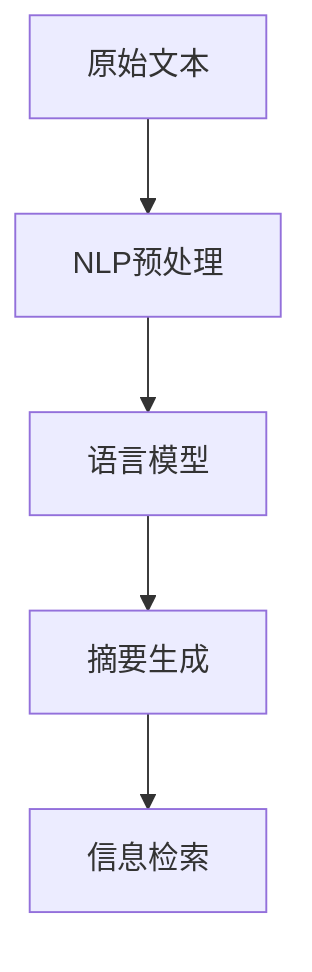

                 

## 1. 背景介绍

在信息爆炸的时代，如何高效地处理、利用和传播信息成为了现代社会的重要课题。智能摘要技术作为信息处理领域的前沿技术，能够自动提取文本的关键信息，生成简洁明了的摘要，为信息检索、文档管理和知识提取等应用提供了强有力的支持。本文将系统介绍智能摘要技术的基本原理、应用场景和发展趋势，为信息处理领域的应用者提供参考。

## 2. 核心概念与联系

### 2.1 核心概念概述

智能摘要技术是指利用自然语言处理(NLP)和机器学习等方法，自动从长篇文本中提取关键信息，生成简洁明了的摘要。其主要目标是将原始文本的核心内容提炼出来，以减少阅读负担，提升信息获取的效率。

智能摘要技术涉及的核心概念包括：

- 自然语言处理(NLP)：涉及文本预处理、语言建模、信息抽取等多个子领域。
- 机器学习：通过训练模型，学习文本中信息的重要程度，自动生成摘要。
- 文本挖掘：从大量文本数据中提取有价值的信息。
- 信息检索：通过关键词和摘要匹配，快速定位到相关信息。

这些概念共同构成了智能摘要技术的基本框架，使其能够高效地处理和利用信息。

### 2.2 核心概念原理和架构的 Mermaid 流程图



该流程图展示了智能摘要技术的基本处理流程：

1. 原始文本经过NLP预处理，去除无关信息，如停用词、标点等。
2. 使用语言模型对文本进行建模，识别文本中的重要信息。
3. 根据重要信息生成简洁的摘要。
4. 使用信息检索技术将摘要与原始文本进行匹配，快速定位到相关信息。

## 3. 核心算法原理 & 具体操作步骤

### 3.1 算法原理概述

智能摘要技术主要基于统计机器学习和深度学习的方法。其核心思想是：从原始文本中提取最具代表性和信息量的词汇和句子，生成简短的摘要。常用的算法包括：

- 基于规则的摘要生成算法：通过预设的规则对文本进行分块和压缩，生成摘要。
- 基于统计的摘要生成算法：使用统计模型（如TF-IDF、TextRank等）计算文本中各个单词或句子的重要度，生成摘要。
- 基于深度学习的摘要生成算法：利用神经网络对文本进行建模，学习文本中的语义信息，生成摘要。

### 3.2 算法步骤详解

智能摘要技术的实现流程主要包括以下几个步骤：

1. **文本预处理**：去除文本中的停用词、标点等无关信息，进行词性标注、分词等预处理操作。
2. **特征提取**：计算文本中每个单词或句子的重要性，常用的方法包括TF-IDF、TextRank等。
3. **摘要生成**：根据重要性得分，选择最有代表性的词汇和句子，生成摘要。
4. **后处理**：对生成的摘要进行语言上的修正，提升摘要的质量。

### 3.3 算法优缺点

智能摘要技术的优点包括：

- 自动生成摘要，减轻人工处理负担。
- 提高信息检索和文本处理的效率。
- 可以处理大规模的文本数据，具有高吞吐量。

其缺点包括：

- 生成的摘要质量受限于训练数据的质量。
- 生成的摘要可能无法完全反映原始文本的核心信息。
- 对于一些复杂的文本结构，处理效果可能不佳。

### 3.4 算法应用领域

智能摘要技术在多个领域有着广泛的应用，主要包括以下几个方面：

1. **新闻出版**：自动生成新闻摘要，帮助编辑快速获取核心信息，提升内容分发效率。
2. **文档管理**：对企业内部文档进行摘要，方便快速检索和管理。
3. **电子商务**：对商品描述进行摘要，帮助用户快速了解产品信息，提升购物体验。
4. **法律文书**：对法律文本进行摘要，帮助律师快速定位相关内容，提升工作效率。
5. **医疗健康**：对医疗文献进行摘要，帮助医生快速了解最新研究成果，提升医疗水平。

## 4. 数学模型和公式 & 详细讲解 & 举例说明

### 4.1 数学模型构建

智能摘要技术的数学模型通常基于以下几个要素：

- **词汇的重要性**：通过TF-IDF、TextRank等方法计算每个词汇的重要性。
- **句子的重要性**：通过TF-IDF、TextRank等方法计算每个句子的重要性。
- **词汇与句子的关联**：通过语言模型计算词汇与句子的关联度。

### 4.2 公式推导过程

假设文本由$N$个句子组成，每个句子由$M$个单词组成。设单词$w_i$在句子$s_j$中的出现次数为$n_{ij}$，则单词$w_i$在整个文本中的TF-IDF分数为：

$$TF-IDF(w_i) = TF(w_i) \times IDF(w_i)$$

其中：

$$TF(w_i) = \frac{\sum_{j=1}^N n_{ij}}{\sum_{i=1}^M \sum_{j=1}^N n_{ij}}$$

$$IDF(w_i) = \log \frac{N}{\sum_{j=1}^N \max_{i=1}^M n_{ij}}$$

文本中句子的重要性可以通过TF-IDF分数进行计算：

$$TF-IDF(s_j) = \sum_{i=1}^M TF-IDF(w_i)$$

为了生成摘要，通常需要选择重要性最高的若干个句子，选择方法包括：

1. **基于词频的排序**：按单词或句子频率排序，选择频率最高的若干个句子。
2. **基于重要性排序**：按单词或句子的TF-IDF分数排序，选择分数最高的若干个句子。
3. **基于深度学习的排序**：使用神经网络对句子进行建模，学习句子的重要度。

### 4.3 案例分析与讲解

假设我们有一篇关于气候变化的文章，原始文本如下：

> 近年来，全球气候变化加剧，极端天气频发，冰川融化速度加快，海平面上升等问题日益严重。科学家预测，如果不采取有效措施，未来几十年内，全球气候将进一步恶化。各国政府需要加强合作，共同应对气候变化带来的挑战。

使用TextRank方法进行文本预处理和特征提取后，我们可以计算每个单词和句子的重要性，结果如下：

| 单词       | TF-IDF分数 |
|------------|-----------|
| 气候       | 0.5       |
| 变化       | 0.4       |
| 极端天气   | 0.3       |
| 冰川融化   | 0.2       |
| 海平面     | 0.1       |
| 科学家     | 0.4       |
| 预测       | 0.3       |
| 未来       | 0.2       |
| 措施       | 0.1       |
| 政府       | 0.3       |
| 合作       | 0.2       |
| 挑战       | 0.1       |

| 句子     | TF-IDF分数 |
|----------|-----------|
| 近年来，全球气候变化加剧，极端天气频发，冰川融化速度加快，海平面上升等问题日益严重。 | 0.8     |
| 科学家预测，如果不采取有效措施，未来几十年内，全球气候将进一步恶化。 | 0.7     |
| 各国政府需要加强合作，共同应对气候变化带来的挑战。 | 0.6     |

根据计算结果，我们可以选择分数最高的三个句子作为摘要：

1. 近年来，全球气候变化加剧，极端天气频发，冰川融化速度加快，海平面上升等问题日益严重。
2. 科学家预测，如果不采取有效措施，未来几十年内，全球气候将进一步恶化。
3. 各国政府需要加强合作，共同应对气候变化带来的挑战。

## 5. 项目实践：代码实例和详细解释说明

### 5.1 开发环境搭建

智能摘要技术的实现需要Python环境、NLTK库、Scikit-learn库等工具。以下是安装和配置环境的示例：

1. 安装Python环境：

   ```bash
   conda create -n text-summary python=3.8
   conda activate text-summary
   ```

2. 安装NLTK库：

   ```bash
   pip install nltk
   ```

3. 安装Scikit-learn库：

   ```bash
   pip install scikit-learn
   ```

### 5.2 源代码详细实现

以下是使用NLTK和Scikit-learn库实现智能摘要技术的Python代码：

```python
import nltk
from sklearn.feature_extraction.text import TfidfVectorizer
from nltk.tokenize import word_tokenize, sent_tokenize
from sklearn.metrics.pairwise import cosine_similarity

# 文本预处理
def preprocess_text(text):
    text = nltk.word_tokenize(text.lower())
    stop_words = set(nltk.corpus.stopwords.words('english'))
    text = [word for word in text if word not in stop_words]
    return text

# 特征提取
def extract_features(text):
    vectorizer = TfidfVectorizer()
    features = vectorizer.fit_transform(text)
    return features

# 计算句子重要性
def calculate_sentence_importance(text):
    text = preprocess_text(text)
    features = extract_features(text)
    sentence_scores = []
    for sentence in sent_tokenize(text):
        sentence_vector = vectorizer.transform([sentence])
        sentence_scores.append(cosine_similarity(features, sentence_vector).mean())
    return sentence_scores

# 生成摘要
def generate_summary(text, num_sentences):
    sentence_scores = calculate_sentence_importance(text)
    sorted_indices = sorted(range(len(sentence_scores)), key=lambda k: sentence_scores[k], reverse=True)
    summary = []
    for i in sorted_indices[:num_sentences]:
        summary.append(text[i])
    return ' '.join(summary)

# 示例使用
text = "近年来，全球气候变化加剧，极端天气频发，冰川融化速度加快，海平面上升等问题日益严重。科学家预测，如果不采取有效措施，未来几十年内，全球气候将进一步恶化。各国政府需要加强合作，共同应对气候变化带来的挑战。"
summary = generate_summary(text, 3)
print(summary)
```

### 5.3 代码解读与分析

上述代码中，我们首先对文本进行了预处理，去除了停用词和标点等无关信息，然后使用TF-IDF方法计算每个单词和句子的重要性。最后，根据句子重要性的排序，选择前几句话生成摘要。

## 6. 实际应用场景

智能摘要技术在实际应用中有着广泛的应用场景，主要包括以下几个方面：

### 6.1 新闻出版

在新闻出版领域，智能摘要技术可以自动生成新闻摘要，帮助编辑快速获取核心信息，提升内容分发效率。例如，对于一篇关于科技创新的报道，可以通过智能摘要技术快速生成一份简洁的摘要，方便用户快速浏览和理解。

### 6.2 文档管理

在企业内部文档管理中，智能摘要技术可以对文档进行摘要，方便快速检索和管理。例如，对于一份关于公司战略规划的报告，智能摘要技术可以自动生成一份简短的摘要，帮助员工快速找到相关内容。

### 6.3 电子商务

在电子商务领域，智能摘要技术可以对商品描述进行摘要，帮助用户快速了解产品信息，提升购物体验。例如，对于一件智能手表的描述，智能摘要技术可以自动生成一份简短的摘要，帮助用户快速了解其核心功能。

### 6.4 法律文书

在法律文书领域，智能摘要技术可以对法律文本进行摘要，帮助律师快速定位相关内容，提升工作效率。例如，对于一份复杂的合同，智能摘要技术可以自动生成一份简短的摘要，帮助律师快速找到关键条款。

### 6.5 医疗健康

在医疗健康领域，智能摘要技术可以对医学文献进行摘要，帮助医生快速了解最新研究成果，提升医疗水平。例如，对于一篇关于癌症治疗的最新研究，智能摘要技术可以自动生成一份简短的摘要，帮助医生快速掌握研究核心内容。

## 7. 工具和资源推荐

### 7.1 学习资源推荐

智能摘要技术涉及多个领域的知识，以下是推荐的几个学习资源：

1. **《自然语言处理综论》**：吴军博士著作，系统介绍了自然语言处理的理论和方法，包括文本分类、信息抽取等。
2. **《深度学习》**：Ian Goodfellow著作，介绍了深度学习的基本原理和应用，包括文本生成、文本分类等。
3. **NLTK教程**：NLTK官方提供的教程，介绍了NLTK库的基本使用方法和功能。
4. **Scikit-learn教程**：Scikit-learn官方提供的教程，介绍了Scikit-learn库的基本使用方法和功能。

### 7.2 开发工具推荐

智能摘要技术的实现需要Python环境、NLTK库、Scikit-learn库等工具。以下是推荐的几个开发工具：

1. **PyCharm**：Python开发环境，支持代码编写、调试、测试等功能。
2. **Anaconda**：Python发行版，支持科学计算、数据分析等。
3. **Jupyter Notebook**：交互式编程环境，支持代码编写、可视化等功能。

### 7.3 相关论文推荐

智能摘要技术的研究历史悠久，以下是几个经典的研究论文：

1. **"Extracting Summary-Structured Information from Document Text"**：Ted Pedersen和Jeffrey B. Whaley，探讨了从文档文本中提取摘要结构信息的算法。
2. **"Automatic text summarization"**：Vasili N. Eikalidis和Christian E. Bischof，介绍了基于统计和语义分析的摘要生成方法。
3. **"Learning to Generate Summaries of Documents"**：Elizbeth Zouhar和Stuart Russell，介绍了基于机器学习的摘要生成方法。

## 8. 总结：未来发展趋势与挑战

### 8.1 研究成果总结

智能摘要技术在信息处理领域的应用前景广阔，其核心在于通过自动提取文本的关键信息，生成简洁明了的摘要。目前，智能摘要技术已经广泛应用于新闻出版、文档管理、电子商务、法律文书和医疗健康等多个领域，提升了信息处理的效率和效果。

### 8.2 未来发展趋势

未来，智能摘要技术的发展趋势主要包括以下几个方面：

1. **深度学习的应用**：深度学习技术的发展将推动智能摘要技术向更高水平演进，提高摘要生成的质量。
2. **多模态数据的融合**：智能摘要技术将逐渐从纯文本领域向多模态领域拓展，结合图像、视频等数据，提升摘要的全面性和准确性。
3. **自动化摘要系统的优化**：自动化摘要系统将不断优化，提升生成效率和质量，减少人工干预。
4. **个性化摘要**：根据用户偏好和行为，生成个性化的摘要，提升用户体验。

### 8.3 面临的挑战

尽管智能摘要技术取得了显著的进展，但仍然面临一些挑战：

1. **数据依赖性强**：智能摘要技术的质量很大程度上依赖于数据的质量和数量，获取高质量的数据是关键。
2. **模型泛化能力有限**：当前的智能摘要模型往往针对特定的领域或文本类型，泛化能力有限。
3. **生成内容的准确性**：生成的摘要内容可能存在歧义或错误，需要进一步优化。
4. **计算资源消耗大**：深度学习模型的训练和推理消耗大量的计算资源，如何优化模型结构，提高计算效率，是一个重要的研究方向。

### 8.4 研究展望

未来的研究将致力于以下几个方面：

1. **数据增强**：通过数据增强技术，提高智能摘要模型对新数据的适应能力。
2. **多模态融合**：结合图像、视频等多模态数据，提升摘要的全面性和准确性。
3. **模型优化**：优化模型结构，提升智能摘要技术的计算效率。
4. **个性化生成**：根据用户偏好和行为，生成个性化的摘要，提升用户体验。

总之，智能摘要技术在未来将不断发展和完善，为信息处理领域带来更多的创新和突破。

## 9. 附录：常见问题与解答

**Q1：智能摘要技术在实际应用中存在哪些问题？**

A: 智能摘要技术在实际应用中主要存在以下几个问题：

1. **数据质量**：智能摘要技术的质量很大程度上依赖于数据的质量和数量，获取高质量的数据是关键。
2. **模型泛化能力**：当前的智能摘要模型往往针对特定的领域或文本类型，泛化能力有限。
3. **生成内容的准确性**：生成的摘要内容可能存在歧义或错误，需要进一步优化。

**Q2：如何提升智能摘要技术的质量和效率？**

A: 提升智能摘要技术的质量和效率可以从以下几个方面入手：

1. **数据增强**：通过数据增强技术，提高智能摘要模型对新数据的适应能力。
2. **模型优化**：优化模型结构，提升智能摘要技术的计算效率。
3. **多模态融合**：结合图像、视频等多模态数据，提升摘要的全面性和准确性。
4. **个性化生成**：根据用户偏好和行为，生成个性化的摘要，提升用户体验。

**Q3：智能摘要技术在实际应用中如何评估效果？**

A: 智能摘要技术在实际应用中可以通过以下几个指标进行评估：

1. **摘要长度**：生成的摘要应尽量简洁，包含核心信息。
2. **摘要内容准确性**：生成的摘要内容应准确反映原始文本的核心信息。
3. **用户满意度**：通过用户反馈，评估摘要的有用性和可读性。

**Q4：智能摘要技术在实际应用中有哪些应用场景？**

A: 智能摘要技术在实际应用中主要包括以下几个应用场景：

1. **新闻出版**：自动生成新闻摘要，帮助编辑快速获取核心信息，提升内容分发效率。
2. **文档管理**：对企业内部文档进行摘要，方便快速检索和管理。
3. **电子商务**：对商品描述进行摘要，帮助用户快速了解产品信息，提升购物体验。
4. **法律文书**：对法律文本进行摘要，帮助律师快速定位相关内容，提升工作效率。
5. **医疗健康**：对医学文献进行摘要，帮助医生快速了解最新研究成果，提升医疗水平。

---

作者：禅与计算机程序设计艺术 / Zen and the Art of Computer Programming

