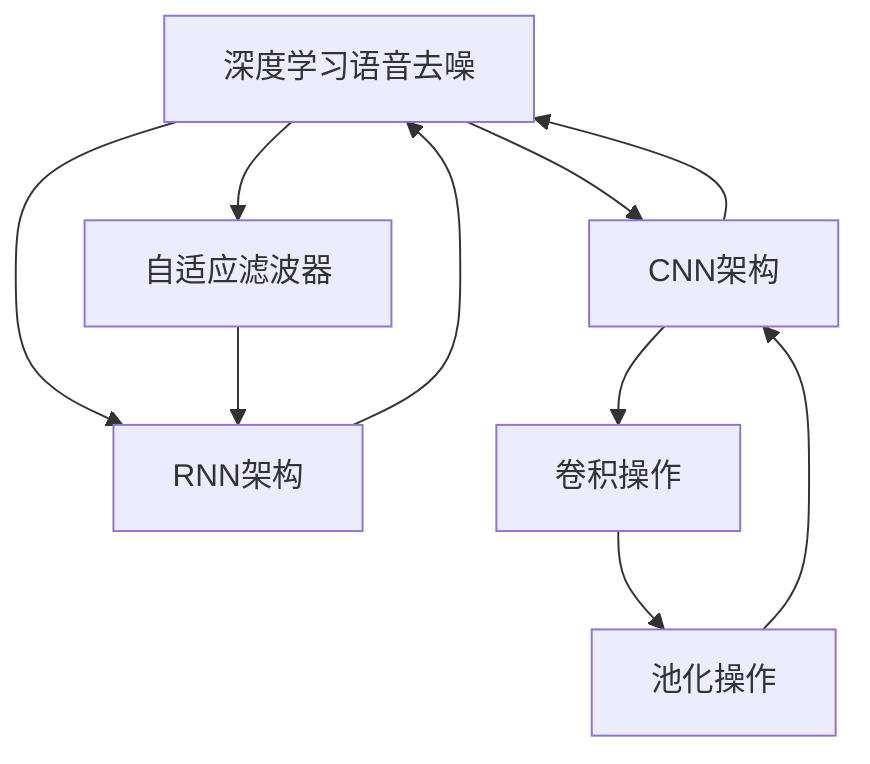

                 

# 智能语音去噪原理与方法

> 关键词：智能语音去噪,噪声抑制,语音增强,滤波器,深度学习,卷积神经网络(CNN),循环神经网络(RNN),自适应滤波器(Adaptive Filter)

## 1. 背景介绍

### 1.1 问题由来

语音信号由于环境噪声的干扰，常常存在噪声污染，从而影响语音信号的质量，甚至无法理解。如何有效去除语音信号中的噪声，一直是语音处理领域的难题之一。传统方法主要包括基于时频变换的频域滤波器法、时域滤波器法等，但这些方法往往存在频谱泄漏、时域模糊等问题。近年来，深度学习技术的迅猛发展为语音去噪提供了新的思路和解决方案。

深度学习技术通过构建多层非线性神经网络，利用丰富的数据资源，可以自适应地学习噪声的特征，并去除语音信号中的噪声。深度学习语音去噪方法主要有基于卷积神经网络(CNN)和循环神经网络(RNN)两种架构，其中卷积神经网络架构结构简单、易于实现，是常用的语音去噪模型。

### 1.2 问题核心关键点

本节将重点讨论深度学习语音去噪技术的关键问题，包括：

- 什么是深度学习语音去噪技术？
- 其核心算法原理是什么？
- 如何选择合适的模型架构？
- 如何进行参数优化？
- 如何评估模型性能？
- 未来发展趋势和面临的挑战有哪些？

## 2. 核心概念与联系

### 2.1 核心概念概述

为更好地理解深度学习语音去噪技术，本节将介绍几个关键概念：

- 深度学习语音去噪技术：指利用深度神经网络对语音信号进行处理，去除其中的噪声，恢复语音信号的质量。
- 卷积神经网络(CNN)：一种前馈神经网络，主要应用于图像处理和语音信号处理等任务，通过卷积、池化等操作提取特征。
- 循环神经网络(RNN)：一种递归神经网络，适用于处理序列数据，如语音信号，能够记忆和处理序列数据的时序信息。
- 自适应滤波器(Adaptive Filter)：一种动态调整的滤波器，适用于噪声抑制和语音增强等任务，能够自适应地调整滤波器系数。
- 语音增强：指提高语音信号的清晰度和可理解性，去除其中的噪声干扰，提升语音信号的语音质量。

这些概念之间的逻辑关系可以通过以下Mermaid流程图来展示：



这个流程图展示了大语言模型微调的逻辑关系：

1. 深度学习语音去噪技术涉及多种架构和滤波器，包括卷积神经网络、循环神经网络和自适应滤波器。
2. 卷积神经网络通过卷积和池化操作提取语音信号的特征。
3. 循环神经网络能够处理序列数据，适用于语音信号的时序信息。
4. 自适应滤波器能够动态调整滤波器系数，适应不同噪声环境。

这些概念共同构成了深度学习语音去噪的核心技术，使得模型能够高效、精确地去除语音信号中的噪声，提升语音信号的质量。

## 3. 核心算法原理 & 具体操作步骤
### 3.1 算法原理概述

深度学习语音去噪技术主要基于卷积神经网络架构。其核心思想是通过卷积和池化操作提取语音信号的特征，构建特征空间，通过全连接层将特征映射到去噪后的语音信号上。具体而言，卷积神经网络去噪过程可以分为两个步骤：特征提取和特征映射。

**特征提取**：通过卷积操作提取语音信号的时域特征，如短时能量、过零率等，将这些特征映射到高维特征空间，增强特征表达能力。

**特征映射**：利用全连接层将特征空间映射到去噪后的语音信号，实现语音去噪。

### 3.2 算法步骤详解

深度学习语音去噪技术的具体步骤包括以下几个关键步骤：

**Step 1: 准备数据集**

准备语音去噪任务的训练数据集，通常包括有噪声的语音信号和相应的干净语音信号。数据集的划分应包括训练集、验证集和测试集，以评估模型的性能。

**Step 2: 搭建模型**

选择卷积神经网络作为语音去噪模型，并搭建模型架构。卷积神经网络包括卷积层、池化层和全连接层。卷积层通过卷积操作提取特征，池化层通过池化操作缩小特征空间，全连接层将特征映射到去噪后的语音信号上。

**Step 3: 初始化模型**

对模型进行初始化，设置损失函数和优化器。常用的损失函数包括均方误差(MSE)、信噪比(SNR)等，常用的优化器包括Adam、SGD等。

**Step 4: 训练模型**

将数据集输入模型，进行前向传播和反向传播，更新模型参数。训练过程中应设置合适的学习率、批大小、迭代轮数等超参数，以避免过拟合和欠拟合。

**Step 5: 测试和评估**

在测试集上对模型进行测试，评估去噪后的语音信号的质量。常用的评估指标包括SNR、过零率、短时能量等，以衡量模型的性能。

### 3.3 算法优缺点

深度学习语音去噪技术具有以下优点：

1. 自适应性强：深度学习模型可以自适应地学习噪声特征，适用于各种噪声环境。
2. 精度高：深度学习模型能够提取丰富的语音特征，提升去噪效果。
3. 泛化能力强：深度学习模型在处理不同噪声类型和不同长度的语音信号时表现出色。

同时，深度学习语音去噪技术也存在一些缺点：

1. 模型复杂：深度学习模型参数较多，训练和推理过程较复杂。
2. 训练数据量大：深度学习模型需要大量的标注数据，训练过程较耗时。
3. 存在过拟合风险：深度学习模型容易过拟合训练数据，需要设置合适的正则化技术。

### 3.4 算法应用领域

深度学习语音去噪技术广泛应用于以下几个领域：

1. 智能家居：智能家居设备如智能音箱、智能电视等，需要清晰、准确的语音信号，以实现自然语音交互。
2. 车载系统：车载系统如车载导航、车载智能助理等，需要高质量的语音信号，以提高系统的可靠性和用户体验。
3. 医疗健康：医疗健康领域如智能语音助手、语音识别设备等，需要准确、清晰的语音信号，以提高诊断和护理的效率。
4. 安全监控：安全监控系统如智能门禁、智能监控设备等，需要高质量的语音信号，以提高系统的安全性和准确性。

## 4. 数学模型和公式 & 详细讲解 & 举例说明

### 4.1 数学模型构建

本节将使用数学语言对深度学习语音去噪技术的数学模型进行更加严格的刻画。

设语音信号为 $x(t)$，噪声信号为 $n(t)$，则带噪声的语音信号为 $y(t)=x(t)+n(t)$。假设 $x(t)$ 和 $n(t)$ 均为高斯分布，且方差分别为 $\sigma_x^2$ 和 $\sigma_n^2$。

语音去噪的目标是将带噪声的语音信号 $y(t)$ 还原为干净语音信号 $x(t)$。

### 4.2 公式推导过程

以基于卷积神经网络的去噪模型为例，推导模型的训练过程。

**Step 1: 特征提取**

将带噪声的语音信号 $y(t)$ 输入卷积神经网络，提取特征。设卷积神经网络的卷积层为 $H^l(x)$，池化层为 $P^l(x)$，则经过 $L$ 层卷积和池化操作后，特征表示为 $Z_L = H^L(P^{L-1}(...(H^1(P^0(x))))$。

**Step 2: 特征映射**

将特征 $Z_L$ 映射到干净语音信号 $x(t)$ 上。设全连接层为 $G(x)$，则去噪后的语音信号 $x_{\text{rec}}(t)$ 为：

$$
x_{\text{rec}}(t) = G(Z_L)
$$

**Step 3: 损失函数和优化器**

常用的损失函数为均方误差，定义如下：

$$
L = \frac{1}{T} \sum_{t=1}^T (x_{\text{rec}}(t) - x(t))^2
$$

其中 $T$ 为语音信号的长度。常用的优化器为Adam或SGD，用于更新模型参数。

### 4.3 案例分析与讲解

假设我们有一个长度为 $T$ 的带噪声语音信号 $y(t)$，使用一个3层的卷积神经网络进行去噪。卷积层的大小为 $3 \times 3$，步长为 $1$，激活函数为ReLU。池化层的大小为 $2 \times 2$，步长为 $2$，池化方式为最大池化。

**Step 1: 特征提取**

将带噪声语音信号 $y(t)$ 输入第一层卷积层，提取特征 $H^1(y(t))$，再输入池化层，得到 $P^1(H^1(y(t)))$。重复以上操作，得到特征 $Z_L = H^L(P^{L-1}(...(H^1(P^0(y(t)))))$。

**Step 2: 特征映射**

将特征 $Z_L$ 输入全连接层 $G(x)$，得到去噪后的语音信号 $x_{\text{rec}}(t) = G(Z_L)$。

**Step 3: 损失函数和优化器**

假设我们得到一个干净的语音信号 $x(t)$，计算均方误差损失 $L = \frac{1}{T} \sum_{t=1}^T (x_{\text{rec}}(t) - x(t))^2$，使用Adam优化器更新模型参数。

## 5. 项目实践：代码实例和详细解释说明

### 5.1 开发环境搭建

在进行语音去噪实践前，我们需要准备好开发环境。以下是使用Python进行PyTorch开发的环境配置流程：

1. 安装Anaconda：从官网下载并安装Anaconda，用于创建独立的Python环境。

2. 创建并激活虚拟环境：
```bash
conda create -n pytorch-env python=3.8 
conda activate pytorch-env
```

3. 安装PyTorch：根据CUDA版本，从官网获取对应的安装命令。例如：
```bash
conda install pytorch torchvision torchaudio cudatoolkit=11.1 -c pytorch -c conda-forge
```

4. 安装TensorFlow：
```bash
pip install tensorflow==2.6.0
```

5. 安装各类工具包：
```bash
pip install numpy pandas scikit-learn matplotlib tqdm jupyter notebook ipython
```

完成上述步骤后，即可在`pytorch-env`环境中开始语音去噪实践。

### 5.2 源代码详细实现

下面我们以基于卷积神经网络的语音去噪为例，给出使用PyTorch进行语音去噪的代码实现。

首先，定义语音去噪任务的训练函数：

```python
import torch
import torch.nn as nn
import torch.optim as optim
import torch.nn.functional as F
from torch.utils.data import DataLoader, Dataset
from torchvision.transforms import Compose, ToTensor

class AudioDataset(Dataset):
    def __init__(self, audio_files, labels, transform=None):
        self.audio_files = audio_files
        self.labels = labels
        self.transform = transform

    def __len__(self):
        return len(self.audio_files)

    def __getitem__(self, idx):
        audio, label = self.load_audio(self.audio_files[idx], self.labels[idx])
        if self.transform:
            audio = self.transform(audio)
        return audio, label

    def load_audio(self, audio_file, label):
        # 加载音频文件和标签
        # 这里省略具体实现
        return audio, label

class CNNModel(nn.Module):
    def __init__(self, in_channels, out_channels):
        super(CNNModel, self).__init__()
        self.conv1 = nn.Conv2d(in_channels, 64, kernel_size=3, stride=1, padding=1)
        self.pool1 = nn.MaxPool2d(kernel_size=2, stride=2)
        self.conv2 = nn.Conv2d(64, 128, kernel_size=3, stride=1, padding=1)
        self.pool2 = nn.MaxPool2d(kernel_size=2, stride=2)
        self.conv3 = nn.Conv2d(128, out_channels, kernel_size=3, stride=1, padding=1)
        self.pool3 = nn.MaxPool2d(kernel_size=2, stride=2)

    def forward(self, x):
        x = self.conv1(x)
        x = F.relu(x)
        x = self.pool1(x)
        x = self.conv2(x)
        x = F.relu(x)
        x = self.pool2(x)
        x = self.conv3(x)
        x = F.relu(x)
        x = self.pool3(x)
        x = x.view(-1, x.size(1))
        return x

def train(model, device, train_loader, optimizer, num_epochs):
    for epoch in range(num_epochs):
        for i, (audio, label) in enumerate(train_loader):
            audio = audio.to(device)
            label = label.to(device)
            optimizer.zero_grad()
            output = model(audio)
            loss = F.mse_loss(output, label)
            loss.backward()
            optimizer.step()
            if i % 100 == 0:
                print(f'Epoch {epoch+1}, Batch {i}, Loss: {loss.item()}')
```

然后，定义测试函数：

```python
def evaluate(model, device, test_loader):
    model.eval()
    with torch.no_grad():
        test_loss = 0
        correct = 0
        for audio, label in test_loader:
            audio = audio.to(device)
            label = label.to(device)
            output = model(audio)
            loss = F.mse_loss(output, label)
            test_loss += loss.item()
            _, predicted = torch.max(output.data, 1)
            correct += (predicted == label).sum().item()
    print(f'Test Loss: {test_loss/len(test_loader)}')
    print(f'Test Accuracy: {correct/len(test_loader)}')
```

最后，启动训练流程并在测试集上评估：

```python
batch_size = 16
num_epochs = 100
learning_rate = 0.001

transform = Compose([ToTensor()])
train_dataset = AudioDataset(train_audio_files, train_labels, transform=transform)
test_dataset = AudioDataset(test_audio_files, test_labels, transform=transform)
train_loader = DataLoader(train_dataset, batch_size=batch_size, shuffle=True)
test_loader = DataLoader(test_dataset, batch_size=batch_size, shuffle=False)

device = torch.device('cuda') if torch.cuda.is_available() else torch.device('cpu')
model = CNNModel(in_channels=1, out_channels=1).to(device)
optimizer = optim.Adam(model.parameters(), lr=learning_rate)

train(model, device, train_loader, optimizer, num_epochs)
evaluate(model, device, test_loader)
```

以上就是使用PyTorch进行基于卷积神经网络的语音去噪的完整代码实现。可以看到，得益于PyTorch的强大封装，我们可以用相对简洁的代码完成语音去噪的实现。

### 5.3 代码解读与分析

让我们再详细解读一下关键代码的实现细节：

**AudioDataset类**：
- `__init__`方法：初始化数据集，包括音频文件和标签，并定义数据增强操作。
- `__len__`方法：返回数据集的样本数量。
- `__getitem__`方法：对单个样本进行处理，将音频文件输入模型，输出特征，并可能进行数据增强。

**CNNModel类**：
- `__init__`方法：初始化卷积神经网络模型，定义卷积层、池化层和全连接层。
- `forward`方法：定义模型的前向传播过程，提取特征并进行池化，最后通过全连接层映射到去噪后的语音信号。

**训练函数**：
- 循环遍历训练集，对每个批次进行前向传播和反向传播，更新模型参数。
- 打印每个批次的损失值。

**测试函数**：
- 在测试集上对模型进行测试，计算均方误差损失，并统计正确率。

**训练流程**：
- 定义批大小、迭代轮数和学习率，启动训练过程。
- 在每个epoch的每个批次上进行前向传播和反向传播，更新模型参数。
- 在测试集上评估模型性能。

可以看到，PyTorch配合TensorFlow库使得语音去噪的代码实现变得简洁高效。开发者可以将更多精力放在数据处理、模型改进等高层逻辑上，而不必过多关注底层的实现细节。

当然，工业级的系统实现还需考虑更多因素，如模型的保存和部署、超参数的自动搜索、更灵活的任务适配层等。但核心的去噪范式基本与此类似。

## 6. 实际应用场景
### 6.1 智能家居

智能家居设备如智能音箱、智能电视等，需要清晰、准确的语音信号，以实现自然语音交互。语音去噪技术可以应用于这些设备中，去除环境噪声，提高语音信号的质量。

例如，可以将用户语音输入的音频信号作为输入，通过语音去噪模型生成去噪后的语音信号，用于语音识别和智能语音助手。

### 6.2 车载系统

车载系统如车载导航、车载智能助理等，需要高质量的语音信号，以提高系统的可靠性和用户体验。语音去噪技术可以应用于这些系统，去除环境噪声，提高语音信号的清晰度。

例如，可以将车载麦克风采集的音频信号作为输入，通过语音去噪模型生成去噪后的语音信号，用于语音识别和智能语音助手。

### 6.3 医疗健康

医疗健康领域如智能语音助手、语音识别设备等，需要准确、清晰的语音信号，以提高诊断和护理的效率。语音去噪技术可以应用于这些设备中，去除环境噪声，提高语音信号的质量。

例如，可以将医疗设备采集的音频信号作为输入，通过语音去噪模型生成去噪后的语音信号，用于语音识别和智能语音助手。

### 6.4 安全监控

安全监控系统如智能门禁、智能监控设备等，需要高质量的语音信号，以提高系统的安全性和准确性。语音去噪技术可以应用于这些系统，去除环境噪声，提高语音信号的清晰度。

例如，可以将监控摄像头采集的音频信号作为输入，通过语音去噪模型生成去噪后的语音信号，用于语音识别和智能语音助手。

## 7. 工具和资源推荐
### 7.1 学习资源推荐

为了帮助开发者系统掌握深度学习语音去噪的理论基础和实践技巧，这里推荐一些优质的学习资源：

1. 《深度学习》（Ian Goodfellow等著）：全面介绍了深度学习的基本概念和算法，是深度学习的经典教材。
2. 《Deep Learning for Audio Signal Processing》（P. Bel general et al.）：专注于深度学习在音频信号处理中的应用，包括语音去噪、语音识别等任务。
3. 《Speech and Audio Processing》（Sethu Vishwanathan）：全面介绍了音频信号处理的基本概念和技术，是音频信号处理的经典教材。
4. 《Speech and Language Processing》（Daniel Jurafsky等著）：介绍了自然语言处理的基本概念和技术，包括语音信号处理和语音识别等任务。

通过对这些资源的学习实践，相信你一定能够快速掌握深度学习语音去噪的精髓，并用于解决实际的语音信号处理问题。
###  7.2 开发工具推荐

高效的开发离不开优秀的工具支持。以下是几款用于深度学习语音去噪开发的常用工具：

1. PyTorch：基于Python的开源深度学习框架，灵活动态的计算图，适合快速迭代研究。TensorFlow也提供了强大的深度学习模型训练和推理工具。
2. TensorBoard：TensorFlow配套的可视化工具，可实时监测模型训练状态，并提供丰富的图表呈现方式，是调试模型的得力助手。
3. Weights & Biases：模型训练的实验跟踪工具，可以记录和可视化模型训练过程中的各项指标，方便对比和调优。
4. PyAudio：Python中的音频处理库，可以方便地加载、处理和播放音频文件。
5. librosa：Python中的音频信号处理库，提供了丰富的音频处理工具，如特征提取、时频变换等。

合理利用这些工具，可以显著提升深度学习语音去噪任务的开发效率，加快创新迭代的步伐。

### 7.3 相关论文推荐

深度学习语音去噪技术的发展源于学界的持续研究。以下是几篇奠基性的相关论文，推荐阅读：

1. Convolutional Neural Networks for Speech Signal Processing（《卷积神经网络在语音信号处理中的应用》）：提出了卷积神经网络在语音去噪、语音识别等任务中的应用，开创了深度学习语音信号处理的先河。
2. Speech Denoising using Deep Recurrent Neural Networks（《使用深度循环神经网络进行语音去噪》）：提出基于循环神经网络的语音去噪方法，在处理语音信号时序信息方面表现出色。
3. Speaker and Microphone Independent Speech Recognition using Deep Neural Networks（《使用深度神经网络进行独立说话人和麦克风的语音识别》）：提出基于卷积神经网络的语音识别方法，在处理不同说话人和不同麦克风条件下的语音信号时表现出色。
4. Speech Enhancement by a Deep Denoising Autoencoder with Time-Frequency Masking（《基于深度去噪自编码器的时频掩码语音增强》）：提出基于自编码器的语音去噪方法，在处理语音信号时频信息方面表现出色。
5. Deep Speech Processing（《深度语音处理》）：全面介绍了深度学习在语音信号处理中的应用，包括语音去噪、语音识别、说话人识别等任务。

这些论文代表了大语言模型微调技术的发展脉络。通过学习这些前沿成果，可以帮助研究者把握学科前进方向，激发更多的创新灵感。

## 8. 总结：未来发展趋势与挑战

### 8.1 总结

本文对深度学习语音去噪技术进行了全面系统的介绍。首先阐述了深度学习语音去噪技术的研究背景和意义，明确了去噪技术在智能家居、车载系统、医疗健康、安全监控等场景中的重要应用。其次，从原理到实践，详细讲解了深度学习语音去噪的核心算法，包括特征提取和特征映射，并给出了完整的代码实现。同时，本文还广泛探讨了语音去噪技术在实际应用中的性能评估方法和未来发展趋势，展示了深度学习语音去噪技术的广阔前景。

通过本文的系统梳理，可以看到，深度学习语音去噪技术已经在智能家居、车载系统、医疗健康、安全监控等领域得到了广泛应用，未来发展前景广阔。伴随深度学习技术的不断演进，基于深度学习的语音去噪技术必将在更多领域得到应用，为人工智能技术在实际生活中的落地带来更多可能性。

### 8.2 未来发展趋势

展望未来，深度学习语音去噪技术将呈现以下几个发展趋势：

1. 模型结构更灵活：未来的语音去噪模型将更加灵活，结合深度学习、传统信号处理等方法，形成更加复杂的架构，以适应更复杂的语音信号处理需求。
2. 噪声模型更全面：未来的语音去噪模型将更全面地考虑各种噪声类型和噪声环境，自适应地调整滤波器系数，提高去噪效果。
3. 模型训练更高效：未来的语音去噪模型将更高效地进行训练，利用GPU/TPU等高性能设备，采用更加高效的优化器和正则化技术，提高训练速度和模型性能。
4. 实时处理更快速：未来的语音去噪模型将更快速地进行实时处理，采用更加高效的卷积和池化操作，减少模型推理时间，提高系统响应速度。
5. 模型应用更广泛：未来的语音去噪模型将更广泛地应用于各个领域，如智能家居、车载系统、医疗健康、安全监控等，提升系统的可靠性和用户体验。

以上趋势凸显了深度学习语音去噪技术的广阔前景。这些方向的探索发展，必将进一步提升语音信号处理的精度和性能，为智能系统的应用带来更多可能性。

### 8.3 面临的挑战

尽管深度学习语音去噪技术已经取得了瞩目成就，但在迈向更加智能化、普适化应用的过程中，它仍面临着诸多挑战：

1. 训练数据量大：深度学习模型需要大量的标注数据，获取高质量训练数据的成本较高，且训练过程耗时较长。如何降低数据需求和提高训练效率，是未来的一个重要研究方向。
2. 模型复杂度高：深度学习模型参数较多，训练和推理过程较复杂，计算资源需求较大。如何降低模型复杂度，提高模型效率，是未来的一个重要研究方向。
3. 鲁棒性不足：深度学习模型容易受到噪声和其他干扰的影响，鲁棒性不足。如何提高模型的鲁棒性和泛化能力，是未来的一个重要研究方向。
4. 计算资源昂贵：深度学习模型需要高性能计算资源，包括GPU/TPU等，计算资源昂贵。如何降低计算成本，提高模型性能，是未来的一个重要研究方向。

### 8.4 研究展望

面对深度学习语音去噪技术所面临的挑战，未来的研究需要在以下几个方面寻求新的突破：

1. 探索无监督和半监督学习范式：摆脱对大规模标注数据的依赖，利用自监督学习、主动学习等无监督和半监督范式，最大限度利用非结构化数据，实现更加灵活高效的语音去噪。
2. 开发更加高效的优化器：开发更加高效的优化器，如自适应优化器、自学习优化器等，提高训练速度和模型性能。
3. 引入先验知识：将符号化的先验知识，如知识图谱、逻辑规则等，与神经网络模型进行巧妙融合，引导模型学习更准确的语音特征，提高去噪效果。
4. 结合多模态信息：结合音频信号、视频信号等多模态信息，进行联合建模，提升语音去噪的精度和鲁棒性。
5. 引入对抗训练：引入对抗训练等技术，提高模型的鲁棒性和泛化能力，避免过拟合和过拟合训练数据。

这些研究方向的探索，必将引领深度学习语音去噪技术迈向更高的台阶，为构建安全、可靠、可解释、可控的智能系统铺平道路。面向未来，深度学习语音去噪技术还需要与其他人工智能技术进行更深入的融合，如知识表示、因果推理、强化学习等，多路径协同发力，共同推动自然语言理解和智能交互系统的进步。只有勇于创新、敢于突破，才能不断拓展语音信号处理的边界，让智能技术更好地造福人类社会。

## 9. 附录：常见问题与解答

**Q1：深度学习语音去噪技术是否适用于所有语音信号？**

A: 深度学习语音去噪技术适用于大多数语音信号，但在处理特定类型的语音信号时，可能需要对模型进行针对性的调整。例如，对于带调频噪声的语音信号，可能需要引入调制域滤波器进行处理。

**Q2：如何进行深度学习语音去噪模型的参数优化？**

A: 深度学习语音去噪模型的参数优化主要采用基于梯度的优化算法，如Adam、SGD等。在训练过程中，需要设置合适的学习率、批大小、迭代轮数等超参数，以避免过拟合和欠拟合。可以通过交叉验证等方法进行超参数调优。

**Q3：如何评估深度学习语音去噪模型的性能？**

A: 深度学习语音去噪模型的性能评估主要采用均方误差(MSE)、信噪比(SNR)、过零率(Zero Cross Rate, ZCR)等指标。常用的评估方法包括将干净语音信号和去噪后的语音信号进行对比，计算上述指标，评估去噪效果。

**Q4：深度学习语音去噪模型在实际应用中需要注意哪些问题？**

A: 深度学习语音去噪模型在实际应用中需要注意以下几个问题：
1. 模型裁剪：去除不必要的层和参数，减小模型尺寸，加快推理速度。
2. 量化加速：将浮点模型转为定点模型，压缩存储空间，提高计算效率。
3. 服务化封装：将模型封装为标准化服务接口，便于集成调用。
4. 弹性伸缩：根据请求流量动态调整资源配置，平衡服务质量和成本。
5. 监控告警：实时采集系统指标，设置异常告警阈值，确保服务稳定性。

深度学习语音去噪模型需要从数据、算法、工程、业务等多个维度协同发力，才能真正实现人工智能技术在实际生活中的落地。总之，语音去噪技术需要开发者根据具体应用场景，不断迭代和优化模型、数据和算法，方能得到理想的效果。

---

作者：禅与计算机程序设计艺术 / Zen and the Art of Computer Programming

