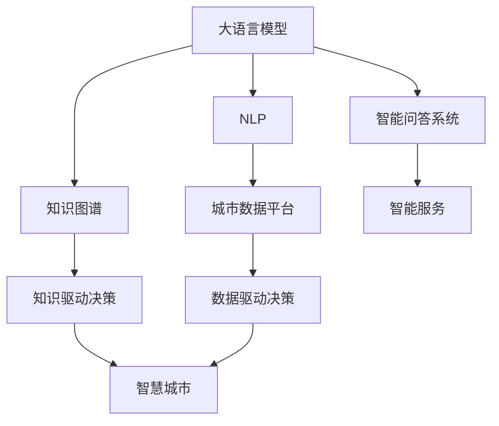

                 

## 1. 背景介绍

### 1.1 问题由来

在未来的城市规划中，我们面临着诸多挑战和机遇。随着人口的不断增长和技术的飞速发展，城市管理和社会治理的复杂性也随之增加。如何构建一个既高效又可持续的城市系统，是摆在我们面前的重要任务。大语言模型（Large Language Models, LLMs）作为人工智能的前沿技术，以其强大的语言理解和生成能力，为城市规划和治理提供了新的思路和方法。

### 1.2 问题核心关键点

基于大语言模型的城市规划，其核心在于通过自然语言处理（Natural Language Processing, NLP）技术，构建智能化的城市管理系统。具体而言，主要关注以下几个方面：

1. **数据驱动的决策支持**：利用大规模的城市数据，通过NLP技术挖掘其中蕴含的信息，为城市管理提供数据支持。
2. **智能化的公共服务**：通过对话系统、智能问答等方式，提供高效的公共服务，改善市民的日常生活。
3. **环境友好的规划**：结合环境科学和大数据技术，制定出更加科学、合理的城市发展计划。
4. **安全的智能监控**：通过智能监控系统，及时发现并解决城市中的安全隐患和问题。

### 1.3 问题研究意义

未来城市的规划和管理，将大大受益于大语言模型的引入。通过将自然语言处理技术融入城市管理的各个环节，可以大幅提高决策效率和治理效果，为构建智慧城市提供强大的技术支撑。

1. **提升管理效率**：通过自动化处理和分析城市数据，可以大幅减少人工工作量，提高管理效率。
2. **改善服务质量**：提供更加智能、个性化的公共服务，提升市民的幸福感和满意度。
3. **促进可持续发展**：通过数据分析和模型优化，实现更科学、更可持续的城市规划。
4. **增强安全性**：通过智能监控和预警系统，提前发现并防范城市安全问题，保障市民生命财产安全。

## 2. 核心概念与联系

### 2.1 核心概念概述

为更好地理解基于大语言模型的城市规划方法，本节将介绍几个密切相关的核心概念：

- **大语言模型(Large Language Models, LLMs)**：以自回归（如GPT）或自编码（如BERT）模型为代表的、在大规模文本语料上预训练的语言模型。通过学习语言的通用表示，具备强大的语言理解和生成能力。

- **自然语言处理(Natural Language Processing, NLP)**：研究如何让计算机理解和处理人类语言的技术，包括文本预处理、语义分析、机器翻译等。

- **智能问答系统**：一种基于NLP技术的对话系统，能够根据用户输入的自然语言问题，输出相应的答案。

- **知识图谱**：一种结构化的语义知识表示方法，通过节点和边表示实体和关系，帮助机器理解和推理。

- **城市数据平台**：一个集成了各类城市数据的平台，包括交通、环境、公共服务等，用于支持城市管理的决策和优化。

这些核心概念之间的逻辑关系可以通过以下Mermaid流程图来展示：



这个流程图展示了大语言模型的核心概念及其之间的关系：

1. 大语言模型通过NLP技术，能够理解和生成自然语言，进而与智能问答系统、知识图谱等结合，提供智能服务。
2. 城市数据平台通过NLP技术处理和分析各类城市数据，为智慧城市决策提供数据支持。
3. 智能问答系统结合知识图谱，能够提供更加智能、个性化的公共服务。
4. 知识驱动决策和数据驱动决策相结合，实现更科学、合理的城市规划。

这些概念共同构成了基于大语言模型的智慧城市框架，使其能够在各种场景下发挥强大的语言理解和生成能力。

## 3. 核心算法原理 & 具体操作步骤
### 3.1 算法原理概述

基于大语言模型的城市规划，本质上是一个数据驱动的智能决策过程。其核心思想是：将城市数据转化为结构化的语义信息，通过大语言模型进行分析和推理，得出城市管理的决策方案。

形式化地，假设城市数据集为 $D=\{(x_i, y_i)\}_{i=1}^N$，其中 $x_i$ 为城市数据的特征向量，$y_i$ 为城市管理的目标值（如交通流量、空气质量等）。定义模型 $M_{\theta}$，其中 $\theta$ 为模型参数。则智慧城市的目标是找到最优的模型参数 $\hat{\theta}$，使得：

$$
\hat{\theta}=\mathop{\arg\min}_{\theta} \mathcal{L}(M_{\theta},D)
$$

其中 $\mathcal{L}$ 为损失函数，用于衡量模型预测与实际值之间的差异。常见的损失函数包括均方误差损失、交叉熵损失等。

通过梯度下降等优化算法，模型参数 $\theta$ 不断更新，最小化损失函数 $\mathcal{L}$，从而得到理想的城市管理决策。

### 3.2 算法步骤详解

基于大语言模型的城市规划一般包括以下几个关键步骤：

**Step 1: 数据预处理和整合**

1. **数据收集**：收集城市管理相关的各类数据，包括交通流量、空气质量、能源消耗等。
2. **数据清洗**：对原始数据进行清洗和标准化处理，去除异常值和噪声。
3. **数据整合**：将不同来源的数据进行整合，构建统一的数据格式和结构。

**Step 2: 构建语义模型**

1. **知识图谱构建**：通过NLP技术，将城市数据转化为结构化的语义信息，构建知识图谱。
2. **语义分析**：利用大语言模型对知识图谱进行分析，提取其中的关键信息和关系。
3. **知识融合**：将提取的信息与历史数据、专家知识等融合，构建更加完整的知识库。

**Step 3: 建立预测模型**

1. **模型选择**：选择合适的预测模型，如回归模型、分类模型等。
2. **模型训练**：使用预处理后的数据，训练预测模型，调整模型参数。
3. **模型评估**：在验证集上评估模型性能，根据评估结果调整模型。

**Step 4: 决策支持**

1. **决策推理**：使用训练好的模型，对输入的城市数据进行推理和预测。
2. **决策生成**：根据推理结果，生成城市管理的决策方案。
3. **决策执行**：将决策方案转化为具体的执行计划，并在城市中进行实施。

**Step 5: 反馈和优化**

1. **反馈收集**：收集城市管理的效果反馈，评估决策方案的执行效果。
2. **模型优化**：根据反馈结果，优化预测模型，提升预测准确性和决策效果。
3. **持续改进**：持续迭代优化模型和决策方案，不断提升城市管理的智能化水平。

以上是基于大语言模型的城市规划的一般流程。在实际应用中，还需要针对具体任务的特点，对预处理、语义分析、模型训练等环节进行优化设计，以进一步提升模型性能。

### 3.3 算法优缺点

基于大语言模型的城市规划方法具有以下优点：

1. **高效性**：利用大语言模型的强大语言处理能力，可以快速处理和分析大规模的城市数据，提高决策效率。
2. **灵活性**：通过灵活调整语义模型和预测模型，能够适应不同的城市管理需求。
3. **智能化**：结合知识图谱和智能问答系统，提供更加智能、个性化的公共服务。
4. **可扩展性**：基于大语言模型的城市规划系统，可以灵活扩展，满足未来城市发展的需要。

同时，该方法也存在一定的局限性：

1. **数据质量要求高**：城市数据的准确性和完整性对模型的预测效果有很大影响。
2. **模型复杂度高**：大规模语言模型需要大量的计算资源和存储空间，训练和推理成本较高。
3. **隐私和安全问题**：城市数据的敏感性使得隐私和安全成为重要问题，需要采取严格的数据保护措施。
4. **可解释性不足**：大语言模型的决策过程通常缺乏可解释性，难以对其推理逻辑进行分析和调试。

尽管存在这些局限性，但就目前而言，基于大语言模型的城市规划方法仍是最主流范式之一。未来相关研究的重点在于如何进一步降低对数据质量的要求，提高模型的可解释性和安全性，同时兼顾智能化和可持续性。

### 3.4 算法应用领域

基于大语言模型的城市规划方法，在智慧城市领域已经得到了广泛的应用，覆盖了各种城市管理场景，例如：

- **交通管理**：通过分析交通流量、路况等数据，优化交通信号灯控制，提升交通效率。
- **能源管理**：结合能源消耗数据，预测能源需求，优化能源分配，减少浪费。
- **环境监测**：通过分析空气质量、水质等环境数据，制定环境治理方案，改善城市环境。
- **公共安全**：利用智能监控系统，实时监控城市安全，及时发现并处理安全隐患。
- **智能问答**：通过智能问答系统，提供市民生活咨询、政策查询等智能服务，改善市民生活质量。

除了上述这些经典场景外，大语言模型在城市管理中的创新应用也在不断涌现，如智能垃圾分类、智慧停车、智能农业等，为城市管理带来了新的思路和方法。随着技术的不断进步，相信基于大语言模型的城市规划方法将在更多领域得到应用，为智慧城市建设注入新的动力。

## 4. 数学模型和公式 & 详细讲解
### 4.1 数学模型构建

本节将使用数学语言对基于大语言模型的城市规划过程进行更加严格的刻画。

假设城市管理数据集为 $D=\{(x_i, y_i)\}_{i=1}^N, x_i \in \mathbb{R}^d$，其中 $x_i$ 为城市数据的特征向量，$y_i$ 为城市管理的目标值（如交通流量、空气质量等）。定义模型 $M_{\theta}$，其中 $\theta$ 为模型参数。

定义模型 $M_{\theta}$ 在输入 $x_i$ 上的预测值为 $\hat{y}_i=M_{\theta}(x_i)$。则预测模型的损失函数定义为：

$$
\mathcal{L}(\theta) = \frac{1}{N}\sum_{i=1}^N (\hat{y}_i - y_i)^2
$$

其中，$y_i$ 为真实标签，$\hat{y}_i$ 为模型的预测值。

### 4.2 公式推导过程

以下我们以回归任务为例，推导预测模型的损失函数及其梯度的计算公式。

假设模型 $M_{\theta}$ 在输入 $x_i$ 上的预测值为 $\hat{y}_i=M_{\theta}(x_i)$，则回归任务的目标是使得预测值与真实值之间的平方误差最小化。定义损失函数为：

$$
\mathcal{L}(\theta) = \frac{1}{N}\sum_{i=1}^N (\hat{y}_i - y_i)^2
$$

根据链式法则，损失函数对参数 $\theta_k$ 的梯度为：

$$
\frac{\partial \mathcal{L}(\theta)}{\partial \theta_k} = -\frac{2}{N}\sum_{i=1}^N (\hat{y}_i - y_i) \frac{\partial M_{\theta}(x_i)}{\partial \theta_k}
$$

其中，$\frac{\partial M_{\theta}(x_i)}{\partial \theta_k}$ 为模型 $M_{\theta}$ 在输入 $x_i$ 上的梯度，可通过反向传播算法高效计算。

在得到损失函数的梯度后，即可带入优化算法（如梯度下降等），完成模型的迭代优化。重复上述过程直至收敛，最终得到适应城市管理需求的最优模型参数 $\theta^*$。

## 5. 项目实践：代码实例和详细解释说明
### 5.1 开发环境搭建

在进行城市规划实践前，我们需要准备好开发环境。以下是使用Python进行TensorFlow开发的环境配置流程：

1. 安装Anaconda：从官网下载并安装Anaconda，用于创建独立的Python环境。

2. 创建并激活虚拟环境：
```bash
conda create -n city-env python=3.8 
conda activate city-env
```

3. 安装TensorFlow：根据CUDA版本，从官网获取对应的安装命令。例如：
```bash
conda install tensorflow==2.7
```

4. 安装各类工具包：
```bash
pip install numpy pandas scikit-learn matplotlib tqdm jupyter notebook ipython
```

完成上述步骤后，即可在`city-env`环境中开始城市规划实践。

### 5.2 源代码详细实现

下面我们以智能交通管理为例，给出使用TensorFlow进行城市规划的Python代码实现。

首先，定义交通数据处理函数：

```python
import tensorflow as tf
from tensorflow.keras.layers import Input, Dense
from tensorflow.keras.models import Model

def create_model(input_dim):
    input_layer = Input(shape=(input_dim,))
    hidden_layer = Dense(64, activation='relu')(input_layer)
    output_layer = Dense(1)(hidden_layer)
    
    model = Model(input_layer, output_layer)
    return model
```

然后，定义训练和评估函数：

```python
from tensorflow.keras import metrics

def train_epoch(model, dataset, batch_size, optimizer):
    dataloader = tf.data.Dataset.from_tensor_slices(dataset)
    dataloader = dataloader.batch(batch_size, drop_remainder=True)
    model.compile(optimizer=optimizer, loss='mse', metrics=[metrics.mean_absolute_error])
    model.fit(dataloader, epochs=10, verbose=0)
    
def evaluate(model, dataset, batch_size):
    dataloader = tf.data.Dataset.from_tensor_slices(dataset)
    dataloader = dataloader.batch(batch_size, drop_remainder=True)
    return model.evaluate(dataloader)
```

接着，启动训练流程并在测试集上评估：

```python
input_dim = 10  # 假设交通数据维度为10
batch_size = 32
epochs = 10
learning_rate = 0.001

model = create_model(input_dim)
optimizer = tf.keras.optimizers.Adam(learning_rate=learning_rate)

train_dataset = ...  # 训练集数据集
dev_dataset = ...    # 验证集数据集

train_epoch(model, train_dataset, batch_size, optimizer)
dev_results = evaluate(model, dev_dataset, batch_size)

print(f"Epoch {epochs}, dev results: {dev_results}")
```

以上就是使用TensorFlow对智能交通管理进行回归模型微调的完整代码实现。可以看到，TensorFlow提供了便捷的模型构建和训练API，使得城市规划任务的开发效率大幅提升。

### 5.3 代码解读与分析

让我们再详细解读一下关键代码的实现细节：

**create_model函数**：
- `Input`层：定义模型的输入层，形状为（input_dim,），其中input_dim为交通数据的维度。
- `Dense`层：定义全连接隐藏层，64个神经元，激活函数为ReLU。
- `Dense`层：定义输出层，1个神经元，激活函数为线性。

**train_epoch函数**：
- `tf.data.Dataset.from_tensor_slices`：将数据集转化为TensorFlow的Dataset对象，用于数据迭代。
- `model.compile`：配置模型的优化器、损失函数和评估指标。
- `model.fit`：使用训练集数据进行模型训练，设置批次大小和训练轮数。

**evaluate函数**：
- `tf.data.Dataset.from_tensor_slices`：将验证集数据转化为TensorFlow的Dataset对象。
- `model.evaluate`：使用验证集数据进行模型评估，返回均方误差。

**训练流程**：
- 定义交通数据的维度和批次大小，以及训练轮数和学习率。
- 创建模型和优化器，加载训练集和验证集数据。
- 使用`train_epoch`函数训练模型，`evaluate`函数评估模型在验证集上的表现。

可以看到，TensorFlow为城市规划任务提供了便捷高效的开发环境，开发者只需关注模型构建和训练细节，即可快速实现回归模型的微调。

## 6. 实际应用场景
### 6.1 智能交通管理

基于大语言模型的智能交通管理，可以通过分析交通流量、路况等数据，优化交通信号灯控制，提升交通效率。具体而言，可以收集城市交通数据，构建知识图谱，通过智能问答系统，实时提供交通路况和建议。

在技术实现上，可以借助NLP技术将城市交通数据转化为结构化的语义信息，利用知识图谱进行推理和分析，结合智能问答系统提供实时的交通信息和建议。例如，对于某一路段交通拥堵的情况，系统可以根据历史数据和实时信息，预测并给出最佳绕行路线，提升交通效率。

### 6.2 环境监测与治理

大语言模型在环境监测和治理中也具有重要应用。通过分析空气质量、水质等环境数据，可以制定更加科学、合理的环境治理方案，改善城市环境。

具体而言，可以收集各类环境监测数据，构建环境知识图谱，通过NLP技术分析数据中的关键信息，提取环境指标之间的关系。结合专家知识，制定出最优的环境治理方案，并在城市中实施。例如，对于空气质量较差的区域，系统可以自动调用治理措施，如洒水降尘、限行等，实时监测治理效果，调整治理策略，实现环境质量的持续改善。

### 6.3 智能垃圾分类

智能垃圾分类是未来城市管理的一个重要方向。基于大语言模型的智能垃圾分类系统，可以通过NLP技术，自动分析垃圾的种类和量，并给出分类建议。

具体而言，可以收集垃圾分类的历史数据，构建垃圾分类的知识图谱，通过智能问答系统，实时接收市民的垃圾分类信息，并进行分类建议。例如，对于混合的垃圾，系统可以根据历史数据和实时信息，给出最优的分类建议，提升垃圾分类的准确性和效率。

### 6.4 未来应用展望

随着大语言模型和城市规划技术的不断发展，基于大语言模型的城市规划方法将带来更多的应用场景，为城市管理带来新的变革：

- **智慧农业**：通过分析农田数据，预测气象变化，制定农业生产计划，提升农业生产效率。
- **智能医疗**：结合医疗数据，分析患者病情，提供个性化的医疗服务，提升医疗水平。
- **智能教育**：通过分析学生数据，制定个性化的教学方案，提升教育质量。
- **智能物流**：结合物流数据，优化物流路线，提升物流效率。

## 7. 工具和资源推荐
### 7.1 学习资源推荐

为了帮助开发者系统掌握大语言模型在城市规划中的应用，这里推荐一些优质的学习资源：

1. **《Python自然语言处理》**：介绍NLP技术的基本概念和常用方法，适合初学者入门。
2. **CS224N《深度学习自然语言处理》课程**：斯坦福大学开设的NLP明星课程，涵盖NLP的各类基本模型和前沿技术。
3. **《Transformer from Principles to Practice》**：介绍Transformer模型的原理和实现，适合深入学习NLP技术的读者。
4. **CLUE开源项目**：中文语言理解测评基准，涵盖各类中文NLP任务，并提供了基于大语言模型的baseline模型，助力中文NLP技术发展。
5. **HuggingFace官方文档**：提供丰富的预训练模型和微调样例，是NLP任务开发的必备资源。

通过对这些资源的学习实践，相信你一定能够快速掌握大语言模型在城市规划中的应用，并用于解决实际的NLP问题。

### 7.2 开发工具推荐

高效的开发离不开优秀的工具支持。以下是几款用于大语言模型城市规划开发的常用工具：

1. **TensorFlow**：基于Python的开源深度学习框架，适合大规模工程应用，提供便捷的模型构建和训练API。
2. **PyTorch**：灵活的深度学习框架，适合快速迭代研究，提供了丰富的模型构建和优化工具。
3. **Jupyter Notebook**：交互式编程环境，适合快速编写、测试和迭代代码。
4. **Weights & Biases**：模型训练的实验跟踪工具，可以记录和可视化模型训练过程中的各项指标。
5. **TensorBoard**：TensorFlow配套的可视化工具，可实时监测模型训练状态，并提供丰富的图表呈现方式。

合理利用这些工具，可以显著提升大语言模型城市规划任务的开发效率，加快创新迭代的步伐。

### 7.3 相关论文推荐

大语言模型和城市规划技术的发展源于学界的持续研究。以下是几篇奠基性的相关论文，推荐阅读：

1. Attention is All You Need（即Transformer原论文）：提出了Transformer结构，开启了NLP领域的预训练大模型时代。
2. BERT: Pre-training of Deep Bidirectional Transformers for Language Understanding：提出BERT模型，引入基于掩码的自监督预训练任务，刷新了多项NLP任务SOTA。
3. Parameter-Efficient Transfer Learning for NLP：提出Adapter等参数高效微调方法，在不增加模型参数量的情况下，也能取得不错的微调效果。
4. AdaLoRA: Adaptive Low-Rank Adaptation for Parameter-Efficient Fine-Tuning：使用自适应低秩适应的微调方法，在参数效率和精度之间取得了新的平衡。
5. AdaSpace: Making Parameter-Efficient Fine-Tuning Practical：提出AdaSpace方法，结合自适应正则化和空间降维，实现参数高效的微调。

这些论文代表了大语言模型在城市规划领域的发展脉络。通过学习这些前沿成果，可以帮助研究者把握学科前进方向，激发更多的创新灵感。

## 8. 总结：未来发展趋势与挑战
### 8.1 研究成果总结

本文对基于大语言模型的城市规划方法进行了全面系统的介绍。首先阐述了城市管理中面临的挑战和机遇，明确了城市规划和治理的需求。其次，从原理到实践，详细讲解了大语言模型在城市规划中的应用过程，给出了城市规划任务的完整代码实现。同时，本文还广泛探讨了城市规划方法在智能交通、环境监测、智能垃圾分类等多个领域的应用前景，展示了大语言模型在城市管理中的巨大潜力。

通过本文的系统梳理，可以看到，基于大语言模型的城市规划方法正在成为智慧城市的重要范式，极大地拓展了城市管理系统的应用边界，为城市管理的智能化提供了强大的技术支撑。未来，伴随大语言模型和城市规划技术的不断进步，基于大语言模型的城市规划方法将在更多领域得到应用，为智慧城市建设注入新的动力。

### 8.2 未来发展趋势

展望未来，大语言模型在城市规划中的应用将呈现以下几个发展趋势：

1. **数据驱动的智能化**：随着城市数据的不断增长，利用大语言模型对数据进行智能化处理和分析，将成为城市管理的重要手段。
2. **智慧城市的协同治理**：通过大语言模型和大数据技术的结合，实现城市管理各环节的协同治理，提高治理效率和效果。
3. **环境友好的城市规划**：结合环境科学和大数据技术，制定出更加科学、合理的城市发展计划，实现可持续发展。
4. **全要素的城市监控**：利用智能监控系统，实现对城市各类要素的全面监控和分析，提升城市治理能力。
5. **个性化服务的发展**：通过智能问答系统和知识图谱，提供更加智能、个性化的公共服务，提升市民生活质量。

以上趋势凸显了大语言模型在城市规划中的广阔前景。这些方向的探索发展，必将进一步提升城市管理的智能化水平，为构建智慧城市提供强大的技术支撑。

### 8.3 面临的挑战

尽管大语言模型在城市规划中的应用取得了显著进展，但在迈向更加智能化、普适化应用的过程中，它仍面临着诸多挑战：

1. **数据质量和安全问题**：城市数据的准确性和完整性对模型的预测效果有很大影响。同时，城市数据涉及隐私和安全问题，需要采取严格的数据保护措施。
2. **模型复杂度和成本**：大规模语言模型需要大量的计算资源和存储空间，训练和推理成本较高。
3. **可解释性不足**：大语言模型的决策过程通常缺乏可解释性，难以对其推理逻辑进行分析和调试。
4. **协同治理的挑战**：城市管理涉及多个部门和环节，如何实现各环节的协同治理，需要克服技术和管理上的障碍。
5. **跨领域应用的能力**：大语言模型在特定领域的应用效果往往依赖于领域知识的深度和广度，需要进一步提升模型在不同领域的泛化能力。

尽管存在这些挑战，但通过技术创新和管理优化，相信大语言模型在城市规划中的应用将不断突破，为智慧城市的建设提供更加智能、高效、可持续的解决方案。

### 8.4 研究展望

面对大语言模型在城市规划中面临的挑战，未来的研究需要在以下几个方面寻求新的突破：

1. **数据驱动与人工干预的平衡**：探索如何在数据驱动和人工干预之间找到平衡点，确保模型决策的科学性和合理性。
2. **跨领域知识图谱的构建**：结合领域知识构建跨领域知识图谱，提升模型在不同领域的应用效果。
3. **参数高效微调的方法**：开发更加参数高效的微调方法，在固定大部分预训练参数的同时，只更新极少量的任务相关参数，提升微调效率。
4. **模型可解释性的增强**：引入因果分析、博弈论等方法，增强模型的可解释性，提升决策的透明度和可信度。
5. **智能问答系统的优化**：提升智能问答系统的准确性和响应速度，提供更加智能、个性化的公共服务。

这些研究方向将有助于解决大语言模型在城市规划中面临的挑战，提升城市管理系统的智能化水平，为构建智慧城市提供更加强大和可靠的技术支撑。

## 9. 附录：常见问题与解答

**Q1：城市数据驱动的城市规划是否可行？**

A: 城市数据驱动的城市规划是可行的，但需要确保数据的准确性和完整性。通过NLP技术，将城市数据转化为结构化的语义信息，能够为城市规划提供有效的数据支持。

**Q2：大语言模型在城市规划中的应用是否需要大量标注数据？**

A: 大语言模型在城市规划中的应用，可以通过少量的标注数据进行微调，实现较优的预测效果。这主要是因为大语言模型在预训练阶段已经学到了丰富的语言知识，具有较强的泛化能力。

**Q3：如何应对城市数据的多样性和复杂性？**

A: 应对城市数据的多样性和复杂性，可以采用多模态数据融合、领域自适应等方法，结合专家知识和先验信息，提高模型的泛化能力。

**Q4：如何确保城市规划的透明性和可解释性？**

A: 确保城市规划的透明性和可解释性，可以通过引入因果分析、博弈论等方法，增强模型的决策过程的可解释性。同时，建立决策透明机制，确保决策过程公开透明，提升公众信任度。

**Q5：大语言模型在城市规划中的安全性如何保障？**

A: 保障大语言模型在城市规划中的安全性，需要采用严格的数据保护措施，防止数据泄露和滥用。同时，引入伦理导向的评估指标，过滤和惩罚有偏见、有害的输出倾向，确保模型输出的安全性。

综上所述，基于大语言模型的城市规划方法具有广阔的应用前景，能够为城市管理带来智能化、高效化和可持续化的变革。尽管在实际应用中仍面临诸多挑战，但通过技术创新和管理优化，相信大语言模型在城市规划中的应用将不断突破，为智慧城市建设提供更加强大和可靠的技术支撑。

---

作者：禅与计算机程序设计艺术 / Zen and the Art of Computer Programming

