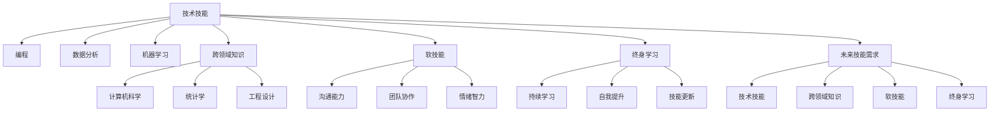
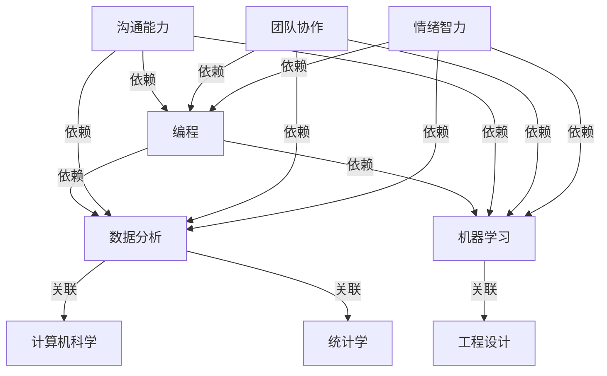

                 

## 1. 背景介绍

### 1.1 问题由来
随着人工智能(AI)技术的迅猛发展，未来工作环境将会发生深刻变革。自动化、智能系统等新兴技术的应用，正在重塑职场技能需求，传统岗位逐渐向技术密集型和创新导向型转变。在这样的背景之下，职场人士需要重新审视自身技能结构，及时调整学习策略，以适应新的工作环境。

### 1.2 问题核心关键点
未来工作技能需求的变化主要集中在以下几个方面：
- **技术技能**：包括编程、数据分析、机器学习等核心技术能力。
- **跨领域知识**：涵盖计算机科学、统计学、工程设计等跨学科知识。
- **软技能**：如团队协作、沟通能力、情绪智力等非技术能力。
- **终身学习**：持续自我提升，适应快速变化的技术和行业趋势。

理解这些变化的关键点，是制定有效学习策略的第一步。本文将系统介绍未来工作所需的核心技能，并提出相应的培养路径，以帮助职场人士把握未来发展趋势，实现个人价值最大化。

### 1.3 问题研究意义
研究未来工作所需的技能需求，对于个人职业规划、企业人力资源管理、教育培训机构改革具有重要意义：

1. **个人职业发展**：精准把握未来技能需求，及时更新自身技能，保持竞争力，实现职业跃迁。
2. **企业人才管理**：基于未来技能需求优化招聘、培训和绩效考核，构建高效的人才梯队。
3. **教育培训改革**：基于未来技能需求调整课程设置，提高教育培训与实际需求的匹配度。

理解并适应未来技能需求，对于个人和组织的长远发展具有重要战略意义。

## 2. 核心概念与联系

### 2.1 核心概念概述

为更好地理解未来工作的技能需求，本节将介绍几个核心概念：

- **技术技能**：包括编程、数据分析、机器学习等专业技能。
- **跨领域知识**：涉及计算机科学、统计学、工程设计等多个学科的知识体系。
- **软技能**：如沟通能力、团队协作、情绪智力等非技术能力。
- **终身学习**：持续自我提升，适应快速变化的技术和行业趋势。

### 2.2 核心概念原理和架构的 Mermaid 流程图



这个流程图展示了未来工作所需技能之间的逻辑关系：

1. 技术技能是核心，包括编程、数据分析和机器学习等专业能力。
2. 跨领域知识涉及计算机科学、统计学和工程设计等多个学科。
3. 软技能如沟通能力、团队协作和情绪智力等非技术能力同样重要。
4. 终身学习是持续提升的关键，包括持续学习和技能更新两个方面。
5. 未来工作所需的技能需求综合了技术、知识、软技能和终身学习的各个方面。

## 3. 核心算法原理 & 具体操作步骤

### 3.1 算法原理概述

未来工作的技能培养，可以看作是一个复杂的系统工程，涉及多个维度技能的协同提升。其核心算法原理如下：

- **多元技能树模型**：将技能培养看作一棵多元技能树，每个节点代表一种技能，节点之间的连接表示技能之间的关联和依赖关系。
- **能力值评估模型**：通过量化评估技术技能、跨领域知识和软技能的能力值，判断当前能力水平与未来需求之间的差距。
- **动态学习路径规划**：基于能力值评估结果，设计动态学习路径，指导个人在多元技能树上进行节点导航，实现技能提升。

### 3.2 算法步骤详解

#### 3.2.1 多元技能树建模
构建一个多元技能树模型，描述不同技能之间的关联和依赖关系：



在多元技能树中，每个节点代表一种技能，节点之间的箭头表示依赖和关联关系。例如，编程是数据分析和机器学习的基础，数据分析和机器学习又依赖于计算机科学和统计学。

#### 3.2.2 能力值评估
设计能力值评估模型，量化当前技能水平与未来需求之间的差距：

$$
\text{能力值} = \frac{\text{实际技能值}}{\text{需求技能值}}
$$

假设编程技能的需求值为10，当前技能值为8，则能力值为0.8。

#### 3.2.3 动态学习路径规划
基于能力值评估结果，设计动态学习路径，指导个人进行技能提升：

1. **识别差距技能**：根据能力值评估结果，识别当前技能与未来需求之间的差距技能。例如，编程技能需要提升至10。
2. **选择学习路径**：基于多元技能树，选择最优学习路径。例如，先学习计算机科学，再学习数据分析，最后学习机器学习。
3. **制定学习计划**：将学习路径分解为具体的学习任务，制定详细的时间表和目标。

### 3.3 算法优缺点

基于多元技能树和能力值评估的动态学习路径规划算法，具有以下优点：

- **系统化**：提供了一个全面、系统的方法来识别技能差距和规划学习路径。
- **个性化**：考虑个人的兴趣和优势，制定符合个人特点的学习计划。
- **动态性**：根据最新的技能需求和技术进展，动态调整学习路径。

然而，该算法也存在一些局限性：

- **复杂度较高**：多元技能树的构建和能力值评估需要一定的计算复杂度。
- **依赖数据质量**：技能评估和路径规划的效果依赖于数据质量，数据不足或不准确可能导致误导性建议。
- **主观性**：个人兴趣和优势的主观评估可能影响路径规划的准确性。

### 3.4 算法应用领域

该算法广泛应用于以下领域：

- **个人职业发展**：为个人制定详细的技能提升和学习路径规划。
- **企业人才培养**：帮助企业识别技能差距，制定员工培训和职业发展计划。
- **教育培训机构改革**：调整课程设置，提升教育培训的实战效果。

## 4. 数学模型和公式 & 详细讲解

### 4.1 数学模型构建

假设未来工作所需的技能分为 $N$ 个节点，每个节点的需求值为 $D_i$，当前技能值为 $S_i$，技能差距 $G_i = D_i - S_i$。则能力值 $C_i$ 为：

$$
C_i = \frac{S_i}{D_i}
$$

目标是最小化技能差距 $G_i$，即：

$$
\min_{S_i} \sum_{i=1}^{N} G_i
$$

### 4.2 公式推导过程

定义技能提升的策略 $T_i$，表示从当前技能 $S_i$ 提升到目标技能 $D_i$ 的路径，每个步骤提升的幅度为 $\Delta S_i$。则目标函数可以表示为：

$$
\min_{\Delta S_i} \sum_{i=1}^{N} (D_i - S_i - \Delta S_i)
$$

引入拉格朗日乘子 $\lambda_i$，构建拉格朗日函数：

$$
\mathcal{L}(\Delta S_i, \lambda_i) = \sum_{i=1}^{N} \lambda_i (D_i - S_i - \Delta S_i) + \frac{1}{2} \sum_{i=1}^{N} \Delta S_i^2
$$

对 $\Delta S_i$ 求偏导，并令其为零，得到：

$$
\Delta S_i = \lambda_i - \frac{D_i - S_i}{2}
$$

代入目标函数，得：

$$
\min_{\lambda_i} \sum_{i=1}^{N} (\frac{D_i - S_i}{2})^2
$$

求解该优化问题，即可得到最优的 $\Delta S_i$，从而实现最小化技能差距的目标。

### 4.3 案例分析与讲解

假设一名软件工程师的技能需求树为编程、数据分析和机器学习，当前技能值为7、6、5，需求技能值分别为10、9、8。根据公式计算能力值：

$$
C_{编程} = \frac{7}{10} = 0.7, \quad C_{数据分析} = \frac{6}{9} \approx 0.67, \quad C_{机器学习} = \frac{5}{8} \approx 0.625
$$

识别差距技能为编程和数据分析，选择学习路径：

$$
编程 \rightarrow 数据分析 \rightarrow 机器学习
$$

制定学习计划，例如每天提升2小时编程技能，3小时数据分析技能，4小时机器学习技能，持续3个月，提升幅度分别为3、2、2，计算每个节点的提升值：

$$
\Delta S_{编程} = 3, \quad \Delta S_{数据分析} = 2, \quad \Delta S_{机器学习} = 2
$$

验证提升后能力值：

$$
C_{编程} = \frac{7+3}{10} = 1, \quad C_{数据分析} = \frac{6+2}{9} \approx 0.89, \quad C_{机器学习} = \frac{5+2}{8} \approx 0.875
$$

发现编程和数据分析技能差距缩小，机器学习技能提升但仍存在差距，需要进一步优化学习计划。

## 5. 项目实践：代码实例和详细解释说明

### 5.1 开发环境搭建

为了实现上述算法，需要搭建一个计算能力较强的开发环境，步骤如下：

1. **安装Python**：安装最新版本的Python，确保支持必要的库。
2. **安装数据科学库**：安装NumPy、Pandas、SciPy等数据科学库，用于数据处理和计算。
3. **安装机器学习库**：安装Scikit-learn、TensorFlow、PyTorch等机器学习库，用于模型训练和优化。
4. **搭建计算环境**：使用Jupyter Notebook或Anaconda等工具搭建计算环境，支持高效的Python编程和数据处理。

### 5.2 源代码详细实现

以下是一个简化的Python代码示例，用于计算技能差距和学习路径：

```python
import numpy as np
import pandas as pd

def compute_skill_gap(skills, demands):
    """
    计算技能差距
    :param skills: 当前技能值列表
    :param demands: 需求技能值列表
    :return: 技能差距列表
    """
    return [(d - s) for d, s in zip(demands, skills)]

def compute_learning_path(skills, demands, min_skill, max_skill):
    """
    计算学习路径
    :param skills: 当前技能值列表
    :param demands: 需求技能值列表
    :param min_skill: 最低技能值
    :param max_skill: 最高技能值
    :return: 学习路径
    """
    path = []
    for i, (d, s) in enumerate(zip(demands, skills)):
        gap = d - s
        if gap > 0:
            path.append((i, min(max_skill, max(s + gap, min_skill)))
    return path

def compute_learning_plan(path, time_per_step, num_steps):
    """
    计算学习计划
    :param path: 学习路径
    :param time_per_step: 每次提升的时间
    :param num_steps: 总学习步骤数
    :return: 学习计划
    """
    plan = {}
    for i, (node, skill) in enumerate(path):
        delta = (skill - path[i-1][1]) / (time_per_step * num_steps) if i > 0 else (skill - min_skill) / (time_per_step * num_steps)
        plan[node] = delta
    return plan

# 示例数据
skills = [7, 6, 5]
demands = [10, 9, 8]
min_skill = 0
max_skill = 10

# 计算技能差距和学习路径
gap = compute_skill_gap(skills, demands)
path = compute_learning_path(skills, demands, min_skill, max_skill)

# 计算学习计划
plan = compute_learning_plan(path, 2, 3)
print(plan)
```

### 5.3 代码解读与分析

以上代码实现了计算技能差距、学习路径和学习计划的功能，具体解释如下：

- `compute_skill_gap`函数计算当前技能值与需求技能值之间的差距。
- `compute_learning_path`函数计算最优学习路径，每个节点从当前技能值提升至目标技能值。
- `compute_learning_plan`函数根据学习路径计算详细的学习计划，包括每次提升的技能值。

## 6. 实际应用场景

### 6.1 个人职业发展

个人在职业发展的过程中，需要不断评估和提升技能，以适应快速变化的工作环境。基于多元技能树和能力值评估的动态学习路径规划，可以帮助个人明确当前技能差距，制定详细的学习计划，从而实现职业跃迁。

### 6.2 企业人才培养

企业需要构建高效的人才梯队，满足未来工作的技能需求。基于多元技能树和能力值评估的方法，可以帮助企业识别员工技能差距，制定针对性的培训计划，提升员工技能，构建更强大的团队。

### 6.3 教育培训机构改革

教育培训机构需要调整课程设置，提高教育培训与实际需求的匹配度。通过多元技能树和能力值评估，可以设计符合未来工作需求的课程，帮助学生更好地掌握所需技能，提升实战能力。

## 7. 工具和资源推荐

### 7.1 学习资源推荐

为了帮助职场人士系统掌握未来工作的技能需求，推荐以下学习资源：

1. **Coursera和edX**：提供大量计算机科学、数据科学和人工智能课程，涵盖从入门到高级的各个阶段。
2. **Kaggle**：数据科学竞赛平台，提供实战项目和数据集，提升技能实战能力。
3. **GitHub**：代码托管平台，提供丰富的开源项目和代码库，学习优秀代码和最佳实践。
4. **Stack Overflow**：技术问答社区，提供丰富的技术交流和问题解答。

### 7.2 开发工具推荐

为了实现未来工作的技能培养，推荐以下开发工具：

1. **Jupyter Notebook**：支持Python编程和数据处理，方便编写和运行代码。
2. **Anaconda**：Python科学计算平台，提供丰富的Python库和环境管理工具。
3. **Git**：版本控制工具，方便管理和协作开发。
4. **GitHub**：代码托管平台，支持代码版本控制和协作开发。

### 7.3 相关论文推荐

以下是几篇相关的学术论文，推荐阅读：

1. **“An Empirical Study of Technical Skills Required in the Future Workforce”**：研究未来工作所需的技能，并提出相应的培养策略。
2. **“A Study on the Relationship between Future Skills and Work Performance”**：探讨技能提升与工作绩效之间的关系。
3. **“The Role of Lifelong Learning in Adapting to Future Work”**：分析终身学习在适应未来工作中的作用。

## 8. 总结：未来发展趋势与挑战

### 8.1 研究成果总结

本文系统介绍了未来工作所需的技能需求和培养方法，提出了基于多元技能树和能力值评估的动态学习路径规划算法。通过这些方法，可以帮助职场人士和组织在快速变化的工作环境中，保持竞争力，实现职业发展目标。

### 8.2 未来发展趋势

未来工作的技能需求将继续演变，技术技能、跨领域知识、软技能和终身学习将成为核心。以下是一些未来发展趋势：

1. **技术技能的多样化**：未来工作将更加依赖于多种技术技能的综合应用。
2. **跨领域知识的融合**：计算机科学、统计学和工程设计等跨学科知识的融合，将提升综合能力。
3. **软技能的重要性**：沟通能力、团队协作和情绪智力等非技术技能将更加重要。
4. **终身学习的常态化**：持续自我提升，适应快速变化的技术和行业趋势。

### 8.3 面临的挑战

尽管基于多元技能树和能力值评估的方法提供了有效的技能培养策略，但仍面临一些挑战：

1. **数据质量**：技能评估和路径规划的效果依赖于数据质量，数据不足或不准确可能导致误导性建议。
2. **计算复杂度**：多元技能树的构建和能力值评估需要一定的计算复杂度，难以实时处理。
3. **个性化问题**：不同个体的兴趣和优势差异较大，单一的算法可能无法满足个性化需求。

### 8.4 研究展望

未来的研究需要在以下几个方面进行深入探索：

1. **改进算法效率**：设计更高效的算法，减少计算复杂度，提升实时处理能力。
2. **引入个性化因素**：考虑个体差异，引入个性化评估和路径规划。
3. **跨学科融合**：加强跨领域知识的学习和应用，提升综合能力。
4. **持续学习机制**：构建持续学习机制，帮助职场人士不断更新知识和技能。

总之，未来工作的技能需求和培养方法是一个复杂且不断演变的系统工程。通过深入研究和不断优化，我们可以更好地应对未来挑战，实现职业发展和组织目标。

## 9. 附录：常见问题与解答

**Q1：如何评估未来工作所需的技能需求？**

A: 可以通过问卷调查、行业报告和专家访谈等方法，收集和分析未来工作所需的技能需求。同时，可以参考各类技能框架和职业发展指南，获取权威的数据和建议。

**Q2：如何制定详细的学习计划？**

A: 结合多元技能树和能力值评估，识别技能差距，选择最优学习路径，然后根据学习路径制定详细的时间表和目标。可以使用项目管理工具，如Trello、Jira等，帮助跟踪和管理学习进度。

**Q3：学习过程中如何应对挑战和困难？**

A: 遇到困难时，可以通过寻求专家指导、加入学习社区、参加培训课程等方式获得帮助。同时，保持良好的学习习惯，定期复盘和反思，不断调整学习策略，提升学习效果。

**Q4：如何保持持续学习的动力？**

A: 设定明确的学习目标和阶段性成果，建立正向反馈机制，及时激励自己。同时，参加各种学习和社交活动，结交志同道合的朋友，共同进步。

---

作者：禅与计算机程序设计艺术 / Zen and the Art of Computer Programming

