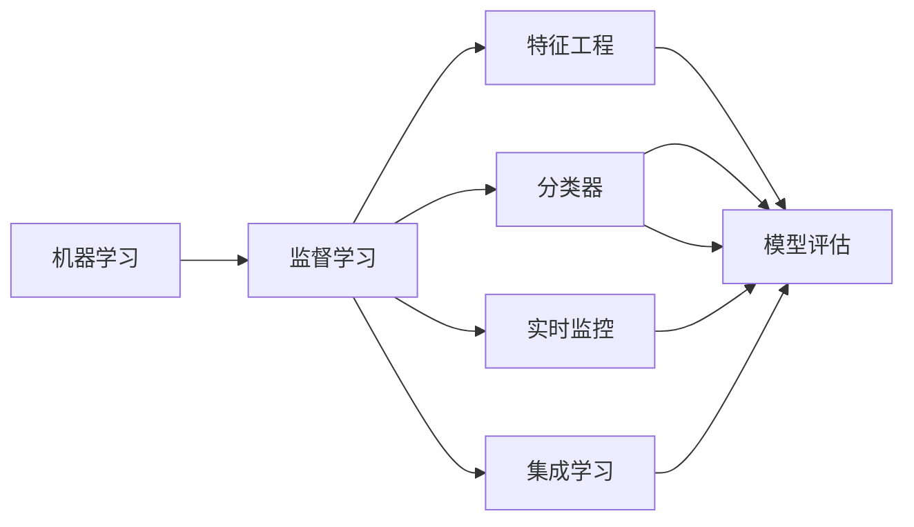

                 

# 机器学习在欺诈检测中的应用

## 1. 背景介绍

在现代社会中，金融欺诈是金融系统中普遍存在且危害巨大的问题。欺诈行为不仅造成了经济损失，还侵蚀了市场信任。随着金融科技的发展，传统的欺诈检测方法已经无法应对日益复杂多变的欺诈手段。机器学习技术的引入，为欺诈检测提供了新的解决方案，其高效性、准确性和低成本性得到了广泛认可。

机器学习技术可以通过对历史欺诈交易数据进行建模，找出欺诈行为的模式和规律，从而实现对未来交易的实时监控和预警。相比于传统的基于规则的欺诈检测方法，机器学习模型能够更灵活地处理各种复杂的欺诈场景，且能够随着数据量的增加进行自适应学习，不断提高检测的准确性。

## 2. 核心概念与联系

### 2.1 核心概念概述

在欺诈检测中，机器学习主要涉及以下概念：

- 机器学习（Machine Learning）：通过数据驱动的方式，训练模型进行任务预测。机器学习包括监督学习、无监督学习和强化学习等多种范式，在欺诈检测中，主要采用监督学习进行建模。

- 监督学习（Supervised Learning）：机器学习中的一种方法，使用已标注的数据进行模型训练，使其能够对未见过的数据进行预测。在欺诈检测中，监督学习模型可以通过历史交易数据，学习欺诈交易的特征，并进行风险评估。

- 特征工程（Feature Engineering）：将原始数据转换成模型能够理解的特征向量。在欺诈检测中，特征工程是提升模型性能的重要环节，需要从历史数据中挖掘出对欺诈检测有用的特征。

- 分类器（Classifier）：监督学习中用于对数据进行分类的模型。在欺诈检测中，分类器可以根据历史数据，对新交易进行欺诈与否的分类。

- 模型评估（Model Evaluation）：对训练好的模型进行性能评估，通常采用准确率、召回率、F1值等指标。在欺诈检测中，模型评估可以帮助了解模型的优劣和适用的场景。

- 实时监控（Real-time Monitoring）：对交易进行实时分析，及时发现和预警潜在的欺诈行为。实时监控可以显著提高欺诈检测的及时性。

- 集成学习（Ensemble Learning）：将多个模型集成起来，通过投票或加权平均等方法，提升模型的整体性能。在欺诈检测中，集成学习可以有效提升模型对复杂欺诈场景的识别能力。

这些概念之间的逻辑关系可以通过以下Mermaid流程图来展示：



这个流程图展示了下游任务“欺诈检测”中涉及的核心概念及其之间的关系：

1. 机器学习是解决欺诈检测问题的基础。
2. 监督学习用于训练欺诈检测模型。
3. 特征工程用于从原始数据中提取欺诈特征。
4. 分类器用于对交易进行欺诈与否的分类。
5. 模型评估用于评估欺诈检测模型的性能。
6. 实时监控用于对交易进行实时分析。
7. 集成学习用于提升模型的整体性能。

## 3. 核心算法原理 & 具体操作步骤

### 3.1 算法原理概述

机器学习在欺诈检测中的应用，主要基于监督学习框架。其基本原理如下：

1. **数据准备**：收集历史交易数据，并标注其中欺诈与非欺诈样本。

2. **特征提取**：从标注数据中提取有用的特征，用于训练欺诈检测模型。

3. **模型训练**：使用标注数据训练欺诈检测分类器。

4. **模型评估**：在测试数据上评估训练好的模型的性能，调整模型参数以提高准确率。

5. **实时监控**：在实时交易数据中应用训练好的模型，进行欺诈检测和预警。

### 3.2 算法步骤详解

#### 3.2.1 数据准备

数据准备是欺诈检测的基础步骤，包括以下几个关键步骤：

- 收集历史交易数据：包括客户的交易记录、设备信息、交易金额等。
- 数据清洗：去除异常值和噪声数据，保证数据的质量。
- 数据标注：标注数据中哪些交易是欺诈行为，哪些是非欺诈行为。
- 数据划分：将数据划分为训练集、验证集和测试集，以便进行模型训练和评估。

#### 3.2.2 特征提取

特征提取是将原始数据转换成模型能够理解的特征向量的过程。常用的特征包括：

- 交易金额：交易的金额大小。
- 交易频率：客户在一定时间内进行的交易次数。
- 设备信息：客户的设备类型、IP地址、操作系统等。
- 交易时间：交易发生的时间，包括星期、小时、分钟等。
- 地理位置：客户的地理位置信息。

特征提取需要根据具体场景和业务需求进行选择和组合，以保证模型能够准确识别欺诈行为。

#### 3.2.3 模型训练

模型训练是欺诈检测的核心步骤，常用的模型包括逻辑回归、支持向量机、决策树、随机森林等。以逻辑回归模型为例，其训练过程如下：

1. 初始化模型参数：设置逻辑回归模型的权重和偏置。
2. 前向传播：将特征向量输入模型，计算预测值。
3. 计算损失函数：计算预测值与真实标签之间的差异，常用的损失函数包括交叉熵损失、均方误差损失等。
4. 反向传播：计算损失函数对权重和偏置的梯度，并更新模型参数。
5. 迭代优化：重复前向传播和反向传播过程，直到损失函数收敛。

#### 3.2.4 模型评估

模型评估是衡量欺诈检测模型性能的重要步骤，常用的评估指标包括：

- 准确率（Accuracy）：模型正确分类的样本数占总样本数的比例。
- 召回率（Recall）：模型正确检测出的欺诈样本数占实际欺诈样本数的比例。
- F1值（F1 Score）：准确率和召回率的调和平均数。
- ROC曲线（Receiver Operating Characteristic Curve）：绘制模型的真阳性率与假阳性率之间的关系曲线。

#### 3.2.5 实时监控

实时监控是将欺诈检测模型应用于实时交易数据的步骤。包括以下关键步骤：

1. 实时数据收集：实时收集客户的交易数据。
2. 特征提取：将实时数据转换成特征向量。
3. 模型推理：将特征向量输入欺诈检测模型，得到欺诈预测结果。
4. 风险评估：根据模型的预测结果，对交易进行风险评估，确定是否需要进一步人工审查。
5. 系统响应：根据风险评估结果，自动触发报警机制，进行欺诈预警。

### 3.3 算法优缺点

#### 3.3.1 优点

1. **高效性**：机器学习模型可以在短时间内处理大量数据，实现实时欺诈检测。
2. **准确性**：机器学习模型可以通过学习历史数据，发现欺诈行为的模式和规律，提高检测的准确性。
3. **可扩展性**：机器学习模型可以根据需要调整模型参数，适应不同的欺诈场景。
4. **低成本性**：相比于人工审查，机器学习模型可以大幅降低欺诈检测的成本。

#### 3.3.2 缺点

1. **数据依赖**：机器学习模型的性能依赖于历史数据的标注质量，标注成本较高。
2. **模型黑盒**：机器学习模型通常是一个"黑盒"系统，难以解释其决策逻辑，不利于模型审查和优化。
3. **泛化能力有限**：机器学习模型对新数据和新欺诈手段的适应能力有限，需要进行定期更新。
4. **算法复杂性**：机器学习模型需要复杂的特征工程和模型训练过程，对开发人员的技术水平要求较高。

### 3.4 算法应用领域

机器学习在欺诈检测中的应用领域非常广泛，涵盖了金融、电商、保险、物流等多个行业。以下是几个典型的应用场景：

- **金融欺诈检测**：银行和金融机构通过机器学习模型，实时监控客户的交易行为，识别和预防信用卡欺诈、洗钱等金融犯罪。
- **电商欺诈检测**：电商平台通过机器学习模型，实时检测和阻止恶意刷单、虚假交易等欺诈行为。
- **保险欺诈检测**：保险公司通过机器学习模型，实时监控索赔行为，识别和防止保险欺诈。
- **物流欺诈检测**：物流公司通过机器学习模型，实时检测和预防物流欺诈，确保物流安全。

## 4. 数学模型和公式 & 详细讲解 & 举例说明

### 4.1 数学模型构建

在欺诈检测中，常用的数学模型包括逻辑回归（Logistic Regression）和支持向量机（Support Vector Machine）。这里以逻辑回归模型为例，介绍其数学模型构建过程。

假设我们有 $N$ 个历史交易样本，每个样本有 $D$ 个特征 $x_i$，其中 $i$ 为样本序号。每个样本的标签 $y_i \in \{0,1\}$，表示该样本是否为欺诈行为。

逻辑回归模型的目标是寻找一个线性函数 $f(x) = \theta_0 + \theta_1x_1 + ... + \theta_Dx_D$，使其能够将样本分为欺诈与非欺诈两类。

### 4.2 公式推导过程

逻辑回归模型的目标是最小化交叉熵损失函数，公式如下：

$$
L = -\frac{1}{N} \sum_{i=1}^N [y_i\log(\sigma(\theta_0 + \theta_1x_1 + ... + \theta_Dx_D)) + (1-y_i)\log(1-\sigma(\theta_0 + \theta_1x_1 + ... + \theta_Dx_D))]
$$

其中，$\sigma(z)$ 为 sigmoid 函数，公式为：

$$
\sigma(z) = \frac{1}{1 + e^{-z}}
$$

模型参数的更新公式为：

$$
\theta_k = \theta_k - \eta \frac{\partial L}{\partial \theta_k}
$$

其中 $\eta$ 为学习率。

### 4.3 案例分析与讲解

以信用卡欺诈检测为例，使用逻辑回归模型进行建模。

假设我们收集了 1000 个信用卡交易记录，其中 100 个为欺诈交易，900 个为非欺诈交易。每个交易记录包括交易金额、设备信息、交易时间等特征。我们随机将数据划分为训练集和测试集，训练集占 80%，测试集占 20%。

1. 数据准备：将数据进行清洗和标注，划分为训练集和测试集。
2. 特征提取：从每个交易记录中提取出交易金额、设备信息、交易时间等特征。
3. 模型训练：使用训练集训练逻辑回归模型，学习特征与欺诈标签之间的关系。
4. 模型评估：在测试集上评估模型的性能，计算准确率、召回率、F1值等指标。
5. 实时监控：将训练好的模型应用于实时交易数据，进行欺诈检测和预警。

## 5. 项目实践：代码实例和详细解释说明

### 5.1 开发环境搭建

在进行欺诈检测项目实践前，我们需要准备好开发环境。以下是使用Python进行Scikit-learn开发的开发环境配置流程：

1. 安装Anaconda：从官网下载并安装Anaconda，用于创建独立的Python环境。

2. 创建并激活虚拟环境：
```bash
conda create -n sklearn-env python=3.8 
conda activate sklearn-env
```

3. 安装Scikit-learn：
```bash
conda install scikit-learn
```

4. 安装各类工具包：
```bash
pip install numpy pandas matplotlib seaborn
```

完成上述步骤后，即可在`sklearn-env`环境中开始欺诈检测项目实践。

### 5.2 源代码详细实现

下面我们以信用卡欺诈检测为例，给出使用Scikit-learn对逻辑回归模型进行欺诈检测的Python代码实现。

首先，定义训练和测试数据集：

```python
from sklearn.model_selection import train_test_split
from sklearn.linear_model import LogisticRegression
from sklearn.metrics import accuracy_score, recall_score, f1_score

# 假设 data 是 1000 个交易记录的字典列表
data = ...

# 将数据转换为 NumPy 数组
X = np.array([tuple(record.values()) for record in data])
y = np.array([record['label'] for record in data])

# 将数据划分为训练集和测试集
X_train, X_test, y_train, y_test = train_test_split(X, y, test_size=0.2, random_state=42)
```

然后，定义逻辑回归模型并训练：

```python
# 初始化逻辑回归模型
model = LogisticRegression()

# 训练模型
model.fit(X_train, y_train)
```

接着，定义模型评估函数：

```python
# 预测测试集结果
y_pred = model.predict(X_test)

# 计算准确率、召回率、F1值
accuracy = accuracy_score(y_test, y_pred)
recall = recall_score(y_test, y_pred)
f1 = f1_score(y_test, y_pred)

# 打印评估指标
print(f"Accuracy: {accuracy:.2f}\nRecall: {recall:.2f}\nF1 score: {f1:.2f}")
```

最后，启动测试流程：

```python
# 加载新交易数据
new_data = ...

# 提取特征
new_X = np.array([tuple(record.values()) for record in new_data])

# 预测新数据结果
new_y_pred = model.predict(new_X)

# 打印预测结果
print(new_y_pred)
```

以上就是使用Scikit-learn对逻辑回归模型进行信用卡欺诈检测的完整代码实现。可以看到，Scikit-learn提供了丰富的机器学习模型和评估工具，使得项目开发和模型评估变得简单高效。

### 5.3 代码解读与分析

让我们再详细解读一下关键代码的实现细节：

**特征提取**：
```python
# 将数据转换为 NumPy 数组
X = np.array([tuple(record.values()) for record in data])
```
将数据字典列表转换成NumPy数组，方便Scikit-learn模型进行特征处理。

**模型训练**：
```python
# 初始化逻辑回归模型
model = LogisticRegression()

# 训练模型
model.fit(X_train, y_train)
```
初始化逻辑回归模型，使用训练集数据进行模型训练。

**模型评估**：
```python
# 预测测试集结果
y_pred = model.predict(X_test)

# 计算准确率、召回率、F1值
accuracy = accuracy_score(y_test, y_pred)
recall = recall_score(y_test, y_pred)
f1 = f1_score(y_test, y_pred)
```
使用测试集数据进行模型预测，并计算评估指标。

**实时监控**：
```python
# 加载新交易数据
new_data = ...

# 提取特征
new_X = np.array([tuple(record.values()) for record in new_data])

# 预测新数据结果
new_y_pred = model.predict(new_X)
```
将新交易数据转换成特征向量，进行实时欺诈检测和预警。

可以看到，使用Scikit-learn进行欺诈检测项目开发，代码实现相对简洁，能够快速迭代和优化模型性能。

## 6. 实际应用场景

### 6.1 智能客服系统

智能客服系统通过机器学习模型进行欺诈检测，可以在客户进行交易时实时监控，快速识别欺诈行为，及时进行预警和拦截。例如，电商平台可以通过智能客服系统，实时监控客户的支付行为，一旦发现异常交易，立即拦截并提示客户。

### 6.2 金融风控系统

金融风控系统通过机器学习模型进行欺诈检测，可以实时监控客户的交易行为，识别和预防金融欺诈行为。例如，银行可以通过金融风控系统，实时监控客户的信用卡交易，一旦发现异常行为，立即进行交易拦截和报警。

### 6.3 电商平台

电商平台通过机器学习模型进行欺诈检测，可以实时监控交易行为，识别和拦截恶意刷单、虚假交易等欺诈行为。例如，淘宝、京东等电商平台，通过机器学习模型，实时监控客户的交易行为，一旦发现异常交易，立即进行交易拦截和报警。

### 6.4 未来应用展望

随着机器学习技术的不断进步，欺诈检测将变得更加智能化和高效化。未来，机器学习在欺诈检测中的应用将呈现以下几个趋势：

1. **实时性**：机器学习模型将实现实时监控和预警，提高欺诈检测的及时性。
2. **自适应性**：机器学习模型将能够自适应新数据和新欺诈手段，提高模型的泛化能力。
3. **集成学习**：机器学习模型将与其他安全技术（如规则引擎、网络钓鱼检测等）集成，形成更加全面和精确的安全解决方案。
4. **自动化**：机器学习模型将实现自动化欺诈检测和报警，减少人工审查成本。
5. **隐私保护**：机器学习模型将采用隐私保护技术（如差分隐私、联邦学习等），保护客户隐私。

这些趋势将进一步推动机器学习在欺诈检测中的应用，为构建更加安全、智能、高效的欺诈检测系统提供新的思路。

## 7. 工具和资源推荐

### 7.1 学习资源推荐

为了帮助开发者系统掌握机器学习在欺诈检测中的应用，这里推荐一些优质的学习资源：

1. 《机器学习实战》书籍：由Peter Harrington所著，深入浅出地介绍了机器学习的基本概念和经典算法，适合初学者入门。

2. Coursera《机器学习》课程：斯坦福大学开设的机器学习经典课程，由Andrew Ng讲授，系统讲解了机器学习的基本理论和应用。

3. Scikit-learn官方文档：Scikit-learn官方文档提供了丰富的机器学习模型和工具，是学习机器学习的重要参考资料。

4. Kaggle竞赛平台：Kaggle是一个数据科学竞赛平台，提供了大量的欺诈检测数据集和模型竞赛，适合实战练习。

5. 论文库ArXiv：ArXiv是一个学术论文库，收录了大量机器学习在欺诈检测方面的研究成果，适合深入学习。

通过对这些资源的学习实践，相信你一定能够快速掌握机器学习在欺诈检测中的应用，并用于解决实际的欺诈检测问题。

### 7.2 开发工具推荐

高效的开发离不开优秀的工具支持。以下是几款用于机器学习欺诈检测开发的常用工具：

1. Scikit-learn：Python的开源机器学习库，提供丰富的模型和工具，适合快速迭代和优化模型性能。

2. TensorFlow：由Google主导开发的开源机器学习框架，支持深度学习模型的训练和部署，适合大规模工程应用。

3. PyTorch：由Facebook主导开发的开源机器学习框架，支持动态图和静态图，适合研究和快速原型开发。

4. Jupyter Notebook：交互式笔记本环境，适合数据处理、模型训练和评估。

5. Weights & Biases：模型训练的实验跟踪工具，可以记录和可视化模型训练过程中的各项指标，方便对比和调优。

6. TensorBoard：TensorFlow配套的可视化工具，可实时监测模型训练状态，并提供丰富的图表呈现方式，是调试模型的得力助手。

合理利用这些工具，可以显著提升机器学习在欺诈检测任务中的开发效率，加快创新迭代的步伐。

### 7.3 相关论文推荐

机器学习在欺诈检测中的应用源于学界的持续研究。以下是几篇奠基性的相关论文，推荐阅读：

1. "An Introduction to Statistical Learning" by Gareth James et al.：介绍统计学习的基本概念和常用算法，适合初学者入门。

2. "The Elements of Statistical Learning" by Trevor Hastie et al.：深入讲解统计学习理论和常用算法，适合进阶学习。

3. "Pattern Recognition and Machine Learning" by Christopher Bishop：讲解模式识别和机器学习的基本理论，适合深入学习。

4. "Deep Learning" by Ian Goodfellow et al.：讲解深度学习的基本理论和应用，适合深入学习。

5. "Machine Learning in Action" by Peter Harrington：介绍机器学习的基本概念和经典算法，适合实战练习。

这些论文代表了大数据和机器学习在欺诈检测领域的发展脉络。通过学习这些前沿成果，可以帮助研究者把握学科前进方向，激发更多的创新灵感。

## 8. 总结：未来发展趋势与挑战

### 8.1 总结

本文对机器学习在欺诈检测中的应用进行了全面系统的介绍。首先阐述了机器学习在欺诈检测中的基本原理和步骤，明确了模型训练、特征工程、模型评估和实时监控的重要性。其次，从原理到实践，详细讲解了机器学习模型的构建过程，给出了欺诈检测任务开发的完整代码实例。同时，本文还广泛探讨了机器学习在欺诈检测中的实际应用场景，展示了机器学习技术的巨大潜力。

通过本文的系统梳理，可以看到，机器学习在欺诈检测中的应用具有高效性、准确性和低成本性，能够为金融机构、电商平台等提供强大的欺诈检测能力。未来，随着机器学习技术的不断进步，欺诈检测将变得更加智能化和高效化，为构建更加安全、智能、高效的欺诈检测系统提供新的思路。

### 8.2 未来发展趋势

展望未来，机器学习在欺诈检测中将呈现以下几个发展趋势：

1. **实时性**：机器学习模型将实现实时监控和预警，提高欺诈检测的及时性。
2. **自适应性**：机器学习模型将能够自适应新数据和新欺诈手段，提高模型的泛化能力。
3. **集成学习**：机器学习模型将与其他安全技术（如规则引擎、网络钓鱼检测等）集成，形成更加全面和精确的安全解决方案。
4. **自动化**：机器学习模型将实现自动化欺诈检测和报警，减少人工审查成本。
5. **隐私保护**：机器学习模型将采用隐私保护技术（如差分隐私、联邦学习等），保护客户隐私。

这些趋势将进一步推动机器学习在欺诈检测中的应用，为构建更加安全、智能、高效的欺诈检测系统提供新的思路。

### 8.3 面临的挑战

尽管机器学习在欺诈检测中已经取得了瞩目成就，但在迈向更加智能化、普适化应用的过程中，它仍面临着诸多挑战：

1. **数据依赖**：机器学习模型的性能依赖于历史数据的标注质量，标注成本较高。
2. **模型黑盒**：机器学习模型通常是一个"黑盒"系统，难以解释其决策逻辑，不利于模型审查和优化。
3. **泛化能力有限**：机器学习模型对新数据和新欺诈手段的适应能力有限，需要进行定期更新。
4. **算法复杂性**：机器学习模型需要复杂的特征工程和模型训练过程，对开发人员的技术水平要求较高。

### 8.4 研究展望

面对机器学习在欺诈检测中面临的种种挑战，未来的研究需要在以下几个方面寻求新的突破：

1. **探索无监督和半监督学习**：摆脱对大规模标注数据的依赖，利用自监督学习、主动学习等无监督和半监督范式，最大限度利用非结构化数据，实现更加灵活高效的欺诈检测。
2. **研究参数高效和计算高效的模型**：开发更加参数高效的模型，在固定大部分预训练参数的同时，只更新极少量的任务相关参数。同时优化模型的计算图，减少前向传播和反向传播的资源消耗，实现更加轻量级、实时性的部署。
3. **引入因果分析和博弈论工具**：将因果分析方法引入欺诈检测模型，识别出模型决策的关键特征，增强输出解释的因果性和逻辑性。借助博弈论工具刻画人机交互过程，主动探索并规避模型的脆弱点，提高系统稳定性。
4. **纳入伦理道德约束**：在模型训练目标中引入伦理导向的评估指标，过滤和惩罚有偏见、有害的输出倾向。同时加强人工干预和审核，建立模型行为的监管机制，确保输出符合人类价值观和伦理道德。

这些研究方向将引领机器学习在欺诈检测中的进一步发展，为构建更加安全、智能、可靠的欺诈检测系统提供新的思路。

## 9. 附录：常见问题与解答

**Q1：机器学习在欺诈检测中的应用有哪些优点？**

A: 机器学习在欺诈检测中的应用具有以下优点：

1. **高效性**：机器学习模型可以在短时间内处理大量数据，实现实时欺诈检测。
2. **准确性**：机器学习模型可以通过学习历史数据，发现欺诈行为的模式和规律，提高检测的准确性。
3. **可扩展性**：机器学习模型可以根据需要调整模型参数，适应不同的欺诈场景。
4. **低成本性**：相比于人工审查，机器学习模型可以大幅降低欺诈检测的成本。

**Q2：机器学习在欺诈检测中存在哪些局限性？**

A: 机器学习在欺诈检测中存在以下局限性：

1. **数据依赖**：机器学习模型的性能依赖于历史数据的标注质量，标注成本较高。
2. **模型黑盒**：机器学习模型通常是一个"黑盒"系统，难以解释其决策逻辑，不利于模型审查和优化。
3. **泛化能力有限**：机器学习模型对新数据和新欺诈手段的适应能力有限，需要进行定期更新。
4. **算法复杂性**：机器学习模型需要复杂的特征工程和模型训练过程，对开发人员的技术水平要求较高。

**Q3：如何进行机器学习模型的特征工程？**

A: 机器学习模型的特征工程包括以下步骤：

1. **特征选择**：从原始数据中选择对模型有用的特征。
2. **特征转换**：将原始特征转换成模型能够理解的特征向量。
3. **特征组合**：将多个特征组合成新的特征。
4. **特征归一化**：将特征值归一化到一定的范围，避免模型对特征值大小的敏感性。
5. **特征降维**：使用PCA等方法对高维特征进行降维，提高模型的训练效率。

**Q4：如何进行机器学习模型的训练和评估？**

A: 机器学习模型的训练和评估包括以下步骤：

1. **数据准备**：收集历史交易数据，并标注其中欺诈与非欺诈样本。
2. **特征提取**：从标注数据中提取有用的特征，用于训练欺诈检测模型。
3. **模型训练**：使用标注数据训练欺诈检测分类器。
4. **模型评估**：在测试数据上评估训练好的模型的性能，调整模型参数以提高准确率。

**Q5：如何进行机器学习模型的实时监控？**

A: 机器学习模型的实时监控包括以下步骤：

1. **实时数据收集**：实时收集客户的交易数据。
2. **特征提取**：将实时数据转换成特征向量。
3. **模型推理**：将特征向量输入欺诈检测模型，得到欺诈预测结果。
4. **风险评估**：根据模型的预测结果，对交易进行风险评估，确定是否需要进一步人工审查。
5. **系统响应**：根据风险评估结果，自动触发报警机制，进行欺诈预警。

以上就是机器学习在欺诈检测中的完整指导，希望能够帮助你更好地理解和应用机器学习技术。

---

作者：禅与计算机程序设计艺术 / Zen and the Art of Computer Programming

