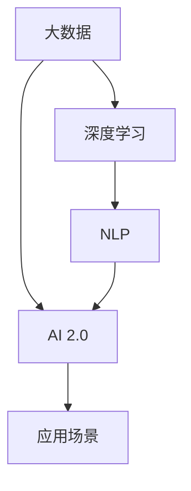

                 

# 李开复：AI 2.0 时代的产业

人工智能(AI)技术正在经历一个快速演进的过程。本文将深入探讨AI 2.0时代的产业转型和机遇，帮助读者理解这一变革性技术的潜在影响和应用。

## 1. 背景介绍

### 1.1 问题的由来

在过去的几年里，人工智能技术取得了显著进展。从早期的符号主义和连接主义，到深度学习的崛起，再到当前基于大数据和深度学习的AI，AI技术在各个领域的应用已经非常广泛。例如，在图像识别、语音识别、自然语言处理、机器翻译等方面，AI技术已经超越了人类的水平。

AI技术的迅速发展，带来了巨大的经济和社会效益，也引发了一系列新的挑战和问题。例如，AI技术的快速发展，使得许多企业需要重新审视其商业模式和运营策略。在AI 2.0时代，企业如何利用AI技术，提高效率，创造新的价值，成为亟待解决的问题。

### 1.2 问题核心关键点

AI 2.0时代的产业转型和机遇，核心关键点包括：

1. AI技术的发展，对各个行业带来了深远的影响。例如，AI技术在制造业中的应用，可以提高生产效率，减少废品率，降低成本。在医疗领域，AI技术可以帮助医生进行诊断和治疗，提高医疗服务质量。

2. AI技术的发展，推动了各行业的数字化转型。例如，零售行业利用AI技术进行智能仓储和物流管理，提高供应链效率。金融行业利用AI技术进行风险控制和客户服务，提高服务质量。

3. AI技术的发展，创造了新的商业模式。例如，AI技术可以帮助企业进行市场预测和客户分析，提供个性化的服务。在广告和营销领域，AI技术可以优化广告投放策略，提高广告投放效果。

4. AI技术的发展，带来了新的就业机会。例如，AI技术的发展，需要大量的数据科学家、AI工程师和产品经理等专业人才。

## 2. 核心概念与联系

### 2.1 核心概念概述

为了更好地理解AI 2.0时代的产业，需要理解以下几个核心概念：

- **AI 2.0**：AI 2.0是指新一代的人工智能技术，基于大数据、深度学习和自然语言处理等技术，具有更强的自适应能力和智能化水平。AI 2.0能够处理更加复杂的数据，具备更高的预测和决策能力，能够在更广泛的领域中应用。

- **大数据**：大数据是指规模巨大、复杂多样、高速流动的数据集合。AI 2.0技术需要大量的数据来进行训练和优化，以提高其性能和准确性。

- **深度学习**：深度学习是一种基于人工神经网络的机器学习方法。深度学习能够自动从大量数据中学习特征，并在新的数据上表现良好。

- **自然语言处理(NLP)**：NLP是一种处理人类语言的技术。NLP技术可以使计算机理解和处理自然语言，实现人机对话、文本分类、情感分析等功能。

### 2.2 核心概念原理和架构的 Mermaid 流程图



这个流程图展示了大数据、深度学习和NLP技术之间的关系，以及它们如何共同构建了AI 2.0技术。

### 2.3 核心概念的联系

AI 2.0技术与其他核心概念的联系如下：

- **大数据和深度学习的联系**：大数据提供了AI 2.0技术所需的数据基础，深度学习算法从大数据中学习特征，并自动提取数据中的知识。

- **NLP和大数据、深度学习的联系**：NLP技术利用大数据和深度学习算法，实现对人类语言的理解和处理。

## 3. 核心算法原理 & 具体操作步骤

### 3.1 算法原理概述

AI 2.0技术的核心算法原理是基于深度学习和大数据的技术，通过自动学习特征和模式，实现对复杂问题的求解。AI 2.0技术的应用场景非常广泛，包括图像识别、语音识别、自然语言处理、机器翻译、智能推荐等。

### 3.2 算法步骤详解

AI 2.0技术的实现步骤如下：

1. 收集和处理大数据：利用大数据技术，收集和处理大规模的原始数据，并转化为模型所需的数据格式。

2. 训练和优化模型：利用深度学习算法，对收集的数据进行训练和优化，生成高精度的AI模型。

3. 部署和应用模型：将训练好的模型部署到实际应用场景中，并根据需要进行优化和调整。

### 3.3 算法优缺点

AI 2.0技术的优点包括：

- **高精度**：AI 2.0技术在处理复杂数据时，能够达到高精度的预测和决策。

- **自适应能力**：AI 2.0技术能够自动适应新的数据和场景，具有较强的自适应能力。

- **高效性**：AI 2.0技术能够快速处理大规模数据，具有高效性。

AI 2.0技术的缺点包括：

- **数据依赖**：AI 2.0技术需要大量的高质量数据进行训练，对数据的依赖较高。

- **模型复杂性**：AI 2.0技术模型的复杂性较高，需要大量的计算资源进行训练和优化。

- **可解释性**：AI 2.0技术的黑箱特性使得其决策过程难以解释，缺乏可解释性。

### 3.4 算法应用领域

AI 2.0技术在各个领域都有广泛的应用，例如：

- **医疗领域**：AI 2.0技术可以用于疾病诊断、治疗方案推荐、药物研发等方面。

- **金融领域**：AI 2.0技术可以用于风险控制、投资策略优化、客户服务等方面。

- **零售领域**：AI 2.0技术可以用于市场预测、库存管理、客户分析等方面。

- **制造业**：AI 2.0技术可以用于生产调度、质量控制、设备维护等方面。

## 4. 数学模型和公式 & 详细讲解 & 举例说明

### 4.1 数学模型构建

AI 2.0技术的数学模型通常基于深度神经网络，如图像识别中的卷积神经网络(CNN)、自然语言处理中的循环神经网络(RNN)、深度学习中的自编码器(AE)等。这些模型通过自动学习特征和模式，实现对复杂数据的处理和分析。

### 4.2 公式推导过程

以卷积神经网络(CNN)为例，其公式推导过程如下：

1. 卷积层：利用卷积核对输入数据进行卷积运算，得到特征图。

2. 池化层：利用池化操作对特征图进行下采样，减少特征图的大小和计算量。

3. 全连接层：将池化层的输出通过全连接层进行分类或回归。

### 4.3 案例分析与讲解

以图像识别为例，AI 2.0技术可以用于识别图像中的物体，其具体流程如下：

1. 收集和预处理数据：收集大量的图像数据，并进行预处理，如缩放、裁剪、归一化等。

2. 训练卷积神经网络：利用卷积神经网络对预处理后的图像数据进行训练，生成模型参数。

3. 测试和优化模型：在测试数据集上测试模型性能，并根据测试结果进行优化，提高模型准确性。

## 5. 项目实践：代码实例和详细解释说明

### 5.1 开发环境搭建

在进行AI 2.0技术的项目实践时，需要搭建好开发环境。以下是搭建开发环境的详细说明：

1. 安装Python：Python是AI 2.0技术的主要编程语言，需要确保Python 3.7或以上版本的安装。

2. 安装TensorFlow和PyTorch：TensorFlow和PyTorch是两个广泛使用的深度学习框架，需要安装相应的版本。

3. 安装其他依赖库：如Numpy、Pandas、Scikit-learn等库，用于数据处理和模型优化。

### 5.2 源代码详细实现

以图像识别为例，AI 2.0技术的实现代码如下：

```python
import tensorflow as tf
import numpy as np
import pandas as pd

# 读取数据集
data = pd.read_csv('data.csv')

# 预处理数据
data = preprocess(data)

# 定义模型
model = tf.keras.Sequential([
    tf.keras.layers.Conv2D(32, (3, 3), activation='relu', input_shape=(32, 32, 3)),
    tf.keras.layers.MaxPooling2D((2, 2)),
    tf.keras.layers.Flatten(),
    tf.keras.layers.Dense(10, activation='softmax')
])

# 编译模型
model.compile(optimizer='adam', loss='categorical_crossentropy', metrics=['accuracy'])

# 训练模型
model.fit(data, labels, epochs=10)

# 测试模型
test_data = load_test_data()
test_labels = load_test_labels()
loss, accuracy = model.evaluate(test_data, test_labels)
print('Test loss:', loss)
print('Test accuracy:', accuracy)
```

### 5.3 代码解读与分析

这段代码实现了基于卷积神经网络的图像识别模型，具体步骤如下：

1. 读取和预处理数据：读取CSV格式的数据集，并进行预处理，如归一化、扩充等。

2. 定义模型：定义卷积神经网络模型，包括卷积层、池化层和全连接层。

3. 编译模型：编译模型，设置优化器、损失函数和评估指标。

4. 训练模型：使用训练数据集进行模型训练，设置训练轮数。

5. 测试模型：使用测试数据集进行模型测试，计算损失和准确率。

## 6. 实际应用场景

### 6.1 医疗领域

AI 2.0技术在医疗领域的应用非常广泛，例如：

- **疾病诊断**：利用AI 2.0技术进行医学影像分析，如X光片、CT扫描等。AI 2.0技术可以自动识别和分析医学影像，提高诊断速度和准确性。

- **治疗方案推荐**：利用AI 2.0技术分析患者的病历和基因信息，推荐个性化的治疗方案。

- **药物研发**：利用AI 2.0技术进行药物筛选和优化，加速新药研发进程。

### 6.2 金融领域

AI 2.0技术在金融领域的应用非常广泛，例如：

- **风险控制**：利用AI 2.0技术分析金融数据，进行风险预测和控制，降低金融风险。

- **投资策略优化**：利用AI 2.0技术进行投资组合优化，提高投资收益。

- **客户服务**：利用AI 2.0技术进行客户分析，提供个性化的金融服务，提升客户满意度。

### 6.3 零售领域

AI 2.0技术在零售领域的应用非常广泛，例如：

- **市场预测**：利用AI 2.0技术进行市场分析和预测，提高营销效果。

- **库存管理**：利用AI 2.0技术优化库存管理，减少库存积压和浪费。

- **客户分析**：利用AI 2.0技术分析客户数据，提供个性化的产品推荐和客户服务。

### 6.4 未来应用展望

AI 2.0技术在未来将会有更广泛的应用，例如：

- **自动驾驶**：利用AI 2.0技术进行环境感知、决策和控制，实现自动驾驶。

- **智能家居**：利用AI 2.0技术实现智能家居设备的互联互通，提高生活便利性和安全性。

- **智慧城市**：利用AI 2.0技术实现城市管理的智能化，提高城市运营效率和服务水平。

## 7. 工具和资源推荐

### 7.1 学习资源推荐

以下是一些优质的学习资源，推荐读者深入了解AI 2.0技术的原理和应用：

1. **《深度学习》**：Ian Goodfellow等著，深入浅出地介绍了深度学习的基础知识和算法。

2. **《Python深度学习》**：Francois Chollet著，介绍了使用Keras进行深度学习的实践。

3. **《TensorFlow实战》**：Xavier Bresson等著，介绍了使用TensorFlow进行深度学习的实践。

4. **Coursera AI课程**：斯坦福大学等高校提供的AI相关课程，包括深度学习、机器学习等。

5. **Kaggle竞赛**：Kaggle提供了丰富的数据集和竞赛项目，可以帮助读者实践AI 2.0技术。

### 7.2 开发工具推荐

以下是一些常用的开发工具，推荐读者使用：

1. **TensorFlow**：由Google开发，是一个开源的深度学习框架，支持多种硬件平台。

2. **PyTorch**：由Facebook开发，是一个开源的深度学习框架，支持动态图和静态图计算。

3. **Keras**：一个高层次的深度学习库，简单易用，适合初学者。

4. **Jupyter Notebook**：一个交互式的编程环境，支持Python代码的编写和执行。

5. **Google Colab**：一个基于云的Jupyter Notebook环境，可以免费使用GPU和TPU算力。

### 7.3 相关论文推荐

以下是一些优秀的论文，推荐读者阅读：

1. **ImageNet Large Scale Visual Recognition Challenge**：Alex Krizhevsky等著，介绍了使用深度学习进行图像识别的思路。

2. **Natural Language Processing with Transformers**：Jacob Devlin等著，介绍了使用Transformer进行自然语言处理的思路。

3. **Attention is All You Need**：Ashish Vaswani等著，介绍了使用Transformer进行序列建模的思路。

4. **Deep Learning for Self-Driving Cars**：Andrej Karpathy等著，介绍了使用深度学习进行自动驾驶的思路。

## 8. 总结：未来发展趋势与挑战

### 8.1 研究成果总结

AI 2.0技术的发展，带来了许多新的研究成果，例如：

1. **深度学习**：深度学习技术在图像识别、自然语言处理、语音识别等领域取得了重大突破。

2. **自然语言处理**：自然语言处理技术可以自动理解人类语言，实现人机对话、文本分类、情感分析等功能。

3. **知识图谱**：知识图谱是一种用于描述知识关系的图结构，可以实现知识推理和搜索。

### 8.2 未来发展趋势

AI 2.0技术在未来将会有以下发展趋势：

1. **更广泛的应用**：AI 2.0技术将应用于更多的领域，如自动驾驶、智能家居、智慧城市等。

2. **更高效的技术**：AI 2.0技术将不断优化和改进，提高计算效率和性能。

3. **更强的自适应能力**：AI 2.0技术将具有更强的自适应能力，可以适应各种不同的数据和场景。

4. **更广泛的数据**：AI 2.0技术将利用更广泛的数据进行训练和优化，提高模型的准确性和鲁棒性。

### 8.3 面临的挑战

AI 2.0技术在发展过程中也面临一些挑战：

1. **数据质量问题**：AI 2.0技术需要大量的高质量数据进行训练，数据质量问题仍然是一个挑战。

2. **模型复杂性问题**：AI 2.0技术模型通常比较复杂，训练和优化需要大量的计算资源。

3. **可解释性问题**：AI 2.0技术的黑箱特性使得其决策过程难以解释，缺乏可解释性。

### 8.4 研究展望

AI 2.0技术的研究展望包括：

1. **跨领域融合**：AI 2.0技术将与其他领域的技术进行跨领域融合，实现更广泛的应用。

2. **深度学习和知识图谱的结合**：深度学习和知识图谱的结合，将使AI 2.0技术更具智能和可解释性。

3. **模型压缩和优化**：如何提高AI 2.0技术的计算效率和性能，是一个重要的研究方向。

## 9. 附录：常见问题与解答

**Q1：AI 2.0技术是否可以应用于所有行业？**

A: AI 2.0技术在各个行业都有广泛的应用，但具体应用场景需要根据行业特点进行定制和优化。例如，在医疗和金融领域，AI 2.0技术需要考虑隐私和安全性问题。

**Q2：AI 2.0技术的训练需要大量数据吗？**

A: AI 2.0技术的训练需要大量的高质量数据，但一些领域（如NLP领域）可以使用少量数据进行微调，以提高模型性能。

**Q3：AI 2.0技术的开发是否需要高水平的工程师？**

A: AI 2.0技术的开发需要高水平的工程师，包括数据科学家、AI工程师和产品经理等。这些工程师需要具备较强的数据分析和算法设计能力。

**Q4：AI 2.0技术的未来发展方向是什么？**

A: AI 2.0技术的未来发展方向包括跨领域融合、深度学习和知识图谱的结合、模型压缩和优化等。这些方向将使AI 2.0技术更具智能和可解释性。

**Q5：AI 2.0技术是否会对就业市场产生影响？**

A: AI 2.0技术的发展将对就业市场产生影响，但同时也将创造新的就业机会。例如，AI 2.0技术需要大量的专业人才，包括数据科学家、AI工程师和产品经理等。

---

作者：禅与计算机程序设计艺术 / Zen and the Art of Computer Programming

