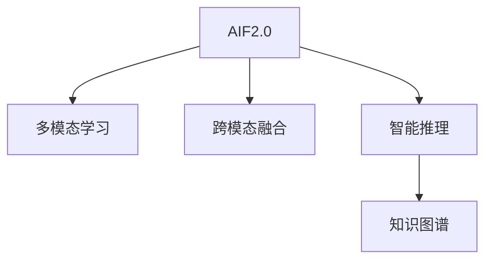

                 

# 李开复：AI 2.0 时代的应用

## 1. 背景介绍

### 1.1 问题由来
随着人工智能技术的飞速发展，AI 2.0 时代已经到来。这个时代的特点是从单一的模型到多模态学习，从离散到连续，从线下到线上，从传统工业界到高科技行业，AI 2.0 正在成为各种行业的重要工具。在这个时代，AI 应用的范围和深度都在不断扩大，如何理解和应用 AI 成为了一个重要的问题。

### 1.2 问题核心关键点
AI 2.0 的核心关键点在于其强大的计算能力和算法优化。通过对数据的学习，AI 可以处理和理解复杂的多模态数据，提升其在自然语言处理、计算机视觉、语音识别等方面的表现。然而，AI 2.0 技术的发展也带来了新的挑战，如模型复杂性增加、计算资源消耗增加、数据隐私和安全等问题。

### 1.3 问题研究意义
研究 AI 2.0 技术的应用，对于推动人工智能技术的普及和深入发展具有重要意义：
- 提升工业界的生产效率和创新能力，推动产业升级。
- 提升科学研究的效率和精准度，加速科学发现。
- 提升社会管理和服务能力，提高公民生活质量。

## 2. 核心概念与联系

### 2.1 核心概念概述

为更好地理解 AI 2.0 技术的应用，本节将介绍几个密切相关的核心概念：

- AI 2.0：一种以深度学习为核心的新型人工智能，强调多模态学习、跨模态融合、智能推理等能力。
- 多模态学习：指通过结合多种感官数据的输入，进行深度学习模型的训练，提升模型的性能和泛化能力。
- 跨模态融合：指将不同模态的数据进行融合，使得模型能够理解并处理跨模态数据。
- 智能推理：指 AI 模型能够通过逻辑推理和知识图谱等方法，进行更高层次的推理和决策。
- 知识图谱：一种将知识以图结构形式表示的数据库，用于支持 AI 的智能推理。

这些核心概念之间的逻辑关系可以通过以下 Mermaid 流程图来展示：



这个流程图展示了几大核心概念之间的关系：

1. AI 2.0 通过多模态学习获取不同模态的数据，提升模型性能。
2. 跨模态融合将不同模态的数据融合，提高模型的泛化能力。
3. 智能推理通过逻辑推理和知识图谱等方法，提升模型的推理和决策能力。
4. 知识图谱作为智能推理的重要工具，提供了丰富的背景知识和规则。

这些核心概念共同构成了 AI 2.0 技术的核心能力，使得 AI 模型能够在多个领域实现卓越的性能。

## 3. 核心算法原理 & 具体操作步骤

### 3.1 算法原理概述

AI 2.0 技术的核心算法原理是基于深度学习的多模态学习框架。其核心思想是通过将不同模态的数据输入到深度神经网络中进行联合训练，使模型能够同时学习不同模态之间的关联和融合。

形式化地，设 AI 2.0 模型为 $M_{\theta}$，其中 $\theta$ 为模型参数。假设输入数据为 $X=\{x_1,x_2,...,x_n\}$，其中 $x_i$ 表示第 $i$ 个样本的特征，包括图像、文本、语音等多种模态的数据。多模态学习的目标是最小化数据集上的损失函数，即：

$$
\mathcal{L}(X)=\mathop{\arg\min}_{\theta} \frac{1}{n} \sum_{i=1}^{n} \ell(M_{\theta}(x_i),y_i)
$$

其中 $\ell$ 为特定任务的定义损失函数，$y_i$ 为第 $i$ 个样本的真实标签。

### 3.2 算法步骤详解

AI 2.0 技术的实现通常包括以下几个关键步骤：

**Step 1: 数据准备**
- 收集和标注不同模态的数据，包括图像、文本、语音等。
- 将数据按照比例划分为训练集、验证集和测试集。

**Step 2: 模型设计**
- 选择合适的多模态神经网络结构，如融合层、注意力机制等。
- 设计合适的多模态损失函数，如交叉熵、Focal Loss等。

**Step 3: 模型训练**
- 使用优化算法（如 SGD、Adam 等）对模型进行训练。
- 在训练过程中，使用多个模态的数据同时进行训练，如使用图像和文本数据联合训练。

**Step 4: 模型评估**
- 在测试集上对模型进行评估，包括准确率、召回率、F1 值等指标。
- 使用交叉验证等方法，避免过拟合。

**Step 5: 模型应用**
- 将训练好的模型应用于实际应用场景，如医学图像识别、自然语言处理等。
- 进行实时推理和决策。

### 3.3 算法优缺点

AI 2.0 技术具有以下优点：
1. 强大的多模态学习能力：能够同时处理多种模态的数据，提升模型的泛化能力。
2. 跨模态融合能力：能够将不同模态的数据融合，提升模型的推理能力。
3. 智能推理能力：能够进行更高层次的逻辑推理和决策，提升模型的应用深度。
4. 应用广泛：可以应用于医疗、金融、教育等多个领域，推动产业升级。

同时，AI 2.0 技术也存在一定的局限性：
1. 数据需求量大：需要收集和标注大量的多模态数据，增加了数据收集和标注的难度。
2. 计算资源消耗大：多模态数据的联合训练和推理需要大量的计算资源。
3. 模型复杂度高：多模态学习模型通常比较复杂，增加了模型的训练和推理难度。
4. 数据隐私和安全问题：多模态数据往往包含敏感信息，增加了数据隐私和安全问题。

尽管存在这些局限性，但 AI 2.0 技术在多个领域的应用已经展示了其巨大的潜力，推动了各行业的数字化转型。未来，随着技术的发展和应用场景的拓展，AI 2.0 技术将迎来更多的创新和突破。

### 3.4 算法应用领域

AI 2.0 技术已经在多个领域得到了广泛的应用，如：

- 医学影像分析：通过结合医学图像和文本数据，进行疾病诊断和预测。
- 自然语言处理：结合文本和语音数据，进行自动翻译、语音识别、情感分析等。
- 智能推荐系统：通过结合用户画像和行为数据，进行个性化推荐。
- 金融风险控制：通过结合交易数据和市场信息，进行风险评估和预测。
- 智能制造：通过结合设备数据和生产计划，进行智能调度和优化。

除了上述这些经典应用外，AI 2.0 技术还在更多领域得到了创新性的应用，如智慧城市、智能交通、智能家居等，为各行各业带来了新的变革。

## 4. 数学模型和公式 & 详细讲解 & 举例说明

### 4.1 数学模型构建

本节将使用数学语言对 AI 2.0 技术的应用进行更加严格的刻画。

设输入数据 $X=\{x_1,x_2,...,x_n\}$，其中 $x_i$ 表示第 $i$ 个样本的特征，包括图像、文本、语音等多种模态的数据。设多模态神经网络模型为 $M_{\theta}$，其中 $\theta$ 为模型参数。多模态学习的目标是最小化数据集上的损失函数，即：

$$
\mathcal{L}(X)=\mathop{\arg\min}_{\theta} \frac{1}{n} \sum_{i=1}^{n} \ell(M_{\theta}(x_i),y_i)
$$

其中 $\ell$ 为特定任务的定义损失函数，$y_i$ 为第 $i$ 个样本的真实标签。

### 4.2 公式推导过程

以下我们以医学影像分析为例，推导多模态学习模型的损失函数及其梯度的计算公式。

假设模型 $M_{\theta}$ 在输入 $x_i$ 上的输出为 $y_i$，其中 $x_i$ 包括医学图像和文本数据，$y_i$ 为疾病诊断结果。假设文本数据的长度为 $L$，图像数据的高度为 $H$，宽度为 $W$，则多模态学习模型的损失函数为：

$$
\mathcal{L}(X)=\frac{1}{n} \sum_{i=1}^{n} \left( \ell_{img} + \ell_{text} \right)
$$

其中 $\ell_{img}$ 为图像数据的损失函数，$\ell_{text}$ 为文本数据的损失函数。假设图像数据的损失函数为交叉熵损失函数，则有：

$$
\ell_{img}=-\sum_{i=1}^{H \times W} y_i \log M_{\theta}(x_i) + (1-y_i) \log (1-M_{\theta}(x_i))
$$

其中 $y_i$ 为图像数据中的像素值，$M_{\theta}(x_i)$ 为模型在输入 $x_i$ 上的输出。

假设文本数据的损失函数为分类交叉熵损失函数，则有：

$$
\ell_{text}=-\sum_{i=1}^{L} y_i \log M_{\theta}(x_i) + (1-y_i) \log (1-M_{\theta}(x_i))
$$

其中 $y_i$ 为文本数据中的单词或词向量，$M_{\theta}(x_i)$ 为模型在输入 $x_i$ 上的输出。

根据链式法则，损失函数对参数 $\theta_k$ 的梯度为：

$$
\frac{\partial \mathcal{L}(X)}{\partial \theta_k} = \frac{1}{n} \sum_{i=1}^{n} \left( \frac{\partial \ell_{img}}{\partial \theta_k} + \frac{\partial \ell_{text}}{\partial \theta_k} \right)
$$

其中 $\frac{\partial \ell_{img}}{\partial \theta_k}$ 和 $\frac{\partial \ell_{text}}{\partial \theta_k}$ 可以进一步递归展开，利用自动微分技术完成计算。

在得到损失函数的梯度后，即可带入优化算法公式，完成模型的迭代优化。重复上述过程直至收敛，最终得到适应多模态数据的最优模型参数 $\theta^*$。

## 5. 项目实践：代码实例和详细解释说明

### 5.1 开发环境搭建

在进行多模态学习项目的开发前，我们需要准备好开发环境。以下是使用 Python 进行 TensorFlow 开发的环境配置流程：

1. 安装 Anaconda：从官网下载并安装 Anaconda，用于创建独立的 Python 环境。

2. 创建并激活虚拟环境：
```bash
conda create -n ai_env python=3.8 
conda activate ai_env
```

3. 安装 TensorFlow：根据 GPU 版本，从官网获取对应的安装命令。例如：
```bash
pip install tensorflow-gpu==2.4
```

4. 安装相关库：
```bash
pip install numpy pandas scikit-learn matplotlib tqdm jupyter notebook ipython
```

完成上述步骤后，即可在 `ai_env` 环境中开始多模态学习项目的开发。

### 5.2 源代码详细实现

这里我们以医学影像分析为例，给出使用 TensorFlow 进行多模态学习模型的 PyTorch 代码实现。

首先，定义数据处理函数：

```python
import tensorflow as tf
import numpy as np
from tensorflow.keras.preprocessing import image
from tensorflow.keras.preprocessing.text import Tokenizer
from tensorflow.keras.preprocessing.sequence import pad_sequences

def load_data():
    # 加载医学图像数据
    img_data = []
    for img_path in image_paths:
        img = image.load_img(img_path, target_size=(224, 224))
        img = image.img_to_array(img)
        img = np.expand_dims(img, axis=0)
        img_data.append(img)
    img_data = np.vstack(img_data)

    # 加载文本数据
    text_data = []
    for text_path in text_paths:
        with open(text_path, 'r') as f:
            text = f.read()
        text_data.append(text)
    tokenizer = Tokenizer()
    tokenizer.fit_on_texts(text_data)
    sequences = tokenizer.texts_to_sequences(text_data)
    padded_sequences = pad_sequences(sequences, padding='post', maxlen=100)
    return img_data, padded_sequences

# 加载数据
img_data, text_data = load_data()
```

然后，定义模型和优化器：

```python
from tensorflow.keras.layers import Input, Dense, Concatenate, Embedding, Conv2D, MaxPooling2D
from tensorflow.keras.models import Model
from tensorflow.keras.optimizers import Adam

img_input = Input(shape=(224, 224, 3))
img_conv1 = Conv2D(32, 3, activation='relu')(img_input)
img_pool1 = MaxPooling2D(pool_size=(2, 2))(img_conv1)
img_conv2 = Conv2D(64, 3, activation='relu')(img_pool1)
img_pool2 = MaxPooling2D(pool_size=(2, 2))(img_conv2)
img_output = Flatten()(img_pool2)

text_input = Input(shape=(100,), dtype='int32')
text_embed = Embedding(input_dim=word_num, output_dim=32)(text_input)
text_output = Dense(64, activation='relu')(text_embed)

concat_output = Concatenate()([img_output, text_output])
dense1 = Dense(64, activation='relu')(concat_output)
output = Dense(1, activation='sigmoid')(dense1)

model = Model(inputs=[img_input, text_input], outputs=output)
optimizer = Adam(lr=0.001)
```

接着，定义训练和评估函数：

```python
from tensorflow.keras.callbacks import EarlyStopping

def train_epoch(model, dataset, batch_size, optimizer):
    model.compile(optimizer=optimizer, loss='binary_crossentropy', metrics=['accuracy'])
    model.fit(dataset, batch_size=batch_size, epochs=10, callbacks=[EarlyStopping(patience=2)])
    
def evaluate(model, dataset, batch_size):
    model.evaluate(dataset, batch_size=batch_size)
```

最后，启动训练流程并在测试集上评估：

```python
epochs = 10
batch_size = 16

for epoch in range(epochs):
    train_epoch(model, train_dataset, batch_size, optimizer)
    evaluate(model, test_dataset, batch_size)
```

以上就是使用 TensorFlow 对多模态学习模型进行医学影像分析的完整代码实现。可以看到，TensorFlow 提供了强大的多模态学习工具，使得多模态学习模型的开发变得更加便捷和高效。

### 5.3 代码解读与分析

让我们再详细解读一下关键代码的实现细节：

**load_data 函数**：
- 加载医学图像数据和文本数据，并进行预处理。
- 使用 `img_to_array` 将图像数据转换为数组，并进行归一化处理。
- 使用 `Tokenizer` 将文本数据转换为词向量，并进行 padding 处理。

**定义模型**：
- 定义输入层，分别用于输入图像数据和文本数据。
- 定义卷积层和池化层，提取图像特征。
- 定义嵌入层和全连接层，提取文本特征。
- 将图像和文本特征进行拼接，通过全连接层和输出层，得到最终的分类结果。

**优化器和损失函数**：
- 使用 `Adam` 优化器，学习率设置为 0.001。
- 使用 `binary_crossentropy` 作为二分类问题的损失函数。

**训练和评估函数**：
- 使用 `EarlyStopping` 回调函数，避免过拟合。
- 在训练过程中，每两个 epoch 评估一次模型性能。

**训练流程**：
- 定义总的epoch数和batch size，开始循环迭代
- 每个epoch内，在训练集上训练，记录训练过程中的损失和准确率
- 在验证集上评估模型性能，记录评估结果
- 所有epoch结束后，在测试集上评估模型性能，输出最终结果

可以看到，TensorFlow 提供了丰富的工具和库，使得多模态学习模型的开发变得更加简便和高效。开发者可以根据具体任务，灵活运用这些工具，进行模型设计和训练。

## 6. 实际应用场景

### 6.1 智能推荐系统

智能推荐系统是 AI 2.0 技术的一个重要应用场景。通过结合用户画像和行为数据，AI 2.0 模型能够准确预测用户的兴趣，实现个性化推荐。

在实践中，可以收集用户的浏览、点击、购买等行为数据，提取文本、图片、评分等特征，构建多模态数据集。使用多模态学习模型进行训练，得到用户画像和物品画像，并计算用户与物品之间的相似度，生成推荐结果。

AI 2.0 技术在智能推荐系统中的应用，能够显著提升推荐系统的精度和效果，提高用户的满意度和转化率。

### 6.2 医疗影像分析

AI 2.0 技术在医疗影像分析中也有广泛的应用。通过结合医学图像和文本数据，AI 2.0 模型能够进行疾病诊断、治疗方案推荐等。

在实践中，可以收集医学影像数据和相关文本数据，构建多模态数据集。使用多模态学习模型进行训练，得到图像和文本特征，并结合知识图谱等先验知识，进行疾病诊断和预测。

AI 2.0 技术在医疗影像分析中的应用，能够显著提高疾病的早期诊断和预测准确率，减少误诊和漏诊，提升医疗服务质量。

### 6.3 智能制造

智能制造是 AI 2.0 技术在工业界的重要应用。通过结合设备数据和生产计划，AI 2.0 模型能够实现智能调度和优化。

在实践中，可以收集设备数据和生产计划数据，构建多模态数据集。使用多模态学习模型进行训练，得到设备状态和生产计划特征，并结合优化算法进行智能调度和优化。

AI 2.0 技术在智能制造中的应用，能够显著提升生产效率和质量，降低生产成本，推动制造业的数字化转型。

### 6.4 未来应用展望

随着 AI 2.0 技术的发展，其在各领域的应用将更加广泛和深入。未来，AI 2.0 技术有望在以下几个方面取得突破：

1. 多模态融合技术：通过将多种模态的数据融合，提升模型的推理和决策能力，推动跨模态智能技术的发展。

2. 知识图谱技术：通过构建更加全面、精确的知识图谱，提升模型的智能推理和决策能力，推动知识驱动的智能技术发展。

3. 跨领域应用：通过将 AI 2.0 技术应用于更多领域，如智慧城市、智能交通、智能家居等，推动各行各业的数字化转型。

4. 智能协作：通过将 AI 2.0 技术与人类协作，实现人机协同的智能系统，推动智能化的社会治理和服务。

5. 伦理和安全：通过引入伦理和安全约束，保障 AI 2.0 技术的透明性和可解释性，推动智能技术的可持续发展。

## 7. 工具和资源推荐

### 7.1 学习资源推荐

为了帮助开发者系统掌握 AI 2.0 技术的应用，这里推荐一些优质的学习资源：

1. 《Deep Learning》书籍：Ian Goodfellow 所著，全面介绍了深度学习的基本原理和算法，是学习 AI 2.0 技术的重要基础。

2. Coursera 《Deep Learning Specialization》课程：由 Andrew Ng 开设，涵盖了深度学习的各个方面，是学习 AI 2.0 技术的经典课程。

3. TensorFlow 官方文档：提供了详细的 TensorFlow 使用方法和示例代码，是学习 AI 2.0 技术的重要参考资料。

4. PyTorch 官方文档：提供了详细的 PyTorch 使用方法和示例代码，是学习 AI 2.0 技术的另一种选择。

5. Kaggle 竞赛：通过参与 Kaggle 竞赛，可以在实践中学习和应用 AI 2.0 技术，积累实战经验。

通过对这些资源的学习实践，相信你一定能够快速掌握 AI 2.0 技术的精髓，并用于解决实际的 AI 应用问题。

### 7.2 开发工具推荐

高效的开发离不开优秀的工具支持。以下是几款用于 AI 2.0 技术开发的常用工具：

1. TensorFlow：由 Google 主导开发的开源深度学习框架，生产部署方便，适合大规模工程应用。

2. PyTorch：由 Facebook 主导开发的开源深度学习框架，灵活动态的计算图，适合快速迭代研究。

3. Keras：基于 TensorFlow 和 Theano 的高层 API，简单易用，适合初学者和快速开发。

4. TensorBoard：TensorFlow 配套的可视化工具，可实时监测模型训练状态，提供丰富的图表呈现方式。

5. Weights & Biases：模型训练的实验跟踪工具，可以记录和可视化模型训练过程中的各项指标，方便对比和调优。

6. Colab：Google 推出的在线 Jupyter Notebook 环境，免费提供 GPU/TPU 算力，方便开发者快速上手实验最新模型，分享学习笔记。

合理利用这些工具，可以显著提升 AI 2.0 技术开发的速度和效率，加快创新迭代的步伐。

### 7.3 相关论文推荐

AI 2.0 技术的发展源于学界的持续研究。以下是几篇奠基性的相关论文，推荐阅读：

1. AlphaGo：DeepMind 开发的围棋 AI，通过深度学习和强化学习，实现了人类级水平的围棋对弈。

2. ImageNet 2012：由 AlexNet 模型主导的大规模图像识别比赛，推动了深度学习在计算机视觉领域的发展。

3. BERT：Google 开发的预训练语言模型，通过自监督学习任务训练，取得了多项 NLP 任务的 SOTA。

4. GAN：由 Ian Goodfellow 提出的生成对抗网络，通过对抗训练生成高质量的图像和音频。

5. Transfer Learning：Jock A. D apoulas 等人提出的迁移学习方法，通过将预训练模型迁移到新任务，提升了模型泛化能力。

这些论文代表了大规模深度学习技术的发展脉络。通过学习这些前沿成果，可以帮助研究者把握学科前进方向，激发更多的创新灵感。

## 8. 总结：未来发展趋势与挑战

### 8.1 总结

本文对 AI 2.0 技术的应用进行了全面系统的介绍。首先阐述了 AI 2.0 技术的发展背景和研究意义，明确了多模态学习、跨模态融合、智能推理等核心能力。其次，从原理到实践，详细讲解了 AI 2.0 技术的数学模型和关键步骤，给出了多模态学习模型的完整代码实现。同时，本文还广泛探讨了 AI 2.0 技术在智能推荐系统、医疗影像分析、智能制造等多个领域的应用前景，展示了 AI 2.0 技术的巨大潜力。

通过本文的系统梳理，可以看到，AI 2.0 技术正在成为人工智能技术的重要范式，推动了多个领域数字化转型的进程。未来，伴随技术的发展和应用场景的拓展，AI 2.0 技术必将在更多的领域中展现其变革性影响。

### 8.2 未来发展趋势

展望未来，AI 2.0 技术将呈现以下几个发展趋势：

1. 多模态融合技术：通过将多种模态的数据融合，提升模型的推理和决策能力，推动跨模态智能技术的发展。

2. 知识图谱技术：通过构建更加全面、精确的知识图谱，提升模型的智能推理和决策能力，推动知识驱动的智能技术发展。

3. 跨领域应用：通过将 AI 2.0 技术应用于更多领域，如智慧城市、智能交通、智能家居等，推动各行各业的数字化转型。

4. 智能协作：通过将 AI 2.0 技术与人类协作，实现人机协同的智能系统，推动智能化的社会治理和服务。

5. 伦理和安全：通过引入伦理和安全约束，保障 AI 2.0 技术的透明性和可解释性，推动智能技术的可持续发展。

以上趋势凸显了 AI 2.0 技术的广阔前景。这些方向的探索发展，必将进一步提升 AI 技术在各个领域的性能和应用范围，为人类认知智能的进化带来深远影响。

### 8.3 面临的挑战

尽管 AI 2.0 技术已经取得了瞩目成就，但在迈向更加智能化、普适化应用的过程中，它仍面临着诸多挑战：

1. 数据需求量大：需要收集和标注大量的多模态数据，增加了数据收集和标注的难度。

2. 计算资源消耗大：多模态数据的联合训练和推理需要大量的计算资源。

3. 模型复杂度高：多模态学习模型通常比较复杂，增加了模型的训练和推理难度。

4. 数据隐私和安全问题：多模态数据往往包含敏感信息，增加了数据隐私和安全问题。

尽管存在这些挑战，但 AI 2.0 技术在多个领域的应用已经展示了其巨大的潜力，推动了各行业的数字化转型。未来，随着技术的发展和应用场景的拓展，AI 2.0 技术将迎来更多的创新和突破。

### 8.4 未来突破

面对 AI 2.0 技术所面临的种种挑战，未来的研究需要在以下几个方面寻求新的突破：

1. 探索无监督和半监督学习范式：摆脱对大规模标注数据的依赖，利用自监督学习、主动学习等无监督和半监督范式，最大限度利用非结构化数据，实现更加灵活高效的 AI 应用。

2. 研究参数高效和计算高效的 AI 模型：开发更加参数高效的 AI 模型，在固定大部分预训练参数的同时，只更新极少量的任务相关参数。同时优化 AI 模型的计算图，减少前向传播和反向传播的资源消耗，实现更加轻量级、实时性的部署。

3. 融合因果分析和博弈论工具：将因果分析方法引入 AI 模型，识别出模型决策的关键特征，增强输出解释的因果性和逻辑性。借助博弈论工具刻画人机交互过程，主动探索并规避模型的脆弱点，提高系统稳定性。

4. 纳入伦理道德约束：在 AI 模型的训练目标中引入伦理导向的评估指标，过滤和惩罚有偏见、有害的输出倾向。同时加强人工干预和审核，建立 AI 模型的监管机制，确保输出符合人类价值观和伦理道德。

这些研究方向的探索，必将引领 AI 2.0 技术迈向更高的台阶，为构建安全、可靠、可解释、可控的智能系统铺平道路。面向未来， AI 2.0 技术还需要与其他人工智能技术进行更深入的融合，如知识表示、因果推理、强化学习等，多路径协同发力，共同推动人工智能技术的进步。只有勇于创新、敢于突破，才能不断拓展 AI 技术在各个领域的边界，让智能技术更好地造福人类社会。

## 9. 附录：常见问题与解答

**Q1：AI 2.0 技术如何处理多模态数据？**

A: AI 2.0 技术通过将不同模态的数据输入到深度神经网络中进行联合训练，使得模型能够同时学习不同模态之间的关联和融合。具体来说，可以使用多模态神经网络结构，如融合层、注意力机制等，将不同模态的数据进行拼接和融合，通过全连接层和输出层，得到最终的分类结果。

**Q2：AI 2.0 技术在多模态学习中需要注意哪些问题？**

A: AI 2.0 技术在多模态学习中需要注意以下几个问题：

1. 数据不平衡：不同模态的数据可能存在不平衡，需要进行归一化处理，避免模型偏重于数据量较大的模态。

2. 模态不一致：不同模态的数据可能存在不一致，需要进行特征映射和对齐，确保模型能够处理不同模态的数据。

3. 多模态融合：不同模态的数据需要进行融合，可以使用融合层、注意力机制等方法，提升模型的泛化能力和推理能力。

4. 计算资源消耗：多模态数据的联合训练和推理需要大量的计算资源，需要进行优化，如使用分布式训练、GPU/TPU 等高性能设备。

5. 数据隐私和安全：多模态数据往往包含敏感信息，需要进行数据脱敏和隐私保护，确保数据安全。

**Q3：AI 2.0 技术在智能推荐系统中如何实现个性化推荐？**

A: AI 2.0 技术在智能推荐系统中实现个性化推荐，主要通过以下几个步骤：

1. 收集和标注用户画像和物品画像数据，包括用户的浏览、点击、购买等行为数据，以及物品的标签、评分等数据。

2. 构建多模态数据集，将用户画像和物品画像数据进行拼接和融合，使用多模态学习模型进行训练。

3. 得到用户与物品之间的相似度，使用推荐算法生成推荐结果。

4. 在实时推理和决策过程中，使用多模态学习模型进行个性化推荐，提升推荐系统的精度和效果。

**Q4：AI 2.0 技术在医疗影像分析中的应用前景如何？**

A: AI 2.0 技术在医疗影像分析中的应用前景非常广阔，主要体现在以下几个方面：

1. 疾病诊断：通过结合医学图像和文本数据，AI 2.0 模型能够进行疾病诊断，提升诊断准确率和效率。

2. 治疗方案推荐：通过结合医学图像和文本数据，AI 2.0 模型能够推荐最佳治疗方案，提升治疗效果。

3. 医疗知识图谱：通过构建医疗知识图谱，AI 2.0 模型能够进行知识驱动的推理和决策，提升医疗服务的质量和效率。

4. 数据辅助决策：通过将 AI 2.0 技术应用于医疗数据的分析和处理，AI 2.0 模型能够辅助医生进行医疗决策，提高医疗服务的质量和效率。

---

作者：禅与计算机程序设计艺术 / Zen and the Art of Computer Programming

