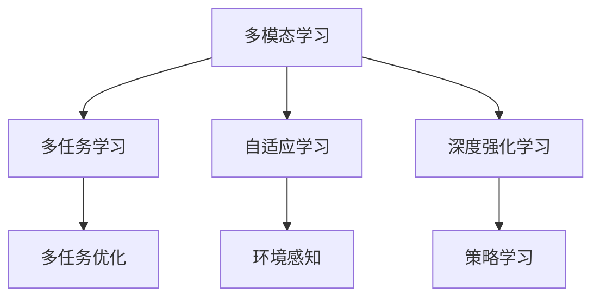

                 

# 李开复：AI 2.0 时代的意义

## 1. 背景介绍

人工智能（AI）的发展经历了从 1.0 到 2.0 的转变，这是一个涉及技术、伦理和社会影响的全方位变革。在李开复看来，AI 2.0 时代标志着人类与机器的深度融合，不仅推动了科技的飞跃，也带来了社会结构与伦理的深刻变化。本文将探讨 AI 2.0 时代的重要意义，分析其核心技术、应用场景及其未来趋势。

### 1.1 问题由来

随着深度学习、大数据、计算力等技术的进步，AI 1.0 时代已经结束，迎来了以自然语言处理、计算机视觉、强化学习等为代表的 AI 2.0 时代。AI 2.0 时代的到来，不仅仅是技术上的突破，更是对人类社会各个领域的深刻影响。

AI 2.0 时代的核心在于其更加高级的模型架构和算法，如卷积神经网络（CNN）、递归神经网络（RNN）、Transformer 等，这些模型能够处理更加复杂、多变的数据类型和任务。同时，AI 2.0 时代还涌现了大量应用，从智能助理、自动驾驶到医疗诊断、金融分析，AI 在各个领域展现出了前所未有的潜力。

### 1.2 问题核心关键点

AI 2.0 时代的关键在于其多模态、多任务、自适应等特点，这些特点使得 AI 能够更加贴近人类的真实需求和行为。同时，AI 2.0 时代的伦理、隐私、安全等问题也逐渐凸显，需要社会各界共同面对和解决。

AI 2.0 时代的技术突破主要体现在以下几个方面：
- 多模态学习：AI 能够处理多种数据类型（如文本、图像、音频），进行跨模态信息融合，提升决策的全面性和准确性。
- 多任务学习：AI 能够同时学习多个任务，实现任务的协同优化，提高效率和效果。
- 自适应学习：AI 能够根据环境和数据的变化进行自我调整，提升鲁棒性和适应性。

## 2. 核心概念与联系

### 2.1 核心概念概述

在 AI 2.0 时代，以下几个核心概念尤为关键：

- **多模态学习**：指 AI 模型能够处理和融合多种类型的数据，如图像、文本、声音等，从而进行更加全面、准确的信息处理。
- **多任务学习**：指 AI 模型能够同时学习多个任务，通过任务之间的知识共享，提升整体性能。
- **自适应学习**：指 AI 模型能够根据环境和数据的变化进行自我调整，提高模型的鲁棒性和适应性。
- **深度强化学习**：指 AI 通过与环境的交互，不断调整自身策略，以最大化长期奖励。

这些核心概念相互交织，共同推动了 AI 2.0 时代的发展。下面通过 Mermaid 流程图（不要包含括号、逗号等特殊字符）来展示它们之间的联系：



### 2.2 核心概念原理

**多模态学习**：多模态学习通过融合多种数据类型的信息，提升模型的决策能力。以图像和文本结合为例，通过同时利用视觉和语言信息，可以更准确地理解场景和语义。

**多任务学习**：多任务学习通过共享低层次的特征表示，同时优化多个任务的目标函数，提升模型的整体性能。例如，在翻译任务中，模型可以同时学习语言模型的生成和翻译目标的预测。

**自适应学习**：自适应学习通过在线学习的方式，实时调整模型参数以适应新数据。例如，在在线推荐系统中，模型可以实时更新用户偏好和商品特征。

**深度强化学习**：深度强化学习通过模拟人类学习的方式，通过与环境的交互进行策略优化。例如，自动驾驶汽车通过不断地与道路环境交互，学习最优的驾驶策略。

## 3. 核心算法原理 & 具体操作步骤

### 3.1 算法原理概述

AI 2.0 时代的核心算法原理包括深度学习、迁移学习、多任务学习、强化学习等。这些算法通过不同方式，实现对复杂数据和任务的建模和处理。

深度学习通过构建多层神经网络，自动提取数据的高级特征，适用于各种复杂的模式识别任务。迁移学习通过将预训练模型的知识迁移到新任务上，降低标注数据的依赖，提升模型的泛化能力。多任务学习通过优化多个任务之间的协同，提升模型的整体性能。强化学习通过与环境的交互，优化模型的行为策略，适用于需要动态决策的任务。

### 3.2 算法步骤详解

AI 2.0 时代的算法步骤通常包括以下几个关键环节：

1. **数据预处理**：包括数据清洗、特征提取、数据增强等，确保数据的质量和多样性。
2. **模型构建**：选择合适的模型架构和算法，如卷积神经网络、递归神经网络、Transformer 等。
3. **训练和优化**：通过反向传播算法，优化模型参数，提升模型的准确性和泛化能力。
4. **评估和测试**：使用验证集和测试集评估模型性能，调整模型参数和策略。
5. **部署和应用**：将训练好的模型部署到实际应用场景中，进行实时推理和决策。

### 3.3 算法优缺点

AI 2.0 时代的算法具有以下优点：

- **泛化能力强**：通过迁移学习和多任务学习，AI 模型能够在多个数据集和任务上取得优异性能。
- **适应性强**：自适应学习和强化学习使得 AI 模型能够适应新数据和新场景，保持高性能。
- **精度高**：深度学习通过多层网络结构，自动提取高级特征，提升模型的准确性。

但同时，AI 2.0 时代的算法也存在一些缺点：

- **数据依赖大**：高质量的数据是模型训练和优化的关键，数据获取和标注成本较高。
- **计算资源需求高**：深度学习和强化学习需要大量计算资源，设备要求较高。
- **可解释性差**：深度学习模型通常是黑盒模型，难以解释其决策过程。

### 3.4 算法应用领域

AI 2.0 时代的算法在多个领域得到广泛应用，具体包括：

- **智能助理**：通过语音识别、自然语言处理等技术，实现人机交互。
- **自动驾驶**：通过计算机视觉、传感器融合等技术，实现自主导航和决策。
- **医疗诊断**：通过图像识别、自然语言处理等技术，辅助医生进行疾病诊断和手术规划。
- **金融分析**：通过深度学习、强化学习等技术，分析市场数据，预测股票价格和风险。
- **智能制造**：通过机器视觉、物联网等技术，实现智能制造和质量控制。

## 4. 数学模型和公式 & 详细讲解 & 举例说明

### 4.1 数学模型构建

AI 2.0 时代的数学模型通常基于深度学习框架，如 TensorFlow、PyTorch 等。下面以卷积神经网络（CNN）为例，介绍其基本结构和训练过程。

CNN 模型由卷积层、池化层、全连接层等组成，适用于图像处理任务。假设输入为 $x \in \mathbb{R}^{H \times W \times C}$，其中 $H$、$W$、$C$ 分别表示图像的高度、宽度和通道数。输出为 $y \in \mathbb{R}^{D}$，其中 $D$ 表示分类数。

### 4.2 公式推导过程

CNN 模型的前向传播过程如下：

$$
y = h^{(1)} \left(h^{(0)}(x) * w_1 + b_1\right) + b_2
$$

其中，$h^{(0)}(x)$ 表示卷积层对输入 $x$ 进行卷积操作，$w_1$ 表示卷积核，$b_1$ 表示偏置项，$h^{(1)}$ 表示激活函数，$b_2$ 表示全连接层的偏置项。

### 4.3 案例分析与讲解

以 ImageNet 数据集为例，CNN 模型可以用于图像分类任务。通过对 ImageNet 数据集进行训练，模型可以学习到图像的高层特征表示，并在新的图像分类任务上进行迁移学习，实现准确高效的图像分类。

## 5. 项目实践：代码实例和详细解释说明

### 5.1 开发环境搭建

在开始项目实践前，需要准备好开发环境。以下是在 Python 环境下搭建 PyTorch 开发环境的步骤：

1. 安装 Anaconda：从官网下载并安装 Anaconda，用于创建独立的 Python 环境。

2. 创建并激活虚拟环境：
```bash
conda create -n pytorch-env python=3.8 
conda activate pytorch-env
```

3. 安装 PyTorch：根据 CUDA 版本，从官网获取对应的安装命令。例如：
```bash
conda install pytorch torchvision torchaudio cudatoolkit=11.1 -c pytorch -c conda-forge
```

4. 安装 TensorFlow：从官网获取安装命令，例如：
```bash
pip install tensorflow
```

5. 安装 TensorBoard：作为 TensorFlow 的可视化工具，可以实时监测模型训练状态。

```bash
pip install tensorboard
```

6. 安装 Weights & Biases：用于实验跟踪和可视化。

```bash
pip install weights-and-biases
```

完成上述步骤后，即可在 `pytorch-env` 环境中开始项目实践。

### 5.2 源代码详细实现

以下是一个使用 PyTorch 实现的 CNN 模型，用于图像分类任务：

```python
import torch
import torch.nn as nn
import torch.optim as optim

class ConvNet(nn.Module):
    def __init__(self, num_classes=10):
        super(ConvNet, self).__init__()
        self.conv1 = nn.Conv2d(3, 16, kernel_size=3, padding=1)
        self.pool = nn.MaxPool2d(kernel_size=2, stride=2)
        self.conv2 = nn.Conv2d(16, 32, kernel_size=3, padding=1)
        self.pool2 = nn.MaxPool2d(kernel_size=2, stride=2)
        self.fc = nn.Linear(32 * 4 * 4, num_classes)

    def forward(self, x):
        x = self.pool(torch.relu(self.conv1(x)))
        x = self.pool2(torch.relu(self.conv2(x)))
        x = x.view(-1, 32 * 4 * 4)
        x = self.fc(x)
        return x

model = ConvNet(num_classes=10)
criterion = nn.CrossEntropyLoss()
optimizer = optim.SGD(model.parameters(), lr=0.01)
```

### 5.3 代码解读与分析

该代码实现了基本的 CNN 模型，包括卷积层、池化层和全连接层。其中：

- `nn.Conv2d` 表示卷积层，`nn.MaxPool2d` 表示池化层，`nn.Linear` 表示全连接层。
- `nn.CrossEntropyLoss` 表示交叉熵损失函数。
- `optim.SGD` 表示随机梯度下降优化器。

## 6. 实际应用场景

### 6.1 智能助理

智能助理是 AI 2.0 时代的典型应用之一。通过自然语言处理技术，智能助理可以理解用户的语言指令，进行智能回答和交互。例如，Alexa、Siri、Google Assistant 等智能助理，已经在日常生活中的各个方面得到广泛应用。

智能助理的应用场景包括但不限于：

- 语音识别和转录：将用户的语音指令转换为文本。
- 意图理解：分析用户的意图，进行任务分派。
- 对话管理：根据上下文进行多轮对话，提供连续性回答。

### 6.2 自动驾驶

自动驾驶是 AI 2.0 时代的另一个重要应用。通过计算机视觉、传感器融合等技术，自动驾驶车辆可以实现自主导航和决策，提高道路安全性和交通效率。

自动驾驶的应用场景包括但不限于：

- 环境感知：通过摄像头、雷达等传感器，实时感知周围环境。
- 路径规划：根据环境信息，生成最优驾驶路径。
- 行为决策：通过深度学习和强化学习，进行动态决策和避障。

### 6.3 医疗诊断

医疗诊断是 AI 2.0 时代的重要应用之一。通过图像识别、自然语言处理等技术，AI 可以辅助医生进行疾病诊断和手术规划，提升医疗质量和效率。

医疗诊断的应用场景包括但不限于：

- 医学影像分析：识别并分析 X 光片、CT 片等医学影像。
- 病历分析：分析病人的电子病历，辅助医生诊断疾病。
- 手术规划：根据患者病情，生成最优手术方案。

### 6.4 未来应用展望

AI 2.0 时代的应用前景广阔，未来将在更多领域展现其潜力。

- **智能制造**：通过机器视觉、物联网等技术，实现智能制造和质量控制，提升生产效率和产品质量。
- **金融分析**：通过深度学习和强化学习，分析市场数据，预测股票价格和风险，辅助投资决策。
- **智能城市**：通过传感器、物联网等技术，实现城市管理智能化，提升城市安全和运行效率。
- **教育**：通过智能推荐系统、虚拟助教等技术，提升教育质量和个性化学习体验。

## 7. 工具和资源推荐

### 7.1 学习资源推荐

为了帮助开发者系统掌握 AI 2.0 时代的技术和实践，这里推荐一些优质的学习资源：

1. **《Deep Learning Specialization》**：由 Andrew Ng 教授讲授的深度学习课程，涵盖深度学习的基本原理和高级应用。

2. **《CS224N: Natural Language Processing with Deep Learning》**：斯坦福大学开设的 NLP 明星课程，深入浅出地介绍了深度学习在自然语言处理中的应用。

3. **《Introduction to Deep Learning》**：由 DeepLearning.AI 提供的深度学习基础课程，适合初学者入门。

4. **《AI Superpowers: China, Silicon Valley, and the New World Order》**：李开复的新书，详细介绍了 AI 技术和应用的发展历程，以及未来趋势。

### 7.2 开发工具推荐

AI 2.0 时代的开发工具丰富多样，以下推荐几款常用的工具：

1. **TensorFlow**：由 Google 主导开发的深度学习框架，生产部署方便，适合大规模工程应用。

2. **PyTorch**：由 Facebook 主导开发的深度学习框架，灵活动态的计算图，适合快速迭代研究。

3. **Weights & Biases**：用于实验跟踪和可视化，能够记录和可视化模型训练过程中的各项指标。

4. **TensorBoard**：作为 TensorFlow 的可视化工具，可以实时监测模型训练状态，提供丰富的图表呈现方式。

### 7.3 相关论文推荐

AI 2.0 时代的研究发展迅速，以下是几篇奠基性的相关论文，推荐阅读：

1. **《ImageNet Classification with Deep Convolutional Neural Networks》**：Alex Krizhevsky 等人发表的图像分类任务论文，引入了卷积神经网络，推动了计算机视觉的发展。

2. **《Attention is All You Need》**：Vaswani 等人发表的论文，提出了 Transformer 模型，推动了自然语言处理的发展。

3. **《AlphaGo Zero》**：David Silver 等人发表的论文，实现了 AlphaGo Zero 在围棋领域超越人类水平，展示了强化学习的潜力。

4. **《Mastering the Game of Go without Human Knowledge》**：Silver 等人发表的论文，介绍了 AlphaGo 在围棋领域的表现和算法，推动了深度学习的发展。

## 8. 总结：未来发展趋势与挑战

### 8.1 研究成果总结

AI 2.0 时代的技术和应用已经取得了显著的进展，从深度学习到多模态学习，从多任务学习到强化学习，AI 在各个领域展现出了强大的潜力。然而，AI 2.0 时代也面临着诸多挑战，需要社会各界共同应对。

### 8.2 未来发展趋势

AI 2.0 时代将呈现以下几个发展趋势：

1. **多模态学习**：AI 将更加注重跨模态信息的融合，提升模型的决策能力。
2. **多任务学习**：AI 将更加注重多任务的协同优化，提升模型的整体性能。
3. **自适应学习**：AI 将更加注重环境的感知和动态调整，提升模型的鲁棒性和适应性。
4. **深度强化学习**：AI 将更加注重动态决策和策略优化，推动自动驾驶、机器人等领域的发展。
5. **人工智能治理**：AI 将更加注重伦理、隐私和安全，推动人工智能治理体系的建立。

### 8.3 面临的挑战

AI 2.0 时代虽然取得了显著进展，但也面临诸多挑战：

1. **数据依赖大**：高质量的数据是模型训练和优化的关键，数据获取和标注成本较高。
2. **计算资源需求高**：深度学习和强化学习需要大量计算资源，设备要求较高。
3. **可解释性差**：深度学习模型通常是黑盒模型，难以解释其决策过程。
4. **伦理和安全问题**：AI 2.0 时代带来了诸多伦理和安全问题，如数据隐私、算法偏见等。

### 8.4 研究展望

未来，AI 2.0 时代的研究需要在以下几个方面寻求新的突破：

1. **无监督和半监督学习**：摆脱对大规模标注数据的依赖，利用自监督学习、主动学习等方法，最大限度利用非结构化数据。
2. **参数高效和计算高效**：开发更加参数高效和计算高效的微调方法，如 Adapter、Prefix 等，提高模型训练和推理效率。
3. **融合因果和对比学习**：引入因果推断和对比学习思想，增强 AI 模型的因果关系建立和泛化能力。
4. **引入先验知识**：将符号化的先验知识，如知识图谱、逻辑规则等，与神经网络模型进行融合，提升模型的知识整合能力。
5. **伦理和安全约束**：在模型训练目标中引入伦理导向的评估指标，过滤和惩罚有害的输出倾向，确保输出符合人类价值观和伦理道德。

总之，AI 2.0 时代的发展方向多种多样，既面临着技术挑战，也面临着伦理和社会问题。只有在技术、伦理和社会三方面共同努力，才能推动 AI 技术健康、可持续地发展。

## 9. 附录：常见问题与解答

**Q1：AI 2.0 时代的技术突破主要体现在哪些方面？**

A: AI 2.0 时代的技术突破主要体现在以下几个方面：
- 多模态学习：AI 能够处理和融合多种类型的数据，如图像、文本、声音等。
- 多任务学习：AI 能够同时学习多个任务，通过任务之间的知识共享，提升整体性能。
- 自适应学习：AI 能够根据环境和数据的变化进行自我调整，提高模型的鲁棒性和适应性。
- 深度强化学习：AI 通过与环境的交互，优化模型的行为策略，适用于需要动态决策的任务。

**Q2：AI 2.0 时代的应用前景有哪些？**

A: AI 2.0 时代的应用前景广阔，主要包括：
- 智能助理：通过自然语言处理技术，智能助理可以理解用户的语言指令，进行智能回答和交互。
- 自动驾驶：通过计算机视觉、传感器融合等技术，自动驾驶车辆可以实现自主导航和决策，提高道路安全性和交通效率。
- 医疗诊断：通过图像识别、自然语言处理等技术，AI 可以辅助医生进行疾病诊断和手术规划，提升医疗质量和效率。
- 智能制造：通过机器视觉、物联网等技术，实现智能制造和质量控制，提升生产效率和产品质量。
- 金融分析：通过深度学习和强化学习，分析市场数据，预测股票价格和风险，辅助投资决策。

**Q3：AI 2.0 时代面临的主要挑战有哪些？**

A: AI 2.0 时代面临的主要挑战包括：
- 数据依赖大：高质量的数据是模型训练和优化的关键，数据获取和标注成本较高。
- 计算资源需求高：深度学习和强化学习需要大量计算资源，设备要求较高。
- 可解释性差：深度学习模型通常是黑盒模型，难以解释其决策过程。
- 伦理和安全问题：AI 2.0 时代带来了诸多伦理和安全问题，如数据隐私、算法偏见等。

**Q4：AI 2.0 时代的未来发展方向有哪些？**

A: AI 2.0 时代的未来发展方向多种多样，主要包括：
- 多模态学习：AI 将更加注重跨模态信息的融合，提升模型的决策能力。
- 多任务学习：AI 将更加注重多任务的协同优化，提升模型的整体性能。
- 自适应学习：AI 将更加注重环境的感知和动态调整，提升模型的鲁棒性和适应性。
- 深度强化学习：AI 将更加注重动态决策和策略优化，推动自动驾驶、机器人等领域的发展。
- 人工智能治理：AI 将更加注重伦理、隐私和安全，推动人工智能治理体系的建立。

**Q5：AI 2.0 时代的开发工具有哪些？**

A: AI 2.0 时代的开发工具丰富多样，主要包括：
- TensorFlow：由 Google 主导开发的深度学习框架，生产部署方便，适合大规模工程应用。
- PyTorch：由 Facebook 主导开发的深度学习框架，灵活动态的计算图，适合快速迭代研究。
- Weights & Biases：用于实验跟踪和可视化，能够记录和可视化模型训练过程中的各项指标。
- TensorBoard：作为 TensorFlow 的可视化工具，可以实时监测模型训练状态，提供丰富的图表呈现方式。

---

作者：禅与计算机程序设计艺术 / Zen and the Art of Computer Programming

